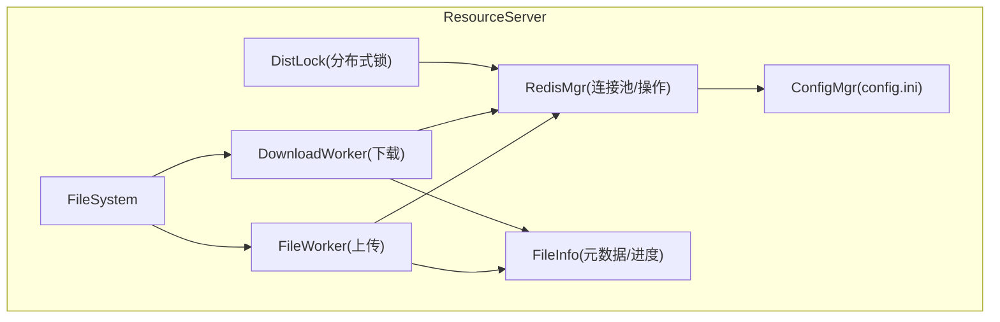
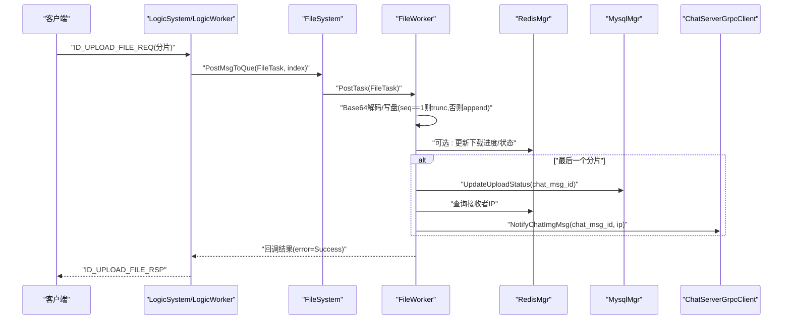
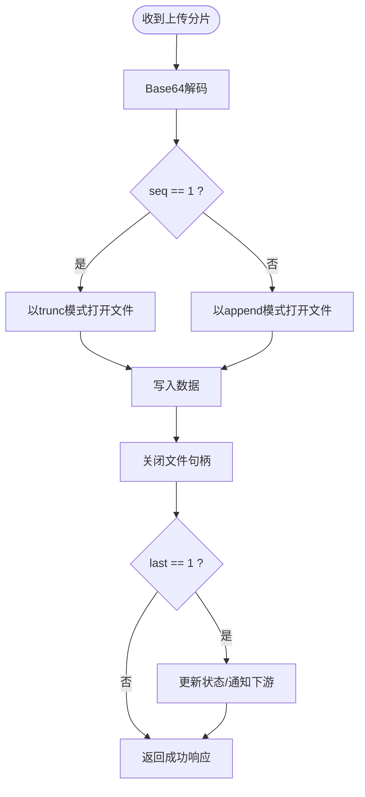
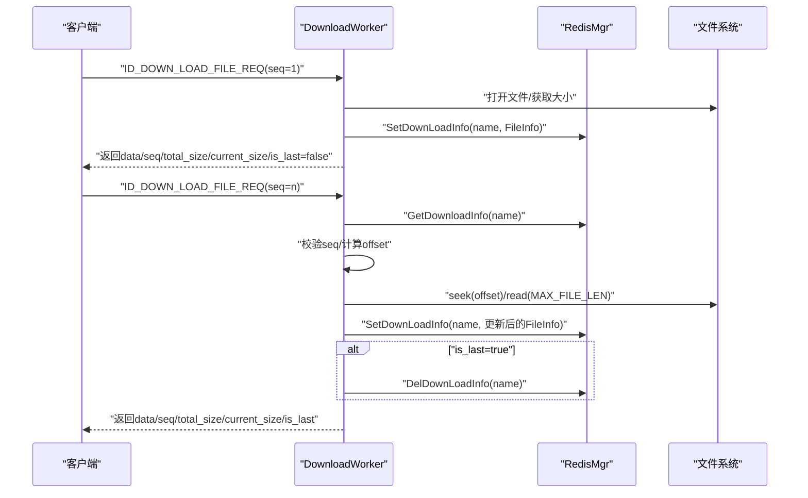
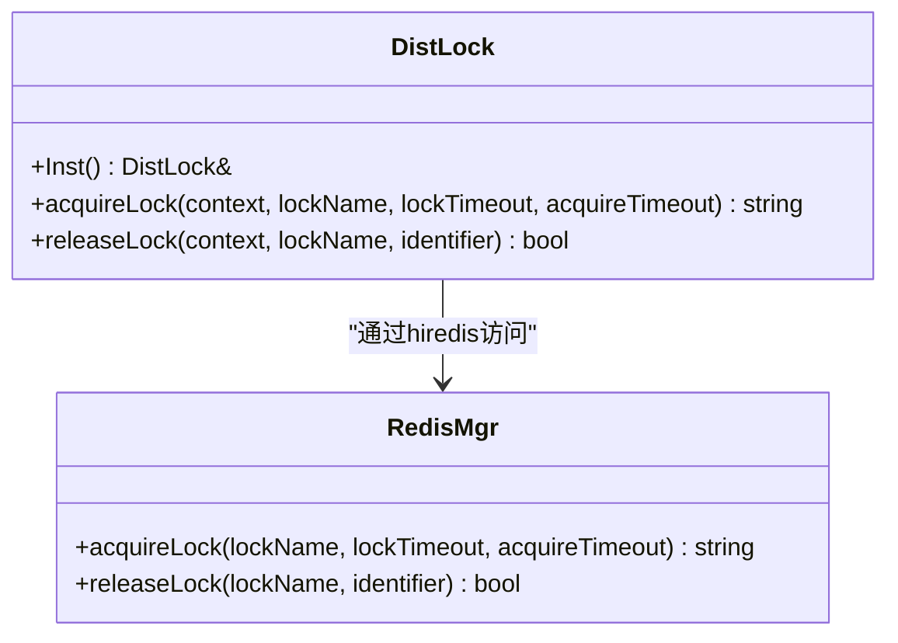
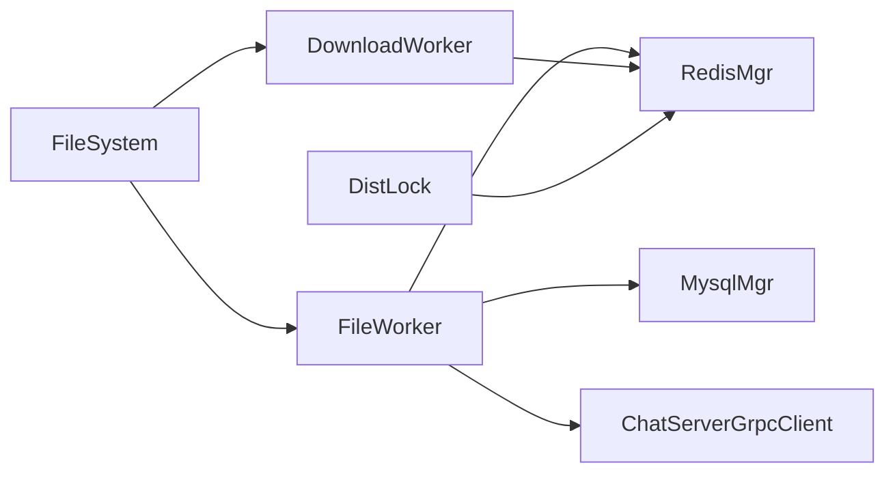

# 断点续传与分片处理

<cite>
**本文引用的文件**   
- [FileWorker.h](file://server\ResourceServer\include\FileWorker.h)
- [FileWorker.cpp](file://server\ResourceServer\src\FileWorker.cpp)
- [FileSystem.h](file://server\ResourceServer\include\FileSystem.h)
- [FileSystem.cpp](file://server\ResourceServer\src\FileSystem.cpp)
- [DistLock.h](file://server\ResourceServer\include\DistLock.h)
- [DistLock.cpp](file://server\ResourceServer\src\DistLock.cpp)
- [RedisMgr.h](file://server\ResourceServer\include\RedisMgr.h)
- [RedisMgr.cpp](file://server\ResourceServer\src\RedisMgr.cpp)
- [FileInfo.h](file://server\ResourceServer\include\FileInfo.h)
- [const.h](file://server\ResourceServer\include\const.h)
- [config.ini](file://server\ResourceServer\config\config.ini)
</cite>

## 目录
1. [引言](#引言)
2. [项目结构](#项目结构)
3. [核心组件](#核心组件)
4. [架构总览](#架构总览)
5. [详细组件分析](#详细组件分析)
6. [依赖关系分析](#依赖关系分析)
7. [性能考虑](#性能考虑)
8. [故障排查指南](#故障排查指南)
9. [结论](#结论)

## 引言
本技术文档聚焦 ResourceServer 的断点续传与分片处理功能，系统性阐述分片上传的核心算法（分片大小计算、并发控制、顺序保证）、断点续传的完整流程（分片状态管理、进度跟踪、冲突解决）、分布式锁在文件上传中的应用（Redis 实现、死锁预防、超时处理）、分片合并优化策略（并行写入、内存管理、I/O 优化）、文件完整性验证机制（分片校验、整体校验、损坏检测），以及分片缓存与清理策略（临时文件管理、存储空间优化、异常恢复）。同时提供性能调优指南与常见问题的排查方法。

## 项目结构
ResourceServer 的分片与续传相关代码主要分布在以下模块：
- 任务与工作线程：FileWorker/DownloadWorker 负责上传与下载的异步处理
- 文件系统调度：FileSystem 维护多个 FileWorker/DownloadWorker 实例，进行任务分发
- 分布式锁：DistLock 基于 Redis 实现原子加锁与释放
- 持久化与状态：RedisMgr 提供连接池、键值操作、下载进度存储等
- 数据结构：FileInfo/ChatImgInfo 描述文件元数据与下载进度
- 常量与错误码：const.h 定义消息 ID、错误码、分片大小、锁超时等
- 配置：config.ini 定义 Redis/Mysql/服务端口等

**图表来源** 
- [FileSystem.h:1-21](file://server\ResourceServer\include\FileSystem.h#L1-L21)
- [FileSystem.cpp:1-29](file://server\ResourceServer\src\FileSystem.cpp#L1-L29)
- [FileWorker.h:1-90](file://server\ResourceServer\include\FileWorker.h#L1-L90)
- [FileWorker.cpp:1-663](file://server\ResourceServer\src\FileWorker.cpp#L1-L663)
- [DistLock.h:1-18](file://server\ResourceServer\include\DistLock.h#L1-L18)
- [DistLock.cpp:1-73](file://server\ResourceServer\src\DistLock.cpp#L1-L73)
- [RedisMgr.h:1-313](file://server\ResourceServer\include\RedisMgr.h#L1-L313)
- [RedisMgr.cpp:1-200](file://server\ResourceServer\src\RedisMgr.cpp#L1-L200)
- [FileInfo.h:1-26](file://server\ResourceServer\include\FileInfo.h#L1-L26)
- [const.h:1-117](file://server\ResourceServer\include\const.h#L1-L117)
- [config.ini:1-27](file://server\ResourceServer\config\config.ini#L1-L27)

**章节来源**
- [FileSystem.h:1-21](file://server\ResourceServer\include\FileSystem.h#L1-L21)
- [FileSystem.cpp:1-29](file://server\ResourceServer\src\FileSystem.cpp#L1-L29)
- [FileWorker.h:1-90](file://server\ResourceServer\include\FileWorker.h#L1-L90)
- [FileWorker.cpp:1-663](file://server\ResourceServer\src\FileWorker.cpp#L1-L663)
- [DistLock.h:1-18](file://server\ResourceServer\include\DistLock.h#L1-L18)
- [DistLock.cpp:1-73](file://server\ResourceServer\src\DistLock.cpp#L1-L73)
- [RedisMgr.h:1-313](file://server\ResourceServer\include\RedisMgr.h#L1-L313)
- [RedisMgr.cpp:1-200](file://server\ResourceServer\src\RedisMgr.cpp#L1-L200)
- [FileInfo.h:1-26](file://server\ResourceServer\include\FileInfo.h#L1-L26)
- [const.h:1-117](file://server\ResourceServer\include\const.h#L1-L117)
- [config.ini:1-27](file://server\ResourceServer\config\config.ini#L1-L27)

## 核心组件
- FileWorker：上传任务处理器，支持普通文件、头像、聊天图片、文件信息同步、续传图片等多种场景；内部通过 Base64 解码后按序写入磁盘，并在最后一个分片时触发后续业务逻辑（如更新数据库、通知 ChatServer）。
- DownloadWorker：下载任务处理器，实现分片读取、Base64 编码、断点续传状态在 Redis 中的维护，支持序列号校验、偏移量计算、最后分片判断与进度清理。
- FileSystem：单例，维护多实例 FileWorker/DownloadWorker，按哈希将任务路由到不同 worker，提升并发吞吐。
- DistLock：基于 Redis SET NX EX 的分布式锁，使用 Lua 脚本原子释放，避免误删与死锁。
- RedisMgr：连接池 + 常用命令封装，包含下载进度 Set/Get/Del、锁获取/释放等。
- FileInfo：记录文件名、总大小、已传输大小、当前分片序号、文件路径等。
- const：错误码、消息 ID、分片大小 MAX_FILE_LEN、锁超时等全局常量。

**章节来源**
- [FileWorker.h:1-90](file://server\ResourceServer\include\FileWorker.h#L1-L90)
- [FileWorker.cpp:1-663](file://server\ResourceServer\src\FileWorker.cpp#L1-L663)
- [FileSystem.h:1-21](file://server\ResourceServer\include\FileSystem.h#L1-L21)
- [FileSystem.cpp:1-29](file://server\ResourceServer\src\FileSystem.cpp#L1-L29)
- [DistLock.h:1-18](file://server\ResourceServer\include\DistLock.h#L1-L18)
- [DistLock.cpp:1-73](file://server\ResourceServer\src\DistLock.cpp#L1-L73)
- [RedisMgr.h:1-313](file://server\ResourceServer\include\RedisMgr.h#L1-L313)
- [RedisMgr.cpp:1-200](file://server\ResourceServer\src\RedisMgr.cpp#L1-L200)
- [FileInfo.h:1-26](file://server\ResourceServer\include\FileInfo.h#L1-L26)
- [const.h:1-117](file://server\ResourceServer\include\const.h#L1-L117)

## 架构总览
下图展示了上传与下载的关键调用链路与组件交互。

**图表来源** 
- [FileWorker.cpp:49-112](file://server\ResourceServer\src\FileWorker.cpp#L49-L112)
- [FileWorker.cpp:199-283](file://server\ResourceServer\src\FileWorker.cpp#L199-L283)
- [FileWorker.cpp:372-456](file://server\ResourceServer\src\FileWorker.cpp#L372-L456)
- [FileSystem.cpp:9-17](file://server\ResourceServer\src\FileSystem.cpp#L9-L17)

**章节来源**
- [FileWorker.cpp:1-663](file://server\ResourceServer\src\FileWorker.cpp#L1-L663)
- [FileSystem.cpp:1-29](file://server\ResourceServer\src\FileSystem.cpp#L1-L29)

## 详细组件分析

### 分片上传核心算法
- 分片大小计算：固定分片大小由常量 MAX_FILE_LEN 决定（默认 32KB），客户端按此大小切分文件，服务端以 seq 标识分片序号，last 标记是否为最后一个分片。
- 并发控制：FileSystem 持有 FILE_WORKER_COUNT 个 FileWorker，任务通过 name 哈希取模分配到不同 worker，避免同一文件竞争，提高吞吐。
- 顺序保证：每个 FileWorker 内部为单线程队列，按入队顺序串行执行；seq 用于客户端侧顺序控制，服务端对 seq==1 采用 trunc 模式创建/清空文件，其他分片采用 append 追加。
- 写入策略：首个分片打开文件时使用 trunc 模式，后续分片使用 append 模式，确保分片顺序写入不覆盖。
- 收尾逻辑：当 last==1 时，触发业务后置动作（如更新数据库状态、查询接收者在线状态并通知 ChatServer）。

**图表来源** 
- [FileWorker.cpp:51-112](file://server\ResourceServer\src\FileWorker.cpp#L51-L112)
- [FileWorker.cpp:199-283](file://server\ResourceServer\src\FileWorker.cpp#L199-L283)
- [FileWorker.cpp:372-456](file://server\ResourceServer\src\FileWorker.cpp#L372-L456)
- [const.h:114-114](file://server\ResourceServer\include\const.h#L114-L114)

**章节来源**
- [FileWorker.cpp:1-663](file://server\ResourceServer\src\FileWorker.cpp#L1-L663)
- [const.h:1-117](file://server\ResourceServer\include\const.h#L1-L117)

### 断点续传完整流程
- 首次下载：DownloadWorker 在 seq==1 时读取文件大小，构造 FileInfo 并立即写入 Redis（覆盖旧数据），设置过期时间。
- 续传下载：非首包从 Redis 获取历史进度，校验 seq 是否匹配，计算 offset=(seq-1)*MAX_FILE_LEN，定位读取，Base64 编码后返回。
- 进度更新：若非最后分片，递增 seq 并更新 trans_size，写回 Redis；若是最后分片，删除 Redis 中的下载进度。
- 错误处理：Redis 无进度或 seq 不匹配、offset 越界、读取失败等，均返回对应错误码。

**图表来源** 
- [FileWorker.cpp:528-662](file://server\ResourceServer\src\FileWorker.cpp#L528-L662)
- [RedisMgr.h:303-307](file://server\ResourceServer\include\RedisMgr.h#L303-L307)

**章节来源**
- [FileWorker.cpp:528-662](file://server\ResourceServer\src\FileWorker.cpp#L528-L662)
- [RedisMgr.h:303-307](file://server\ResourceServer\include\RedisMgr.h#L303-L307)

### 分布式锁在文件上传中的应用
- 获取锁：使用 Redis SET key identifier NX EX lockTimeout 原子设置，循环重试直到 acquireTimeout 超时。
- 释放锁：使用 Lua 脚本比较 value 是否等于 identifier，相等则 DEL，避免误删他人持有的锁。
- 死锁预防：identifier 唯一性（UUID）+ EX 过期时间 + Lua 原子释放，防止进程崩溃导致锁永久占用。
- 超时处理：acquireTimeout 限制等待时间，lockTimeout 限制持有时间，避免长时间阻塞。

**图表来源** 
- [DistLock.h:1-18](file://server\ResourceServer\include\DistLock.h#L1-L18)
- [DistLock.cpp:27-73](file://server\ResourceServer\src\DistLock.cpp#L27-L73)
- [RedisMgr.h:293-297](file://server\ResourceServer\include\RedisMgr.h#L293-L297)

**章节来源**
- [DistLock.cpp:1-73](file://server\ResourceServer\src\DistLock.cpp#L1-L73)
- [RedisMgr.h:293-297](file://server\ResourceServer\include\RedisMgr.h#L293-L297)

### 分片合并优化策略
- 并行写入：通过 FileSystem 的多 FileWorker 实例，按 name 哈希分流，避免同一文件的写竞争，提升并发度。
- 内存管理：分片数据以字符串形式传递，避免大对象常驻内存；Base64 编解码在分片级别进行，降低峰值内存。
- I/O 优化：首个分片使用 trunc 创建/清空文件，后续分片使用 append 追加，减少随机写开销；文件句柄及时关闭，避免资源泄漏。
- 批量与缓冲：可结合操作系统页缓存与 OS 级 I/O 调度，配合合理的 MAX_FILE_LEN 平衡网络与磁盘 I/O。

**章节来源**
- [FileSystem.cpp:19-28](file://server\ResourceServer\src\FileSystem.cpp#L19-L28)
- [FileWorker.cpp:51-112](file://server\ResourceServer\src\FileWorker.cpp#L51-L112)
- [const.h:114-114](file://server\ResourceServer\include\const.h#L114-L114)

### 文件完整性验证机制
- 分片校验：当前实现未对每个分片进行独立校验（如 MD5/CRC），建议在客户端与服务端增加分片校验字段，并在写入前校验。
- 整体校验：可在最后一个分片完成后，计算整文件校验值（如 MD5），并与客户端提供的校验值比对，确保一致性。
- 损坏检测：若发现不一致，应拒绝合并并返回错误码，提示客户端重新上传；同时清理可能存在的中间文件。

[本节为通用设计建议，不直接分析具体文件]

### 分片缓存与清理策略
- 临时文件管理：上传过程中按 name 生成目标路径，首个分片即创建文件，后续分片追加；下载进度存储在 Redis，避免本地状态不一致。
- 存储空间优化：合理设置 Redis 中下载进度的过期时间，避免长期占用；定期清理无效或过期的中间文件。
- 异常恢复：若上传中断，客户端可通过“续传”接口携带最新 seq 继续；服务端根据 last 标志完成收尾逻辑。

**章节来源**
- [FileWorker.cpp:51-112](file://server\ResourceServer\src\FileWorker.cpp#L51-L112)
- [FileWorker.cpp:528-662](file://server\ResourceServer\src\FileWorker.cpp#L528-L662)
- [RedisMgr.h:303-307](file://server\ResourceServer\include\RedisMgr.h#L303-L307)

## 依赖关系分析
- FileWorker 依赖 RedisMgr 进行状态读写（下载进度、用户信息等），依赖 MysqlMgr 更新上传状态，依赖 ChatServerGrpcClient 通知下游。
- DownloadWorker 依赖 RedisMgr 维护下载进度，依赖文件系统 API 进行分片读取。
- FileSystem 依赖 const.h 中的 FILE_WORKER_COUNT/DOWN_LOAD_WORKER_COUNT 初始化工作线程池。
- DistLock 依赖 hiredis 与 Redis 服务器，通过 Lua 脚本保证原子性。

**图表来源** 
- [FileWorker.cpp:1-663](file://server\ResourceServer\src\FileWorker.cpp#L1-L663)
- [FileSystem.cpp:1-29](file://server\ResourceServer\src\FileSystem.cpp#L1-L29)
- [DistLock.cpp:1-73](file://server\ResourceServer\src\DistLock.cpp#L1-L73)
- [RedisMgr.h:1-313](file://server\ResourceServer\include\RedisMgr.h#L1-L313)

**章节来源**
- [FileWorker.cpp:1-663](file://server\ResourceServer\src\FileWorker.cpp#L1-L663)
- [FileSystem.cpp:1-29](file://server\ResourceServer\src\FileSystem.cpp#L1-L29)
- [DistLock.cpp:1-73](file://server\ResourceServer\src\DistLock.cpp#L1-L73)
- [RedisMgr.h:1-313](file://server\ResourceServer\include\RedisMgr.h#L1-L313)

## 性能考虑
- 分片大小选择：MAX_FILE_LEN 影响网络往返与磁盘 I/O 效率，过大导致内存压力与重传代价高，过小增加请求次数；建议根据网络带宽与磁盘特性调优。
- 并发度：FILE_WORKER_COUNT 与 DOWN_LOAD_WORKER_COUNT 应与 CPU 核数与磁盘 I/O 能力匹配，避免过多线程造成上下文切换开销。
- Redis 连接池：RedisConPool 的大小与心跳检测频率需合理设置，避免连接耗尽与频繁重建。
- I/O 模式：优先使用顺序写（append）与顺序读（seek+offset），减少随机 I/O；必要时启用异步 I/O 或零拷贝技术。
- 序列化开销：Base64 编解码带来 CPU 开销，可考虑二进制协议或压缩以减少体积。

[本节为通用指导，不直接分析具体文件]

## 故障排查指南
- 上传失败（权限/路径）：检查文件路径是否存在、是否有写权限；确认首个分片是否成功创建文件。
- 续传失败（Redis 无进度/seq 不匹配）：确认 Redis 中是否存在下载进度且 seq 一致；检查过期策略是否过早清理。
- 下载偏移越界：校验 offset=(seq-1)*MAX_FILE_LEN 是否小于 total_size；检查 last 标志是否正确。
- 分布式锁问题：确认 acquireTimeout 与 lockTimeout 是否合理；检查 Lua 脚本释放是否成功，避免误删。
- 性能瓶颈：监控 Redis 连接池使用率、CPU 使用率、磁盘 I/O 延迟；调整分片大小与工作线程数量。

**章节来源**
- [FileWorker.cpp:51-112](file://server\ResourceServer\src\FileWorker.cpp#L51-L112)
- [FileWorker.cpp:528-662](file://server\ResourceServer\src\FileWorker.cpp#L528-L662)
- [DistLock.cpp:27-73](file://server\ResourceServer\src\DistLock.cpp#L27-L73)
- [const.h:5-29](file://server\ResourceServer\include\const.h#L5-L29)

## 结论
ResourceServer 的分片与断点续传方案通过稳定的工作线程模型、Redis 状态管理与分布式锁，实现了高可靠、可扩展的文件上传与下载能力。建议在现有基础上增强分片与整体校验、优化 I/O 与内存管理，并根据实际负载调优分片大小与工作线程数量，以获得更佳的性能与稳定性。