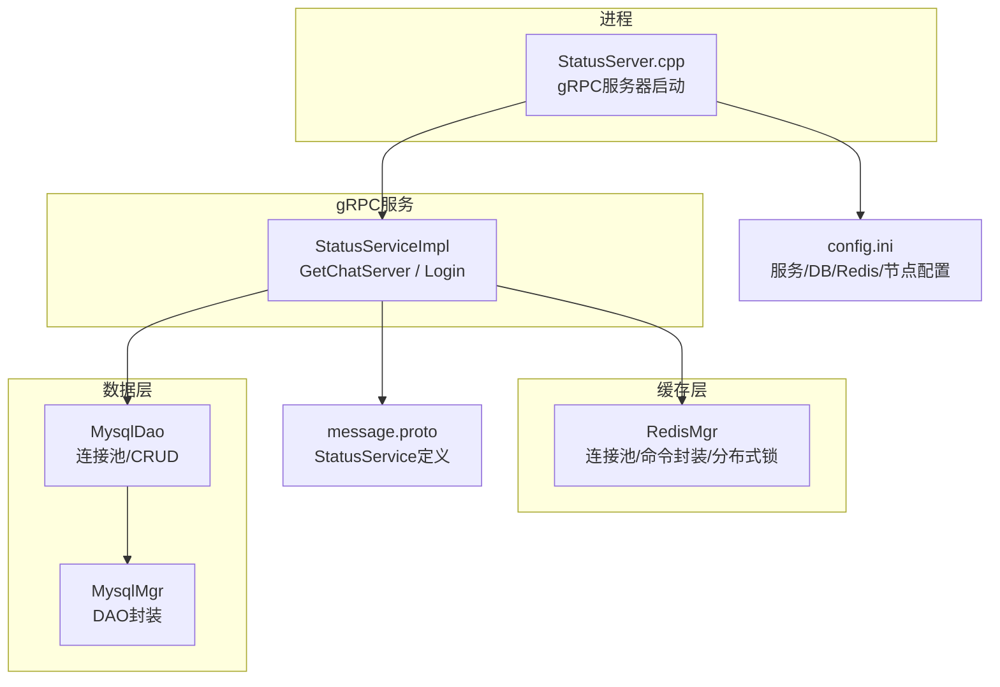
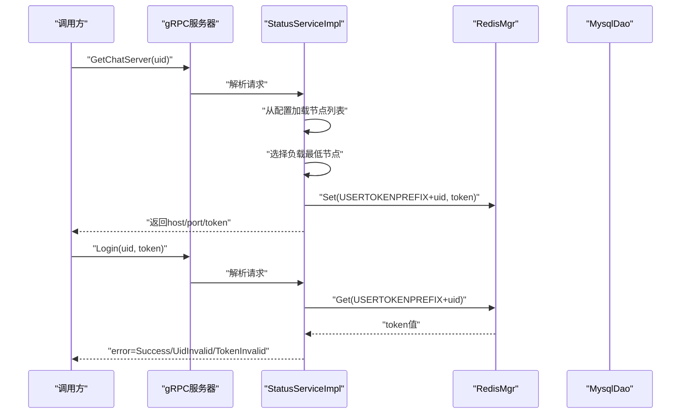
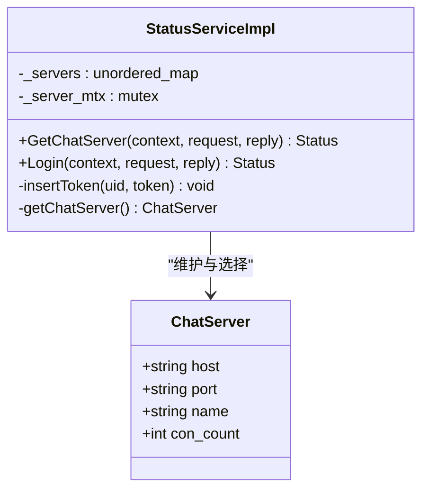
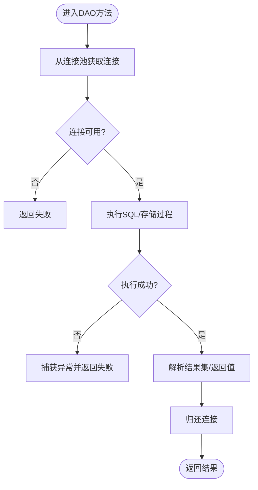
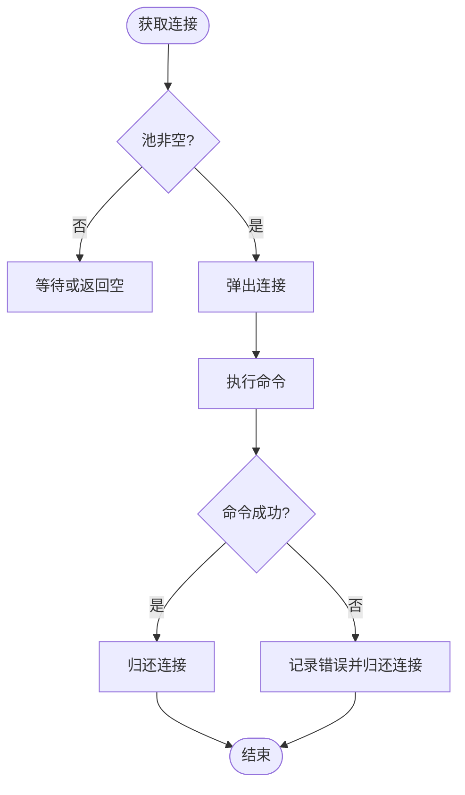
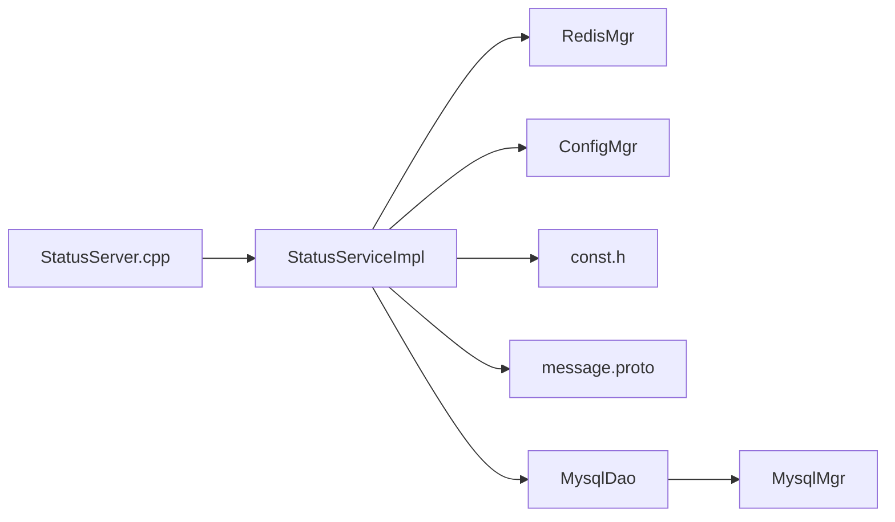

# StatusServer状态服务

<cite>
**本文引用的文件**   
- [StatusServiceImpl.h](file://server/StatusServer/include/StatusServiceImpl.h)
- [StatusServiceImpl.cpp](file://server/StatusServer/src/StatusServiceImpl.cpp)
- [MysqlDao.h](file://server/StatusServer/include/MysqlDao.h)
- [MysqlDao.cpp](file://server/StatusServer/src/MysqlDao.cpp)
- [RedisMgr.h](file://server/StatusServer/include/RedisMgr.h)
- [RedisMgr.cpp](file://server/StatusServer/src/RedisMgr.cpp)
- [const.h](file://server/StatusServer/include/const.h)
- [config.ini](file://server/StatusServer/config/config.ini)
- [message.proto](file://server/proto/chat/message.proto)
- [StatusServer.cpp](file://server/StatusServer/src/StatusServer.cpp)
</cite>

## 目录
1. [简介](#简介)
2. [项目结构](#项目结构)
3. [核心组件](#核心组件)
4. [架构总览](#架构总览)
5. [详细组件分析](#详细组件分析)
6. [依赖关系分析](#依赖关系分析)
7. [性能考虑](#性能考虑)
8. [故障排查指南](#故障排查指南)
9. [结论](#结论)
10. [附录：API接口与集成示例](#附录api接口与集成示例)

## 简介
本技术文档围绕 StatusServer 状态管理服务展开，重点阐述基于 gRPC 的状态服务实现 StatusServiceImpl，涵盖用户在线状态管理、聊天服务节点注册与发现、负载均衡统计等能力。同时详细说明 MysqlDao 数据访问层如何实现用户相关数据的持久化（如登录校验、密码更新、邮箱校验等），以及 RedisMgr 缓存层如何优化热点数据访问（如 Token 校验、分布式锁、计数器等）。此外，文档还解释分布式环境下的状态同步机制、健康检查与自动恢复策略，并提供状态查询 API 接口说明与集成示例，帮助读者快速理解与落地使用。

## 项目结构
StatusServer 位于 server/StatusServer 目录下，采用分层设计：
- 服务入口与进程启动：StatusServer.cpp
- gRPC 服务实现：StatusServiceImpl.h/.cpp
- 配置管理：ConfigMgr（单例）与 config.ini
- 数据访问层：MysqlDao（MySQL 连接池、DAO 方法）、MysqlMgr（对外封装）
- 缓存与分布式能力：RedisMgr（连接池、常用命令封装、分布式锁）
- 常量与公共类型：const.h（错误码、键前缀、工具类 Defer）
- gRPC 协议定义：message.proto（StatusService 及消息体）

图示来源
- [StatusServer.cpp:1-72](file://server/StatusServer/src/StatusServer.cpp#L1-L72)
- [StatusServiceImpl.h:1-52](file://server/StatusServer/include/StatusServiceImpl.h#L1-L52)
- [RedisMgr.h:1-300](file://server/StatusServer/include/RedisMgr.h#L1-L300)
- [MysqlDao.h:1-149](file://server/StatusServer/include/MysqlDao.h#L1-L149)
- [config.ini:1-23](file://server/StatusServer/config/config.ini#L1-L23)
- [message.proto:1-167](file://server/proto/chat/message.proto#L1-L167)

章节来源
- [StatusServer.cpp:1-72](file://server/StatusServer/src/StatusServer.cpp#L1-L72)
- [config.ini:1-23](file://server/StatusServer/config/config.ini#L1-L23)

## 核心组件
- gRPC 服务实现 StatusServiceImpl
  - 提供 GetChatServer（获取聊天服务器地址与Token）和 Login（Token校验）两个 RPC。
  - 内部维护 ChatServer 列表（名称、主机、端口、连接数），用于负载均衡选择。
  - 通过 Redis 存储与校验用户 Token，防止重复登录或非法 Token。
- 数据访问层 MysqlDao
  - 封装 MySQL 连接池、连接保活、异常处理。
  - 提供用户注册、邮箱校验、密码更新、密码校验等方法。
- 缓存层 RedisMgr
  - 封装 Redis 连接池、常用命令（GET/SET/HSET/HGET/LPUSH/RPOP/DEL/EXISTS 等）。
  - 提供分布式锁 acquireLock/releaseLock。
  - 后台线程定期 PING 检测连接健康并自动重连。
- 配置与常量
  - ConfigMgr 读取 INI 配置（服务端口、数据库、Redis、聊天服务节点列表等）。
  - const.h 定义错误码、键前缀（如 USERTOKENPREFIX、LOGIN_COUNT 等）与工具类 Defer。

章节来源
- [StatusServiceImpl.h:1-52](file://server/StatusServer/include/StatusServiceImpl.h#L1-L52)
- [StatusServiceImpl.cpp:1-125](file://server/StatusServer/src/StatusServiceImpl.cpp#L1-L125)
- [MysqlDao.h:1-149](file://server/StatusServer/include/MysqlDao.h#L1-L149)
- [MysqlDao.cpp:1-172](file://server/StatusServer/src/MysqlDao.cpp#L1-L172)
- [RedisMgr.h:1-300](file://server/StatusServer/include/RedisMgr.h#L1-L300)
- [RedisMgr.cpp:1-431](file://server/StatusServer/src/RedisMgr.cpp#L1-L431)
- [const.h:1-76](file://server/StatusServer/include/const.h#L1-L76)
- [config.ini:1-23](file://server/StatusServer/config/config.ini#L1-L23)

## 架构总览
StatusServer 作为独立进程，启动 gRPC 服务监听指定端口，接收客户端或其他服务的请求。核心流程如下：
- GetChatServer：根据配置加载聊天服务节点列表，选择负载较低的节点，生成唯一 Token 并写入 Redis，返回给调用方。
- Login：根据 uid 与 token 在 Redis 中校验，返回成功或失败状态码。
- 数据持久化：通过 MysqlDao 进行用户相关数据的读写（当前主要面向认证与基础信息）。
- 缓存与分布式：通过 RedisMgr 完成 Token 缓存、分布式锁、计数器等功能。

图示来源
- [StatusServer.cpp:1-72](file://server/StatusServer/src/StatusServer.cpp#L1-L72)
- [StatusServiceImpl.cpp:1-125](file://server/StatusServer/src/StatusServiceImpl.cpp#L1-L125)
- [RedisMgr.cpp:1-431](file://server/StatusServer/src/RedisMgr.cpp#L1-L431)
- [message.proto:1-167](file://server/proto/chat/message.proto#L1-L167)

## 详细组件分析

### gRPC 服务实现 StatusServiceImpl
- 职责
  - 暴露 StatusService 的 GetChatServer 与 Login 两个 RPC。
  - 维护 ChatServer 列表（名称、主机、端口、连接数），支持简单负载均衡。
  - 通过 Redis 管理用户 Token，确保登录态一致性。
- 关键逻辑
  - 构造时从配置读取 chatservers 列表，初始化 _servers 映射。
  - GetChatServer：生成唯一字符串作为 token，写入 Redis，并返回选中的 ChatServer。
  - Login：根据 uid 拼接 key 到 Redis 查询 token，校验通过后返回成功。
  - insertToken：将 uid 与 token 绑定写入 Redis。
- 并发与一致性
  - 使用互斥量保护 _servers 访问。
  - Token 写入与校验通过 Redis 原子操作保证多实例一致性。

图示来源
- [StatusServiceImpl.h:1-52](file://server/StatusServer/include/StatusServiceImpl.h#L1-L52)
- [StatusServiceImpl.cpp:1-125](file://server/StatusServer/src/StatusServiceImpl.cpp#L1-L125)

章节来源
- [StatusServiceImpl.h:1-52](file://server/StatusServer/include/StatusServiceImpl.h#L1-L52)
- [StatusServiceImpl.cpp:1-125](file://server/StatusServer/src/StatusServiceImpl.cpp#L1-L125)

### 数据访问层 MysqlDao
- 职责
  - 封装 MySQL 连接池 MySqlPool，负责连接创建、归还、保活检测与异常处理。
  - 提供用户注册、邮箱校验、密码更新、密码校验等 DAO 方法。
- 连接池特性
  - 初始化时创建固定数量连接，记录最后使用时间戳。
  - 后台线程周期性执行 SELECT 1 保活，失败则重建连接。
  - 使用条件变量与互斥量保证线程安全。
- CRUD 方法
  - RegUser：调用存储过程 reg_user，返回结果。
  - CheckEmail：按用户名查询邮箱并比对。
  - UpdatePwd：更新用户密码。
  - CheckPwd：按用户名查询密码并填充 UserInfo。

图示来源
- [MysqlDao.h:1-149](file://server/StatusServer/include/MysqlDao.h#L1-L149)
- [MysqlDao.cpp:1-172](file://server/StatusServer/src/MysqlDao.cpp#L1-L172)

章节来源
- [MysqlDao.h:1-149](file://server/StatusServer/include/MysqlDao.h#L1-L149)
- [MysqlDao.cpp:1-172](file://server/StatusServer/src/MysqlDao.cpp#L1-L172)

### 缓存层 RedisMgr
- 职责
  - 封装 Redis 连接池 RedisConPool，提供 GET/SET/HSET/HGET/LPUSH/RPOP/DEL/EXISTS 等命令。
  - 提供分布式锁 acquireLock/releaseLock。
  - 后台线程定时 PING 检测连接健康，失败则重建连接并放回池中。
- 热点数据优化
  - Token 校验：通过 USERTOKENPREFIX+uid 快速获取与验证。
  - 计数器：如 LOGIN_COUNT 可用于统计各节点登录次数（代码中有预留逻辑）。
  - 分布式锁：用于跨实例的互斥操作。
- 健康检查与自动恢复
  - 每 60 秒触发一次 checkThreadPro，对每个连接执行 PING。
  - 失败连接释放并重连，保持池内连接可用性。

图示来源
- [RedisMgr.h:1-300](file://server/StatusServer/include/RedisMgr.h#L1-L300)
- [RedisMgr.cpp:1-431](file://server/StatusServer/src/RedisMgr.cpp#L1-L431)

章节来源
- [RedisMgr.h:1-300](file://server/StatusServer/include/RedisMgr.h#L1-L300)
- [RedisMgr.cpp:1-431](file://server/StatusServer/src/RedisMgr.cpp#L1-L431)

### 配置与常量
- 配置项
  - StatusServer：Host、Port
  - Mysql：Host、Port、User、Passwd、Schema
  - Redis：Host、Port、Passwd
  - chatservers：Name（逗号分隔的节点名列表）
  - chatserverX：Name、Host、Port（具体节点信息）
- 常量
  - ErrorCodes：统一错误码（Success、TokenInvalid、UidInvalid 等）
  - 键前缀：USERTOKENPREFIX、IPCOUNTPREFIX、USER_BASE_INFO、LOGIN_COUNT 等
  - 分布式锁超时参数：LOCK_TIME_OUT、ACQUIRE_TIME_OUT
  - Defer：RAII式资源释放辅助类

章节来源
- [config.ini:1-23](file://server/StatusServer/config/config.ini#L1-L23)
- [const.h:1-76](file://server/StatusServer/include/const.h#L1-L76)

## 依赖关系分析
- StatusServer 进程依赖 gRPC 框架、Boost.Asio、JSON、Hiredis、MySQL Connector/C++。
- StatusServiceImpl 依赖 ConfigMgr、RedisMgr、const.h。
- MysqlDao 依赖 ConfigMgr、MySQL JDBC。
- RedisMgr 依赖 Hiredis、DistLock（分布式锁实现）。
- message.proto 定义了 StatusService 及其请求/响应结构。

图示来源
- [StatusServer.cpp:1-72](file://server/StatusServer/src/StatusServer.cpp#L1-L72)
- [StatusServiceImpl.h:1-52](file://server/StatusServer/include/StatusServiceImpl.h#L1-L52)
- [RedisMgr.h:1-300](file://server/StatusServer/include/RedisMgr.h#L1-L300)
- [MysqlDao.h:1-149](file://server/StatusServer/include/MysqlDao.h#L1-L149)
- [message.proto:1-167](file://server/proto/chat/message.proto#L1-L167)

章节来源
- [StatusServer.cpp:1-72](file://server/StatusServer/src/StatusServer.cpp#L1-L72)
- [StatusServiceImpl.h:1-52](file://server/StatusServer/include/StatusServiceImpl.h#L1-L52)
- [RedisMgr.h:1-300](file://server/StatusServer/include/RedisMgr.h#L1-L300)
- [MysqlDao.h:1-149](file://server/StatusServer/include/MysqlDao.h#L1-L149)
- [message.proto:1-167](file://server/proto/chat/message.proto#L1-L167)

## 性能考虑
- 连接池
  - MySQL 连接池固定大小，避免频繁创建销毁；后台线程保活减少断链影响。
  - Redis 连接池同样固定大小，PING 保活与自动重连提升稳定性。
- 缓存命中
  - Token 校验走 Redis，O(1) 时间复杂度，显著降低数据库压力。
  - 可结合 LOGIN_COUNT 做节点级负载均衡（代码中有预留逻辑）。
- 并发控制
  - 使用互斥量保护共享数据结构（如 _servers）。
  - 条件变量协调连接池获取与归还，避免忙轮询。
- I/O 模型
  - gRPC 多线程处理请求；Asio io_context 用于信号处理与优雅关闭。
- 建议
  - 合理设置连接池大小与超时参数，依据压测结果调优。
  - 对热点 Key 设置过期时间，避免内存膨胀。
  - 监控 Redis 与 MySQL 的连接池命中率与延迟。

[本节为通用性能指导，不直接分析具体文件]

## 故障排查指南
- gRPC 服务无法启动
  - 检查 config.ini 中 StatusServer.Host/Port 是否正确。
  - 确认端口未被占用。
- Token 校验失败
  - 检查 Redis 是否可达，AUTH 是否成功。
  - 确认 USERTOKENPREFIX 前缀一致。
  - 查看 Login 返回的错误码：UidInvalid、TokenInvalid。
- 数据库连接异常
  - 检查 Mysql 配置（Host、Port、User、Passwd、Schema）。
  - 观察连接池保活线程日志，确认 SELECT 1 是否成功。
  - 若连接失效，检查自动重连逻辑是否生效。
- Redis 连接不稳定
  - 观察后台 PING 线程日志，确认连接健康。
  - 失败连接会释放并重连，关注重连成功率。
- 分布式锁问题
  - 使用 RedisMgr.acquireLock/releaseLock 时，确保 identifier 正确且释放时机合理。
  - 注意锁超时与重试参数（LOCK_TIME_OUT、ACQUIRE_TIME_OUT）。

章节来源
- [StatusServer.cpp:1-72](file://server/StatusServer/src/StatusServer.cpp#L1-L72)
- [StatusServiceImpl.cpp:1-125](file://server/StatusServer/src/StatusServiceImpl.cpp#L1-L125)
- [RedisMgr.cpp:1-431](file://server/StatusServer/src/RedisMgr.cpp#L1-L431)
- [MysqlDao.cpp:1-172](file://server/StatusServer/src/MysqlDao.cpp#L1-L172)
- [const.h:1-76](file://server/StatusServer/include/const.h#L1-L76)

## 结论
StatusServer 通过 gRPC 暴露简洁的状态服务接口，结合 Redis 缓存与 MySQL 持久化，实现了高可用的用户在线状态管理与聊天服务节点发现。其连接池、健康检查与自动恢复机制保障了系统稳定性。配合分布式锁与计数器，可在多实例环境下实现一致性与负载均衡。整体架构清晰、扩展性强，适合在分布式聊天系统中作为状态中心使用。

[本节为总结性内容，不直接分析具体文件]

## 附录：API接口与集成示例
- 接口定义（来自 message.proto）
  - Service: StatusService
  - RPC:
    - GetChatServer(GetChatServerReq) returns (GetChatServerRsp)
    - Login(LoginReq) returns (LoginRsp)
  - 消息体：
    - GetChatServerReq：uid
    - GetChatServerRsp：error、host、port、token
    - LoginReq：uid、token
    - LoginRsp：error、uid、token
- 调用流程示例
  - 客户端先调用 GetChatServer(uid)，服务端返回目标 ChatServer 的地址与临时 token。
  - 客户端携带 uid 与 token 调用 Login，服务端在 Redis 中校验 token，返回成功或错误码。
- 错误码参考（const.h）
  - Success：成功
  - TokenInvalid：Token 无效
  - UidInvalid：UID 无效
  - 其他：RPCFailed、VarifyExpired、VarifyCodeErr、UserExist、PasswdErr、EmailNotMatch、PasswdUpFailed、PasswdInvalid
- 集成要点
  - 确保 Redis 与 MySQL 配置正确。
  - 合理设置 Token 过期时间（可通过 SetWithExpire 实现）。
  - 监控错误码分布，定位异常场景。

章节来源
- [message.proto:1-167](file://server/proto/chat/message.proto#L1-L167)
- [const.h:1-76](file://server/StatusServer/include/const.h#L1-L76)
- [StatusServiceImpl.cpp:1-125](file://server/StatusServer/src/StatusServiceImpl.cpp#L1-L125)