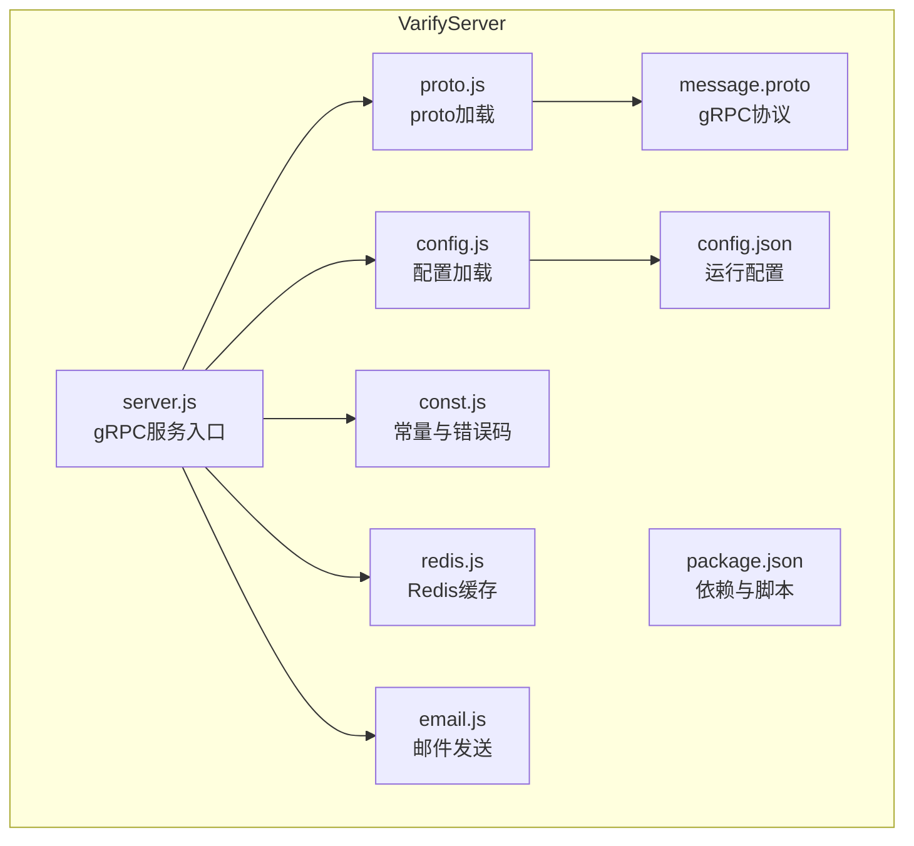
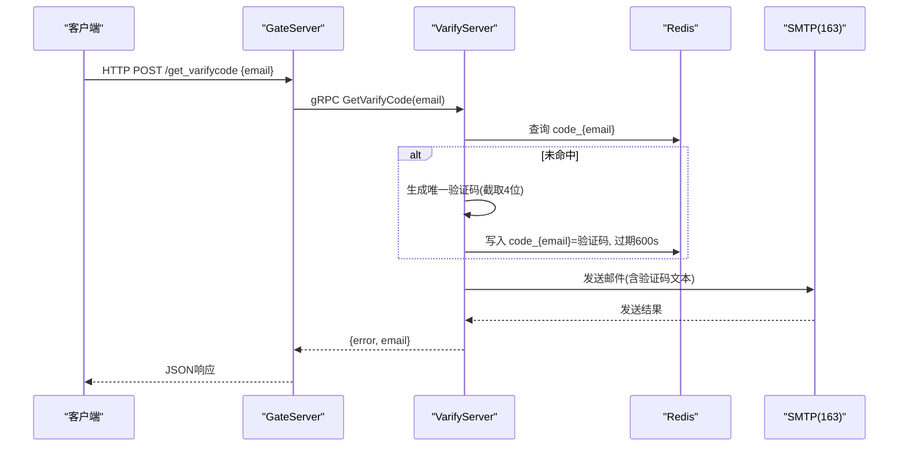
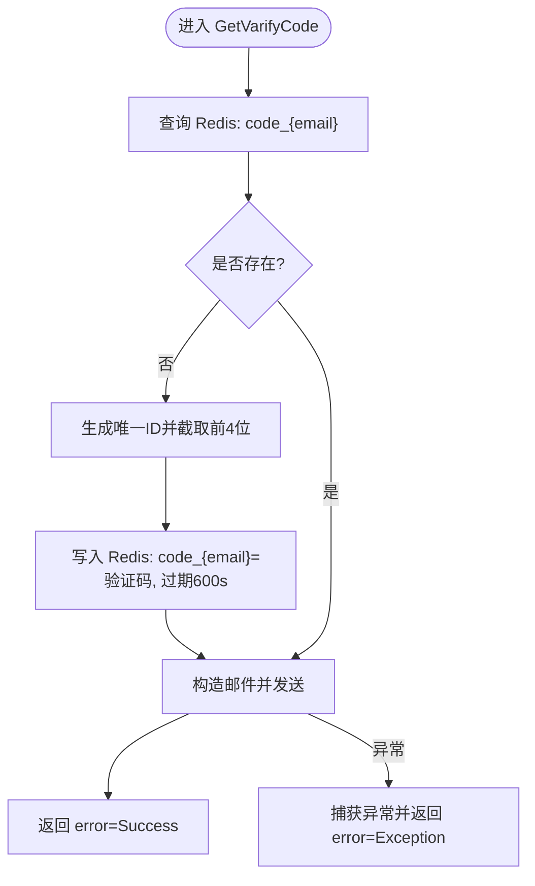
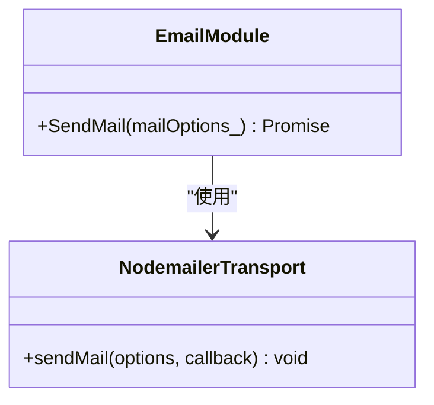
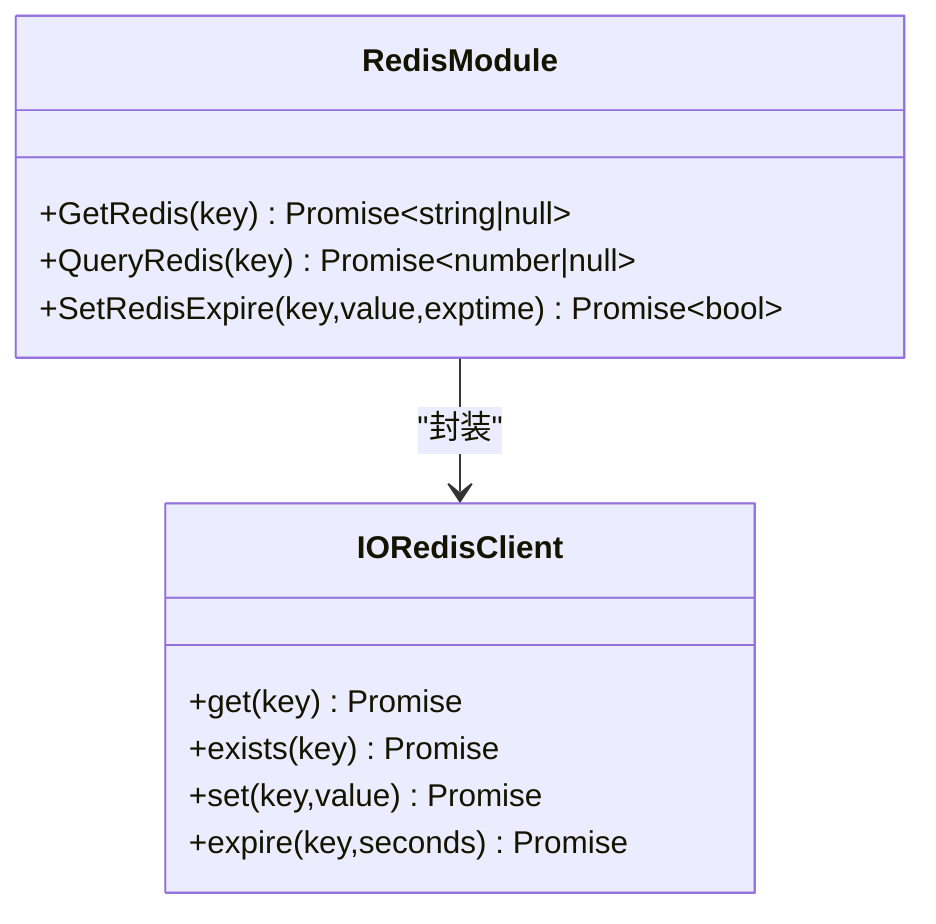
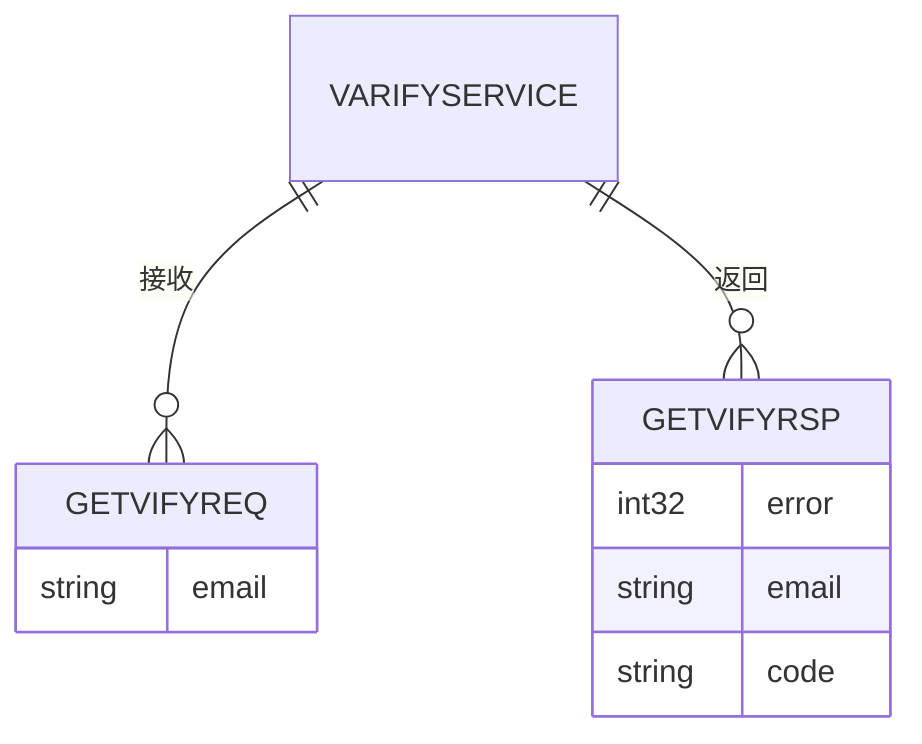
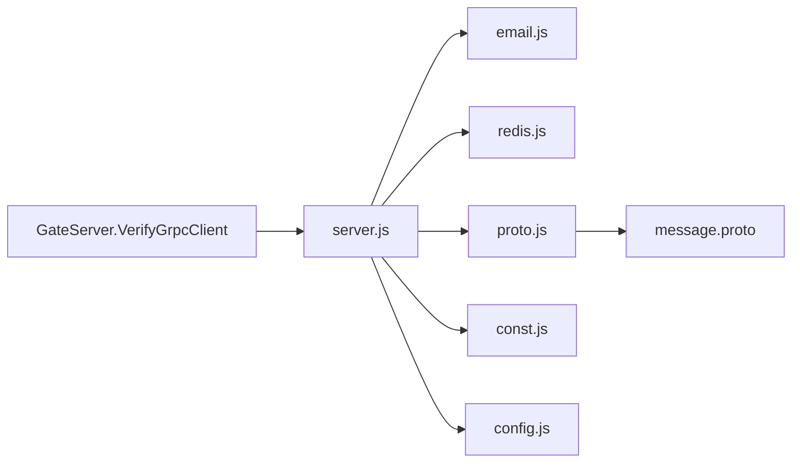

# VarifyServer验证码服务

<cite>
**本文引用的文件**   
- [server.js](file://server/VarifyServer/server.js)
- [email.js](file://server/VarifyServer/email.js)
- [redis.js](file://server/VarifyServer/redis.js)
- [proto.js](file://server/VarifyServer/proto.js)
- [message.proto](file://server/VarifyServer/message.proto)
- [config.js](file://server/VarifyServer/config.js)
- [const.js](file://server/VarifyServer/const.js)
- [package.json](file://server/VarifyServer/package.json)
- [config.json](file://server/VarifyServer/config.json)
- [VerifyGrpcClient.h](file://server/GateServer/include/VerifyGrpcClient.h)
- [VerifyGrpcClient.cpp](file://server/GateServer/src/VerifyGrpcClient.cpp)
- [LogicSystem.cpp](file://server/GateServer/src/LogicSystem.cpp)
- [day10-多服务验证码派发功能调试.md](file://开发文档/day10-多服务验证码派发功能调试.md)
- [day09-redis服务搭建.md](file://开发文档/day09-redis服务搭建.md)
</cite>

## 目录
1. [简介](#简介)
2. [项目结构](#项目结构)
3. [核心组件](#核心组件)
4. [架构总览](#架构总览)
5. [详细组件分析](#详细组件分析)
6. [依赖关系分析](#依赖关系分析)
7. [性能与并发特性](#性能与并发特性)
8. [安全性设计](#安全性设计)
9. [配置与部署指南](#配置与部署指南)
10. [故障排查](#故障排查)
11. [结论](#结论)

## 简介
本技术文档面向VarifyServer验证码服务，基于Node.js实现，提供gRPC接口用于向指定邮箱发送验证码。服务通过Redis缓存验证码并设置过期时间，结合邮件模块（nodemailer）完成SMTP发送；同时定义清晰的gRPC协议（proto），便于GateServer等上游服务调用。文档涵盖系统架构、数据流、错误处理、性能与安全策略，以及配置、部署与排障方法。

## 项目结构
VarifyServer位于server/VarifyServer目录下，采用模块化组织：
- server.js：gRPC服务入口，注册GetVarifyCode RPC，协调Redis与邮件模块
- email.js：封装nodemailer，统一发送邮件
- redis.js：封装ioredis，提供获取、存在性检查、带过期时间的写入及心跳
- proto.js：加载message.proto生成gRPC客户端/服务端类型
- message.proto：定义VarifyService与消息结构
- config.js：从config.json读取运行时配置（邮箱、MySQL、Redis、键前缀）
- const.js：常量与错误码
- package.json：依赖声明与启动脚本
- config.json：环境变量（邮箱账号、Redis连接信息）

**图表来源** 
- [server.js:1-76](file://server/VarifyServer/server.js#L1-L76)
- [email.js:1-37](file://server/VarifyServer/email.js#L1-L37)
- [redis.js:1-101](file://server/VarifyServer/redis.js#L1-L101)
- [proto.js:1-12](file://server/VarifyServer/proto.js#L1-L12)
- [message.proto:1-44](file://server/VarifyServer/message.proto#L1-L44)
- [config.js:1-15](file://server/VarifyServer/config.js#L1-L15)
- [const.js:1-10](file://server/VarifyServer/const.js#L1-L10)
- [package.json:1-19](file://server/VarifyServer/package.json#L1-L19)
- [config.json:1-21](file://server/VarifyServer/config.json#L1-L21)

**章节来源**
- [server.js:1-76](file://server/VarifyServer/server.js#L1-L76)
- [package.json:1-19](file://server/VarifyServer/package.json#L1-L19)

## 核心组件
- gRPC服务层：暴露VarifyService.GetVarifyCode，接收email参数，返回error与email字段
- 邮件模块：使用nodemailer创建SMTP传输，支持SSL端口与授权码认证
- Redis缓存：封装get、exists、set+expire操作，内置连接错误监听与心跳
- 配置与常量：集中管理邮箱、Redis、MySQL连接信息与错误码、键前缀

**章节来源**
- [server.js:15-64](file://server/VarifyServer/server.js#L15-L64)
- [email.js:1-37](file://server/VarifyServer/email.js#L1-L37)
- [redis.js:36-101](file://server/VarifyServer/redis.js#L36-L101)
- [config.js:1-15](file://server/VarifyServer/config.js#L1-L15)
- [const.js:1-10](file://server/VarifyServer/const.js#L1-L10)

## 架构总览
VarifyServer作为独立的gRPC服务，被GateServer通过gRPC客户端调用。GateServer负责HTTP请求解析与业务编排，调用VarifyServer的GetVarifyCode以触发验证码生成与邮件发送。验证码在Redis中以“code_”为前缀的key存储，并设置过期时间。

**图表来源** 
- [server.js:15-64](file://server/VarifyServer/server.js#L15-L64)
- [redis.js:41-98](file://server/VarifyServer/redis.js#L41-L98)
- [email.js:22-35](file://server/VarifyServer/email.js#L22-L35)
- [VerifyGrpcClient.h:87-104](file://server/GateServer/include/VerifyGrpcClient.h#L87-L104)
- [VerifyGrpcClient.cpp:4-9](file://server/GateServer/src/VerifyGrpcClient.cpp#L4-L9)
- [LogicSystem.cpp:110-141](file://server/GateServer/src/LogicSystem.cpp#L110-L141)

## 详细组件分析

### gRPC服务与流程（server.js）
- 服务启动：绑定0.0.0.0:50051，注册VarifyService.GetVarifyCode
- 处理逻辑：
  - 根据email查询Redis中是否已有验证码
  - 若不存在则生成唯一ID并截取前4位，写入Redis并设置600秒过期
  - 构造邮件内容并调用email模块发送
  - 返回成功或异常错误码
- 错误处理：捕获异常并返回通用异常错误码

**图表来源** 
- [server.js:15-64](file://server/VarifyServer/server.js#L15-L64)
- [redis.js:87-98](file://server/VarifyServer/redis.js#L87-L98)

**章节来源**
- [server.js:15-64](file://server/VarifyServer/server.js#L15-L64)

### 邮件模块（email.js）
- 使用nodemailer创建SMTP传输，配置host、port、secure与auth（user/pass）
- SendMail函数封装Promise，返回发送结果或抛出错误
- 配置文件由config.js提供email_user与email_pass

**图表来源** 
- [email.js:1-37](file://server/VarifyServer/email.js#L1-L37)
- [config.js:1-15](file://server/VarifyServer/config.js#L1-L15)

**章节来源**
- [email.js:1-37](file://server/VarifyServer/email.js#L1-L37)

### Redis缓存模块（redis.js）
- 连接配置：从config.js读取host、port、passwd，启用就绪检查，禁用离线队列
- 事件监听：连接错误与断开时自动重连
- 心跳机制：定时写入heartbeat key记录当前时间戳
- API封装：
  - GetRedis(key)：获取值，失败返回null
  - QueryRedis(key)：判断key是否存在
  - SetRedisExpire(key,value,exptime)：设置键值与过期时间（秒）

**图表来源** 
- [redis.js:1-101](file://server/VarifyServer/redis.js#L1-L101)

**章节来源**
- [redis.js:1-101](file://server/VarifyServer/redis.js#L1-L101)

### gRPC协议定义（message.proto）
- 包名：message
- 服务：VarifyService，包含GetVarifyCode RPC
- 请求：GetVarifyReq（email）
- 响应：GetVarifyRsp（error, email, code）
- 其他：StatusService及相关消息（非本服务实现）

**图表来源** 
- [message.proto:1-44](file://server/VarifyServer/message.proto#L1-L44)

**章节来源**
- [message.proto:1-44](file://server/VarifyServer/message.proto#L1-L44)

### 配置与常量（config.js、const.js、config.json）
- config.js：读取config.json中的email、mysql、redis配置，导出email_user、email_pass、redis_host/port/passwd、code_prefix
- const.js：定义Errors枚举（Success、RedisErr、Exception）与code_prefix
- config.json：实际运行配置（邮箱账号、Redis连接信息）

**章节来源**
- [config.js:1-15](file://server/VarifyServer/config.js#L1-L15)
- [const.js:1-10](file://server/VarifyServer/const.js#L1-L10)
- [config.json:1-21](file://server/VarifyServer/config.json#L1-L21)

### GateServer调用（VerifyGrpcClient.h/.cpp、LogicSystem.cpp）
- VerifyGrpcClient：单例+连接池管理gRPC通道，封装GetVarifyCode调用
- LogicSystem：HTTP路由处理/get_varifycode，解析JSON请求体，调用VerifyGrpcClient并返回响应

**章节来源**
- [VerifyGrpcClient.h:18-113](file://server/GateServer/include/VerifyGrpcClient.h#L18-L113)
- [VerifyGrpcClient.cpp:1-9](file://server/GateServer/src/VerifyGrpcClient.cpp#L1-L9)
- [LogicSystem.cpp:110-141](file://server/GateServer/src/LogicSystem.cpp#L110-L141)

## 依赖关系分析
- server.js依赖：@grpc/grpc-js、uuid、email.js、redis.js、proto.js、const.js、config.js
- email.js依赖：nodemailer、config.js
- redis.js依赖：ioredis、config.js
- proto.js依赖：@grpc/proto-loader、@grpc/grpc-js、message.proto
- GateServer侧：VerifyGrpcClient依赖gRPC生成的Stub与ConfigMgr

**图表来源** 
- [server.js:1-76](file://server/VarifyServer/server.js#L1-L76)
- [email.js:1-37](file://server/VarifyServer/email.js#L1-L37)
- [redis.js:1-101](file://server/VarifyServer/redis.js#L1-L101)
- [proto.js:1-12](file://server/VarifyServer/proto.js#L1-L12)
- [message.proto:1-44](file://server/VarifyServer/message.proto#L1-L44)
- [VerifyGrpcClient.h:18-113](file://server/GateServer/include/VerifyGrpcClient.h#L18-L113)

**章节来源**
- [package.json:1-19](file://server/VarifyServer/package.json#L1-L19)

## 性能与并发特性
- Redis连接：启用readyCheck，禁用offlineQueue，减少阻塞与内存占用
- 心跳机制：定期写入heartbeat key，便于监控存活状态
- 连接重试：error与end事件触发connect()，提升鲁棒性
- gRPC连接池：GateServer侧维护多个Stub连接，降低握手开销
- 验证码生成：UUID截取前4位，简单高效，适合短时有效场景

[本节为通用性能讨论，不直接分析具体文件]

## 安全性设计
- 防刷机制：
  - 同一email在有效期内复用已生成的验证码，避免重复生成
  - 建议增加频率限制（如每IP/每email每分钟最多N次），当前代码未实现
- IP限制：
  - 当前未在VarifyServer内实现，可在GateServer或网关层添加限流与黑名单
- 验证码复杂度控制：
  - 当前为4位数字，强度较低；可升级为字母数字组合或图形验证码
- 传输安全：
  - SMTP使用SSL（port 465），保障邮件传输加密
  - gRPC使用InsecureChannelCredentials，生产环境建议启用TLS
- 敏感配置：
  - 邮箱授权码与Redis密码应通过环境变量或密钥管理服务注入，避免硬编码

[本节为通用安全讨论，不直接分析具体文件]

## 配置与部署指南
- 安装依赖：npm install（参考package.json）
- 准备config.json：填写email.user、email.pass、redis.host、redis.port、redis.passwd
- 启动服务：npm run serve（执行node server.js）
- 验证服务：通过GateServer的/get_varifycode接口测试，确认邮件送达与Redis缓存生效

**章节来源**
- [package.json:6-8](file://server/VarifyServer/package.json#L6-L8)
- [config.json:1-21](file://server/VarifyServer/config.json#L1-L21)
- [server.js:66-76](file://server/VarifyServer/server.js#L66-L76)

## 故障排查
- Redis连接失败：
  - 检查config.json中redis.host/port/passwd是否正确
  - 查看日志中的“Redis connection error”，确认网络与防火墙
  - 确认Redis服务已启动且requirepass匹配
- 邮件发送失败：
  - 校验email.user与email.pass是否为授权码而非登录密码
  - 确认SMTP服务器可达（smtp.163.com:465）
  - 查看email.js日志输出与错误堆栈
- gRPC调用异常：
  - 检查GateServer的VarifyServer地址与端口配置
  - 确认VarifyServer已启动并监听50051
  - 查看VerifyGrpcClient的错误码（RPCFailed）
- 验证码无效或过期：
  - 确认Redis中code_{email}是否存在且未过期
  - 检查GateServer注册逻辑对验证码的校验流程

**章节来源**
- [redis.js:16-28](file://server/VarifyServer/redis.js#L16-L28)
- [email.js:22-35](file://server/VarifyServer/email.js#L22-L35)
- [VerifyGrpcClient.h:95-104](file://server/GateServer/include/VerifyGrpcClient.h#L95-L104)
- [day10-多服务验证码派发功能调试.md:128-180](file://开发文档/day10-多服务验证码派发功能调试.md#L128-L180)
- [day09-redis服务搭建.md:1-477](file://开发文档/day09-redis服务搭建.md#L1-L477)

## 结论
VarifyServer以简洁的Node.js实现提供了稳定的验证码分发能力，通过Redis保证验证码的时效性与一致性，借助nodemailer完成邮件发送。配合GateServer的gRPC客户端，形成清晰的服务边界与职责划分。建议在后续迭代中增强安全防护（限流、TLS、验证码复杂度）、完善监控与告警，以提升系统的健壮性与可观测性。