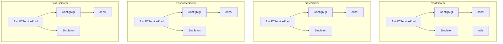
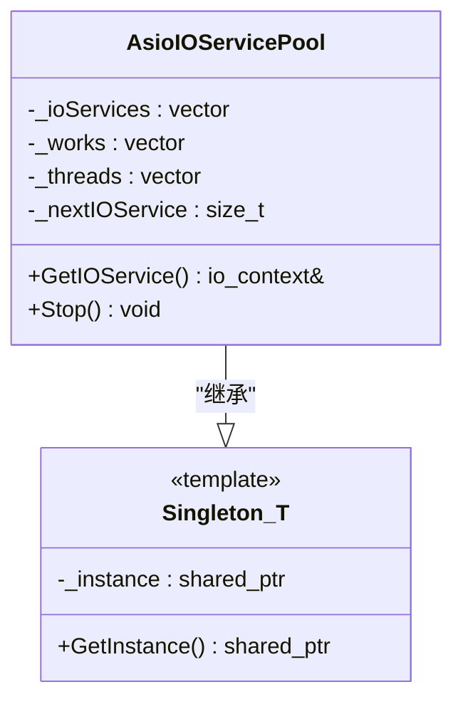
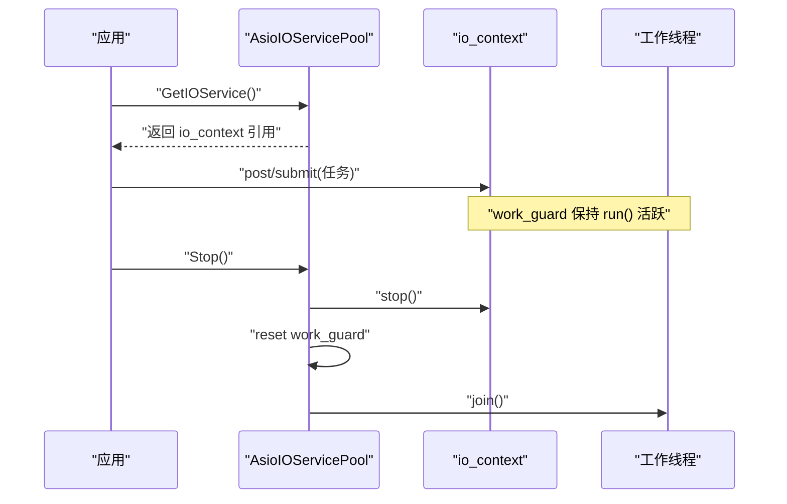
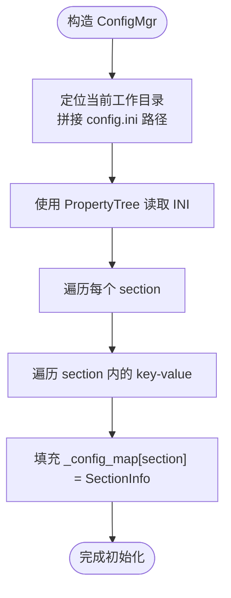
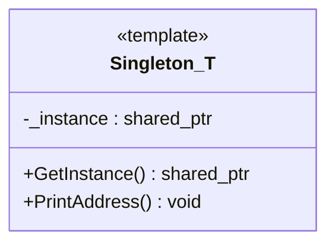
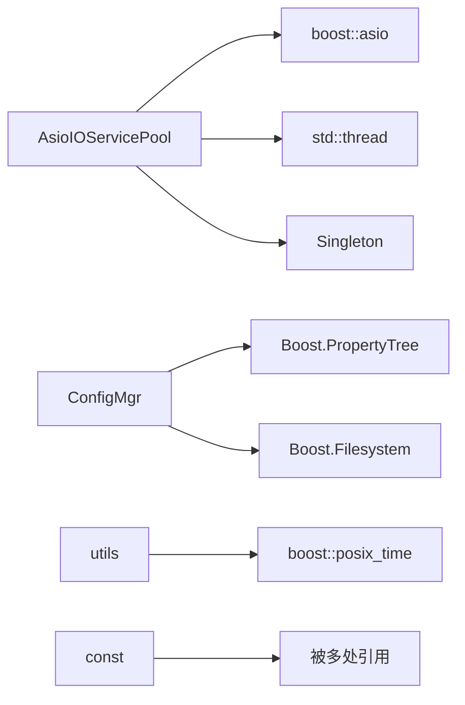

# 公共基础设施

<cite>
**本文引用的文件**   
- [AsioIOServicePool.h](file://server/ChatServer/include/AsioIOServicePool.h)
- [AsioIOServicePool.cpp](file://server/ChatServer/src/AsioIOServicePool.cpp)
- [ConfigMgr.h](file://server/ChatServer/include/ConfigMgr.h)
- [ConfigMgr.cpp](file://server/ChatServer/src/ConfigMgr.cpp)
- [Singleton.h](file://server/ChatServer/include/Singleton.h)
- [utils.h](file://server/ChatServer/include/utils.h)
- [utils.cpp](file://server/ChatServer/src/utils.cpp)
- [const.h](file://server/ChatServer/include/const.h)
- [GateServer AsioIOServicePool.h](file://server/GateServer/include/AsioIOServicePool.h)
- [GateServer ConfigMgr.h](file://server/GateServer/include/ConfigMgr.h)
- [GateServer Singleton.h](file://server/GateServer/include/Singleton.h)
- [client singleton.h](file://client/llfcchat/include/singleton.h)
- [ChatServer 配置 chatserver1.ini](file://server/ChatServer/config/chatserver1.ini)
- [客户端配置 config.ini](file://client/llfcchat/config/config.ini)
</cite>

## 目录
1. [简介](#简介)
2. [项目结构](#项目结构)
3. [核心组件](#核心组件)
4. [架构总览](#架构总览)
5. [详细组件分析](#详细组件分析)
6. [依赖关系分析](#依赖关系分析)
7. [性能考量](#性能考量)
8. [故障排查指南](#故障排查指南)
9. [结论](#结论)
10. [附录](#附录)

## 简介
本技术文档聚焦于 LLFCChat 微服务集群的公共基础设施，围绕以下关键能力进行系统化说明：
- AsioIOServicePool 高性能异步 I/O 线程池：线程管理、任务调度与负载均衡机制。
- ConfigMgr 配置管理器：INI 配置读取、键值访问接口，以及可扩展的热重载与多环境支持思路。
- Singleton 单例模式：基于模板与 once_flag 的全局唯一性与线程安全实现。
- utils 工具库：时间戳等常用函数封装。
- const 常量定义：错误码、消息 ID、Redis Key 前缀、业务常量等统一规范。
- 横切关注点：日志记录、异常处理、性能监控的统一方案建议（当前仓库未提供具体实现，本节给出通用实践）。

## 项目结构
LLFCChat 服务端由多个独立微服务组成（ChatServer、GateServer、ResourceServer、StatusServer），每个服务均包含：
- include：头文件（AsioIOServicePool、ConfigMgr、Singleton、const、utils 等）
- src：对应实现
- config：服务运行所需的 INI 配置文件

下图展示了各服务中公共组件的组织方式与复用情况。

图表来源
- [AsioIOServicePool.h](file://server/ChatServer/include/AsioIOServicePool.h)
- [ConfigMgr.h](file://server/ChatServer/include/ConfigMgr.h)
- [Singleton.h](file://server/ChatServer/include/Singleton.h)
- [utils.h](file://server/ChatServer/include/utils.h)
- [const.h](file://server/ChatServer/include/const.h)
- [GateServer AsioIOServicePool.h](file://server/GateServer/include/AsioIOServicePool.h)
- [GateServer ConfigMgr.h](file://server/GateServer/include/ConfigMgr.h)
- [GateServer Singleton.h](file://server/GateServer/include/Singleton.h)

章节来源
- [AsioIOServicePool.h](file://server/ChatServer/include/AsioIOServicePool.h)
- [AsioIOServicePool.cpp](file://server/ChatServer/src/AsioIOServicePool.cpp)
- [ConfigMgr.h](file://server/ChatServer/include/ConfigMgr.h)
- [ConfigMgr.cpp](file://server/ChatServer/src/ConfigMgr.cpp)
- [Singleton.h](file://server/ChatServer/include/Singleton.h)
- [utils.h](file://server/ChatServer/include/utils.h)
- [utils.cpp](file://server/ChatServer/src/utils.cpp)
- [const.h](file://server/ChatServer/include/const.h)
- [GateServer AsioIOServicePool.h](file://server/GateServer/include/AsioIOServicePool.h)
- [GateServer ConfigMgr.h](file://server/GateServer/include/ConfigMgr.h)
- [GateServer Singleton.h](file://server/GateServer/include/Singleton.h)
- [ChatServer 配置 chatserver1.ini](file://server/ChatServer/config/chatserver1.ini)
- [客户端配置 config.ini](file://client/llfcchat/config/config.ini)

## 核心组件
- AsioIOServicePool：基于 boost::asio::io_context 的多实例线程池，采用轮询策略分配 io_context，配合 work_guard 保证 run() 不提前退出，并提供 Stop() 优雅关闭。
- ConfigMgr：使用 Boost.PropertyTree 解析 INI 文件，将 section/key/value 组织为内存映射，提供按 section 和 key 的取值接口。
- Singleton：模板化单例，使用 std::once_flag 确保线程安全的延迟初始化，返回 shared_ptr 管理生命周期。
- utils：提供 getCurrentTimestamp 等基础工具函数。
- const：集中定义错误码、消息 ID、Redis Key 前缀、分布式锁相关常量等。

章节来源
- [AsioIOServicePool.h](file://server/ChatServer/include/AsioIOServicePool.h)
- [AsioIOServicePool.cpp](file://server/ChatServer/src/AsioIOServicePool.cpp)
- [ConfigMgr.h](file://server/ChatServer/include/ConfigMgr.h)
- [ConfigMgr.cpp](file://server/ChatServer/src/ConfigMgr.cpp)
- [Singleton.h](file://server/ChatServer/include/Singleton.h)
- [utils.h](file://server/ChatServer/include/utils.h)
- [utils.cpp](file://server/ChatServer/src/utils.cpp)
- [const.h](file://server/ChatServer/include/const.h)

## 架构总览
下图展示 AsioIOServicePool 在微服务中的角色：服务启动时创建固定数量的 io_context 并绑定工作线程；业务逻辑通过 GetIOService() 获取一个 io_context 以提交异步任务；Stop() 用于停止所有上下文并回收线程。

图表来源
- [AsioIOServicePool.h](file://server/ChatServer/include/AsioIOServicePool.h)
- [Singleton.h](file://server/ChatServer/include/Singleton.h)

章节来源
- [AsioIOServicePool.h](file://server/ChatServer/include/AsioIOServicePool.h)
- [AsioIOServicePool.cpp](file://server/ChatServer/src/AsioIOServicePool.cpp)
- [Singleton.h](file://server/ChatServer/include/Singleton.h)

## 详细组件分析

### AsioIOServicePool 线程池
设计要点：
- 线程管理：构造时根据 size 初始化 _ioServices、_works 与 _threads，每个 io_context 绑定一个 work_guard，确保 run() 不会因无任务而退出。
- 任务调度：GetIOService() 使用 _nextIOService 索引进行轮询分配，达到简单且均匀的负载均衡。
- 优雅关闭：Stop() 先调用 stop() 使 run() 退出循环，再 reset work_guard，最后 join 所有线程。

图表来源
- [AsioIOServicePool.cpp](file://server/ChatServer/src/AsioIOServicePool.cpp)
- [AsioIOServicePool.h](file://server/ChatServer/include/AsioIOServicePool.h)

章节来源
- [AsioIOServicePool.h](file://server/ChatServer/include/AsioIOServicePool.h)
- [AsioIOServicePool.cpp](file://server/ChatServer/src/AsioIOServicePool.cpp)

### ConfigMgr 配置管理器
功能说明：
- 构造阶段从当前工作目录加载 config.ini，使用 Boost.PropertyTree 解析为 ptree，遍历 section 与 key-value 对，填充内存 map。
- 提供 operator[] 按 section 访问 SectionInfo，SectionInfo 内部以 map 存储 key-value，并提供 GetValue(key) 与 [] 操作符。
- 提供静态 Inst() 作为进程内单例入口（注意与模板 Singleton 不同，此处为局部静态变量实现的单例）。

图表来源
- [ConfigMgr.cpp](file://server/ChatServer/src/ConfigMgr.cpp)
- [ConfigMgr.h](file://server/ChatServer/include/ConfigMgr.h)

章节来源
- [ConfigMgr.h](file://server/ChatServer/include/ConfigMgr.h)
- [ConfigMgr.cpp](file://server/ChatServer/src/ConfigMgr.cpp)
- [ChatServer 配置 chatserver1.ini](file://server/ChatServer/config/chatserver1.ini)
- [客户端配置 config.ini](file://client/llfcchat/config/config.ini)

### Singleton 单例模式
实现要点：
- 模板类 Singleton<T> 持有 static shared_ptr<T> _instance。
- GetInstance() 使用 static std::once_flag 与 std::call_once 保证多线程下仅初始化一次。
- 析构输出调试信息，便于观察生命周期。

图表来源
- [Singleton.h](file://server/ChatServer/include/Singleton.h)
- [GateServer Singleton.h](file://server/GateServer/include/Singleton.h)
- [client singleton.h](file://client/llfcchat/include/singleton.h)

章节来源
- [Singleton.h](file://server/ChatServer/include/Singleton.h)
- [GateServer Singleton.h](file://server/GateServer/include/Singleton.h)
- [client singleton.h](file://client/llfcchat/include/singleton.h)

### utils 工具库
- getCurrentTimestamp：基于 boost::posix_time 获取本地时间并以“年-月-日 时:分:秒”格式输出字符串，适合日志与审计场景。

章节来源
- [utils.h](file://server/ChatServer/include/utils.h)
- [utils.cpp](file://server/ChatServer/src/utils.cpp)

### const 常量定义
- ErrorCodes：统一的错误码枚举，涵盖 JSON 解析、RPC 失败、验证码、用户与密码、Token、UID 等常见错误。
- MSG_IDS：聊天协议消息 ID 集合，包括登录、搜索、好友申请、认证、文本/图片消息、心跳、文件同步等。
- Redis Key 前缀：如 USERIPPREFIX、USERTOKENPREFIX、USER_BASE_INFO、NAME_INFO、LOCK_PREFIX、USER_SESSION_PREFIX 等，便于命名规范与一致性。
- 分布式锁常量：LOCK_TIME_OUT、ACQUIRE_TIME_OUT 等。
- Defer 辅助类：RAII 风格的延迟执行器，常用于资源释放或清理逻辑。

章节来源
- [const.h](file://server/ChatServer/include/const.h)

## 依赖关系分析
- AsioIOServicePool 依赖 boost::asio 与 std 线程库，并通过模板继承 Singleton 获得全局唯一性。
- ConfigMgr 依赖 Boost.PropertyTree 与 Boost.Filesystem 解析 INI。
- utils 依赖 boost::posix_time 生成时间戳。
- const 集中定义跨模块共享的常量与辅助类型。

图表来源
- [AsioIOServicePool.h](file://server/ChatServer/include/AsioIOServicePool.h)
- [ConfigMgr.h](file://server/ChatServer/include/ConfigMgr.h)
- [utils.h](file://server/ChatServer/include/utils.h)
- [const.h](file://server/ChatServer/include/const.h)

章节来源
- [AsioIOServicePool.h](file://server/ChatServer/include/AsioIOServicePool.h)
- [ConfigMgr.h](file://server/ChatServer/include/ConfigMgr.h)
- [utils.h](file://server/ChatServer/include/utils.h)
- [const.h](file://server/ChatServer/include/const.h)

## 性能考量
- 线程池大小：默认使用硬件并发数或固定值（GateServer 示例为 2），应根据 CPU 核数与 I/O 模型调优。过大导致上下文切换开销增加，过小则吞吐不足。
- 负载均衡：当前采用简单轮询，适用于均匀负载；若存在热点连接或长连接，可考虑加权轮询或基于队列长度的动态选择。
- 任务粒度：避免在 io_context 上执行阻塞型任务，必要时将 CPU 密集任务投递到专用线程池，保持 I/O 线程响应性。
- 优雅关闭：Stop() 顺序至关重要，先 stop() 再 reset work_guard，最后 join 线程，避免死锁与悬挂线程。
- 配置热重载：当前 ConfigMgr 仅在构造时加载，如需热重载，应引入文件监听（如 inotify/fswatch）与原子替换配置快照，保证读路径无锁或短临界区。

[本节为通用性能建议，不直接分析具体文件]

## 故障排查指南
- 线程池无法退出：检查是否忘记调用 Stop()，或 work_guard 未被 reset，导致 run() 一直等待新任务。
- 配置读取为空：确认当前工作目录下是否存在 config.ini，且路径拼接正确；检查 INI 语法与编码。
- 单例重复构造：确认 GetInstance() 的 once_flag 未被误用；避免在不同翻译单元重复定义同名单例。
- 时间戳格式异常：检查 locale 设置与 time_facet 格式串是否正确。
- 错误码混淆：统一使用 const.h 中的 ErrorCodes，避免硬编码数字。

章节来源
- [AsioIOServicePool.cpp](file://server/ChatServer/src/AsioIOServicePool.cpp)
- [ConfigMgr.cpp](file://server/ChatServer/src/ConfigMgr.cpp)
- [Singleton.h](file://server/ChatServer/include/Singleton.h)
- [utils.cpp](file://server/ChatServer/src/utils.cpp)
- [const.h](file://server/ChatServer/include/const.h)

## 结论
LLFCChat 的公共基础设施以 AsioIOServicePool、ConfigMgr、Singleton、utils 与 const 为核心，提供了高并发 I/O、配置管理、全局对象与工具能力的标准化支撑。通过模板化单例与轮询线程池，实现了简洁高效的并发模型；借助 PropertyTree 与 INI 配置，降低了部署复杂度。后续可在配置热重载、监控埋点、结构化日志等方面进一步完善横切关注点，以提升系统的可观测性与可维护性。

[本节为总结性内容，不直接分析具体文件]

## 附录
- 配置样例参考：
  - ChatServer 配置：[ChatServer 配置 chatserver1.ini](file://server/ChatServer/config/chatserver1.ini)
  - 客户端配置：[客户端配置 config.ini](file://client/llfcchat/config/config.ini)

章节来源
- [ChatServer 配置 chatserver1.ini](file://server/ChatServer/config/chatserver1.ini)
- [客户端配置 config.ini](file://client/llfcchat/config/config.ini)