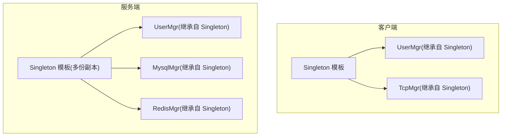
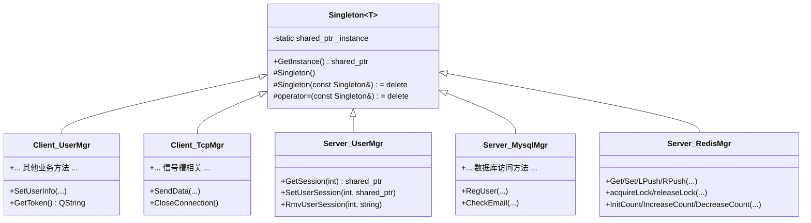
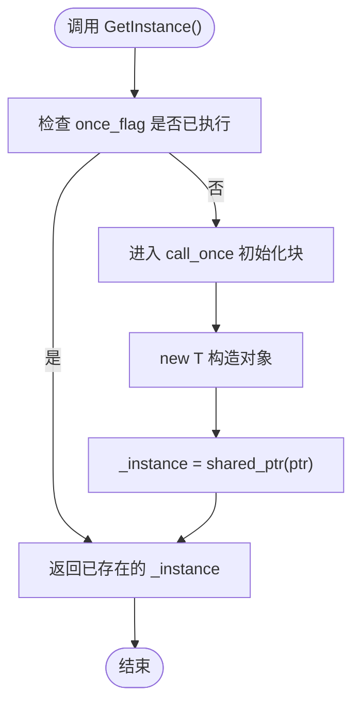
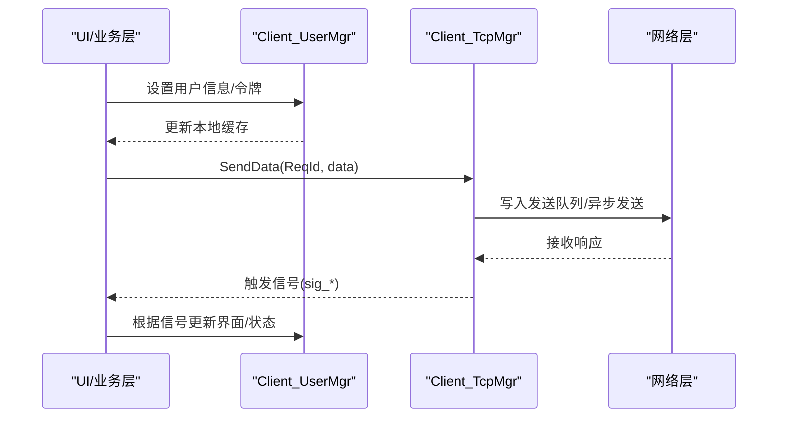
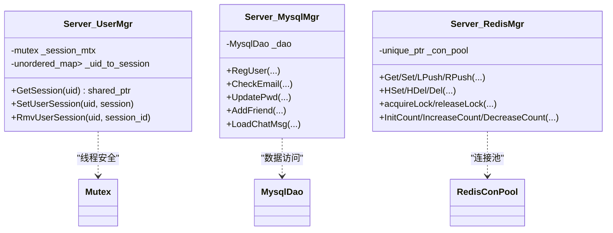
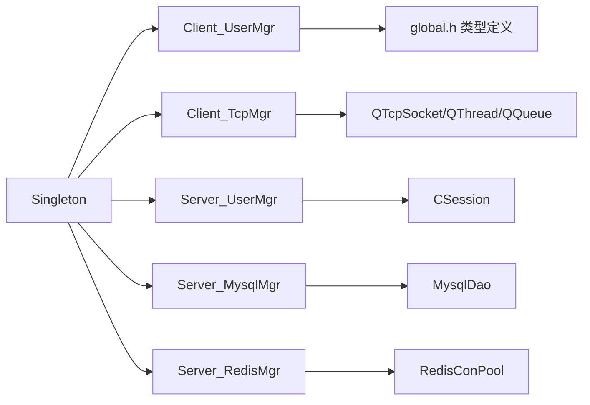

# 单例模式实现

<cite>
**本文引用的文件**   
- [client/llfcchat/include/singleton.h](file://client/llfcchat/include/singleton.h)
- [server/ChatServer/include/Singleton.h](file://server/ChatServer/include/Singleton.h)
- [server/GateServer/include/Singleton.h](file://server/GateServer/include/Singleton.h)
- [server/ResourceServer/include/Singleton.h](file://server/ResourceServer/include/Singleton.h)
- [server/StatusServer/include/Singleton.h](file://server/StatusServer/include/Singleton.h)
- [client/llfcchat/include/usermgr.h](file://client/llfcchat/include/usermgr.h)
- [client/llfcchat/src/usermgr.cpp](file://client/llfcchat/src/usermgr.cpp)
- [client/llfcchat/include/tcpmgr.h](file://client/llfcchat/include/tcpmgr.h)
- [server/ChatServer/include/UserMgr.h](file://server/ChatServer/include/UserMgr.h)
- [server/ChatServer/src/UserMgr.cpp](file://server/ChatServer/src/UserMgr.cpp)
- [server/ChatServer/include/MysqlMgr.h](file://server/ChatServer/include/MysqlMgr.h)
- [server/ChatServer/include/RedisMgr.h](file://server/ChatServer/include/RedisMgr.h)
</cite>

## 目录
1. [简介](#简介)
2. [项目结构](#项目结构)
3. [核心组件](#核心组件)
4. [架构总览](#架构总览)
5. [详细组件分析](#详细组件分析)
6. [依赖关系分析](#依赖关系分析)
7. [性能考虑](#性能考虑)
8. [故障排查指南](#故障排查指南)
9. [结论](#结论)
10. [附录](#附录)

## 简介
本技术文档围绕项目中模板化单例模式的通用实现展开，系统性阐述以下要点：
- 模板化单例的实现原理与关键约束（构造函数私有化、拷贝构造/赋值禁用）
- 线程安全的延迟初始化机制（基于 std::call_once 与 once_flag）
- 对象生命周期管理（静态存储期、析构顺序、shared_ptr 所有权）
- 在 Qt 框架中的集成方式（QObject 兼容性与信号槽支持）
- 跨平台行为差异与注意事项
- 使用示例、最佳实践与常见陷阱规避

## 项目结构
本项目在客户端与服务端均提供了统一的 Singleton 模板类，并在多个业务模块中作为基类使用。典型结构如下：
- 客户端：client/llfcchat/include/singleton.h；Qt 侧的 UserMgr、TcpMgr 等通过继承该模板获得单例能力
- 服务端：各服务（ChatServer、GateServer、ResourceServer、StatusServer）各自 include/Singleton.h，被 MysqlMgr、RedisMgr、UserMgr 等使用

图表来源
- [client/llfcchat/include/singleton.h:18-44](file://client/llfcchat/include/singleton.h#L18-L44)
- [client/llfcchat/include/usermgr.h:12-18](file://client/llfcchat/include/usermgr.h#L12-L18)
- [client/llfcchat/include/tcpmgr.h:22-33](file://client/llfcchat/include/tcpmgr.h#L22-L33)
- [server/ChatServer/include/Singleton.h:6-32](file://server/ChatServer/include/Singleton.h#L6-L32)
- [server/ChatServer/include/UserMgr.h:8-11](file://server/ChatServer/include/UserMgr.h#L8-L11)
- [server/ChatServer/include/MysqlMgr.h:8-11](file://server/ChatServer/include/MysqlMgr.h#L8-L11)
- [server/ChatServer/include/RedisMgr.h:267-271](file://server/ChatServer/include/RedisMgr.h#L267-L271)

章节来源
- [client/llfcchat/include/singleton.h:18-44](file://client/llfcchat/include/singleton.h#L18-L44)
- [server/ChatServer/include/Singleton.h:6-32](file://server/ChatServer/include/Singleton.h#L6-L32)

## 核心组件
- 模板单例基类 Singleton<T>
  - 提供 GetInstance() 静态方法，内部使用 static once_flag + std::call_once 保证线程安全且仅执行一次初始化
  - 使用 static shared_ptr<T> _instance 持有唯一实例，避免手动释放
  - 将默认构造函数设为受保护，删除拷贝构造与赋值操作符，确保不可复制与外部无法直接构造
- 典型使用者
  - 客户端：UserMgr、TcpMgr 继承 Singleton<T>，暴露 GetInstance() 获取全局唯一实例
  - 服务端：UserMgr、MysqlMgr、RedisMgr 等同样以 Singleton<T> 为基类

章节来源
- [client/llfcchat/include/singleton.h:18-44](file://client/llfcchat/include/singleton.h#L18-L44)
- [client/llfcchat/include/usermgr.h:12-18](file://client/llfcchat/include/usermgr.h#L12-L18)
- [client/llfcchat/include/tcpmgr.h:22-33](file://client/llfcchat/include/tcpmgr.h#L22-L33)
- [server/ChatServer/include/UserMgr.h:8-11](file://server/ChatServer/include/UserMgr.h#L8-L11)
- [server/ChatServer/include/MysqlMgr.h:8-11](file://server/ChatServer/include/MysqlMgr.h#L8-L11)
- [server/ChatServer/include/RedisMgr.h:267-271](file://server/ChatServer/include/RedisMgr.h#L267-L271)

## 架构总览
下图展示了单例模板与具体业务类的关系，以及调用方如何通过 GetInstance() 获取唯一实例。

图表来源
- [client/llfcchat/include/singleton.h:18-44](file://client/llfcchat/include/singleton.h#L18-L44)
- [client/llfcchat/include/usermgr.h:12-18](file://client/llfcchat/include/usermgr.h#L12-L18)
- [client/llfcchat/include/tcpmgr.h:22-33](file://client/llfcchat/include/tcpmgr.h#L22-L33)
- [server/ChatServer/include/UserMgr.h:8-11](file://server/ChatServer/include/UserMgr.h#L8-L11)
- [server/ChatServer/include/MysqlMgr.h:8-11](file://server/ChatServer/include/MysqlMgr.h#L8-L11)
- [server/ChatServer/include/RedisMgr.h:267-271](file://server/ChatServer/include/RedisMgr.h#L267-L271)

## 详细组件分析

### 模板化单例 Singleton<T> 的实现原理
- 构造函数私有化与拷贝控制
  - 默认构造函数受保护，禁止外部直接构造
  - 拷贝构造与赋值运算符被删除，防止复制与意外赋值
- 延迟初始化与线程安全
  - GetInstance() 内部使用 static once_flag 与 std::call_once，确保初始化代码块只执行一次
  - 首次调用时通过 new T 创建对象并由 shared_ptr 管理生命周期
- 静态存储期与析构顺序
  - _instance 为静态成员，随进程生命周期存在；析构顺序遵循 C++ 标准对静态对象销毁的规则
  - 若 T 包含复杂资源（如网络、文件句柄），应在其析构函数中妥善释放

图表来源
- [client/llfcchat/include/singleton.h:27-34](file://client/llfcchat/include/singleton.h#L27-L34)
- [server/ChatServer/include/Singleton.h:15-22](file://server/ChatServer/include/Singleton.h#L15-L22)

章节来源
- [client/llfcchat/include/singleton.h:18-44](file://client/llfcchat/include/singleton.h#L18-L44)
- [server/ChatServer/include/Singleton.h:6-32](file://server/ChatServer/include/Singleton.h#L6-L32)

### 客户端 Qt 集成：UserMgr 与 TcpMgr
- UserMgr
  - 继承 QObject 与 Singleton<UserMgr>，并启用 enable_shared_from_this
  - 提供大量业务方法（用户信息、好友列表、聊天会话、文件传输状态等），内部使用互斥锁保护共享数据
  - 通过信号槽与 UI 层交互，符合 Qt 事件模型
- TcpMgr
  - 继承 QObject 与 Singleton<TcpMgr>，封装 TCP 连接、发送队列、消息处理与信号槽
  - 通过信号通知上层业务变化（登录成功、消息到达、连接关闭等）

图表来源
- [client/llfcchat/include/usermgr.h:12-18](file://client/llfcchat/include/usermgr.h#L12-L18)
- [client/llfcchat/include/tcpmgr.h:22-33](file://client/llfcchat/include/tcpmgr.h#L22-L33)
- [client/llfcchat/src/usermgr.cpp:10-65](file://client/llfcchat/src/usermgr.cpp#L10-L65)

章节来源
- [client/llfcchat/include/usermgr.h:12-18](file://client/llfcchat/include/usermgr.h#L12-L18)
- [client/llfcchat/src/usermgr.cpp:10-65](file://client/llfcchat/src/usermgr.cpp#L10-L65)
- [client/llfcchat/include/tcpmgr.h:22-33](file://client/llfcchat/include/tcpmgr.h#L22-L33)

### 服务端单例：UserMgr、MysqlMgr、RedisMgr
- UserMgr（服务端）
  - 维护 uid 到 session 的映射，提供线程安全的增删查接口
  - 使用互斥锁保护并发访问
- MysqlMgr（服务端）
  - 封装数据库访问（注册、认证、好友关系、聊天消息等）
- RedisMgr（服务端）
  - 封装 Redis 连接池、命令操作、分布式锁、计数器等
  - 内部维护连接池与后台健康检查线程

图表来源
- [server/ChatServer/include/UserMgr.h:8-20](file://server/ChatServer/include/UserMgr.h#L8-L20)
- [server/ChatServer/src/UserMgr.cpp:10-44](file://server/ChatServer/src/UserMgr.cpp#L10-L44)
- [server/ChatServer/include/MysqlMgr.h:8-39](file://server/ChatServer/include/MysqlMgr.h#L8-L39)
- [server/ChatServer/include/RedisMgr.h:267-303](file://server/ChatServer/include/RedisMgr.h#L267-L303)

章节来源
- [server/ChatServer/include/UserMgr.h:8-20](file://server/ChatServer/include/UserMgr.h#L8-L20)
- [server/ChatServer/src/UserMgr.cpp:10-44](file://server/ChatServer/src/UserMgr.cpp#L10-L44)
- [server/ChatServer/include/MysqlMgr.h:8-39](file://server/ChatServer/include/MysqlMgr.h#L8-L39)
- [server/ChatServer/include/RedisMgr.h:267-303](file://server/ChatServer/include/RedisMgr.h#L267-L303)

### 生命周期管理与析构顺序
- 静态存储期
  - _instance 为静态成员，随进程启动而存在，进程退出时按逆序销毁
- shared_ptr 管理
  - 由 shared_ptr 负责释放内存，避免手动 delete
- 析构顺序注意事项
  - 若单例依赖其他静态对象（如日志、配置），需确保依赖对象在单例之前析构
  - 对于 Qt 对象，注意事件循环与线程切换导致的析构时机

章节来源
- [client/llfcchat/include/singleton.h:25-44](file://client/llfcchat/include/singleton.h#L25-L44)
- [server/ChatServer/include/Singleton.h:13-32](file://server/ChatServer/include/Singleton.h#L13-L32)

### 线程安全与并发编程概念
- 双重检查锁定 vs std::call_once
  - 当前实现采用 std::call_once + once_flag，避免手写 DCLP 的内存序问题
- 原子操作与内存序
  - 若未来需要优化，可结合 atomic 与 memory_order 进行细粒度控制
- 互斥锁
  - 业务层（如 UserMgr、RedisMgr）仍需在自身方法内加锁保护共享数据

章节来源
- [client/llfcchat/include/singleton.h:27-34](file://client/llfcchat/include/singleton.h#L27-L34)
- [server/ChatServer/include/Singleton.h:15-22](file://server/ChatServer/include/Singleton.h#L15-L22)
- [server/ChatServer/src/UserMgr.cpp:10-44](file://server/ChatServer/src/UserMgr.cpp#L10-L44)
- [server/ChatServer/include/RedisMgr.h:267-303](file://server/ChatServer/include/RedisMgr.h#L267-L303)

### 在不同平台下的行为差异与注意事项
- C++ 标准库一致性
  - std::call_once 与 once_flag 在各主流编译器（GCC、Clang、MSVC）上行为一致
- Qt 事件循环与线程
  - 在多线程环境下，Qt 对象的信号槽跨线程调用需使用 QueuedConnection
- 静态对象析构顺序
  - 不同平台对静态对象析构顺序有细微差异，应避免跨静态对象强依赖

[本节为通用指导，不直接分析具体文件]

## 依赖关系分析
- 模板依赖
  - 所有单例使用者均依赖 Singleton<T> 提供的 GetInstance() 与静态 _instance
- 业务依赖
  - 客户端：UserMgr 依赖 userdata、global 等类型定义；TcpMgr 依赖 QTcpSocket、QQueue、QThread 等
  - 服务端：UserMgr 依赖 CSession；MysqlMgr 依赖 MysqlDao；RedisMgr 依赖 hiredis 连接池

图表来源
- [client/llfcchat/include/singleton.h:18-44](file://client/llfcchat/include/singleton.h#L18-L44)
- [client/llfcchat/include/usermgr.h:12-18](file://client/llfcchat/include/usermgr.h#L12-L18)
- [client/llfcchat/include/tcpmgr.h:22-33](file://client/llfcchat/include/tcpmgr.h#L22-L33)
- [server/ChatServer/include/UserMgr.h:8-20](file://server/ChatServer/include/UserMgr.h#L8-L20)
- [server/ChatServer/include/MysqlMgr.h:8-39](file://server/ChatServer/include/MysqlMgr.h#L8-L39)
- [server/ChatServer/include/RedisMgr.h:267-303](file://server/ChatServer/include/RedisMgr.h#L267-L303)

章节来源
- [client/llfcchat/include/singleton.h:18-44](file://client/llfcchat/include/singleton.h#L18-L44)
- [client/llfcchat/include/usermgr.h:12-18](file://client/llfcchat/include/usermgr.h#L12-L18)
- [client/llfcchat/include/tcpmgr.h:22-33](file://client/llfcchat/include/tcpmgr.h#L22-L33)
- [server/ChatServer/include/UserMgr.h:8-20](file://server/ChatServer/include/UserMgr.h#L8-L20)
- [server/ChatServer/include/MysqlMgr.h:8-39](file://server/ChatServer/include/MysqlMgr.h#L8-L39)
- [server/ChatServer/include/RedisMgr.h:267-303](file://server/ChatServer/include/RedisMgr.h#L267-L303)

## 性能考虑
- 初始化开销
  - std::call_once 仅在首次调用时执行，后续调用几乎无额外开销
- 锁粒度
  - 单例初始化无需业务锁；业务方法应最小化锁范围，避免热点路径阻塞
- 内存分配
  - 使用 shared_ptr 会带来轻微分配与引用计数开销，但简化了生命周期管理
- I/O 与事件循环
  - 在 Qt 中，避免在信号槽中执行耗时操作，必要时放入工作线程

[本节为通用指导，不直接分析具体文件]

## 故障排查指南
- 常见问题
  - 重复构造：确认未绕过 GetInstance() 直接构造
  - 线程竞争：检查业务方法是否正确加锁
  - 析构顺序：避免单例依赖的静态对象在其之后析构
  - Qt 线程模型：跨线程信号槽需正确连接类型
- 定位手段
  - 打印地址：使用 PrintAddress() 验证唯一性
  - 断点调试：在 call_once 初始化块与业务方法入口设置断点
  - 日志输出：记录关键路径的进入与退出

章节来源
- [client/llfcchat/include/singleton.h:35-40](file://client/llfcchat/include/singleton.h#L35-L40)
- [server/ChatServer/include/Singleton.h:23-28](file://server/ChatServer/include/Singleton.h#L23-L28)
- [client/llfcchat/src/usermgr.cpp:10-65](file://client/llfcchat/src/usermgr.cpp#L10-L65)

## 结论
本项目通过模板化 Singleton<T> 实现了统一、线程安全、延迟初始化的单例模式，并在客户端与服务端广泛使用。借助 std::call_once 与 shared_ptr，既保证了并发安全，又简化了生命周期管理。在 Qt 环境中，配合信号槽与事件循环，能够高效地驱动 UI 与业务逻辑。建议在实际使用中遵循最小锁粒度、避免跨静态对象依赖、合理设计析构顺序等最佳实践，以获得稳定可靠的系统行为。

[本节为总结性内容，不直接分析具体文件]

## 附录
- 使用示例（路径指引）
  - 客户端单例获取：参见 [client/llfcchat/include/usermgr.h:12-18](file://client/llfcchat/include/usermgr.h#L12-L18)、[client/llfcchat/include/tcpmgr.h:22-33](file://client/llfcchat/include/tcpmgr.h#L22-L33)
  - 服务端单例获取：参见 [server/ChatServer/include/UserMgr.h:8-11](file://server/ChatServer/include/UserMgr.h#L8-L11)、[server/ChatServer/include/MysqlMgr.h:8-11](file://server/ChatServer/include/MysqlMgr.h#L8-L11)、[server/ChatServer/include/RedisMgr.h:267-271](file://server/ChatServer/include/RedisMgr.h#L267-L271)
- 最佳实践
  - 始终通过 GetInstance() 获取单例
  - 在业务方法内使用互斥锁保护共享状态
  - 避免在单例析构中执行阻塞或异常抛出的操作
- 常见陷阱
  - 绕过 GetInstance() 直接构造导致多实例
  - 跨线程访问 Qt 对象未使用正确的连接类型
  - 静态对象依赖顺序不当导致悬空指针或资源未释放

[本节为补充说明，不直接分析具体文件]