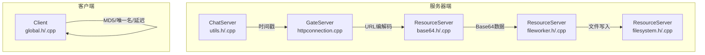
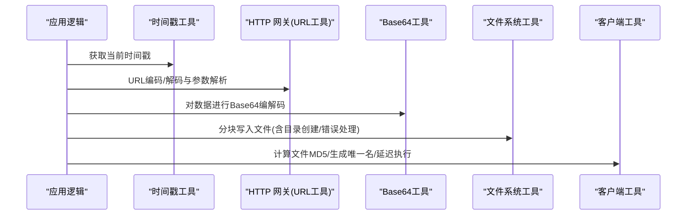
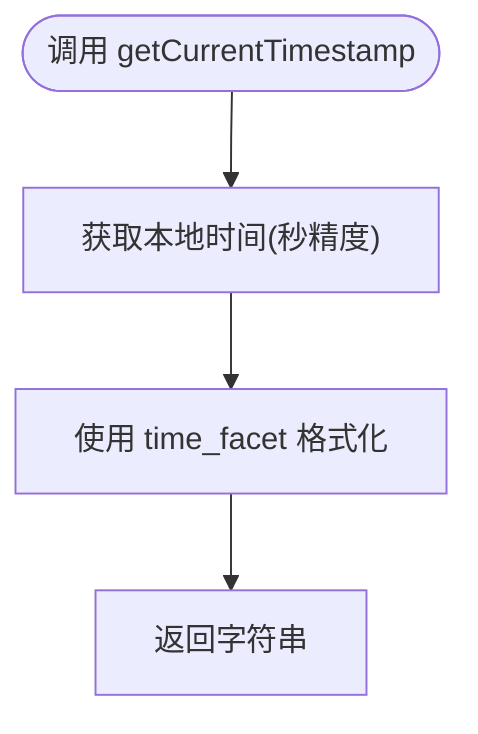
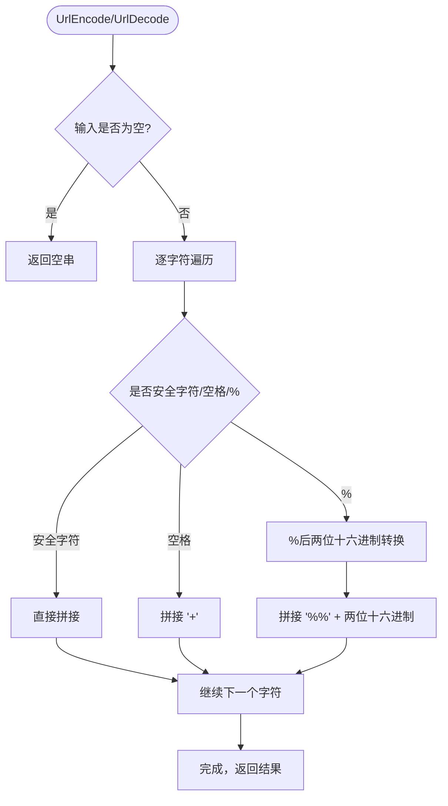
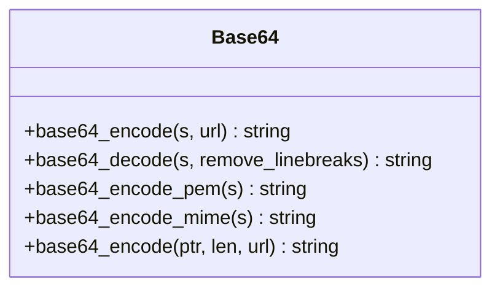
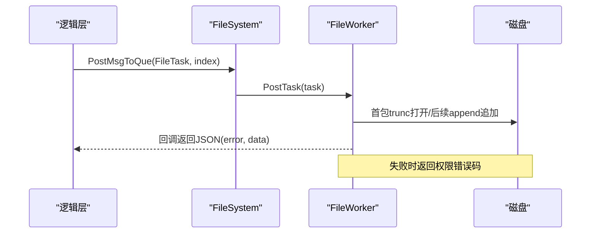
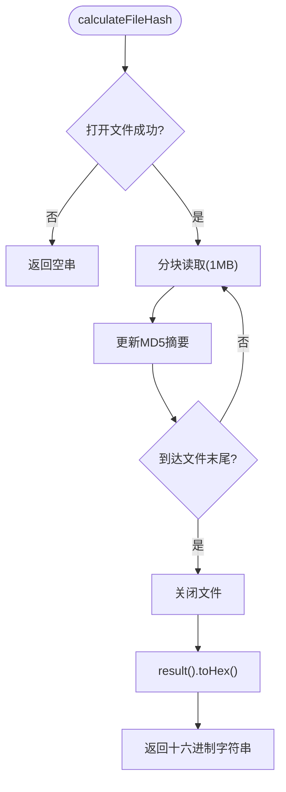
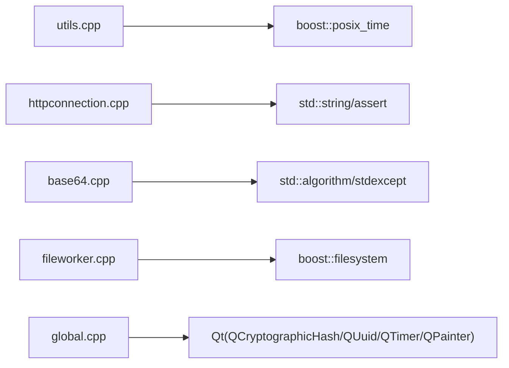

# 工具函数库

<cite>
**本文引用的文件**   
- [server/ChatServer/include/utils.h](file://server/ChatServer/include/utils.h)
- [server/ChatServer/src/utils.cpp](file://server/ChatServer/src/utils.cpp)
- [server/GateServer/src/httpconnection.cpp](file://server/GateServer/src/httpconnection.cpp)
- [server/ResourceServer/include/base64.h](file://server/ResourceServer/include/base64.h)
- [server/ResourceServer/src/base64.cpp](file://server/ResourceServer/src/base64.cpp)
- [client/llfcchat/include/global.h](file://client/llfcchat/include/global.h)
- [client/llfcchat/src/global.cpp](file://client/llfcchat/src/global.cpp)
- [server/ResourceServer/include/fileworker.h](file://server/ResourceServer/include/fileworker.h)
- [server/ResourceServer/src/fileworker.cpp](file://server/ResourceServer/src/fileworker.cpp)
- [server/ResourceServer/include/filesystem.h](file://server/ResourceServer/include/filesystem.h)
- [server/ResourceServer/src/filesystem.cpp](file://server/ResourceServer/src/filesystem.cpp)
</cite>

## 目录
1. [简介](#简介)
2. [项目结构](#项目结构)
3. [核心组件](#核心组件)
4. [架构总览](#架构总览)
5. [详细组件分析](#详细组件分析)
6. [依赖关系分析](#依赖关系分析)
7. [性能考量](#性能考量)
8. [故障排查指南](#故障排查指南)
9. [结论](#结论)
10. [附录](#附录)

## 简介
本参考文档聚焦于本项目中的“工具函数库”，围绕以下能力进行系统化说明：
- 字符串处理：URL 编解码、简单异或加密等
- 文件操作：分块写入、目录创建与权限错误处理、路径处理
- 编码与加密：Base64 编解码、MD5 文件哈希
- 时间日期：本地时间戳格式化、心跳过期判断
- 网络工具：URL 解析与参数提取（GET）、端口监听与请求路由（HTTP）
- 辅助功能：单例模式、异步 IO 服务池、延迟执行、UI 占位图生成等

文档以代码级为依据，提供调用流程、数据结构、复杂度与错误处理建议，帮助读者快速定位并正确使用各工具函数。

## 项目结构
工具相关代码主要分布在以下位置：
- 服务器端通用工具：时间戳格式化（ChatServer）
- HTTP 工具：URL 编解码与 GET 参数解析（GateServer）
- 编码工具：Base64 编解码（ResourceServer）
- 客户端工具：文件 MD5、唯一文件名生成、延迟执行、UI 占位图（Client）
- 文件系统工具：分块写入、目录创建、任务投递（ResourceServer）

图表来源 
- [server/ChatServer/include/utils.h:1-7](file://server/ChatServer/include/utils.h#L1-L7)
- [server/ChatServer/src/utils.cpp:1-15](file://server/ChatServer/src/utils.cpp#L1-L15)
- [server/GateServer/src/httpconnection.cpp:49-104](file://server/GateServer/src/httpconnection.cpp#L49-L104)
- [server/ResourceServer/include/base64.h:1-36](file://server/ResourceServer/include/base64.h#L1-L36)
- [server/ResourceServer/src/base64.cpp:1-283](file://server/ResourceServer/src/base64.cpp#L1-L283)
- [server/ResourceServer/include/filesystem.h:1-21](file://server/ResourceServer/include/filesystem.h#L1-L21)
- [server/ResourceServer/src/filesystem.cpp:1-29](file://server/ResourceServer/src/filesystem.cpp#L1-L29)
- [server/ResourceServer/include/fileworker.h](file://server/ResourceServer/include/fileworker.h)
- [server/ResourceServer/src/fileworker.cpp:60-105](file://server/ResourceServer/src/fileworker.cpp#L60-L105)
- [client/llfcchat/include/global.h:1-296](file://client/llfcchat/include/global.h#L1-L296)
- [client/llfcchat/src/global.cpp:1-91](file://client/llfcchat/src/global.cpp#L1-L91)

章节来源
- [server/ChatServer/include/utils.h:1-7](file://server/ChatServer/include/utils.h#L1-L7)
- [server/ChatServer/src/utils.cpp:1-15](file://server/ChatServer/src/utils.cpp#L1-L15)
- [server/GateServer/src/httpconnection.cpp:49-104](file://server/GateServer/src/httpconnection.cpp#L49-L104)
- [server/ResourceServer/include/base64.h:1-36](file://server/ResourceServer/include/base64.h#L1-L36)
- [server/ResourceServer/src/base64.cpp:1-283](file://server/ResourceServer/src/base64.cpp#L1-L283)
- [server/ResourceServer/include/filesystem.h:1-21](file://server/ResourceServer/include/filesystem.h#L1-L21)
- [server/ResourceServer/src/filesystem.cpp:1-29](file://server/ResourceServer/src/filesystem.cpp#L1-L29)
- [server/ResourceServer/src/fileworker.cpp:60-105](file://server/ResourceServer/src/fileworker.cpp#L60-L105)
- [client/llfcchat/include/global.h:1-296](file://client/llfcchat/include/global.h#L1-L296)
- [client/llfcchat/src/global.cpp:1-91](file://client/llfcchat/src/global.cpp#L1-L91)

## 核心组件
- 时间戳工具：获取当前本地时间并格式化为“YYYY-MM-DD HH:MM:SS”字符串
- URL 工具：URL 编码/解码、GET 参数预解析
- Base64 工具：标准/Base64url、PEM/MIME 换行封装、string/string_view 接口
- 文件系统工具：按序列分块写入、目录自动创建、错误码返回
- 客户端工具：文件 MD5 计算、唯一文件名/图标名生成、延迟执行、加载占位图
- 基础架构：单例模板、IOService 池（用于并发 IO）

章节来源
- [server/ChatServer/src/utils.cpp:1-15](file://server/ChatServer/src/utils.cpp#L1-L15)
- [server/GateServer/src/httpconnection.cpp:49-104](file://server/GateServer/src/httpconnection.cpp#L49-L104)
- [server/ResourceServer/src/base64.cpp:1-283](file://server/ResourceServer/src/base64.cpp#L1-L283)
- [server/ResourceServer/src/fileworker.cpp:60-105](file://server/ResourceServer/src/fileworker.cpp#L60-L105)
- [client/llfcchat/src/global.cpp:1-91](file://client/llfcchat/src/global.cpp#L1-L91)

## 架构总览
工具库在系统中的角色如下：
- 时间戳工具被上层逻辑用于日志、审计与一致性检查
- URL 工具服务于 HTTP 网关的请求解析与参数传递
- Base64 工具用于二进制数据的文本化传输与存储
- 文件系统工具负责分块文件的可靠落盘与错误上报
- 客户端工具为 UI 与网络层提供便捷能力

图表来源 
- [server/ChatServer/src/utils.cpp:1-15](file://server/ChatServer/src/utils.cpp#L1-L15)
- [server/GateServer/src/httpconnection.cpp:49-104](file://server/GateServer/src/httpconnection.cpp#L49-L104)
- [server/ResourceServer/src/base64.cpp:1-283](file://server/ResourceServer/src/base64.cpp#L1-L283)
- [server/ResourceServer/src/fileworker.cpp:60-105](file://server/ResourceServer/src/fileworker.cpp#L60-L105)
- [client/llfcchat/src/global.cpp:1-91](file://client/llfcchat/src/global.cpp#L1-L91)

## 详细组件分析

### 时间戳工具（getCurrentTimestamp）
- 功能：获取本地时间（秒精度），格式化为“YYYY-MM-DD HH:MM:SS”
- 输入：无
- 输出：std::string 时间字符串
- 复杂度：O(1)
- 异常/错误：无抛出；依赖系统时间与 locale
- 使用示例：用于日志记录、审计、会话超时标记等
- 错误处理建议：若需更高精度或时区控制，可改用 std::chrono 与自定义格式化

图表来源 
- [server/ChatServer/src/utils.cpp:1-15](file://server/ChatServer/src/utils.cpp#L1-L15)

章节来源
- [server/ChatServer/include/utils.h:1-7](file://server/ChatServer/include/utils.h#L1-L7)
- [server/ChatServer/src/utils.cpp:1-15](file://server/ChatServer/src/utils.cpp#L1-L15)

### URL 工具（UrlEncode / UrlDecode / PreParseGetParam）
- 功能：
  - UrlEncode：将非字母数字字符转为 %HH，空格转 +
  - UrlDecode：将 %HH 还原为字符，+ 还原为空格
  - PreParseGetParam：从 URI 中分离路径与查询串，便于后续键值解析
- 输入：std::string
- 输出：std::string（编码/解码结果）；PreParseGetParam 内部更新成员变量
- 复杂度：O(n)
- 异常/错误：解码时对非法 % 序列可能触发断言或异常；建议调用前校验长度
- 使用示例：GET 请求参数传递、表单提交、API 路由匹配
- 错误处理建议：捕获异常并返回错误码；对空串与短串做边界检查

图表来源 
- [server/GateServer/src/httpconnection.cpp:49-104](file://server/GateServer/src/httpconnection.cpp#L49-L104)

章节来源
- [server/GateServer/src/httpconnection.cpp:49-104](file://server/GateServer/src/httpconnection.cpp#L49-L104)

### Base64 工具（base64_encode / base64_decode / PEM/MIME）
- 功能：
  - base64_encode：支持标准与 URL-safe 两种字符集
  - base64_decode：支持去除换行符选项
  - base64_encode_pem / base64_encode_mime：按 PEM(64)/MIME(76) 插入换行
  - 支持 std::string 与 std::string_view（C++17）
- 输入：const std::string& 或 string_view；可选 url 标志
- 输出：std::string
- 复杂度：编码 O(n)，解码 O(n)
- 异常/错误：解码非法输入会抛出运行时异常；空串返回空串
- 使用示例：二进制数据文本化传输、证书/密钥片段编码
- 错误处理建议：捕获异常并转换为业务错误码；对超长输入做分段处理

图表来源 
- [server/ResourceServer/include/base64.h:1-36](file://server/ResourceServer/include/base64.h#L1-L36)
- [server/ResourceServer/src/base64.cpp:1-283](file://server/ResourceServer/src/base64.cpp#L1-L283)

章节来源
- [server/ResourceServer/include/base64.h:1-36](file://server/ResourceServer/include/base64.h#L1-L36)
- [server/ResourceServer/src/base64.cpp:1-283](file://server/ResourceServer/src/base64.cpp#L1-L283)

### 文件系统工具（FileWorker / FileSystem）
- 功能：
  - FileWorker：接收分块上传任务，按 seq 顺序写入文件；首包 trunc，后续包 append
  - FileSystem：单例，维护多个 FileWorker/DownloadWorker，按索引分发任务
- 输入：FileTask（包含 session、文件名、seq、total_size、trans_size、last、data）
- 输出：通过回调返回 JSON 结果（包含 error 字段）
- 复杂度：I/O 为主，内存占用低（分块）
- 异常/错误：目录不存在则创建失败；文件打开/写入失败返回权限错误码
- 使用示例：大文件分块上传、断点续传
- 错误处理建议：统一错误码映射；确保 last=true 时关闭文件句柄；失败时清理半写文件

图表来源 
- [server/ResourceServer/src/fileworker.cpp:60-105](file://server/ResourceServer/src/fileworker.cpp#L60-L105)
- [server/ResourceServer/include/filesystem.h:1-21](file://server/ResourceServer/include/filesystem.h#L1-L21)
- [server/ResourceServer/src/filesystem.cpp:1-29](file://server/ResourceServer/src/filesystem.cpp#L1-L29)

章节来源
- [server/ResourceServer/src/fileworker.cpp:60-105](file://server/ResourceServer/src/fileworker.cpp#L60-L105)
- [server/ResourceServer/include/filesystem.h:1-21](file://server/ResourceServer/include/filesystem.h#L1-L21)
- [server/ResourceServer/src/filesystem.cpp:1-29](file://server/ResourceServer/src/filesystem.cpp#L1-L29)

### 客户端工具（global.cpp/h）
- 功能：
  - calculateFileHash(filePath)：分块计算 MD5 哈希，避免大文件内存峰值
  - generateUniqueFileName(originalName)：UUID + 扩展名生成唯一文件名
  - generateUniqueIconName()：UUID.png 生成唯一图标名
  - delay_run(msecs)：基于事件循环的阻塞式延时
  - xorString(input)：简单异或混淆（非安全加密）
  - CreateLoadingPlaceholder(width,height)：生成加载占位图
- 输入：文件路径、原始文件名、毫秒数、字符串
- 输出：哈希字符串、新文件名、延时返回、混淆后的字符串、QPixmap
- 复杂度：MD5 O(n)，其他 O(1)
- 异常/错误：文件打开失败返回空串；延时基于事件循环，需在 Qt 事件循环上下文中调用
- 使用示例：文件完整性校验、资源命名去重、UI 交互延时、临时混淆

图表来源 
- [client/llfcchat/src/global.cpp:1-91](file://client/llfcchat/src/global.cpp#L1-L91)

章节来源
- [client/llfcchat/include/global.h:1-296](file://client/llfcchat/include/global.h#L1-L296)
- [client/llfcchat/src/global.cpp:1-91](file://client/llfcchat/src/global.cpp#L1-L91)

### 概念性概览（未绑定具体源码）
- 常见字符串处理：分割、拼接、大小写转换、Trim、正则匹配等（项目中未集中实现，可在需要处扩展）
- 时间日期：时区转换、UTC/本地互转、日期格式化（可用 std::chrono 与第三方库扩展）
- 网络工具：IP 解析、端口检查、URL 完整解析（可结合 Boost.Asio/Qt Network）
- 日志与监控：结构化日志、性能计数器、采样统计（可引入 spdlog/prometheus）

[本节为概念性内容，不直接分析具体文件]

## 依赖关系分析
- utils.cpp 依赖 boost::posix_time 进行时间格式化
- httpconnection.cpp 依赖标准库字符处理与 assert
- base64.cpp 依赖标准库算法与异常机制
- fileworker.cpp 依赖 boost::filesystem 与 std::ofstream
- global.cpp 依赖 Qt 的 QCryptographicHash、QUuid、QTimer、QPainter

图表来源 
- [server/ChatServer/src/utils.cpp:1-15](file://server/ChatServer/src/utils.cpp#L1-L15)
- [server/GateServer/src/httpconnection.cpp:49-104](file://server/GateServer/src/httpconnection.cpp#L49-L104)
- [server/ResourceServer/src/base64.cpp:1-283](file://server/ResourceServer/src/base64.cpp#L1-L283)
- [server/ResourceServer/src/fileworker.cpp:60-105](file://server/ResourceServer/src/fileworker.cpp#L60-L105)
- [client/llfcchat/src/global.cpp:1-91](file://client/llfcchat/src/global.cpp#L1-L91)

章节来源
- [server/ChatServer/src/utils.cpp:1-15](file://server/ChatServer/src/utils.cpp#L1-L15)
- [server/GateServer/src/httpconnection.cpp:49-104](file://server/GateServer/src/httpconnection.cpp#L49-L104)
- [server/ResourceServer/src/base64.cpp:1-283](file://server/ResourceServer/src/base64.cpp#L1-L283)
- [server/ResourceServer/src/fileworker.cpp:60-105](file://server/ResourceServer/src/fileworker.cpp#L60-L105)
- [client/llfcchat/src/global.cpp:1-91](file://client/llfcchat/src/global.cpp#L1-L91)

## 性能考量
- Base64：已预留容量减少分配；string_view 接口降低拷贝开销（C++17）
- 文件写入：分块 I/O，避免一次性读入大文件；注意 last=true 时及时关闭句柄
- URL 编解码：线性扫描，避免多次字符串重建；必要时可复用缓冲区
- 时间戳：Boost posix_time 格式化开销较低；高频场景可缓存 locale
- 客户端 MD5：分块读取，内存峰值可控；适合大文件校验

[本节为通用指导，不直接分析具体文件]

## 故障排查指南
- URL 解码异常：检查 % 后两位是否为合法十六进制；空串或过短输入需提前校验
- Base64 解码异常：确认输入字符集（标准 vs URL-safe）；必要时启用 remove_linebreaks
- 文件写入失败：检查目录是否存在且可写；确认权限错误码并回滚状态
- 时间戳异常：确认系统时间与区域设置；如需 UTC，应显式转换
- 客户端延时：确保在 Qt 事件循环中调用 delay_run，否则不会退出循环

章节来源
- [server/GateServer/src/httpconnection.cpp:49-104](file://server/GateServer/src/httpconnection.cpp#L49-L104)
- [server/ResourceServer/src/base64.cpp:1-283](file://server/ResourceServer/src/base64.cpp#L1-L283)
- [server/ResourceServer/src/fileworker.cpp:60-105](file://server/ResourceServer/src/fileworker.cpp#L60-L105)
- [client/llfcchat/src/global.cpp:1-91](file://client/llfcchat/src/global.cpp#L1-L91)

## 结论
本工具函数库覆盖了聊天应用中常见的字符串、文件、编码、时间与网络辅助需求。通过模块化设计与清晰的错误处理策略，能够在保证稳定性的同时提升开发效率。建议在后续迭代中补充更丰富的字符串处理与网络工具，并引入统一的日志与监控体系以增强可观测性。

[本节为总结性内容，不直接分析具体文件]

## 附录
- 常用函数速查
  - 时间戳：getCurrentTimestamp()
  - URL：UrlEncode()/UrlDecode()/PreParseGetParam()
  - Base64：base64_encode()/base64_decode()/base64_encode_pem()/base64_encode_mime()
  - 文件：FileWorker 分块写入、FileSystem 任务分发
  - 客户端：calculateFileHash()/generateUniqueFileName()/delay_run()/CreateLoadingPlaceholder()

[本节为参考信息，不直接分析具体文件]