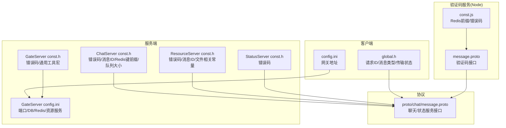
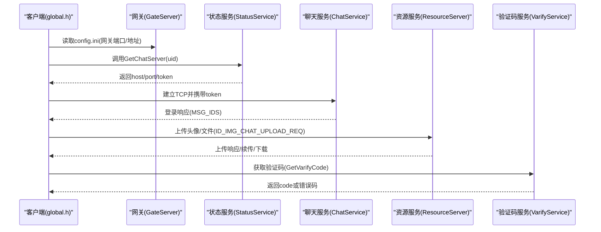
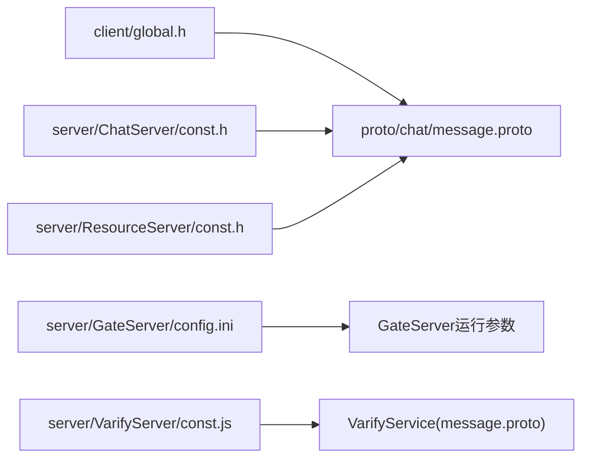

# 常量定义

<cite>
**本文引用的文件**   
- [server/ChatServer/include/const.h](file://server/ChatServer/include/const.h)
- [server/ResourceServer/include/const.h](file://server/ResourceServer/include/const.h)
- [server/GateServer/include/const.h](file://server/GateServer/include/const.h)
- [server/StatusServer/include/const.h](file://server/StatusServer/include/const.h)
- [client/llfcchat/include/global.h](file://client/llfcchat/include/global.h)
- [server/VarifyServer/const.js](file://server/VarifyServer/const.js)
- [server/proto/chat/message.proto](file://server/proto/chat/message.proto)
- [server/VarifyServer/message.proto](file://server/VarifyServer/message.proto)
- [server/GateServer/config/config.ini](file://server/GateServer/config/config.ini)
- [client/llfcchat/config/config.ini](file://client/llfcchat/config/config.ini)
- [server/ChatServer/include/data.h](file://server/ChatServer/include/data.h)
- [server/ResourceServer/include/data.h](file://server/ResourceServer/include/data.h)
</cite>

## 目录
1. [简介](#简介)
2. [项目结构](#项目结构)
3. [核心组件](#核心组件)
4. [架构总览](#架构总览)
5. [详细组件分析](#详细组件分析)
6. [依赖关系分析](#依赖关系分析)
7. [性能考虑](#性能考虑)
8. [故障排查指南](#故障排查指南)
9. [结论](#结论)
10. [附录](#附录)

## 简介
本参考文档围绕“常量定义”展开，系统化梳理错误码、配置键名、业务枚举、网络协议常量、日志与调试开关、性能监控等常量的标准化定义与使用规范。内容覆盖客户端与服务端（C++）以及验证码服务（Node.js），并结合 gRPC 协议定义与配置文件，给出统一的命名约定、分类组织与版本管理建议，同时提供扩展指南与常见问题排查方法。

## 项目结构
本项目在多个模块中分别维护各自的常量定义：
- 服务端各进程（ChatServer、ResourceServer、GateServer、StatusServer）通过 include/const.h 集中定义错误码、消息ID、Redis键前缀、分布式锁参数、缓冲区大小等。
- 客户端（Qt/C++）通过 include/global.h 定义请求ID、消息类型、传输状态、UI模式、页面分页常量等。
- 验证码服务（Node.js）通过 const.js 定义 Redis 键前缀与错误码。
- gRPC 协议通过 proto 文件定义接口与字段，间接约束了跨进程通信的常量语义。
- 配置文件（config.ini）集中声明端口、主机、数据库与缓存连接信息。

图表来源 
- [client/llfcchat/include/global.h](file://client/llfcchat/include/global.h)
- [server/ChatServer/include/const.h](file://server/ChatServer/include/const.h)
- [server/ResourceServer/include/const.h](file://server/ResourceServer/include/const.h)
- [server/GateServer/include/const.h](file://server/GateServer/include/const.h)
- [server/StatusServer/include/const.h](file://server/StatusServer/include/const.h)
- [server/GateServer/config/config.ini](file://server/GateServer/config/config.ini)
- [server/VarifyServer/const.js](file://server/VarifyServer/const.js)
- [server/proto/chat/message.proto](file://server/proto/chat/message.proto)
- [server/VarifyServer/message.proto](file://server/VarifyServer/message.proto)

章节来源
- [client/llfcchat/include/global.h](file://client/llfcchat/include/global.h)
- [server/ChatServer/include/const.h](file://server/ChatServer/include/const.h)
- [server/ResourceServer/include/const.h](file://server/ResourceServer/include/const.h)
- [server/GateServer/include/const.h](file://server/GateServer/include/const.h)
- [server/StatusServer/include/const.h](file://server/StatusServer/include/const.h)
- [server/GateServer/config/config.ini](file://server/GateServer/config/config.ini)
- [server/VarifyServer/const.js](file://server/VarifyServer/const.js)
- [server/proto/chat/message.proto](file://server/proto/chat/message.proto)
- [server/VarifyServer/message.proto](file://server/VarifyServer/message.proto)

## 核心组件
- 错误码体系
  - 服务端各进程均定义了 ErrorCodes 枚举，用于统一返回码（如 JSON 解析失败、RPC 失败、验证码过期/错误、用户已存在、密码错误、邮箱不匹配、Token 失效、UID 无效等）。
  - ResourceServer 额外包含文件相关错误码（不存在、存储失败、权限不足、序列/偏移错误、读取失败、Redis 读取错误、服务器IP错误、消息ID错误）。
  - 客户端定义了轻量错误码（JSON 解析失败、网络错误）。
  - 验证码服务定义了 Errors（成功、Redis错误、异常）。
- 消息ID与协议常量
  - ChatServer、ResourceServer、客户端 global.h 中均定义了 MSG_IDS/ReqId，涵盖登录、搜索、好友申请/认证、文本/图片/文件消息、心跳、加载聊天线程/消息、头像上传、文件下载、图片续传与下载同步等。
- 配置键名常量
  - GateServer 与客户端的 config.ini 定义了网关端口、验证服务与状态服务主机端口、MySQL、Redis、资源服务主机与端口等键名。
- 业务常量
  - 消息状态 MsgStatus（未读、发送失败、已读、未上传完成）。
  - 消息类型与传输类型（文本、图片、视频、文件；上传/下载/暂停/完成/失败）。
  - UI 模式与列表项类型（搜索、聊天、联系人、设置、分组提示、分割线、好友申请等）。
- 网络协议常量
  - 包头长度、ID长度、数据长度、收发队列上限、最大文件大小、并发工作者数量、分布式锁超时与重试时间等。
- 其他技术常量
  - Defer 类（RAII式延迟执行）、代码前缀常量（CODEPREFIX）、各类 Redis 键前缀（用户IP、Token、登录计数、名称信息等）、锁前缀与会话前缀。

章节来源
- [server/ChatServer/include/const.h](file://server/ChatServer/include/const.h)
- [server/ResourceServer/include/const.h](file://server/ResourceServer/include/const.h)
- [server/GateServer/include/const.h](file://server/GateServer/include/const.h)
- [server/StatusServer/include/const.h](file://server/StatusServer/include/const.h)
- [client/llfcchat/include/global.h](file://client/llfcchat/include/global.h)
- [server/VarifyServer/const.js](file://server/VarifyServer/const.js)
- [server/proto/chat/message.proto](file://server/proto/chat/message.proto)
- [server/VarifyServer/message.proto](file://server/VarifyServer/message.proto)
- [server/GateServer/config/config.ini](file://server/GateServer/config/config.ini)
- [client/llfcchat/config/config.ini](file://client/llfcchat/config/config.ini)

## 架构总览
下图展示了客户端与服务端之间的常量与协议对齐关系，以及配置中心对运行时参数的影响。

图表来源 
- [client/llfcchat/include/global.h](file://client/llfcchat/include/global.h)
- [server/proto/chat/message.proto](file://server/proto/chat/message.proto)
- [server/VarifyServer/message.proto](file://server/VarifyServer/message.proto)
- [server/GateServer/config/config.ini](file://server/GateServer/config/config.ini)

## 详细组件分析

### 错误码定义（HTTP/gRPC/自定义）
- HTTP 状态码
  - 当前仓库未发现显式的 HTTP 状态码常量定义。若需统一，建议在网关层引入标准 HTTP 状态码映射，并在响应体中附带业务错误码。
- gRPC 错误码
  - gRPC 层通常使用标准状态码（如 OK、INVALID_ARGUMENT、UNAUTHENTICATED、INTERNAL 等）。本仓库未在 proto 中定义自定义 gRPC 状态码，但通过消息中的 error 字段承载业务错误码。
- 自定义业务错误码
  - 服务端各进程 ErrorCodes 枚举保持一致的领域错误码（如 JSON 解析、RPC 失败、验证码过期/错误、用户已存在、密码错误、邮箱不匹配、Token 失效、UID 无效等）。
  - ResourceServer 扩展了文件处理相关的错误码（不存在、存储失败、权限不足、序列/偏移错误、读取失败、Redis 读取错误、服务器IP错误、消息ID错误）。
  - 客户端 ErrorCodes 仅包含基础错误（JSON 解析失败、网络错误）。
  - 验证码服务 Errors 包含成功、Redis错误、异常。

最佳实践
- 将业务错误码与传输层错误码解耦：gRPC/HTTP 使用标准状态码，业务错误码通过消息字段返回。
- 为每个错误码提供唯一编号与中文注释，便于前端展示与日志定位。
- 按模块划分错误码区间（如 1000-1099 通用错误，1100-1199 文件错误等），避免冲突。

章节来源
- [server/ChatServer/include/const.h](file://server/ChatServer/include/const.h)
- [server/ResourceServer/include/const.h](file://server/ResourceServer/include/const.h)
- [server/GateServer/include/const.h](file://server/GateServer/include/const.h)
- [server/StatusServer/include/const.h](file://server/StatusServer/include/const.h)
- [client/llfcchat/include/global.h](file://client/llfcchat/include/global.h)
- [server/VarifyServer/const.js](file://server/VarifyServer/const.js)
- [server/proto/chat/message.proto](file://server/proto/chat/message.proto)
- [server/VarifyServer/message.proto](file://server/VarifyServer/message.proto)

### 配置键名常量（数据库/Redis/服务器）
- 服务器与中间件配置
  - GateServer 的 config.ini 定义了以下键名：
    - [GateServer] Port
    - [VarifyServer] Host, Port
    - [StatusServer] Host, Port
    - [Mysql] Host, Port, User, Passwd, Schema
    - [Redis] Host, Port, Passwd
    - [ResServer] Name, Host, Port, RPCPort
- 客户端配置
  - client/llfcchat/config.ini 定义了 [GateServer] host, port。

命名规范建议
- 采用 INI 小节+键名的形式，保持层级清晰。
- 键名全小写，使用下划线分隔（如 rpc_port、db_host）。
- 敏感信息（密码）应通过环境变量或密钥管理服务注入，不在配置文件中明文保存。

章节来源
- [server/GateServer/config/config.ini](file://server/GateServer/config/config.ini)
- [client/llfcchat/config/config.ini](file://client/llfcchat/config/config.ini)

### 业务常量（消息类型/用户状态/好友关系/文件类型）
- 消息类型与传输状态
  - 客户端 global.h 定义了 MsgType（文本、图片、视频、文件）、TransferType（无、下载、上传）、TransferState（无、下载中、上传中、暂停、完成、失败）。
  - 服务端 data.h 定义了 ChatMsgType（TEXT、PIC、VIDEO、FILE）。
- 消息状态
  - 服务端与客户端均定义了 MsgStatus（未读、发送失败、已读、未上传完成）。
- 好友关系与聊天模式
  - 客户端 global.h 定义了 ChatFormType（私聊、群聊）、ListItemType（聊天用户、联系人用户、搜索用户、提示、无效条目、分组提示、分割线、好友申请）。
- 文件与传输
  - 客户端 global.h 定义了 MAX_FILE_LEN 及文件传输相关结构体字段（总大小、当前大小、序列号、MD5、确认序列集合、飞行序列集合等）。

章节来源
- [client/llfcchat/include/global.h](file://client/llfcchat/include/global.h)
- [server/ChatServer/include/data.h](file://server/ChatServer/include/data.h)
- [server/ResourceServer/include/data.h](file://server/ResourceServer/include/data.h)

### 网络协议常量（端口/超时/重试/缓冲区）
- 包头与帧格式
  - ChatServer/ResourceServer/客户端定义了不同长度的头部（总长度、ID长度、数据长度），用于 TCP 粘包/拆包。
- 队列与缓冲
  - 服务端定义了收发队列上限（MAX_RECVQUE、MAX_SENDQUE），ResourceServer 还定义了逻辑工作者与文件工作者数量、下载工作者数量。
- 分布式锁
  - 定义了锁持有时间与重试时间（LOCK_TIME_OUT、ACQUIRE_TIME_OUT）。
- 文件传输
  - 定义了最大文件大小（MAX_FILE_LEN）与分片大小。

章节来源
- [server/ChatServer/include/const.h](file://server/ChatServer/include/const.h)
- [server/ResourceServer/include/const.h](file://server/ResourceServer/include/const.h)
- [client/llfcchat/include/global.h](file://client/llfcchat/include/global.h)

### 日志级别与调试开关、性能监控常量
- 日志级别
  - 当前仓库未发现统一的日志级别常量定义。建议在公共头文件中定义 LOG_LEVEL（如 DEBUG、INFO、WARN、ERROR）并在各模块统一输出。
- 调试开关
  - 未发现全局调试开关常量。建议增加 ENABLE_DEBUG、ENABLE_TRACE 等宏以控制详细日志与性能统计。
- 性能监控
  - 可结合工作者数量、队列上限、分片大小等常量进行吞吐与延迟监控。建议在关键路径埋点，记录耗时与成功率。

说明
- 本节为通用建议，未直接分析具体文件。

### 常量命名规范、分类组织与版本管理
- 命名规范
  - 错误码：使用大写下划线（如 Error_Json、RPCFailed、VarifyExpired）。
  - 消息ID：统一前缀 ID_ 与后缀 _REQ/_RSP（如 ID_TEXT_CHAT_MSG_REQ）。
  - 配置键名：小写下划线（如 host、port、rpc_port）。
  - 常量宏：全大写加下划线（如 MAX_LENGTH、HEAD_TOTAL_LEN、LOCK_TIME_OUT）。
  - 枚举值：大写下划线（如 UN_READ、SEND_FAILED、READED）。
- 分类组织
  - 按模块拆分：客户端（global.h）、服务端各进程（const.h）、协议（proto）、配置（config.ini）。
  - 按领域划分：错误码、消息ID、业务枚举、网络参数、Redis键前缀、分布式锁参数。
- 版本管理
  - 在常量注释中保留变更历史（如新增/废弃原因）。
  - 对破坏性变更（如错误码重编号、消息ID调整）进行向后兼容过渡期管理。

章节来源
- [server/ChatServer/include/const.h](file://server/ChatServer/include/const.h)
- [server/ResourceServer/include/const.h](file://server/ResourceServer/include/const.h)
- [server/GateServer/include/const.h](file://server/GateServer/include/const.h)
- [server/StatusServer/include/const.h](file://server/StatusServer/include/const.h)
- [client/llfcchat/include/global.h](file://client/llfcchat/include/global.h)
- [server/VarifyServer/const.js](file://server/VarifyServer/const.js)
- [server/proto/chat/message.proto](file://server/proto/chat/message.proto)
- [server/VarifyServer/message.proto](file://server/VarifyServer/message.proto)
- [server/GateServer/config/config.ini](file://server/GateServer/config/config.ini)
- [client/llfcchat/config/config.ini](file://client/llfcchat/config/config.ini)

### 常量使用的代码示例与扩展指南
- 错误码使用示例（概念性描述）
  - 在服务端处理请求时，遇到 JSON 解析失败则返回 Error_Json；遇到 RPC 失败返回 RPCFailed；验证码过期返回 VarifyExpired。
  - 客户端收到错误码后，根据映射显示用户友好提示。
- 配置键名使用示例（概念性描述）
  - 启动时从 config.ini 读取 [GateServer] Port、[Mysql] Host/Port/User/Passwd/Schema、[Redis] Host/Port/Passwd、[ResServer] Host/Port/RPCPort。
- 业务常量使用示例（概念性描述）
  - 发送文本消息时使用 ID_TEXT_CHAT_MSG_REQ，接收方使用 ID_NOTIFY_TEXT_CHAT_MSG_REQ 通知。
  - 上传头像使用 ID_UPLOAD_HEAD_ICON_REQ，下载文件使用 ID_DOWN_LOAD_FILE_REQ。
- 扩展指南
  - 新增错误码：在对应模块的 ErrorCodes 中添加新项，确保编号不与现有冲突，并在注释中说明用途。
  - 新增消息ID：在客户端 global.h 与服务端 const.h 中同步添加，保持 REQ/RSP 成对出现。
  - 新增配置键名：在 config.ini 中新增键名，并在配置加载模块中解析与校验。
  - 新增业务枚举：在 global.h 或 data.h 中扩展，并确保序列化/反序列化兼容。

章节来源
- [server/ChatServer/include/const.h](file://server/ChatServer/include/const.h)
- [server/ResourceServer/include/const.h](file://server/ResourceServer/include/const.h)
- [client/llfcchat/include/global.h](file://client/llfcchat/include/global.h)
- [server/proto/chat/message.proto](file://server/proto/chat/message.proto)
- [server/VarifyServer/message.proto](file://server/VarifyServer/message.proto)
- [server/GateServer/config/config.ini](file://server/GateServer/config/config.ini)
- [client/llfcchat/config/config.ini](file://client/llfcchat/config/config.ini)

## 依赖关系分析
- 客户端依赖
  - global.h 中的 ReqId/MsgType/TransferState 与 proto 中的接口字段一一对应，确保消息语义一致。
- 服务端依赖
  - 各进程的 const.h 定义了错误码与消息ID，与 proto 接口协同工作。
  - config.ini 提供运行时参数，影响网络监听端口、数据库与缓存连接。
- 验证码服务依赖
  - const.js 提供 Redis 键前缀与错误码，与 message.proto 定义的 GetVarifyCode 接口配合。

图表来源 
- [client/llfcchat/include/global.h](file://client/llfcchat/include/global.h)
- [server/proto/chat/message.proto](file://server/proto/chat/message.proto)
- [server/ChatServer/include/const.h](file://server/ChatServer/include/const.h)
- [server/ResourceServer/include/const.h](file://server/ResourceServer/include/const.h)
- [server/GateServer/config/config.ini](file://server/GateServer/config/config.ini)
- [server/VarifyServer/const.js](file://server/VarifyServer/const.js)
- [server/VarifyServer/message.proto](file://server/VarifyServer/message.proto)

章节来源
- [client/llfcchat/include/global.h](file://client/llfcchat/include/global.h)
- [server/proto/chat/message.proto](file://server/proto/chat/message.proto)
- [server/ChatServer/include/const.h](file://server/ChatServer/include/const.h)
- [server/ResourceServer/include/const.h](file://server/ResourceServer/include/const.h)
- [server/GateServer/config/config.ini](file://server/GateServer/config/config.ini)
- [server/VarifyServer/const.js](file://server/VarifyServer/const.js)
- [server/VarifyServer/message.proto](file://server/VarifyServer/message.proto)

## 性能考虑
- 队列与缓冲
  - 合理设置 MAX_RECVQUE/MAX_SENDQUE，避免内存占用过高或丢包。
- 工作者数量
  - 根据CPU核数与IO特性调整 LOGIC_WORKER_COUNT、FILE_WORKER_COUNT、DOWN_LOAD_WORKER_COUNT。
- 分片与并发
  - MAX_FILE_LEN 与分片策略影响吞吐与内存峰值，需结合网络带宽与磁盘IO调优。
- 分布式锁
  - LOCK_TIME_OUT 与 ACQUIRE_TIME_OUT 需平衡一致性与时延，避免死锁与频繁重试。

说明
- 本节为通用指导，未直接分析具体文件。

## 故障排查指南
- 错误码定位
  - 检查服务端 ErrorCodes 与客户端错误映射是否一致。
  - 验证码服务 Errors 中 RedisErr 表示缓存操作失败，需检查 Redis 连接与键前缀。
- 配置问题
  - 核对 config.ini 中的端口、主机、用户名、密码是否与部署环境一致。
- 协议不一致
  - 确认客户端 ReqId/MSG_IDS 与服务端 MSG_IDS 是否同步更新，避免消息路由错误。
- 文件传输失败
  - 检查 FileNotExists、FileWritePermissionFailed、FileReadPermissionFailed 等错误码对应的文件系统权限与路径。

章节来源
- [server/ChatServer/include/const.h](file://server/ChatServer/include/const.h)
- [server/ResourceServer/include/const.h](file://server/ResourceServer/include/const.h)
- [server/VarifyServer/const.js](file://server/VarifyServer/const.js)
- [server/GateServer/config/config.ini](file://server/GateServer/config/config.ini)
- [client/llfcchat/include/global.h](file://client/llfcchat/include/global.h)

## 结论
本仓库在各模块中形成了较为完整的常量定义体系，涵盖错误码、消息ID、业务枚举、网络参数、配置键名等。通过统一的命名规范与分类组织，提升了代码可读性与可维护性。建议在后续迭代中补充日志级别与调试开关常量，完善性能监控指标，并持续对齐 proto 协议与客户端/服务端常量，确保系统稳定与可扩展。

## 附录
- 常用常量速查
  - 错误码：Error_Json、RPCFailed、VarifyExpired、VarifyCodeErr、UserExist、PasswdErr、EmailNotMatch、TokenInvalid、UidInvalid、FileNotExists、FileSaveRedisFailed、CreateFilePathFailed、FileWritePermissionFailed、FileReadPermissionFailed、FileSeqInvalid、FileOffsetInvalid、FileReadFailed、RedisReadErr、ServerIpErr、MsgIdErr。
  - 消息ID：ID_TEXT_CHAT_MSG_REQ/RSP、ID_NOTIFY_TEXT_CHAT_MSG_REQ、ID_IMG_CHAT_MSG_REQ/RSP、ID_NOTIFY_IMG_CHAT_MSG_REQ、ID_FILE_INFO_SYNC_REQ/RSP、ID_IMG_CHAT_CONTINUE_UPLOAD_REQ/RSP、ID_IMG_CHAT_DOWN_INFO_SYNC_REQ/RSP、ID_IMG_CHAT_DOWN_REQ/RSP、ID_UPLOAD_HEAD_ICON_REQ/RSP、ID_DOWN_LOAD_FILE_REQ/RSP。
  - 配置键名：Port、Host、User、Passwd、Schema、RPCPort。
  - 网络参数：HEAD_TOTAL_LEN、HEAD_ID_LEN、HEAD_DATA_LEN、MAX_RECVQUE、MAX_SENDQUE、MAX_FILE_LEN、LOGIC_WORKER_COUNT、FILE_WORKER_COUNT、DOWN_LOAD_WORKER_COUNT、LOCK_TIME_OUT、ACQUIRE_TIME_OUT。

章节来源
- [server/ChatServer/include/const.h](file://server/ChatServer/include/const.h)
- [server/ResourceServer/include/const.h](file://server/ResourceServer/include/const.h)
- [client/llfcchat/include/global.h](file://client/llfcchat/include/global.h)
- [server/GateServer/config/config.ini](file://server/GateServer/config/config.ini)