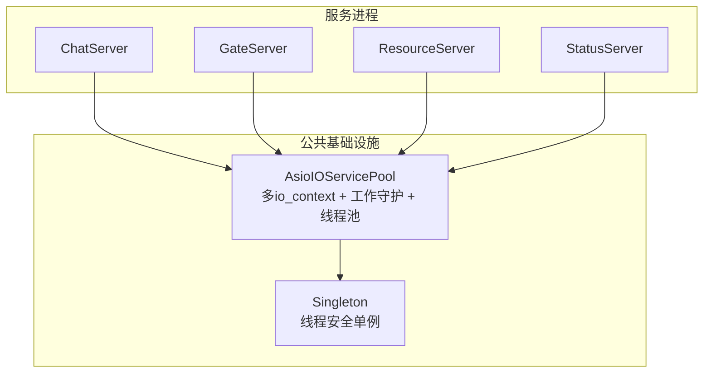
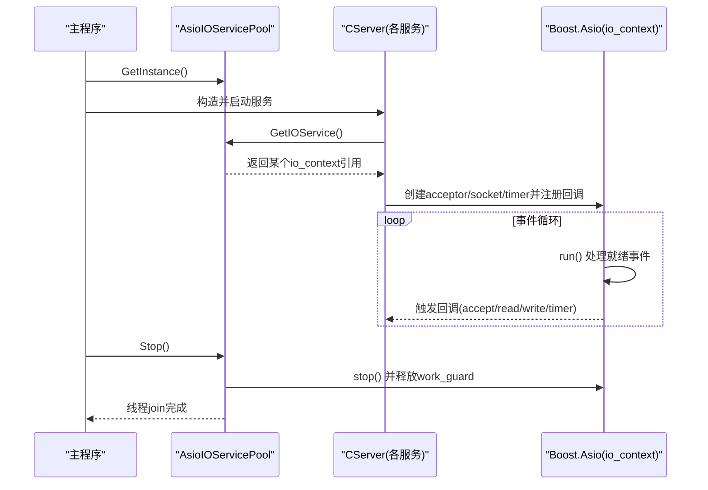
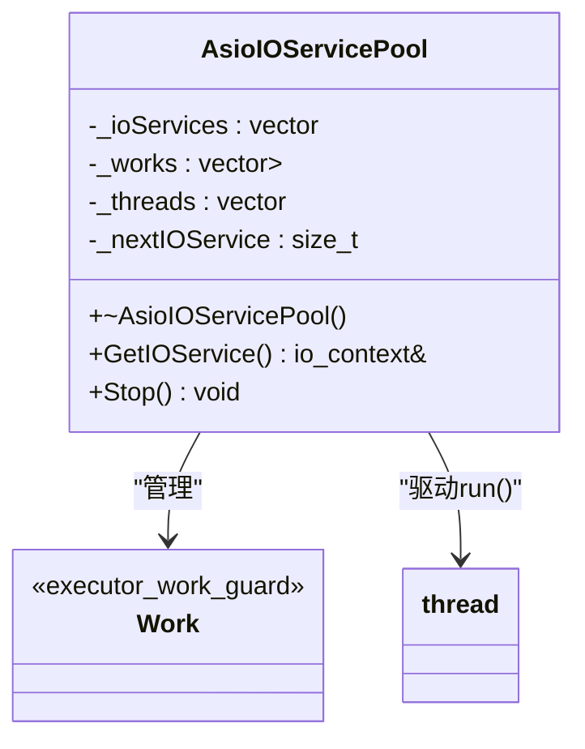
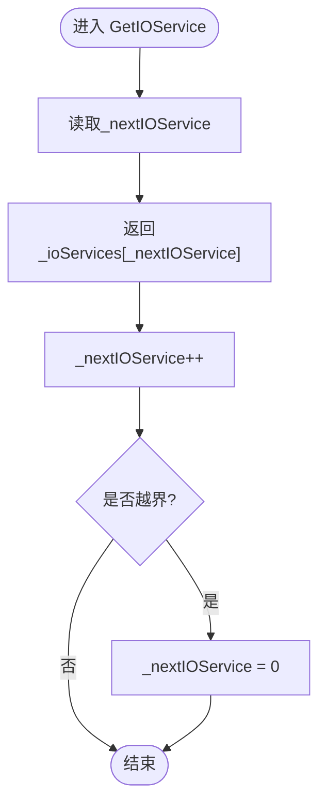
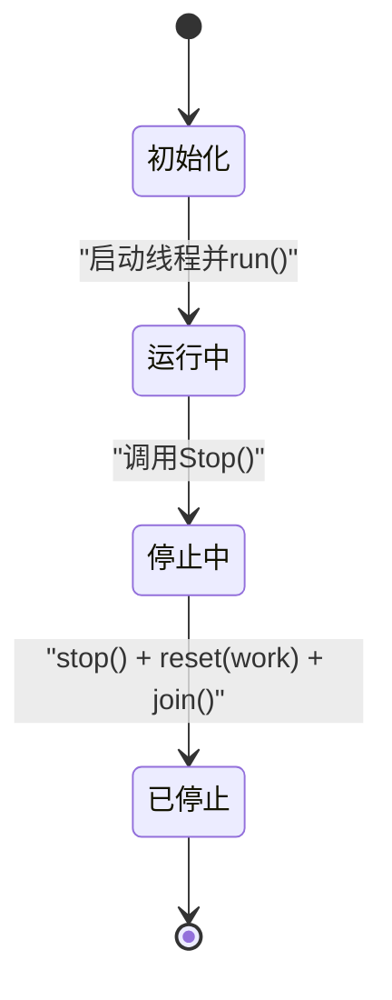
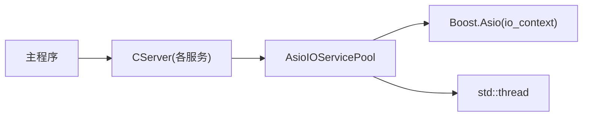

# 异步I/O线程池

<cite>
**本文引用的文件**   
- [AsioIOServicePool.h](file://server/ChatServer/include/AsioIOServicePool.h)
- [AsioIOServicePool.cpp](file://server/ChatServer/src/AsioIOServicePool.cpp)
- [AsioIOServicePool.h（Gate）](file://server/GateServer/include/AsioIOServicePool.h)
- [AsioIOServicePool.cpp（Gate）](file://server/GateServer/src/AsioIOServicePool.cpp)
- [AsioIOServicePool.h（Resource）](file://server/ResourceServer/include/AsioIOServicePool.h)
- [AsioIOServicePool.cpp（Resource）](file://server/ResourceServer/src/AsioIOServicePool.cpp)
- [AsioIOServicePool.h（Status）](file://server/StatusServer/include/AsioIOServicePool.h)
- [Singleton.h](file://server/ChatServer/include/Singleton.h)
- [CServer.h（Chat）](file://server/ChatServer/include/CServer.h)
- [CServer.cpp（Chat）](file://server/ChatServer/src/CServer.cpp)
- [CServer.h（Gate）](file://server/GateServer/include/CServer.h)
- [CServer.cpp（Gate）](file://server/GateServer/src/CServer.cpp)
- [ChatServer.cpp](file://server/ChatServer/src/ChatServer.cpp)
- [GateServer.cpp](file://server/GateServer/src/GateServer.cpp)
</cite>

## 目录
1. [简介](#简介)
2. [项目结构](#项目结构)
3. [核心组件](#核心组件)
4. [架构总览](#架构总览)
5. [详细组件分析](#详细组件分析)
6. [依赖关系分析](#依赖关系分析)
7. [性能考量](#性能考量)
8. [故障排查指南](#故障排查指南)
9. [结论](#结论)
10. [附录：使用示例与最佳实践](#附录使用示例与最佳实践)

## 简介
本技术文档围绕 AsioIOServicePool 高性能异步 I/O 线程池展开，深入解析基于 Boost.Asio 的 io_context 多实例模型、工作守护机制（work_guard）、轮询负载均衡、线程生命周期控制与优雅关闭等关键设计。该线程池在多个服务进程（ChatServer、GateServer、ResourceServer、StatusServer）中复用同一接口实现，通过单例模式提供全局一致的 I/O 调度能力，确保任务在各 io_context 间均匀分布，提升并发吞吐并降低锁竞争。

## 项目结构
- 每个服务端模块均包含独立的 AsioIOServicePool 头文件与实现文件，接口一致，仅默认线程池大小存在差异。
- 各服务通过 CServer 类创建 acceptor 并启动异步监听，统一从 AsioIOServicePool 获取 io_context。
- 主程序负责初始化配置、注册信号处理、启动业务服务与运行 io_context 事件循环。

**图表来源** 
- [AsioIOServicePool.h:1-28](file://server/ChatServer/include/AsioIOServicePool.h#L1-L28)
- [AsioIOServicePool.cpp:1-43](file://server/ChatServer/src/AsioIOServicePool.cpp#L1-L43)
- [Singleton.h:1-33](file://server/ChatServer/include/Singleton.h#L1-L33)

**章节来源**
- [AsioIOServicePool.h:1-28](file://server/ChatServer/include/AsioIOServicePool.h#L1-L28)
- [AsioIOServicePool.cpp:1-43](file://server/ChatServer/src/AsioIOServicePool.cpp#L1-L43)
- [CServer.h（Chat）:1-33](file://server/ChatServer/include/CServer.h#L1-L33)
- [CServer.cpp（Chat）:1-133](file://server/ChatServer/src/CServer.cpp#L1-L133)
- [CServer.h（Gate）:1-16](file://server/GateServer/include/CServer.h#L1-L16)
- [CServer.cpp（Gate）:1-36](file://server/GateServer/src/CServer.cpp#L1-L36)
- [ChatServer.cpp:1-81](file://server/ChatServer/src/ChatServer.cpp#L1-L81)
- [GateServer.cpp:1-163](file://server/GateServer/src/GateServer.cpp#L1-L163)

## 核心组件
- AsioIOServicePool：封装多个 boost::asio::io_context，为每个 io_context 绑定一个 work_guard，启动独立线程执行 run()；提供 GetIOService() 轮询返回 io_context 引用；提供 Stop() 优雅停止所有上下文并等待线程退出。
- Singleton<T>：线程安全的单例模板，保证 AsioIOServicePool 全局唯一且构造安全。
- CServer：各服务的 TCP/HTTP 服务器抽象，持有 acceptor 与定时器，统一从 AsioIOServicePool 获取 io_context 进行异步 I/O。

**章节来源**
- [AsioIOServicePool.h:1-28](file://server/ChatServer/include/AsioIOServicePool.h#L1-L28)
- [AsioIOServicePool.cpp:1-43](file://server/ChatServer/src/AsioIOServicePool.cpp#L1-L43)
- [Singleton.h:1-33](file://server/ChatServer/include/Singleton.h#L1-L33)
- [CServer.h（Chat）:1-33](file://server/ChatServer/include/CServer.h#L1-L33)
- [CServer.cpp（Chat）:1-133](file://server/ChatServer/src/CServer.cpp#L1-L133)
- [CServer.h（Gate）:1-16](file://server/GateServer/include/CServer.h#L1-L16)
- [CServer.cpp（Gate）:1-36](file://server/GateServer/src/CServer.cpp#L1-L36)

## 架构总览
下图展示了 AsioIOServicePool 在多服务中的角色与交互：各服务通过单例获取线程池，从中轮询得到 io_context，用于创建 acceptor、socket、定时器等对象，并由各自线程驱动 run() 事件循环。

**图表来源** 
- [ChatServer.cpp:20-81](file://server/ChatServer/src/ChatServer.cpp#L20-L81)
- [CServer.cpp（Chat）:34-38](file://server/ChatServer/src/CServer.cpp#L34-L38)
- [AsioIOServicePool.cpp:18-43](file://server/ChatServer/src/AsioIOServicePool.cpp#L18-L43)

## 详细组件分析

### AsioIOServicePool 设计与实现
- 数据结构
  - _ioServices：存储多个 io_context 实例，作为任务分发目标。
  - _works：存储对应 io_context 的 work_guard，防止 run() 在无任务时退出。
  - _threads：每个 io_context 对应一个工作线程，调用 run() 驱动事件循环。
  - _nextIOService：轮询索引，实现简单而高效的负载均衡。
- 初始化流程
  - 根据 size 构造 _ioServices 与 _works。
  - 为每个 io_context 创建 work_guard，确保 run() 始终有“工作”可执行。
  - 启动 _ioServices.size() 个线程，分别运行各自的 io_context.run()。
- 轮询负载均衡
  - GetIOService() 按顺序递增 _nextIOService，并在到达末尾时回绕至 0，实现均匀分配。
  - 注意：当前实现未加锁，适用于单线程调用场景或外部已保证线程安全的情况。
- 优雅关闭
  - Stop() 先对每个 io_context 调用 stop()，再 reset 对应的 work_guard，使 run() 退出。
  - 随后 join 所有工作线程，确保资源清理完毕。

**图表来源** 
- [AsioIOServicePool.h:1-28](file://server/ChatServer/include/AsioIOServicePool.h#L1-L28)
- [AsioIOServicePool.cpp:1-43](file://server/ChatServer/src/AsioIOServicePool.cpp#L1-L43)

**章节来源**
- [AsioIOServicePool.h:1-28](file://server/ChatServer/include/AsioIOServicePool.h#L1-L28)
- [AsioIOServicePool.cpp:1-43](file://server/ChatServer/src/AsioIOServicePool.cpp#L1-L43)

### 轮询负载均衡算法
- 原理：维护一个单调递增的索引 _nextIOService，每次 GetIOService() 返回 _ioServices[_nextIOService]，然后自增；当等于容器大小时重置为 0。
- 复杂度：时间 O(1)，空间 O(1)。
- 适用性：适合无状态、高并发、请求量均匀的 I/O 任务；若存在热点连接或粘性会话需求，需结合一致性哈希或亲和性策略。

**图表来源** 
- [AsioIOServicePool.cpp:22-28](file://server/ChatServer/src/AsioIOServicePool.cpp#L22-L28)

**章节来源**
- [AsioIOServicePool.cpp:22-28](file://server/ChatServer/src/AsioIOServicePool.cpp#L22-L28)

### 线程生命周期与控制
- 创建：构造函数内为每个 io_context 创建 work_guard 并启动线程执行 run()。
- 运行：每个线程独立运行其 io_context 的事件循环，处理注册的异步操作。
- 停止：Stop() 依次调用 io_context.stop() 并释放 work_guard，促使 run() 退出；随后 join 所有线程。
- 析构：部分实现中析构函数会调用 Stop()，确保资源回收。

**图表来源** 
- [AsioIOServicePool.cpp:4-16](file://server/ChatServer/src/AsioIOServicePool.cpp#L4-L16)
- [AsioIOServicePool.cpp:30-43](file://server/ChatServer/src/AsioIOServicePool.cpp#L30-L43)

**章节来源**
- [AsioIOServicePool.cpp:4-16](file://server/ChatServer/src/AsioIOServicePool.cpp#L4-L16)
- [AsioIOServicePool.cpp:30-43](file://server/ChatServer/src/AsioIOServicePool.cpp#L30-L43)

### 获取 I/O 服务（GetIOService）细节
- 行为：按轮询返回 io_context 引用，供上层创建 acceptor、socket、timer 等对象。
- 线程安全：当前实现未对 _nextIOService 加锁，要求调用方保证单线程访问或外部同步。
- 典型用法：CServer::StartAccept() 中调用 AsioIOServicePool::GetInstance()->GetIOService() 获取 io_context。

**章节来源**
- [AsioIOServicePool.cpp:22-28](file://server/ChatServer/src/AsioIOServicePool.cpp#L22-L28)
- [CServer.cpp（Chat）:34-38](file://server/ChatServer/src/CServer.cpp#L34-L38)
- [CServer.cpp（Gate）:12-14](file://server/GateServer/src/CServer.cpp#L12-L14)

### 优雅关闭（Stop）机制
- 步骤：
  - 遍历所有 io_context，调用 stop() 中断事件循环。
  - 释放对应的 work_guard，允许 run() 正常退出。
  - 对所有线程执行 join()，确保线程终止后再析构。
- 效果：避免悬空句柄、未完成任务丢失、资源泄漏等问题。

**章节来源**
- [AsioIOServicePool.cpp:30-43](file://server/ChatServer/src/AsioIOServicePool.cpp#L30-L43)
- [AsioIOServicePool.cpp（Gate）:31-44](file://server/GateServer/src/AsioIOServicePool.cpp#L31-L44)
- [AsioIOServicePool.cpp（Resource）:31-44](file://server/ResourceServer/src/AsioIOServicePool.cpp#L31-L44)

### 单例模式（Singleton）
- 特点：使用 std::once_flag 与 call_once 保证线程安全构造；提供 GetInstance() 静态方法。
- 作用：确保 AsioIOServicePool 全局唯一，避免重复初始化与资源竞争。

**章节来源**
- [Singleton.h:1-33](file://server/ChatServer/include/Singleton.h#L1-L33)

## 依赖关系分析
- AsioIOServicePool 依赖 Boost.Asio 的 io_context 与 executor_work_guard。
- 各服务（CServer）依赖 AsioIOServicePool 获取 io_context，从而解耦 I/O 调度与业务逻辑。
- 主程序负责生命周期管理：初始化配置、注册信号、启动服务、运行 io_context 事件循环、优雅退出。

**图表来源** 
- [ChatServer.cpp:20-81](file://server/ChatServer/src/ChatServer.cpp#L20-L81)
- [CServer.cpp（Chat）:34-38](file://server/ChatServer/src/CServer.cpp#L34-L38)
- [AsioIOServicePool.cpp:1-43](file://server/ChatServer/src/AsioIOServicePool.cpp#L1-L43)

**章节来源**
- [ChatServer.cpp:20-81](file://server/ChatServer/src/ChatServer.cpp#L20-L81)
- [CServer.cpp（Chat）:34-38](file://server/ChatServer/src/CServer.cpp#L34-L38)
- [AsioIOServicePool.cpp:1-43](file://server/ChatServer/src/AsioIOServicePool.cpp#L1-L43)

## 性能考量
- 线程数选择：默认使用硬件并发数（部分服务硬编码为固定值），建议根据 CPU 核数与 I/O 负载调优。
- 负载均衡：轮询算法简单高效，适合无状态 I/O；对于需要会话亲和的场景，可引入一致性哈希或权重轮询。
- 内存管理：work_guard 由 unique_ptr 管理，自动释放；io_context 与 socket 的生命周期由上层对象管理。
- 异常处理：异步回调中应捕获异常并记录日志，避免崩溃传播；Stop() 保证线程安全退出。
- 锁竞争：GetIOService() 未加锁，减少临界区开销；如需多线程并发获取，可在外层加互斥或使用 per-thread 缓存。

[本节为通用指导，不直接分析具体文件]

## 故障排查指南
- 症状：服务启动后无新连接接入
  - 检查 CServer::StartAccept() 是否正确调用 AsioIOServicePool::GetInstance()->GetIOService() 并注册 async_accept。
  - 确认 io_context 未被提前 stop()。
- 症状：进程无法退出
  - 检查 Stop() 是否被调用；确认所有 work_guard 已释放，run() 能退出。
  - 确认所有线程已 join。
- 症状：任务未均匀分布
  - 检查是否存在单线程集中调用 GetIOService() 导致热点；必要时引入外部负载均衡或亲和性策略。
- 症状：异常导致服务崩溃
  - 在异步回调中添加 try-catch 并记录错误码；确保异常不会跨线程边界传播。

**章节来源**
- [CServer.cpp（Chat）:21-38](file://server/ChatServer/src/CServer.cpp#L21-L38)
- [CServer.cpp（Gate）:10-33](file://server/GateServer/src/CServer.cpp#L10-L33)
- [AsioIOServicePool.cpp:30-43](file://server/ChatServer/src/AsioIOServicePool.cpp#L30-L43)

## 结论
AsioIOServicePool 以简洁的设计实现了高性能的异步 I/O 线程池：通过多 io_context 与 work_guard 保障事件循环持续运行，轮询算法实现均匀的任务分发，配合优雅关闭机制确保资源安全释放。在多服务进程中复用该组件，有助于统一 I/O 模型、简化开发并提升整体吞吐。实际部署中可根据硬件特性与业务特征调整线程数与负载均衡策略，以获得更佳性能。

[本节为总结性内容，不直接分析具体文件]

## 附录：使用示例与最佳实践
- 初始化与服务启动
  - 在主程序中获取 AsioIOServicePool 单例，创建 CServer 并启动监听。
  - 注册信号处理，收到 SIGINT/SIGTERM 时调用 io_context.stop() 与 pool->Stop()。
- 获取 I/O 服务
  - 在 CServer::StartAccept() 中调用 AsioIOServicePool::GetInstance()->GetIOService() 获取 io_context。
  - 使用该 io_context 创建 acceptor、socket、timer 等对象，并注册异步回调。
- 优雅关闭
  - 在信号处理或退出路径中调用 pool->Stop()，确保所有 io_context 停止、work_guard 释放、线程 join。
- 最佳实践
  - 避免在 GetIOService() 上增加锁；如确需多线程并发获取，考虑 per-thread 缓存或外部同步。
  - 合理设置线程池大小，监控 CPU 使用率与 I/O 延迟，动态调优。
  - 在异步回调中妥善处理异常，记录错误码与上下文信息，便于定位问题。

**章节来源**
- [ChatServer.cpp:20-81](file://server/ChatServer/src/ChatServer.cpp#L20-L81)
- [CServer.cpp（Chat）:34-38](file://server/ChatServer/src/CServer.cpp#L34-L38)
- [CServer.cpp（Gate）:10-33](file://server/GateServer/src/CServer.cpp#L10-L33)
- [AsioIOServicePool.cpp:30-43](file://server/ChatServer/src/AsioIOServicePool.cpp#L30-L43)