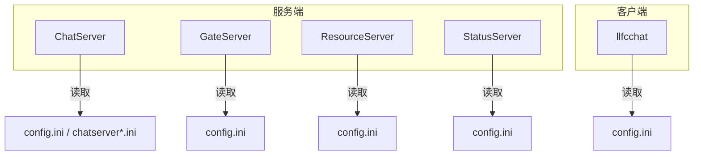
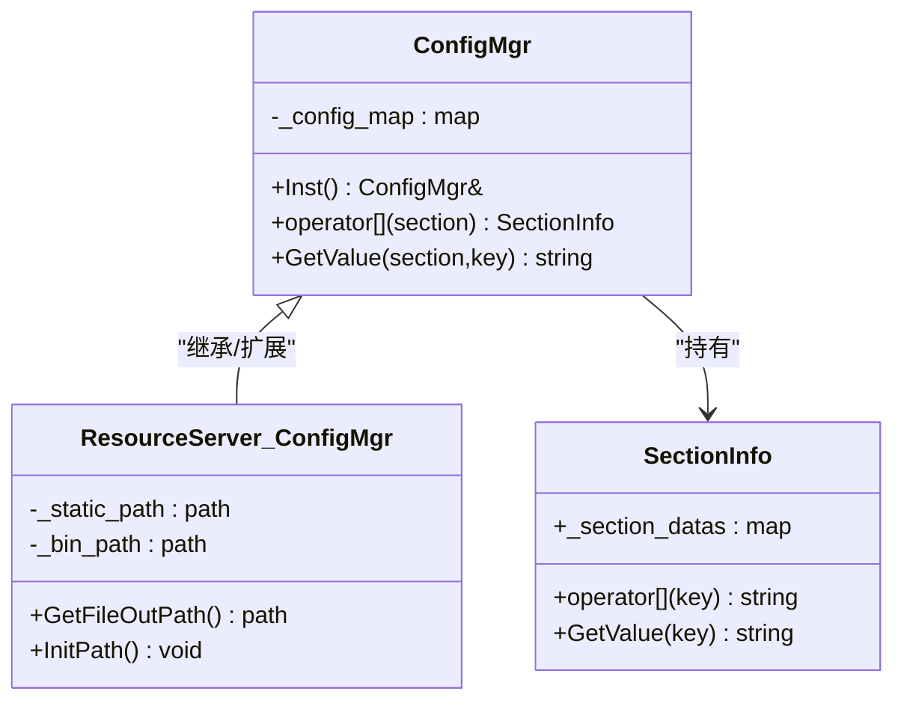
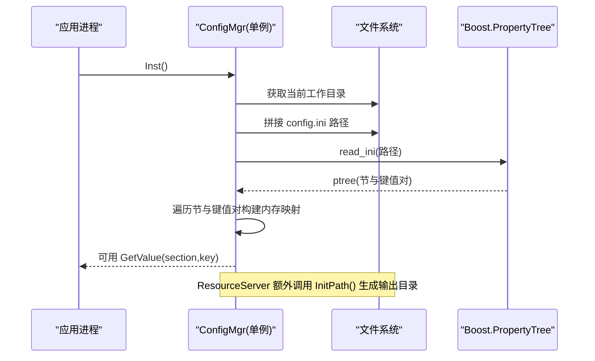
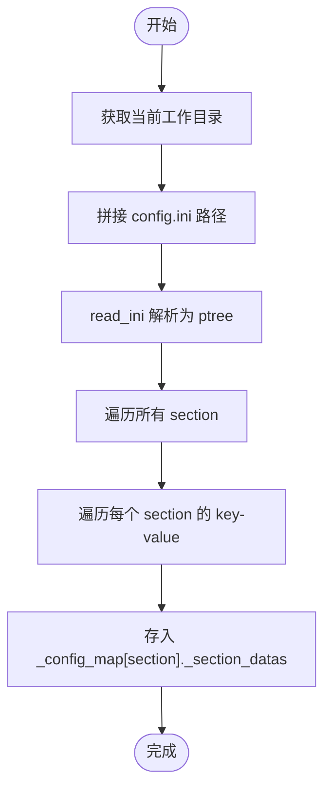
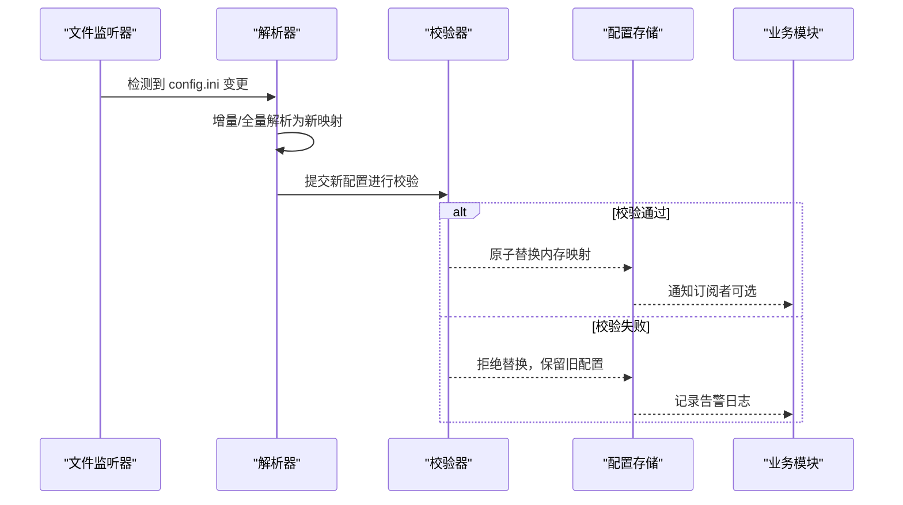
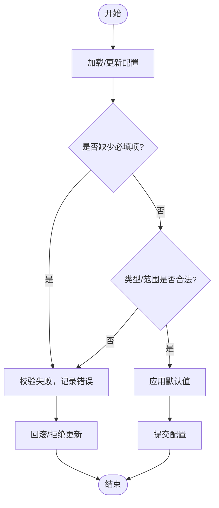
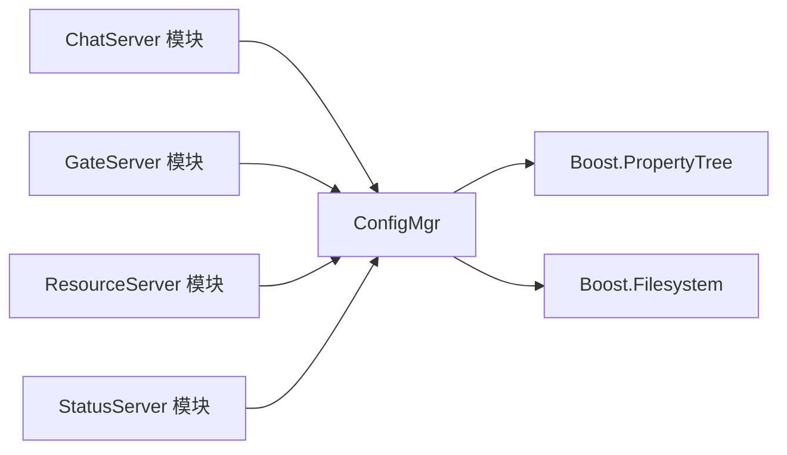

# 配置管理器

<cite>
**本文引用的文件**   
- [server/ChatServer/include/ConfigMgr.h](file://server/ChatServer/include/ConfigMgr.h)
- [server/ChatServer/src/ConfigMgr.cpp](file://server/ChatServer/src/ConfigMgr.cpp)
- [server/GateServer/include/ConfigMgr.h](file://server/GateServer/include/ConfigMgr.h)
- [server/GateServer/src/ConfigMgr.cpp](file://server/GateServer/src/ConfigMgr.cpp)
- [server/ResourceServer/include/ConfigMgr.h](file://server/ResourceServer/include/ConfigMgr.h)
- [server/ResourceServer/src/ConfigMgr.cpp](file://server/ResourceServer/src/ConfigMgr.cpp)
- [server/StatusServer/src/ConfigMgr.cpp](file://server/StatusServer/src/ConfigMgr.cpp)
- [server/ChatServer/config/chatserver1.ini](file://server/ChatServer/config/chatserver1.ini)
- [server/GateServer/config/config.ini](file://server/GateServer/config/config.ini)
- [client/llfcchat/config/config.ini](file://client/llfcchat/config/config.ini)
- [server/ChatServer/src/LogicSystem.cpp](file://server/ChatServer/src/LogicSystem.cpp)
- [server/ChatServer/src/MysqlDao.cpp](file://server/ChatServer/src/MysqlDao.cpp)
- [server/ChatServer/src/RedisMgr.cpp](file://server/ChatServer/src/RedisMgr.cpp)
- [server/GateServer/src/GateServer.cpp](file://server/GateServer/src/GateServer.cpp)
- [server/GateServer/src/MysqlDao.cpp](file://server/GateServer/src/MysqlDao.cpp)
- [server/GateServer/src/RedisMgr.cpp](file://server/GateServer/src/RedisMgr.cpp)
- [server/ResourceServer/src/ChatServerGrpcClient.cpp](file://server/ResourceServer/src/ChatServerGrpcClient.cpp)
- [server/ResourceServer/src/LogicWorker.cpp](file://server/ResourceServer/src/LogicWorker.cpp)
</cite>

## 目录
1. [简介](#简介)
2. [项目结构](#项目结构)
3. [核心组件](#核心组件)
4. [架构总览](#架构总览)
5. [详细组件分析](#详细组件分析)
6. [依赖关系分析](#依赖关系分析)
7. [性能考虑](#性能考虑)
8. [故障排查指南](#故障排查指南)
9. [结论](#结论)
10. [附录](#附录)

## 简介
本技术文档围绕 ConfigMgr 配置管理器，系统性说明其配置文件解析机制、INI 格式读取与解析、热重载能力现状与扩展建议、配置验证体系、多环境差异化配置管理、类型转换与默认值处理、错误回退策略，以及配置文件组织规范与最佳实践。同时给出 API 接口说明与使用示例路径，帮助开发者快速集成与扩展。

## 项目结构
- 服务端各进程（ChatServer、GateServer、ResourceServer、StatusServer）均包含独立的 ConfigMgr 实现，统一通过单例模式提供全局配置访问。
- 客户端 llfcchat 同样拥有独立 config.ini，用于连接 GateServer。
- 配置文件采用 INI 格式，按服务划分目录存放，便于多实例与多环境隔离。

图表来源
- [server/ChatServer/src/ConfigMgr.cpp:1-42](file://server/ChatServer/src/ConfigMgr.cpp#L1-L42)
- [server/GateServer/src/ConfigMgr.cpp:1-42](file://server/GateServer/src/ConfigMgr.cpp#L1-L42)
- [server/ResourceServer/src/ConfigMgr.cpp:1-44](file://server/ResourceServer/src/ConfigMgr.cpp#L1-L44)
- [server/StatusServer/src/ConfigMgr.cpp:1-30](file://server/StatusServer/src/ConfigMgr.cpp#L1-L30)
- [client/llfcchat/config/config.ini:1-4](file://client/llfcchat/config/config.ini#L1-L4)

章节来源
- [server/ChatServer/src/ConfigMgr.cpp:1-42](file://server/ChatServer/src/ConfigMgr.cpp#L1-L42)
- [server/GateServer/src/ConfigMgr.cpp:1-42](file://server/GateServer/src/ConfigMgr.cpp#L1-L42)
- [server/ResourceServer/src/ConfigMgr.cpp:1-44](file://server/ResourceServer/src/ConfigMgr.cpp#L1-L44)
- [server/StatusServer/src/ConfigMgr.cpp:1-30](file://server/StatusServer/src/ConfigMgr.cpp#L1-L30)
- [client/llfcchat/config/config.ini:1-4](file://client/llfcchat/config/config.ini#L1-L4)

## 核心组件
- SectionInfo：表示一个 INI 节（section），内部维护 key-value 映射，提供 [] 与 GetValue 两种访问方式，缺失键返回空串。
- ConfigMgr：单例配置管理器，构造函数中加载当前工作目录下的 config.ini，解析为内存中的 section->key->value 结构；提供 GetValue(section, key) 便捷查询。
- ResourceServer 的 ConfigMgr 额外提供 GetFileOutPath() 与 InitPath()，根据 Output 与 Static 节的 Path 计算静态资源输出目录并自动创建。

图表来源
- [server/ChatServer/include/ConfigMgr.h:9-82](file://server/ChatServer/include/ConfigMgr.h#L9-L82)
- [server/ResourceServer/include/ConfigMgr.h:9-89](file://server/ResourceServer/include/ConfigMgr.h#L9-L89)

章节来源
- [server/ChatServer/include/ConfigMgr.h:9-82](file://server/ChatServer/include/ConfigMgr.h#L9-L82)
- [server/ResourceServer/include/ConfigMgr.h:9-89](file://server/ResourceServer/include/ConfigMgr.h#L9-L89)

## 架构总览
ConfigMgr 在进程启动时完成一次性解析，将 INI 内容载入内存，后续通过单例接口按需读取。ResourceServer 在初始化阶段进一步解析路径并创建目录，供文件写入使用。

图表来源
- [server/ChatServer/src/ConfigMgr.cpp:1-42](file://server/ChatServer/src/ConfigMgr.cpp#L1-L42)
- [server/ResourceServer/src/ConfigMgr.cpp:1-44](file://server/ResourceServer/src/ConfigMgr.cpp#L1-L44)

章节来源
- [server/ChatServer/src/ConfigMgr.cpp:1-42](file://server/ChatServer/src/ConfigMgr.cpp#L1-L42)
- [server/ResourceServer/src/ConfigMgr.cpp:1-44](file://server/ResourceServer/src/ConfigMgr.cpp#L1-L44)

## 详细组件分析

### 配置文件解析机制（INI）
- 解析入口：ConfigMgr 构造函数中通过 Boost.PropertyTree 的 read_ini 读取当前工作目录下的 config.ini。
- 数据结构：每个 section 被转换为 SectionInfo，内部以 std::map<string,string> 存储键值对。
- 访问方式：
  - 直接索引：cfg[section][key]
  - 便捷方法：cfg.GetValue(section, key)
- 缺失处理：未命中键返回空字符串，调用方需自行校验与回退。

图表来源
- [server/ChatServer/src/ConfigMgr.cpp:1-42](file://server/ChatServer/src/ConfigMgr.cpp#L1-L42)
- [server/GateServer/src/ConfigMgr.cpp:1-42](file://server/GateServer/src/ConfigMgr.cpp#L1-L42)
- [server/ResourceServer/src/ConfigMgr.cpp:1-44](file://server/ResourceServer/src/ConfigMgr.cpp#L1-L44)

章节来源
- [server/ChatServer/src/ConfigMgr.cpp:1-42](file://server/ChatServer/src/ConfigMgr.cpp#L1-L42)
- [server/GateServer/src/ConfigMgr.cpp:1-42](file://server/GateServer/src/ConfigMgr.cpp#L1-L42)
- [server/ResourceServer/src/ConfigMgr.cpp:1-44](file://server/ResourceServer/src/ConfigMgr.cpp#L1-L44)

### 配置热重载能力与扩展方案
- 现状：当前实现仅在构造时读取一次，无文件监听与动态更新逻辑。
- 建议扩展：
  - 引入文件监听（如 boost::asio::signal_thread 或平台级文件事件），监控 config.ini 修改时间戳或事件。
  - 变更检测：对比上次解析结果哈希或关键项变化，避免全量重建。
  - 原子替换：解析新配置到临时结构，校验通过后原子替换内存映射，保证并发安全。
  - 线程模型：读路径保持无锁或细粒度锁，写路径加互斥保护。
  - 回滚机制：若新配置校验失败，回滚至上一版本并保持运行。

[该图为概念性流程，不直接映射具体源码，故不提供图表来源]

### 配置验证系统（完整性与有效性）
- 现状：未内置校验逻辑，GetValue 对缺失键返回空串，由调用方判断。
- 建议设计：
  - 定义必填字段清单与类型约束（端口范围、主机名合法性等）。
  - 提供 Validate() 方法，集中校验并返回结构化错误信息。
  - 支持默认值注入：当键缺失时回填默认值，减少调用方分支。
  - 分级校验：启动时强校验（阻断启动）、运行时弱校验（告警+回退）。

[该图为概念性流程，不直接映射具体源码，故不提供图表来源]

### 多环境配置支持（开发、测试、生产）
- 现状：不同服务各自拥有独立 config.ini，ChatServer 提供 chatserver1.ini 与 chatserver2.ini 作为多实例示例。
- 推荐做法：
  - 按环境拆分目录：config/dev、config/test、config/prod，并在部署脚本中指定加载路径。
  - 通过命令行参数或环境变量覆盖关键项（如 Host、Port、Schema）。
  - 使用“基础配置 + 环境覆盖”的策略，减少重复。

章节来源
- [server/ChatServer/config/chatserver1.ini:1-30](file://server/ChatServer/config/chatserver1.ini#L1-L30)
- [server/GateServer/config/config.ini:1-25](file://server/GateServer/config/config.ini#L1-L25)
- [client/llfcchat/config/config.ini:1-4](file://client/llfcchat/config/config.ini#L1-L4)

### 类型转换、默认值与错误回退
- 现状：全部以字符串形式存取，未做类型转换与默认值处理。
- 建议实现：
  - 提供模板化取值函数，如 GetInt(section,key,default)、GetBool(section,key,default)。
  - 转换失败时记录日志并返回默认值，确保健壮性。
  - 对关键配置（端口、路径、密码）增加边界检查与脱敏打印。

章节来源
- [server/ChatServer/include/ConfigMgr.h:9-82](file://server/ChatServer/include/ConfigMgr.h#L9-L82)
- [server/ResourceServer/include/ConfigMgr.h:9-89](file://server/ResourceServer/include/ConfigMgr.h#L9-L89)

### 配置文件组织结构与命名约定
- 节（section）命名：与服务相关域一致，如 GateServer、Mysql、Redis、SelfServer、Output、Static 等。
- 键（key）命名：小驼峰或下划线均可，但需保持一致；常见键包括 Host、Port、User、Passwd、Schema、Name、Path 等。
- 注释规范：INI 标准支持 ; 或 # 注释，建议在复杂配置中添加必要注释。
- 文件命名：服务名 + .ini，如 chatserver1.ini、config.ini。

章节来源
- [server/ChatServer/config/chatserver1.ini:1-30](file://server/ChatServer/config/chatserver1.ini#L1-L30)
- [server/GateServer/config/config.ini:1-25](file://server/GateServer/config/config.ini#L1-L25)
- [client/llfcchat/config/config.ini:1-4](file://client/llfcchat/config/config.ini#L1-L4)

### API 接口说明与使用示例
- 单例获取：ConfigMgr::Inst()
- 读取键值：
  - cfg.GetValue("Section", "Key")
  - cfg["Section"]["Key"]
- ResourceServer 扩展：
  - GetFileOutPath()：返回静态资源输出目录
  - InitPath()：根据 Output.Path 与 Static.Path 计算并创建目录

使用示例（路径引用）：
- ChatServer 中读取 SelfServer.Name：[server/ChatServer/src/LogicSystem.cpp:198](file://server/ChatServer/src/LogicSystem.cpp#L198)
- ChatServer Mysql 初始化读取配置：[server/ChatServer/src/MysqlDao.cpp:5](file://server/ChatServer/src/MysqlDao.cpp#L5)
- ChatServer Redis 初始化读取配置：[server/ChatServer/src/RedisMgr.cpp:5](file://server/ChatServer/src/RedisMgr.cpp#L5)
- GateServer 主流程使用配置：[server/GateServer/src/GateServer.cpp:136](file://server/GateServer/src/GateServer.cpp#L136)
- GateServer Mysql/Redis 初始化：[server/GateServer/src/MysqlDao.cpp:5](file://server/GateServer/src/MysqlDao.cpp#L5), [server/GateServer/src/RedisMgr.cpp:4](file://server/GateServer/src/RedisMgr.cpp#L4)
- ResourceServer 获取文件输出路径：[server/ResourceServer/src/ChatServerGrpcClient.cpp:19](file://server/ResourceServer/src/ChatServerGrpcClient.cpp#L19)
- ResourceServer 业务逻辑中使用输出路径：[server/ResourceServer/src/LogicWorker.cpp:89](file://server/ResourceServer/src/LogicWorker.cpp#L89), [server/ResourceServer/src/LogicWorker.cpp:214](file://server/ResourceServer/src/LogicWorker.cpp#L214), [server/ResourceServer/src/LogicWorker.cpp:324](file://server/ResourceServer/src/LogicWorker.cpp#L324), [server/ResourceServer/src/LogicWorker.cpp:387](file://server/ResourceServer/src/LogicWorker.cpp#L387), [server/ResourceServer/src/LogicWorker.cpp:480](file://server/ResourceServer/src/LogicWorker.cpp#L480), [server/ResourceServer/src/LogicWorker.cpp:570](file://server/ResourceServer/src/LogicWorker.cpp#L570)

章节来源
- [server/ChatServer/src/LogicSystem.cpp:198](file://server/ChatServer/src/LogicSystem.cpp#L198)
- [server/ChatServer/src/MysqlDao.cpp:5](file://server/ChatServer/src/MysqlDao.cpp#L5)
- [server/ChatServer/src/RedisMgr.cpp:5](file://server/ChatServer/src/RedisMgr.cpp#L5)
- [server/GateServer/src/GateServer.cpp:136](file://server/GateServer/src/GateServer.cpp#L136)
- [server/GateServer/src/MysqlDao.cpp:5](file://server/GateServer/src/MysqlDao.cpp#L5)
- [server/GateServer/src/RedisMgr.cpp:4](file://server/GateServer/src/RedisMgr.cpp#L4)
- [server/ResourceServer/src/ChatServerGrpcClient.cpp:19](file://server/ResourceServer/src/ChatServerGrpcClient.cpp#L19)
- [server/ResourceServer/src/LogicWorker.cpp:89](file://server/ResourceServer/src/LogicWorker.cpp#L89)
- [server/ResourceServer/src/LogicWorker.cpp:214](file://server/ResourceServer/src/LogicWorker.cpp#L214)
- [server/ResourceServer/src/LogicWorker.cpp:324](file://server/ResourceServer/src/LogicWorker.cpp#L324)
- [server/ResourceServer/src/LogicWorker.cpp:387](file://server/ResourceServer/src/LogicWorker.cpp#L387)
- [server/ResourceServer/src/LogicWorker.cpp:480](file://server/ResourceServer/src/LogicWorker.cpp#L480)
- [server/ResourceServer/src/LogicWorker.cpp:570](file://server/ResourceServer/src/LogicWorker.cpp#L570)

## 依赖关系分析
- 外部依赖：Boost.PropertyTree（INI 解析）、Boost.Filesystem（路径操作）。
- 内部依赖：各服务模块通过 ConfigMgr::Inst() 获取配置，形成松耦合的依赖关系。
- 潜在风险：单例全局状态在多模块共享，需注意初始化顺序与并发访问安全。

图表来源
- [server/ChatServer/src/ConfigMgr.cpp:1-42](file://server/ChatServer/src/ConfigMgr.cpp#L1-L42)
- [server/ResourceServer/src/ConfigMgr.cpp:1-44](file://server/ResourceServer/src/ConfigMgr.cpp#L1-L44)

章节来源
- [server/ChatServer/src/ConfigMgr.cpp:1-42](file://server/ChatServer/src/ConfigMgr.cpp#L1-L42)
- [server/ResourceServer/src/ConfigMgr.cpp:1-44](file://server/ResourceServer/src/ConfigMgr.cpp#L1-L44)

## 性能考虑
- 解析开销：INI 解析发生在进程启动阶段，影响冷启动时间；建议控制配置文件规模与复杂度。
- 内存占用：内存中保存完整映射，通常较小，可忽略。
- 读取性能：GetValue 为 O(log N) 查找（std::map），对于高频访问可考虑缓存热点键。
- 并发安全：当前实现为只读访问，无需额外同步；若引入热重载，需对读写进行互斥保护。

## 故障排查指南
- 常见问题：
  - 配置文件路径错误：确认运行目录与 config.ini 位置一致。
  - 键不存在：GetValue 返回空串，调用方应判空并提供默认值或告警。
  - 路径创建失败：ResourceServer 的 InitPath 会尝试创建目录，失败时会输出错误日志。
- 定位手段：
  - 查看构造函数中的路径打印与解析输出。
  - 检查各模块读取配置的日志与断言。
  - 对关键配置添加校验与兜底逻辑。

章节来源
- [server/ResourceServer/src/ConfigMgr.cpp:59-82](file://server/ResourceServer/src/ConfigMgr.cpp#L59-L82)

## 结论
ConfigMgr 提供了简洁可靠的 INI 配置读取能力，满足当前多服务、多实例的基础需求。为实现更健壮的运维体验，建议逐步引入配置校验、类型转换、默认值与热重载机制，并结合环境变量与部署脚本完善多环境管理。

## 附录
- 配置文件样例参考：
  - ChatServer 多实例配置：[server/ChatServer/config/chatserver1.ini:1-30](file://server/ChatServer/config/chatserver1.ini#L1-L30)
  - GateServer 配置：[server/GateServer/config/config.ini:1-25](file://server/GateServer/config/config.ini#L1-L25)
  - 客户端配置：[client/llfcchat/config/config.ini:1-4](file://client/llfcchat/config/config.ini#L1-L4)
- 使用示例路径汇总：
  - 读取 SelfServer.Name：[server/ChatServer/src/LogicSystem.cpp:198](file://server/ChatServer/src/LogicSystem.cpp#L198)
  - 数据库与缓存初始化：[server/ChatServer/src/MysqlDao.cpp:5](file://server/ChatServer/src/MysqlDao.cpp#L5), [server/ChatServer/src/RedisMgr.cpp:5](file://server/ChatServer/src/RedisMgr.cpp#L5)
  - 文件输出路径获取：[server/ResourceServer/src/ChatServerGrpcClient.cpp:19](file://server/ResourceServer/src/ChatServerGrpcClient.cpp#L19)
  - 业务逻辑中使用输出路径：[server/ResourceServer/src/LogicWorker.cpp:89](file://server/ResourceServer/src/LogicWorker.cpp#L89), [server/ResourceServer/src/LogicWorker.cpp:214](file://server/ResourceServer/src/LogicWorker.cpp#L214), [server/ResourceServer/src/LogicWorker.cpp:324](file://server/ResourceServer/src/LogicWorker.cpp#L324), [server/ResourceServer/src/LogicWorker.cpp:387](file://server/ResourceServer/src/LogicWorker.cpp#L387), [server/ResourceServer/src/LogicWorker.cpp:480](file://server/ResourceServer/src/LogicWorker.cpp#L480), [server/ResourceServer/src/LogicWorker.cpp:570](file://server/ResourceServer/src/LogicWorker.cpp#L570)