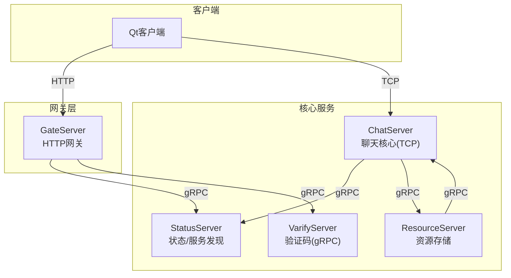
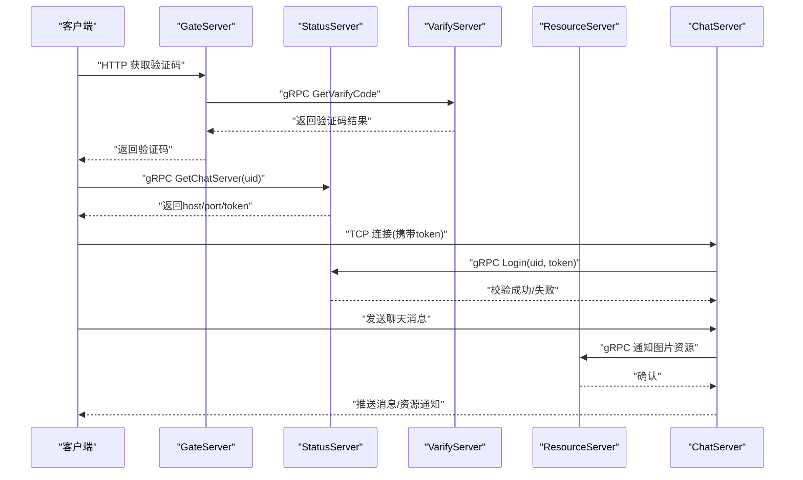
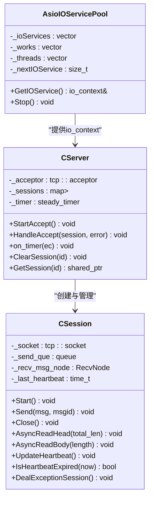
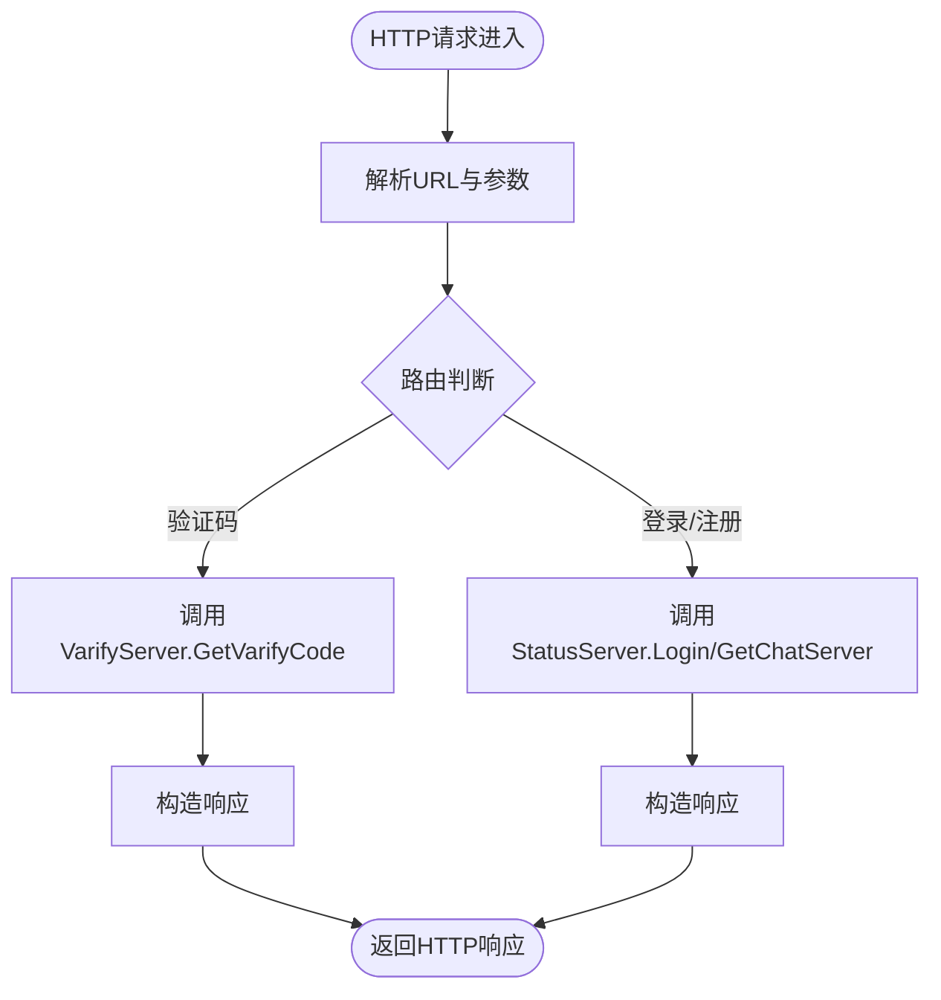
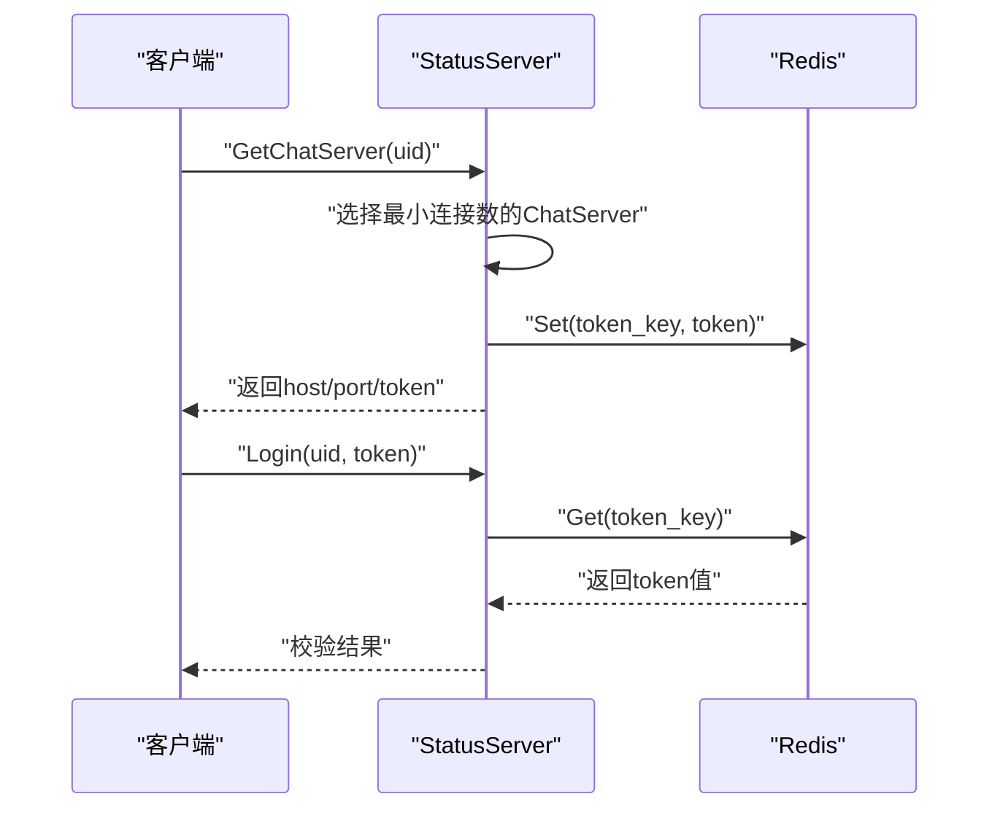
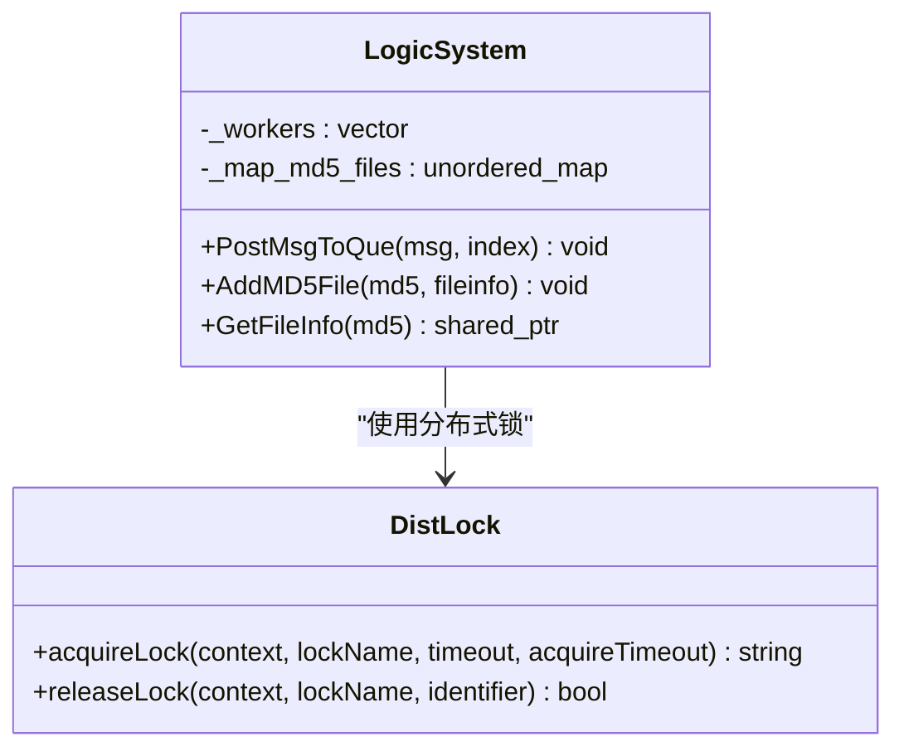
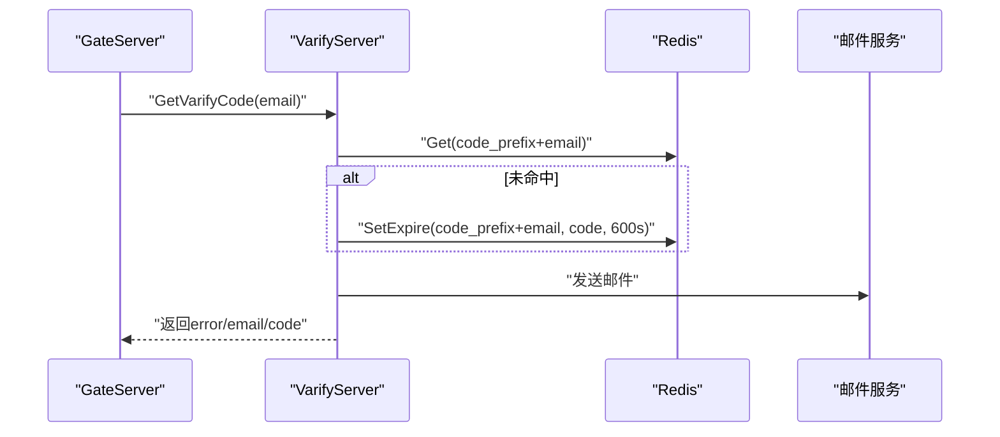
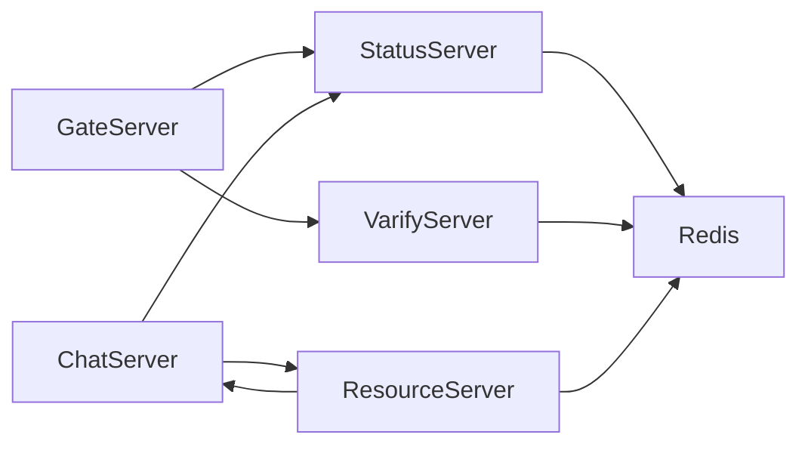

# 服务器架构

<cite>
**本文引用的文件**   
- [README.md](file://README.md)
- [CServer.h（ChatServer）](file://server/ChatServer/include/CServer.h)
- [AsioIOServicePool.h（ChatServer）](file://server/ChatServer/include/AsioIOServicePool.h)
- [CSession.h（ChatServer）](file://server/ChatServer/include/CSession.h)
- [CServer.h（GateServer）](file://server/GateServer/include/CServer.h)
- [HttpConnection.h（GateServer）](file://server/GateServer/include/HttpConnection.h)
- [StatusServiceImpl.h（StatusServer）](file://server/StatusServer/include/StatusServiceImpl.h)
- [StatusServiceImpl.cpp（StatusServer）](file://server/StatusServer/src/StatusServiceImpl.cpp)
- [LogicSystem.h（ResourceServer）](file://server/ResourceServer/include/LogicSystem.h)
- [DistLock.h（ResourceServer）](file://server/ResourceServer/include/DistLock.h)
- [message.proto（chat）](file://server/proto/chat/message.proto)
- [message.proto（control）](file://server/proto/control/message.proto)
- [message.proto（resource）](file://server/proto/resource/message.proto)
- [server.js（VarifyServer）](file://server/VarifyServer/server.js)
- [message.proto（VarifyServer）](file://server/VarifyServer/message.proto)
</cite>

## 目录
1. [引言](#引言)
2. [项目结构](#项目结构)
3. [核心组件](#核心组件)
4. [架构总览](#架构总览)
5. [详细组件分析](#详细组件分析)
6. [依赖关系分析](#依赖关系分析)
7. [性能考量](#性能考量)
8. [故障排查指南](#故障排查指南)
9. [结论](#结论)
10. [附录](#附录)

## 引言
本文件面向LLFCChat微服务集群的服务器端架构，系统性阐述各服务的职责边界、协作方式与关键技术实现。重点覆盖：
- ChatServer聊天核心服务、GateServer HTTP网关服务、StatusServer状态管理服务、ResourceServer资源存储服务、VarifyServer验证码服务的职责划分与交互流程
- 基于Boost.Asio的高性能异步I/O模型，包括AsioIOServicePool线程池设计与CServer/CSession会话管理
- gRPC服务间通信协议设计、负载均衡策略与服务发现机制
- 分布式系统设计：分布式锁、心跳检测、踢人逻辑、故障转移策略
- 配置管理、日志记录、监控告警等横切关注点的落地方案

## 项目结构
服务器端采用多进程微服务组织，每个服务独立构建与部署，通过gRPC进行服务间通信，HTTP由GateServer统一暴露。关键目录与职责如下：
- server/ChatServer：TCP长连接聊天核心，负责会话管理、消息路由、心跳与踢人
- server/GateServer：HTTP网关，处理注册、登录、验证码等HTTP请求，并转发至后端服务
- server/StatusServer：状态管理与服务发现，维护ChatServer实例列表与Token校验
- server/ResourceServer：资源存储与下载，提供文件上传/下载、断点续传、并发控制
- server/VarifyServer：验证码服务，基于gRPC对外提供验证码生成与邮件发送能力
- server/proto：gRPC协议定义，包含chat、control、resource三个命名空间

图表来源
- [CServer.h（GateServer）](file://server/GateServer/include/CServer.h)
- [StatusServiceImpl.h（StatusServer）](file://server/StatusServer/include/StatusServiceImpl.h)
- [message.proto（chat）](file://server/proto/chat/message.proto)
- [message.proto（control）](file://server/proto/control/message.proto)
- [message.proto（resource）](file://server/proto/resource/message.proto)

章节来源
- [README.md](file://README.md)

## 核心组件
- AsioIOServicePool：基于Boost.Asio的IO线程池，按轮询分配io_context，提升并发处理能力
- CServer（ChatServer）：TCP服务端，接受连接、管理会话、定时器心跳检测
- CSession（ChatServer）：单个TCP会话封装，负责读写、粘包处理、心跳更新、异常清理
- HttpConnection（GateServer）：HTTP连接处理器，解析GET参数、响应请求、超时控制
- StatusServiceImpl（StatusServer）：gRPC服务实现，维护ChatServer注册表、Token发放与校验
- LogicSystem（ResourceServer）：资源逻辑调度，文件MD5索引、工作线程队列
- DistLock（ResourceServer/ChatServer）：基于Redis的分布式锁接口，用于跨进程互斥

章节来源
- [AsioIOServicePool.h（ChatServer）](file://server/ChatServer/include/AsioIOServicePool.h)
- [CServer.h（ChatServer）](file://server/ChatServer/include/CServer.h)
- [CSession.h（ChatServer）](file://server/ChatServer/include/CSession.h)
- [HttpConnection.h（GateServer）](file://server/GateServer/include/HttpConnection.h)
- [StatusServiceImpl.h（StatusServer）](file://server/StatusServer/include/StatusServiceImpl.h)
- [LogicSystem.h（ResourceServer）](file://server/ResourceServer/include/LogicSystem.h)
- [DistLock.h（ResourceServer）](file://server/ResourceServer/include/DistLock.h)
- [DistLock.h（ChatServer）](file://server/ChatServer/include/DistLock.h)

## 架构总览
整体采用“HTTP网关 + TCP聊天核心 + 状态服务 + 资源服务 + 验证码服务”的微服务架构。客户端通过GateServer完成认证与验证码获取，随后根据StatusServer返回的ChatServer地址建立TCP长连接；聊天过程中，ChatServer通过gRPC与StatusServer、ResourceServer交互，实现消息路由、资源通知与分布式协调。

图表来源
- [StatusServiceImpl.cpp（StatusServer）](file://server/StatusServer/src/StatusServiceImpl.cpp)
- [server.js（VarifyServer）](file://server/VarifyServer/server.js)
- [message.proto（chat）](file://server/proto/chat/message.proto)
- [message.proto（control）](file://server/proto/control/message.proto)
- [message.proto（resource）](file://server/proto/resource/message.proto)

## 详细组件分析

### ChatServer（聊天核心服务）
- 职责
  - 维护TCP长连接与会话生命周期
  - 处理消息收发、心跳检测、踢人逻辑
  - 通过gRPC与StatusServer、ResourceServer协作
- 关键类
  - CServer：acceptor、会话映射、定时器
  - CSession：socket、读写缓冲、消息队列、心跳时间戳、异常处理
  - AsioIOServicePool：io_context池化与轮询分配

图表来源
- [AsioIOServicePool.h（ChatServer）](file://server/ChatServer/include/AsioIOServicePool.h)
- [CServer.h（ChatServer）](file://server/ChatServer/include/CServer.h)
- [CSession.h（ChatServer）](file://server/ChatServer/include/CSession.h)

章节来源
- [AsioIOServicePool.h（ChatServer）](file://server/ChatServer/include/AsioIOServicePool.h)
- [CServer.h（ChatServer）](file://server/ChatServer/include/CServer.h)
- [CSession.h（ChatServer）](file://server/ChatServer/include/CSession.h)

### GateServer（HTTP网关服务）
- 职责
  - 接收HTTP请求（注册、登录、验证码等）
  - 解析URL参数与请求体
  - 调用gRPC服务（StatusServer、VarifyServer）
  - 返回JSON或HTML响应
- 关键类
  - CServer：监听端口、启动accept循环
  - HttpConnection：单次HTTP请求处理、超时控制、参数解析

图表来源
- [CServer.h（GateServer）](file://server/GateServer/include/CServer.h)
- [HttpConnection.h（GateServer）](file://server/GateServer/include/HttpConnection.h)
- [StatusServiceImpl.cpp（StatusServer）](file://server/StatusServer/src/StatusServiceImpl.cpp)
- [server.js（VarifyServer）](file://server/VarifyServer/server.js)

章节来源
- [CServer.h（GateServer）](file://server/GateServer/include/CServer.h)
- [HttpConnection.h（GateServer）](file://server/GateServer/include/HttpConnection.h)

### StatusServer（状态管理服务）
- 职责
  - 维护ChatServer实例列表（名称、主机、端口、连接数）
  - 为客户端分配ChatServer地址与Token
  - 校验Token有效性，防止重复登录
- 关键实现
  - StatusServiceImpl：从配置文件加载ChatServer列表，选择负载最小节点，生成唯一Token并写入Redis，Login时校验

图表来源
- [StatusServiceImpl.h（StatusServer）](file://server/StatusServer/include/StatusServiceImpl.h)
- [StatusServiceImpl.cpp（StatusServer）](file://server/StatusServer/src/StatusServiceImpl.cpp)

章节来源
- [StatusServiceImpl.h（StatusServer）](file://server/StatusServer/include/StatusServiceImpl.h)
- [StatusServiceImpl.cpp（StatusServer）](file://server/StatusServer/src/StatusServiceImpl.cpp)

### ResourceServer（资源存储服务）
- 职责
  - 文件上传/下载、断点续传、进度回调
  - 基于MD5的文件索引与元数据管理
  - 使用分布式锁避免并发写冲突
- 关键实现
  - LogicSystem：单例，维护文件MD5到FileInfo的映射，工作线程队列处理任务
  - DistLock：封装Redis原子操作，实现acquire/release

图表来源
- [LogicSystem.h（ResourceServer）](file://server/ResourceServer/include/LogicSystem.h)
- [DistLock.h（ResourceServer）](file://server/ResourceServer/include/DistLock.h)

章节来源
- [LogicSystem.h（ResourceServer）](file://server/ResourceServer/include/LogicSystem.h)
- [DistLock.h（ResourceServer）](file://server/ResourceServer/include/DistLock.h)

### VarifyServer（验证码服务）
- 职责
  - 基于gRPC提供验证码生成与邮件发送
  - 使用Redis缓存验证码并设置过期时间
- 关键实现
  - server.js：实现GetVarifyCode，读取/生成验证码，发送邮件，返回错误码

图表来源
- [server.js（VarifyServer）](file://server/VarifyServer/server.js)
- [message.proto（VarifyServer）](file://server/VarifyServer/message.proto)

章节来源
- [server.js（VarifyServer）](file://server/VarifyServer/server.js)
- [message.proto（VarifyServer）](file://server/VarifyServer/message.proto)

## 依赖关系分析
- 协议层
  - chat/control/resource三个proto命名空间定义了统一的gRPC消息与服务接口
- 服务耦合
  - GateServer依赖StatusServer与VarifyServer
  - ChatServer依赖StatusServer（登录校验）与ResourceServer（资源通知）
  - ResourceServer可反向通知ChatServer（图片下载完成）
- 外部依赖
  - Redis：Token存储、验证码缓存、分布式锁
  - Boost.Asio/Beast：高性能网络I/O
  - gRPC：跨语言服务通信

图表来源
- [message.proto（chat）](file://server/proto/chat/message.proto)
- [message.proto（control）](file://server/proto/control/message.proto)
- [message.proto（resource）](file://server/proto/resource/message.proto)

章节来源
- [message.proto（chat）](file://server/proto/chat/message.proto)
- [message.proto（control）](file://server/proto/control/message.proto)
- [message.proto（resource）](file://server/proto/resource/message.proto)

## 性能考量
- AsioIOServicePool线程池
  - 按CPU核数初始化io_context数量，轮询分配，降低锁竞争
  - 使用work_guard确保io_context存活，避免过早退出
- 会话管理
  - CSession内部维护发送队列与互斥锁，保证并发安全
  - 心跳时间戳使用atomic类型，减少同步开销
- 资源处理
  - LogicSystem通过工作线程队列解耦IO与业务逻辑
  - 分布式锁避免并发写冲突，提高一致性

[本节为通用性能建议，不直接分析具体文件]

## 故障排查指南
- 心跳超时与踢人
  - 检查CSession.IsHeartbeatExpired与on_timer逻辑是否触发
  - 确认客户端是否正确发送心跳包
- Token校验失败
  - 检查StatusServiceImpl.Login中Redis键是否存在且值匹配
  - 确认GateServer传递的uid与token是否正确
- 验证码发送失败
  - 查看VarifyServer日志，确认Redis存取与邮件发送模块状态
- 资源下载中断
  - 检查ResourceServer的断点续传逻辑与分布式锁释放情况

章节来源
- [CSession.h（ChatServer）](file://server/ChatServer/include/CSession.h)
- [StatusServiceImpl.cpp（StatusServer）](file://server/StatusServer/src/StatusServiceImpl.cpp)
- [server.js（VarifyServer）](file://server/VarifyServer/server.js)

## 结论
LLFCChat服务器端以微服务架构为核心，结合Boost.Asio与gRPC实现了高并发、可扩展的聊天系统。通过StatusServer提供服务发现与Token校验，GateServer统一接入HTTP流量，ChatServer专注实时通信，ResourceServer承载资源存储，VarifyServer提供验证码能力。分布式锁、心跳检测与踢人逻辑保障了系统的稳定性与一致性。后续可引入更完善的服务注册中心、链路追踪与指标采集以提升可观测性与运维效率。

[本节为总结性内容，不直接分析具体文件]

## 附录
- 配置管理
  - 各服务通过配置文件加载服务列表、端口、数据库与Redis连接信息
- 日志记录
  - 建议在关键路径（握手、登录、消息路由、资源下载）输出结构化日志
- 监控告警
  - 建议采集QPS、延迟、错误率、Redis命中率、线程池利用率等指标

[本节为通用指导，不直接分析具体文件]