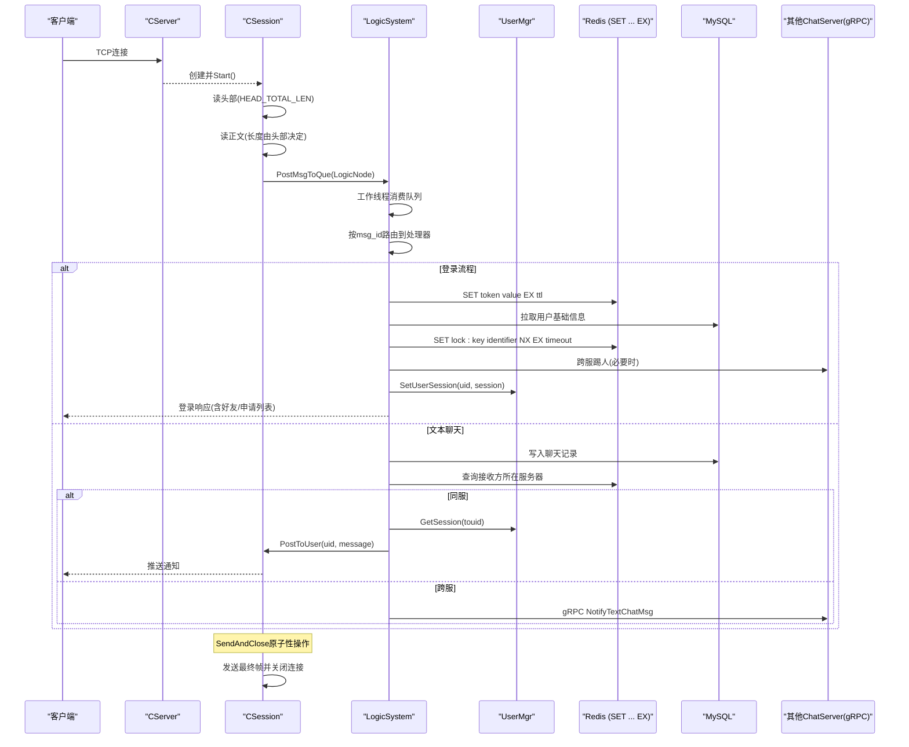
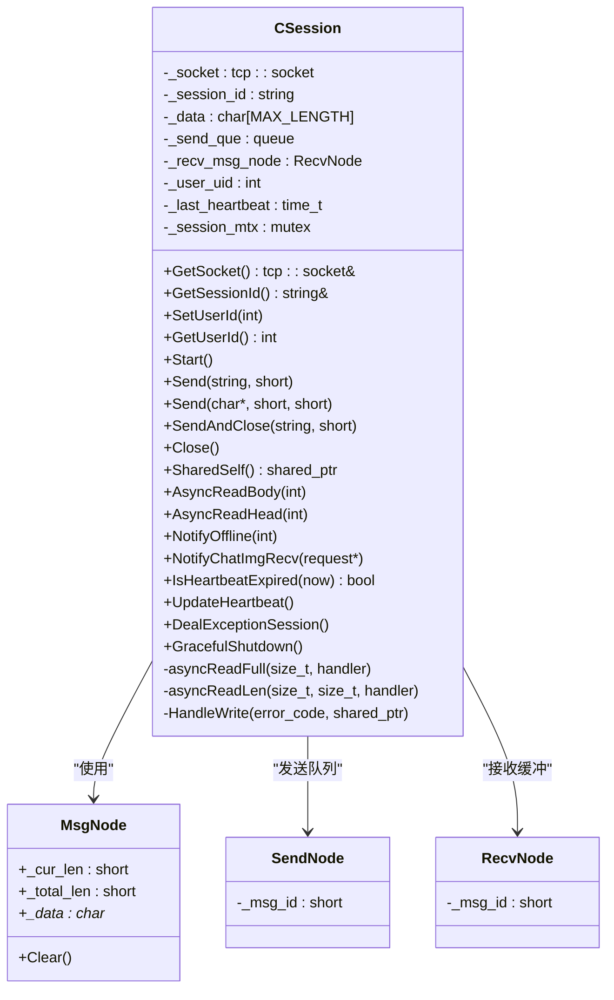
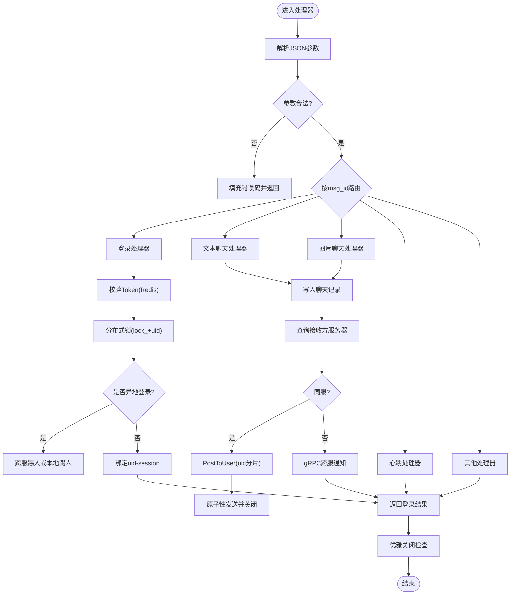
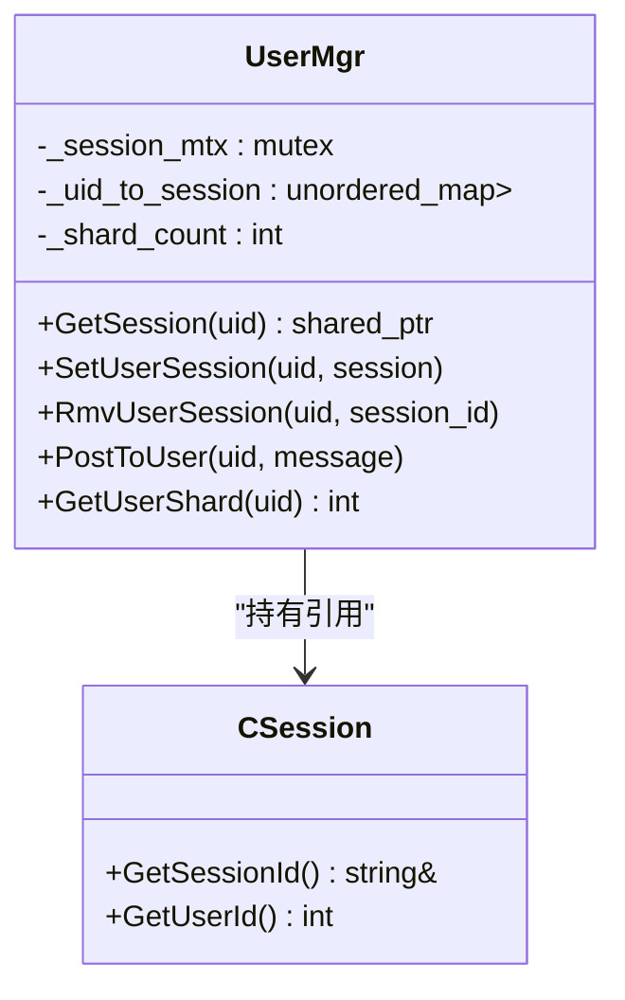
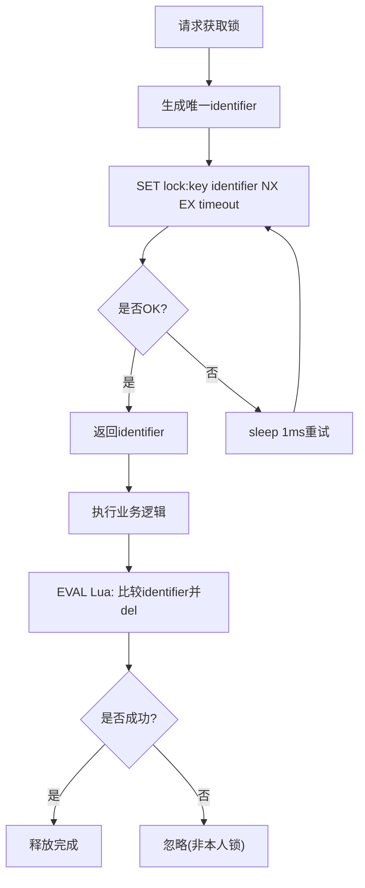
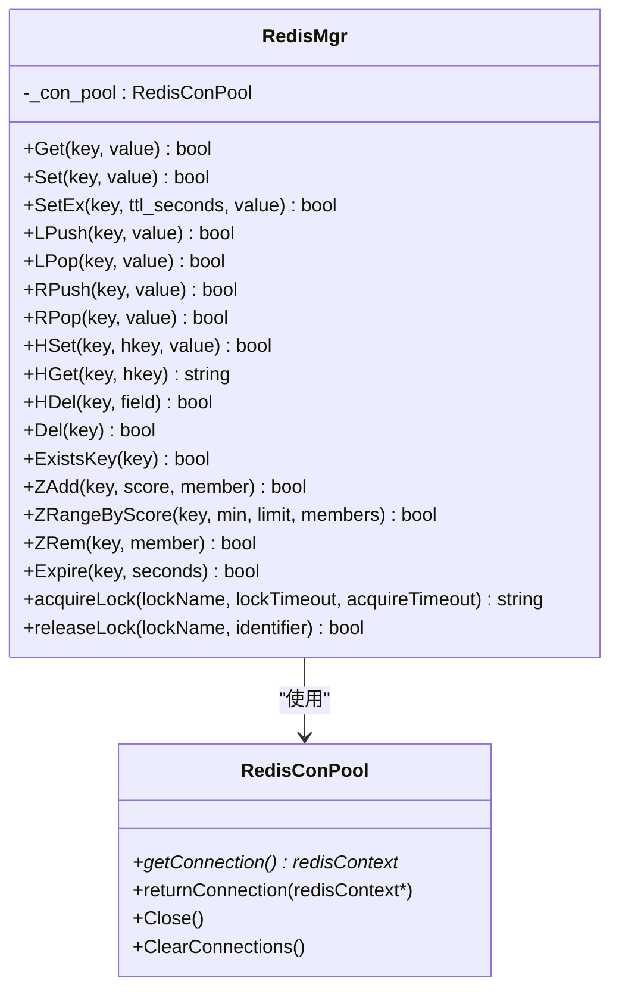
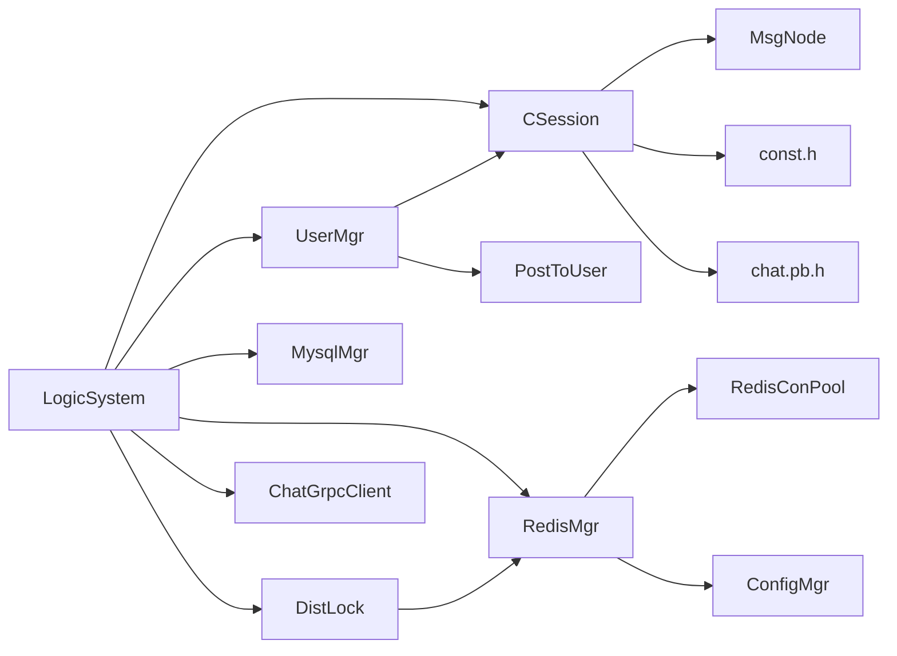

# ChatServer聊天核心服务

<cite>
**本文引用的文件**   
- [CSession.h](file://server/ChatServer/include/CSession.h)
- [CSession.cpp](file://server/ChatServer/src/CSession.cpp)
- [LogicSystem.h](file://server/ChatServer/include/LogicSystem.h)
- [LogicSystem.cpp](file://server/ChatServer/src/LogicSystem.cpp)
- [UserMgr.h](file://server/ChatServer/include/UserMgr.h)
- [UserMgr.cpp](file://server/ChatServer/src/UserMgr.cpp)
- [DistLock.h](file://server/common/include/DistLock.h)
- [DistLock.cpp](file://server/common/src/DistLock.cpp)
- [RedisMgr.h](file://server/ChatServer/include/RedisMgr.h)
- [RedisMgr.cpp](file://server/ChatServer/src/RedisMgr.cpp)
- [data.h](file://server/ChatServer/include/data.h)
- [const.h](file://server/ChatServer/include/const.h)
- [MsgNode.h](file://server/ChatServer/include/MsgNode.h)
- [chat.proto](file://proto/chat_service/chat.proto)
- [CServer.cpp](file://server/ChatServer/src/CServer.cpp)
- [chatserver1.ini](file://server/ChatServer/config/chatserver1.ini)
</cite>

## 更新摘要
**变更内容**   
- RedisManager类更新了Redis命令实现，从SETEX改为SET ... EX语法
- 改进了错误处理和日志输出格式，统一使用"Execute command"前缀
- 分布式锁实现已采用原子性SET NX EX命令，提升可靠性
- 增强了Redis操作的异常处理机制和连接池管理

## 目录
1. [简介](#简介)
2. [项目结构](#项目结构)
3. [核心组件](#核心组件)
4. [架构总览](#架构总览)
5. [详细组件分析](#详细组件分析)
6. [依赖关系分析](#依赖关系分析)
7. [性能考虑](#性能考虑)
8. [故障排查指南](#故障排查指南)
9. [结论](#结论)
10. [附录：消息协议与错误码](#附录消息协议与错误码)

## 简介
本开发文档面向ChatServer聊天核心服务，聚焦其作为实时聊天消息处理中心的职责：TCP连接管理、消息路由与会话维护。重点阐述以下方面：
- CSession类连接生命周期管理（建立、心跳检测、收发、断开）
- LogicSystem业务逻辑处理（消息验证、权限检查、广播机制）
- UserMgr用户状态管理（在线用户列表、好友关系、消息队列）
- 分布式锁实现（多进程数据一致性）
- **更新** RedisManager的Redis命令实现优化，采用现代SET ... EX语法替代废弃的SETEX命令
- 消息协议定义、错误处理策略与性能优化方案

## 项目结构
ChatServer位于server/ChatServer目录，采用分层组织：
- include：头文件定义（会话、逻辑系统、用户管理、分布式锁、数据结构、常量等）
- src：实现文件（IO、业务逻辑、存储访问、配置管理等）
- config：运行期配置文件（端口、RPC、数据库、Redis、对端服务等）
- proto：gRPC接口定义（跨服务通信协议）

```mermaid
graph TB
subgraph "ChatServer"
A["CServer<br/>监听与Accept"] --> B["CSession<br/>TCP会话"]
B --> C["LogicSystem<br/>消息分发与处理"]
C --> D["UserMgr<br/>在线会话映射"]
C --> E["MysqlMgr/RedisMgr<br/>持久化与缓存"]
C --> F["ChatGrpcClient<br/>跨服务通知"]
G["DistLock<br/>Redis分布式锁"] --> C
H["ConfigMgr<br/>配置读取"] --> C
I["PostToUser<br/>uid分片路由"] --> C
end
J["客户端"] --> A
K["Redis服务器<br/>SET ... EX语法"] --> E
L["MySQL数据库"] --> E
end
```

**图表来源** 
- [CServer.cpp:1-133](file://server/ChatServer/src/CServer.cpp#L1-L133)
- [CSession.h:1-86](file://server/ChatServer/include/CSession.h#L1-L86)
- [LogicSystem.h:1-60](file://server/ChatServer/include/LogicSystem.h#L1-L60)
- [UserMgr.h:1-22](file://server/ChatServer/include/UserMgr.h#L1-L22)
- [DistLock.h:1-17](file://server/common/include/DistLock.h#L1-L17)
- [RedisMgr.h:1-95](file://server/ChatServer/include/RedisMgr.h#L1-L95)
- [chat.proto:1-105](file://proto/chat_service/chat.proto#L1-L105)

章节来源
- [CServer.cpp:1-133](file://server/ChatServer/src/CServer.cpp#L1-L133)
- [chatserver1.ini:1-30](file://server/ChatServer/config/chatserver1.ini#L1-L30)

## 核心组件
- CSession：封装单个TCP连接的读写、粘包处理、发送队列、心跳计时、异常清理。**新增** SendAndClose原子性操作和优雅关闭机制。
- LogicSystem：单例消息总线，按消息ID分派到具体处理器；包含登录、搜索、好友申请/认证、文本/图片聊天、心跳、线程加载等。**新增** PostToUser uid分片路由机制。
- UserMgr：维护uid到session的映射，提供获取、设置、移除操作。
- DistLock：基于Redis的分布式锁，支持超时与原子释放，采用SET NX EX原子命令。
- **更新** RedisMgr：Redis管理器，已更新SetEx方法使用SET ... EX语法替代SETEX命令，改进错误处理和日志输出。
- 数据模型：UserInfo、ApplyInfo、ChatThreadInfo、ChatMessage、PageResult、ChatMsgType。
- 常量与协议：ErrorCodes、MSG_IDS、Redis键前缀、gRPC消息类型。

章节来源
- [CSession.h:1-86](file://server/ChatServer/include/CSession.h#L1-L86)
- [LogicSystem.h:1-60](file://server/ChatServer/include/LogicSystem.h#L1-L60)
- [UserMgr.h:1-22](file://server/ChatServer/include/UserMgr.h#L1-L22)
- [DistLock.h:1-17](file://server/common/include/DistLock.h#L1-L17)
- [RedisMgr.h:1-95](file://server/ChatServer/include/RedisMgr.h#L1-L95)
- [data.h:1-65](file://server/ChatServer/include/data.h#L1-L65)
- [const.h:1-104](file://server/ChatServer/include/const.h#L1-L104)

## 架构总览
ChatServer通过AsioIOServicePool进行高并发IO，CServer负责Accept新连接并创建CSession；CSession解析头部与体，将消息投递至LogicSystem队列；LogicSystem在独立工作线程中消费并调用对应处理器；处理器根据目标用户所在服务器选择本地推送或gRPC跨服通知；UserMgr维护内存中的uid->session映射；分布式锁保证关键路径（如踢人、登录互斥）的一致性。**更新** RedisManager采用现代化的SET ... EX语法进行键值过期设置，提升兼容性和性能。



**图表来源** 
- [CServer.cpp:1-133](file://server/ChatServer/src/CServer.cpp#L1-L133)
- [CSession.cpp:1-335](file://server/ChatServer/src/CSession.cpp#L1-L335)
- [LogicSystem.cpp:1-945](file://server/ChatServer/src/LogicSystem.cpp#L1-L945)
- [UserMgr.cpp:1-50](file://server/ChatServer/src/UserMgr.cpp#L1-L50)
- [RedisMgr.cpp:81-109](file://server/ChatServer/src/RedisMgr.cpp#L81-L109)
- [DistLock.cpp:26-48](file://server/common/src/DistLock.cpp#L26-L48)
- [chat.proto:1-105](file://proto/chat_service/chat.proto#L1-L105)

## 详细组件分析

### CSession：连接生命周期与I/O
- 连接建立：构造函数生成唯一session_id，初始化接收缓冲与心跳时间戳；Start()启动头部读取。
- 粘包处理：AsyncReadHead读取固定长度的头部，解析msg_id与msg_len后，进入AsyncReadBody读取完整正文。
- 发送队列：Send将消息入队，使用互斥保护；若队列为空则立即发起异步写，HandleWrite完成后继续出队下一个。
- **新增** SendAndClose原子性操作：确保最终帧发送成功后立即关闭连接，避免资源泄漏。
- 心跳检测：每次成功读取更新_last_heartbeat；IsHeartbeatExpired判断是否超过阈值（默认20秒）。
- 异常处理：网络错误或长度不匹配时关闭socket并触发DealExceptionSession，清理Redis中的会话、IP、Token等信息。
- **新增** 优雅关闭：支持渐进式关闭流程，确保所有待发送消息完成后再释放资源。
- 离线/图片通知：NotifyOffline与NotifyChatImgRecv构造JSON并通过Send下发。



**图表来源** 
- [CSession.h:1-86](file://server/ChatServer/include/CSession.h#L1-L86)
- [MsgNode.h:1-48](file://server/ChatServer/include/MsgNode.h#L1-L48)

章节来源
- [CSession.cpp:1-335](file://server/ChatServer/src/CSession.cpp#L1-L335)
- [CSession.h:1-86](file://server/ChatServer/include/CSession.h#L1-L86)
- [MsgNode.h:1-48](file://server/ChatServer/include/MsgNode.h#L1-L48)

### LogicSystem：业务逻辑与消息路由
- 消息队列与工作线程：PostMsgToQue将LogicNode入队，条件变量唤醒DealMsg；DealMsg循环取出并按msg_id查找回调函数执行。
- 回调注册：RegisterCallBacks绑定各业务处理器（登录、搜索、好友申请/认证、文本/图片聊天、心跳、线程加载等）。
- 登录流程：校验Token、拉取用户基础信息、分布式锁保护登录互斥、跨服踢人、绑定session与uid、返回好友与申请列表。
- 文本聊天：批量插入数据库，查询接收方所在服务器，同服直接推送，跨服通过gRPC通知。
- **新增** PostToUser uid分片路由：根据用户uid计算分片位置，支持跨服负载均衡和故障转移。
- 图片聊天：与文本类似，但走图片通道并通知客户端下载。
- **新增** 优雅关闭序列：确保所有待处理消息完成后再停止服务，避免数据丢失。
- 错误处理：统一使用Defer在析构时回写响应；失败时填充ErrorCodes。



**图表来源** 
- [LogicSystem.cpp:1-945](file://server/ChatServer/src/LogicSystem.cpp#L1-L945)
- [const.h:1-104](file://server/ChatServer/include/const.h#L1-L104)

章节来源
- [LogicSystem.cpp:1-945](file://server/ChatServer/src/LogicSystem.cpp#L1-L945)
- [LogicSystem.h:1-60](file://server/ChatServer/include/LogicSystem.h#L1-L60)
- [const.h:1-104](file://server/ChatServer/include/const.h#L1-L104)

### UserMgr：用户状态管理
- 在线会话映射：内部unordered_map<int, shared_ptr<CSession>>，加锁保护。
- 主要方法：GetSession、SetUserSession、RmvUserSession（校验session_id一致性，避免误删异地登录）。
- **新增** uid分片支持：支持基于uid的用户分布和负载均衡。
- 与CServer协作：CServer在清除session时调用RmvUserSession，确保内存映射与真实连接一致。



**图表来源** 
- [UserMgr.h:1-22](file://server/ChatServer/include/UserMgr.h#L1-L22)
- [UserMgr.cpp:1-50](file://server/ChatServer/src/UserMgr.cpp#L1-L50)
- [CSession.h:1-86](file://server/ChatServer/include/CSession.h#L1-L86)

章节来源
- [UserMgr.cpp:1-50](file://server/ChatServer/src/UserMgr.cpp#L1-L50)
- [UserMgr.h:1-22](file://server/ChatServer/include/UserMgr.h#L1-L22)

### 分布式锁：DistLock
- 获取锁：使用Redis SET key identifier NX EX timeout原子命令，轮询直至成功或超时。
- 释放锁：EVAL Lua脚本比较identifier并原子删除，防止误删他人锁。
- 使用场景：登录互斥、踢人、关键资源更新等。
- **更新** 采用原子性SET NX EX命令，提升锁获取的可靠性和性能。



**图表来源** 
- [DistLock.cpp:26-48](file://server/common/src/DistLock.cpp#L26-L48)
- [DistLock.cpp:51-72](file://server/common/src/DistLock.cpp#L51-L72)
- [DistLock.h:1-17](file://server/common/include/DistLock.h#L1-L17)

章节来源
- [DistLock.cpp:1-73](file://server/common/src/DistLock.cpp#L1-L73)
- [DistLock.h:1-17](file://server/common/include/DistLock.h#L1-L17)

### RedisManager：Redis操作管理
- **更新** SetEx方法：已从SETEX命令迁移到SET ... EX语法，提供更好的兼容性和性能。
- 连接池管理：使用RedisConPool管理Redis连接，支持连接复用和资源回收。
- 错误处理：统一的错误处理机制，详细的日志输出便于问题排查。
- 支持的命令：Get、Set、SetEx、LPush、LPop、RPush、RPop、HSet、HGet、HDel、Del、ExistsKey、ZAdd、ZRangeByScore、ZRem、Expire等。
- **更新** 日志格式：统一使用"Execute command"前缀，提高日志可读性。



**图表来源** 
- [RedisMgr.h:19-93](file://server/ChatServer/include/RedisMgr.h#L19-L93)
- [RedisMgr.cpp:81-109](file://server/ChatServer/src/RedisMgr.cpp#L81-L109)

章节来源
- [RedisMgr.cpp:1-577](file://server/ChatServer/src/RedisMgr.cpp#L1-L577)
- [RedisMgr.h:1-95](file://server/ChatServer/include/RedisMgr.h#L1-L95)

### CServer：定时器与心跳清理
- Accept循环：从AsioIOServicePool获取IO上下文，异步接受连接，创建CSession并Start。
- 定时任务：每60秒遍历会话副本，检测心跳过期，关闭socket并收集待清理会话；统计在线数写入Redis。
- 清理流程：对过期会话调用DealExceptionSession，最终清理Redis中的会话、IP、Token等。
- **新增** 优雅关闭：支持信号处理和渐进式关闭，确保服务安全退出。

章节来源
- [CServer.cpp:1-133](file://server/ChatServer/src/CServer.cpp#L1-L133)
- [CSession.cpp:1-335](file://server/ChatServer/src/CSession.cpp#L1-L335)

## 依赖关系分析
- CSession依赖：boost::asio、MsgNode、const、gRPC生成的pb头。
- LogicSystem依赖：Singleton、queue、thread、CSession、nlohmann/json、data、UserMgr、MysqlMgr、RedisMgr、ChatGrpcClient、DistLock。
- UserMgr依赖：CSession、RedisMgr。
- DistLock依赖：hiredis、Boost UUID。
- **更新** RedisMgr依赖：hiredis、RedisConPool、ConfigMgr、DistLock。
- 外部服务：MySQL、Redis、gRPC对端ChatServer实例。



**图表来源** 
- [CSession.h:1-86](file://server/ChatServer/include/CSession.h#L1-L86)
- [LogicSystem.h:1-60](file://server/ChatServer/include/LogicSystem.h#L1-L60)
- [UserMgr.h:1-22](file://server/ChatServer/include/UserMgr.h#L1-L22)
- [DistLock.h:1-17](file://server/common/include/DistLock.h#L1-L17)
- [RedisMgr.h:1-95](file://server/ChatServer/include/RedisMgr.h#L1-L95)

章节来源
- [CSession.h:1-86](file://server/ChatServer/include/CSession.h#L1-L86)
- [LogicSystem.h:1-60](file://server/ChatServer/include/LogicSystem.h#L1-L60)
- [UserMgr.h:1-22](file://server/ChatServer/include/UserMgr.h#L1-L22)
- [DistLock.h:1-17](file://server/common/include/DistLock.h#L1-L17)
- [RedisMgr.h:1-95](file://server/ChatServer/include/RedisMgr.h#L1-L95)

## 性能考虑
- IO模型：基于Boost.Asio的异步非阻塞IO，配合AsioIOServicePool提升并发能力。
- 粘包处理：固定头部+变长体，减少解析开销；发送队列限流（MAX_SENDQUE）避免内存膨胀。
- 心跳机制：服务端侧定期扫描，客户端侧主动心跳，降低僵尸连接占用。
- 缓存优先：用户基础信息与好友列表优先查Redis，未命中再落库，降低DB压力。
- 跨服通知：仅当接收方不在本服时才发起gRPC调用，减少不必要的远程调用。
- 分布式锁：短超时+Lua原子释放，避免死锁与长时间持有。
- **更新** Redis命令优化：采用SET ... EX语法替代SETEX，提升Redis兼容性。
- **更新** 原子性操作：SendAndClose确保最终帧发送和连接关闭的原子性，避免资源泄漏。
- **更新** 连接池管理：RedisConPool有效管理Redis连接，减少连接创建开销。
- **新增** 优雅关闭：渐进式关闭流程，确保所有待处理消息完成后再释放资源。

## 故障排查指南
- 连接异常：查看CSession::HandleWrite与AsyncRead系列错误分支，确认网络错误与长度不匹配日志。
- 心跳超时：检查CSession::_last_heartbeat更新与CServer::on_timer扫描逻辑，确认客户端心跳频率。
- 登录失败：核对Redis中Token键值、UID有效性、分布式锁竞争情况。
- 跨服通知失败：检查ChatGrpcClient调用与对端服务可用性。
- 内存泄漏：关注MsgNode分配与析构，确保发送/接收缓冲正确释放。
- **更新** Redis命令错误：检查SET ... EX语法是否正确，确认Redis版本兼容性。
- **更新** 分布式锁问题：监控SET NX EX命令的执行状态和Lua脚本执行情况。
- **新增** 连接池问题：检查RedisConPool的连接管理和资源回收机制。
- **新增** 优雅关闭问题：检查服务关闭时的资源释放顺序和消息队列清空状态。

章节来源
- [CSession.cpp:1-335](file://server/ChatServer/src/CSession.cpp#L1-L335)
- [CServer.cpp:1-133](file://server/ChatServer/src/CServer.cpp#L1-L133)
- [LogicSystem.cpp:1-945](file://server/ChatServer/src/LogicSystem.cpp#L1-L945)
- [RedisMgr.cpp:81-109](file://server/ChatServer/src/RedisMgr.cpp#L81-L109)
- [DistLock.cpp:26-48](file://server/common/src/DistLock.cpp#L26-L48)

## 结论
ChatServer以CSession为核心承载TCP会话，LogicSystem作为消息总线驱动业务流转，UserMgr维护在线映射，DistLock保障多进程一致性。**更新** 的RedisManager采用现代化的SET ... EX语法替代废弃的SETEX命令，提升了Redis兼容性和性能。分布式锁实现已优化为原子性SET NX EX命令，增强了锁获取的可靠性。整体设计清晰、可扩展性强，适合大规模即时通讯场景。建议持续优化缓存命中率、监控跨服延迟、完善错误码与可观测性。

## 附录：消息协议与错误码
- 错误码：Success、Error_Json、RPCFailed、VarifyExpired、VarifyCodeErr、UserExist、PasswdErr、EmailNotMatch、PasswdUpFailed、PasswdInvalid、TokenInvalid、UidInvalid、CREATE_CHAT_FAILED、LOAD_CHAT_FAILED。
- 消息ID：登录、搜索、好友申请/认证、文本/图片聊天、心跳、线程加载、文件同步等。
- gRPC接口：NotifyAddFriend、NotifyAuthFriend、NotifyTextChatMsg、NotifyKickUser、NotifyChatImgMsg及对应请求/响应结构。
- **更新** Redis命令：SetEx方法已更新为SET ... EX语法，支持更广泛的Redis版本兼容性。
- **新增** PostToUser接口：支持基于uid的消息路由和分片传输。

章节来源
- [const.h:1-104](file://server/ChatServer/include/const.h#L1-L104)
- [chat.proto:1-105](file://proto/chat_service/chat.proto#L1-L105)
- [RedisMgr.cpp:81-109](file://server/ChatServer/src/RedisMgr.cpp#L81-L109)