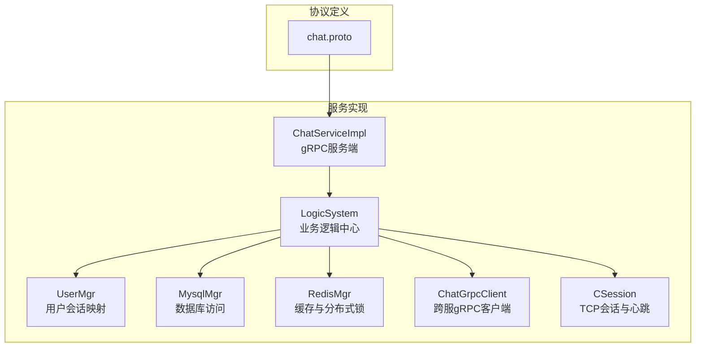
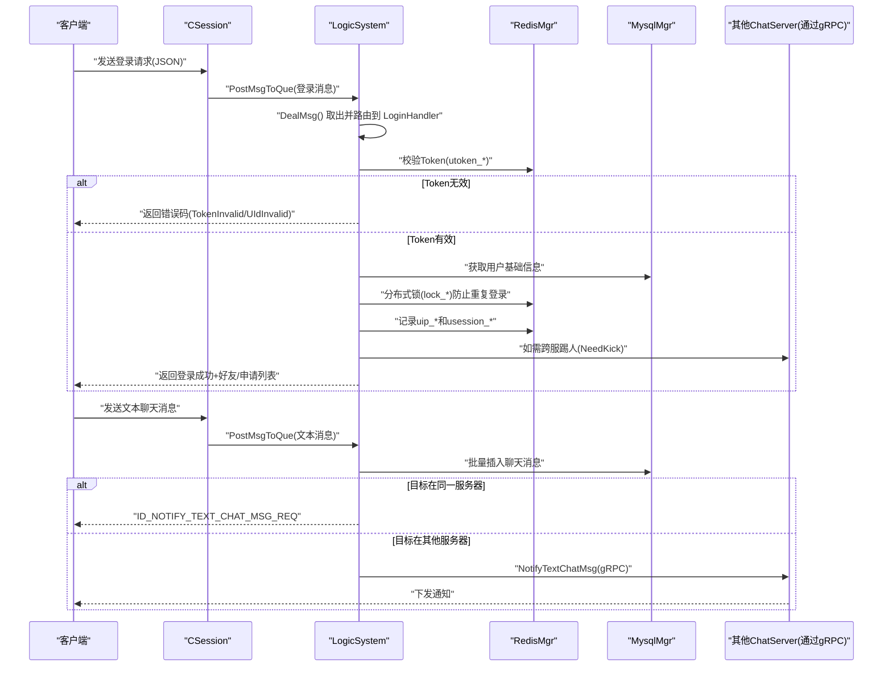
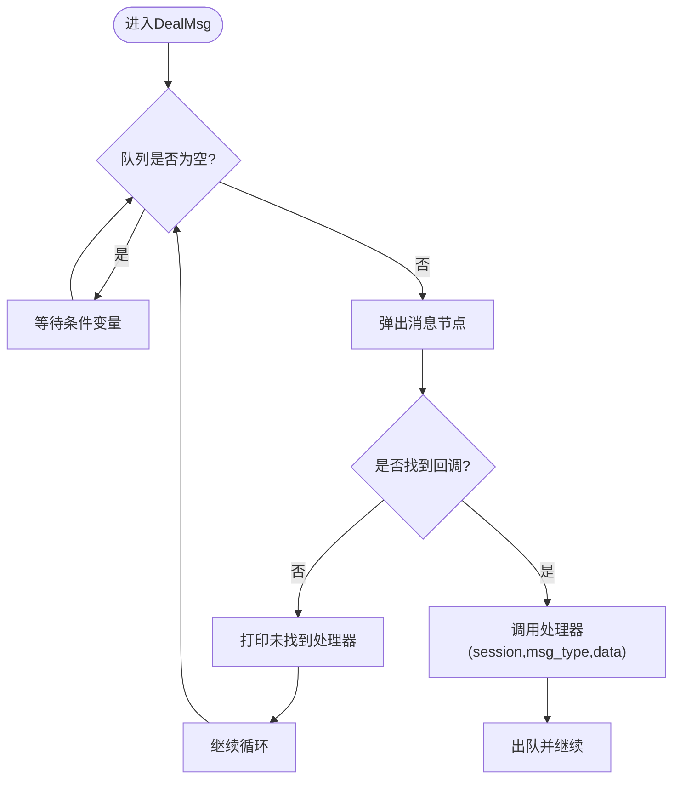
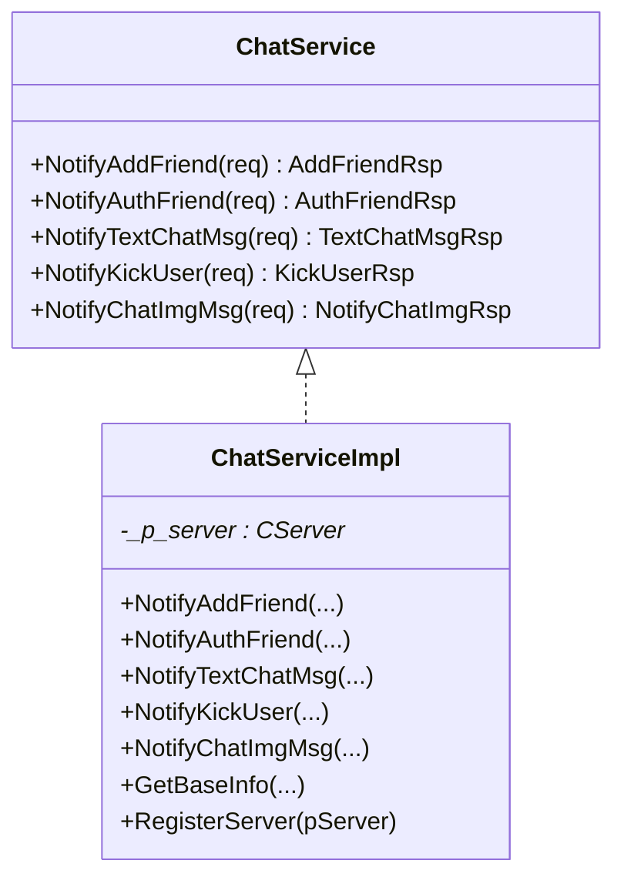
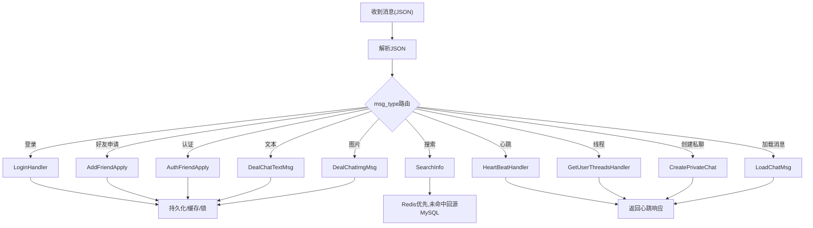
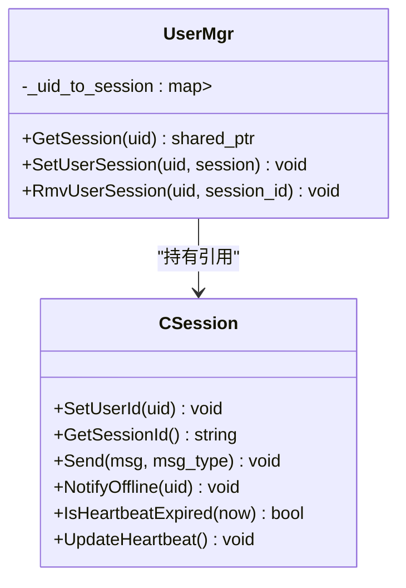
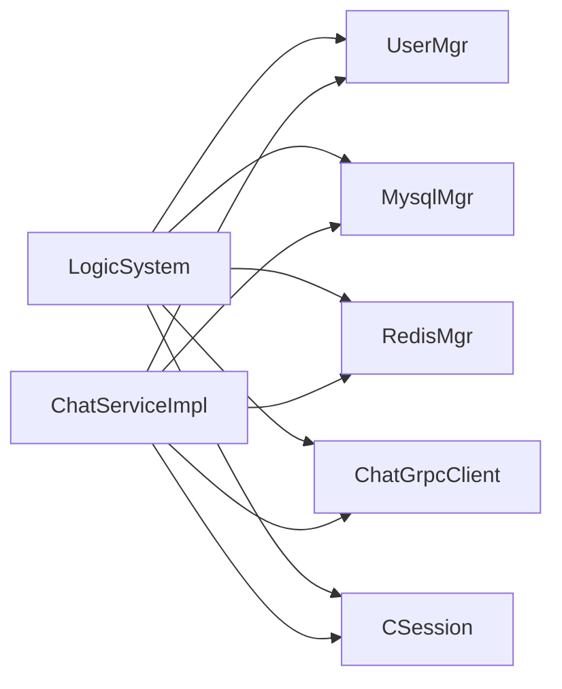

# 业务逻辑系统

<cite>
**本文引用的文件**   
- [LogicSystem.h](file://server/ChatServer/include/LogicSystem.h)
- [LogicSystem.cpp](file://server/ChatServer/src/LogicSystem.cpp)
- [ChatServiceImpl.h](file://server/ChatServer/include/ChatServiceImpl.h)
- [ChatServiceImpl.cpp](file://server/ChatServer/src/ChatServiceImpl.cpp)
- [chat.proto](file://proto/chat_service/chat.proto)
- [UserMgr.h](file://server/ChatServer/include/UserMgr.h)
- [UserMgr.cpp](file://server/ChatServer/src/UserMgr.cpp)
- [data.h](file://server/ChatServer/include/data.h)
- [const.h](file://server/ChatServer/include/const.h)
- [MysqlMgr.h](file://server/ChatServer/include/MysqlMgr.h)
- [CSession.h](file://server/ChatServer/include/CSession.h)
- [RedisMgr.h](file://server/ChatServer/include/RedisMgr.h)
- [ChatGrpcClient.h](file://server/ChatServer/include/ChatGrpcClient.h)
</cite>

## 目录
1. [简介](#简介)
2. [项目结构](#项目结构)
3. [核心组件](#核心组件)
4. [架构总览](#架构总览)
5. [详细组件分析](#详细组件分析)
6. [依赖关系分析](#依赖关系分析)
7. [性能考量](#性能考量)
8. [故障排查指南](#故障排查指南)
9. [结论](#结论)
10. [附录](#附录)

## 简介
本文件面向 ChatServer 的业务逻辑层，系统性说明 LogicSystem 的职责与实现、ChatServiceImpl 的 gRPC 接口契约与处理流程、消息处理管道（解析、识别、分发）、用户状态管理（在线、好友、权限）、事务与一致性保障策略，以及扩展点设计（新增消息类型与业务规则定制）。文档力求以循序渐进的方式呈现，既适合技术读者深入源码，也便于非技术读者理解整体机制。

## 项目结构
ChatServer 的核心代码位于 server/ChatServer 目录，包含网络会话、业务逻辑、数据访问、缓存与分布式锁等模块；gRPC 协议定义在 proto/chat_service/chat.proto。

图表来源
- [chat.proto:1-105](file://proto/chat_service/chat.proto#L1-L105)
- [ChatServiceImpl.h:1-55](file://server/ChatServer/include/ChatServiceImpl.h#L1-L55)
- [LogicSystem.h:1-60](file://server/ChatServer/include/LogicSystem.h#L1-L60)
- [UserMgr.h:1-22](file://server/ChatServer/include/UserMgr.h#L1-L22)
- [MysqlMgr.h:1-41](file://server/ChatServer/include/MysqlMgr.h#L1-L41)
- [RedisMgr.h:1-305](file://server/ChatServer/include/RedisMgr.h#L1-L305)
- [ChatGrpcClient.h:1-116](file://server/ChatServer/include/ChatGrpcClient.h#L1-L116)
- [CSession.h:1-86](file://server/ChatServer/include/CSession.h#L1-L86)

章节来源
- [chat.proto:1-105](file://proto/chat_service/chat.proto#L1-L105)
- [ChatServiceImpl.h:1-55](file://server/ChatServer/include/ChatServiceImpl.h#L1-L55)
- [LogicSystem.h:1-60](file://server/ChatServer/include/LogicSystem.h#L1-L60)

## 核心组件
- LogicSystem：业务层核心，负责消息队列消费、消息路由、权限校验、业务规则处理、跨服务通知与数据持久化协调。
- ChatServiceImpl：gRPC 服务端实现，接收来自 StatusServer、ResourceServer、其他 ChatServer 的通知请求，并转发到本地会话或调用 LogicSystem。
- UserMgr：维护 uid 到 CSession 的内存映射，支持在线用户查找、踢人、会话清理。
- MysqlMgr：封装 MySQL 操作，提供好友申请、认证、聊天线程与消息的增删查。
- RedisMgr：连接池、键值存取、分布式锁、计数器等。
- CSession：基于 Boost.Asio 的 TCP 会话，负责读写、粘包处理、心跳检测、离线通知与图片下载回调。
- ChatGrpcClient：gRPC 客户端连接池，用于跨 ChatServer 实例间通信。

章节来源
- [LogicSystem.h:1-60](file://server/ChatServer/include/LogicSystem.h#L1-L60)
- [ChatServiceImpl.h:1-55](file://server/ChatServer/include/ChatServiceImpl.h#L1-L55)
- [UserMgr.h:1-22](file://server/ChatServer/include/UserMgr.h#L1-L22)
- [MysqlMgr.h:1-41](file://server/ChatServer/include/MysqlMgr.h#L1-L41)
- [RedisMgr.h:1-305](file://server/ChatServer/include/RedisMgr.h#L1-L305)
- [CSession.h:1-86](file://server/ChatServer/include/CSession.h#L1-L86)
- [ChatGrpcClient.h:1-116](file://server/ChatServer/include/ChatGrpcClient.h#L1-L116)

## 架构总览
下图展示从客户端登录到消息投递的全链路交互，包括 gRPC 跨服通知、Redis 缓存与分布式锁、MySQL 持久化及会话推送。

图表来源
- [LogicSystem.cpp:116-252](file://server/ChatServer/src/LogicSystem.cpp#L116-L252)
- [LogicSystem.cpp:472-566](file://server/ChatServer/src/LogicSystem.cpp#L472-L566)
- [ChatServiceImpl.cpp:105-139](file://server/ChatServer/src/ChatServiceImpl.cpp#L105-L139)
- [chat.proto:53-74](file://proto/chat_service/chat.proto#L53-L74)

## 详细组件分析

### LogicSystem：业务层核心
职责概览
- 消息队列与单线程消费者：统一入队、条件变量唤醒、顺序消费，避免并发竞争。
- 消息路由表：按 msg_type 将请求分发至对应处理器（登录、搜索、好友申请/认证、文本/图片聊天、心跳、加载线程/消息等）。
- 权限与状态校验：Token 校验、在线状态检查、分布式锁保护关键路径。
- 数据一致性：优先读 Redis，未命中回源 MySQL 并回填缓存；写路径先落库再通知。
- 跨服通知：根据目标 uid 所在服务器地址，选择本地直发或 gRPC 通知。

关键流程
- 登录流程：校验 token -> 拉取用户基础信息 -> 分布式锁防重登 -> 更新 uip/usession -> 返回好友/申请列表。
- 文本聊天流程：解析 text_array -> 批量入库 -> 构造响应 -> 同服直发或跨服 gRPC 通知。
- 好友申请/认证：写入申请/建立好友关系 -> 查询目标在线状态 -> 同服直发或跨服 gRPC 通知。
- 加载线程/消息：分页查询 threads/messages，返回 load_more 与 next_last_id。

扩展点
- 新增消息类型：在 RegisterCallBacks 中注册 msg_type 到处理器函数；在 DealMsg 中自动路由。
- 自定义业务规则：在处理器内增加校验与分支逻辑，使用 Defer 保证响应一致返回。

图表来源
- [LogicSystem.cpp:43-81](file://server/ChatServer/src/LogicSystem.cpp#L43-L81)
- [LogicSystem.cpp:83-114](file://server/ChatServer/src/LogicSystem.cpp#L83-L114)

章节来源
- [LogicSystem.cpp:16-25](file://server/ChatServer/src/LogicSystem.cpp#L16-L25)
- [LogicSystem.cpp:27-40](file://server/ChatServer/src/LogicSystem.cpp#L27-L40)
- [LogicSystem.cpp:43-81](file://server/ChatServer/src/LogicSystem.cpp#L43-L81)
- [LogicSystem.cpp:83-114](file://server/ChatServer/src/LogicSystem.cpp#L83-L114)
- [LogicSystem.cpp:116-252](file://server/ChatServer/src/LogicSystem.cpp#L116-L252)
- [LogicSystem.cpp:254-352](file://server/ChatServer/src/LogicSystem.cpp#L254-L352)
- [LogicSystem.cpp:354-470](file://server/ChatServer/src/LogicSystem.cpp#L354-L470)
- [LogicSystem.cpp:472-566](file://server/ChatServer/src/LogicSystem.cpp#L472-L566)
- [LogicSystem.cpp:775-826](file://server/ChatServer/src/LogicSystem.cpp#L775-L826)
- [LogicSystem.cpp:828-852](file://server/ChatServer/src/LogicSystem.cpp#L828-L852)
- [LogicSystem.cpp:854-894](file://server/ChatServer/src/LogicSystem.cpp#L854-L894)
- [LogicSystem.cpp:896-945](file://server/ChatServer/src/LogicSystem.cpp#L896-L945)

### ChatServiceImpl：gRPC 接口实现
接口清单与语义
- NotifyAddFriend：跨服通知“添加好友申请”，若目标在线则直接推送 ID_NOTIFY_ADD_FRIEND_REQ。
- NotifyAuthFriend：跨服通知“好友认证成功”，携带历史消息片段，推送 ID_NOTIFY_AUTH_FRIEND_REQ。
- NotifyTextChatMsg：跨服通知“文本聊天消息”，组装 chat_datas 数组后推送 ID_NOTIFY_TEXT_CHAT_MSG_REQ。
- NotifyKickUser：跨服踢人，下线并清理旧会话。
- NotifyChatImgMsg：资源服务器通知图片可下载，触发客户端异步下载。

参数验证与响应格式
- 所有方法均设置 error 字段为 Success，并在找不到目标会话时直接返回 OK（幂等通知）。
- 响应体遵循 chat.proto 定义的 message 结构，确保跨服务一致性。

图表来源
- [chat.proto:6-12](file://proto/chat_service/chat.proto#L6-L12)
- [ChatServiceImpl.h:29-53](file://server/ChatServer/include/ChatServiceImpl.h#L29-L53)

章节来源
- [ChatServiceImpl.cpp:16-47](file://server/ChatServer/src/ChatServiceImpl.cpp#L16-L47)
- [ChatServiceImpl.cpp:49-103](file://server/ChatServer/src/ChatServiceImpl.cpp#L49-L103)
- [ChatServiceImpl.cpp:105-139](file://server/ChatServer/src/ChatServiceImpl.cpp#L105-L139)
- [ChatServiceImpl.cpp:187-210](file://server/ChatServer/src/ChatServiceImpl.cpp#L187-L210)
- [ChatServiceImpl.cpp:217-239](file://server/ChatServer/src/ChatServiceImpl.cpp#L217-L239)
- [chat.proto:14-104](file://proto/chat_service/chat.proto#L14-L104)

### 消息处理管道
- 解析：JSON 解析输入，提取关键字段（uid/touid/thread_id/text_array/md5/name/token 等）。
- 识别：依据 msg_type 路由到具体处理器（登录、搜索、好友、文本/图片、心跳、线程/消息加载）。
- 分发：同服直发（UserMgr 查找 session）或跨服 gRPC（ChatGrpcClient 调用）。
- 持久化：文本/图片消息先入库，再通知；好友申请/认证先写库再通知。
- 响应：统一通过 Defer 构造 JSON 并发送对应响应码。

图表来源
- [LogicSystem.cpp:83-114](file://server/ChatServer/src/LogicSystem.cpp#L83-L114)
- [LogicSystem.cpp:116-252](file://server/ChatServer/src/LogicSystem.cpp#L116-L252)
- [LogicSystem.cpp:254-352](file://server/ChatServer/src/LogicSystem.cpp#L254-L352)
- [LogicSystem.cpp:354-470](file://server/ChatServer/src/LogicSystem.cpp#L354-L470)
- [LogicSystem.cpp:472-566](file://server/ChatServer/src/LogicSystem.cpp#L472-L566)
- [LogicSystem.cpp:775-826](file://server/ChatServer/src/LogicSystem.cpp#L775-L826)
- [LogicSystem.cpp:828-852](file://server/ChatServer/src/LogicSystem.cpp#L828-L852)
- [LogicSystem.cpp:854-894](file://server/ChatServer/src/LogicSystem.cpp#L854-L894)
- [LogicSystem.cpp:896-945](file://server/ChatServer/src/LogicSystem.cpp#L896-L945)

章节来源
- [const.h:49-79](file://server/ChatServer/include/const.h#L49-L79)
- [data.h:40-65](file://server/ChatServer/include/data.h#L40-L65)

### 用户状态管理
- 在线状态：UserMgr 维护 uid->session 映射；登录时绑定 session，踢人时移除。
- 好友关系：MysqlMgr 提供申请与认证接口；认证通过后同步历史消息片段。
- 权限检查：登录阶段校验 token（Redis），跨服踢人通过分布式锁与 uip 映射定位目标服务器。
- 会话生命周期：心跳超时检测、异常连接清理、离线通知。

图表来源
- [UserMgr.h:8-20](file://server/ChatServer/include/UserMgr.h#L8-L20)
- [UserMgr.cpp:10-44](file://server/ChatServer/src/UserMgr.cpp#L10-L44)
- [CSession.h:28-76](file://server/ChatServer/include/CSession.h#L28-L76)

章节来源
- [UserMgr.cpp:10-44](file://server/ChatServer/src/UserMgr.cpp#L10-L44)
- [CSession.h:28-76](file://server/ChatServer/include/CSession.h#L28-L76)

### 事务处理、错误回滚与数据一致性
- 写路径优先落库：文本/图片消息、好友申请/认证均先写入 MySQL，再向对端推送。
- 缓存一致性：读取优先 Redis，未命中回源 MySQL 并回填；登录态、用户基础信息等采用 key 前缀统一管理。
- 分布式锁：登录关键路径使用 Redis 分布式锁，避免多端同时登录导致的状态不一致。
- 错误码体系：统一 ErrorCodes，失败路径快速返回，不阻塞主流程。
- 幂等通知：gRPC 通知即使目标不在线也返回成功，由上层重试或后续上线时补推。

章节来源
- [LogicSystem.cpp:116-252](file://server/ChatServer/src/LogicSystem.cpp#L116-L252)
- [LogicSystem.cpp:472-566](file://server/ChatServer/src/LogicSystem.cpp#L472-L566)
- [RedisMgr.h:290-298](file://server/ChatServer/include/RedisMgr.h#L290-L298)
- [const.h:5-20](file://server/ChatServer/include/const.h#L5-L20)

### 扩展点设计
- 新增消息类型
  - 在 const.h 的 MSG_TYPES 枚举中添加新 msg_type。
  - 在 LogicSystem::RegisterCallBacks 中注册处理器函数。
  - 在 LogicSystem::DealMsg 中无需改动，自动路由。
- 定制业务规则
  - 在对应处理器内增加校验与分支逻辑，使用 Defer 保证响应统一返回。
  - 跨服场景通过 ChatGrpcClient 调用相应 gRPC 接口。
- 数据模型扩展
  - 在 data.h 中扩展 ChatMessage/ChatThreadInfo 等结构。
  - 在 MysqlMgr 中补充对应的 DAO 方法。

章节来源
- [const.h:49-79](file://server/ChatServer/include/const.h#L49-L79)
- [LogicSystem.cpp:83-114](file://server/ChatServer/src/LogicSystem.cpp#L83-L114)
- [data.h:32-65](file://server/ChatServer/include/data.h#L32-L65)
- [MysqlMgr.h:16-35](file://server/ChatServer/include/MysqlMgr.h#L16-L35)

## 依赖关系分析
- LogicSystem 依赖：
  - UserMgr：在线用户查找与踢人。
  - MysqlMgr：好友、聊天线程与消息的持久化。
  - RedisMgr：缓存、分布式锁、计数。
  - ChatGrpcClient：跨服通知。
  - CSession：会话发送与通知。
- ChatServiceImpl 依赖：
  - UserMgr：在线用户查找。
  - CSession：下发通知。
  - MysqlMgr/RedisMgr：用户基础信息查询。
  - ChatGrpcClient：跨服调用（作为客户端）。

图表来源
- [LogicSystem.h:1-60](file://server/ChatServer/include/LogicSystem.h#L1-L60)
- [ChatServiceImpl.h:1-55](file://server/ChatServer/include/ChatServiceImpl.h#L1-L55)
- [UserMgr.h:1-22](file://server/ChatServer/include/UserMgr.h#L1-L22)
- [MysqlMgr.h:1-41](file://server/ChatServer/include/MysqlMgr.h#L1-L41)
- [RedisMgr.h:1-305](file://server/ChatServer/include/RedisMgr.h#L1-L305)
- [ChatGrpcClient.h:1-116](file://server/ChatServer/include/ChatGrpcClient.h#L1-L116)
- [CSession.h:1-86](file://server/ChatServer/include/CSession.h#L1-L86)

章节来源
- [LogicSystem.cpp:1-15](file://server/ChatServer/src/LogicSystem.cpp#L1-L15)
- [ChatServiceImpl.cpp:1-10](file://server/ChatServer/src/ChatServiceImpl.cpp#L1-L10)

## 性能考量
- 单线程逻辑消费：LogicSystem 使用单线程队列消费，降低锁竞争与上下文切换开销，提高吞吐稳定性。
- 连接池：Redis 与 gRPC 均采用连接池，减少握手与序列化开销。
- 缓存优先：读路径优先 Redis，降低数据库压力；写路径先落库再通知，保证最终一致性。
- 批量操作：文本消息批量入库，减少 IO 次数。
- 心跳与超时：CSession 维护心跳时间戳，定期清理异常连接，释放资源。

[本节为通用指导，不直接分析具体文件]

## 故障排查指南
- 登录失败
  - 检查 Redis 中 utoken_* 是否存在且匹配。
  - 确认分布式锁 lock_* 是否被占用，查看日志输出。
  - 核对 uip_* 与 usession_* 是否正确更新。
- 消息未送达
  - 检查目标 uid 是否在线（UserMgr.GetSession）。
  - 跨服场景确认 ChatGrpcClient 调用是否成功。
  - 检查 CSession 发送队列与心跳状态。
- 好友申请/认证异常
  - 确认 MysqlMgr 写入是否成功。
  - 检查通知是否到达目标会话。
- 图片消息问题
  - 确认 MD5、unique_name、token 等字段正确。
  - 检查 NotifyChatImgMsg 是否被 ResourceServer 正确调用。

章节来源
- [LogicSystem.cpp:116-252](file://server/ChatServer/src/LogicSystem.cpp#L116-L252)
- [ChatServiceImpl.cpp:105-139](file://server/ChatServer/src/ChatServiceImpl.cpp#L105-L139)
- [CSession.h:44-49](file://server/ChatServer/include/CSession.h#L44-L49)

## 结论
LogicSystem 作为 ChatServer 的业务中枢，通过统一的队列与路由机制，实现了高内聚的消息处理与跨服务协作；ChatServiceImpl 提供了清晰的 gRPC 边界，支撑多服务协同与水平扩展。结合 Redis 缓存与分布式锁、MySQL 持久化，系统在一致性、可用性与性能之间取得平衡。扩展点设计使得新增消息类型与业务规则具备良好可演进性。

[本节为总结性内容，不直接分析具体文件]

## 附录
- 错误码定义：参见 const.h 中的 ErrorCodes。
- 消息类型：参见 const.h 中的 MSG_TYPES。
- 数据结构：参见 data.h 中的 UserInfo、ApplyInfo、ChatThreadInfo、ChatMessage、PageResult、ChatMsgType。
- gRPC 协议：参见 chat.proto 中的 service 与 message 定义。

章节来源
- [const.h:5-20](file://server/ChatServer/include/const.h#L5-L20)
- [const.h:49-79](file://server/ChatServer/include/const.h#L49-L79)
- [data.h:4-65](file://server/ChatServer/include/data.h#L4-L65)
- [chat.proto:1-105](file://proto/chat_service/chat.proto#L1-L105)