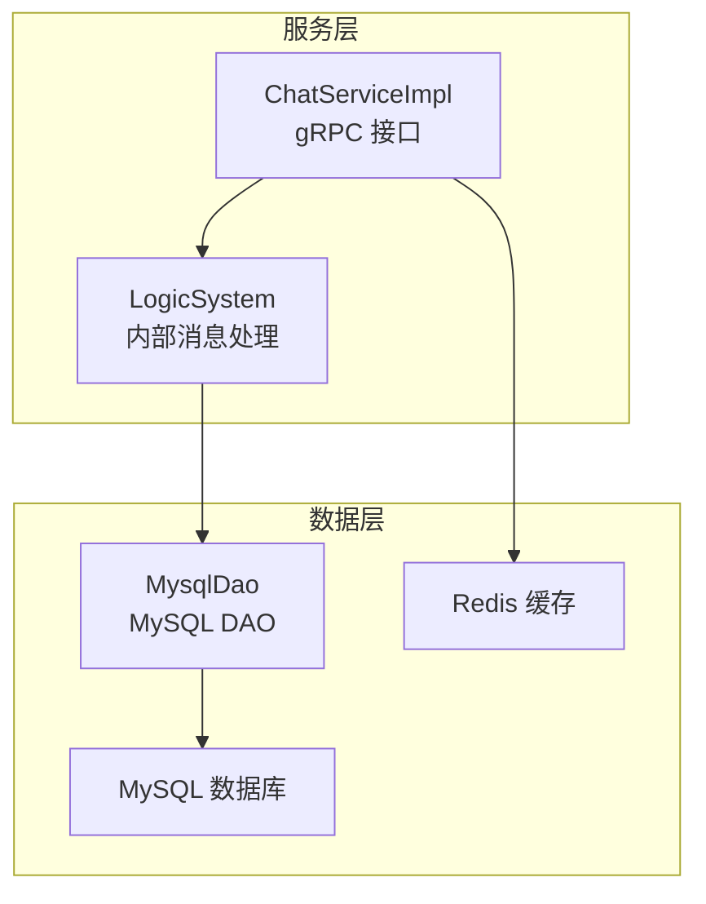
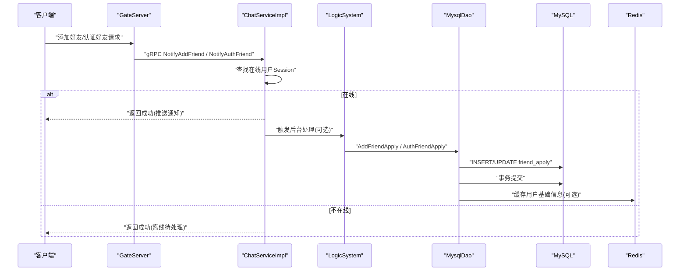
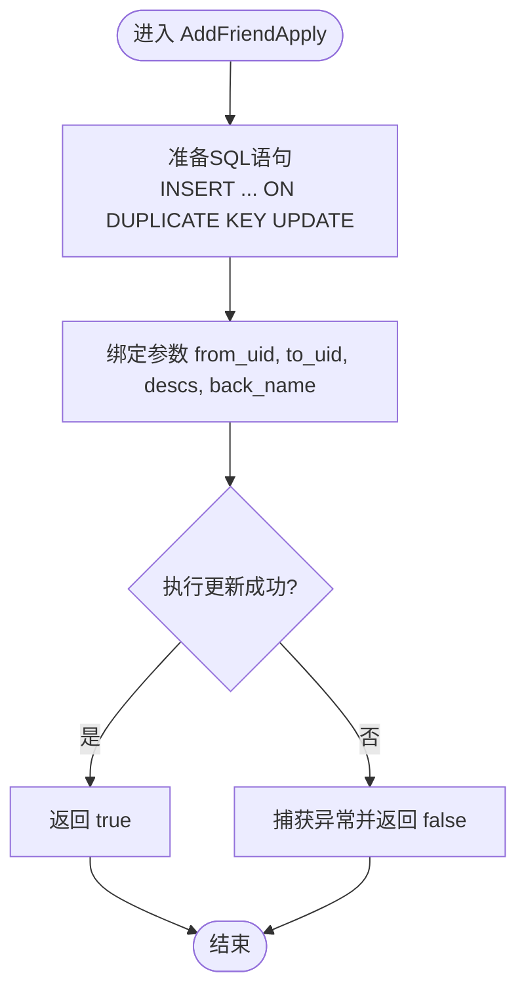
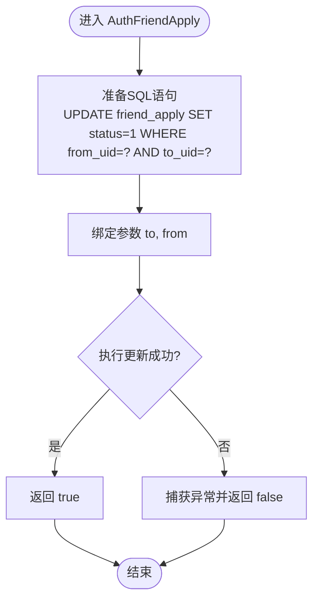
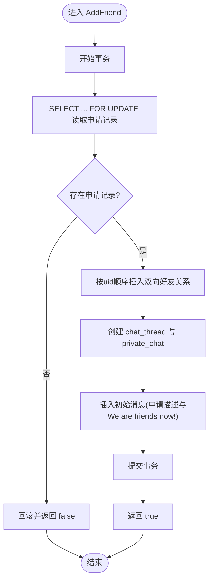
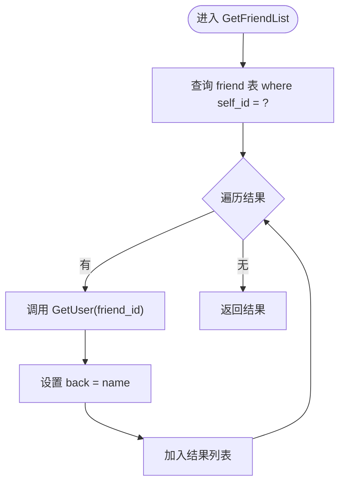
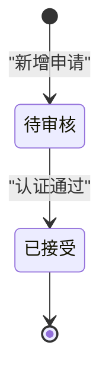
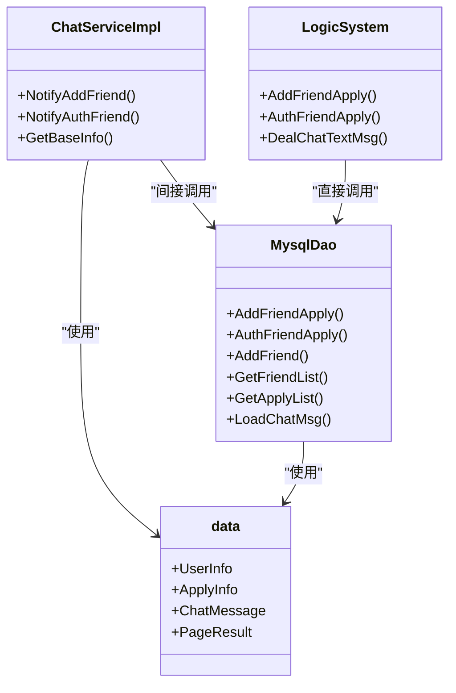

# 好友管理系统

<cite>
**本文引用的文件**   
- [ChatServiceImpl.h](file://server/ChatServer/include/ChatServiceImpl.h)
- [ChatServiceImpl.cpp](file://server/ChatServer/src/ChatServiceImpl.cpp)
- [MysqlDao.h](file://server/ChatServer/include/MysqlDao.h)
- [MysqlDao.cpp](file://server/ChatServer/src/MysqlDao.cpp)
- [LogicSystem.h](file://server/ChatServer/include/LogicSystem.h)
- [data.h](file://server/ChatServer/include/data.h)
- [llfc.sql](file://sql备份/llfc.sql)
</cite>

## 目录
1. [简介](#简介)
2. [项目结构](#项目结构)
3. [核心组件](#核心组件)
4. [架构总览](#架构总览)
5. [详细组件分析](#详细组件分析)
6. [依赖关系分析](#依赖关系分析)
7. [性能考虑](#性能考虑)
8. [故障排查指南](#故障排查指南)
9. [结论](#结论)
10. [附录](#附录)

## 简介
本文件为 ChatServer 好友管理系统的技术文档，重点覆盖以下能力：
- 好友申请与认证流程：AddFriendApply（添加好友申请）与 AuthFriendApply（认证好友申请）的完整实现、状态机与通知机制。
- 好友列表查询：GetFriendList 的数据获取逻辑，包括好友关系查询、用户信息聚合与分页处理。
- 好友搜索：用户名匹配、模糊查询与结果排序的实现思路。
- 数据一致性：事务处理与并发控制机制，避免死锁与重复申请。
- 存储设计：MySQL 表结构与索引优化建议。

## 项目结构
ChatServer 中好友管理相关代码主要分布在以下模块：
- 业务接口层：ChatServiceImpl 暴露 gRPC 接口，负责在线用户的通知推送与基础信息查询。
- 数据访问层：MysqlDao 封装 MySQL 操作，包含好友申请、认证、好友关系建立、聊天会话与消息等。
- 逻辑编排层：LogicSystem 作为内部消息处理器，协调业务调用与数据库操作。
- 数据结构定义：data.h 定义了 UserInfo、ApplyInfo、ChatMessage、PageResult 等关键结构体。
- 数据库脚本：llfc.sql 提供 friend、friend_apply、chat_thread、private_chat、chat_message 等表结构及索引。

图表来源 
- [ChatServiceImpl.cpp:1-240](file://server/ChatServer/src/ChatServiceImpl.cpp#L1-L240)
- [MysqlDao.cpp:1-1104](file://server/ChatServer/src/MysqlDao.cpp#L1-L1104)
- [data.h:1-65](file://server/ChatServer/include/data.h#L1-L65)

章节来源
- [ChatServiceImpl.h:1-55](file://server/ChatServer/include/ChatServiceImpl.h#L1-L55)
- [ChatServiceImpl.cpp:1-240](file://server/ChatServer/src/ChatServiceImpl.cpp#L1-L240)
- [MysqlDao.h:1-270](file://server/ChatServer/include/MysqlDao.h#L1-L270)
- [MysqlDao.cpp:1-1104](file://server/ChatServer/src/MysqlDao.cpp#L1-L1104)
- [LogicSystem.h:1-60](file://server/ChatServer/include/LogicSystem.h#L1-L60)
- [data.h:1-65](file://server/ChatServer/include/data.h#L1-L65)
- [llfc.sql:177-358](file://sql备份/llfc.sql#L177-L358)

## 核心组件
- ChatServiceImpl：对外提供 NotifyAddFriend、NotifyAuthFriend 等 gRPC 方法，用于向在线用户推送好友申请与认证结果，并聚合用户基础信息。
- MysqlDao：实现 AddFriendApply、AuthFriendApply、AddFriend、GetFriendList、GetApplyList、LoadChatMsg 等数据访问方法，使用连接池与事务保证一致性与并发安全。
- LogicSystem：内部消息队列驱动的业务处理器，注册 AddFriendApply、AuthFriendApply 等回调，协调各层调用。
- data.h：定义 UserInfo、ApplyInfo、ChatMessage、PageResult 等数据结构，贯穿应用层与数据层。

章节来源
- [ChatServiceImpl.h:1-55](file://server/ChatServer/include/ChatServiceImpl.h#L1-L55)
- [ChatServiceImpl.cpp:1-240](file://server/ChatServer/src/ChatServiceImpl.cpp#L1-L240)
- [MysqlDao.h:1-270](file://server/ChatServer/include/MysqlDao.h#L1-L270)
- [MysqlDao.cpp:1-1104](file://server/ChatServer/src/MysqlDao.cpp#L1-L1104)
- [LogicSystem.h:1-60](file://server/ChatServer/include/LogicSystem.h#L1-L60)
- [data.h:1-65](file://server/ChatServer/include/data.h#L1-L65)

## 架构总览
好友管理的整体流程如下：
- 客户端发起“添加好友”或“认证好友”请求，由 GateServer 转发至 ChatServer。
- ChatServiceImpl 根据目标用户是否在线，通过 UserMgr 查找 Session 并推送通知。
- 若需持久化，LogicSystem 调用 MysqlDao 进行数据库操作（插入申请记录、更新状态、建立好友关系、创建聊天会话与初始消息）。
- 数据一致性通过 MySQL 事务与行级锁保障；并发冲突通过固定顺序插入与唯一索引避免死锁。

图表来源 
- [ChatServiceImpl.cpp:16-103](file://server/ChatServer/src/ChatServiceImpl.cpp#L16-L103)
- [MysqlDao.cpp:169-244](file://server/ChatServer/src/MysqlDao.cpp#L169-L244)
- [llfc.sql:292-358](file://sql备份/llfc.sql#L292-L358)

## 详细组件分析

### AddFriendApply（添加好友申请）
- 功能说明：将好友申请写入 friend_apply 表，支持幂等更新（ON DUPLICATE KEY UPDATE），防止重复申请。
- 关键实现要点：
  - 使用 PreparedStatement 绑定 from_uid、to_uid、descs、back_name。
  - 利用唯一索引 from_to_uid 保证同一对用户的申请唯一性。
  - 失败时捕获 SQLException 并返回 false。
- 状态管理：新申请默认 status=0（待审核），后续由认证流程更新。
- 并发控制：唯一索引避免重复插入；必要时可在上层加分布式锁保护。

图表来源 
- [MysqlDao.cpp:169-209](file://server/ChatServer/src/MysqlDao.cpp#L169-L209)
- [llfc.sql:292-304](file://sql备份/llfc.sql#L292-L304)

章节来源
- [MysqlDao.cpp:169-209](file://server/ChatServer/src/MysqlDao.cpp#L169-L209)
- [llfc.sql:292-304](file://sql备份/llfc.sql#L292-L304)

### AuthFriendApply（认证好友申请）
- 功能说明：将反向申请（from 与 to 互换）的状态更新为已接受（status=1），表示双方互为好友。
- 关键实现要点：
  - 使用 UPDATE 语句设置 status=1，条件为 from_uid=to、to_uid=from。
  - 失败时捕获异常并返回 false。
- 状态机转换：从“待审核”（0）到“已接受”（1）。

图表来源 
- [MysqlDao.cpp:211-244](file://server/ChatServer/src/MysqlDao.cpp#L211-L244)
- [llfc.sql:292-304](file://sql备份/llfc.sql#L292-L304)

章节来源
- [MysqlDao.cpp:211-244](file://server/ChatServer/src/MysqlDao.cpp#L211-L244)
- [llfc.sql:292-304](file://sql备份/llfc.sql#L292-L304)

### AddFriend（建立好友关系与聊天会话）
- 功能说明：在认证通过后，建立双向好友关系、创建私聊会话 thread、插入初始消息，并返回需要推送的消息集合。
- 关键实现要点：
  - 开启事务，使用 FOR UPDATE 锁定申请记录，读取 back_name 与 descs。
  - 按 uid 大小顺序插入 friend 记录，避免死锁。
  - 创建 chat_thread 与 private_chat，插入两条初始消息（申请描述与“We are friends now!”）。
  - 失败时回滚事务并返回 false。
- 并发控制：FOR UPDATE + 固定顺序插入确保一致性。

图表来源 
- [MysqlDao.cpp:247-504](file://server/ChatServer/src/MysqlDao.cpp#L247-L504)
- [llfc.sql:177-187](file://sql备份/llfc.sql#L177-L187)
- [llfc.sql:147-175](file://sql备份/llfc.sql#L147-L175)
- [llfc.sql:406-418](file://sql备份/llfc.sql#L406-L418)

章节来源
- [MysqlDao.cpp:247-504](file://server/ChatServer/src/MysqlDao.cpp#L247-L504)
- [llfc.sql:177-187](file://sql备份/llfc.sql#L177-L187)
- [llfc.sql:147-175](file://sql备份/llfc.sql#L147-L175)
- [llfc.sql:406-418](file://sql备份/llfc.sql#L406-L418)

### GetFriendList（好友列表查询）
- 功能说明：根据 self_id 查询好友关系，并聚合用户信息（昵称、头像、性别等）。
- 关键实现要点：
  - 查询 friend 表中 self_id 对应的所有 friend_id。
  - 对每个 friend_id 调用 GetUser 获取用户详情。
  - 将 back 字段设置为 name 后加入结果集。
- 分页处理：当前实现未分页，建议在 SQL 层增加 LIMIT/OFFSET 或使用游标分页。

图表来源 
- [MysqlDao.cpp:635-678](file://server/ChatServer/src/MysqlDao.cpp#L635-L678)
- [MysqlDao.cpp:508-548](file://server/ChatServer/src/MysqlDao.cpp#L508-L548)

章节来源
- [MysqlDao.cpp:635-678](file://server/ChatServer/src/MysqlDao.cpp#L635-L678)
- [MysqlDao.cpp:508-548](file://server/ChatServer/src/MysqlDao.cpp#L508-L548)

### 好友申请状态机
- 状态定义：
  - 0：待审核（新增申请时的默认值）
  - 1：已接受（认证通过后更新）
- 状态转换：
  - 新增申请：status=0
  - 认证通过：status=1
- 约束：
  - friend_apply 表的 from_to_uid 唯一索引确保一对申请只有一条记录。

图表来源 
- [llfc.sql:292-304](file://sql备份/llfc.sql#L292-L304)
- [MysqlDao.cpp:169-244](file://server/ChatServer/src/MysqlDao.cpp#L169-L244)

章节来源
- [llfc.sql:292-304](file://sql备份/llfc.sql#L292-L304)
- [MysqlDao.cpp:169-244](file://server/ChatServer/src/MysqlDao.cpp#L169-L244)

### 好友搜索功能
- 需求说明：支持用户名精确匹配与模糊查询，并按相关性排序。
- 实现建议：
  - 精确匹配：WHERE name = ?
  - 模糊查询：WHERE name LIKE ? ESCAPE 处理特殊字符
  - 排序：ORDER BY CASE WHEN name = ? THEN 0 ELSE 1 END, name
- 注意：模糊查询可能无法命中索引，建议结合业务量评估是否需要全文索引或搜索引擎。

章节来源
- [MysqlDao.cpp:550-590](file://server/ChatServer/src/MysqlDao.cpp#L550-L590)
- [llfc.sql:464-481](file://sql备份/llfc.sql#L464-L481)

### 事务处理与并发控制
- 事务边界：AddFriend 中使用 setAutoCommit(false) 手动管理事务，确保多步操作的原子性。
- 行级锁：SELECT ... FOR UPDATE 锁定申请记录，避免并发认证导致的竞争。
- 死锁规避：按 uid 大小顺序插入 friend 记录，统一锁顺序。
- 错误处理：捕获 SQLException，判断错误码（如死锁 1213、唯一键冲突 1062），必要时重试或回滚。

章节来源
- [MysqlDao.cpp:247-504](file://server/ChatServer/src/MysqlDao.cpp#L247-L504)
- [MysqlDao.cpp:772-869](file://server/ChatServer/src/MysqlDao.cpp#L772-L869)

### 通知机制
- 在线用户：ChatServiceImpl 通过 UserMgr 获取 Session，发送 ID_NOTIFY_ADD_FRIEND_REQ 或 ID_NOTIFY_AUTH_FRIEND_REQ。
- 离线用户：直接返回成功，由后端异步处理或下次上线时同步。
- 用户信息聚合：优先从 Redis 缓存获取，不存在则查 MySQL 并回填缓存。

章节来源
- [ChatServiceImpl.cpp:16-103](file://server/ChatServer/src/ChatServiceImpl.cpp#L16-L103)
- [ChatServiceImpl.cpp:142-185](file://server/ChatServer/src/ChatServiceImpl.cpp#L142-L185)

## 依赖关系分析
- ChatServiceImpl 依赖 UserMgr、CSession、RedisMgr、MysqlMgr 完成通知与数据获取。
- MysqlDao 依赖 MySqlPool 管理连接池，封装所有 MySQL 操作。
- LogicSystem 作为内部消息调度器，注册 AddFriendApply、AuthFriendApply 等回调，协调业务流。
- 数据结构 data.h 被各层共享，确保类型一致。

图表来源 
- [ChatServiceImpl.h:1-55](file://server/ChatServer/include/ChatServiceImpl.h#L1-L55)
- [MysqlDao.h:1-270](file://server/ChatServer/include/MysqlDao.h#L1-L270)
- [LogicSystem.h:1-60](file://server/ChatServer/include/LogicSystem.h#L1-L60)
- [data.h:1-65](file://server/ChatServer/include/data.h#L1-L65)

章节来源
- [ChatServiceImpl.h:1-55](file://server/ChatServer/include/ChatServiceImpl.h#L1-L55)
- [MysqlDao.h:1-270](file://server/ChatServer/include/MysqlDao.h#L1-L270)
- [LogicSystem.h:1-60](file://server/ChatServer/include/LogicSystem.h#L1-L60)
- [data.h:1-65](file://server/ChatServer/include/data.h#L1-L65)

## 性能考虑
- 连接池：MySqlPool 维护固定数量的连接，定期检测健康状态并自动重连。
- 缓存策略：用户基础信息优先从 Redis 读取，降低 MySQL 压力。
- 分页查询：聊天消息与线程列表采用 LIMIT N+1 判断是否有下一页，减少不必要的数据传输。
- 索引优化：friend_apply、friend、chat_message、private_chat 等表已定义必要索引，建议根据查询模式补充复合索引。

[本节为通用指导，无需特定文件引用]

## 故障排查指南
- 常见错误：
  - 唯一键冲突（error code 1062）：检查 friend_apply 或 friend 表重复插入。
  - 死锁（error code 1213）：确认插入顺序与锁范围，必要时重试。
  - 连接超时：检查 MySqlPool 健康检查与重连逻辑。
- 日志定位：SQLException 输出包含错误码与 SQLState，便于快速定位问题。
- 调试建议：
  - 打印关键 SQL 与参数。
  - 检查事务提交与回滚路径。
  - 验证 Redis 缓存键是否存在。

章节来源
- [MysqlDao.cpp:486-504](file://server/ChatServer/src/MysqlDao.cpp#L486-L504)
- [MysqlDao.cpp:837-869](file://server/ChatServer/src/MysqlDao.cpp#L837-L869)

## 结论
ChatServer 的好友管理系统通过清晰的层次划分与严谨的事务控制，实现了可靠的好友申请、认证与关系建立流程。结合 Redis 缓存与 MySQL 索引优化，系统在并发场景下仍能保持良好性能。未来可进一步优化分页查询与搜索功能，提升用户体验。

[本节为总结，无需特定文件引用]

## 附录
- 表结构设计参考：
  - friend：self_id、friend_id、back，唯一索引 self_friend。
  - friend_apply：from_uid、to_uid、status、descs、back_name，唯一索引 from_to_uid。
  - chat_thread：type、created_at。
  - private_chat：thread_id、user1_id、user2_id，唯一索引 uniq_private_thread。
  - chat_message：message_id、thread_id、sender_id、recv_id、content、created_at、updated_at、status、msg_type，索引 idx_thread_created、idx_thread_message。

章节来源
- [llfc.sql:177-187](file://sql备份/llfc.sql#L177-L187)
- [llfc.sql:292-304](file://sql备份/llfc.sql#L292-L304)
- [llfc.sql:147-175](file://sql备份/llfc.sql#L147-L175)
- [llfc.sql:406-418](file://sql备份/llfc.sql#L406-L418)
- [llfc.sql:24-37](file://sql备份/llfc.sql#L24-L37)