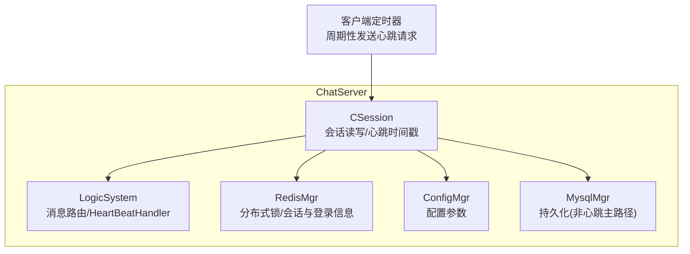
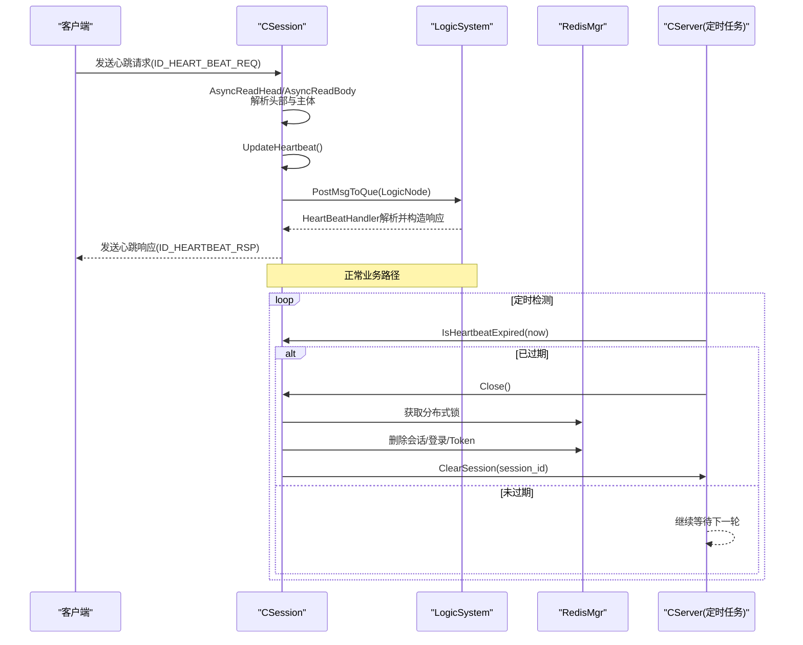
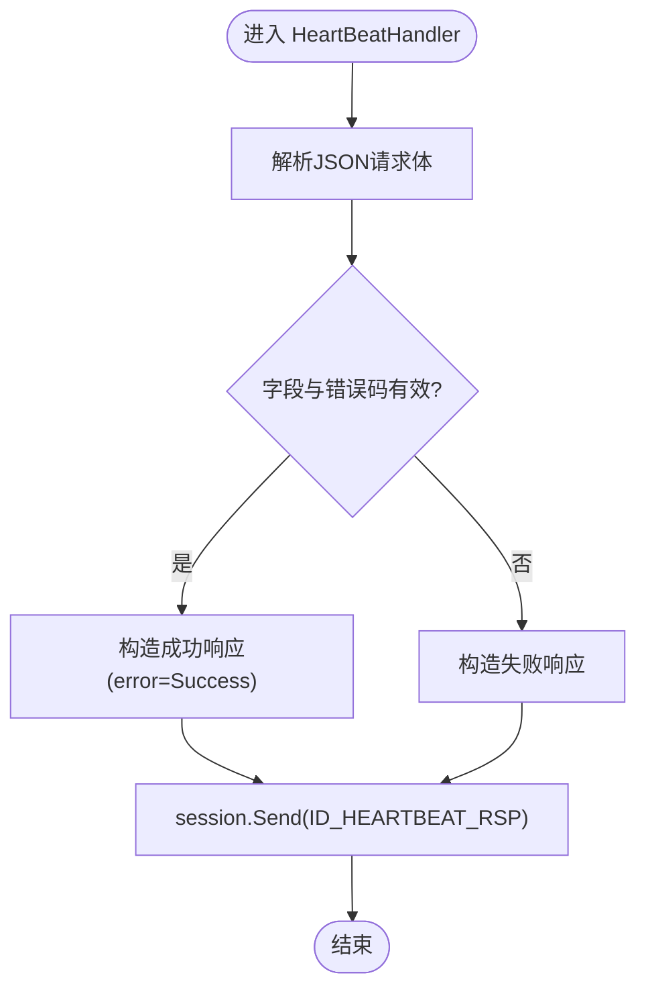
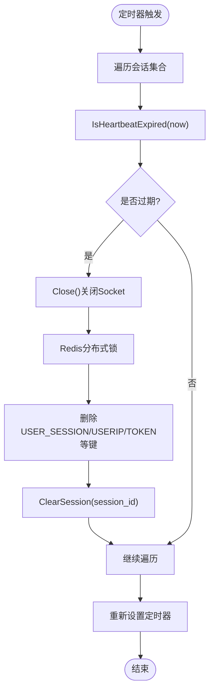
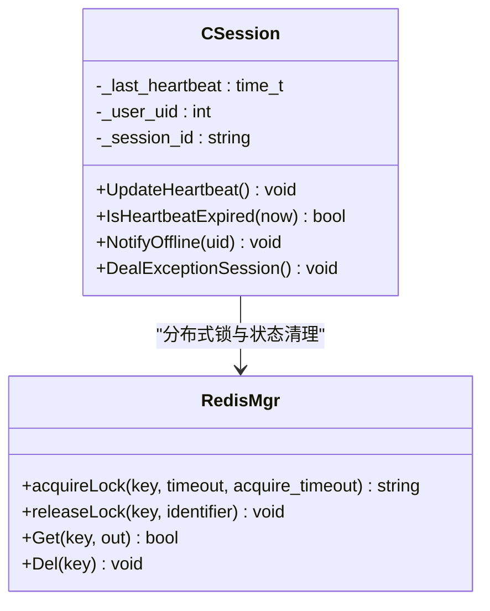
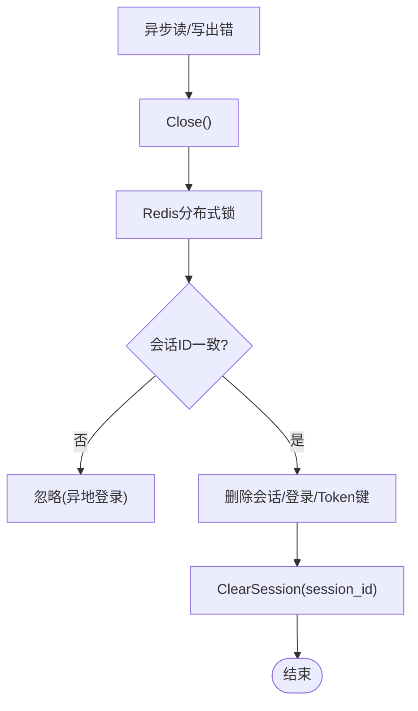
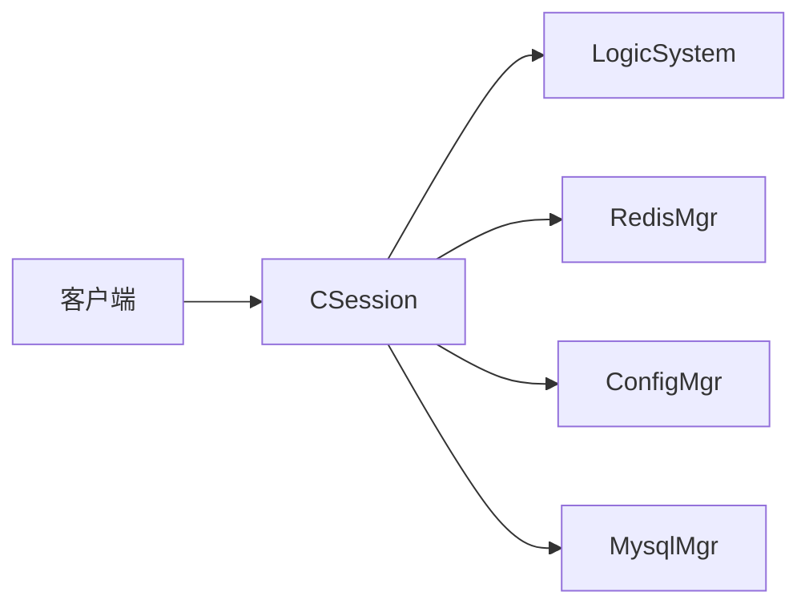

# 心跳检测系统

<cite>
**本文引用的文件**   
- [CSession.h](file://server/ChatServer/include/CSession.h)
- [CSession.cpp](file://server/ChatServer/src/CSession.cpp)
- [day35心跳逻辑.md](file://开发文档/day35心跳逻辑.md)
</cite>

## 目录
1. [简介](#简介)
2. [项目结构](#项目结构)
3. [核心组件](#核心组件)
4. [架构总览](#架构总览)
5. [详细组件分析](#详细组件分析)
6. [依赖关系分析](#依赖关系分析)
7. [性能考量](#性能考量)
8. [故障排查指南](#故障排查指南)
9. [结论](#结论)
10. [附录](#附录)

## 简介
本文件面向 ChatServer 的心跳检测系统，围绕 HeartBeatHandler 方法实现、心跳机制设计原理（定时检测、超时判断、连接清理）、用户在线状态维护（更新、广播通知、离线处理）、心跳间隔配置与管理（动态调整、负载均衡考虑）、异常处理（网络抖动、重连机制、资源回收）以及监控指标收集（活跃用户数、连接数、性能统计）进行系统化说明。文档以代码级为依据，辅以流程图与时序图帮助理解。

## 项目结构
与心跳检测直接相关的核心位于 ChatServer 的会话层 CSession，以及开发文档中关于心跳逻辑的设计说明。CSession 负责：
- 读取消息头与体、解析协议字段
- 在每次成功读取时更新会话心跳时间戳
- 提供心跳过期判定接口
- 异常连接时的分布式锁保护与资源清理

图表来源
- [CSession.cpp:130-191](file://server/ChatServer/src/CSession.cpp#L130-L191)
- [CSession.cpp:285-299](file://server/ChatServer/src/CSession.cpp#L285-L299)
- [CSession.cpp:301-333](file://server/ChatServer/src/CSession.cpp#L301-L333)
- [day35心跳逻辑.md:446-482](file://开发文档/day35心跳逻辑.md#L446-L482)

章节来源
- [CSession.h:28-76](file://server/ChatServer/include/CSession.h#L28-L76)
- [CSession.cpp:10-16](file://server/ChatServer/src/CSession.cpp#L10-L16)
- [CSession.cpp:130-191](file://server/ChatServer/src/CSession.cpp#L130-L191)
- [CSession.cpp:285-299](file://server/ChatServer/src/CSession.cpp#L285-L299)
- [CSession.cpp:301-333](file://server/ChatServer/src/CSession.cpp#L301-L333)
- [day35心跳逻辑.md:446-482](file://开发文档/day35心跳逻辑.md#L446-L482)

## 核心组件
- CSession：封装 TCP 会话生命周期、异步读写、心跳时间戳维护、异常清理。关键能力包括：
  - 异步读头部与主体，解析协议字段并投递到逻辑层
  - UpdateHeartbeat 更新最近一次接收数据的时间
  - IsHeartbeatExpired 基于阈值判断是否过期
  - DealExceptionSession 使用分布式锁清理 Redis 中的会话、登录信息与 Token
- LogicSystem：注册消息回调，包含 HeartBeatHandler，用于解析心跳包并生成响应
- RedisMgr：提供分布式锁与键值操作，保证多实例下会话清理的一致性
- ConfigMgr/MysqlMgr：配置与持久化支撑（心跳主路径不直接依赖）

章节来源
- [CSession.h:28-76](file://server/ChatServer/include/CSession.h#L28-L76)
- [CSession.cpp:130-191](file://server/ChatServer/src/CSession.cpp#L130-L191)
- [CSession.cpp:285-299](file://server/ChatServer/src/CSession.cpp#L285-L299)
- [CSession.cpp:301-333](file://server/ChatServer/src/CSession.cpp#L301-L333)
- [day35心跳逻辑.md:446-482](file://开发文档/day35心跳逻辑.md#L446-L482)

## 架构总览
下图展示从客户端发起心跳到服务器处理并返回响应的完整流程，以及服务端定时检测与清理的连接管理闭环。

图表来源
- [CSession.cpp:130-191](file://server/ChatServer/src/CSession.cpp#L130-L191)
- [CSession.cpp:285-299](file://server/ChatServer/src/CSession.cpp#L285-L299)
- [CSession.cpp:301-333](file://server/ChatServer/src/CSession.cpp#L301-L333)
- [day35心跳逻辑.md:446-482](file://开发文档/day35心跳逻辑.md#L446-L482)

## 详细组件分析

### HeartBeatHandler 方法与心跳包解析、响应生成
- 触发时机：当 CSession 完成头部与主体读取后，将消息投递至 LogicSystem 队列，由对应 msg_type 回调处理。
- 解析过程：从 JSON 中提取 fromuid 等必要字段，校验错误码与字段完整性。
- 响应生成：构造包含 error 字段的响应对象，通过 session->Send 发送 ID_HEARTBEAT_RSP。
- 关键点：
  - 心跳包为 JSON 文本，需确保字段存在且类型正确
  - 响应必须携带成功错误码，以便客户端确认链路健康

图表来源
- [day35心跳逻辑.md:446-482](file://开发文档/day35心跳逻辑.md#L446-L482)

章节来源
- [day35心跳逻辑.md:446-482](file://开发文档/day35心跳逻辑.md#L446-L482)

### 心跳机制设计原理：定时检测、超时判断与连接清理
- 定时检测：服务端维护一个定时器，周期性地遍历所有会话，调用 IsHeartbeatExpired 判断是否超过阈值。
- 超时判断：IsHeartbeatExpired 比较当前时间与 _last_heartbeat 差值，超过阈值即认为过期。
- 连接清理：对过期会话执行 Close，并通过分布式锁安全地清理 Redis 中的会话、登录与 Token 信息。
- 注意：示例中阈值为 20s，实际生产建议调整为 60s 或更高，避免误判。

图表来源
- [CSession.cpp:285-299](file://server/ChatServer/src/CSession.cpp#L285-L299)
- [CSession.cpp:301-333](file://server/ChatServer/src/CSession.cpp#L301-L333)
- [day35心跳逻辑.md:41-92](file://开发文档/day35心跳逻辑.md#L41-L92)

章节来源
- [CSession.cpp:285-299](file://server/ChatServer/src/CSession.cpp#L285-L299)
- [CSession.cpp:301-333](file://server/ChatServer/src/CSession.cpp#L301-L333)
- [day35心跳逻辑.md:41-92](file://开发文档/day35心跳逻辑.md#L41-L92)

### 用户在线状态的维护：状态更新、广播通知与离线处理
- 状态更新：每次成功读取数据（含心跳）都会调用 UpdateHeartbeat 刷新 _last_heartbeat，从而保持“在线”语义。
- 广播通知：当检测到离线或需要通知图片下载等场景，可通过 NotifyOffline 等方法向客户端推送特定消息。
- 离线处理：在异常连接或心跳超时时，DealExceptionSession 会清理 Redis 中的会话与登录信息，确保跨实例一致性。

图表来源
- [CSession.h:28-76](file://server/ChatServer/include/CSession.h#L28-L76)
- [CSession.cpp:250-277](file://server/ChatServer/src/CSession.cpp#L250-L277)
- [CSession.cpp:301-333](file://server/ChatServer/src/CSession.cpp#L301-L333)

章节来源
- [CSession.cpp:250-277](file://server/ChatServer/src/CSession.cpp#L250-L277)
- [CSession.cpp:301-333](file://server/ChatServer/src/CSession.cpp#L301-L333)

### 心跳间隔的配置与管理：动态调整与负载均衡考虑
- 配置来源：心跳阈值与定时器周期可来源于配置文件（如 chatserver*.ini），通过 ConfigMgr 加载。
- 动态调整：建议在运行时支持热更新配置，使不同实例可根据负载情况调整心跳阈值与检测周期。
- 负载均衡：在高并发场景下，适当增大心跳阈值与检测周期可降低 CPU 占用；同时结合连接池与会话上限控制，避免单点过载。

章节来源
- [CSession.cpp:10-16](file://server/ChatServer/src/CSession.cpp#L10-L16)
- [day35心跳逻辑.md:41-92](file://开发文档/day35心跳逻辑.md#L41-L92)

### 心跳异常处理：网络抖动、重连机制与资源回收
- 网络抖动：异步读/写过程中出现错误码时，立即 Close 并触发 DealExceptionSession，防止半开连接占用资源。
- 重连机制：客户端侧应实现指数退避重连策略，并在重连成功后重新建立会话与鉴权。
- 资源回收：DealExceptionSession 使用分布式锁确保唯一性，清理 Redis 中的会话、登录与 Token 键，避免僵尸状态。

图表来源
- [CSession.cpp:130-191](file://server/ChatServer/src/CSession.cpp#L130-L191)
- [CSession.cpp:301-333](file://server/ChatServer/src/CSession.cpp#L301-L333)

章节来源
- [CSession.cpp:130-191](file://server/ChatServer/src/CSession.cpp#L130-L191)
- [CSession.cpp:301-333](file://server/ChatServer/src/CSession.cpp#L301-L333)

## 依赖关系分析
- CSession 依赖：
  - boost::asio：异步 IO、定时器
  - RedisMgr：分布式锁与键值操作
  - ConfigMgr：配置参数加载
  - MysqlMgr：持久化（非心跳主路径）
- LogicSystem：消息路由与处理器注册，包含 HeartBeatHandler
- 外部交互：客户端定时发送心跳请求，服务端按协议解析并响应

图表来源
- [CSession.cpp:130-191](file://server/ChatServer/src/CSession.cpp#L130-L191)
- [CSession.cpp:301-333](file://server/ChatServer/src/CSession.cpp#L301-L333)
- [day35心跳逻辑.md:446-482](file://开发文档/day35心跳逻辑.md#L446-L482)

章节来源
- [CSession.cpp:130-191](file://server/ChatServer/src/CSession.cpp#L130-L191)
- [CSession.cpp:301-333](file://server/ChatServer/src/CSession.cpp#L301-L333)
- [day35心跳逻辑.md:446-482](file://开发文档/day35心跳逻辑.md#L446-L482)

## 性能考量
- 心跳阈值与检测周期：建议设置为 60s 或以上，降低频繁检查带来的 CPU 开销
- 异步 IO：CSession 采用异步读写，避免阻塞事件循环
- 发送队列限流：内部 _send_que 限制最大长度，防止内存暴涨
- 分布式锁粒度：仅对关键清理路径加锁，减少竞争
- 监控指标：建议采集活跃用户数、连接数、心跳成功率、平均延迟、错误率等

[本节为通用指导，无需引用具体文件]

## 故障排查指南
- 常见问题定位：
  - 心跳超时：检查 IsHeartbeatExpired 阈值与客户端心跳频率是否匹配
  - 连接异常：查看异步读/写的错误码与日志，确认网络抖动或客户端异常退出
  - 状态不一致：核对 Redis 中的会话/登录/Token 键是否存在或已被清理
- 调试建议：
  - 增加日志输出：记录心跳请求/响应、错误码、锁获取结果
  - 压测验证：模拟高并发与网络抖动，观察清理路径与资源释放
  - 配置调优：根据压测结果调整心跳阈值与定时器周期

章节来源
- [CSession.cpp:130-191](file://server/ChatServer/src/CSession.cpp#L130-L191)
- [CSession.cpp:301-333](file://server/ChatServer/src/CSession.cpp#L301-L333)

## 结论
ChatServer 的心跳检测系统以 CSession 为核心，结合 LogicSystem 的消息路由与 RedisMgr 的分布式锁，实现了可靠的心跳解析、超时判断与连接清理。通过合理的阈值配置与异步 IO 设计，系统在稳定性与性能之间取得平衡。建议在生产环境中完善监控指标与动态配置能力，进一步提升可观测性与弹性。

[本节为总结性内容，无需引用具体文件]

## 附录
- 协议字段参考：心跳请求与响应均使用 JSON，关键字段包括 error、fromuid 等
- 客户端行为：客户端应周期性发送心跳请求，并在收到响应后维持连接；断线后实施指数退避重连
- 配置项建议：心跳阈值、定时器周期、发送队列上限、分布式锁超时等

[本节为补充说明，无需引用具体文件]