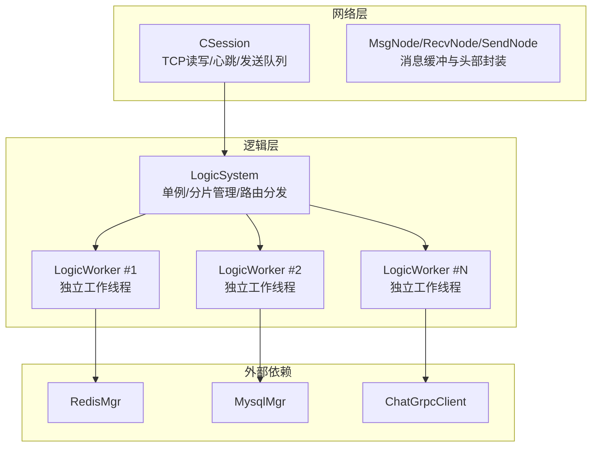
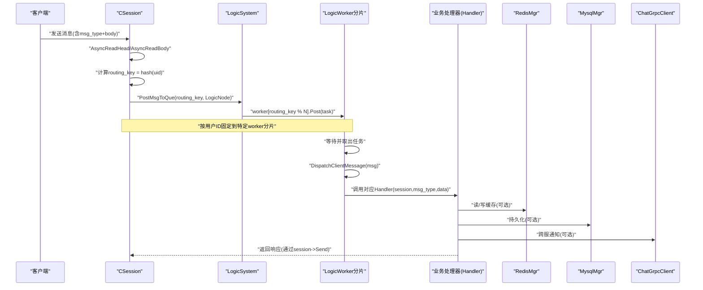
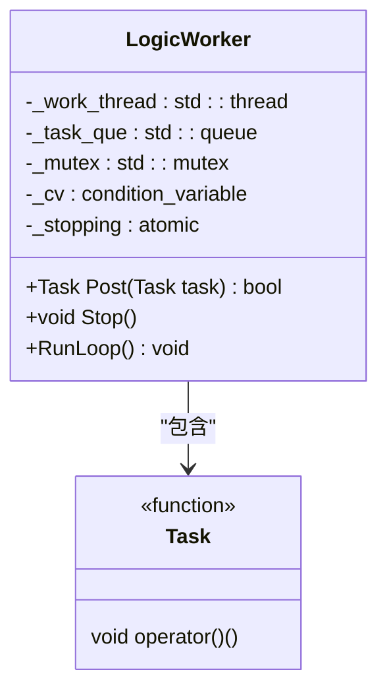
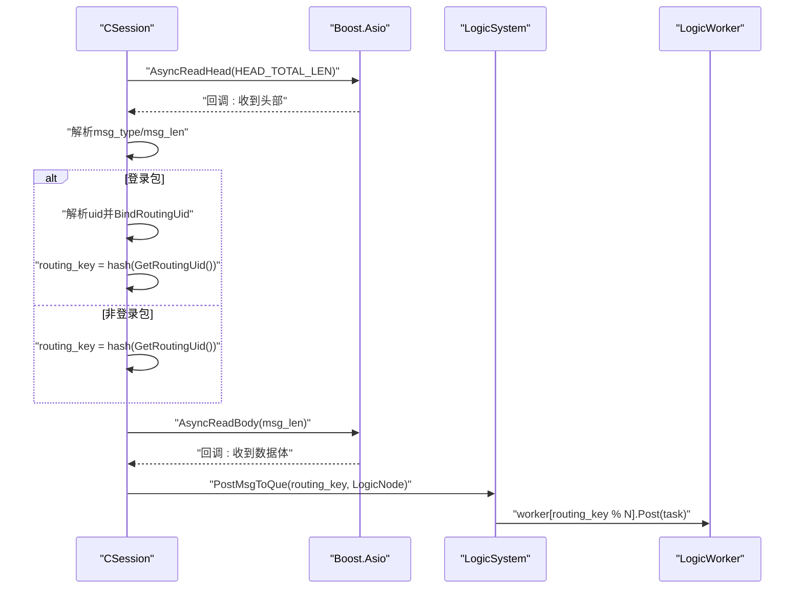
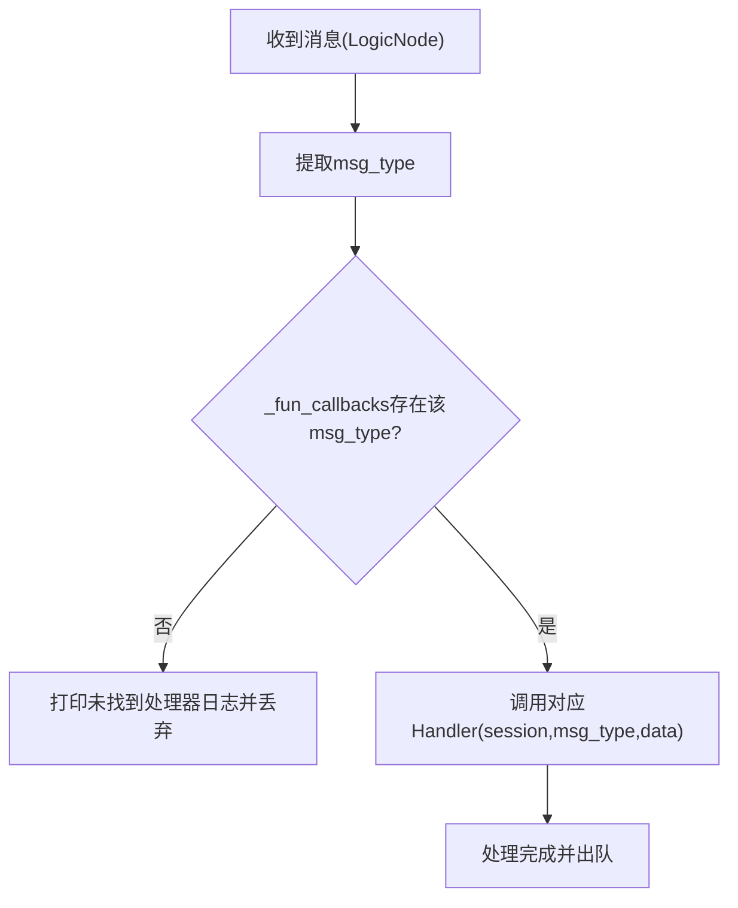
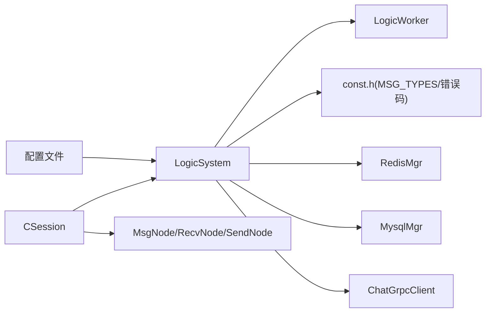

# 消息路由系统

<cite>
**本文引用的文件**
- [LogicSystem.h](file://server/ChatServer/include/LogicSystem.h)
- [LogicSystem.cpp](file://server/ChatServer/src/LogicSystem.cpp)
- [LogicWorker.h](file://server/ChatServer/include/LogicWorker.h)
- [LogicWorker.cpp](file://server/ChatServer/src/LogicWorker.cpp)
- [MsgNode.h](file://server/ChatServer/include/MsgNode.h)
- [MsgNode.cpp](file://server/ChatServer/src/MsgNode.cpp)
- [CSession.h](file://server/ChatServer/include/CSession.h)
- [CSession.cpp](file://server/ChatServer/src/CSession.cpp)
- [const.h](file://server/ChatServer/include/const.h)
- [data.h](file://server/ChatServer/include/data.h)
- [chatserver1.ini](file://server/ChatServer/config/chatserver1.ini)
- [chatserver2.ini](file://server/ChatServer/config/chatserver2.ini)
</cite>

## 更新摘要
**所做更改**
- 将单线程消息处理架构升级为多worker分片架构
- 新增用户ID哈希分片机制确保同一用户的消息由同一worker处理
- 重构PostMsgToQue方法支持路由键参数
- 新增LogicWorker类实现独立工作线程池
- 更新CSession的消息投递逻辑以支持用户ID绑定和路由
- 新增配置项支持动态调整worker数量

## 目录
1. [简介](#简介)
2. [项目结构](#项目结构)
3. [核心组件](#核心组件)
4. [架构总览](#架构总览)
5. [详细组件分析](#详细组件分析)
6. [依赖关系分析](#依赖关系分析)
7. [性能考虑](#性能考虑)
8. [故障排查指南](#故障排查指南)
9. [结论](#结论)
10. [附录：扩展新消息类型指南](#附录扩展新消息类型指南)

## 简介
本文件面向 ChatServer 的消息路由系统，重点说明 LogicSystem 中的多worker分片消息队列机制、PostMsgToQue 方法的哈希路由工作原理、用户ID分片机制与异步处理流程；解释 RegisterCallBacks 如何注册不同消息类型的处理器以及 FunCallBack 回调机制；描述 msg_type 到处理函数的映射与分发逻辑；记录线程安全机制（互斥锁与条件变量）；并提供扩展新消息类型与处理函数、性能优化建议与故障排查方法。

**更新** 系统已从单线程架构升级为多worker分片架构，通过用户ID哈希分片确保同一用户的消息有序处理，显著提升并发性能和可扩展性。

## 项目结构
ChatServer 中与服务端网络 I/O 和逻辑处理解耦的关键在于：
- CSession：负责 TCP 连接、协议头解析、数据体读取、发送队列与心跳管理，并在完整接收一条消息后根据用户ID路由到对应worker队列。
- MsgNode/RecvNode/SendNode：定义消息缓冲与头部封装，统一序列化/反序列化的边界。
- LogicSystem：单例逻辑调度器，维护多个LogicWorker分片，每个分片有独立的工作线程消费消息队列，按 msg_type 分发给注册的回调函数执行具体业务逻辑。
- LogicWorker：独立的工作线程实现，提供FIFO任务队列和线程安全的任务投递接口。
- const.h：集中定义消息类型、错误码、常量等。
- data.h：业务数据结构（用户信息、聊天消息、线程信息等）。



**图表来源**
- [CSession.h:1-86](file://server/ChatServer/include/CSession.h#L1-L86)
- [CSession.cpp:190-222](file://server/ChatServer/src/CSession.cpp#L190-L222)
- [LogicSystem.h:23-86](file://server/ChatServer/include/LogicSystem.h#L23-L86)
- [LogicWorker.h:10-62](file://server/ChatServer/include/LogicWorker.h#L10-L62)

**章节来源**
- [CSession.h:1-86](file://server/ChatServer/include/CSession.h#L1-L86)
- [CSession.cpp:190-222](file://server/ChatServer/src/CSession.cpp#L190-L222)
- [MsgNode.h:1-48](file://server/ChatServer/include/MsgNode.h#L1-L48)
- [LogicSystem.h:23-86](file://server/ChatServer/include/LogicSystem.h#L23-L86)
- [LogicWorker.h:10-62](file://server/ChatServer/include/LogicWorker.h#L10-L62)

## 核心组件
- LogicSystem：单例，内部持有多个LogicWorker分片、停止标志和回调映射；提供 PostMsgToQue、PostToUser、PostDelivery 等入队接口；DispatchClientMessage 为分发循环；RegisterCallBacks 初始化 msg_type 到处理函数的映射。
- LogicWorker：独立工作线程实现，包含任务队列、互斥锁、条件变量和工作线程；提供 Post 方法投递任务和 Stop 方法优雅停机。
- CSession：完成协议头与数据体的异步读取，构造 RecvNode 并包装为 LogicNode，根据用户ID计算路由键后投递给 LogicSystem；同时维护发送队列与心跳。
- MsgNode/RecvNode/SendNode：统一消息缓冲与头部长度/类型字段，SendNode 负责将 msg_type 与长度以网络字节序写入头部。
- const.h：定义 MSG_TYPES 枚举（如登录、搜索、好友申请、文本/图片消息、心跳、加载聊天等），以及错误码、缓存键前缀、分布式锁参数等。
- data.h：定义 UserInfo、ApplyInfo、ChatThreadInfo、ChatMessage、PageResult 等业务结构。

**更新** 新增了LogicWorker类和用户ID路由机制，实现了真正的多worker并行处理能力。

**章节来源**
- [LogicSystem.h:23-86](file://server/ChatServer/include/LogicSystem.h#L23-L86)
- [LogicSystem.cpp:39-106](file://server/ChatServer/src/LogicSystem.cpp#L39-L106)
- [LogicWorker.h:10-62](file://server/ChatServer/include/LogicWorker.h#L10-L62)
- [LogicWorker.cpp:1-64](file://server/ChatServer/src/LogicWorker.cpp#L1-L64)
- [CSession.h:70-88](file://server/ChatServer/include/CSession.h#L70-L88)
- [CSession.cpp:39-53](file://server/ChatServer/src/CSession.cpp#L39-L53)

## 架构总览
下图展示了从网络接收到逻辑处理的端到端流程：CSession 解析协议头与数据体后，根据用户ID计算路由键，构造 LogicNode 并投递到对应的 LogicWorker 分片；LogicWorker 的工作线程在条件变量唤醒后取出消息，通过 _fun_callbacks 查找对应处理器并执行。



**图表来源**
- [CSession.cpp:190-222](file://server/ChatServer/src/CSession.cpp#L190-L222)
- [LogicSystem.cpp:63-70](file://server/ChatServer/src/LogicSystem.cpp#L63-L70)
- [LogicSystem.cpp:108-147](file://server/ChatServer/src/LogicSystem.cpp#L108-L147)
- [LogicWorker.cpp:43-63](file://server/ChatServer/src/LogicWorker.cpp#L43-L63)

## 详细组件分析

### LogicSystem：多worker分片与路由分发
- 成员与职责
  - _logic_workers：std::vector<std::unique_ptr<LogicWorker>> 存储多个LogicWorker分片。
  - _delivery_workers：独立的跨服投递worker池，用于处理阻塞的gRPC调用。
  - _ingress_stopping/_delivery_stopping：原子停止标志，控制服务停机流程。
  - _fun_callbacks：std::map<short, FunCallBack> 保存 msg_type 到处理函数的映射。
  - _p_server：指向 CServer 的指针，用于会话清理等操作。
- PostMsgToQue
  - 接受routing_key参数（通常为std::hash<int>{}(uid)），计算worker索引：routing_key % _logic_workers.size()。
  - 调用对应LogicWorker的Post方法投递任务，保证同一用户的所有请求进入同一FIFO队列。
- DispatchClientMessage
  - 登录包特殊处理：已登录后再收登录包一律回错误并关闭；非登录包验证session->GetUserId()==session->GetRoutingUid()。
  - 根据 _recvnode->_msg_type 在 _fun_callbacks 中查找处理器；未找到则丢弃并打印日志；找到则调用处理器。
- RegisterCallBacks
  - 在构造函数中调用，将各 MSG_TYPES 常量绑定到对应的 Handler 方法，使用 std::bind 与占位符适配签名。
- 线程安全
  - 使用原子变量_stop_mutex保护Stop()幂等执行；LogicWorker内部有自己的互斥锁和条件变量。

**更新** 完全重构了消息处理架构，从单线程改为多worker分片，通过用户ID哈希确保消息有序性。

```mermaid
flowchart TD
Start(["进入PostMsgToQue"]) --> CheckStop{"检查_ingress_stopping"}
CheckStop --> |是| ReturnFalse["返回false拒绝入队"]
CheckStop --> |否| CalcIndex["计算worker索引 = routing_key % size"]
CalcIndex --> CallWorker["调用worker[routing_key % N].Post(task)"]
CallWorker --> ReturnTrue["返回true成功入队"]
subgraph "DispatchClientMessage流程"
DStart["收到LogicNode"] --> Extract["提取msg_type和数据"]
Extract --> LoginCheck{"是否登录包?"}
LoginCheck --> |是| LoginValidate["验证登录状态"]
LoginCheck --> |否| AuthCheck["验证用户认证"]
LoginValidate --> FindCB["查找回调函数"]
AuthCheck --> FindCB
FindCB --> Found{"找到处理器?"}
Found --> |否| LogError["打印未找到处理器日志"]
Found --> |是| CallHandler["调用处理器执行"]
CallHandler --> Complete["处理完成"]
LogError --> Complete
```

**图表来源**
- [LogicSystem.cpp:63-70](file://server/ChatServer/src/LogicSystem.cpp#L63-L70)
- [LogicSystem.cpp:108-147](file://server/ChatServer/src/LogicSystem.cpp#L108-L147)

**章节来源**
- [LogicSystem.h:23-86](file://server/ChatServer/include/LogicSystem.h#L23-L86)
- [LogicSystem.cpp:39-106](file://server/ChatServer/src/LogicSystem.cpp#L39-L106)
- [LogicSystem.cpp:108-147](file://server/ChatServer/src/LogicSystem.cpp#L108-L147)
- [LogicSystem.cpp:149-180](file://server/ChatServer/src/LogicSystem.cpp#L149-L180)

### LogicWorker：独立工作线程实现
- 核心特性
  - 每个LogicWorker实例拥有独立的工作线程，按FIFO顺序串行执行任务。
  - 提供Post方法投递任务，Stop方法幂等停机，析构时自动调用Stop。
  - 内部使用互斥锁和条件变量保证线程安全。
- 任务执行流程
  - RunLoop主循环：等待条件变量唤醒，取出任务执行，stopping且队列为空时退出。
  - Post方法：加锁后将任务推入队列，通知条件变量唤醒工作线程。
  - Stop方法：设置stopping标志，唤醒所有等待线程，join工作线程。
- 内存管理
  - 任务闭包使用std::function<void()>类型，支持任意可调用对象。
  - 任务在锁外执行，避免长任务阻塞Post/Stop操作。

**更新** 新增LogicWorker类作为基础构建块，实现了真正的工作线程池机制。



**图表来源**
- [LogicWorker.h:20-62](file://server/ChatServer/include/LogicWorker.h#L20-L62)

**章节来源**
- [LogicWorker.h:10-62](file://server/ChatServer/include/LogicWorker.h#L10-L62)
- [LogicWorker.cpp:1-64](file://server/ChatServer/src/LogicWorker.cpp#L1-L64)

### CSession：用户ID绑定与路由投递
- 协议解析
  - AsyncReadHead：读取固定长度的头部，解析 msg_type 与 msg_len（网络字节序转本地字节序），校验合法性后构造 RecvNode。
  - AsyncReadBody：循环读取数据体至 RecvNode 缓冲区，完成后更新心跳时间。
- 用户ID绑定
  - BindRoutingUid：仅在第一条合法 MSG_CHAT_LOGIN 包上用 compare-exchange 从 0 固定为 uid，保证同一连接的登录与紧随其后的业务包从第一包起进入同一 worker 分片。
  - GetRoutingUid：获取路由分片绑定的用户ID，未绑定时为0。
- 消息路由投递
  - 登录包：解析uid并调用BindRoutingUid绑定，然后计算routing_key = std::hash<int>{}(GetRoutingUid())。
  - 非登录包：检查routing_uid是否为0，不为0则计算routing_key = std::hash<int>{}(routing_uid)。
  - 投递：调用LogicSystem::PostMsgToQue(routing_key, LogicNode)入队。
- 发送与异常处理
  - HandleWrite：串行化发送队列，失败时关闭连接并清理会话；IsHeartbeatExpired/UpdateHeartbeat：心跳超时检测与更新。

**更新** 新增了用户ID绑定机制和基于用户ID的路由逻辑，确保同一用户的所有消息进入同一个worker分片。



**图表来源**
- [CSession.cpp:150-222](file://server/ChatServer/src/CSession.cpp#L150-L222)
- [CSession.cpp:39-53](file://server/ChatServer/src/CSession.cpp#L39-L53)

**章节来源**
- [CSession.h:70-88](file://server/ChatServer/include/CSession.h#L70-L88)
- [CSession.cpp:39-53](file://server/ChatServer/src/CSession.cpp#L39-L53)
- [CSession.cpp:150-222](file://server/ChatServer/src/CSession.cpp#L150-L222)
- [CSession.cpp:287-321](file://server/ChatServer/src/CSession.cpp#L287-L321)

### 回调注册与分发：RegisterCallBacks 与 FunCallBack
- 回调类型
  - FunCallBack：函数对象，签名为 (shared_ptr<CSession>, short msg_type, string msg_data)。
- 注册过程
  - RegisterCallBacks 中将各 MSG_TYPES 常量（如 MSG_CHAT_LOGIN、ID_SEARCH_USER_REQ、ID_TEXT_CHAT_MSG_REQ、ID_IMG_CHAT_MSG_REQ 等）绑定到 LogicSystem 的成员函数（LoginHandler、SearchInfo、DealChatTextMsg、DealChatImgMsg 等）。
- 分发过程
  - DispatchClientMessage 中根据 _recvnode->_msg_type 在 _fun_callbacks 中查找处理器，未找到则丢弃并打印日志；找到则调用处理器并出队。

**更新** 分发逻辑保持不变，但现在由LogicWorker的工作线程执行，提高了并发处理能力。



**图表来源**
- [LogicSystem.cpp:108-147](file://server/ChatServer/src/LogicSystem.cpp#L108-L147)
- [LogicSystem.cpp:149-180](file://server/ChatServer/src/LogicSystem.cpp#L149-L180)
- [const.h:117-132](file://server/ChatServer/include/const.h#L117-L132)

**章节来源**
- [LogicSystem.h:20-21](file://server/ChatServer/include/LogicSystem.h#L20-L21)
- [LogicSystem.cpp:149-180](file://server/ChatServer/src/LogicSystem.cpp#L149-L180)
- [const.h:117-132](file://server/ChatServer/include/const.h#L117-L132)

### 典型处理器示例：登录与文本聊天
- LoginHandler
  - 解析 JSON 请求，校验 token（Redis），拉取用户基础信息与好友/申请列表，处理多端登录冲突（分布式锁+Redis），绑定 session 与 uid，返回登录响应。
  - 新增路由验证：确保登录成功后session的user_uid与routing_uid一致。
- DealChatTextMsg
  - 解析文本消息数组，批量插入数据库，构造响应返回给发送方；根据目标用户所在服务器选择直接本地推送或 gRPC 跨服通知。
  - 受益于worker分片：同一用户的消息在同一worker中处理，保证了消息顺序性。

**更新** 处理器逻辑基本保持不变，但受益于新的worker架构，获得了更好的并发性能和消息顺序保证。

**章节来源**
- [LogicSystem.cpp:182-318](file://server/ChatServer/src/LogicSystem.cpp#L182-L318)
- [LogicSystem.cpp:538-632](file://server/ChatServer/src/LogicSystem.cpp#L538-L632)

## 依赖关系分析
- 模块耦合
  - CSession 依赖 MsgNode/RecvNode/SendNode 进行协议解析与封装，并通过 LogicSystem::PostMsgToQue 将消息交给逻辑层。
  - LogicSystem 依赖 LogicWorker 实现多worker分片，依赖 const.h 中的 MSG_TYPES 与错误码，依赖 MysqlMgr/RedisMgr/ChatGrpcClient 进行数据访问与跨服务通信。
- 外部依赖
  - RedisMgr：缓存用户信息、token、在线状态、分布式锁。
  - MysqlMgr：持久化好友申请、聊天消息、用户关系等。
  - ChatGrpcClient：跨服通知（好友申请、认证通过、文本/图片消息等）。
- 配置依赖
  - chatserver1.ini/chatserver2.ini：通过[Concurrency]段配置LogicWorkers和DeliveryWorkers数量。

**更新** 新增了对LogicWorker的依赖和配置文件依赖，支持动态调整worker数量。



**图表来源**
- [CSession.cpp:190-222](file://server/ChatServer/src/CSession.cpp#L190-L222)
- [LogicSystem.cpp:39-53](file://server/ChatServer/src/LogicSystem.cpp#L39-L53)
- [chatserver1.ini:30-32](file://server/ChatServer/config/chatserver1.ini#L30-L32)

**章节来源**
- [CSession.cpp:190-222](file://server/ChatServer/src/CSession.cpp#L190-L222)
- [LogicSystem.cpp:39-53](file://server/ChatServer/src/LogicSystem.cpp#L39-L53)
- [const.h:117-132](file://server/ChatServer/include/const.h#L117-L132)
- [chatserver1.ini:30-32](file://server/ChatServer/config/chatserver1.ini#L30-L32)

## 性能考虑
- 分片与路由策略
  - 用户ID哈希分片：std::hash<int>{}(uid) % N 确保同一用户的所有请求进入同一worker，保证消息顺序性。
  - 双worker池设计：_logic_workers处理客户端消息，_delivery_workers处理阻塞的跨服gRPC调用，避免互相影响。
- 队列与唤醒策略
  - LogicWorker::Post仅在队列由空变非空时 notify_one，减少无效唤醒，降低上下文切换开销。
  - 条件变量与锁粒度：使用 unique_lock 与 while 循环配合条件变量，避免虚假唤醒；锁范围尽量小，只在入队/出队时持有。
- 内存与序列化
  - MsgNode 使用预分配缓冲区，避免频繁 new/delete；SendNode 一次性组装头部与数据体，减少多次拷贝。
  - 任务闭包使用std::function，支持捕获上下文，避免额外的内存分配。
- 异步 I/O
  - CSession 基于 Boost.Asio 异步读写，避免阻塞；发送队列串行化输出，防止粘包/半包问题。
- 缓存与数据库
  - 优先查 Redis，命中后再落库；批量插入聊天消息，减少 DB 往返。
- 扩展性
  - 新增处理器仅需在 RegisterCallBacks 中注册映射，无需修改分发逻辑；处理器内可并行调用外部服务（注意线程安全）。
- 配置优化
  - 通过配置文件动态调整LogicWorkers和DeliveryWorkers数量，适应不同负载场景。

**更新** 新增了分片策略、双worker池设计和配置优化等性能考虑因素。

## 故障排查指南
- 常见症状与定位
  - "未找到处理器"日志：检查 const.h 中 MSG_TYPES 是否与客户端一致，确认 RegisterCallBacks 已注册。
  - 心跳超时断开：检查 IsHeartbeatExpired 阈值与客户端心跳频率；确认 UpdateHeartbeat 在每次接收数据后被调用。
  - 登录冲突踢人：检查分布式锁 key 与 Redis 中 USERIPPREFIX/usession_ 键值一致性。
  - 消息乱序：检查用户ID绑定是否正确，确认routing_uid与user_uid一致。
  - worker过载：检查配置文件中的LogicWorkers数量是否合理，监控各worker队列长度。
- 调试步骤
  - 查看 DispatchClientMessage 日志输出，确认 msg_type 与处理器匹配。
  - 检查 PostMsgToQue 入队路径与LogicWorker投递是否正常。
  - 核对 BindRoutingUid 绑定逻辑和用户ID哈希计算是否正确。
  - 监控各LogicWorker的任务执行情况，分析是否存在热点用户导致的不均衡。
- 恢复措施
  - 修正 MSG_TYPES 映射或客户端协议版本。
  - 调整心跳阈值或客户端重连策略。
  - 清理 Redis 中残留的登录状态键。
  - 增加worker数量或优化热点用户的处理逻辑。

**更新** 新增了用户ID绑定、worker负载均衡等相关的故障排查内容。

**章节来源**
- [LogicSystem.cpp:108-147](file://server/ChatServer/src/LogicSystem.cpp#L108-L147)
- [CSession.cpp:150-222](file://server/ChatServer/src/CSession.cpp#L150-L222)
- [CSession.cpp:287-321](file://server/ChatServer/src/CSession.cpp#L287-L321)
- [const.h:117-132](file://server/ChatServer/include/const.h#L117-L132)

## 结论
LogicSystem 通过"多worker分片+用户ID哈希路由+条件变量"的模式实现了高吞吐、低延迟、有序性的消息路由；CSession 与 MsgNode 完成了协议解析与封装；RegisterCallBacks 将 msg_type 与处理器解耦，便于扩展与维护。结合 Redis/Mysql/GRPC 的外部依赖，系统具备跨服能力与持久化支持。新增的LogicWorker架构显著提升了并发处理能力，用户ID分片机制保证了消息的顺序性，配置文件支持动态调整worker数量以适应不同负载场景。遵循本文的扩展指南与性能建议，可安全地添加新消息类型并优化整体性能。

**更新** 系统架构已从单线程升级为多worker分片模式，在保持原有功能的基础上，大幅提升了并发处理能力和系统可扩展性。

## 附录：扩展新消息类型指南
- 步骤
  1. 在 const.h 的 MSG_TYPES 中新增消息类型（请求与响应成对定义）。
  2. 在 LogicSystem.h 中添加新的 Handler 声明（签名与现有 Handler 一致）。
  3. 在 LogicSystem.cpp 的 RegisterCallBacks 中注册新消息类型到 Handler 的映射。
  4. 实现 Handler：解析 JSON、访问 Redis/Mysql、必要时通过 ChatGrpcClient 跨服通知，最后通过 session->Send 返回响应。
  5. 测试：确保客户端发送的 msg_type 与服务器注册一致，验证响应格式与错误码。
- 注意事项
  - 保持 msg_type 唯一且不与其他服务冲突。
  - 处理器内避免长时间阻塞，必要时拆分任务或使用异步调用。
  - 错误处理需设置统一的 error 字段，便于客户端判断。
  - 利用worker分片优势：同一用户的消息会在同一worker中处理，可利用这一特性简化状态管理。
  - 监控性能：关注新处理器对worker负载的影响，必要时调整worker数量。

**更新** 新增了利用worker分片优势和性能监控的建议。

**章节来源**
- [const.h:117-132](file://server/ChatServer/include/const.h#L117-L132)
- [LogicSystem.h:107-215](file://server/ChatServer/include/LogicSystem.h#L107-L215)
- [LogicSystem.cpp:149-180](file://server/ChatServer/src/LogicSystem.cpp#L149-L180)
- [chatserver1.ini:30-32](file://server/ChatServer/config/chatserver1.ini#L30-L32)