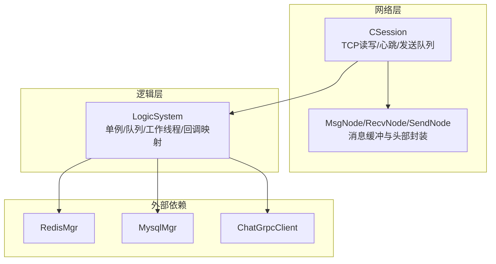
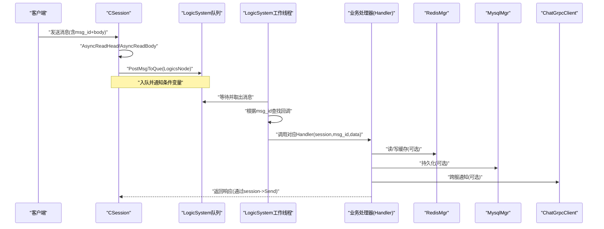
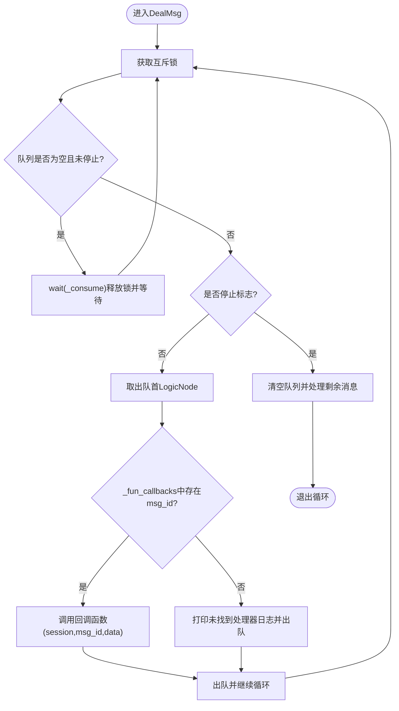
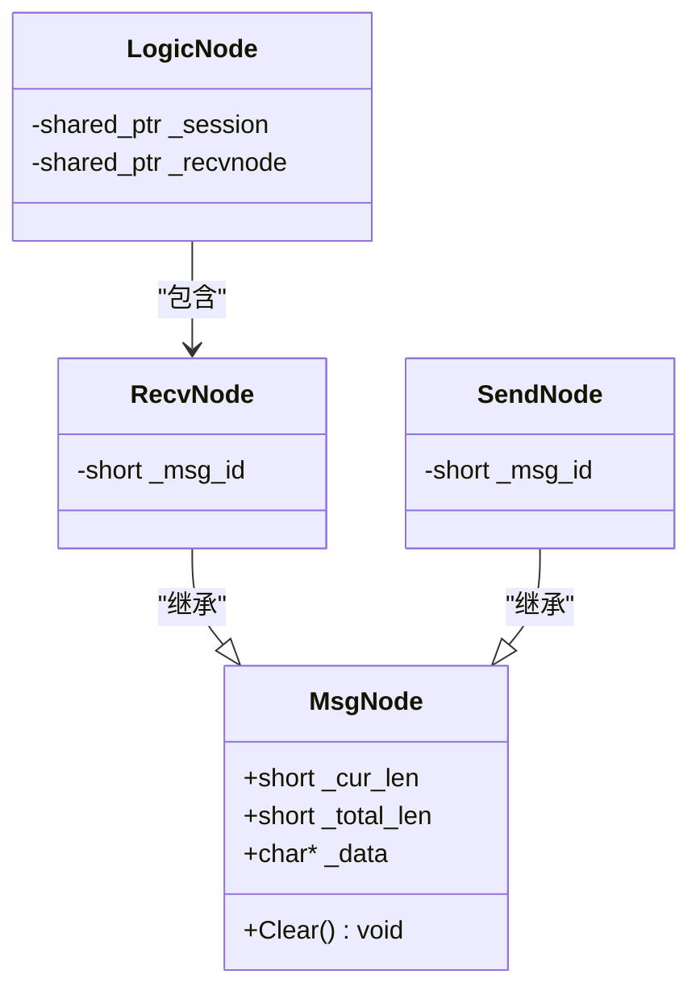
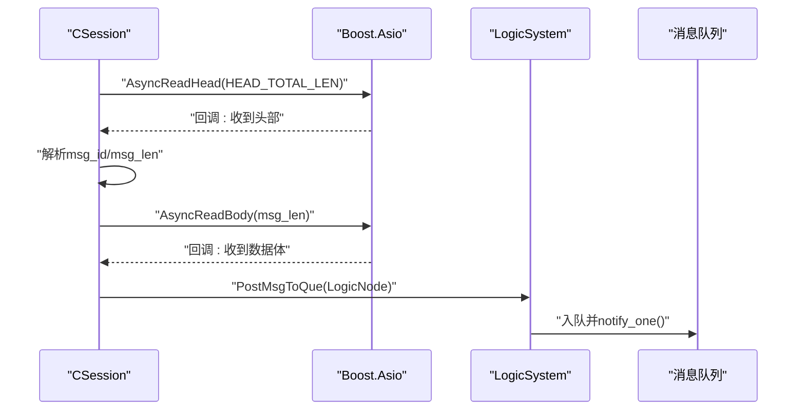
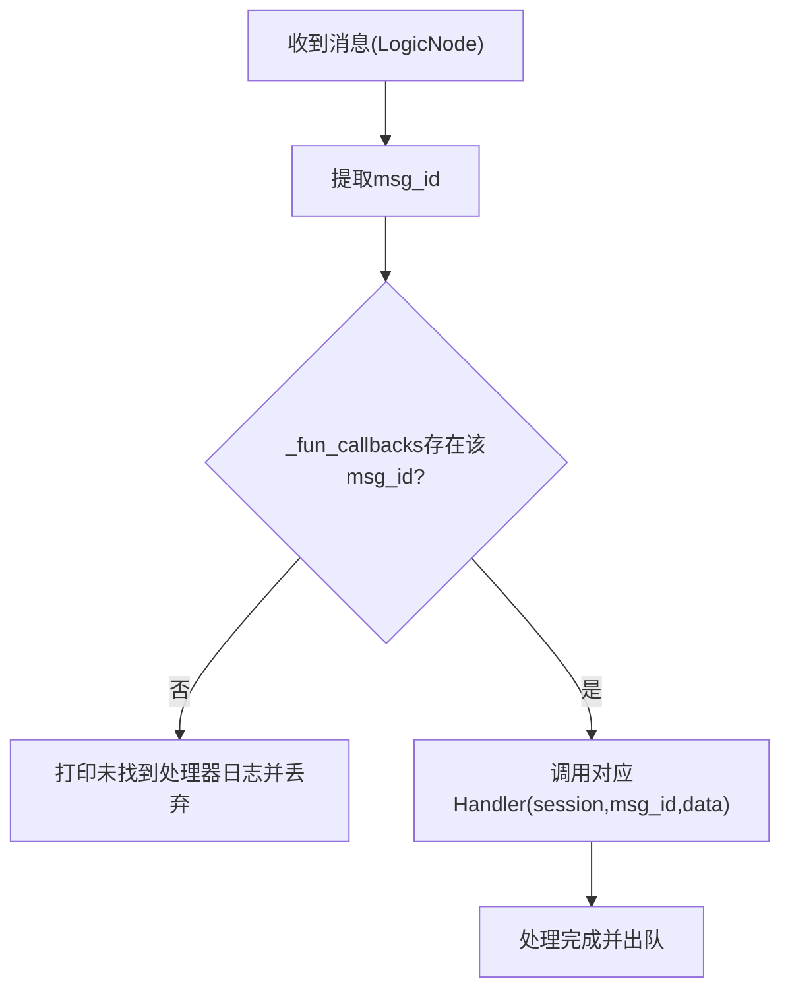
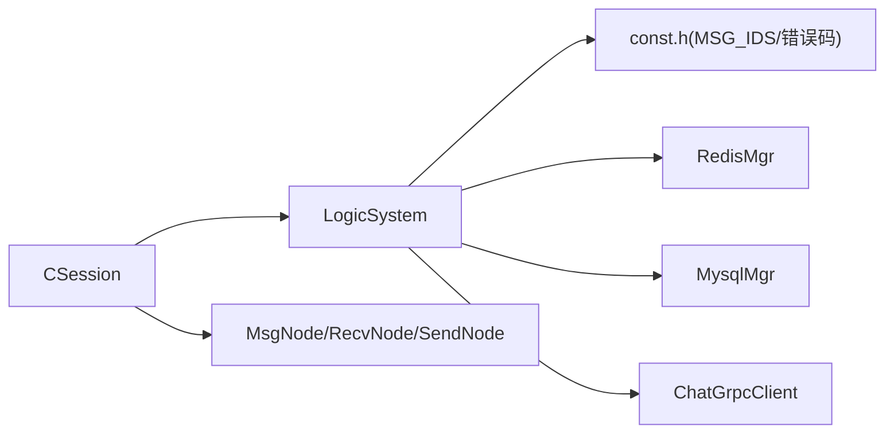

# 消息路由系统

<cite>
**本文引用的文件**
- [LogicSystem.h](file://server/ChatServer/include/LogicSystem.h)
- [LogicSystem.cpp](file://server/ChatServer/src/LogicSystem.cpp)
- [MsgNode.h](file://server/ChatServer/include/MsgNode.h)
- [MsgNode.cpp](file://server/ChatServer/src/MsgNode.cpp)
- [CSession.h](file://server/ChatServer/include/CSession.h)
- [CSession.cpp](file://server/ChatServer/src/CSession.cpp)
- [const.h](file://server/ChatServer/include/const.h)
- [data.h](file://server/ChatServer/include/data.h)
</cite>

## 目录
1. [简介](#简介)
2. [项目结构](#项目结构)
3. [核心组件](#核心组件)
4. [架构总览](#架构总览)
5. [详细组件分析](#详细组件分析)
6. [依赖关系分析](#依赖关系分析)
7. [性能考虑](#性能考虑)
8. [故障排查指南](#故障排查指南)
9. [结论](#结论)
10. [附录：扩展新消息类型指南](#附录扩展新消息类型指南)

## 简介
本文件面向 ChatServer 的消息路由系统，重点说明 LogicSystem 中的消息队列机制、PostMsgToQue 方法的工作原理、消息节点封装与异步处理流程；解释 RegisterCallBacks 如何注册不同消息类型的处理器以及 FunCallBack 回调机制；描述 msg_id 到处理函数的映射与分发逻辑；记录线程安全机制（互斥锁与条件变量）；并提供扩展新消息类型与处理函数、性能优化建议与故障排查方法。

## 项目结构
ChatServer 中与服务端网络 I/O 和逻辑处理解耦的关键在于：
- CSession：负责 TCP 连接、协议头解析、数据体读取、发送队列与心跳管理，并在完整接收一条消息后投递到 LogicSystem 的队列。
- MsgNode/RecvNode/SendNode：定义消息缓冲与头部封装，统一序列化/反序列化的边界。
- LogicSystem：单例逻辑调度器，维护一个工作线程消费消息队列，按 msg_id 分发给注册的回调函数执行具体业务逻辑。
- const.h：集中定义消息 ID、错误码、常量等。
- data.h：业务数据结构（用户信息、聊天消息、线程信息等）。

图表来源
- [CSession.h:1-86](file://server/ChatServer/include/CSession.h#L1-L86)
- [CSession.cpp:110-130](file://server/ChatServer/src/CSession.cpp#L110-L130)
- [MsgNode.h:1-48](file://server/ChatServer/include/MsgNode.h#L1-L48)
- [LogicSystem.h:1-60](file://server/ChatServer/include/LogicSystem.h#L1-L60)

章节来源
- [CSession.h:1-86](file://server/ChatServer/include/CSession.h#L1-L86)
- [CSession.cpp:110-130](file://server/ChatServer/src/CSession.cpp#L110-L130)
- [MsgNode.h:1-48](file://server/ChatServer/include/MsgNode.h#L1-L48)
- [LogicSystem.h:1-60](file://server/ChatServer/include/LogicSystem.h#L1-L60)

## 核心组件
- LogicSystem：单例，内部持有消息队列、互斥锁、条件变量与工作线程；提供 PostMsgToQue 入队接口；DealMsg 为消费循环；RegisterCallBacks 初始化 msg_id 到处理函数的映射；各 Handler 实现具体业务。
- CSession：完成协议头与数据体的异步读取，构造 RecvNode 并包装为 LogicNode，投递给 LogicSystem；同时维护发送队列与心跳。
- MsgNode/RecvNode/SendNode：统一消息缓冲与头部长度/ID 字段，SendNode 负责将 msg_id 与长度以网络字节序写入头部。
- const.h：定义 MSG_IDS 枚举（如登录、搜索、好友申请、文本/图片消息、心跳、加载聊天等），以及错误码、缓存键前缀、分布式锁参数等。
- data.h：定义 UserInfo、ApplyInfo、ChatThreadInfo、ChatMessage、PageResult 等业务结构。

章节来源
- [LogicSystem.h:1-60](file://server/ChatServer/include/LogicSystem.h#L1-L60)
- [LogicSystem.cpp:1-120](file://server/ChatServer/src/LogicSystem.cpp#L1-L120)
- [CSession.h:1-86](file://server/ChatServer/include/CSession.h#L1-L86)
- [CSession.cpp:110-130](file://server/ChatServer/src/CSession.cpp#L110-L130)
- [MsgNode.h:1-48](file://server/ChatServer/include/MsgNode.h#L1-L48)
- [MsgNode.cpp:1-18](file://server/ChatServer/src/MsgNode.cpp#L1-L18)
- [const.h:1-104](file://server/ChatServer/include/const.h#L1-L104)
- [data.h:1-65](file://server/ChatServer/include/data.h#L1-L65)

## 架构总览
下图展示了从网络接收到逻辑处理的端到端流程：CSession 解析协议头与数据体后，构造 LogicNode 并投递到 LogicSystem 队列；LogicSystem 的工作线程在条件变量唤醒后取出消息，通过 _fun_callbacks 查找对应处理器并执行。

图表来源
- [CSession.cpp:110-130](file://server/ChatServer/src/CSession.cpp#L110-L130)
- [LogicSystem.cpp:26-81](file://server/ChatServer/src/LogicSystem.cpp#L26-L81)
- [LogicSystem.cpp:83-114](file://server/ChatServer/src/LogicSystem.cpp#L83-L114)

## 详细组件分析

### LogicSystem：消息队列与异步处理
- 成员与职责
  - _worker_thread：独立工作线程，运行 DealMsg 消费循环。
  - _msg_que：std::queue<shared_ptr<LogicNode>> 作为消息队列。
  - _mutex/_consume：互斥锁与条件变量，保证并发安全与高效唤醒。
  - _fun_callbacks：std::map<short, FunCallBack> 保存 msg_id 到处理函数的映射。
  - _p_server：指向 CServer 的指针，用于会话清理等操作。
- PostMsgToQue
  - 加锁后将 LogicNode 推入队列；当队列由空变非空时解锁并通知条件变量，避免不必要的唤醒。
- DealMsg
  - 循环等待：若队列为空且未停止，则 wait(_consume) 阻塞；停止时继续清空队列再退出。
  - 取队首 LogicNode，依据 _recvnode->_msg_id 在 _fun_callbacks 中查找处理器；未找到则丢弃并打印日志；找到则调用处理器并出队。
- RegisterCallBacks
  - 在构造函数中调用，将各 MSG_IDS 常量绑定到对应的 Handler 方法，使用 std::bind 与占位符适配签名。
- 线程安全
  - 入队/出队均受 _mutex 保护；条件变量 _consume 用于唤醒消费者；析构时设置 _b_stop 并通知一次，确保优雅退出。

图表来源
- [LogicSystem.cpp:43-81](file://server/ChatServer/src/LogicSystem.cpp#L43-L81)

章节来源
- [LogicSystem.h:17-58](file://server/ChatServer/include/LogicSystem.h#L17-L58)
- [LogicSystem.cpp:16-25](file://server/ChatServer/src/LogicSystem.cpp#L16-L25)
- [LogicSystem.cpp:26-81](file://server/ChatServer/src/LogicSystem.cpp#L26-L81)
- [LogicSystem.cpp:83-114](file://server/ChatServer/src/LogicSystem.cpp#L83-L114)

### 消息节点封装：MsgNode/RecvNode/SendNode
- MsgNode
  - 管理动态分配的 char* 缓冲区，提供 Clear 重置方法，析构释放内存。
- RecvNode
  - 继承 MsgNode，增加 _msg_id，用于接收侧解析后的消息标识。
- SendNode
  - 继承 MsgNode，构造时将 msg_id 与数据长度以网络字节序写入头部，随后拷贝数据体。

图表来源
- [MsgNode.h:1-48](file://server/ChatServer/include/MsgNode.h#L1-L48)
- [CSession.h:78-86](file://server/ChatServer/include/CSession.h#L78-L86)

章节来源
- [MsgNode.h:1-48](file://server/ChatServer/include/MsgNode.h#L1-L48)
- [MsgNode.cpp:1-18](file://server/ChatServer/src/MsgNode.cpp#L1-L18)
- [CSession.h:78-86](file://server/ChatServer/include/CSession.h#L78-L86)

### CSession：网络I/O与消息投递
- 协议解析
  - AsyncReadHead：读取固定长度的头部，解析 msg_id 与 msg_len（网络字节序转本地字节序），校验合法性后构造 RecvNode。
  - AsyncReadBody：循环读取数据体至 RecvNode 缓冲区，完成后更新心跳时间。
- 消息投递
  - 在数据体接收完成后，构造 LogicNode(shared_from_this(), _recv_msg_node)，调用 LogicSystem::PostMsgToQue 入队。
- 发送与异常处理
  - HandleWrite：串行化发送队列，失败时关闭连接并清理会话；IsHeartbeatExpired/UpdateHeartbeat：心跳超时检测与更新。

图表来源
- [CSession.cpp:130-191](file://server/ChatServer/src/CSession.cpp#L130-L191)
- [CSession.cpp:110-130](file://server/ChatServer/src/CSession.cpp#L110-L130)

章节来源
- [CSession.cpp:110-130](file://server/ChatServer/src/CSession.cpp#L110-L130)
- [CSession.cpp:130-191](file://server/ChatServer/src/CSession.cpp#L130-L191)
- [CSession.cpp:193-217](file://server/ChatServer/src/CSession.cpp#L193-L217)

### 回调注册与分发：RegisterCallBacks 与 FunCallBack
- 回调类型
  - FunCallBack：函数对象，签名为 (shared_ptr<CSession>, short msg_id, string msg_data)。
- 注册过程
  - RegisterCallBacks 中将各 MSG_IDS 常量（如 MSG_CHAT_LOGIN、ID_SEARCH_USER_REQ、ID_TEXT_CHAT_MSG_REQ、ID_IMG_CHAT_MSG_REQ 等）绑定到 LogicSystem 的成员函数（LoginHandler、SearchInfo、DealChatTextMsg、DealChatImgMsg 等）。
- 分发过程
  - DealMsg 中根据 _recvnode->_msg_id 在 _fun_callbacks 中查找处理器，未找到则丢弃并打印日志；找到则调用处理器并出队。

图表来源
- [LogicSystem.cpp:83-114](file://server/ChatServer/src/LogicSystem.cpp#L83-L114)
- [LogicSystem.cpp:43-81](file://server/ChatServer/src/LogicSystem.cpp#L43-L81)
- [const.h:49-79](file://server/ChatServer/include/const.h#L49-L79)

章节来源
- [LogicSystem.h:16-17](file://server/ChatServer/include/LogicSystem.h#L16-L17)
- [LogicSystem.cpp:83-114](file://server/ChatServer/src/LogicSystem.cpp#L83-L114)
- [const.h:49-79](file://server/ChatServer/include/const.h#L49-L79)

### 典型处理器示例：登录与文本聊天
- LoginHandler
  - 解析 JSON 请求，校验 token（Redis），拉取用户基础信息与好友/申请列表，处理多端登录冲突（分布式锁+Redis），绑定 session 与 uid，返回登录响应。
- DealChatTextMsg
  - 解析文本消息数组，批量插入数据库，构造响应返回给发送方；根据目标用户所在服务器选择直接本地推送或 gRPC 跨服通知。

章节来源
- [LogicSystem.cpp:116-252](file://server/ChatServer/src/LogicSystem.cpp#L116-L252)
- [LogicSystem.cpp:472-566](file://server/ChatServer/src/LogicSystem.cpp#L472-L566)

## 依赖关系分析
- 模块耦合
  - CSession 依赖 MsgNode/RecvNode/SendNode 进行协议解析与封装，并通过 LogicSystem::PostMsgToQue 将消息交给逻辑层。
  - LogicSystem 依赖 const.h 中的 MSG_IDS 与错误码，依赖 MysqlMgr/RedisMgr/ChatGrpcClient 进行数据访问与跨服务通信。
- 外部依赖
  - RedisMgr：缓存用户信息、token、在线状态、分布式锁。
  - MysqlMgr：持久化好友申请、聊天消息、用户关系等。
  - ChatGrpcClient：跨服通知（好友申请、认证通过、文本/图片消息等）。

图表来源
- [CSession.cpp:110-130](file://server/ChatServer/src/CSession.cpp#L110-L130)
- [LogicSystem.cpp:1-12](file://server/ChatServer/src/LogicSystem.cpp#L1-L12)
- [const.h:49-79](file://server/ChatServer/include/const.h#L49-L79)

章节来源
- [CSession.cpp:110-130](file://server/ChatServer/src/CSession.cpp#L110-L130)
- [LogicSystem.cpp:1-12](file://server/ChatServer/src/LogicSystem.cpp#L1-L12)
- [const.h:49-79](file://server/ChatServer/include/const.h#L49-L79)

## 性能考虑
- 队列与唤醒策略
  - PostMsgToQue 仅在队列由空变非空时 notify_one，减少无效唤醒，降低上下文切换开销。
- 条件变量与锁粒度
  - 使用 unique_lock 与 while 循环配合条件变量，避免虚假唤醒；锁范围尽量小，只在入队/出队时持有。
- 内存与序列化
  - MsgNode 使用预分配缓冲区，避免频繁 new/delete；SendNode 一次性组装头部与数据体，减少多次拷贝。
- 异步 I/O
  - CSession 基于 Boost.Asio 异步读写，避免阻塞；发送队列串行化输出，防止粘包/半包问题。
- 缓存与数据库
  - 优先查 Redis，命中后再落库；批量插入聊天消息，减少 DB 往返。
- 扩展性
  - 新增处理器仅需在 RegisterCallBacks 中注册映射，无需修改分发逻辑；处理器内可并行调用外部服务（注意线程安全）。

[本节为通用性能建议，不直接分析具体文件]

## 故障排查指南
- 常见症状与定位
  - “未找到处理器”日志：检查 const.h 中 MSG_IDS 是否与客户端一致，确认 RegisterCallBacks 已注册。
  - 心跳超时断开：检查 IsHeartbeatExpired 阈值与客户端心跳频率；确认 UpdateHeartbeat 在每次接收数据后被调用。
  - 登录冲突踢人：检查分布式锁 key 与 Redis 中 USERIPPREFIX/usession_ 键值一致性。
- 调试步骤
  - 查看 DealMsg 日志输出，确认 msg_id 与处理器匹配。
  - 检查 PostMsgToQue 入队路径与条件变量唤醒是否正常。
  - 核对 SendNode 头部组装顺序与字节序转换是否正确。
- 恢复措施
  - 修正 MSG_IDS 映射或客户端协议版本。
  - 调整心跳阈值或客户端重连策略。
  - 清理 Redis 中残留的登录状态键。

章节来源
- [LogicSystem.cpp:43-81](file://server/ChatServer/src/LogicSystem.cpp#L43-L81)
- [CSession.cpp:130-191](file://server/ChatServer/src/CSession.cpp#L130-L191)
- [CSession.cpp:285-293](file://server/ChatServer/src/CSession.cpp#L285-L293)
- [const.h:49-79](file://server/ChatServer/include/const.h#L49-L79)

## 结论
LogicSystem 通过“队列+条件变量+工作线程”的模式实现了高吞吐、低延迟的消息路由；CSession 与 MsgNode 完成了协议解析与封装；RegisterCallBacks 将 msg_id 与处理器解耦，便于扩展与维护。结合 Redis/Mysql/GRPC 的外部依赖，系统具备跨服能力与持久化支持。遵循本文的扩展指南与性能建议，可安全地添加新消息类型并优化整体性能。

[本节为总结性内容，不直接分析具体文件]

## 附录：扩展新消息类型指南
- 步骤
  1. 在 const.h 的 MSG_IDS 中新增消息 ID（请求与响应成对定义）。
  2. 在 LogicSystem.h 中添加新的 Handler 声明（签名与现有 Handler 一致）。
  3. 在 LogicSystem.cpp 的 RegisterCallBacks 中注册新消息 ID 到 Handler 的映射。
  4. 实现 Handler：解析 JSON、访问 Redis/Mysql、必要时通过 ChatGrpcClient 跨服通知，最后通过 session->Send 返回响应。
  5. 测试：确保客户端发送的 msg_id 与服务器注册一致，验证响应格式与错误码。
- 注意事项
  - 保持 msg_id 唯一且不与其他服务冲突。
  - 处理器内避免长时间阻塞，必要时拆分任务或使用异步调用。
  - 错误处理需设置统一的 error 字段，便于客户端判断。

章节来源
- [const.h:49-79](file://server/ChatServer/include/const.h#L49-L79)
- [LogicSystem.h:27-34](file://server/ChatServer/include/LogicSystem.h#L27-L34)
- [LogicSystem.cpp:83-114](file://server/ChatServer/src/LogicSystem.cpp#L83-L114)