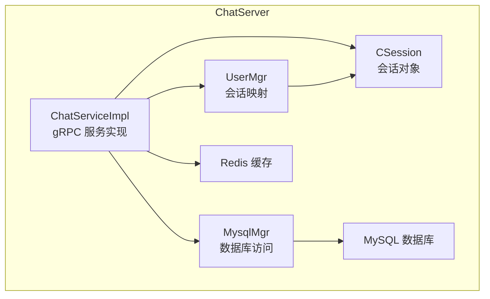
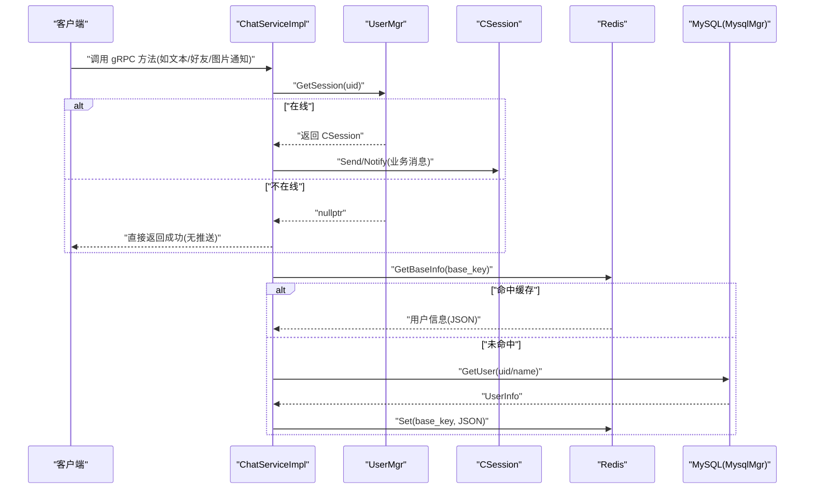
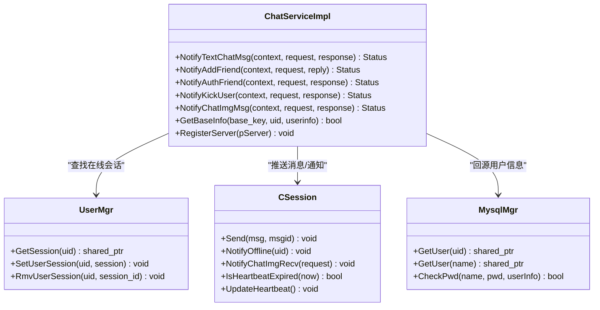
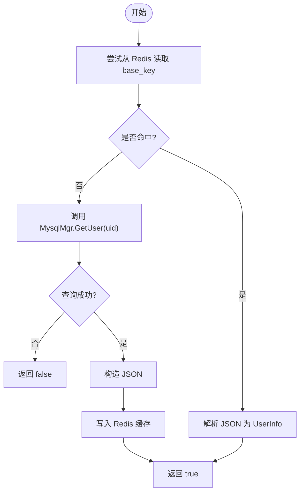
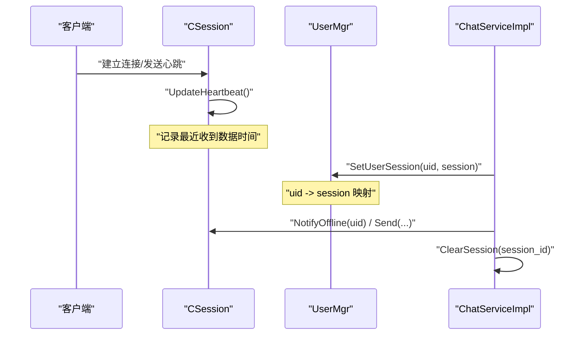
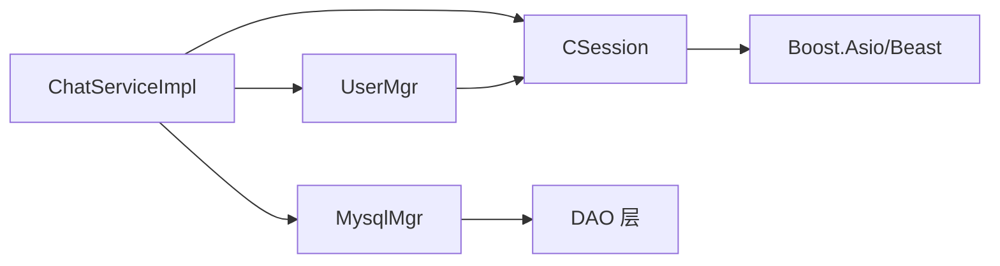

# 用户认证处理

<cite>
**本文引用的文件**   
- [ChatServiceImpl.h](file://server/ChatServer/include/ChatServiceImpl.h)
- [ChatServiceImpl.cpp](file://server/ChatServer/src/ChatServiceImpl.cpp)
- [UserMgr.h](file://server/ChatServer/include/UserMgr.h)
- [UserMgr.cpp](file://server/ChatServer/src/UserMgr.cpp)
- [MysqlMgr.h](file://server/ChatServer/include/MysqlMgr.h)
- [MysqlMgr.cpp](file://server/ChatServer/src/MysqlMgr.cpp)
- [CSession.h](file://server/ChatServer/include/CSession.h)
- [data.h](file://server/ChatServer/include/data.h)
</cite>

## 目录
1. [简介](#简介)
2. [项目结构](#项目结构)
3. [核心组件](#核心组件)
4. [架构总览](#架构总览)
5. [详细组件分析](#详细组件分析)
6. [依赖关系分析](#依赖关系分析)
7. [性能考量](#性能考量)
8. [故障排查指南](#故障排查指南)
9. [结论](#结论)
10. [附录](#附录)

## 简介
本文件聚焦 ChatServer 的用户认证处理模块，围绕登录流程、用户名密码校验、会话管理、权限检查、缓存策略与错误处理进行系统化说明。文档同时覆盖在线状态更新、会话生命周期与心跳检测机制，并给出认证失败的处理方式与安全最佳实践，以及调试技巧与常见问题解决方案。

## 项目结构
ChatServer 的认证相关代码主要分布在以下位置：
- gRPC 服务实现：ChatServiceImpl（负责消息路由、用户信息获取、踢人通知等）
- 用户会话管理：UserMgr（内存中 uid 到 session 的映射与并发控制）
- 数据库访问：MysqlMgr（封装 DAO，提供用户查询、密码校验等方法）
- 会话对象：CSession（网络 I/O、心跳、离线通知等）
- 数据模型：data.h（UserInfo、ChatMessage 等）

图表来源 
- [ChatServiceImpl.h:1-55](file://server/ChatServer/include/ChatServiceImpl.h#L1-L55)
- [ChatServiceImpl.cpp:1-240](file://server/ChatServer/src/ChatServiceImpl.cpp#L1-L240)
- [UserMgr.h:1-22](file://server/ChatServer/include/UserMgr.h#L1-L22)
- [UserMgr.cpp:1-50](file://server/ChatServer/src/UserMgr.cpp#L1-L50)
- [MysqlMgr.h:1-41](file://server/ChatServer/include/MysqlMgr.h#L1-L41)
- [MysqlMgr.cpp:1-95](file://server/ChatServer/src/MysqlMgr.cpp#L1-L95)
- [CSession.h:1-86](file://server/ChatServer/include/CSession.h#L1-L86)

章节来源
- [ChatServiceImpl.h:1-55](file://server/ChatServer/include/ChatServiceImpl.h#L1-L55)
- [ChatServiceImpl.cpp:1-240](file://server/ChatServer/src/ChatServiceImpl.cpp#L1-L240)
- [UserMgr.h:1-22](file://server/ChatServer/include/UserMgr.h#L1-L22)
- [UserMgr.cpp:1-50](file://server/ChatServer/src/UserMgr.cpp#L1-L50)
- [MysqlMgr.h:1-41](file://server/ChatServer/include/MysqlMgr.h#L1-L41)
- [MysqlMgr.cpp:1-95](file://server/ChatServer/src/MysqlMgr.cpp#L1-L95)
- [CSession.h:1-86](file://server/ChatServer/include/CSession.h#L1-L86)
- [data.h:1-65](file://server/ChatServer/include/data.h#L1-L65)

## 核心组件
- ChatServiceImpl：对外暴露 gRPC 接口，负责将请求分发到具体逻辑（如好友通知、文本聊天、图片通知、踢人等），并在需要时读取用户基础信息。
- UserMgr：维护 uid 到 CSession 的映射，提供线程安全的增删查操作，用于定位在线用户。
- MysqlMgr：封装对 MySQL 的访问，提供注册、邮箱校验、密码校验、用户信息查询等能力。
- CSession：封装 TCP 连接的生命周期、读写队列、心跳时间戳、离线通知与异常处理。
- data.h：定义 UserInfo、ChatMessage、PageResult 等数据结构。

章节来源
- [ChatServiceImpl.h:1-55](file://server/ChatServer/include/ChatServiceImpl.h#L1-L55)
- [ChatServiceImpl.cpp:1-240](file://server/ChatServer/src/ChatServiceImpl.cpp#L1-L240)
- [UserMgr.h:1-22](file://server/ChatServer/include/UserMgr.h#L1-L22)
- [UserMgr.cpp:1-50](file://server/ChatServer/src/UserMgr.cpp#L1-L50)
- [MysqlMgr.h:1-41](file://server/ChatServer/include/MysqlMgr.h#L1-L41)
- [MysqlMgr.cpp:1-95](file://server/ChatServer/src/MysqlMgr.cpp#L1-L95)
- [CSession.h:1-86](file://server/ChatServer/include/CSession.h#L1-L86)
- [data.h:1-65](file://server/ChatServer/include/data.h#L1-L65)

## 架构总览
下图展示了认证相关的关键交互路径：客户端通过 Gate/Verify 等服务完成用户名密码校验后，ChatServer 根据 uid 查找在线会话，必要时从 Redis/MySQL 加载用户基础信息，并通过 CSession 推送消息或执行踢人等操作。

图表来源 
- [ChatServiceImpl.cpp:105-139](file://server/ChatServer/src/ChatServiceImpl.cpp#L105-L139)
- [ChatServiceImpl.cpp:142-185](file://server/ChatServer/src/ChatServiceImpl.cpp#L142-L185)
- [UserMgr.cpp:10-19](file://server/ChatServer/src/UserMgr.cpp#L10-L19)
- [MysqlMgr.cpp:42-50](file://server/ChatServer/src/MysqlMgr.cpp#L42-L50)

## 详细组件分析

### ChatServiceImpl：gRPC 服务与用户信息获取
- 文本聊天通知：根据 touid 查找会话，若存在则组装消息数组并推送；不存在则直接返回成功。
- 好友申请/认证通知：类似文本通知，额外拼装发送方基础信息（名称、昵称、头像、性别）。
- 踢人通知：定位目标会话，发送离线通知并从服务器清理旧连接。
- 图片聊天通知：定位目标会话，转发图片接收通知。
- 用户基础信息获取 GetBaseInfo：优先从 Redis 读取，未命中则回源 MySQL，并将结果写回 Redis。

图表来源 
- [ChatServiceImpl.h:29-53](file://server/ChatServer/include/ChatServiceImpl.h#L29-L53)
- [ChatServiceImpl.cpp:16-47](file://server/ChatServer/src/ChatServiceImpl.cpp#L16-L47)
- [ChatServiceImpl.cpp:49-103](file://server/ChatServer/src/ChatServiceImpl.cpp#L49-L103)
- [ChatServiceImpl.cpp:105-139](file://server/ChatServer/src/ChatServiceImpl.cpp#L105-L139)
- [ChatServiceImpl.cpp:187-210](file://server/ChatServer/src/ChatServiceImpl.cpp#L187-L210)
- [ChatServiceImpl.cpp:217-239](file://server/ChatServer/src/ChatServiceImpl.cpp#L217-L239)
- [ChatServiceImpl.cpp:142-185](file://server/ChatServer/src/ChatServiceImpl.cpp#L142-L185)
- [UserMgr.h:12-20](file://server/ChatServer/include/UserMgr.h#L12-L20)
- [UserMgr.cpp:10-44](file://server/ChatServer/src/UserMgr.cpp#L10-L44)
- [CSession.h:38-51](file://server/ChatServer/include/CSession.h#L38-L51)
- [MysqlMgr.h:20-21](file://server/ChatServer/include/MysqlMgr.h#L20-L21)
- [MysqlMgr.cpp:42-50](file://server/ChatServer/src/MysqlMgr.cpp#L42-L50)

章节来源
- [ChatServiceImpl.cpp:16-47](file://server/ChatServer/src/ChatServiceImpl.cpp#L16-L47)
- [ChatServiceImpl.cpp:49-103](file://server/ChatServer/src/ChatServiceImpl.cpp#L49-L103)
- [ChatServiceImpl.cpp:105-139](file://server/ChatServer/src/ChatServiceImpl.cpp#L105-L139)
- [ChatServiceImpl.cpp:142-185](file://server/ChatServer/src/ChatServiceImpl.cpp#L142-L185)
- [ChatServiceImpl.cpp:187-210](file://server/ChatServer/src/ChatServiceImpl.cpp#L187-L210)
- [ChatServiceImpl.cpp:217-239](file://server/ChatServer/src/ChatServiceImpl.cpp#L217-L239)

### LoginHandler 方法与登录流程说明
- 在 ChatServer 当前代码中未发现名为 LoginHandler 的方法。登录验证通常由 Gate/Verify 等服务完成，ChatServer 主要负责在线用户的消息路由与状态同步。
- 若需要在 ChatServer 侧补充登录处理器，建议：
  - 接收用户名与密码，调用 MysqlMgr::CheckPwd 进行校验。
  - 校验通过后，分配或复用会话，设置用户 ID，并写入 UserMgr 的 uid->session 映射。
  - 返回包含会话标识与必要令牌的信息给客户端。
  - 注意：当前 ChatServiceImpl 并未暴露登录接口，如需扩展，应在独立的 gRPC 服务或 HTTP 接口中实现。

章节来源
- [MysqlMgr.h:16](file://server/ChatServer/include/MysqlMgr.h#L16-L16)
- [MysqlMgr.cpp:24-26](file://server/ChatServer/src/MysqlMgr.cpp#L24-L26)
- [UserMgr.h:13-15](file://server/ChatServer/include/UserMgr.h#L13-L15)
- [UserMgr.cpp:21-25](file://server/ChatServer/src/UserMgr.cpp#L21-L25)

### GetUserByUid 与 GetUserByName 的数据库查询逻辑
- MysqlMgr::GetUser(int uid) 与 MysqlMgr::GetUser(std::string name) 分别通过 DAO 层查询用户信息。
- ChatServiceImpl::GetBaseInfo 使用“先 Redis 后 MySQL”的缓存策略：
  - 优先从 Redis 读取 base_key 对应的用户信息 JSON。
  - 未命中则调用 MysqlMgr::GetUser(uid) 回源，成功后将结果序列化并写回 Redis。
- 错误处理：
  - Redis 未命中时继续回源查询。
  - 若数据库查询结果为空，返回 false，调用方可据此判定用户无效。

图表来源 
- [ChatServiceImpl.cpp:142-185](file://server/ChatServer/src/ChatServiceImpl.cpp#L142-L185)
- [MysqlMgr.cpp:42-50](file://server/ChatServer/src/MysqlMgr.cpp#L42-L50)

章节来源
- [ChatServiceImpl.cpp:142-185](file://server/ChatServer/src/ChatServiceImpl.cpp#L142-L185)
- [MysqlMgr.cpp:42-50](file://server/ChatServer/src/MysqlMgr.cpp#L42-L50)

### 用户状态管理与心跳检测
- 在线状态：UserMgr 维护 uid 到 CSession 的映射，SetUserSession 建立映射，RmvUserSession 删除映射（含 session_id 一致性校验，防止误删其他登录实例）。
- 心跳检测：CSession 维护 _last_heartbeat 时间戳，提供 IsHeartbeatExpired 判断过期、UpdateHeartbeat 更新时间。
- 会话生命周期：CSession 负责异步读写、发送队列、关闭连接；ChatServiceImpl 在踢人场景下调用 NotifyOffline 并清理会话。

图表来源 
- [UserMgr.cpp:21-44](file://server/ChatServer/src/UserMgr.cpp#L21-L44)
- [CSession.h:44-51](file://server/ChatServer/include/CSession.h#L44-L51)
- [ChatServiceImpl.cpp:187-210](file://server/ChatServer/src/ChatServiceImpl.cpp#L187-L210)

章节来源
- [UserMgr.cpp:21-44](file://server/ChatServer/src/UserMgr.cpp#L21-L44)
- [CSession.h:44-51](file://server/ChatServer/include/CSession.h#L44-L51)
- [ChatServiceImpl.cpp:187-210](file://server/ChatServer/src/ChatServiceImpl.cpp#L187-L210)

### 权限检查与会话安全
- 权限检查：ChatServiceImpl 在推送消息前通过 UserMgr::GetSession 确认目标用户在线且位于本服务器，避免向离线用户推送。
- 会话安全：UserMgr::RmvUserSession 比较 session_id，确保仅删除当前会话，防止多端登录时的误删。
- 踢人与下线：ChatServiceImpl::NotifyKickUser 触发目标会话的离线通知并清理连接，保证状态一致。

章节来源
- [ChatServiceImpl.cpp:187-210](file://server/ChatServer/src/ChatServiceImpl.cpp#L187-L210)
- [UserMgr.cpp:27-44](file://server/ChatServer/src/UserMgr.cpp#L27-L44)

### 认证失败处理机制
- 当前 ChatServer 未直接实现登录校验入口，认证失败通常发生在上游服务（Gate/Verify）。
- 在 ChatServer 内部，若用户不在内存中（GetSession 返回 nullptr），则直接返回成功状态，不做进一步处理。
- 错误码：代码中使用 ErrorCodes::Success、ErrorCodes::UidInvalid 等枚举值作为响应字段，便于上层统一处理。

章节来源
- [ChatServiceImpl.cpp:105-139](file://server/ChatServer/src/ChatServiceImpl.cpp#L105-L139)
- [ChatServiceImpl.cpp:49-103](file://server/ChatServer/src/ChatServiceImpl.cpp#L49-L103)

### 安全最佳实践
- 密码加密：
  - 存储密码应使用强哈希算法（如 bcrypt/scrypt/argon2），禁止明文存储。
  - 校验时使用服务端加盐哈希比对，避免传输明文。
- 会话劫持防护：
  - 使用不可预测的会话标识（UUID），绑定 IP/设备指纹（可选）。
  - 定期轮换会话令牌，限制会话有效期。
- 并发访问控制：
  - 对共享资源（如 UserMgr 的映射表）使用互斥锁保护，避免竞态条件。
  - 对写操作（如 SetUserSession/RmvUserSession）进行原子性校验（session_id 一致性）。
- 输入校验与限流：
  - 对所有外部输入进行长度、格式、类型校验。
  - 对登录、验证码等敏感接口实施速率限制与防重放。

[本节为通用安全建议，不直接分析具体文件]

### 调试技巧与常见问题
- 日志输出：
  - 在 GetBaseInfo 中打印用户关键信息（uid、name、pwd、email）有助于定位缓存与回源问题。
- 常见问题：
  - 用户不在线导致推送失败：检查 UserMgr::GetSession 返回值，确认 SetUserSession 是否正确调用。
  - 多端登录冲突：RmvUserSession 中的 session_id 不一致会导致无法删除，需核对客户端会话标识。
  - 缓存不一致：Redis 与 MySQL 数据不同步时，需检查 GetBaseInfo 的回源与写回逻辑。
- 排查步骤：
  - 确认网络连接与心跳是否正常（CSession::_last_heartbeat）。
  - 检查 gRPC 调用链路与错误码返回。
  - 查看数据库查询结果与缓存命中率。

章节来源
- [ChatServiceImpl.cpp:142-185](file://server/ChatServer/src/ChatServiceImpl.cpp#L142-L185)
- [UserMgr.cpp:27-44](file://server/ChatServer/src/UserMgr.cpp#L27-L44)
- [CSession.h:73](file://server/ChatServer/include/CSession.h#L73-L73)

## 依赖关系分析
- ChatServiceImpl 依赖 UserMgr、MysqlMgr、CSession。
- UserMgr 依赖 CSession（持有其指针）。
- MysqlMgr 依赖 DAO 层（未在本文展开）。
- CSession 依赖 Boost.Asio/Beast 进行网络 I/O。

图表来源 
- [ChatServiceImpl.h:29-53](file://server/ChatServer/include/ChatServiceImpl.h#L29-L53)
- [UserMgr.h:12-20](file://server/ChatServer/include/UserMgr.h#L12-L20)
- [MysqlMgr.h:8-21](file://server/ChatServer/include/MysqlMgr.h#L8-L21)
- [CSession.h:28-51](file://server/ChatServer/include/CSession.h#L28-L51)

章节来源
- [ChatServiceImpl.h:29-53](file://server/ChatServer/include/ChatServiceImpl.h#L29-L53)
- [UserMgr.h:12-20](file://server/ChatServer/include/UserMgr.h#L12-L20)
- [MysqlMgr.h:8-21](file://server/ChatServer/include/MysqlMgr.h#L8-L21)
- [CSession.h:28-51](file://server/ChatServer/include/CSession.h#L28-L51)

## 性能考量
- 缓存策略：GetBaseInfo 优先读 Redis，减少 MySQL 压力，提升读取性能。
- 并发控制：UserMgr 使用互斥锁保护 uid->session 映射，避免竞争。
- 消息推送：CSession 使用发送队列与异步 I/O，降低阻塞风险。
- 建议优化：
  - 对热点用户信息进行本地 LRU 缓存（注意一致性）。
  - 批量操作与分页查询以减少往返次数。
  - 合理设置心跳超时阈值，及时回收僵尸连接。

[本节为通用性能建议，不直接分析具体文件]

## 故障排查指南
- 登录失败：
  - 检查上游服务的用户名密码校验逻辑与错误码返回。
  - 确认 ChatServer 是否已正确建立会话映射。
- 推送失败：
  - 检查 UserMgr::GetSession 是否返回有效会话。
  - 确认 CSession 的发送队列与网络状态。
- 缓存不一致：
  - 检查 Redis 键空间与 TTL 配置。
  - 确认 GetBaseInfo 的回源与写回顺序。
- 心跳超时：
  - 检查客户端心跳间隔与服务端超时阈值。
  - 确认 UpdateHeartbeat 是否在每次收到数据时调用。

章节来源
- [ChatServiceImpl.cpp:105-139](file://server/ChatServer/src/ChatServiceImpl.cpp#L105-L139)
- [UserMgr.cpp:10-19](file://server/ChatServer/src/UserMgr.cpp#L10-L19)
- [CSession.h:47-51](file://server/ChatServer/include/CSession.h#L47-L51)

## 结论
ChatServer 的认证处理以会话为中心，结合 Redis/MySQL 缓存与回源策略，实现了高效、可靠的用户信息查询与消息推送。通过 UserMgr 的并发安全设计与 CSession 的心跳机制，系统具备良好的可扩展性与稳定性。建议在登录入口、密码存储与会话安全方面进一步强化，以提升整体安全性与用户体验。

[本节为总结性内容，不直接分析具体文件]

## 附录
- 数据模型：
  - UserInfo：包含 uid、name、pwd、email、nick、desc、sex、icon、back 等字段。
  - ChatMessage：包含 message_id、thread_id、sender_id、recv_id、unique_id、content、chat_time、status、msg_type。
  - PageResult：包含 messages、load_more、next_cursor。

章节来源
- [data.h:4-15](file://server/ChatServer/include/data.h#L4-L15)
- [data.h:41-58](file://server/ChatServer/include/data.h#L41-L58)