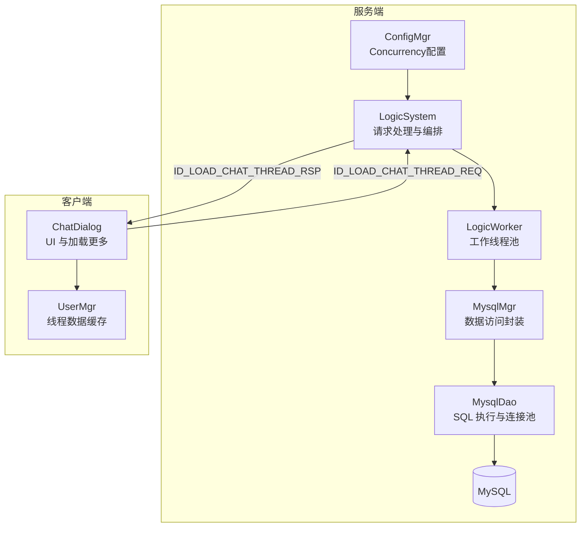
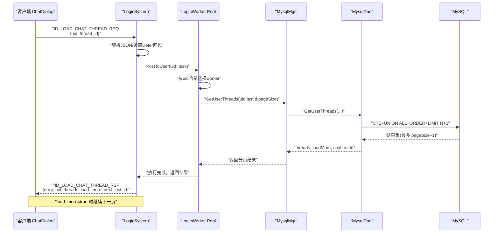
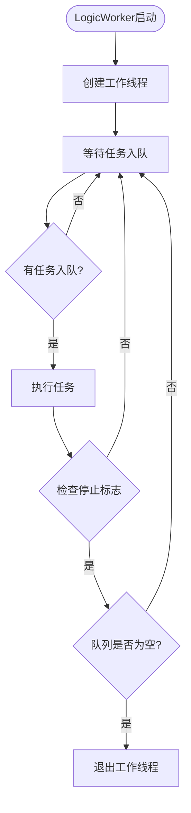
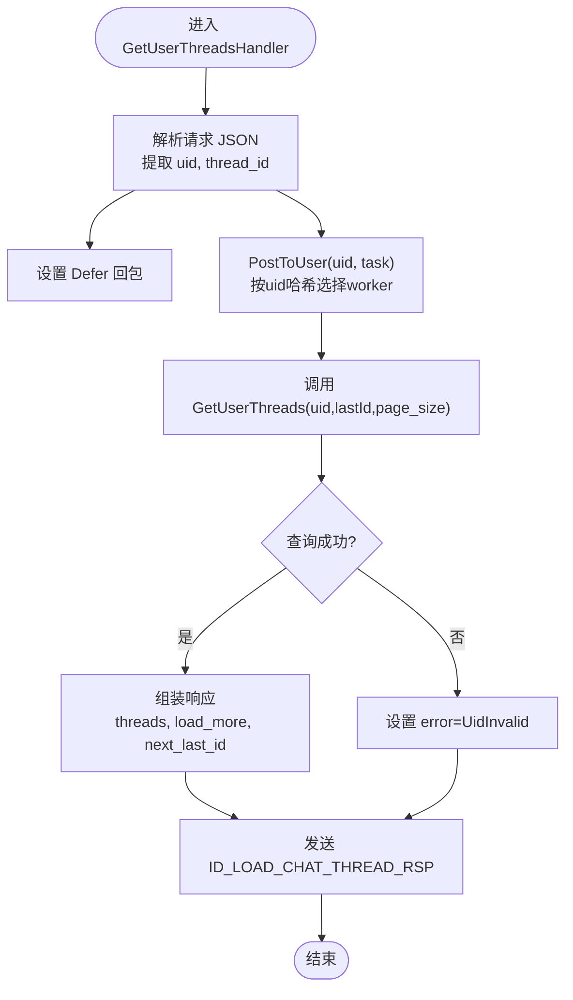
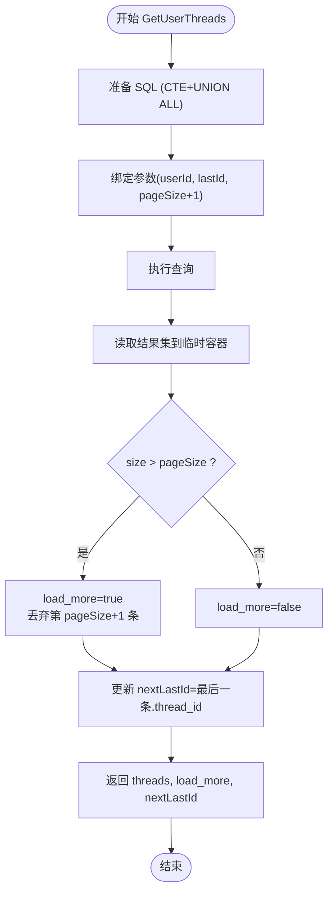
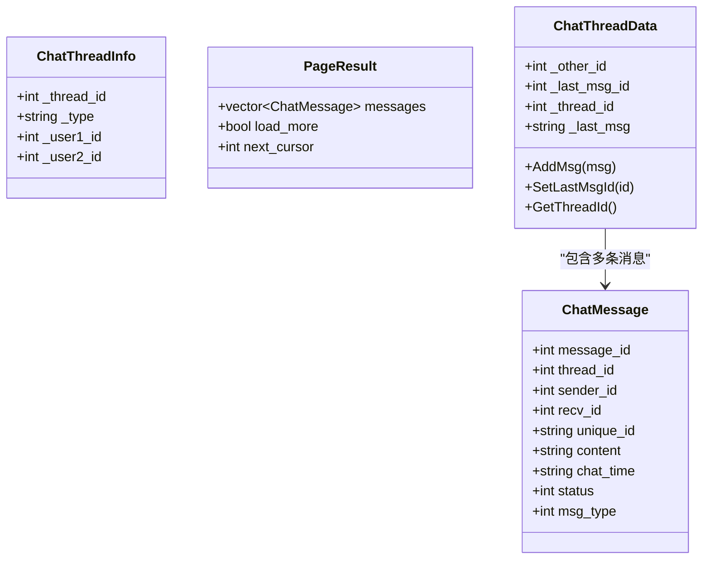
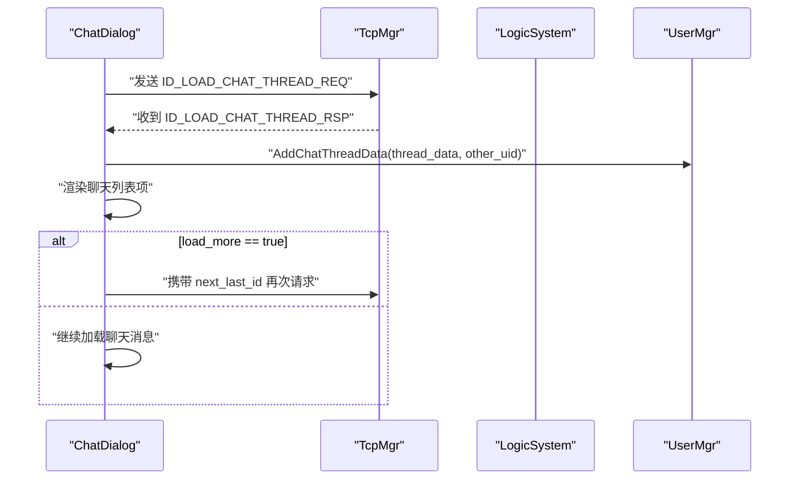
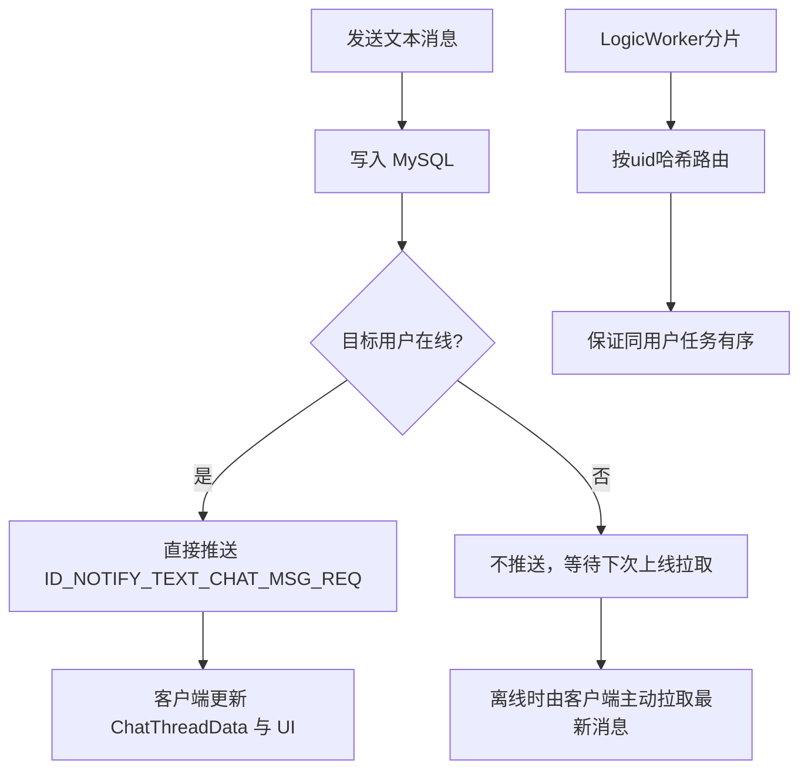
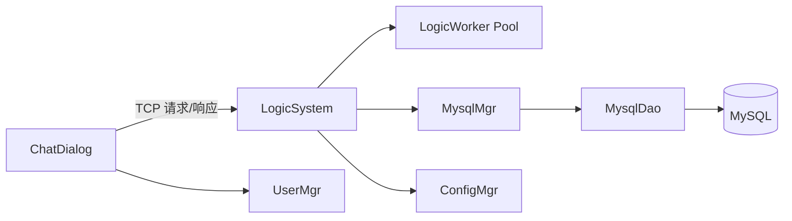

# 线程管理

<cite>
**本文引用的文件**   
- [LogicSystem.h](file://server/ChatServer/include/LogicSystem.h)
- [LogicSystem.cpp](file://server/ChatServer/src/LogicSystem.cpp)
- [LogicWorker.h](file://server/ChatServer/include/LogicWorker.h)
- [LogicWorker.cpp](file://server/ChatServer/src/LogicWorker.cpp)
- [ConfigMgr.h](file://server/ChatServer/include/ConfigMgr.h)
- [MysqlDao.h](file://server/ChatServer/include/MysqlDao.h)
- [MysqlDao.cpp](file://server/ChatServer/src/MysqlDao.cpp)
- [MysqlMgr.cpp](file://server/ChatServer/src/MysqlMgr.cpp)
- [data.h](file://server/ChatServer/include/data.h)
- [const.h](file://server/ChatServer/include/const.h)
- [chatserver1.ini](file://server/ChatServer/config/chatserver1.ini)
- [chatserver2.ini](file://server/ChatServer/config/chatserver2.ini)
- [userdata.h](file://client/llfcchat/include/userdata.h)
- [usermgr.cpp](file://client/llfcchat/src/usermgr.cpp)
- [chatdialog.cpp](file://client/llfcchat/src/chatdialog.cpp)
- [day37-聊天信息存储方案.md](file://开发文档/day37-聊天信息存储方案.md)
</cite>

## 更新摘要
**变更内容**   
- 新增LogicWorker工作线程管理机制，支持逻辑处理和消息投递两个独立的worker池
- 通过配置文件Concurrency段动态设置worker数量（LogicWorkers和DeliveryWorkers）
- 实现了按用户ID分片的任务路由机制，保证同一用户的任务有序执行
- 增强了系统的并发处理能力和资源隔离性

## 目录
1. [简介](#简介)
2. [项目结构](#项目结构)
3. [核心组件](#核心组件)
4. [架构总览](#架构总览)
5. [详细组件分析](#详细组件分析)
6. [依赖关系分析](#依赖关系分析)
7. [性能考虑](#性能考虑)
8. [故障排查指南](#故障排查指南)
9. [结论](#结论)
10. [附录](#附录)

## 简介
本文件针对 ChatServer 的"线程管理"模块进行系统化文档化，重点覆盖：
- **新增** LogicWorker工作线程管理机制，支持逻辑处理和消息投递两个独立的worker池
- GetUserThreadsHandler 与 GetUserThreads 的实现细节（聊天线程列表获取、分页查询与加载更多）
- 线程信息的存储结构与语义（私聊与群聊差异、最后消息时间与未读计数）
- 线程管理的业务规则（排序算法、置顶功能、搜索过滤）
- 线程状态的同步机制（实时更新、冲突解决、数据一致性）
- 线程相关的 API 接口（创建、删除、修改、查询）
- 性能优化建议（缓存策略、查询优化）

## 项目结构
ChatServer 中线程管理相关代码主要分布在以下位置：
- **新增** LogicWorker：纯任务执行worker，提供FIFO队列和单线程串行执行能力
- LogicSystem：负责接收并分发请求，管理logic_workers和delivery_workers两个worker池
- 数据访问层：MysqlDao/MysqlMgr（MySQL 连接池、SQL 执行、分页查询）
- 配置管理：ConfigMgr（读取Concurrency配置段中的worker数量）
- 数据结构：data.h（ChatThreadInfo、ChatMessage、PageResult 等）
- 常量与错误码：const.h（消息 ID、错误码、状态枚举）
- 客户端侧：userdata.h、usermgr.cpp、chatdialog.cpp（线程数据本地缓存、UI 渲染与加载更多触发）

**图表来源** 
- [LogicSystem.cpp:39-53](file://server/ChatServer/src/LogicSystem.cpp#L39-L53)
- [LogicWorker.h:20-61](file://server/ChatServer/include/LogicWorker.h#L20-L61)
- [ConfigMgr.h:75-131](file://server/ChatServer/include/ConfigMgr.h#L75-L131)
- [MysqlDao.cpp:703-770](file://server/ChatServer/src/MysqlDao.cpp#L703-L770)
- [MysqlMgr.cpp:62-70](file://server/ChatServer/src/MysqlMgr.cpp#L62-L70)
- [chatdialog.cpp:599-634](file://client/llfcchat/src/chatdialog.cpp#L599-L634)

**章节来源**
- [LogicSystem.h:33-231](file://server/ChatServer/include/LogicSystem.h#L33-L231)
- [LogicSystem.cpp:15-53](file://server/ChatServer/src/LogicSystem.cpp#L15-L53)
- [LogicWorker.h:1-62](file://server/ChatServer/include/LogicWorker.h#L1-L62)
- [LogicWorker.cpp:1-64](file://server/ChatServer/src/LogicWorker.cpp#L1-L64)
- [ConfigMgr.h:1-133](file://server/ChatServer/include/ConfigMgr.h#L1-L133)
- [MysqlDao.h:236-270](file://server/ChatServer/include/MysqlDao.h#L236-L270)
- [MysqlDao.cpp:700-770](file://server/ChatServer/src/MysqlDao.cpp#L700-L770)
- [MysqlMgr.cpp:1-95](file://server/ChatServer/src/MysqlMgr.cpp#L1-L95)
- [data.h:32-58](file://server/ChatServer/include/data.h#L32-L58)
- [const.h:49-79](file://server/ChatServer/include/const.h#L49-L79)
- [userdata.h:236-288](file://client/llfcchat/include/userdata.h#L236-L288)
- [usermgr.cpp:275-367](file://client/llfcchat/src/usermgr.cpp#L275-L367)
- [chatdialog.cpp:599-634](file://client/llfcchat/src/chatdialog.cpp#L599-L634)

## 核心组件
- **新增** LogicWorker：纯任务执行worker，每个实例持有一条独立线程，按 FIFO 顺序串行执行投递进来的任务闭包
- LogicSystem：负责接收并分发请求，管理logic_workers（逻辑处理）和delivery_workers（消息投递）两个worker池
- MysqlMgr：对 MysqlDao 的方法进行统一封装，供上层调用
- MysqlDao：实现具体 SQL 查询，包括 CTE + UNION ALL + ORDER BY + LIMIT N+1 的分页模式
- ConfigMgr：从 INI 配置文件中读取 Concurrency 段的 worker 数量配置
- data.h：定义 ChatThreadInfo、ChatMessage、PageResult 等关键数据结构
- const.h：定义消息 ID、错误码、状态枚举等
- 客户端 UserMgr/ChatDialog：维护线程数据缓存、触发加载更多、渲染 UI

**章节来源**
- [LogicWorker.h:20-61](file://server/ChatServer/include/LogicWorker.h#L20-L61)
- [LogicSystem.h:33-231](file://server/ChatServer/include/LogicSystem.h#L33-L231)
- [LogicSystem.cpp:39-53](file://server/ChatServer/src/LogicSystem.cpp#L39-L53)
- [ConfigMgr.h:75-131](file://server/ChatServer/include/ConfigMgr.h#L75-L131)
- [MysqlMgr.cpp:62-70](file://server/ChatServer/src/MysqlMgr.cpp#L62-L70)
- [MysqlDao.h:253-261](file://server/ChatServer/include/MysqlDao.h#L253-L261)
- [data.h:32-58](file://server/ChatServer/include/data.h#L32-L58)
- [const.h:49-79](file://server/ChatServer/include/const.h#L49-L79)

## 架构总览
下图展示了从客户端发起"加载聊天线程"到服务端返回结果的完整流程，包括新的LogicWorker工作线程管理和分页与加载更多控制。

**图表来源** 
- [LogicSystem.cpp:72-86](file://server/ChatServer/src/LogicSystem.cpp#L72-L86)
- [LogicWorker.cpp:15-25](file://server/ChatServer/src/LogicWorker.cpp#L15-L25)
- [MysqlDao.cpp:703-770](file://server/ChatServer/src/MysqlDao.cpp#L703-L770)
- [const.h:66-67](file://server/ChatServer/include/const.h#L66-L67)

## 详细组件分析

### **新增** 组件A：LogicWorker工作线程管理
- **职责**
  - 提供FIFO任务队列和单线程串行执行能力
  - 支持任务的异步投递和执行
  - 提供幂等的停止机制，确保任务排空后安全退出
- **关键点**
  - 每个LogicWorker实例持有独立的工作线程
  - 使用条件变量实现高效的线程间通信
  - 支持原子操作的停机标志，保证线程安全
- **配置管理**
  - 通过ConfigMgr读取Concurrency配置段
  - LogicWorkers：逻辑处理worker数量（默认4）
  - DeliveryWorkers：消息投递worker数量（默认4）

**图表来源** 
- [LogicWorker.cpp:43-63](file://server/ChatServer/src/LogicWorker.cpp#L43-L63)

**章节来源**
- [LogicWorker.h:20-61](file://server/ChatServer/include/LogicWorker.h#L20-L61)
- [LogicWorker.cpp:1-64](file://server/ChatServer/src/LogicWorker.cpp#L1-L64)
- [LogicSystem.cpp:17-36](file://server/ChatServer/src/LogicSystem.cpp#L17-L36)

### 组件B：LogicSystem::GetUserThreadsHandler 与 GetUserThreads
- **职责**
  - 解析请求 JSON（uid、thread_id）
  - 设置 Defer 确保响应发送
  - 调用 GetUserThreads 完成分页查询
  - 组装响应体（error、uid、threads、load_more、next_last_id）
- **关键点**
  - 固定 page_size=10
  - 使用 lastId 作为游标，避免偏移量分页的性能问题
  - 通过 load_more 控制是否继续加载
  - **新增** 通过 PostToUser 将任务投递到对应的LogicWorker分片
- **错误处理**
  - 若用户无效，返回 UidInvalid

**图表来源** 
- [LogicSystem.cpp:775-815](file://server/ChatServer/src/LogicSystem.cpp#L775-L815)

**章节来源**
- [LogicSystem.cpp:775-815](file://server/ChatServer/src/LogicSystem.cpp#L775-L815)
- [LogicSystem.cpp:72-78](file://server/ChatServer/src/LogicSystem.cpp#L72-L78)
- [const.h:66-67](file://server/ChatServer/include/const.h#L66-L67)

### 组件C：MysqlDao::GetUserThreads（分页查询与加载更多）
- **职责**
  - 使用 CTE 合并私聊与群聊记录
  - 按 thread_id 升序排序
  - 取 pageSize+1 条判断是否还有更多
  - 计算 nextLastId 用于下一次查询
- **关键点**
  - 私聊表 private_chat(user1_id, user2_id, thread_id)
  - 群聊成员表 group_chat_member(user_id, thread_id)
  - LIMIT N+1 模式避免二次查询判断是否有下一页
- **异常处理**
  - 捕获 SQLException，输出错误信息并返回失败

**图表来源** 
- [MysqlDao.cpp:703-770](file://server/ChatServer/src/MysqlDao.cpp#L703-L770)

**章节来源**
- [MysqlDao.cpp:703-770](file://server/ChatServer/src/MysqlDao.cpp#L703-L770)
- [MysqlDao.h:253-261](file://server/ChatServer/include/MysqlDao.h#L253-L261)

### 组件D：数据结构与存储模型
- ChatThreadInfo：包含 thread_id、type（private/group）、user1_id、user2_id
- ChatMessage：包含 message_id、thread_id、sender_id、recv_id、unique_id、content、chat_time、status、msg_type
- PageResult：messages、load_more、next_cursor（message_id 游标）
- 客户端 ChatThreadData：维护 _other_id、_last_msg_id、_thread_id、_last_msg、消息映射等

**图表来源** 
- [data.h:32-58](file://server/ChatServer/include/data.h#L32-L58)
- [userdata.h:236-288](file://client/llfcchat/include/userdata.h#L236-L288)

**章节来源**
- [data.h:32-58](file://server/ChatServer/include/data.h#L32-L58)
- [userdata.h:236-288](file://client/llfcchat/include/userdata.h#L236-L288)

### 组件E：客户端加载更多与线程缓存
- ChatDialog：解析服务器返回的线程列表，构建 ChatThreadData，插入 UI；当 load_more=true 时再次请求下一页
- UserMgr：维护线程数据缓存（thread_id -> ChatThreadData），以及 uid -> thread_id 映射，便于快速查找

**图表来源** 
- [chatdialog.cpp:599-634](file://client/llfcchat/src/chatdialog.cpp#L599-L634)
- [usermgr.cpp:288-367](file://client/llfcchat/src/usermgr.cpp#L288-L367)

**章节来源**
- [chatdialog.cpp:599-634](file://client/llfcchat/src/chatdialog.cpp#L599-L634)
- [usermgr.cpp:288-367](file://client/llfcchat/src/usermgr.cpp#L288-L367)

### 组件F：业务规则与排序
- 排序算法：按 thread_id 升序排列，保证时间顺序一致
- 置顶功能：当前实现未包含置顶字段或排序权重，如需支持可在 ChatThreadInfo 扩展排序键或使用 Redis/ZSET 维护置顶优先级
- 搜索过滤：当前 GetUserThreads 仅按 lastId 分页，未提供关键词过滤；如需支持可在 SQL 层增加 WHERE 条件或在应用层过滤

**章节来源**
- [MysqlDao.cpp:703-770](file://server/ChatServer/src/MysqlDao.cpp#L703-L770)
- [data.h:32-58](file://server/ChatServer/include/data.h#L32-L58)

### 组件G：线程状态同步机制
- 实时性：文本消息通过 ID_NOTIFY_TEXT_CHAT_MSG_REQ 推送给在线用户，保持会话最新
- 冲突解决：登录踢人使用分布式锁（Redis）避免多端同时登录导致的状态不一致
- 一致性：数据库写入后通过 RPC/通知机制将新消息推送到目标用户，保证两端数据一致
- **新增** 任务路由：通过PostToUser和PostDelivery方法，按用户ID哈希分配到不同的LogicWorker，保证同一用户的任务有序执行

**图表来源** 
- [LogicSystem.cpp:472-566](file://server/ChatServer/src/LogicSystem.cpp#L472-L566)
- [LogicSystem.cpp:198-250](file://server/ChatServer/src/LogicSystem.cpp#L198-L250)
- [LogicSystem.cpp:72-78](file://server/ChatServer/src/LogicSystem.cpp#L72-L78)

**章节来源**
- [LogicSystem.cpp:472-566](file://server/ChatServer/src/LogicSystem.cpp#L472-L566)
- [LogicSystem.cpp:198-250](file://server/ChatServer/src/LogicSystem.cpp#L198-L250)
- [LogicSystem.cpp:72-78](file://server/ChatServer/src/LogicSystem.cpp#L72-L78)

## 依赖关系分析
- LogicSystem 依赖 LogicWorker 进行任务调度和执行
- LogicSystem 依赖 MysqlMgr 进行数据访问
- MysqlMgr 封装 MysqlDao，屏蔽连接池与 SQL 细节
- MysqlDao 依赖 MySQL JDBC 驱动与连接池
- LogicSystem 依赖 ConfigMgr 读取Concurrency配置
- 客户端 ChatDialog 依赖 TcpMgr 发送请求，UserMgr 维护本地缓存

**图表来源** 
- [LogicSystem.cpp:39-53](file://server/ChatServer/src/LogicSystem.cpp#L39-L53)
- [LogicWorker.h:20-61](file://server/ChatServer/include/LogicWorker.h#L20-L61)
- [ConfigMgr.h:75-131](file://server/ChatServer/include/ConfigMgr.h#L75-L131)
- [MysqlMgr.cpp:1-95](file://server/ChatServer/src/MysqlMgr.cpp#L1-L95)
- [MysqlDao.h:236-270](file://server/ChatServer/include/MysqlDao.h#L236-L270)
- [chatdialog.cpp:599-634](file://client/llfcchat/src/chatdialog.cpp#L599-L634)

**章节来源**
- [LogicSystem.cpp:39-53](file://server/ChatServer/src/LogicSystem.cpp#L39-L53)
- [LogicWorker.h:20-61](file://server/ChatServer/include/LogicWorker.h#L20-L61)
- [ConfigMgr.h:75-131](file://server/ChatServer/include/ConfigMgr.h#L75-L131)
- [MysqlMgr.cpp:1-95](file://server/ChatServer/src/MysqlMgr.cpp#L1-L95)
- [MysqlDao.h:236-270](file://server/ChatServer/include/MysqlDao.h#L236-L270)
- [chatdialog.cpp:599-634](file://client/llfcchat/src/chatdialog.cpp#L599-L634)

## 性能考虑
- **新增** 工作线程池：LogicWorkers和DeliveryWorkers分离，避免阻塞操作影响逻辑处理
- **新增** 用户分片：按用户ID哈希分配到不同worker，提高并发处理能力
- **新增** 配置驱动：通过Concurrency配置段动态调整worker数量，适应不同负载场景
- 分页策略：采用 LIMIT N+1 游标分页，避免 OFFSET 在大偏移时的性能退化
- 连接池：MysqlPool 自动健康检查与重连，降低连接失效影响
- 缓存策略：用户基础信息优先查 Redis，减少数据库压力（适用于用户信息查询，线程列表可考虑热点线程缓存）
- 查询优化：CTE + UNION ALL 合并私聊与群聊，单 SQL 完成聚合，减少多次往返
- 网络传输：响应体精简，仅返回必要字段，减少带宽占用

**章节来源**
- [LogicSystem.cpp:39-53](file://server/ChatServer/src/LogicSystem.cpp#L39-L53)
- [LogicWorker.cpp:15-25](file://server/ChatServer/src/LogicWorker.cpp#L15-L25)
- [chatserver1.ini:30-32](file://server/ChatServer/config/chatserver1.ini#L30-L32)
- [chatserver2.ini:30-32](file://server/ChatServer/config/chatserver2.ini#L30-L32)
- [MysqlDao.cpp:703-770](file://server/ChatServer/src/MysqlDao.cpp#L703-L770)
- [MysqlDao.h:25-60](file://server/ChatServer/include/MysqlDao.h#L25-L60)
- [LogicSystem.cpp:587-652](file://server/ChatServer/src/LogicSystem.cpp#L587-L652)

## 故障排查指南
- **新增** Worker相关问题
  - Worker数量不足：检查Concurrency配置段中的LogicWorkers和DeliveryWorkers设置
  - Worker卡死：查看LogicWorker的RunLoop循环是否正常执行
  - 任务堆积：监控LogicWorker的任务队列长度
- 常见问题
  - 分页错位：确认 lastId 是否正确传递，避免重复或遗漏
  - 线程缺失：检查 private_chat 与 group_chat_member 数据完整性
  - 响应错误：查看 error 字段，如 UidInvalid、LOAD_CHAT_FAILED
- 日志定位
  - 服务端打印接收消息 ID 与处理路径
  - MySQL 异常捕获输出错误码与 SQLState
  - LogicWorker启动和停止日志
- 恢复措施
  - 重试机制：客户端在 load_more=true 时继续请求下一页
  - 连接恢复：MysqlPool 自动检测并重连
  - Worker重启：LogicWorker析构时自动调用Stop()进行清理

**章节来源**
- [const.h:5-20](file://server/ChatServer/include/const.h#L5-L20)
- [MysqlDao.cpp:762-770](file://server/ChatServer/src/MysqlDao.cpp#L762-L770)
- [LogicSystem.cpp:775-815](file://server/ChatServer/src/LogicSystem.cpp#L775-L815)
- [LogicWorker.cpp:9-13](file://server/ChatServer/src/LogicWorker.cpp#L9-L13)

## 结论
ChatServer 的线程管理模块以 LogicSystem 为核心，结合新增的 LogicWorker 工作线程管理机制，实现了高并发、低延迟的聊天线程列表获取与加载更多能力。通过 LogicWorkers 和 DeliveryWorkers 两个独立的 worker 池，有效分离了逻辑处理和消息投递任务，提升了系统整体性能。配合 CTE + UNION ALL 的 SQL 设计，兼顾了私聊与群聊的统一查询。客户端通过 UserMgr 维护线程数据缓存，配合 UI 渲染与加载更多逻辑，形成完整的用户体验闭环。未来可扩展置顶、搜索过滤与热点缓存以提升性能与可用性。

## 附录
- **新增** 配置说明
  - Concurrency 配置段：
    - LogicWorkers：逻辑处理worker数量（默认4，范围1-64）
    - DeliveryWorkers：消息投递worker数量（默认4，范围1-64）
- API 接口说明（基于现有实现）
  - 加载聊天线程：ID_LOAD_CHAT_THREAD_REQ / ID_LOAD_CHAT_THREAD_RSP
    - 请求参数：uid、thread_id（上次最后一条 thread_id）
    - 响应字段：error、uid、threads[]、load_more、next_last_id
  - 创建私聊：ID_CREATE_PRIVATE_CHAT_REQ / ID_CREATE_PRIVATE_CHAT_RSP
    - 请求参数：user1_id、user2_id
    - 响应字段：error、thread_id
  - 加载聊天消息：ID_LOAD_CHAT_MSG_REQ / ID_LOAD_CHAT_MSG_RSP
    - 请求参数：thread_id、last_message_id、page_size
    - 响应字段：messages[]、load_more、next_cursor
  - 发送文本消息：ID_TEXT_CHAT_MSG_REQ / ID_TEXT_CHAT_MSG_RSP
    - 请求参数：fromuid、touid、thread_id、text_array[]
    - 响应字段：error、chat_datas[]
  - 通知类消息：ID_NOTIFY_*（用于在线用户实时推送）

**章节来源**
- [chatserver1.ini:30-32](file://server/ChatServer/config/chatserver1.ini#L30-L32)
- [chatserver2.ini:30-32](file://server/ChatServer/config/chatserver2.ini#L30-L32)
- [LogicSystem.cpp:17-36](file://server/ChatServer/src/LogicSystem.cpp#L17-L36)
- [const.h:49-79](file://server/ChatServer/include/const.h#L49-L79)
- [LogicSystem.cpp:775-815](file://server/ChatServer/src/LogicSystem.cpp#L775-L815)
- [MysqlDao.cpp:772-869](file://server/ChatServer/src/MysqlDao.cpp#L772-L869)
- [MysqlDao.cpp:871-899](file://server/ChatServer/src/MysqlDao.cpp#L871-L899)
- [day37-聊天信息存储方案.md:377-431](file://开发文档/day37-聊天信息存储方案.md#L377-L431)