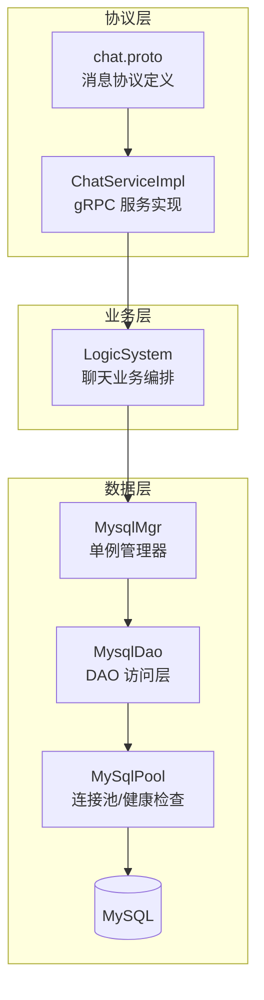
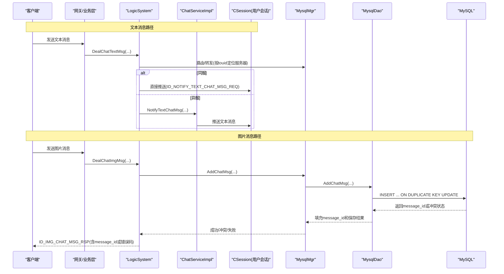
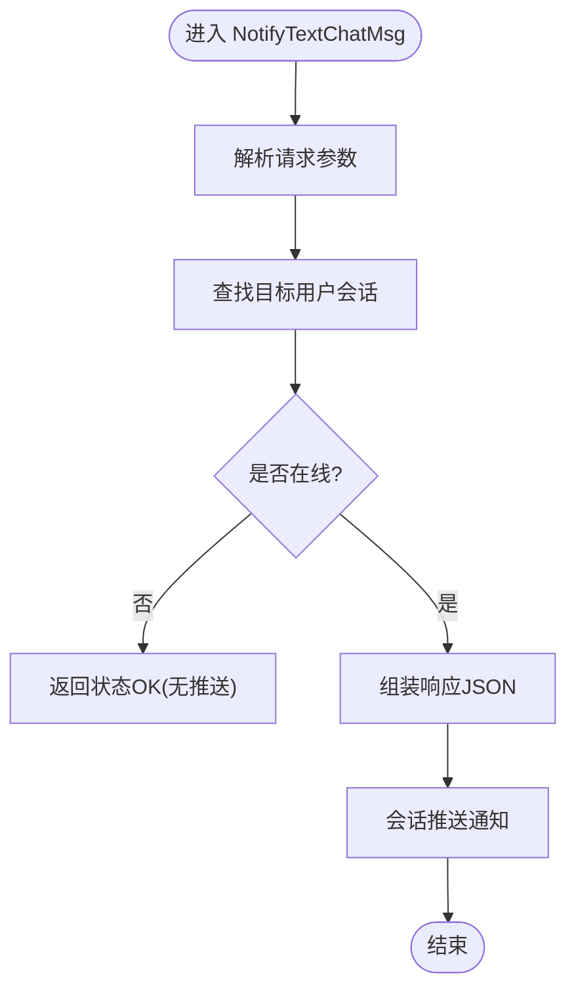
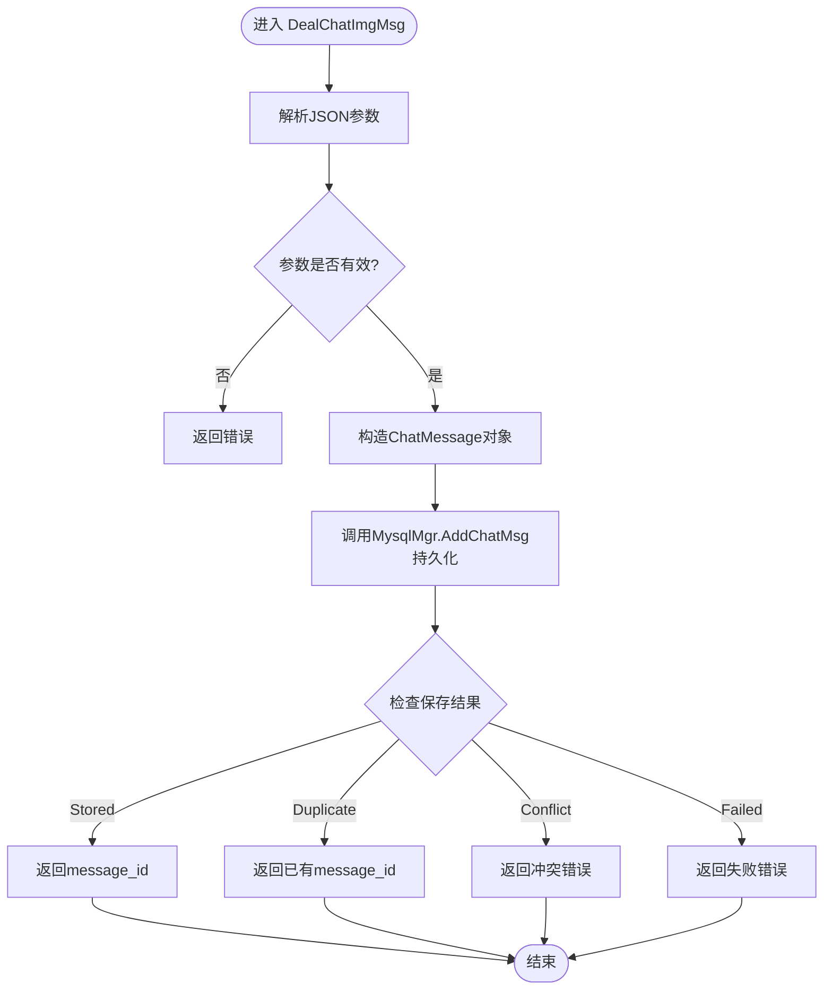
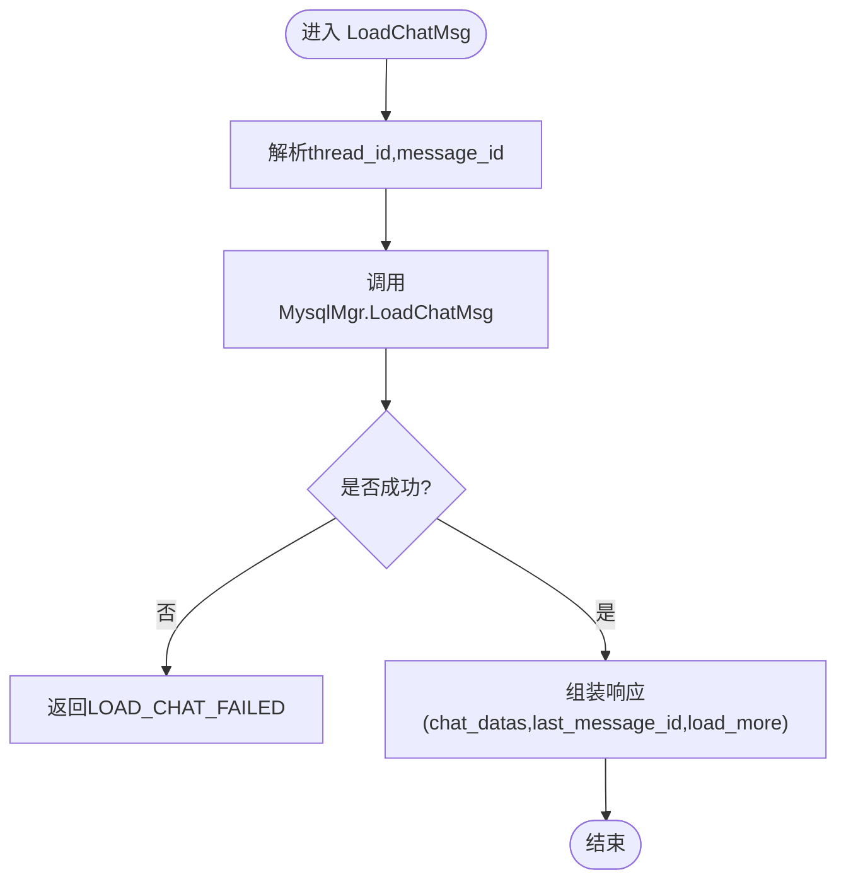
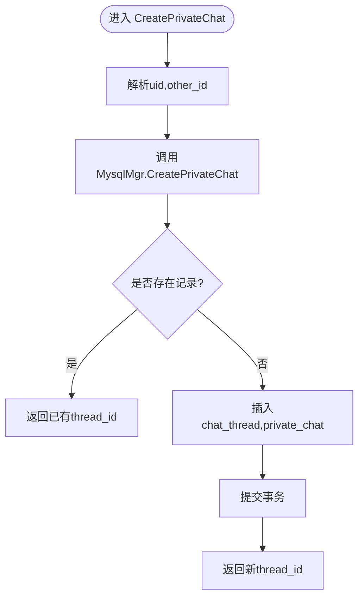
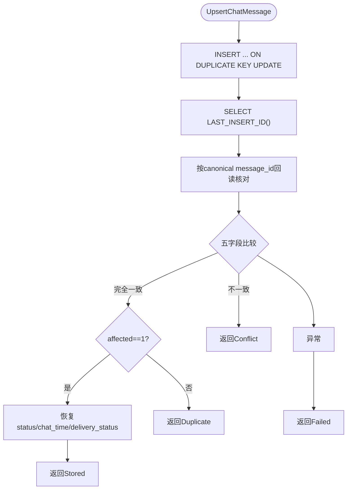
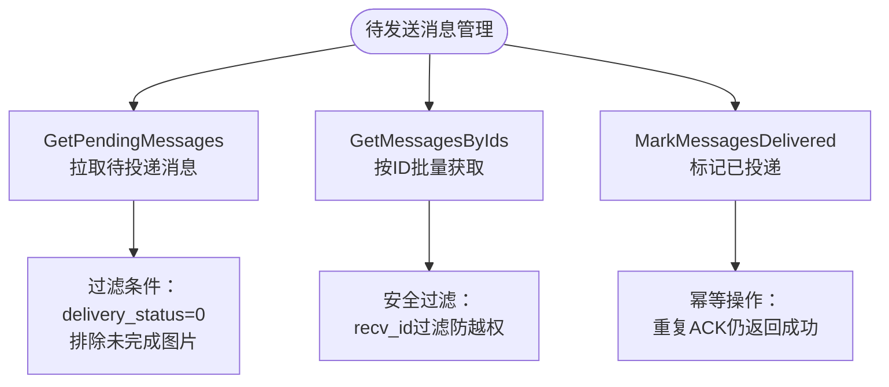
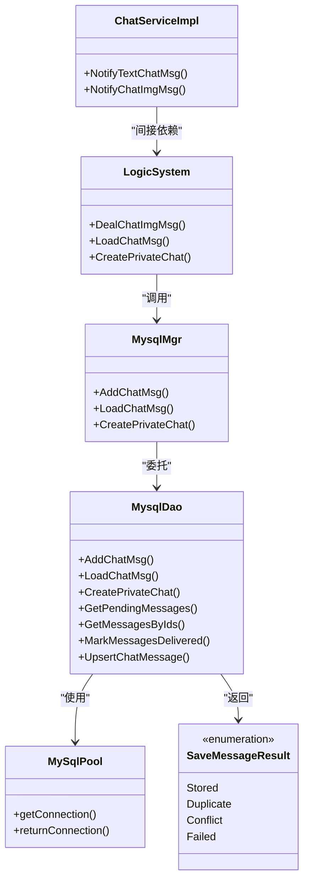

# 聊天消息处理

<cite>
**本文引用的文件**   
- [ChatServiceImpl.h](file://server/ChatServer/include/ChatServiceImpl.h)
- [ChatServiceImpl.cpp](file://server/ChatServer/src/ChatServiceImpl.cpp)
- [chat.proto](file://proto/chat_service/chat.proto)
- [LogicSystem.cpp](file://server/ChatServer/src/LogicSystem.cpp)
- [MysqlMgr.h](file://server/ChatServer/include/MysqlMgr.h)
- [MysqlMgr.cpp](file://server/ChatServer/src/MysqlMgr.cpp)
- [MysqlDao.h](file://server/ChatServer/include/MysqlDao.h)
- [MysqlDao.cpp](file://server/ChatServer/src/MysqlDao.cpp)
- [data.h](file://server/ChatServer/include/data.h)
</cite>

## 更新摘要
**变更内容**   
- **关键修复**：MysqlDao::UpsertChatMessage()函数修复了消息持久化的核心bug，增强了幂等性和冲突检测机制
- **改进重复消息检测**：通过LAST_INSERT_ID(message_id)和回读核对确保准确的Duplicate状态判断
- **增强状态恢复逻辑**：在Duplicate情况下正确恢复status、chat_time和delivery_status字段
- **优化数据库迁移脚本验证**：提升了UPSERT操作的可靠性和一致性保证
- **完善异常处理**：改进了SQL异常和连接失败时的回滚机制

## 目录
1. [简介](#简介)
2. [项目结构](#项目结构)
3. [核心组件](#核心组件)
4. [架构总览](#架构总览)
5. [详细组件分析](#详细组件分析)
6. [依赖关系分析](#依赖关系分析)
7. [性能考虑](#性能考虑)
8. [故障排查指南](#故障排查指南)
9. [结论](#结论)
10. [附录](#附录)

## 简介
本文件聚焦 ChatServer 聊天消息处理模块，围绕以下目标展开：
- 文本与图片消息的处理流程（解析、校验、持久化、推送）
- 历史消息加载机制（分页、时间排序、增量加载）
- 私聊会话创建流程（会话ID生成、初始化、持久化）
- 消息持久化策略（MySQL存储格式、索引设计、备份方案）
- 消息类型扩展机制（新增消息类型的接入方式）
- 消息去重、重复发送检测与异常恢复机制
- **关键更新**：基于 SaveMessageResult 的幂等消息持久化和待发送消息管理机制，包含UpsertChatMessage函数的核心修复

## 项目结构
ChatServer 的聊天消息处理由三层构成：
- 协议层：gRPC 接口定义与实现，负责跨服务消息转发与通知
- 业务层：LogicSystem 编排具体业务逻辑（文本/图片消息处理、历史消息加载、私聊会话创建）
- 数据层：MysqlMgr/MysqlDao 封装 MySQL 连接池、事务、分页查询与写入

**图表来源** 
- [ChatServiceImpl.cpp:1-240](file://server/ChatServer/src/ChatServiceImpl.cpp#L1-L240)
- [chat.proto:1-105](file://proto/chat_service/chat.proto#L1-L105)
- [LogicSystem.cpp:828-945](file://server/ChatServer/src/LogicSystem.cpp#L828-L945)
- [MysqlMgr.h:1-41](file://server/ChatServer/include/MysqlMgr.h#L1-L41)
- [MysqlDao.h:236-267](file://server/ChatServer/include/MysqlDao.h#L236-L267)
- [MysqlDao.cpp:1-1104](file://server/ChatServer/src/MysqlDao.cpp#L1-L1104)

**章节来源**
- [ChatServiceImpl.h:1-55](file://server/ChatServer/include/ChatServiceImpl.h#L1-L55)
- [ChatServiceImpl.cpp:1-240](file://server/ChatServer/src/ChatServiceImpl.cpp#L1-L240)
- [chat.proto:1-105](file://proto/chat_service/chat.proto#L1-L105)
- [LogicSystem.cpp:828-945](file://server/ChatServer/src/LogicSystem.cpp#L828-L945)
- [MysqlMgr.h:1-41](file://server/ChatServer/include/MysqlMgr.h#L1-L41)
- [MysqlMgr.cpp:1-95](file://server/ChatServer/src/MysqlMgr.cpp#L1-L95)
- [MysqlDao.h:236-267](file://server/ChatServer/include/MysqlDao.h#L236-L267)
- [MysqlDao.cpp:772-1104](file://server/ChatServer/src/MysqlDao.cpp#L772-L1104)

## 核心组件
- ChatServiceImpl：gRPC 服务实现，负责接收来自其他服务的消息通知（如文本、图片），并转发到在线用户会话。
- LogicSystem：业务编排，处理客户端请求（文本消息、图片消息、历史消息加载、私聊会话创建）。
- MysqlMgr：数据库访问的单例入口，统一调用 DAO。
- MysqlDao：数据库操作实现，包含连接池管理、事务控制、分页查询、批量插入等。
- data.h：核心数据结构（UserInfo、ChatMessage、PageResult、ChatMsgType 等）。
- **关键更新**：SaveMessageResult 枚举，提供四种持久化结果状态，支持幂等插入和冲突检测。

**章节来源**
- [ChatServiceImpl.cpp:1-240](file://server/ChatServer/src/ChatServiceImpl.cpp#L1-L240)
- [LogicSystem.cpp:828-945](file://server/ChatServer/src/LogicSystem.cpp#L828-L945)
- [MysqlMgr.h:1-41](file://server/ChatServer/include/MysqlMgr.h#L1-L41)
- [MysqlDao.h:236-267](file://server/ChatServer/include/MysqlDao.h#L236-L267)
- [data.h:1-65](file://server/ChatServer/include/data.h#L1-L65)

## 架构总览
下图展示从客户端到服务端再到数据库的完整链路，涵盖文本与图片消息的关键路径。

**图表来源** 
- [LogicSystem.cpp:828-945](file://server/ChatServer/src/LogicSystem.cpp#L828-L945)
- [ChatServiceImpl.cpp:105-139](file://server/ChatServer/src/ChatServiceImpl.cpp#L105-L139)
- [MysqlDao.cpp:1002-1054](file://server/ChatServer/src/MysqlDao.cpp#L1002-L1054)

## 详细组件分析

### DealChatTextMsg（文本消息处理）
说明：
- 该函数用于处理客户端发送的文本消息。根据当前仓库中的代码，文本消息的 gRPC 通知在 ChatServiceImpl::NotifyTextChatMsg 中实现；而 LogicSystem 中未提供 DealChatTextMsg 的实现。因此，文本消息的核心处理逻辑位于 gRPC 服务层，负责将文本消息推送到在线用户的会话。
- 处理要点：
  - 解析请求参数（fromuid、touid、thread_id、textmsgs）
  - 查找目标用户会话
  - 组织响应数据（error、fromuid、touid、thread_id、chat_datas）
  - 通过会话发送通知（ID_NOTIFY_TEXT_CHAT_MSG_REQ）

**图表来源** 
- [ChatServiceImpl.cpp:105-139](file://server/ChatServer/src/ChatServiceImpl.cpp#L105-L139)

**章节来源**
- [ChatServiceImpl.cpp:105-139](file://server/ChatServer/src/ChatServiceImpl.cpp#L105-L139)
- [chat.proto:53-74](file://proto/chat_service/chat.proto#L53-L74)

### DealChatImgMsg（图片消息处理）
说明：
- 该函数负责处理图片消息，包括参数解析、构造消息对象、持久化到 MySQL，并返回 message_id 给客户端。
- **关键更新**：现在使用 SaveMessageResult 枚举处理不同的持久化结果，支持幂等插入和冲突检测。
- 处理要点：
  - 解析 fromuid、touid、thread_id、md5、unique_name、token、unique_id、chat_time、status
  - 构造 ChatMessage 对象（设置 msg_type=PIC、status=UN_UPLOAD）
  - 调用 MysqlMgr::AddChatMsg 进行持久化
  - 根据 SaveMessageResult 返回不同状态：Stored（成功）、Duplicate（重复）、Conflict（冲突）、Failed（失败）

**图表来源** 
- [LogicSystem.cpp:896-945](file://server/ChatServer/src/LogicSystem.cpp#L896-L945)
- [MysqlMgr.cpp:82-88](file://server/ChatServer/src/MysqlMgr.cpp#L82-L88)
- [MysqlDao.cpp:1002-1054](file://server/ChatServer/src/MysqlDao.cpp#L1002-L1054)

**章节来源**
- [LogicSystem.cpp:896-945](file://server/ChatServer/src/LogicSystem.cpp#L896-L945)
- [MysqlMgr.h:32-35](file://server/ChatServer/include/MysqlMgr.h#L32-L35)
- [MysqlDao.cpp:1002-1054](file://server/ChatServer/src/MysqlDao.cpp#L1002-L1054)
- [data.h:41-65](file://server/ChatServer/include/data.h#L41-L65)

### LoadChatMsg（历史消息加载）
说明：
- 该函数实现历史消息的分页加载，支持基于 message_id 的游标分页、按 message_id 升序排序、以及 load_more 标志判断是否还有更多数据。
- 处理要点：
  - 解析 thread_id、message_id
  - 调用 MysqlMgr::LoadChatMsg 获取 PageResult
  - 组装响应（last_message_id、load_more、chat_datas）
  - 使用 LIMIT N+1 技巧判断是否还有下一页

**图表来源** 
- [LogicSystem.cpp:854-894](file://server/ChatServer/src/LogicSystem.cpp#L854-L894)
- [MysqlDao.cpp:871-936](file://server/ChatServer/src/MysqlDao.cpp#L871-936)

**章节来源**
- [LogicSystem.cpp:854-894](file://server/ChatServer/src/LogicSystem.cpp#L854-L894)
- [MysqlMgr.h:32-33](file://server/ChatServer/include/MysqlMgr.h#L32-L33)
- [MysqlDao.cpp:871-936](file://server/ChatServer/src/MysqlDao.cpp#L871-936)

### CreatePrivateChat（私聊会话创建）
说明：
- 该函数负责创建私聊会话，确保同一对用户的唯一性，避免重复创建。
- 处理要点：
  - 解析 uid、other_id
  - 调用 MysqlMgr::CreatePrivateChat
  - 内部逻辑：先查询是否存在记录，存在则返回已有 thread_id；不存在则创建 chat_thread 和 private_chat 记录
  - 返回 thread_id 给客户端

**图表来源** 
- [LogicSystem.cpp:828-852](file://server/ChatServer/src/LogicSystem.cpp#L828-L852)
- [MysqlDao.cpp:772-869](file://server/ChatServer/src/MysqlDao.cpp#L772-869)

**章节来源**
- [LogicSystem.cpp:828-852](file://server/ChatServer/src/LogicSystem.cpp#L828-L852)
- [MysqlDao.cpp:772-869](file://server/ChatServer/src/MysqlDao.cpp#L772-869)

### 关键更新：UpsertChatMessage 幂等持久化机制修复
说明：
- **核心修复**：实现了基于 INSERT ON DUPLICATE KEY UPDATE 的幂等消息持久化机制，修复了关键的消息持久化bug。
- SaveMessageResult 枚举定义了四种持久化结果：
  - Stored：新消息已持久化
  - Duplicate：幂等重复，返回已有 canonical message_id
  - Conflict：unique-id 相同但内容冲突，原消息不变
  - Failed：持久化失败（SQL 错误/连接失败，已回滚）
- UpsertChatMessage 方法实现了核心的 UPSERT 逻辑，通过 LAST_INSERT_ID(message_id) 暴露 canonical message_id。

**关键改进点**：
1. **准确的Duplicate检测**：通过无条件回读核对五个关键字段（thread_id、recv_id、content、msg_type、content_size）确保Duplicate判断准确
2. **状态恢复机制**：在Duplicate情况下正确恢复status、chat_time和delivery_status字段，避免已ACK消息被重新激活
3. **异常处理增强**：完善的SQL异常处理和事务回滚机制
4. **性能优化**：使用LAST_INSERT_ID(expr)避免额外查询

**图表来源** 
- [MysqlDao.cpp:943-1013](file://server/ChatServer/src/MysqlDao.cpp#L943-L1013)

**章节来源**
- [MysqlDao.h:281-294](file://server/ChatServer/include/MysqlDao.h#L281-294)
- [MysqlDao.cpp:943-1013](file://server/ChatServer/src/MysqlDao.cpp#L943-L1013)

### 新增：待发送消息管理方法
说明：
- **新增功能**：提供了三个新的方法来管理待发送的消息。
- GetPendingMessages：拉取接收者的待投递消息（delivery_status=0），排除尚未上传完成的图片。
- GetMessagesByIds：按消息ID批量取回指定接收者的消息，带 recv_uid 过滤防越权。
- MarkMessagesDelivered：将指定接收者的一批消息标记为已投递（ACK），支持幂等操作。

**图表来源** 
- [MysqlDao.cpp:1153-1205](file://server/ChatServer/src/MysqlDao.cpp#L1153-1205)
- [MysqlDao.cpp:1207-1261](file://server/ChatServer/src/MysqlDao.cpp#L1207-1261)
- [MysqlDao.cpp:1263-1297](file://server/ChatServer/src/MysqlDao.cpp#L1263-1297)

**章节来源**
- [MysqlDao.h:471-502](file://server/ChatServer/include/MysqlDao.h#L471-502)
- [MysqlDao.cpp:1153-1205](file://server/ChatServer/src/MysqlDao.cpp#L1153-1205)
- [MysqlDao.cpp:1207-1261](file://server/ChatServer/src/MysqlDao.cpp#L1207-1261)
- [MysqlDao.cpp:1263-1297](file://server/ChatServer/src/MysqlDao.cpp#L1263-1297)

## 依赖关系分析
- ChatServiceImpl 依赖 UserMgr、RedisMgr、MysqlMgr、CSession
- LogicSystem 依赖 MysqlMgr、CSession
- MysqlMgr 依赖 MysqlDao（单例模式）
- MysqlDao 依赖 MySqlPool（连接池）、MySQL JDBC

**图表来源** 
- [ChatServiceImpl.h:29-53](file://server/ChatServer/include/ChatServiceImpl.h#L29-L53)
- [LogicSystem.cpp:828-945](file://server/ChatServer/src/LogicSystem.cpp#L828-L945)
- [MysqlMgr.h:8-39](file://server/ChatServer/include/MysqlMgr.h#L8-L39)
- [MysqlDao.h:236-267](file://server/ChatServer/include/MysqlDao.h#L236-L267)

**章节来源**
- [ChatServiceImpl.h:29-53](file://server/ChatServer/include/ChatServiceImpl.h#L29-L53)
- [MysqlMgr.h:8-39](file://server/ChatServer/include/MysqlMgr.h#L8-L39)
- [MysqlDao.h:236-267](file://server/ChatServer/include/MysqlDao.h#L236-L267)

## 性能考虑
- 连接池与健康检查：MySqlPool 维护连接池，定期执行 SELECT 1 保持连接活跃，失败时自动重连。
- 分页查询优化：使用 LIMIT N+1 判断是否还有更多数据，减少一次额外查询。
- 事务管理：批量插入时使用手动事务，提高写入性能与一致性。
- 缓存策略：用户基础信息优先从 Redis 读取，未命中再查 MySQL 并回写缓存。
- **关键优化**：幂等 UPSERT 操作减少重复插入开销，LAST_INSERT_ID(expr) 避免额外查询。
- **新增优化**：待发送消息管理支持批量操作，减少数据库往返次数。
- **性能提升**：UpsertChatMessage通过单次UPSERT和回读核对，避免了多次数据库交互。

**章节来源**
- [MysqlDao.cpp:25-232](file://server/ChatServer/src/MysqlDao.cpp#L25-L232)
- [MysqlDao.cpp:871-936](file://server/ChatServer/src/MysqlDao.cpp#L871-936)
- [MysqlDao.cpp:939-1000](file://server/ChatServer/src/MysqlDao.cpp#L939-L1000)
- [ChatServiceImpl.cpp:142-185](file://server/ChatServer/src/ChatServiceImpl.cpp#L142-L185)
- [MysqlDao.cpp:943-1013](file://server/ChatServer/src/MysqlDao.cpp#L943-L1013)

## 故障排查指南
- 文本消息未送达：检查目标用户是否在线（UserMgr::GetSession），确认 gRPC 调用是否成功。
- 图片消息持久化失败：查看 MySQL 事务是否回滚，检查 LAST_INSERT_ID 是否正确获取。
- 历史消息加载异常：确认 last_message_id 是否正确传递，检查 SQL 条件与索引。
- 私聊会话重复创建：检查 private_chat 表的唯一键约束，确认并发场景下的重试逻辑。
- **关键问题排查**：SaveMessageResult::Conflict 冲突处理：检查 unique_id 和内容一致性，确认客户端去重逻辑。
- **新增问题排查**：待发送消息积压：检查 delivery_status 字段更新是否正常，确认 ACK 机制工作正常。
- **UpsertChatMessage问题**：如果Duplicate判断不准确，检查回读核对逻辑和字段比较是否正确。

**章节来源**
- [ChatServiceImpl.cpp:105-139](file://server/ChatServer/src/ChatServiceImpl.cpp#L105-L139)
- [MysqlDao.cpp:939-1000](file://server/ChatServer/src/MysqlDao.cpp#L939-L1000)
- [MysqlDao.cpp:871-936](file://server/ChatServer/src/MysqlDao.cpp#L871-936)
- [MysqlDao.cpp:772-869](file://server/ChatServer/src/MysqlDao.cpp#L772-869)
- [MysqlDao.cpp:1153-1205](file://server/ChatServer/src/MysqlDao.cpp#L1153-1205)

## 结论
ChatServer 的聊天消息处理模块通过清晰的层次划分与健壮的数据访问层，实现了文本与图片消息的高效处理、历史消息的分页加载以及私聊会话的安全创建。结合连接池、事务管理与缓存策略，系统在性能与可靠性方面具备良好表现。**关键的UpsertChatMessage函数修复显著提升了系统的可靠性和一致性，通过幂等持久化机制、准确的重复消息检测和状态恢复逻辑，确保了消息处理的准确性和稳定性。**未来可进一步扩展消息类型与去重机制，提升系统的可扩展性与稳定性。

## 附录

### 消息持久化策略
- MySQL 表结构：
  - chat_thread：会话元数据（type、created_at）
  - private_chat：私聊关系（thread_id、user1_id、user2_id、created_at）
  - chat_message：消息内容（thread_id、sender_id、recv_id、content、created_at、updated_at、status、msg_type、unique_id、content_size、delivery_status）
- 索引设计建议：
  - chat_message.thread_id + message_id 复合索引，加速分页查询
  - private_chat.user1_id + user2_id 唯一索引，防止重复会话
  - chat_message.sender_id + unique_id 唯一索引，支持幂等插入
- 备份方案：
  - 定期全量备份（mysqldump）
  - 增量备份（binlog）
  - 异地容灾备份

**章节来源**
- [MysqlDao.cpp:808-835](file://server/ChatServer/src/MysqlDao.cpp#L808-L835)
- [MysqlDao.cpp:871-936](file://server/ChatServer/src/MysqlDao.cpp#L871-936)

### 消息类型扩展机制
- 在 data.h 中扩展 ChatMsgType 枚举
- 在 LogicSystem 中添加新的处理函数（如 DealChatVideoMsg）
- 在 proto/chat.proto 中定义新的消息协议
- 在 ChatServiceImpl 中实现对应的 gRPC 方法

**章节来源**
- [data.h:60-65](file://server/ChatServer/include/data.h#L60-L65)
- [chat.proto:1-105](file://proto/chat_service/chat.proto#L1-L105)

### 消息去重与重复发送检测
- 客户端层面：使用 unique_id 标记消息，避免重复发送
- 服务端层面：利用 SaveMessageResult::Duplicate 处理重复消息，返回相同的 message_id
- 数据库层面：利用 sender_id + unique_id 唯一键约束防止重复插入
- **关键改进**：UpsertChatMessage机制确保幂等性，通过LAST_INSERT_ID和回读核对确保准确的Duplicate判断

**章节来源**
- [data.h:41-65](file://server/ChatServer/include/data.h#L41-L65)
- [ChatServiceImpl.cpp:105-139](file://server/ChatServer/src/ChatServiceImpl.cpp#L105-L139)
- [MysqlDao.cpp:943-1013](file://server/ChatServer/src/MysqlDao.cpp#L943-L1013)

### 异常恢复机制
- 数据库连接异常：MySqlPool 自动重连
- gRPC 调用失败：重试机制或降级处理
- 事务失败：回滚并返回错误码
- **关键增强**：SaveMessageResult::Failed 处理持久化失败，支持上层重试逻辑
- **新增增强**：待发送消息队列支持断点续传，重启后继续投递
- **UpsertChatMessage增强**：完善的异常处理和事务回滚机制

**章节来源**
- [MysqlDao.cpp:125-145](file://server/ChatServer/src/MysqlDao.cpp#L125-L145)
- [ChatServiceImpl.cpp:105-139](file://server/ChatServer/src/ChatServiceImpl.cpp#L105-L139)
- [MysqlDao.cpp:1153-1205](file://server/ChatServer/src/MysqlDao.cpp#L1153-1205)

### 新增：DeliveryStatus 投递状态管理
- **新增功能**：引入 DeliveryStatus 枚举管理应用层投递状态
- Pending：待投递（新写入默认值，进入离线 pending 集合）
- Acked：已投递（接收方已 ACK；历史/系统消息也固定为已投递，不重推）
- 与展示状态(status)分离：status 描述阅读/上传状态，delivery_status 描述是否已被接收方 ACK
- **关键改进**：在Duplicate情况下正确恢复delivery_status，避免已ACK消息被重新激活

**章节来源**
- [data.h:69-77](file://server/ChatServer/include/data.h#L69-L77)
- [MysqlDao.cpp:1153-1205](file://server/ChatServer/src/MysqlDao.cpp#L1153-1205)
- [MysqlDao.cpp:1263-1297](file://server/ChatServer/src/MysqlDao.cpp#L1263-L1297)