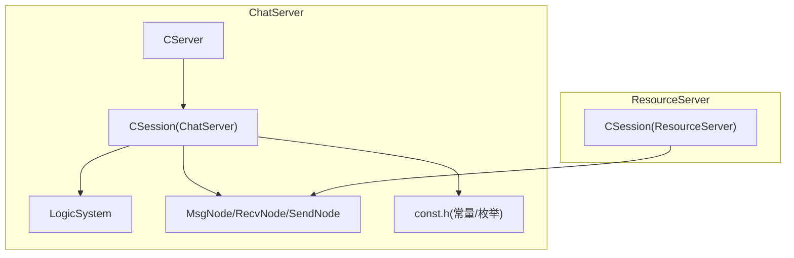
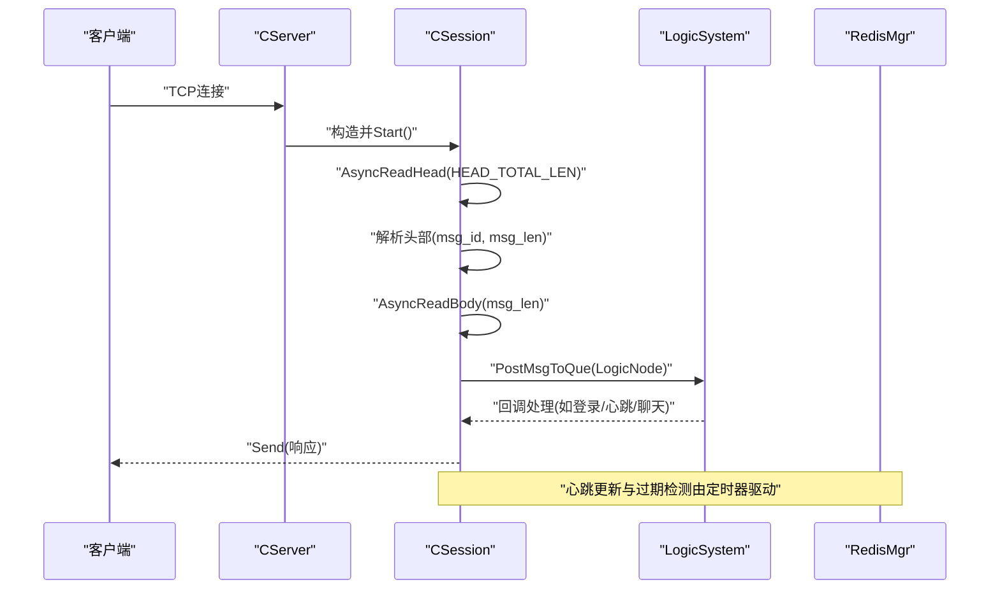
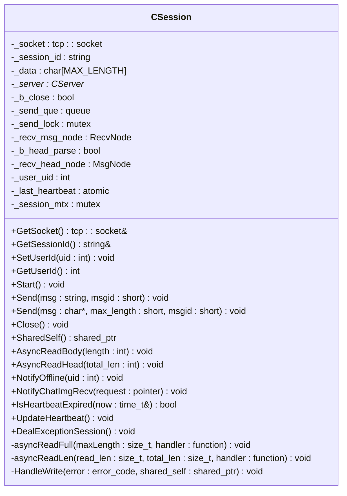
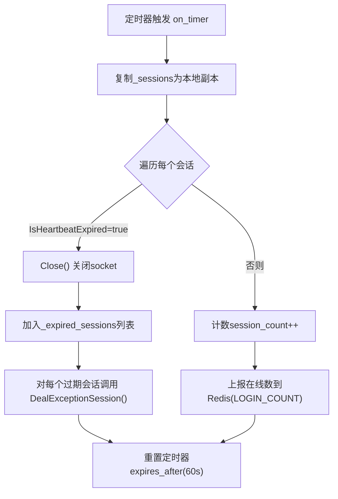
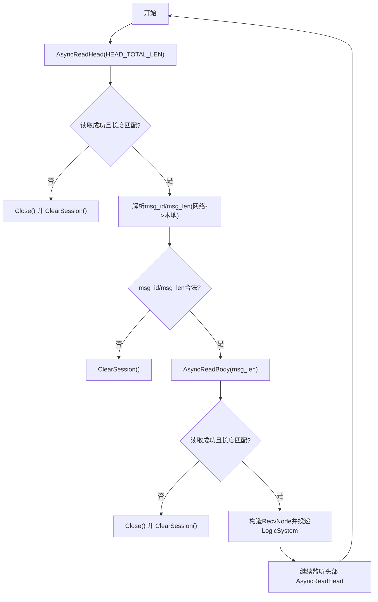
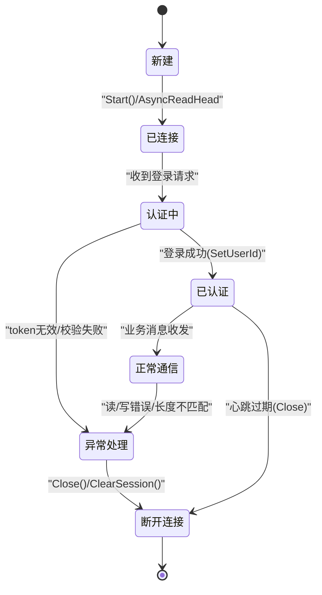
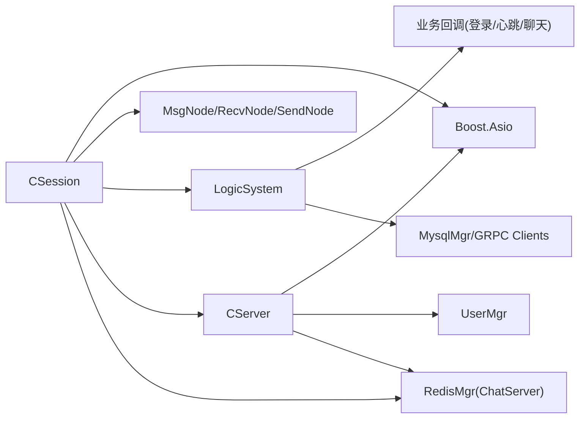

# 会话生命周期管理

<cite>
**本文引用的文件**   
- [server/ChatServer/include/CSession.h](file://server/ChatServer/include/CSession.h)
- [server/ChatServer/src/CSession.cpp](file://server/ChatServer/src/CSession.cpp)
- [server/ChatServer/include/CServer.h](file://server/ChatServer/include/CServer.h)
- [server/ChatServer/src/CServer.cpp](file://server/ChatServer/src/CServer.cpp)
- [server/ChatServer/include/const.h](file://server/ChatServer/include/const.h)
- [server/ChatServer/include/MsgNode.h](file://server/ChatServer/include/MsgNode.h)
- [server/ChatServer/include/LogicSystem.h](file://server/ChatServer/include/LogicSystem.h)
- [server/ChatServer/src/LogicSystem.cpp](file://server/ChatServer/src/LogicSystem.cpp)
- [server/ResourceServer/include/CSession.h](file://server/ResourceServer/include/CSession.h)
- [server/ResourceServer/src/CSession.cpp](file://server/ResourceServer/src/CSession.cpp)
</cite>

## 目录
1. [简介](#简介)
2. [项目结构](#项目结构)
3. [核心组件](#核心组件)
4. [架构总览](#架构总览)
5. [详细组件分析](#详细组件分析)
6. [依赖关系分析](#依赖关系分析)
7. [性能考量](#性能考量)
8. [故障排查指南](#故障排查指南)
9. [结论](#结论)
10. [附录](#附录)

## 简介
本文件围绕 CSession 类的会话生命周期管理进行系统化说明，覆盖连接建立（Start）、认证验证、正常运行与优雅关闭全流程；梳理状态转换机制（新建、已连接、认证中、已认证、异常处理、断开连接）；详述初始化资源分配（socket绑定、内存分配、线程池注册）与销毁清理流程（资源释放、连接关闭、内存回收）；并给出超时检测、异常恢复与错误处理策略，以及监控指标与调试技巧。

## 项目结构
CSession 在 ChatServer 与 ResourceServer 两个服务中均有实现，二者均基于 Boost.Asio 的异步 I/O 模型，采用“头部+负载”的自定义协议解析，并通过 LogicSystem 将消息投递到逻辑线程队列进行处理。CServer 负责监听端口、接受连接、维护会话表、定时心跳检测与过期清理。

图表来源
- [server/ChatServer/include/CServer.h](file://server/ChatServer/include/CServer.h)
- [server/ChatServer/src/CServer.cpp](file://server/ChatServer/src/CServer.cpp)
- [server/ChatServer/include/CSession.h](file://server/ChatServer/include/CSession.h)
- [server/ChatServer/src/CSession.cpp](file://server/ChatServer/src/CSession.cpp)
- [server/ChatServer/include/LogicSystem.h](file://server/ChatServer/include/LogicSystem.h)
- [server/ChatServer/include/MsgNode.h](file://server/ChatServer/include/MsgNode.h)
- [server/ChatServer/include/const.h](file://server/ChatServer/include/const.h)
- [server/ResourceServer/include/CSession.h](file://server/ResourceServer/include/CSession.h)
- [server/ResourceServer/src/CSession.cpp](file://server/ResourceServer/src/CSession.cpp)

章节来源
- [server/ChatServer/include/CServer.h](file://server/ChatServer/include/CServer.h)
- [server/ChatServer/src/CServer.cpp](file://server/ChatServer/src/CServer.cpp)
- [server/ChatServer/include/CSession.h](file://server/ChatServer/include/CSession.h)
- [server/ChatServer/src/CSession.cpp](file://server/ChatServer/src/CSession.cpp)
- [server/ChatServer/include/LogicSystem.h](file://server/ChatServer/include/LogicSystem.h)
- [server/ChatServer/include/MsgNode.h](file://server/ChatServer/include/MsgNode.h)
- [server/ChatServer/include/const.h](file://server/ChatServer/include/const.h)
- [server/ResourceServer/include/CSession.h](file://server/ResourceServer/include/CSession.h)
- [server/ResourceServer/src/CSession.cpp](file://server/ResourceServer/src/CSession.cpp)

## 核心组件
- CSession：封装单个 TCP 连接的读写、发送队列、心跳时间戳、会话ID、用户UID等，提供 Start、Send、Close、AsyncReadHead/Body、UpdateHeartbeat、IsHeartbeatExpired、DealExceptionSession 等方法。
- CServer：监听端口、Accept 新连接、维护 _sessions 映射、CheckValid、ClearSession、定时器 on_timer 周期扫描心跳过期并触发异常处理。
- LogicSystem：单例逻辑系统，持有消息队列与消费者线程，按 msg_id 分发回调处理业务（登录、心跳、聊天等）。
- MsgNode/RecvNode/SendNode：消息节点基类与收发节点，用于缓冲头部与负载数据。
- const.h：定义协议头长度、最大长度、消息ID枚举、Redis键前缀、分布式锁参数等。

章节来源
- [server/ChatServer/include/CSession.h](file://server/ChatServer/include/CSession.h)
- [server/ChatServer/src/CSession.cpp](file://server/ChatServer/src/CSession.cpp)
- [server/ChatServer/include/CServer.h](file://server/ChatServer/include/CServer.h)
- [server/ChatServer/src/CServer.cpp](file://server/ChatServer/src/CServer.cpp)
- [server/ChatServer/include/LogicSystem.h](file://server/ChatServer/include/LogicSystem.h)
- [server/ChatServer/include/MsgNode.h](file://server/ChatServer/include/MsgNode.h)
- [server/ChatServer/include/const.h](file://server/ChatServer/include/const.h)

## 架构总览
下图展示从客户端连接到会话处理的端到端流程，包括 Accept、Start、读头/体、逻辑处理、写回与心跳检测。

图表来源
- [server/ChatServer/src/CServer.cpp](file://server/ChatServer/src/CServer.cpp)
- [server/ChatServer/src/CSession.cpp](file://server/ChatServer/src/CSession.cpp)
- [server/ChatServer/include/LogicSystem.h](file://server/ChatServer/include/LogicSystem.h)
- [server/ChatServer/src/LogicSystem.cpp](file://server/ChatServer/src/LogicSystem.cpp)

## 详细组件分析

### CSession 类结构与职责
- 成员变量
  - _socket：Boost.Asio TCP socket
  - _session_id：唯一会话标识（UUID）
  - _data：接收缓冲区
  - _send_que/_send_lock：发送队列与互斥锁
  - _recv_msg_node/_recv_head_node：接收负载与头部节点
  - _user_uid：当前用户UID
  - _last_heartbeat：原子时间戳，记录最近一次收到数据的时间
  - _session_mtx：会话级锁（用于 Close 等关键路径）
- 关键方法
  - Start：启动读取流程（先读头部）
  - AsyncReadHead/AsyncReadBody：非阻塞读取头部与负载，校验长度与合法性，投递到 LogicSystem
  - Send：带队列的异步写入，避免并发写冲突
  - Close：关闭 socket，标记关闭状态
  - UpdateHeartbeat/IsHeartbeatExpired：心跳更新与过期判断
  - DealExceptionSession：异常会话清理（含分布式锁、Redis清理）

图表来源
- [server/ChatServer/include/CSession.h](file://server/ChatServer/include/CSession.h)
- [server/ChatServer/src/CSession.cpp](file://server/ChatServer/src/CSession.cpp)

章节来源
- [server/ChatServer/include/CSession.h](file://server/ChatServer/include/CSession.h)
- [server/ChatServer/src/CSession.cpp](file://server/ChatServer/src/CSession.cpp)

### CServer 与会话表管理
- 监听与接受：StartAccept 使用 AsioIOServicePool 获取 io_context，创建 CSession 并调用 HandleAccept，成功后插入 _sessions 映射。
- 会话清理：ClearSession 移除 _sessions 中的条目，并调用 UserMgr 解除 uid-session 关联。
- 有效性检查：CheckValid 根据 session_id 判断是否仍在活跃表中。
- 心跳定时器：on_timer 每60秒遍历会话副本，调用 IsHeartbeatExpired 判断是否过期，过期则 Close 并收集后统一调用 DealExceptionSession；同时统计在线数上报 Redis。

图表来源
- [server/ChatServer/src/CServer.cpp](file://server/ChatServer/src/CServer.cpp)
- [server/ChatServer/include/CSession.h](file://server/ChatServer/include/CSession.h)

章节来源
- [server/ChatServer/src/CServer.cpp](file://server/ChatServer/src/CServer.cpp)
- [server/ChatServer/include/CServer.h](file://server/ChatServer/include/CServer.h)

### 协议解析与消息路由
- 头部格式：固定 HEAD_TOTAL_LEN=4，包含 HEAD_ID_LEN=2 的 msg_id 与 HEAD_DATA_LEN=2 的 msg_len（网络字节序转本地）。
- 读取流程：AsyncReadHead 读取头部，校验 msg_id/msg_len 合法后构造 RecvNode，再调用 AsyncReadBody 读取负载。
- 路由：将 LogicNode(session, recvnode) 投递到 LogicSystem 队列，由消费者线程按 msg_id 分发给对应回调（登录、心跳、聊天等）。

图表来源
- [server/ChatServer/src/CSession.cpp](file://server/ChatServer/src/CSession.cpp)
- [server/ChatServer/include/const.h](file://server/ChatServer/include/const.h)
- [server/ChatServer/include/MsgNode.h](file://server/ChatServer/include/MsgNode.h)

章节来源
- [server/ChatServer/src/CSession.cpp](file://server/ChatServer/src/CSession.cpp)
- [server/ChatServer/include/const.h](file://server/ChatServer/include/const.h)
- [server/ChatServer/include/MsgNode.h](file://server/ChatServer/include/MsgNode.h)

### 认证与状态机
- 初始状态：新建（构造时生成 _session_id，初始化 _last_heartbeat）
- 已连接：Start 后进入读头阶段
- 认证中：收到登录请求后，LogicSystem.LoginHandler 校验 token 与用户信息，返回登录结果
- 已认证：登录成功后，服务端可设置 _user_uid（通过 SetUserId），后续业务按已认证处理
- 异常处理：读/写错误或非法长度触发 Close 与 DealExceptionSession
- 断开连接：Close 关闭 socket，定时器检测到心跳过期也会触发 Close

图表来源
- [server/ChatServer/src/CSession.cpp](file://server/ChatServer/src/CSession.cpp)
- [server/ChatServer/src/LogicSystem.cpp](file://server/ChatServer/src/LogicSystem.cpp)
- [server/ChatServer/src/CServer.cpp](file://server/ChatServer/src/CServer.cpp)

章节来源
- [server/ChatServer/src/CSession.cpp](file://server/ChatServer/src/CSession.cpp)
- [server/ChatServer/src/LogicSystem.cpp](file://server/ChatServer/src/LogicSystem.cpp)
- [server/ChatServer/src/CServer.cpp](file://server/ChatServer/src/CServer.cpp)

### 资源分配与销毁
- 初始化分配
  - socket：由 CSession 构造函数传入 io_context 构造
  - 内存：_data 缓冲区、_recv_head_node、_recv_msg_node、发送队列节点
  - 线程池：LogicSystem 启动独立工作线程消费消息队列
- 销毁清理
  - Close：关闭 socket，置 _b_close
  - ClearSession：从 _sessions 移除，并调用 UserMgr 解绑 uid-session
  - DealExceptionSession：加分布式锁，校验异地登录，删除 Redis 中的 session/ip/token 相关键
  - 析构：打印日志（实际资源由智能指针与 socket 关闭释放）

章节来源
- [server/ChatServer/src/CSession.cpp](file://server/ChatServer/src/CSession.cpp)
- [server/ChatServer/src/CServer.cpp](file://server/ChatServer/src/CServer.cpp)
- [server/ChatServer/include/LogicSystem.h](file://server/ChatServer/include/LogicSystem.h)

### 心跳与超时检测
- 心跳更新：每次成功读取数据（头部或负载）后调用 UpdateHeartbeat 刷新 _last_heartbeat
- 过期判定：IsHeartbeatExpired 比较当前时间与 _last_heartbeat，超过阈值（代码示例为20秒）即认为过期
- 定时器驱动：CServer::on_timer 周期性扫描，对过期会话执行 Close 与 DealExceptionSession

章节来源
- [server/ChatServer/src/CSession.cpp](file://server/ChatServer/src/CSession.cpp)
- [server/ChatServer/src/CServer.cpp](file://server/ChatServer/src/CServer.cpp)

### 异常恢复与错误处理
- 读错误：AsyncReadHead/AsyncReadBody 回调中捕获 ec，Close 并 DealExceptionSession（ChatServer）或 ClearSession（ResourceServer）
- 长度不匹配：记录日志，Close 并清理会话
- 写错误：HandleWrite 中捕获 error，Close 并 DealExceptionSession/ClearSession
- 非法 msg_id/msg_len：直接 ClearSession
- 分布式锁保护：DealExceptionSession 使用 Redis 分布式锁确保多进程安全清理

章节来源
- [server/ChatServer/src/CSession.cpp](file://server/ChatServer/src/CSession.cpp)
- [server/ResourceServer/src/CSession.cpp](file://server/ResourceServer/src/CSession.cpp)
- [server/ChatServer/include/const.h](file://server/ChatServer/include/const.h)

### 监控指标与调试技巧
- 监控指标
  - 在线会话数：CServer::on_timer 统计 session_count 并写入 Redis 的 LOGIN_COUNT
  - 发送队列长度：Send 中记录 MAX_SENDQUE 溢出日志
  - 心跳过期：IsHeartbeatExpired 输出会话ID
- 调试技巧
  - 启用详细日志：读/写错误、长度不匹配、msg_id/msg_len 解析、登录校验过程
  - 观察定时器行为：确认 on_timer 间隔与过期清理顺序
  - 检查 Redis 键：USER_SESSION_PREFIX、USERIPPREFIX、USERTOKENPREFIX 的增删情况

章节来源
- [server/ChatServer/src/CServer.cpp](file://server/ChatServer/src/CServer.cpp)
- [server/ChatServer/src/CSession.cpp](file://server/ChatServer/src/CSession.cpp)
- [server/ChatServer/include/const.h](file://server/ChatServer/include/const.h)

## 依赖关系分析
- CSession 依赖
  - Boost.Asio：tcp::socket、async_read_some、async_write
  - MsgNode/RecvNode/SendNode：消息缓冲
  - LogicSystem：消息投递与回调分发
  - CServer：会话有效性检查与清理接口
  - RedisMgr：分布式锁与键值操作（ChatServer 版本）
- CServer 依赖
  - AsioIOServicePool：获取 io_context
  - UserMgr：uid-session 关联管理
  - RedisMgr：在线数上报
- LogicSystem 依赖
  - 各业务回调（登录、心跳、聊天等）
  - MysqlMgr/StatusGrpcClient/ChatGrpcClient：持久化与跨服务通信（由回调内部使用）

图表来源
- [server/ChatServer/src/CSession.cpp](file://server/ChatServer/src/CSession.cpp)
- [server/ChatServer/src/CServer.cpp](file://server/ChatServer/src/CServer.cpp)
- [server/ChatServer/include/LogicSystem.h](file://server/ChatServer/include/LogicSystem.h)
- [server/ChatServer/include/MsgNode.h](file://server/ChatServer/include/MsgNode.h)

章节来源
- [server/ChatServer/src/CSession.cpp](file://server/ChatServer/src/CSession.cpp)
- [server/ChatServer/src/CServer.cpp](file://server/ChatServer/src/CServer.cpp)
- [server/ChatServer/include/LogicSystem.h](file://server/ChatServer/include/LogicSystem.h)
- [server/ChatServer/include/MsgNode.h](file://server/ChatServer/include/MsgNode.h)

## 性能考量
- 异步I/O：全部读写基于 async_read_some/async_write，避免阻塞
- 发送队列：限制 MAX_SENDQUE，防止内存膨胀；串行出队减少竞争
- 心跳检测：定时器批量扫描，避免逐会话轮询开销
- 逻辑解耦：I/O 线程仅做协议解析与投递，业务逻辑在独立线程处理
- 资源复用：MsgNode/RecvNode/SendNode 按需分配，析构自动释放

[本节为通用指导，不直接分析具体文件]

## 故障排查指南
- 常见问题定位
  - 连接中断：查看 read/write 错误日志与 Close 调用点
  - 粘包/半包：检查 AsyncReadHead/AsyncReadBody 的长度校验与循环读取逻辑
  - 登录失败：核对 Redis token 键是否存在及值匹配
  - 心跳过期：确认客户端是否定期发送心跳，服务端定时器是否运行
- 排查步骤
  - 打开详细日志：读/写错误、长度不匹配、msg_id/msg_len 解析
  - 检查 Redis：USER_SESSION_PREFIX、USERIPPREFIX、USERTOKENPREFIX 的键值变化
  - 观察定时器：on_timer 是否周期性触发，过期会话是否被清理
  - 监控指标：LOGIN_COUNT 在线数是否与预期一致

章节来源
- [server/ChatServer/src/CSession.cpp](file://server/ChatServer/src/CSession.cpp)
- [server/ChatServer/src/CServer.cpp](file://server/ChatServer/src/CServer.cpp)
- [server/ChatServer/include/const.h](file://server/ChatServer/include/const.h)

## 结论
CSession 以异步 I/O 为核心，结合严格的协议解析、健壮的错误处理与分布式锁保护的异常清理，实现了高可靠、可扩展的会话生命周期管理。配合 CServer 的心跳定时器与 LogicSystem 的消息路由，形成清晰的职责边界与良好的扩展性。建议在生产环境开启详细日志与监控指标，持续优化心跳阈值与队列上限，保障稳定性与性能。

[本节为总结，不直接分析具体文件]

## 附录
- 协议常量参考
  - HEAD_TOTAL_LEN=4、HEAD_ID_LEN=2、HEAD_DATA_LEN=2、MAX_LENGTH=2048、MAX_SENDQUE=1000
- 关键消息ID
  - MSG_CHAT_LOGIN/MSG_CHAT_LOGIN_RSP、ID_HEART_BEAT_REQ/ID_HEARTBEAT_RSP、各类聊天消息ID
- 分布式锁参数
  - LOCK_TIME_OUT=10、ACQUIRE_TIME_OUT=5

章节来源
- [server/ChatServer/include/const.h](file://server/ChatServer/include/const.h)