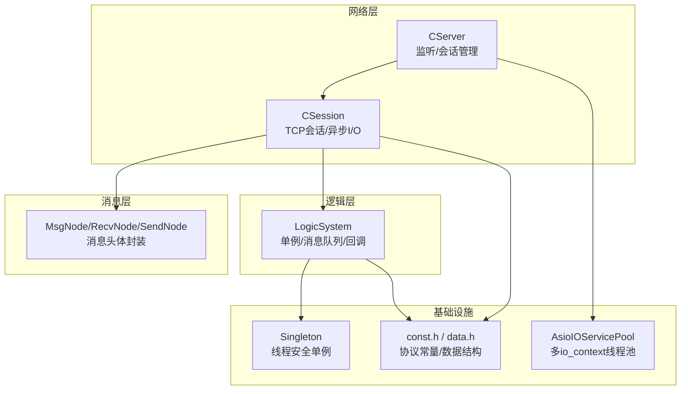
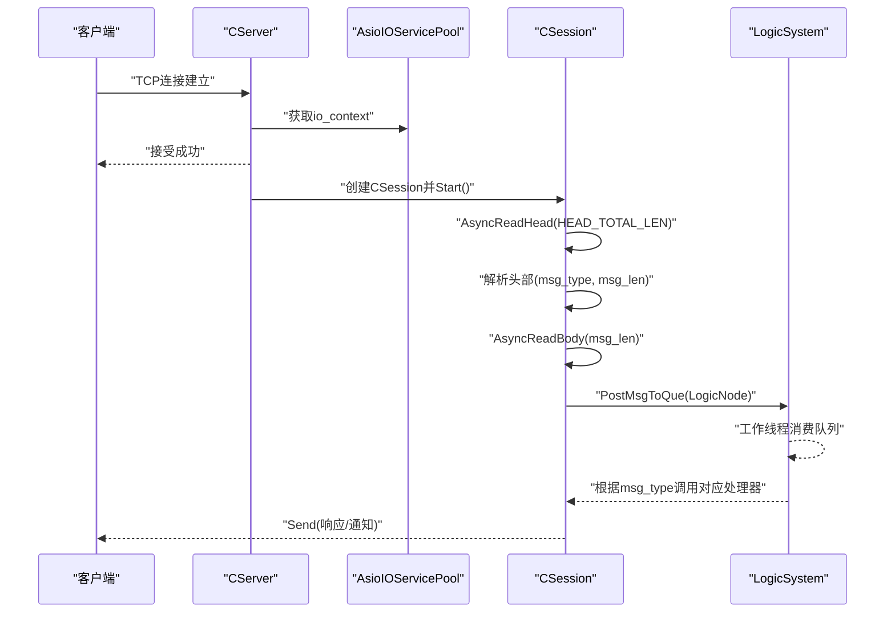
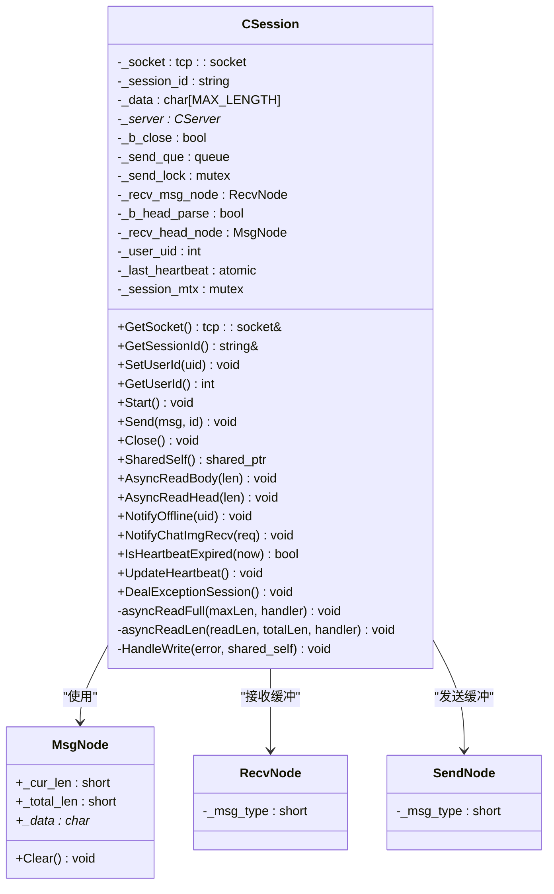
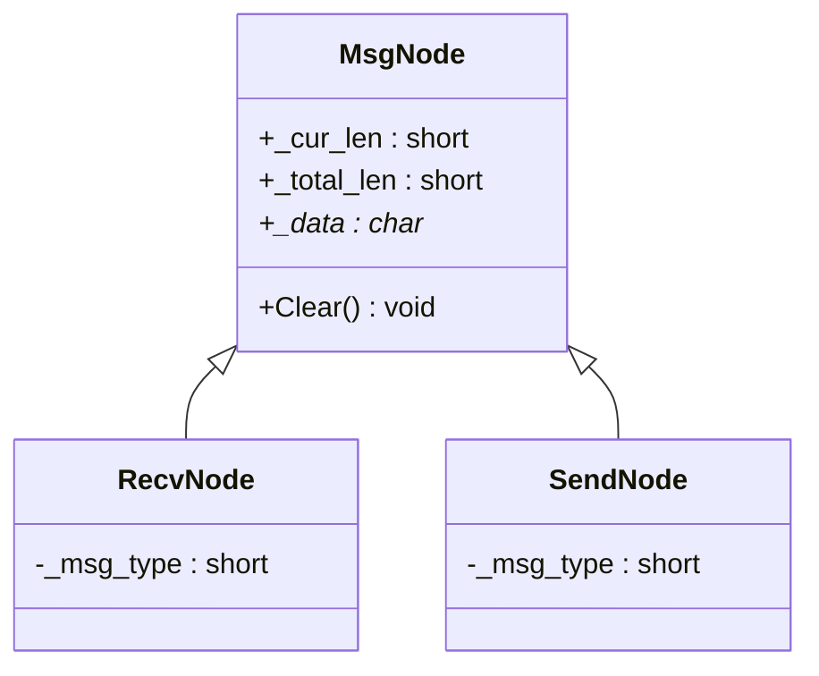
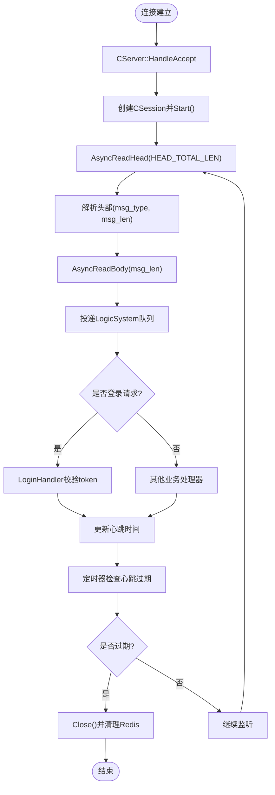
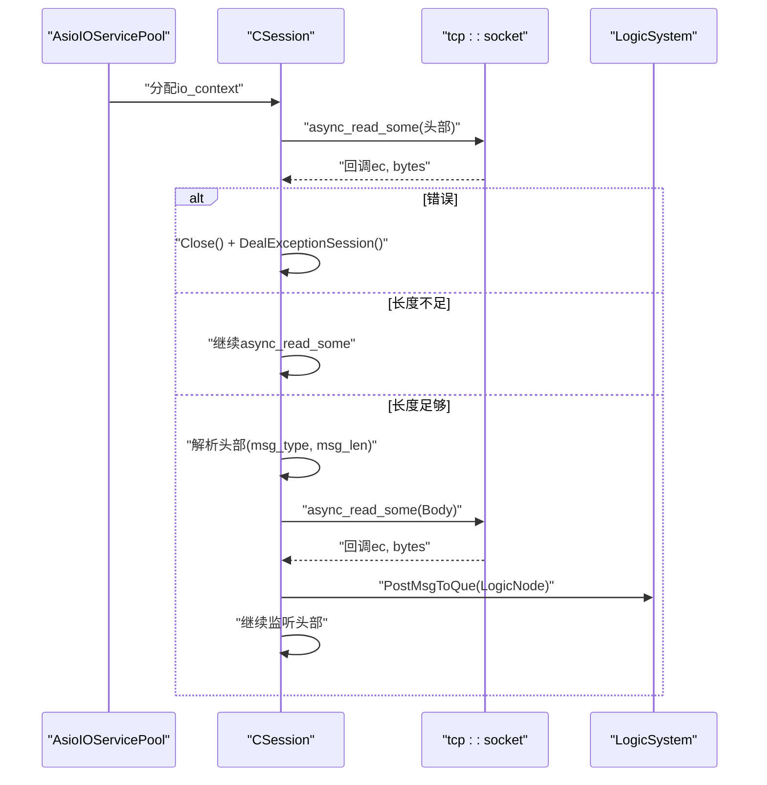
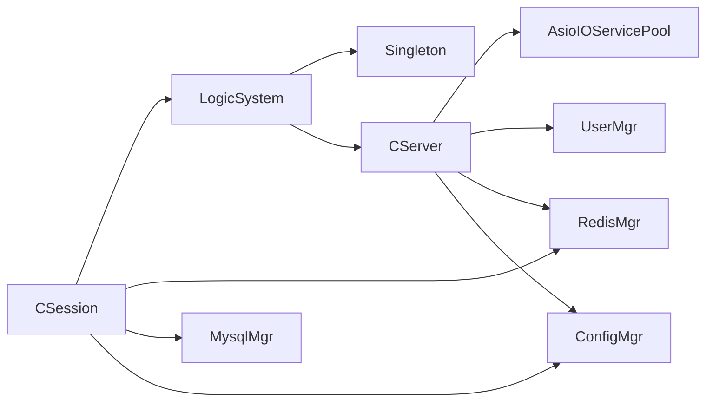

# 会话管理

<cite>
**本文引用的文件**   
- [CSession.h](file://server/ChatServer/include/CSession.h)
- [CSession.cpp](file://server/ChatServer/src/CSession.cpp)
- [MsgNode.h](file://server/ChatServer/include/MsgNode.h)
- [MsgNode.cpp](file://server/ChatServer/src/MsgNode.cpp)
- [CServer.h](file://server/ChatServer/include/CServer.h)
- [CServer.cpp](file://server/ChatServer/src/CServer.cpp)
- [LogicSystem.h](file://server/ChatServer/include/LogicSystem.h)
- [LogicSystem.cpp](file://server/ChatServer/src/LogicSystem.cpp)
- [Singleton.h](file://server/ChatServer/include/Singleton.h)
- [AsioIOServicePool.h](file://server/ChatServer/include/AsioIOServicePool.h)
- [AsioIOServicePool.cpp](file://server/ChatServer/src/AsioIOServicePool.cpp)
- [const.h](file://server/ChatServer/include/const.h)
- [data.h](file://server/ChatServer/include/data.h)
</cite>

## 目录
1. [简介](#简介)
2. [项目结构](#项目结构)
3. [核心组件](#核心组件)
4. [架构总览](#架构总览)
5. [详细组件分析](#详细组件分析)
6. [依赖关系分析](#依赖关系分析)
7. [性能考量与优化](#性能考量与优化)
8. [故障排查指南](#故障排查指南)
9. [结论](#结论)
10. [附录](#附录)

## 简介
本文件面向 ChatServer 的会话管理系统，围绕 CSession 类的设计模式、智能指针与内存安全、会话生命周期（连接建立、认证、心跳、断开）、消息节点 MsgNode 的数据结构与缓冲区管理、异步 I/O 处理机制（读写回调、错误处理、超时控制）、会话状态同步、数据持久化与故障恢复策略，以及性能优化技巧（零拷贝、内存池、批量处理）进行系统化说明。文档以代码级为依据，提供可视化图示与可追溯的来源标注，帮助读者快速理解并高效扩展。

## 项目结构
ChatServer 的核心会话相关代码位于 server/ChatServer 模块中，关键文件包括：
- 网络会话层：CSession（会话对象）、CServer（服务器监听与会话管理）
- 消息封装：MsgNode/RecvNode/SendNode（消息头体封装）
- 逻辑调度：LogicSystem（单例、消息队列、回调分发）
- I/O 线程池：AsioIOServicePool（多 io_context + 工作线程）
- 常量与数据结构：const.h、data.h
- 单例模板：Singleton.h

图表来源
- [CServer.h:1-39](file://server/ChatServer/include/CServer.h#L1-L39)
- [CSession.h:1-86](file://server/ChatServer/include/CSession.h#L1-L86)
- [MsgNode.h:1-48](file://server/ChatServer/include/MsgNode.h#L1-L48)
- [LogicSystem.h:1-60](file://server/ChatServer/include/LogicSystem.h#L1-L60)
- [AsioIOServicePool.h:1-28](file://server/ChatServer/include/AsioIOServicePool.h#L1-L28)
- [Singleton.h:1-33](file://server/ChatServer/include/Singleton.h#L1-L33)
- [const.h:1-104](file://server/ChatServer/include/const.h#L1-L104)
- [data.h:1-65](file://server/ChatServer/include/data.h#L1-L65)

章节来源
- [CServer.h:1-39](file://server/ChatServer/include/CServer.h#L1-L39)
- [CSession.h:1-86](file://server/ChatServer/include/CSession.h#L1-L86)
- [MsgNode.h:1-48](file://server/ChatServer/include/MsgNode.h#L1-L48)
- [LogicSystem.h:1-60](file://server/ChatServer/include/LogicSystem.h#L1-L60)
- [AsioIOServicePool.h:1-28](file://server/ChatServer/include/AsioIOServicePool.h#L1-L28)
- [Singleton.h:1-33](file://server/ChatServer/include/Singleton.h#L1-L33)
- [const.h:1-104](file://server/ChatServer/include/const.h#L1-L104)
- [data.h:1-65](file://server/ChatServer/include/data.h#L1-L65)

## 核心组件
- CSession：基于 boost::asio 的 TCP 会话，负责非阻塞读/写、消息解析、心跳维护、异常清理与对外发送接口。使用 std::enable_shared_from_this 保证跨回调的生命周期安全。
- CServer：监听端口、接受连接、维护活跃会话映射、定时心跳检测与过期清理。
- MsgNode/RecvNode/SendNode：消息头体封装，统一头部长度与类型，支持网络字节序转换与缓冲复用。
- LogicSystem：单例逻辑调度器，内部维护消息队列与工作线程，按消息类型分发给具体处理器。
- AsioIOServicePool：多 io_context 线程池，轮询分配，提升并发处理能力。
- Singleton<T>：线程安全的共享指针单例模板。

章节来源
- [CSession.h:28-76](file://server/ChatServer/include/CSession.h#L28-L76)
- [CServer.h:10-37](file://server/ChatServer/include/CServer.h#L10-L37)
- [MsgNode.h:9-46](file://server/ChatServer/include/MsgNode.h#L9-L46)
- [LogicSystem.h:17-58](file://server/ChatServer/include/LogicSystem.h#L17-L58)
- [AsioIOServicePool.h:8-27](file://server/ChatServer/include/AsioIOServicePool.h#L8-L27)
- [Singleton.h:6-32](file://server/ChatServer/include/Singleton.h#L6-L32)

## 架构总览
整体采用“网络层-消息层-逻辑层”分层架构，配合多 io_context 线程池与单例调度器，实现高并发、低耦合的会话管理。

图表来源
- [CServer.cpp:21-38](file://server/ChatServer/src/CServer.cpp#L21-L38)
- [CSession.cpp:39-41](file://server/ChatServer/src/CSession.cpp#L39-L41)
- [CSession.cpp:130-191](file://server/ChatServer/src/CSession.cpp#L130-L191)
- [CSession.cpp:87-128](file://server/ChatServer/src/CSession.cpp#L87-L128)
- [LogicSystem.cpp:27-81](file://server/ChatServer/src/LogicSystem.cpp#L27-L81)

## 详细组件分析

### CSession 设计与内存安全
- 设计模式
  - 单例模式：通过 Singleton<T> 被其他组件引用（如 RedisMgr、ConfigMgr、UserMgr），但 CSession 本身不是单例，每个连接一个实例。
  - 智能指针管理：继承 std::enable_shared_from_this，所有回调持有 shared_ptr，避免悬空指针；构造时生成唯一 session_id。
  - RAII 资源管理：析构输出日志，Close() 关闭 socket 并设置标志位；DealExceptionSession() 使用 Defer 确保锁释放与清理执行。
- 异步 I/O
  - 读取流程：AsyncReadHead -> 解析头部 -> AsyncReadBody -> 投递到 LogicSystem -> 继续监听。
  - 写入流程：Send() 入队 _send_que，若队列为空则立即 async_write；HandleWrite 成功后弹出并继续发送下一条。
  - 错误处理：read/write 错误均触发 Close() 与 DealExceptionSession()，防止资源泄漏。
- 心跳与超时
  - 每次接收数据更新 _last_heartbeat；IsHeartbeatExpired 判断是否超过阈值（默认20秒）。
  - CServer 定时器周期性扫描会话，关闭过期会话并触发异常清理。
- 并发与锁
  - 发送队列加 _send_lock，会话清理加 _session_mtx；分布式锁用于异地登录冲突处理。

图表来源
- [CSession.h:28-76](file://server/ChatServer/include/CSession.h#L28-L76)
- [MsgNode.h:9-46](file://server/ChatServer/include/MsgNode.h#L9-L46)

章节来源
- [CSession.h:28-76](file://server/ChatServer/include/CSession.h#L28-L76)
- [CSession.cpp:10-16](file://server/ChatServer/src/CSession.cpp#L10-L16)
- [CSession.cpp:39-41](file://server/ChatServer/src/CSession.cpp#L39-L41)
- [CSession.cpp:43-75](file://server/ChatServer/src/CSession.cpp#L43-L75)
- [CSession.cpp:87-128](file://server/ChatServer/src/CSession.cpp#L87-L128)
- [CSession.cpp:130-191](file://server/ChatServer/src/CSession.cpp#L130-L191)
- [CSession.cpp:193-217](file://server/ChatServer/src/CSession.cpp#L193-L217)
- [CSession.cpp:220-248](file://server/ChatServer/src/CSession.cpp#L220-L248)
- [CSession.cpp:285-299](file://server/ChatServer/src/CSession.cpp#L285-L299)
- [CSession.cpp:301-333](file://server/ChatServer/src/CSession.cpp#L301-L333)

### 消息节点 MsgNode 数据结构与内存优化
- 结构设计
  - MsgNode：通用缓冲基类，包含 _cur_len、_total_len、_data，构造函数分配动态数组并置零，析构释放内存。
  - RecvNode：继承 MsgNode，增加 _msg_type，用于接收消息。
  - SendNode：继承 MsgNode，在构造时将 msg_type 和长度转为网络字节序并拼接头部，便于直接发送。
- 缓冲区管理
  - 固定大小 MAX_LENGTH，减少频繁分配；发送前组装完整帧（头+体），降低系统调用次数。
  - 使用 memcpy 与网络字节序转换，避免额外拷贝。
- 内存优化建议
  - 引入内存池复用 MsgNode 实例，减少 new/delete 开销。
  - 对大消息启用分段传输或流式处理，避免单次分配过大内存。

图表来源
- [MsgNode.h:9-46](file://server/ChatServer/include/MsgNode.h#L9-L46)
- [MsgNode.cpp:1-18](file://server/ChatServer/src/MsgNode.cpp#L1-L18)

章节来源
- [MsgNode.h:1-48](file://server/ChatServer/include/MsgNode.h#L1-L48)
- [MsgNode.cpp:1-18](file://server/ChatServer/src/MsgNode.cpp#L1-L18)

### 会话生命周期管理
- 连接建立
  - CServer 启动监听，Accept 后创建 CSession 并调用 Start()，进入异步读头部流程。
- 认证验证
  - 逻辑层 LoginHandler 校验 token，从 Redis 获取用户信息，返回登录结果。
- 心跳检测
  - 每次接收数据更新心跳时间；定时器每秒检查一次，超过阈值关闭会话并清理。
- 连接断开
  - 异常或主动 Close() 触发 DealExceptionSession()，清理 Redis 中的会话、IP、Token 等键。

图表来源
- [CServer.cpp:21-38](file://server/ChatServer/src/CServer.cpp#L21-L38)
- [CSession.cpp:39-41](file://server/ChatServer/src/CSession.cpp#L39-L41)
- [CSession.cpp:130-191](file://server/ChatServer/src/CSession.cpp#L130-L191)
- [CSession.cpp:87-128](file://server/ChatServer/src/CSession.cpp#L87-L128)
- [CServer.cpp:75-118](file://server/ChatServer/src/CServer.cpp#L75-L118)
- [LogicSystem.cpp:116-200](file://server/ChatServer/src/LogicSystem.cpp#L116-L200)

章节来源
- [CServer.cpp:21-38](file://server/ChatServer/src/CServer.cpp#L21-L38)
- [CSession.cpp:39-41](file://server/ChatServer/src/CSession.cpp#L39-L41)
- [CSession.cpp:130-191](file://server/ChatServer/src/CSession.cpp#L130-L191)
- [CSession.cpp:87-128](file://server/ChatServer/src/CSession.cpp#L87-L128)
- [CServer.cpp:75-118](file://server/ChatServer/src/CServer.cpp#L75-L118)
- [LogicSystem.cpp:116-200](file://server/ChatServer/src/LogicSystem.cpp#L116-L200)

### 异步 I/O 处理机制
- 读回调
  - asyncReadFull/asyncReadLen 递归读取指定长度，错误时回调 handler 并关闭会话。
  - AsyncReadHead 解析头部，校验 msg_type/msg_len，分配 RecvNode 并继续读取 Body。
- 写回调
  - HandleWrite 成功则弹出队列并继续发送下一条；失败则关闭会话并清理。
- 错误处理
  - 所有异常路径均调用 Close() 与 DealExceptionSession()，确保资源释放与状态一致。
- 超时控制
  - 心跳超时由 CServer 定时器驱动，超过阈值关闭会话；也可结合 asio::deadline_timer 实现更细粒度超时。

图表来源
- [CSession.cpp:220-248](file://server/ChatServer/src/CSession.cpp#L220-L248)
- [CSession.cpp:130-191](file://server/ChatServer/src/CSession.cpp#L130-L191)
- [CSession.cpp:87-128](file://server/ChatServer/src/CSession.cpp#L87-L128)
- [AsioIOServicePool.cpp:22-28](file://server/ChatServer/src/AsioIOServicePool.cpp#L22-L28)

章节来源
- [CSession.cpp:220-248](file://server/ChatServer/src/CSession.cpp#L220-L248)
- [CSession.cpp:130-191](file://server/ChatServer/src/CSession.cpp#L130-L191)
- [CSession.cpp:87-128](file://server/ChatServer/src/CSession.cpp#L87-L128)
- [AsioIOServicePool.cpp:22-28](file://server/ChatServer/src/AsioIOServicePool.cpp#L22-L28)

### 会话状态同步、数据持久化与故障恢复
- 状态同步
  - Redis 存储用户会话映射（usession_）、IP（uip_）、Token（utoken_）；登录时校验 token，下线时清理。
  - 分布式锁（lock_）防止异地登录冲突，确保同一用户只在一个会话有效。
- 数据持久化
  - 聊天消息、好友申请、用户信息等通过 MysqlMgr/RedisMgr 存取；LogicSystem 中查询并返回给客户端。
- 故障恢复
  - 异常连接触发 DealExceptionSession()，清理 Redis 键并移除会话映射；定时器定期清理过期会话。
  - 使用 Defer 确保锁释放与清理逻辑一定执行，避免死锁与资源泄漏。

章节来源
- [CSession.cpp:301-333](file://server/ChatServer/src/CSession.cpp#L301-L333)
- [CServer.cpp:41-53](file://server/ChatServer/src/CServer.cpp#L41-L53)
- [LogicSystem.cpp:116-200](file://server/ChatServer/src/LogicSystem.cpp#L116-L200)
- [const.h:81-94](file://server/ChatServer/include/const.h#L81-L94)

## 依赖关系分析
- CSession 依赖：boost::asio、boost::beast、grpcpp、nlohmann/json、RedisMgr、MysqlMgr、ConfigMgr、LogicSystem。
- CServer 依赖：AsioIOServicePool、UserMgr、RedisMgr、ConfigMgr。
- LogicSystem 依赖：Singleton、std::thread、queue、mutex、condition_variable、各业务处理器。
- 无循环依赖：CSession -> LogicSystem -> CServer（仅 SetServer 注入），单向清晰。

图表来源
- [CSession.cpp:1-9](file://server/ChatServer/src/CSession.cpp#L1-L9)
- [CServer.cpp:1-7](file://server/ChatServer/src/CServer.cpp#L1-L7)
- [LogicSystem.cpp:1-12](file://server/ChatServer/src/LogicSystem.cpp#L1-L12)

章节来源
- [CSession.cpp:1-9](file://server/ChatServer/src/CSession.cpp#L1-L9)
- [CServer.cpp:1-7](file://server/ChatServer/src/CServer.cpp#L1-L7)
- [LogicSystem.cpp:1-12](file://server/ChatServer/src/LogicSystem.cpp#L1-L12)

## 性能考量与优化
- 零拷贝技术
  - SendNode 构造时直接填充头部与数据，避免二次拷贝；async_write 直接使用 buffer，减少系统调用开销。
- 内存池
  - 当前 MsgNode 使用 new/delete，建议引入对象池复用，减少碎片与分配开销。
- 批量处理
  - 发送队列 _send_que 串行发送，避免频繁锁竞争；可考虑批量合并小消息。
- 多线程模型
  - AsioIOServicePool 多 io_context 轮询分配，提升 CPU 利用率；LogicSystem 独立工作线程解耦 I/O 与业务。
- 超时与背压
  - 发送队列满时丢弃消息并记录日志；可扩展为阻塞或降级策略。

[本节为通用指导，不直接分析具体文件]

## 故障排查指南
- 常见问题
  - 连接中断：检查 async_read/async_write 错误码，确认 Close() 与 DealExceptionSession() 是否执行。
  - 心跳超时：查看 IsHeartbeatExpired 返回值，确认 UpdateHeartbeat 是否被调用。
  - 登录失败：检查 Redis token 是否存在且匹配，确认 LoginHandler 返回的错误码。
  - 内存泄漏：监控 MsgNode 析构日志，确认 Clear() 与 delete[] 是否正确执行。
- 调试建议
  - 启用详细日志（已内置 cout/cerr），定位错误路径。
  - 使用 Valgrind/AddressSanitizer 检测内存问题。
  - 压力测试观察队列长度与延迟，调整 MAX_SENDQUE 与线程数。

章节来源
- [CSession.cpp:193-217](file://server/ChatServer/src/CSession.cpp#L193-L217)
- [CSession.cpp:285-299](file://server/ChatServer/src/CSession.cpp#L285-L299)
- [LogicSystem.cpp:116-200](file://server/ChatServer/src/LogicSystem.cpp#L116-L200)
- [MsgNode.cpp:17-18](file://server/ChatServer/src/MsgNode.cpp#L17-L18)

## 结论
ChatServer 的会话管理系统以 CSession 为核心，结合智能指针、异步 I/O、单例调度与多 io_context 线程池，实现了高并发、低耦合的会话生命周期管理。通过 MsgNode 的消息封装与缓冲区复用，提升了性能与稳定性。建议在现有基础上引入内存池、批量处理与更细粒度的超时控制，进一步优化吞吐与资源利用率。

[本节为总结性内容，不直接分析具体文件]

## 附录
- 协议常量与消息类型定义见 const.h，数据结构定义见 data.h。
- 单例模板 Singleton<T> 提供线程安全的实例获取与销毁。
- AsioIOServicePool 提供多 io_context 线程池，支持水平扩展。

章节来源
- [const.h:49-79](file://server/ChatServer/include/const.h#L49-L79)
- [data.h:4-65](file://server/ChatServer/include/data.h#L4-L65)
- [Singleton.h:15-22](file://server/ChatServer/include/Singleton.h#L15-L22)
- [AsioIOServicePool.h:18-27](file://server/ChatServer/include/AsioIOServicePool.h#L18-L27)