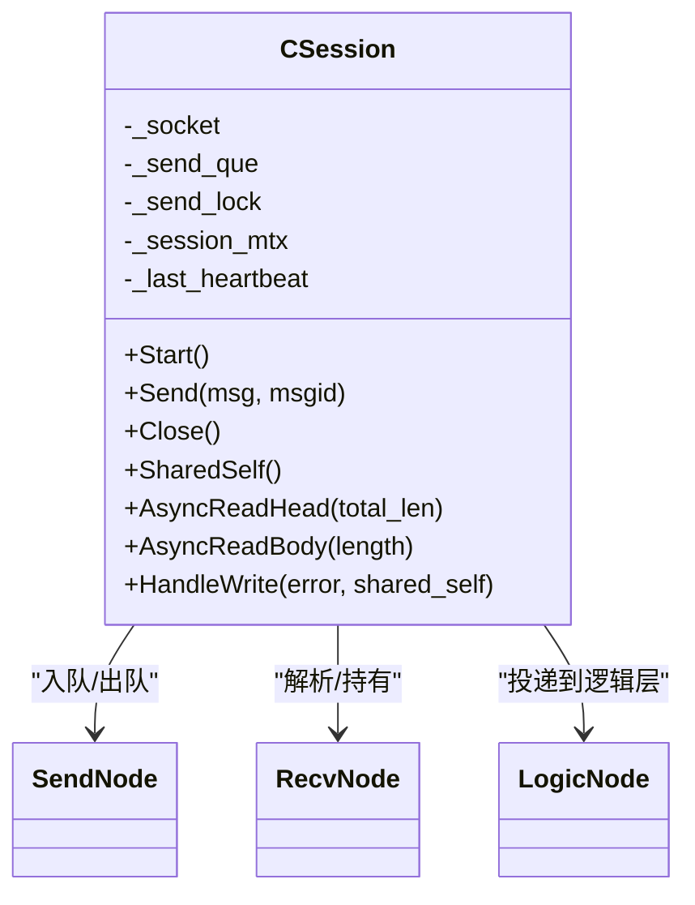
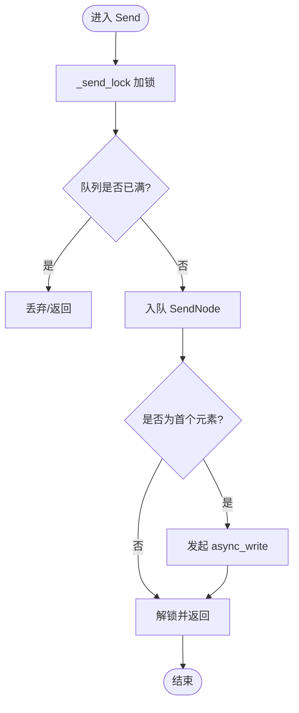
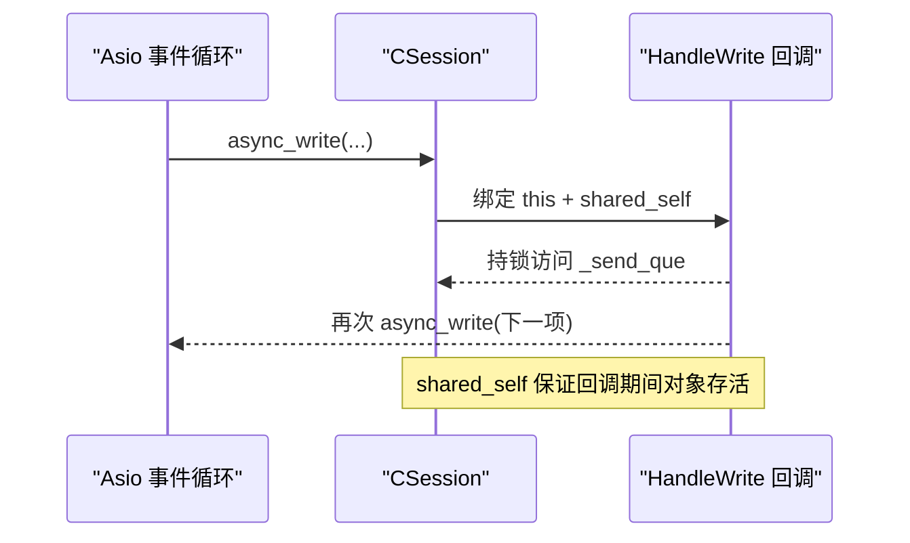
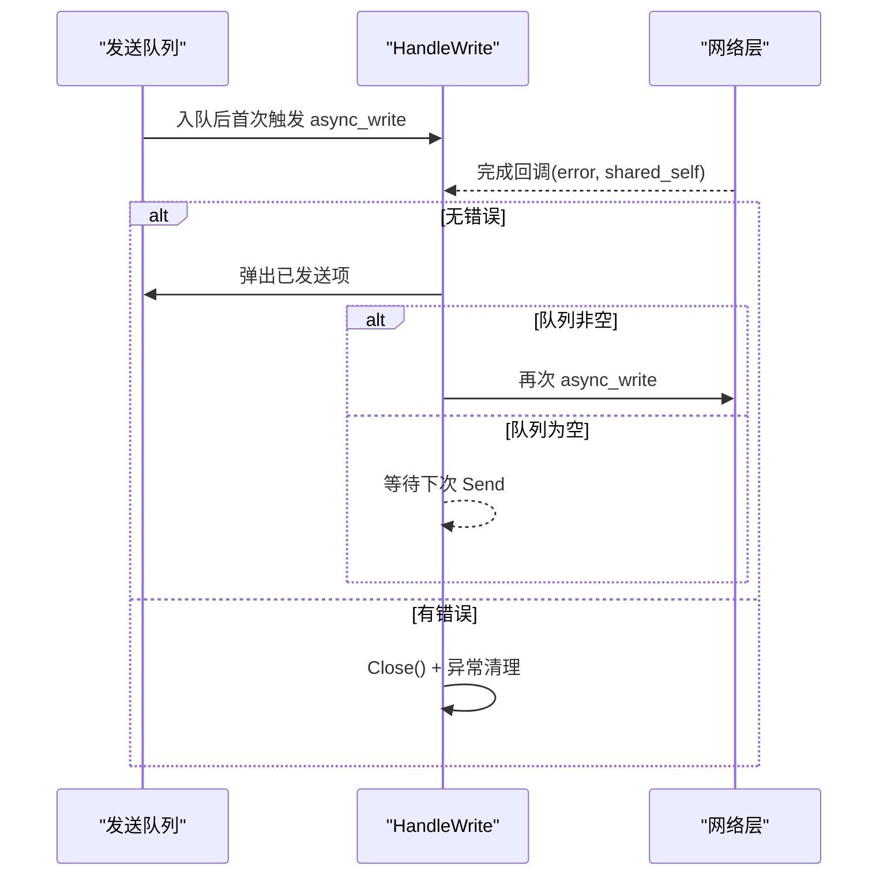
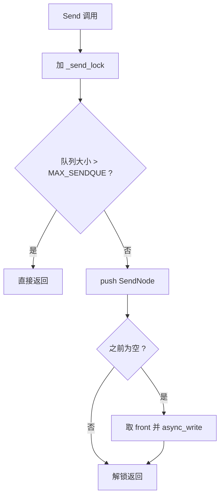
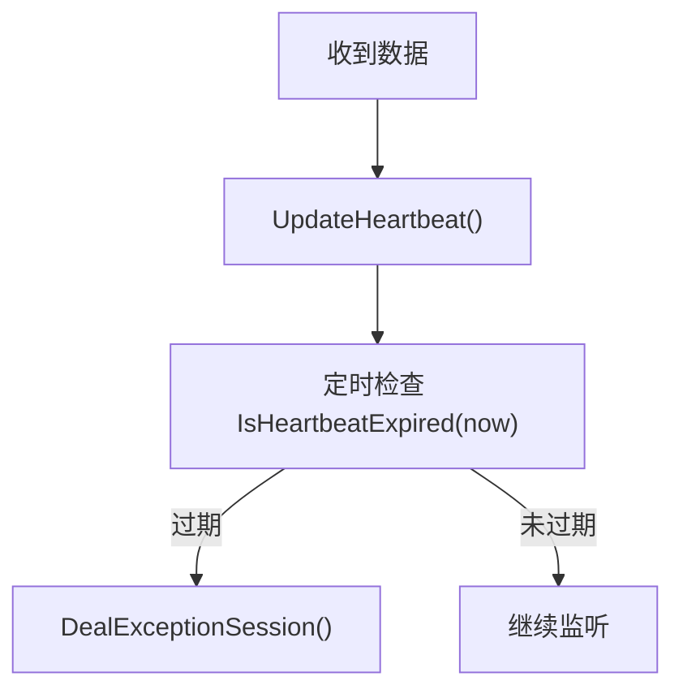
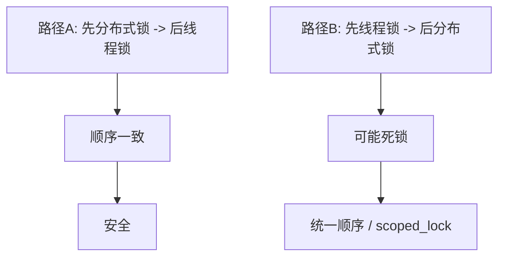
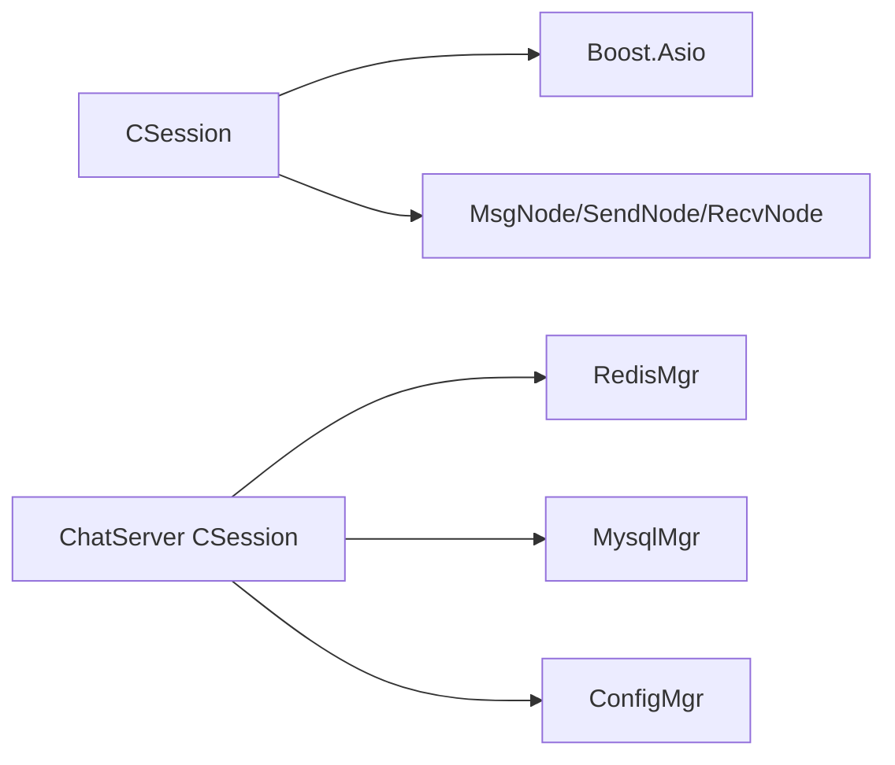

# 并发控制与同步

<cite>
**本文引用的文件**   
- [server/ChatServer/include/CSession.h](file://server/ChatServer/include/CSession.h)
- [server/ChatServer/src/CSession.cpp](file://server/ChatServer/src/CSession.cpp)
- [server/ResourceServer/include/CSession.h](file://server/ResourceServer/include/CSession.h)
- [server/ResourceServer/src/CSession.cpp](file://server/ResourceServer/src/CSession.cpp)
- [开发文档/day35心跳逻辑.md](file://开发文档/day35心跳逻辑.md)
</cite>

## 目录
1. [引言](#引言)
2. [项目结构](#项目结构)
3. [核心组件](#核心组件)
4. [架构总览](#架构总览)
5. [详细组件分析](#详细组件分析)
6. [依赖关系分析](#依赖关系分析)
7. [性能考虑](#性能考虑)
8. [故障排查指南](#故障排查指南)
9. [结论](#结论)

## 引言
本文件围绕会话管理的并发控制机制，系统性梳理多线程环境下的数据保护策略、共享指针生命周期管理、异步回调中的对象生命周期保证、线程安全的消息发送队列，以及死锁预防、锁粒度优化与性能监控方法。重点覆盖以下要点：
- _session_mtx互斥锁的使用场景与临界区保护
- enable_shared_from_this的正确使用与循环引用避免
- HandleWrite回调中shared_self传递的内存安全保证
- _send_lock互斥锁与发送队列操作的原子性
- 分布式锁与线程锁的顺序一致性以避免死锁
- 并发调试技巧与常见问题解决方案

## 项目结构
本项目在服务器端包含多个服务进程（如 ChatServer、ResourceServer），每个服务均实现基于 Boost.Asio 的会话模型 CSession，负责网络 I/O、读写协议解析、消息入队与异步发送。不同服务的 CSession 实现略有差异，但并发控制模式一致：通过互斥锁保护发送队列与关闭操作，通过 shared_ptr 与 enable_shared_from_this 管理对象生命周期，通过异步回调维持非阻塞高吞吐。

**图示来源** 
- [server/ChatServer/include/CSession.h:1-86](file://server/ChatServer/include/CSession.h#L1-L86)
- [server/ChatServer/src/CSession.cpp:1-335](file://server/ChatServer/src/CSession.cpp#L1-L335)
- [server/ResourceServer/include/CSession.h:1-64](file://server/ResourceServer/include/CSession.h#L1-L64)
- [server/ResourceServer/src/CSession.cpp:1-241](file://server/ResourceServer/src/CSession.cpp#L1-L241)

**章节来源**
- [server/ChatServer/include/CSession.h:1-86](file://server/ChatServer/include/CSession.h#L1-L86)
- [server/ChatServer/src/CSession.cpp:1-335](file://server/ChatServer/src/CSession.cpp#L1-L335)
- [server/ResourceServer/include/CSession.h:1-64](file://server/ResourceServer/include/CSession.h#L1-L64)
- [server/ResourceServer/src/CSession.cpp:1-241](file://server/ResourceServer/src/CSession.cpp#L1-L241)

## 核心组件
- CSession：封装单个 TCP 连接的完整生命周期，包括读头/体、写队列、心跳检测、异常处理与清理。
- 发送队列与锁：_send_que 与 _send_lock 保障多生产者单消费者式异步写入的线程安全。
- 会话级锁：_session_mtx 用于保护连接关闭等关键操作。
- 共享指针管理：继承 enable_shared_from_this，通过 SharedSelf() 和 lambda 捕获 self/shared_self 确保回调期间对象存活。
- 心跳与过期检测：原子时间戳记录最后接收时间，提供 IsHeartbeatExpired/UpdateHeartbeat。

**章节来源**
- [server/ChatServer/include/CSession.h:28-76](file://server/ChatServer/include/CSession.h#L28-L76)
- [server/ChatServer/src/CSession.cpp:43-85](file://server/ChatServer/src/CSession.cpp#L43-L85)
- [server/ResourceServer/src/CSession.cpp:41-82](file://server/ResourceServer/src/CSession.cpp#L41-L82)

## 架构总览
下图展示了 CSession 在网络 I/O、发送队列、回调与清理流程中的交互关系。

**图示来源** 
- [server/ChatServer/include/CSession.h:28-76](file://server/ChatServer/include/CSession.h#L28-L76)
- [server/ChatServer/src/CSession.cpp:193-217](file://server/ChatServer/src/CSession.cpp#L193-L217)

## 详细组件分析

### 互斥锁与临界区：_session_mtx 与 _send_lock
- _send_lock：保护发送队列的入队、出队与触发异步写。所有 Send 重载与 HandleWrite 均在持锁状态下访问 _send_que，避免竞态。
- _session_mtx：在 Close 中使用，确保 socket 关闭与状态标志更新是原子的，防止并发读取/写入时出现悬空或重复关闭。

**图示来源** 
- [server/ChatServer/src/CSession.cpp:43-75](file://server/ChatServer/src/CSession.cpp#L43-L75)
- [server/ResourceServer/src/CSession.cpp:41-73](file://server/ResourceServer/src/CSession.cpp#L41-L73)

**章节来源**
- [server/ChatServer/src/CSession.cpp:43-81](file://server/ChatServer/src/CSession.cpp#L43-L81)
- [server/ResourceServer/src/CSession.cpp:41-78](file://server/ResourceServer/src/CSession.cpp#L41-L78)

### 共享指针管理与循环引用避免
- 继承 std::enable_shared_from_this<CSession>，并通过 SharedSelf() 暴露 shared_ptr。
- 在异步回调中，lambda 捕获 self（shared_from_this）或显式传入 shared_self，确保回调执行期间对象不被析构。
- 避免循环引用：LogicNode 仅持有 session 与 recvnode 的 shared_ptr，若上层逻辑存在反向强引用需改为 weak_ptr，防止环状引用导致无法释放。

**图示来源** 
- [server/ChatServer/src/CSession.cpp:193-217](file://server/ChatServer/src/CSession.cpp#L193-L217)
- [server/ResourceServer/src/CSession.cpp:181-204](file://server/ResourceServer/src/CSession.cpp#L181-L204)

**章节来源**
- [server/ChatServer/include/CSession.h:28-41](file://server/ChatServer/include/CSession.h#L28-L41)
- [server/ChatServer/src/CSession.cpp:83-85](file://server/ChatServer/src/CSession.cpp#L83-L85)
- [server/ResourceServer/src/CSession.cpp:80-82](file://server/ResourceServer/src/CSession.cpp#L80-L82)

### 异步回调中的对象生命周期：HandleWrite 的 shared_self
- HandleWrite 接收 shared_ptr<CSession> 作为参数，内部再次调用 shared_from_this 获取当前实例，确保即使外部释放了原始指针，回调仍可安全运行。
- 在成功路径中，持锁弹出队列首项，若有剩余则继续触发下一次 async_write；失败路径统一走 Close 与异常处理流程。

**图示来源** 
- [server/ChatServer/src/CSession.cpp:193-217](file://server/ChatServer/src/CSession.cpp#L193-L217)
- [server/ResourceServer/src/CSession.cpp:181-204](file://server/ResourceServer/src/CSession.cpp#L181-L204)

**章节来源**
- [server/ChatServer/src/CSession.cpp:193-217](file://server/ChatServer/src/CSession.cpp#L193-L217)
- [server/ResourceServer/src/CSession.cpp:181-204](file://server/ResourceServer/src/CSession.cpp#L181-L204)

### 线程安全的消息发送机制：_send_lock 与队列原子性
- 所有对 _send_que 的访问均在 _send_lock 保护下进行，保证“检查长度-入队-触发写”的原子性。
- 仅在队列为空时触发一次 async_write，后续由 HandleWrite 串行推进，避免并发写导致的竞争与乱序。

**图示来源** 
- [server/ChatServer/src/CSession.cpp:43-75](file://server/ChatServer/src/CSession.cpp#L43-L75)
- [server/ResourceServer/src/CSession.cpp:41-73](file://server/ResourceServer/src/CSession.cpp#L41-L73)

**章节来源**
- [server/ChatServer/src/CSession.cpp:43-75](file://server/ChatServer/src/CSession.cpp#L43-L75)
- [server/ResourceServer/src/CSession.cpp:41-73](file://server/ResourceServer/src/CSession.cpp#L41-L73)

### 心跳与过期检测
- 使用 atomic<time_t> 记录最后接收时间，IsHeartbeatExpired 计算差值判断是否超时，UpdateHeartbeat 在每次成功接收后刷新。
- 心跳过期将触发异常会话清理流程，包括分布式锁与 Redis 状态清理。

**图示来源** 
- [server/ChatServer/src/CSession.cpp:285-299](file://server/ChatServer/src/CSession.cpp#L285-L299)

**章节来源**
- [server/ChatServer/src/CSession.cpp:285-299](file://server/ChatServer/src/CSession.cpp#L285-L299)

### 死锁预防与锁顺序一致性
- 在错误处理路径中，先获取分布式锁（Redis），再操作线程锁（_mutex/_session_mtx）。若其他路径顺序相反，可能产生交叉锁导致死锁。
- 建议统一加锁顺序或使用 std::scoped_lock 同时获取多把锁，避免 A 拿 m1 等 m2、B 拿 m2 等 m1 的经典死锁。

**图示来源** 
- [开发文档/day35心跳逻辑.md:148-172](file://开发文档/day35心跳逻辑.md#L148-L172)

**章节来源**
- [开发文档/day35心跳逻辑.md:148-172](file://开发文档/day35心跳逻辑.md#L148-L172)

## 依赖关系分析
- CSession 依赖 Boost.Asio 进行非阻塞 I/O，依赖自定义 MsgNode/SendNode/RecvNode 数据结构承载消息。
- ChatServer 的 CSession 额外集成 RedisMgr、MysqlMgr、ConfigMgr 等，用于会话清理与业务状态维护。
- ResourceServer 的 CSession 更轻量，主要聚焦于文件传输相关逻辑。

**图示来源** 
- [server/ChatServer/src/CSession.cpp:1-10](file://server/ChatServer/src/CSession.cpp#L1-L10)
- [server/ResourceServer/src/CSession.cpp:1-10](file://server/ResourceServer/src/CSession.cpp#L1-L10)

**章节来源**
- [server/ChatServer/src/CSession.cpp:1-10](file://server/ChatServer/src/CSession.cpp#L1-L10)
- [server/ResourceServer/src/CSession.cpp:1-10](file://server/ResourceServer/src/CSession.cpp#L1-L10)

## 性能考虑
- 锁粒度优化：
  - _send_lock 仅包裹队列操作与一次 async_write 触发，避免长时间持锁。
  - _session_mtx 仅用于 Close 等短临界区。
- 减少拷贝：SendNode 构造时尽量使用移动语义，避免大对象复制。
- 背压与限流：MAX_SENDQUE 限制队列长度，防止内存暴涨。
- 异步流水线：HandleWrite 串行推进队列，避免多次并发写竞争。
- 监控指标：
  - 队列长度分布、平均延迟、错误率
  - 心跳过期率、连接重建频率
  - Redis/Mysql 操作耗时与失败次数

[本节为通用指导，不直接分析具体文件]

## 故障排查指南
- 常见并发问题
  - 发送队列竞态：确认所有访问 _send_que 的代码均在 _send_lock 下执行。
  - 对象提前析构：检查 lambda 是否正确捕获 self/shared_self，避免悬挂指针。
  - 死锁风险：核对分布式锁与线程锁的加锁顺序，必要时改用 std::scoped_lock。
  - 心跳误判：确认 UpdateHeartbeat 在每次有效接收后调用，且阈值合理。
- 调试技巧
  - 打印关键路径日志：入队/出队、async_write 回调、错误码。
  - 使用 ASan/TSan 检测数据竞争与内存错误。
  - 针对热点路径添加计数与耗时统计，定位瓶颈。

**章节来源**
- [server/ChatServer/src/CSession.cpp:193-217](file://server/ChatServer/src/CSession.cpp#L193-L217)
- [server/ResourceServer/src/CSession.cpp:181-204](file://server/ResourceServer/src/CSession.cpp#L181-L204)
- [开发文档/day35心跳逻辑.md:148-172](file://开发文档/day35心跳逻辑.md#L148-L172)

## 结论
通过对 CSession 的并发控制机制的系统化梳理，明确了以下关键点：
- 使用 _send_lock 与 _session_mtx 精确划分临界区，确保发送队列与连接关闭的线程安全。
- 借助 enable_shared_from_this 与 shared_self 传递，保证异步回调期间的对象生命周期安全。
- 统一分布式锁与线程锁的加锁顺序，避免死锁；必要时采用 std::scoped_lock。
- 通过队列长度限制与异步流水线提升吞吐与稳定性，结合监控指标持续优化性能。

[本节为总结性内容，不直接分析具体文件]