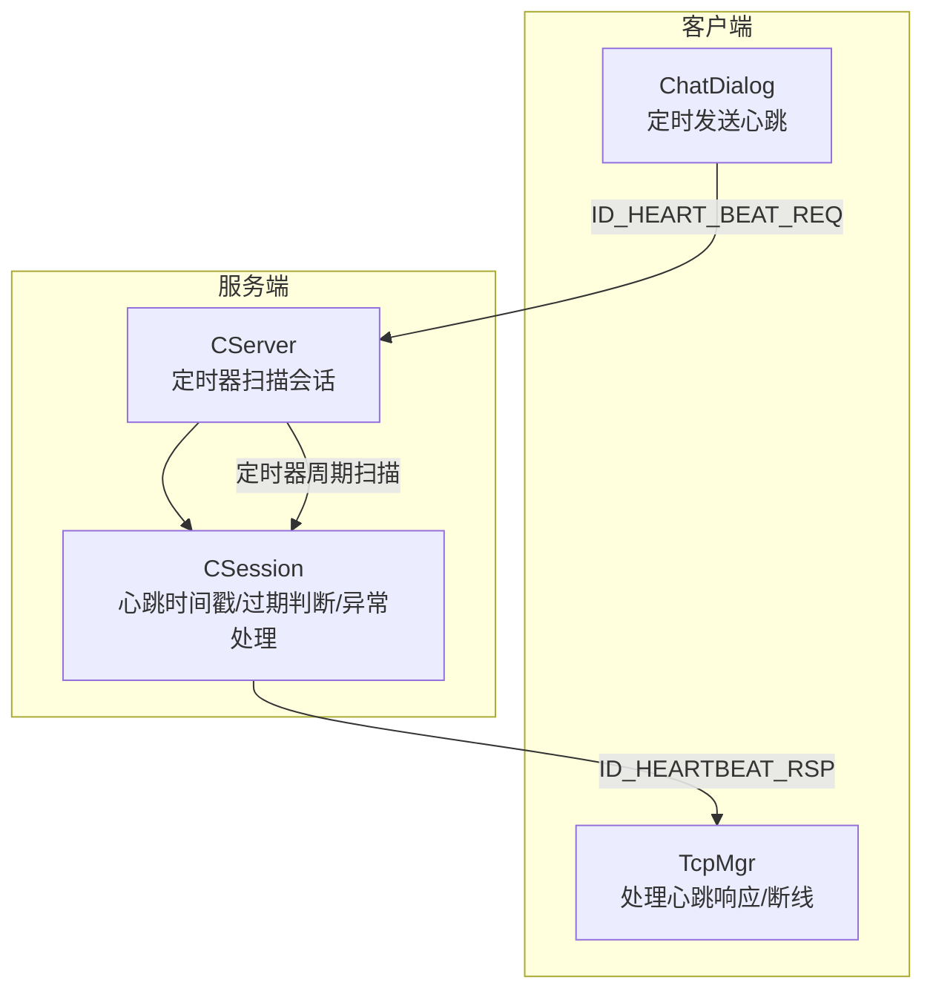
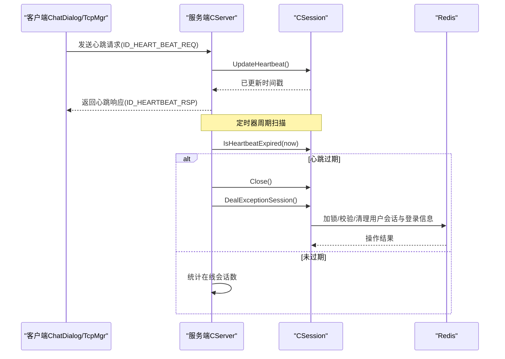
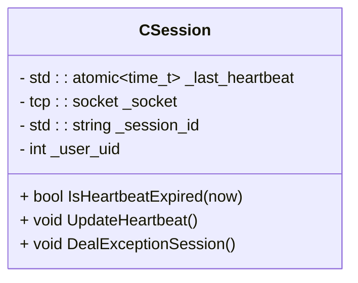
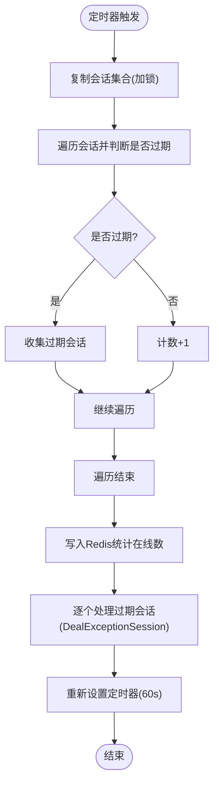
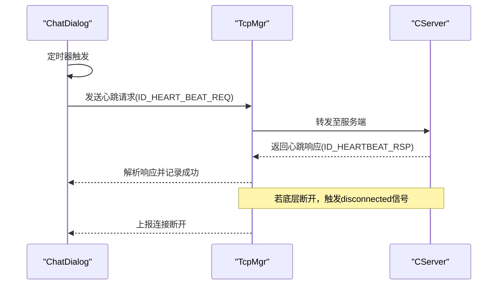
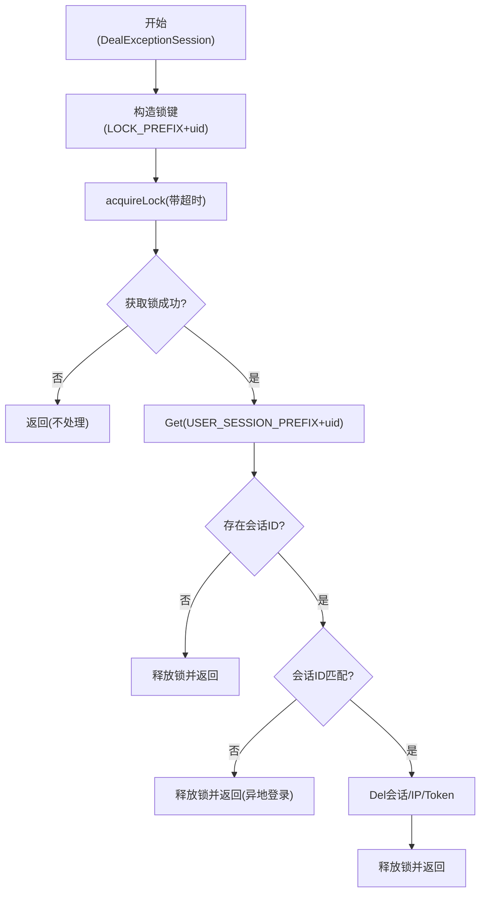
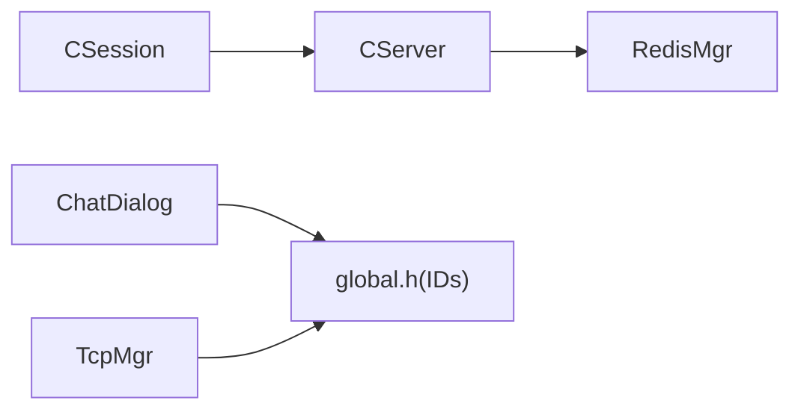

# 心跳检测机制

<cite>
**本文引用的文件**
- [CSession.h](file://server/ChatServer/include/CSession.h)
- [CSession.cpp](file://server/ChatServer/src/CSession.cpp)
- [CServer.cpp](file://server/ChatServer/src/CServer.cpp)
- [global.h](file://client/llfcchat/include/global.h)
- [chatdialog.cpp](file://client/llfcchat/src/chatdialog.cpp)
- [tcpmgr.cpp](file://client/llfcchat/src/tcpmgr.cpp)
- [day35心跳逻辑.md](file://开发文档/day35心跳逻辑.md)
</cite>

## 目录
1. [简介](#简介)
2. [项目结构](#项目结构)
3. [核心组件](#核心组件)
4. [架构总览](#架构总览)
5. [详细组件分析](#详细组件分析)
6. [依赖关系分析](#依赖关系分析)
7. [性能考量](#性能考量)
8. [故障排查指南](#故障排查指南)
9. [结论](#结论)
10. [附录](#附录)

## 简介
本文件围绕会话心跳检测机制，系统性阐述其设计原理与实现细节：包括_last_heartbeat时间戳管理、IsHeartbeatExpired过期判断、UpdateHeartbeat更新策略与时机、异常连接检测与DealExceptionSession恢复流程；同时给出心跳间隔配置、超时阈值设置、重连策略建议，以及监控指标收集、异常告警与性能影响分析，并提供配置优化与故障排查指南。

## 项目结构
心跳机制涉及服务端会话对象、服务器定时器、客户端心跳定时任务与消息协议标识等关键位置：
- 服务端会话层：CSession（心跳时间戳、过期判断、异常处理）
- 服务端调度层：CServer（定时器扫描、统计与清理）
- 客户端应用层：ChatDialog（定时发送心跳）、TcpMgr（接收心跳响应与断线通知）
- 协议常量：global.h（心跳请求/响应ID）

**图示来源**
- [CServer.cpp:75-118](file://server/ChatServer/src/CServer.cpp#L75-L118)
- [CSession.cpp:285-333](file://server/ChatServer/src/CSession.cpp#L285-L333)
- [chatdialog.cpp:156-162](file://client/llfcchat/src/chatdialog.cpp#L156-L162)
- [tcpmgr.cpp:583](file://client/llfcchat/src/tcpmgr.cpp#L583)
- [global.h:61-62](file://client/llfcchat/include/global.h#L61-L62)

**章节来源**
- [CServer.cpp:75-118](file://server/ChatServer/src/CServer.cpp#L75-L118)
- [CSession.cpp:285-333](file://server/ChatServer/src/CSession.cpp#L285-L333)
- [chatdialog.cpp:156-162](file://client/llfcchat/src/chatdialog.cpp#L156-L162)
- [tcpmgr.cpp:583](file://client/llfcchat/src/tcpmgr.cpp#L583)
- [global.h:61-62](file://client/llfcchat/include/global.h#L61-L62)

## 核心组件
- CSession：维护_last_heartbeat原子时间戳，提供IsHeartbeatExpired过期判断、UpdateHeartbeat更新时间戳、DealExceptionSession异常清理。
- CServer：周期性定时器on_timer扫描所有会话，统计在线数并触发异常会话清理。
- ChatDialog：客户端定时发送心跳请求。
- TcpMgr：客户端处理心跳响应与连接断开事件。
- global.h：定义心跳请求/响应消息ID。

**章节来源**
- [CSession.h:46-50](file://server/ChatServer/include/CSession.h#L46-L50)
- [CSession.h:72-73](file://server/ChatServer/include/CSession.h#L72-L73)
- [CSession.cpp:285-333](file://server/ChatServer/src/CSession.cpp#L285-L333)
- [CServer.cpp:75-118](file://server/ChatServer/src/CServer.cpp#L75-L118)
- [chatdialog.cpp:156-162](file://client/llfcchat/src/chatdialog.cpp#L156-L162)
- [tcpmgr.cpp:583](file://client/llfcchat/src/tcpmgr.cpp#L583)
- [global.h:61-62](file://client/llfcchat/include/global.h#L61-L62)

## 架构总览
心跳机制由“客户端定时发包 + 服务端按会话时间戳判定”的双端协作构成：
- 客户端每N秒发送一次心跳请求（ID_HEART_BEAT_REQ），服务端收到后回复心跳响应（ID_HEARTBEAT_RSP）。
- 服务端在每次读取到数据时更新该会话的_last_heartbeat；定时器周期扫描，若当前时间与_last_heartbeat差值超过阈值则判定为过期，触发Close与异常清理。
- 异常清理通过分布式锁保证多进程/多实例一致性，避免异地登录冲突。

**图示来源**
- [CSession.cpp:117-118](file://server/ChatServer/src/CSession.cpp#L117-L118)
- [CSession.cpp:285-293](file://server/ChatServer/src/CSession.cpp#L285-L293)
- [CSession.cpp:301-333](file://server/ChatServer/src/CSession.cpp#L301-L333)
- [CServer.cpp:75-118](file://server/ChatServer/src/CServer.cpp#L75-L118)
- [global.h:61-62](file://client/llfcchat/include/global.h#L61-L62)

## 详细组件分析

### CSession：心跳状态与异常处理
- 时间戳字段_last_heartbeat使用std::atomic<time_t>，确保并发安全。
- IsHeartbeatExpired计算now与_last_heartbeat差值，超过阈值即认为过期。
- UpdateHeartbeat在每次成功读取数据时调用，刷新最后活跃时间。
- DealExceptionSession负责分布式锁获取、会话ID校验、清理用户会话与登录信息，防止僵尸连接与异地登录残留。

**图示来源**
- [CSession.h:72-73](file://server/ChatServer/include/CSession.h#L72-L73)
- [CSession.cpp:285-333](file://server/ChatServer/src/CSession.cpp#L285-L333)

**章节来源**
- [CSession.h:46-50](file://server/ChatServer/include/CSession.h#L46-L50)
- [CSession.h:72-73](file://server/ChatServer/include/CSession.h#L72-L73)
- [CSession.cpp:285-333](file://server/ChatServer/src/CSession.cpp#L285-L333)

### CServer：定时器扫描与统计
- on_timer周期性触发，拷贝会话集合以避免持有锁遍历导致的死锁风险。
- 对每个会话执行IsHeartbeatExpired，收集过期会话并在释放锁后统一调用DealExceptionSession。
- 统计在线会话数量并写入Redis，供负载均衡或状态服务使用。

**图示来源**
- [CServer.cpp:75-118](file://server/ChatServer/src/CServer.cpp#L75-L118)

**章节来源**
- [CServer.cpp:75-118](file://server/ChatServer/src/CServer.cpp#L75-L118)

### 客户端心跳：定时发送与响应处理
- ChatDialog内定时器每隔固定间隔发送心跳请求（ID_HEART_BEAT_REQ）。
- TcpMgr注册心跳响应处理器（ID_HEARTBEAT_RSP），解析错误码并记录日志。
- 当底层Socket断开时，发出信号通知界面进行下线提示与重连准备。

**图示来源**
- [chatdialog.cpp:156-162](file://client/llfcchat/src/chatdialog.cpp#L156-L162)
- [tcpmgr.cpp:583](file://client/llfcchat/src/tcpmgr.cpp#L583)
- [global.h:61-62](file://client/llfcchat/include/global.h#L61-L62)

**章节来源**
- [chatdialog.cpp:156-162](file://client/llfcchat/src/chatdialog.cpp#L156-L162)
- [tcpmgr.cpp:583](file://client/llfcchat/src/tcpmgr.cpp#L583)
- [global.h:61-62](file://client/llfcchat/include/global.h#L61-L62)

### 心跳超时处理流程（DealExceptionSession）
- 获取分布式锁（基于用户UID），确保同一用户只有一处清理逻辑生效。
- 校验Redis中存储的会话ID是否与当前会话一致，防止误删其他实例的会话。
- 清理用户会话映射、IP绑定与Token信息，释放资源并避免僵尸连接。

**图示来源**
- [CSession.cpp:301-333](file://server/ChatServer/src/CSession.cpp#L301-L333)

**章节来源**
- [CSession.cpp:301-333](file://server/ChatServer/src/CSession.cpp#L301-L333)

## 依赖关系分析
- CSession依赖CServer用于会话有效性检查与清理。
- CServer依赖RedisMgr进行分布式锁与会话统计。
- 客户端依赖全局消息ID定义以正确路由心跳请求与响应。

**图示来源**
- [CSession.cpp:108-110](file://server/ChatServer/src/CSession.cpp#L108-L110)
- [CServer.cpp:103-106](file://server/ChatServer/src/CServer.cpp#L103-L106)
- [global.h:61-62](file://client/llfcchat/include/global.h#L61-L62)

**章节来源**
- [CSession.cpp:108-110](file://server/ChatServer/src/CSession.cpp#L108-L110)
- [CServer.cpp:103-106](file://server/ChatServer/src/CServer.cpp#L103-L106)
- [global.h:61-62](file://client/llfcchat/include/global.h#L61-L62)

## 性能考量
- 原子时间戳：_last_heartbeat使用std::atomic<time_t>，避免额外锁开销。
- 定时器批量处理：CServer先复制会话集合再遍历，减少持锁时间，降低阻塞风险。
- 异步I/O：读写采用Boost.Asio异步接口，非阻塞提升吞吐。
- 统计落盘频率：在线会话数仅在定时器周期写入Redis，避免频繁网络IO。
- 建议：
  - 合理设置定时器间隔（默认60s）与心跳阈值（示例20s，生产建议≥60s）。
  - 控制发送队列长度，避免内存膨胀。
  - 将异常清理移出临界区，减少锁竞争。

[本节为通用指导，无需具体文件引用]

## 故障排查指南
- 现象：客户端长时间无响应被踢出
  - 检查客户端心跳定时器是否正常启动与发送。
  - 确认服务端on_timer是否正常运行且阈值设置合理。
- 现象：异地登录导致旧连接被清理
  - 查看DealExceptionSession中的会话ID校验逻辑是否生效。
  - 确认Redis中USER_SESSION_PREFIX键值是否正确。
- 现象：定时器未触发或卡住
  - 检查CServer::StartTimer与StopTimer调用路径。
  - 确认async_wait回调未被异常中断。
- 现象：心跳响应解析失败
  - 核对global.h中ID_HEARTBEAT_RSP与客户端处理器注册是否一致。
  - 检查Json解析与错误码字段是否符合约定。

**章节来源**
- [CServer.cpp:120-132](file://server/ChatServer/src/CServer.cpp#L120-L132)
- [CSession.cpp:301-333](file://server/ChatServer/src/CSession.cpp#L301-L333)
- [tcpmgr.cpp:583](file://client/llfcchat/src/tcpmgr.cpp#L583)
- [global.h:61-62](file://client/llfcchat/include/global.h#L61-L62)

## 结论
心跳机制通过“客户端定时发包 + 服务端按会话时间戳判定”的组合，有效解决了长连接的存活检测与中间设备回收问题。结合分布式锁与会话一致性校验，实现了在多实例环境下的可靠清理与防冲突。建议在工程实践中根据网络环境与业务负载调优定时器间隔与阈值，并完善监控与告警体系以提升可观测性与稳定性。

[本节为总结性内容，无需具体文件引用]

## 附录
- 配置与阈值参考：
  - 定时器间隔：60s（CServer构造函数初始化）
  - 心跳阈值：示例20s（IsHeartbeatExpired），生产建议≥60s
  - 客户端心跳间隔：示例10s（ChatDialog定时器）
- 监控指标建议：
  - 在线会话数（Redis HSET LOGIN_COUNT）
  - 心跳过期率（定时器统计）
  - 异常清理次数（DealExceptionSession调用计数）
  - 网络错误率（异步读/写错误回调统计）
- 重连策略建议：
  - 指数退避重试，限制最大重试次数
  - 断线后清理本地缓存与状态，等待后端就绪再重连
  - 前端提示用户并重试登录流程

**章节来源**
- [CServer.cpp:8-14](file://server/ChatServer/src/CServer.cpp#L8-L14)
- [CSession.cpp:285-293](file://server/ChatServer/src/CSession.cpp#L285-L293)
- [chatdialog.cpp:156-162](file://client/llfcchat/src/chatdialog.cpp#L156-L162)
- [day35心跳逻辑.md:272-316](file://开发文档/day35心跳逻辑.md#L272-L316)