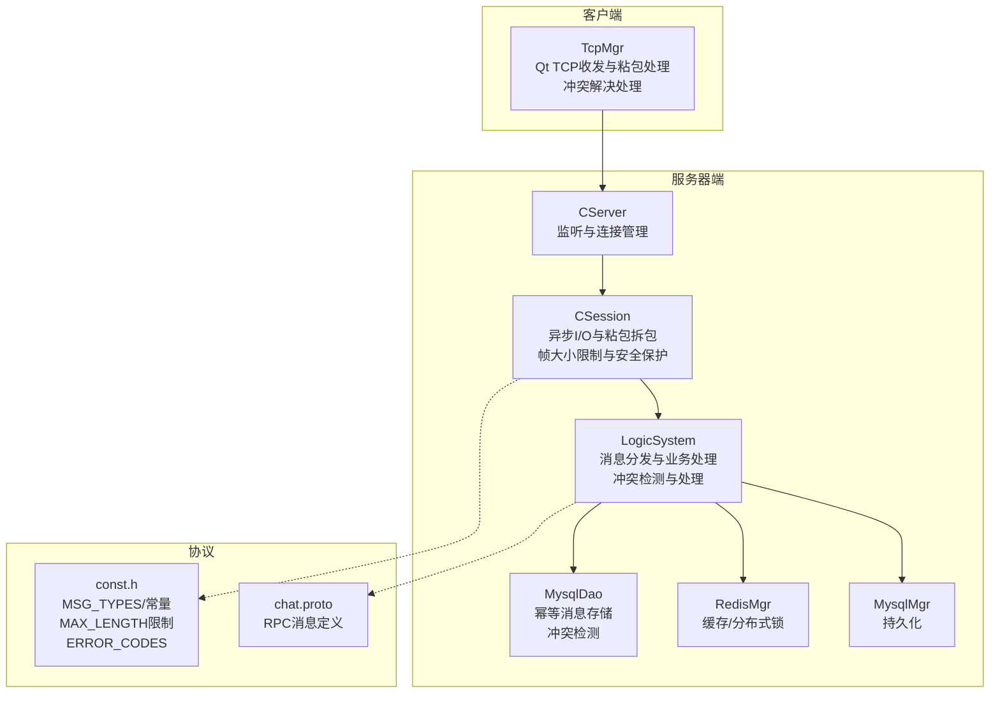
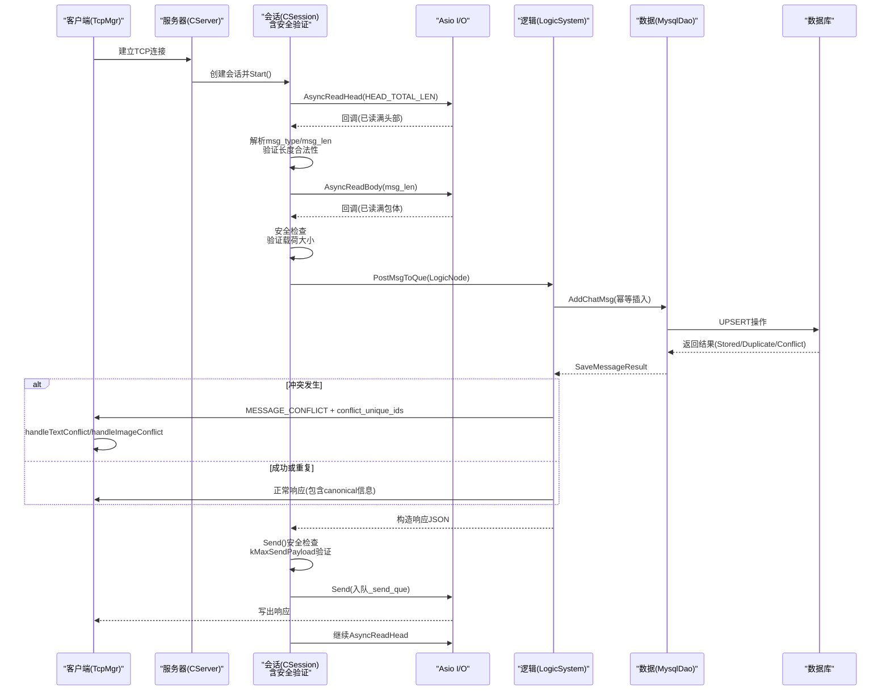
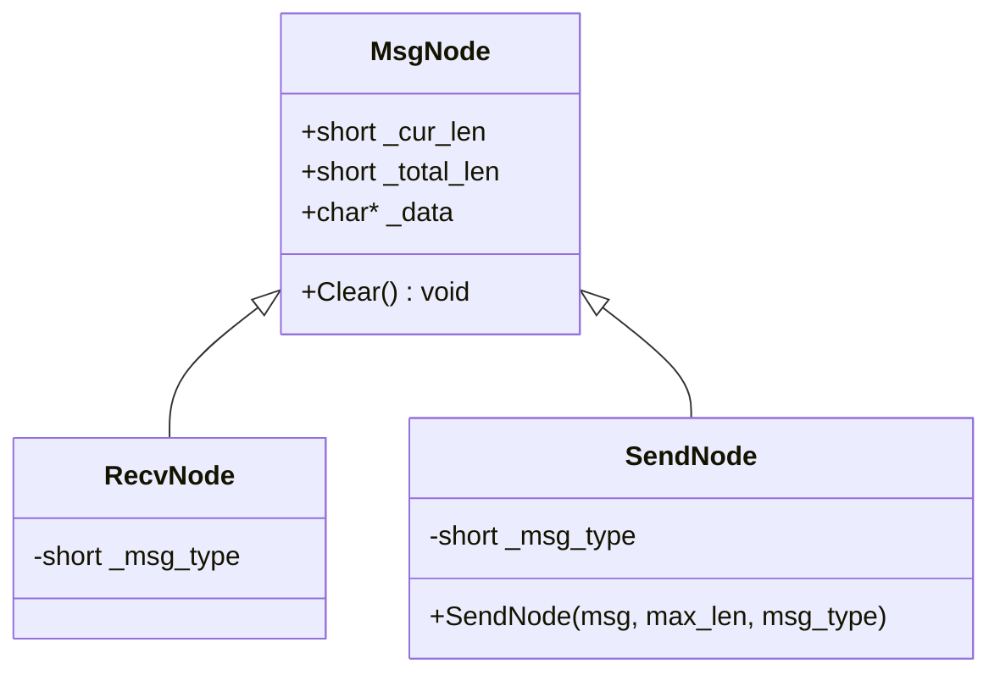
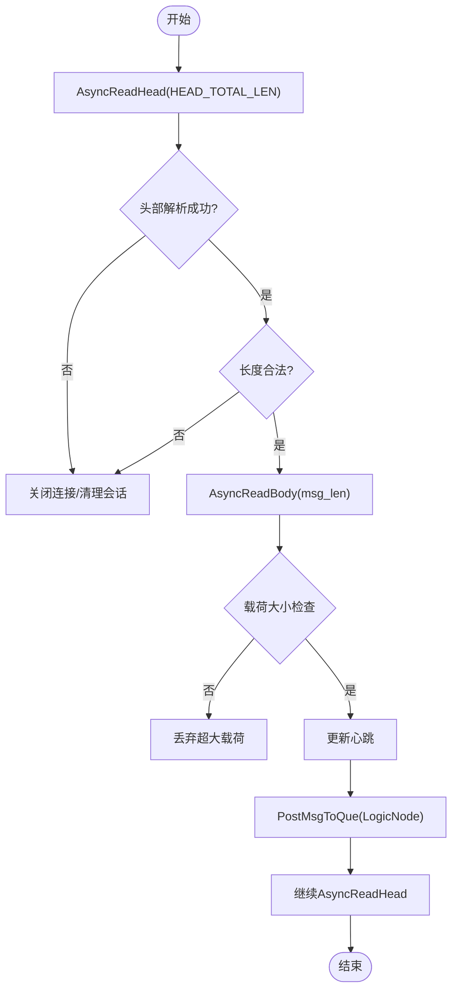
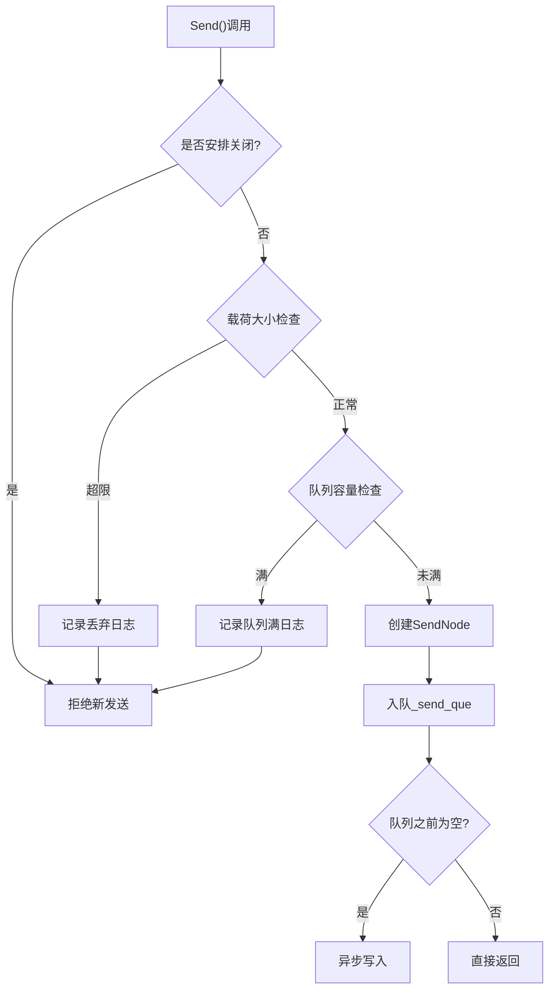
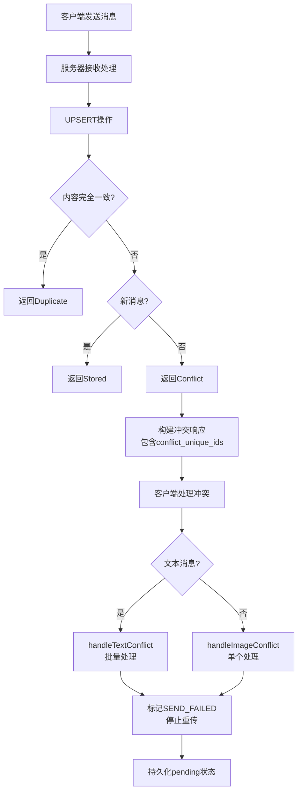
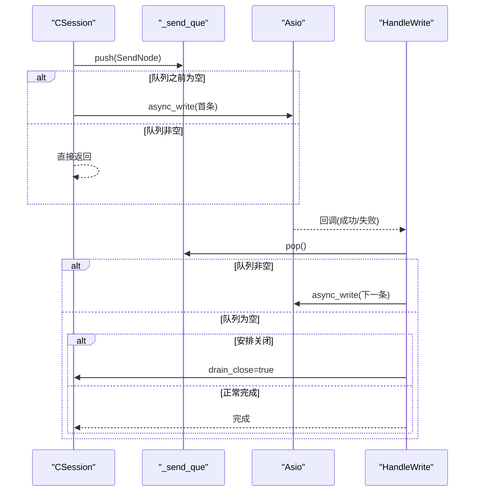
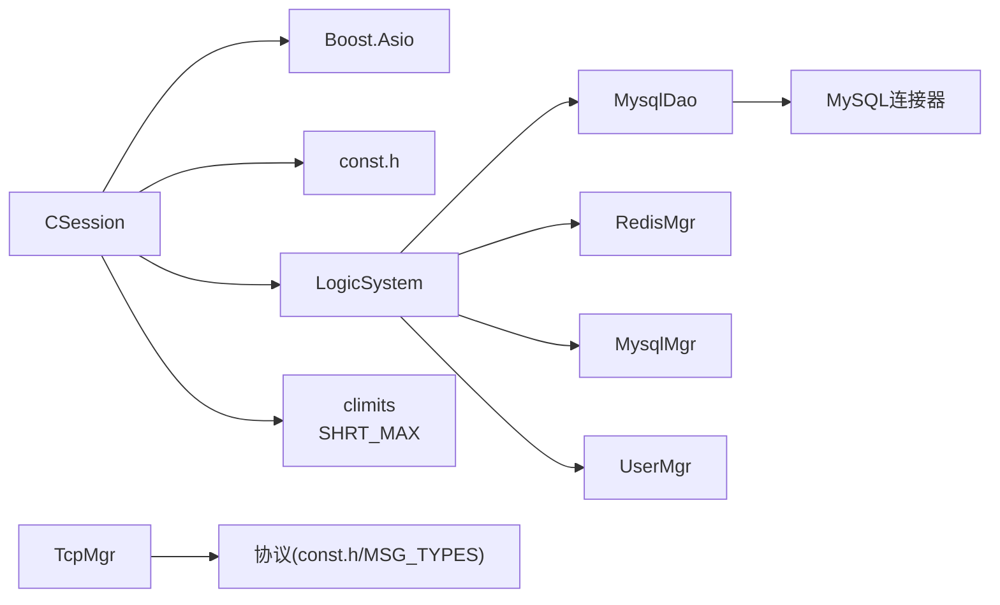

# 消息处理机制

<cite>
**本文引用的文件**   
- [MsgNode.h](file://server/ChatServer/include/MsgNode.h)
- [MsgNode.cpp](file://server/ChatServer/src/MsgNode.cpp)
- [CSession.h](file://server/ChatServer/include/CSession.h)
- [CSession.cpp](file://server/ChatServer/src/CSession.cpp)
- [const.h](file://server/ChatServer/include/const.h)
- [LogicSystem.h](file://server/ChatServer/include/LogicSystem.h)
- [LogicSystem.cpp](file://server/ChatServer/src/LogicSystem.cpp)
- [MysqlDao.h](file://server/ChatServer/include/MysqlDao.h)
- [MysqlDao.cpp](file://server/ChatServer/src/MysqlDao.cpp)
- [tcpmgr.h](file://client/llfcchat/include/tcpmgr.h)
- [tcpmgr.cpp](file://client/llfcchat/src/tcpmgr.cpp)
- [global.h](file://client/llfcchat/include/global.h)
- [chat.proto](file://proto/chat_service/chat.proto)
</cite>

## 更新摘要
**变更内容**   
- 新增完整的消息冲突解决处理机制，支持MESSAGE_CONFLICT错误码的端到端处理
- 实现文本消息的批量冲突解决和图片消息的单个冲突处理
- 增强客户端重传机制，对冲突消息停止重传并标记为发送失败
- 完善服务器端幂等性保证，基于unique_id的内容一致性校验
- 优化数据库事务处理，确保冲突检测的原子性和一致性

## 目录
1. [简介](#简介)
2. [项目结构](#项目结构)
3. [核心组件](#核心组件)
4. [架构总览](#架构总览)
5. [详细组件分析](#详细组件分析)
6. [依赖关系分析](#依赖关系分析)
7. [性能考虑](#性能考虑)
8. [故障排查指南](#故障排查指南)
9. [结论](#结论)
10. [附录](#附录)

## 简介
本文件围绕聊天系统的消息处理机制进行系统化文档化，重点覆盖：
- MsgNode数据结构设计（消息头解析、消息体封装、缓冲区管理）
- 异步I/O实现与调用链（AsyncReadHead、AsyncReadBody等）
- 消息队列管理机制（发送队列_send_que的并发安全、接收缓冲区的内存优化）
- 消息协议格式定义（头部结构、长度字段、消息类型标识）
- 序列化/反序列化、粘包拆包处理、错误重试机制
- **新增：完整的消息冲突解决处理机制**
- 帧大小限制与安全增强机制
- 性能调优建议与内存使用优化技巧

## 项目结构
服务器端采用基于Boost.Asio的异步网络模型，会话层CSession负责TCP读写与粘包拆包；逻辑层LogicSystem通过单例工作线程消费消息队列；数据访问层MysqlDao提供幂等的消息持久化服务。客户端侧TcpMgr以Qt网络栈实现相同协议，并实现了完整的冲突解决处理逻辑。

**图表来源**
- [CServer.h:1-39](file://server/ChatServer/include/CServer.h#L1-L39)
- [CSession.h:1-86](file://server/ChatServer/include/CSession.h#L1-L86)
- [LogicSystem.h:1-60](file://server/ChatServer/include/LogicSystem.h#L1-L60)
- [const.h:1-180](file://server/ChatServer/include/const.h#L1-L180)
- [chat.proto:1-105](file://proto/chat_service/chat.proto#L1-L105)
- [tcpmgr.h:31-123](file://client/llfcchat/include/tcpmgr.h#L31-L123)

章节来源
- [CServer.h:1-39](file://server/ChatServer/include/CServer.h#L1-L39)
- [CSession.h:1-86](file://server/ChatServer/include/CSession.h#L1-L86)
- [LogicSystem.h:1-60](file://server/ChatServer/include/LogicSystem.h#L1-L60)
- [const.h:1-180](file://server/ChatServer/include/const.h#L1-L180)
- [chat.proto:1-105](file://proto/chat_service/chat.proto#L1-L105)
- [tcpmgr.h:31-123](file://client/llfcchat/include/tcpmgr.h#L31-L123)

## 核心组件
- MsgNode/RecvNode/SendNode：消息缓冲节点基类与收/发专用派生类，负责动态分配缓冲区、清零与生命周期管理。
- CSession：会话对象，维护socket、发送队列、接收缓冲、心跳状态，实现异步读头/体与写回调，包含帧大小限制和安全防护。
- LogicSystem：单例逻辑系统，持有消息队列与工作线程，按msg_type分派到具体处理器，实现消息冲突检测和响应处理。
- MysqlDao：数据访问对象，提供幂等的消息存储操作，基于unique_id的内容一致性校验和冲突检测。
- TcpMgr：客户端TCP管理器，实现可靠的发送队列、重传机制和完整的冲突解决处理。
- const.h：协议常量（HEAD_*、MAX_LENGTH、MSG_TYPES、ErrorCodes等）。
- chat.proto：跨服务RPC消息定义（文本/图片/好友/踢人等）。

章节来源
- [MsgNode.h:1-48](file://server/ChatServer/include/MsgNode.h#L1-L48)
- [MsgNode.cpp:1-18](file://server/ChatServer/src/MsgNode.cpp#L1-L18)
- [CSession.h:1-86](file://server/ChatServer/include/CSession.h#L1-L86)
- [CSession.cpp:1-464](file://server/ChatServer/src/CSession.cpp#L1-L464)
- [LogicSystem.cpp:1-1439](file://server/ChatServer/src/LogicSystem.cpp#L1-L1439)
- [MysqlDao.h:1-461](file://server/ChatServer/include/MysqlDao.h#L1-L461)
- [MysqlDao.cpp:1-1130](file://server/ChatServer/src/MysqlDao.cpp#L1-L1130)
- [tcpmgr.h:1-123](file://client/llfcchat/include/tcpmgr.h#L1-L123)
- [tcpmgr.cpp:1-1569](file://client/llfcchat/src/tcpmgr.cpp#L1-L1569)
- [const.h:1-180](file://server/ChatServer/include/const.h#L1-L180)
- [chat.proto:1-105](file://proto/chat_service/chat.proto#L1-L105)

## 架构总览
整体数据流从客户端发起TCP连接开始，服务端CServer接受连接并创建CSession；CSession通过AsyncReadHead读取固定长度的消息头，解析出消息类型与长度后，进入AsyncReadBody读取完整消息体；随后将消息封装为LogicNode投递至LogicSystem队列，由工作线程取出并按msg_type路由到对应处理器；响应路径通过CSession的Send接口入队_send_que，按序异步写出。**新增的冲突解决机制确保在消息持久化阶段检测内容冲突，并向客户端返回明确的错误码**。

**图表来源**
- [CSession.cpp:39-41](file://server/ChatServer/src/CSession.cpp#L39-L41)
- [CSession.cpp:130-191](file://server/ChatServer/src/CSession.cpp#L130-L191)
- [CSession.cpp:87-128](file://server/ChatServer/src/CSession.cpp#L87-L128)
- [CSession.cpp:66-91](file://server/ChatServer/src/CSession.cpp#L66-L91)
- [CSession.cpp:93-118](file://server/ChatServer/src/CSession.cpp#L93-L118)
- [CSession.cpp:120-142](file://server/ChatServer/src/CSession.cpp#L120-L142)
- [LogicSystem.cpp:600-799](file://server/ChatServer/src/LogicSystem.cpp#L600-L799)
- [LogicSystem.cpp:1100-1299](file://server/ChatServer/src/LogicSystem.cpp#L1100-L1299)
- [MysqlDao.cpp:1020-1130](file://server/ChatServer/src/MysqlDao.cpp#L1020-L1130)
- [tcpmgr.cpp:490-689](file://client/llfcchat/src/tcpmgr.cpp#L490-L689)
- [tcpmgr.cpp:860-1059](file://client/llfcchat/src/tcpmgr.cpp#L860-L1059)

## 详细组件分析

### MsgNode数据结构与缓冲区管理
- 基类MsgNode提供动态缓冲区_data、当前长度_cur_len、总长度_total_len，构造函数分配并置零，析构释放内存，Clear重置缓冲。
- RecvNode用于接收，保存_msg_type；SendNode用于发送，在构造时组装头部（msg_type与长度，转为网络字节序），并将消息体拷贝到_data尾部。
- 资源管理：每次构造即分配，避免频繁realloc；发送时额外预留头部空间，保证一次连续内存块写出。
- **安全增强**：SendNode构造时自动处理HEAD_TOTAL_LEN，确保缓冲区大小足够容纳头部和数据体。

**图表来源**
- [MsgNode.h:9-30](file://server/ChatServer/include/MsgNode.h#L9-L30)
- [MsgNode.cpp:8-17](file://server/ChatServer/src/MsgNode.cpp#L8-L17)

章节来源
- [MsgNode.h:1-48](file://server/ChatServer/include/MsgNode.h#L1-L48)
- [MsgNode.cpp:1-18](file://server/ChatServer/src/MsgNode.cpp#L1-L18)

### 异步I/O与粘包拆包
- 读取流程：
  - Start()启动后调用AsyncReadHead(HEAD_TOTAL_LEN)。
  - asyncReadLen内部通过asyncReadLen递归读取直到达到目标长度，确保整包读取。
  - AsyncReadHead解析头部：提取msg_type与msg_len（网络字节序转本地），校验合法性后创建RecvNode并调用AsyncReadBody。
  - AsyncReadBody读取包体，校验长度，更新心跳，封装LogicNode投递给LogicSystem，再回到AsyncReadHead等待下一条。
- 发送流程：
  - Send重载支持string或原始指针，统一封装为SendNode并入队_send_que。
  - HandleWrite在成功写出后弹出队首元素，若队列非空则继续异步写出，形成串行输出，避免粘包。
- **安全增强**：所有读取和发送操作都包含严格的长度验证，防止缓冲区溢出。

**图表来源**
- [CSession.cpp:39-41](file://server/ChatServer/src/CSession.cpp#L39-L41)
- [CSession.cpp:130-191](file://server/ChatServer/src/CSession.cpp#L130-L191)
- [CSession.cpp:87-128](file://server/ChatServer/src/CSession.cpp#L87-L128)
- [CSession.cpp:220-248](file://server/ChatServer/src/CSession.cpp#L220-L248)

章节来源
- [CSession.cpp:1-464](file://server/ChatServer/src/CSession.cpp#L1-L464)

### 帧大小限制与安全增强机制
**新增功能**：系统实现了全面的帧大小限制和安全防护机制，防止缓冲区溢出攻击和资源耗尽攻击。

- **载荷大小限制**：
  - 定义`kMaxSendPayload = SHRT_MAX - HEAD_TOTAL_LEN`作为最大载荷限制
  - 所有Send操作在入队前检查载荷大小，超过限制的请求被直接拒绝
  - 日志记录被拒绝的请求详情，包括会话ID、消息类型和实际长度

- **多重安全防护**：
  - 发送队列容量限制：MAX_SENDQUE防止队列无限增长
  - 写完即关机制：SendAndClose确保错误响应能完整发送
  - 原子操作保护：_close_after_send标志防止竞态条件

- **防御性编程**：
  - 所有长度字段都经过严格验证
  - 网络字节序转换确保跨平台兼容性
  - 异常捕获和优雅降级处理

**图表来源**
- [CSession.cpp:66-91](file://server/ChatServer/src/CSession.cpp#L66-L91)
- [CSession.cpp:93-118](file://server/ChatServer/src/CSession.cpp#L93-L118)
- [CSession.cpp:120-142](file://server/ChatServer/src/CSession.cpp#L120-L142)

章节来源
- [CSession.cpp:11-15](file://server/ChatServer/src/CSession.cpp#L11-L15)
- [CSession.cpp:66-91](file://server/ChatServer/src/CSession.cpp#L66-L91)
- [CSession.cpp:93-118](file://server/ChatServer/src/CSession.cpp#L93-L118)
- [CSession.cpp:120-142](file://server/ChatServer/src/CSession.cpp#L120-L142)

### 消息冲突解决处理机制
**新增功能**：系统实现了完整的消息冲突解决处理机制，基于unique_id的内容一致性校验，确保消息的幂等性和一致性。

- **服务器端冲突检测**：
  - MysqlDao::UpsertChatMessage执行UPSERT操作，比较thread_id、recv_id、content、msg_type、content_size五个关键字段
  - 完全一致返回Duplicate，不一致返回Conflict，新插入返回Stored
  - 批量插入AddChatMsg支持多个消息的事务性处理，任一冲突回滚整个批次

- **客户端冲突处理**：
  - 文本消息：handleTextConflict批量处理conflict_unique_ids，停止重传并标记SEND_FAILED
  - 图片消息：handleImageConflict单个处理conflict_id，停止重传并标记SEND_FAILED
  - 支持批量回滚场景，当conflict_unique_ids为空时整批停止重传

- **错误码定义**：
  - MESSAGE_CONFLICT (1017)：永久冲突，unique_id相同但内容不一致
  - 客户端根据错误码停止重传，避免无限重试

**图表来源**
- [MysqlDao.cpp:977-1130](file://server/ChatServer/src/MysqlDao.cpp#L977-L1130)
- [LogicSystem.cpp:600-799](file://server/ChatServer/src/LogicSystem.cpp#L600-L799)
- [LogicSystem.cpp:1100-1299](file://server/ChatServer/src/LogicSystem.cpp#L1100-L1299)
- [tcpmgr.cpp:1360-1559](file://client/llfcchat/src/tcpmgr.cpp#L1360-L1559)

章节来源
- [MysqlDao.h:432-461](file://server/ChatServer/include/MysqlDao.h#L432-L461)
- [MysqlDao.cpp:977-1130](file://server/ChatServer/src/MysqlDao.cpp#L977-L1130)
- [LogicSystem.cpp:600-799](file://server/ChatServer/src/LogicSystem.cpp#L600-L799)
- [LogicSystem.cpp:1100-1299](file://server/ChatServer/src/LogicSystem.cpp#L1100-L1299)
- [tcpmgr.cpp:490-689](file://client/llfcchat/src/tcpmgr.cpp#L490-L689)
- [tcpmgr.cpp:860-1059](file://client/llfcchat/src/tcpmgr.cpp#L860-L1059)
- [tcpmgr.cpp:1360-1559](file://client/llfcchat/src/tcpmgr.cpp#L1360-L1559)
- [const.h:10-29](file://server/ChatServer/include/const.h#L10-L29)
- [global.h:95-104](file://client/llfcchat/include/global.h#L95-L104)

### 消息队列与并发安全
- 发送队列_send_que：
  - 使用std::queue<shared_ptr<SendNode>>，受_send_lock保护。
  - 入队前检查队列长度上限MAX_SENDQUE，防止内存膨胀。
  - 首次入队触发一次异步写出，后续在HandleWrite中串行出队写出，保证顺序与不粘包。
- 接收队列_logic：
  - LogicSystem持有_msg_que与条件变量_consume，单工作线程DealMsg循环消费。
  - PostMsgToQue加锁入队，仅在队列由空变非空时通知消费者，降低唤醒开销。
- **安全增强**：新增_close_after_send标志确保原子性的关闭操作。

**图表来源**
- [CSession.h:64-65](file://server/ChatServer/include/CSession.h#L64-L65)
- [CSession.cpp:43-75](file://server/ChatServer/src/CSession.cpp#L43-L75)
- [CSession.cpp:193-217](file://server/ChatServer/src/CSession.cpp#L193-L217)
- [CSession.cpp:312-346](file://server/ChatServer/src/CSession.cpp#L312-L346)

章节来源
- [CSession.h:1-86](file://server/ChatServer/include/CSession.h#L1-L86)
- [CSession.cpp:43-75](file://server/ChatServer/src/CSession.cpp#L43-L75)
- [CSession.cpp:193-217](file://server/ChatServer/src/CSession.cpp#L193-L217)
- [CSession.cpp:312-346](file://server/ChatServer/src/CSession.cpp#L312-L346)
- [LogicSystem.cpp:27-35](file://server/ChatServer/src/LogicSystem.cpp#L27-L35)
- [LogicSystem.cpp:43-81](file://server/ChatServer/src/LogicSystem.cpp#L43-L81)

### 消息协议与序列化/反序列化
- 头部结构：
  - HEAD_TYPE_LEN=2字节：消息类型（短整型，网络字节序）
  - HEAD_DATA_LEN=2字节：消息体长度（短整型，网络字节序）
  - HEAD_TOTAL_LEN=4字节
- 发送封装：
  - SendNode构造时将msg_type与max_len转换为网络字节序，拼接消息体。
- 接收解析：
  - AsyncReadHead中按顺序读取并转换字节序，校验msg_type与msg_len范围。
- 业务载荷：
  - 使用nlohmann::json进行序列化/反序列化，如登录、搜索、聊天消息等。
- 客户端对齐：
  - 客户端TcpMgr同样构建"type+length+payload"的QByteArray，并使用BigEndian设置，与服务端一致。
- **安全增强**：MAX_LENGTH限制确保缓冲区不会溢出。

章节来源
- [const.h:38-46](file://server/ChatServer/include/const.h#L38-46)
- [const.h:49-79](file://server/ChatServer/include/const.h#L49-L79)
- [MsgNode.cpp:8-17](file://server/ChatServer/src/MsgNode.cpp#L8-L17)
- [CSession.cpp:130-191](file://server/ChatServer/src/CSession.cpp#L130-L191)
- [tcpmgr.h:31-70](file://client/llfcchat/include/tcpmgr.h#L31-L70)

### 错误处理与重试机制
- 读取错误：
  - asyncReadLen回调检测到ec时立即终止并调用上层Close与异常处理。
  - 长度不匹配时关闭连接并清理会话。
- 写入错误：
  - HandleWrite在error分支关闭连接并进行异常会话清理。
- 异常会话清理：
  - DealExceptionSession通过分布式锁保护，清理用户会话、IP绑定、Token等信息，避免脏状态。
- 重试策略：
  - 对于transient错误（MESSAGE_STORE_FAILED、SERVER_BUSY）继续重传
  - 对于permanent错误（MESSAGE_CONFLICT）停止重传并标记发送失败
  - 结合心跳检测判断连接健康度
- **安全增强**：超大载荷请求被直接拒绝，无需重试。

章节来源
- [CSession.cpp:87-128](file://server/ChatServer/src/CSession.cpp#L87-L128)
- [CSession.cpp:130-191](file://server/ChatServer/src/CSession.cpp#L130-L191)
- [CSession.cpp:193-217](file://server/ChatServer/src/CSession.cpp#L193-L217)
- [CSession.cpp:301-333](file://server/ChatServer/src/CSession.cpp#L301-L333)
- [CSession.cpp:430-462](file://server/ChatServer/src/CSession.cpp#L430-L462)
- [tcpmgr.cpp:490-689](file://client/llfcchat/src/tcpmgr.cpp#L490-L689)
- [tcpmgr.cpp:860-1059](file://client/llfcchat/src/tcpmgr.cpp#L860-L1059)

### 协议扩展与RPC集成
- 文本/图片/好友/踢人等交互通过chat.proto定义，服务间通过gRPC通信。
- 业务处理器在LogicSystem中注册回调，根据msg_type路由到具体函数，完成数据库操作与跨服通知。
- **安全增强**：所有RPC调用都经过相同的长度验证机制。

章节来源
- [chat.proto:1-105](file://proto/chat_service/chat.proto#L1-L105)
- [LogicSystem.cpp:83-114](file://server/ChatServer/src/LogicSystem.cpp#L83-L114)

## 依赖关系分析
- CSession依赖boost::asio进行异步I/O，依赖const.h中的常量，依赖LogicSystem进行消息投递。
- LogicSystem依赖RedisMgr、MysqlMgr、UserMgr等进行数据访问与状态管理。
- MysqlDao依赖MySQL连接器进行数据库操作，实现幂等的消息存储。
- 客户端TcpMgr依赖Qt网络栈，但协议与服务端保持一致。
- **新增依赖**：CSession现在依赖climits库以获取SHRT_MAX常量。

**图表来源**
- [CSession.h:1-86](file://server/ChatServer/include/CSession.h#L1-L86)
- [LogicSystem.h:1-60](file://server/ChatServer/include/LogicSystem.h#L1-L60)
- [const.h:1-180](file://server/ChatServer/include/const.h#L1-L180)
- [tcpmgr.h:31-123](file://client/llfcchat/include/tcpmgr.h#L31-L123)
- [CSession.cpp:5](file://server/ChatServer/src/CSession.cpp#L5)
- [MysqlDao.h:1-461](file://server/ChatServer/include/MysqlDao.h#L1-L461)

章节来源
- [CSession.h:1-86](file://server/ChatServer/include/CSession.h#L1-L86)
- [LogicSystem.h:1-60](file://server/ChatServer/include/LogicSystem.h#L1-L60)
- [const.h:1-180](file://server/ChatServer/include/const.h#L1-L180)
- [tcpmgr.h:31-123](file://client/llfcchat/include/tcpmgr.h#L31-L123)
- [CSession.cpp:5](file://server/ChatServer/src/CSession.cpp#L5)
- [MysqlDao.h:1-461](file://server/ChatServer/include/MysqlDao.h#L1-L461)

## 性能考虑
- 减少内存分配：
  - 复用MsgNode缓冲，避免频繁new/delete；可引入对象池管理RecvNode/SendNode。
  - 控制_send_que大小上限MAX_SENDQUE，防止突发流量导致内存暴涨。
- 提升I/O吞吐：
  - 保持串行写出，避免多路竞争造成乱序；必要时合并小消息（批处理）。
  - 合理设置MAX_LENGTH，平衡内存占用与最大消息尺寸。
- 降低CPU消耗：
  - LogicSystem单线程消费队列，避免过多上下文切换；在高负载下可考虑多工作线程按hash分流。
  - 心跳检测阈值与轮询间隔需权衡实时性与开销。
- 缓存与数据库：
  - 热点数据优先走Redis，降低MySQL压力；注意一致性策略（TTL、失效回源）。
  - 幂等UPSERT操作减少重复计算，提高写入效率。
- 客户端优化：
  - 发送队列与当前块分离，避免重复拷贝；批量打包减少系统调用次数。
  - 冲突检测避免不必要的重传，节省网络带宽。
- **安全性能影响**：
  - 帧大小检查增加了少量CPU开销，但避免了潜在的内存分配失败和崩溃风险。
  - 提前拒绝超大载荷减少了不必要的网络传输和处理开销。
  - 冲突检测在数据库层面完成，避免应用层的重复计算。

[本节为通用指导，无需特定文件引用]

## 故障排查指南
- 常见问题定位：
  - 粘包/半包：检查asyncReadLen是否按目标长度递归读取；确认发送端是否按"type+length+payload"顺序写出。
  - 长度不一致：核对HEAD_DATA_LEN与发送时的max_len转换是否正确（网络字节序）。
  - 队列阻塞：观察_send_que长度与HandleWrite回调是否被调用；检查是否存在长时间阻塞的业务逻辑。
  - 心跳超时：确认UpdateHeartbeat是否在每次收到包体后调用；检查IsHeartbeatExpired阈值。
  - **冲突问题**：检查MESSAGE_CONFLICT错误码处理逻辑，确认conflict_unique_ids是否正确传递。
  - **重传问题**：确认transient和permanent错误的区分处理，避免无限重传或过早放弃。
- 日志关键字：
  - "handle read failed"、"read length not match"、"invalid msg_type/data length"、"heartbeat expired"。
  - **新增**："session: * drop oversize payload"、"session: * send que fulled"、"MESSAGE_CONFLICT"、"conflict unique_id"。
- 恢复策略：
  - 遇到错误立即Close并清理会话；分布式锁保护下的清理避免竞态。
  - 客户端侧实现重连与退避重试，配合心跳维持连接健康。
  - **安全策略**：对于超大载荷请求，记录攻击者IP并考虑临时封禁。
  - **冲突恢复**：客户端根据conflict_unique_ids精确标记失败消息，保留其他消息的重传能力。

章节来源
- [CSession.cpp:87-128](file://server/ChatServer/src/CSession.cpp#L87-L128)
- [CSession.cpp:130-191](file://server/ChatServer/src/CSession.cpp#L130-L191)
- [CSession.cpp:193-217](file://server/ChatServer/src/CSession.cpp#L193-L217)
- [CSession.cpp:285-299](file://server/ChatServer/src/CSession.cpp#L285-299)
- [CSession.cpp:301-333](file://server/ChatServer/src/CSession.cpp#L301-L333)
- [CSession.cpp:66-91](file://server/ChatServer/src/CSession.cpp#L66-L91)
- [CSession.cpp:93-118](file://server/ChatServer/src/CSession.cpp#L93-L118)
- [CSession.cpp:120-142](file://server/ChatServer/src/CSession.cpp#L120-L142)
- [tcpmgr.cpp:1360-1559](file://client/llfcchat/src/tcpmgr.cpp#L1360-L1559)

## 结论
该聊天系统的消息处理机制以简洁稳定的协议与清晰的职责划分为核心：CSession专注I/O与粘包拆包，LogicSystem专注业务路由与数据处理，MsgNode提供高效缓冲管理，MysqlDao提供幂等的消息存储服务。**最新实现的完整冲突解决处理机制通过unique_id的内容一致性校验和MESSAGE_CONFLICT错误码的端到端处理，有效解决了消息重复发送和内容冲突的问题**。通过严格的长度校验、串行写出、队列限流和冲突检测，系统在可靠性、一致性和性能之间取得了良好平衡。未来可在对象池、批处理、重试策略等方面进一步优化，以提升高并发场景下的吞吐与稳定性。

[本节为总结性内容，无需特定文件引用]

## 附录

### 消息协议字段定义
- 头部：
  - 消息类型：2字节，网络字节序
  - 消息体长度：2字节，网络字节序
  - 头部总长：4字节
- 载荷：
  - JSON字符串（业务字段见各处理器）
  - **最大载荷限制：SHRT_MAX - HEAD_TOTAL_LEN字节**
- 客户端对齐：
  - Qt侧使用BigEndian写入id与length，与服务端一致

### 错误码定义
- Success (0)：操作成功
- Error_Json (1001)：JSON解析错误
- RPCFailed (1002)：RPC请求失败
- VarifyExpired (1003)：验证码已过期
- VarifyCodeErr (1004)：验证码错误
- UserExist (1005)：用户已存在
- PasswdErr (1006)：密码错误
- EmailNotMatch (1007)：邮箱不匹配
- PasswdUpFailed (1008)：更新密码失败
- PasswdInvalid (1009)：密码无效/更新失败
- TokenInvalid (1010)：Token失效
- UidInvalid (1011)：用户ID无效
- CREATE_CHAT_FAILED (1012)：创建聊天会话失败
- LOAD_CHAT_FAILED (1013)：加载聊天记录失败
- MESSAGE_STORE_FAILED (1014)：消息持久化失败（transient，继续重传）
- RECIPIENT_OFFLINE (1015)：目标用户当前不在线
- SERVER_BUSY (1016)：服务端停机/队列拒绝（transient，继续重传）
- **MESSAGE_CONFLICT (1017)：unique-id相同但内容冲突（permanent，停止重传）**

### 安全配置参数
- MAX_LENGTH：单次接收/发送缓冲区的最大字节数（2KB）
- MAX_SENDQUE：发送队列最大容量（1000）
- kMaxSendPayload：最大载荷大小（SHRT_MAX - HEAD_TOTAL_LEN）
- LOCK_TIME_OUT：分布式锁超时时间（10秒）
- ACQUIRE_TIME_OUT：锁获取超时时间（5秒）

章节来源
- [const.h:38-46](file://server/ChatServer/include/const.h#L38-L46)
- [const.h:49-79](file://server/ChatServer/include/const.h#L49-L79)
- [const.h:57-68](file://server/ChatServer/include/const.h#L57-L68)
- [const.h:10-29](file://server/ChatServer/include/const.h#L10-L29)
- [CSession.cpp:11-15](file://server/ChatServer/src/CSession.cpp#L11-L15)
- [tcpmgr.h:31-70](file://client/llfcchat/include/tcpmgr.h#L31-L70)
- [global.h:95-104](file://client/llfcchat/include/global.h#L95-L104)