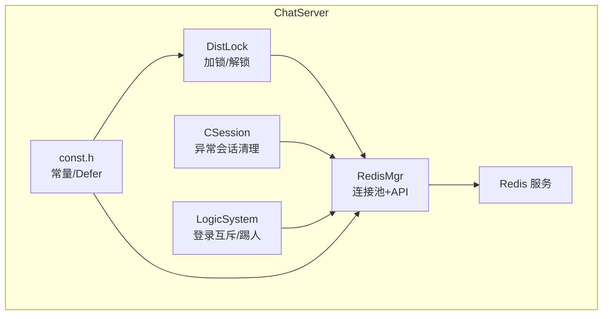
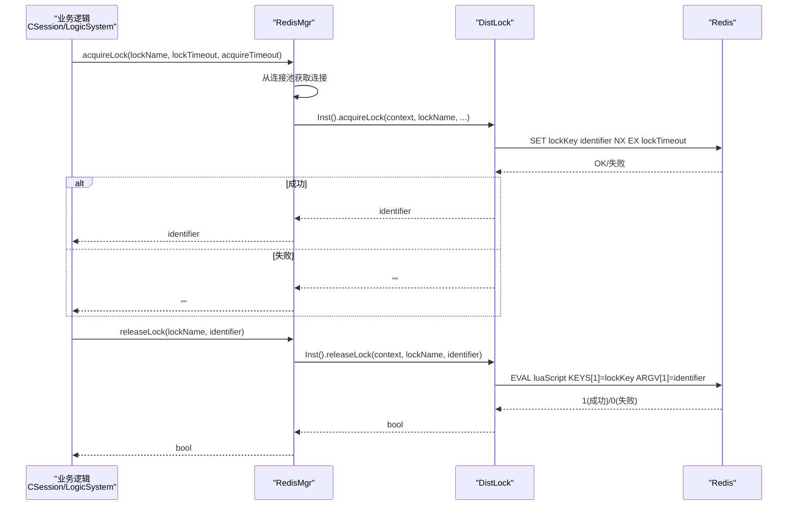
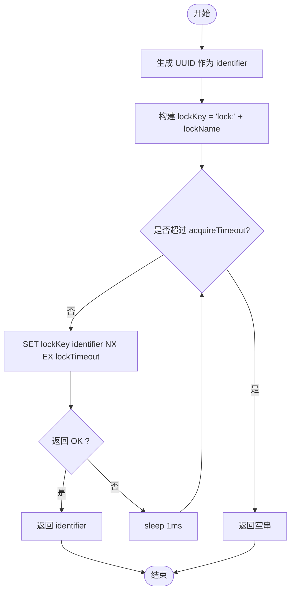
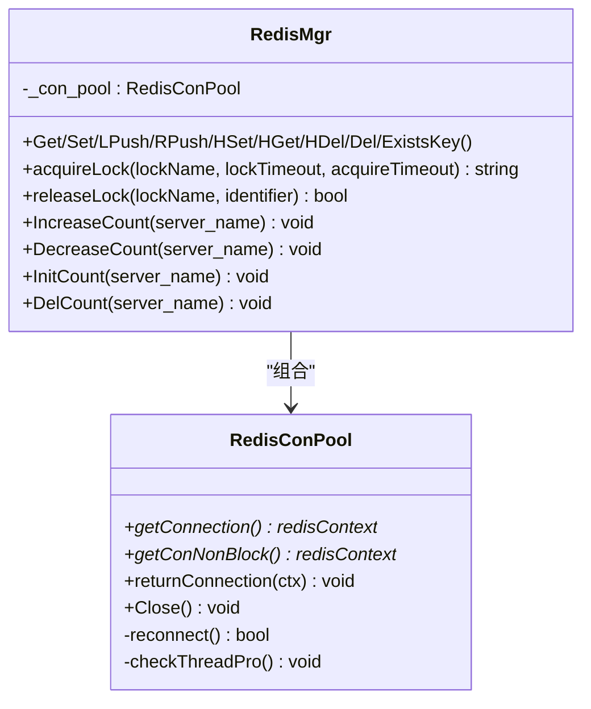
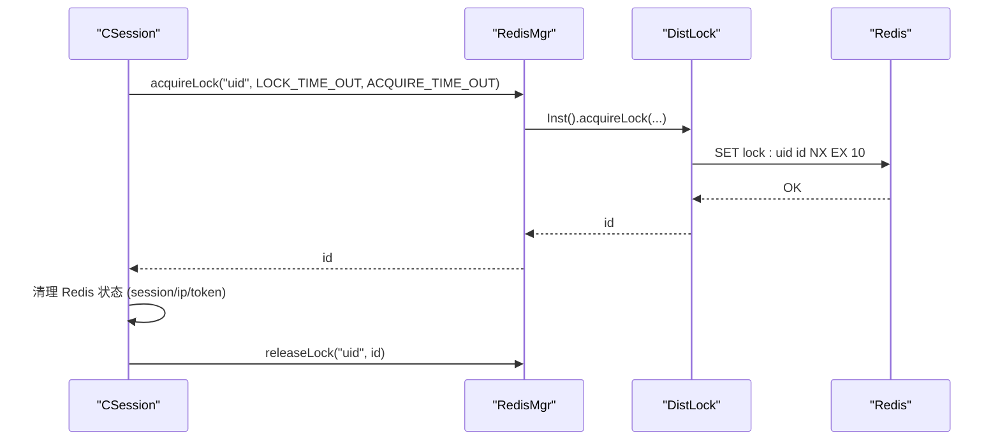
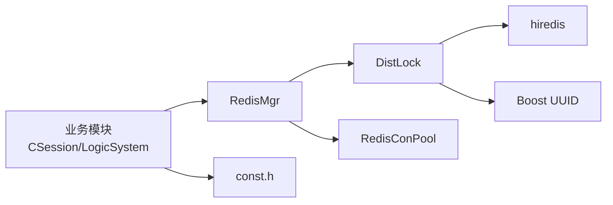
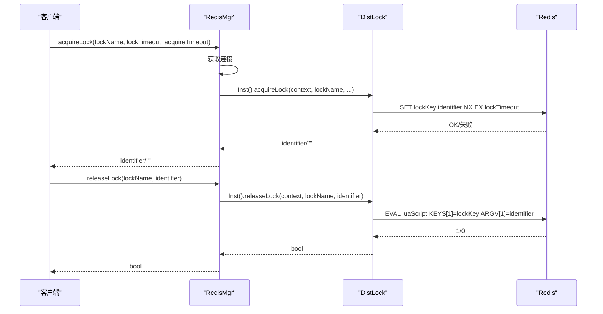
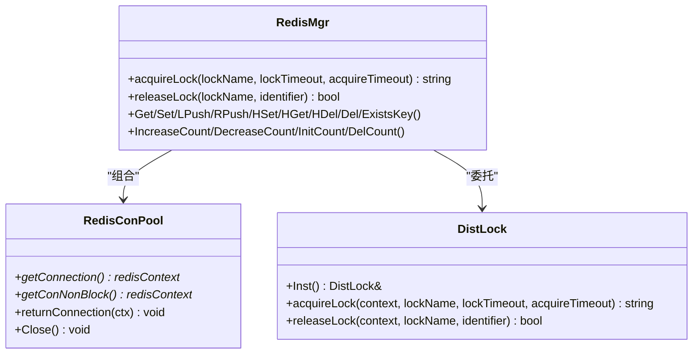

# 分布式锁

<cite>
**本文引用的文件**   
- [DistLock.h](file://server/ChatServer/include/DistLock.h)
- [DistLock.cpp](file://server/ChatServer/src/DistLock.cpp)
- [RedisMgr.h](file://server/ChatServer/include/RedisMgr.h)
- [RedisMgr.cpp](file://server/ChatServer/src/RedisMgr.cpp)
- [const.h](file://server/ChatServer/include/const.h)
- [CSession.cpp](file://server/ChatServer/src/CSession.cpp)
- [LogicSystem.cpp](file://server/ChatServer/src/LogicSystem.cpp)
- [day32分布式锁设计思路.md](file://开发文档/day32分布式锁设计思路.md)
- [day41-分布式死锁解决方案.md](file://开发文档/day41-分布式死锁解决方案.md)
</cite>

## 目录
1. [引言](#引言)
2. [项目结构](#项目结构)
3. [核心组件](#核心组件)
4. [架构总览](#架构总览)
5. [详细组件分析](#详细组件分析)
6. [依赖关系分析](#依赖关系分析)
7. [性能考量与优化](#性能考量与优化)
8. [监控、调试与故障恢复](#监控调试与故障恢复)
9. [结论](#结论)
10. [附录](#附录)

## 引言
本文件面向 ChatServer 的分布式锁子系统，系统性阐述其基于 Redis 的实现原理、原子操作与锁粒度控制；详述加锁与解锁流程（含超时设置、重试策略与死锁检测）；解释竞争处理（公平性、优先级与饥饿避免）；记录状态管理（持有者信息、过期时间与清理机制）；给出性能优化建议（细粒度锁、批量操作、缓存策略）；并提供监控、调试与故障恢复方案。内容严格依据仓库内源码与开发文档进行提炼与归纳。

## 项目结构
分布式锁相关代码集中在 ChatServer 模块中，关键文件如下：
- DistLock.h/.cpp：分布式锁核心实现（获取/释放、UUID 标识、Lua 脚本）
- RedisMgr.h/.cpp：Redis 连接池与命令封装，提供 acquireLock/releaseLock 接口
- const.h：常量定义（锁前缀、超时参数等）
- CSession.cpp / LogicSystem.cpp：业务层对分布式锁的使用场景（踢人、登录互斥）
- 开发文档：day32 分布式锁设计思路、day41 分布式死锁解决方案

图表来源
- [DistLock.h:1-18](file://server/ChatServer/include/DistLock.h#L1-L18)
- [DistLock.cpp:1-73](file://server/ChatServer/src/DistLock.cpp#L1-L73)
- [RedisMgr.h:267-305](file://server/ChatServer/include/RedisMgr.h#L267-L305)
- [RedisMgr.cpp:361-393](file://server/ChatServer/src/RedisMgr.cpp#L361-L393)
- [const.h:23-36](file://server/ChatServer/include/const.h#L23-L36)
- [CSession.cpp:300-335](file://server/ChatServer/src/CSession.cpp#L300-L335)
- [LogicSystem.cpp:195-252](file://server/ChatServer/src/LogicSystem.cpp#L195-L252)

章节来源
- [DistLock.h:1-18](file://server/ChatServer/include/DistLock.h#L1-L18)
- [DistLock.cpp:1-73](file://server/ChatServer/src/DistLock.cpp#L1-L73)
- [RedisMgr.h:267-305](file://server/ChatServer/include/RedisMgr.h#L267-L305)
- [RedisMgr.cpp:361-393](file://server/ChatServer/src/RedisMgr.cpp#L361-L393)
- [const.h:23-36](file://server/ChatServer/include/const.h#L23-L36)
- [CSession.cpp:300-335](file://server/ChatServer/src/CSession.cpp#L300-L335)
- [LogicSystem.cpp:195-252](file://server/ChatServer/src/LogicSystem.cpp#L195-L252)

## 核心组件
- DistLock：单例类，负责分布式锁的原子获取与原子释放。使用 Redis SET NX EX 实现加锁，使用 Lua 脚本 EVAL 保证“仅持有者可释放”。
- RedisMgr：封装 Redis 连接池与常用命令，暴露 acquireLock/releaseLock 接口，统一资源管理与错误处理。
- const：定义 Defer RAII 工具类、锁前缀、超时时间等常量。
- 业务调用点：CSession::DealExceptionSession、LogicSystem::Login（示例）通过 RedisMgr 获取/释放锁，确保跨进程/跨实例一致性。

章节来源
- [DistLock.h:1-18](file://server/ChatServer/include/DistLock.h#L1-L18)
- [DistLock.cpp:1-73](file://server/ChatServer/src/DistLock.cpp#L1-L73)
- [RedisMgr.h:267-305](file://server/ChatServer/include/RedisMgr.h#L267-L305)
- [RedisMgr.cpp:361-393](file://server/ChatServer/src/RedisMgr.cpp#L361-L393)
- [const.h:23-36](file://server/ChatServer/include/const.h#L23-L36)

## 架构总览
分布式锁整体架构围绕“客户端—RedisMgr—DistLock—Redis”四层展开，业务侧通过 RedisMgr 抽象出统一的加锁/解锁 API，底层由 DistLock 完成原子语义，Redis 作为集中式协调器。

图表来源
- [RedisMgr.cpp:361-393](file://server/ChatServer/src/RedisMgr.cpp#L361-L393)
- [DistLock.cpp:27-73](file://server/ChatServer/src/DistLock.cpp#L27-L73)

## 详细组件分析

### DistLock：分布式锁核心
- 加锁
  - 生成全局唯一标识符（UUID），用于标识锁持有者。
  - 构造锁键名 lockKey = "lock:" + lockName。
  - 在 acquireTimeout 时间内循环尝试 SET key value NX EX timeout。
  - 成功返回 identifier，否则返回空串。
- 解锁
  - 使用 Lua 脚本：若当前值等于 identifier 则删除 key，否则返回 0。
  - 通过 EVAL 执行，返回值 1 表示成功释放。

图表来源
- [DistLock.cpp:27-49](file://server/ChatServer/src/DistLock.cpp#L27-L49)

章节来源
- [DistLock.h:1-18](file://server/ChatServer/include/DistLock.h#L1-L18)
- [DistLock.cpp:1-73](file://server/ChatServer/src/DistLock.cpp#L1-L73)

### RedisMgr：连接池与 API 封装
- 连接池
  - 初始化时创建固定数量连接，并执行 AUTH。
  - 后台线程定期 PING 保活，失败连接自动重连。
  - getConnection/getConNonBlock 提供阻塞/非阻塞取连接。
- 锁 API
  - acquireLock/releaseLock 内部委托 DistLock 实现，并通过 Defer 保证连接归还。
- 计数保护
  - IncreaseCount/DecreaseCount/InitCount/DelCount 使用同一把锁 key（LOCK_COUNT）保护登录计数更新。

图表来源
- [RedisMgr.h:9-265](file://server/ChatServer/include/RedisMgr.h#L9-L265)
- [RedisMgr.h:267-305](file://server/ChatServer/include/RedisMgr.h#L267-L305)
- [RedisMgr.cpp:5-11](file://server/ChatServer/src/RedisMgr.cpp#L5-L11)
- [RedisMgr.cpp:361-393](file://server/ChatServer/src/RedisMgr.cpp#L361-L393)

章节来源
- [RedisMgr.h:9-265](file://server/ChatServer/include/RedisMgr.h#L9-L265)
- [RedisMgr.h:267-305](file://server/ChatServer/include/RedisMgr.h#L267-L305)
- [RedisMgr.cpp:5-11](file://server/ChatServer/src/RedisMgr.cpp#L5-L11)
- [RedisMgr.cpp:361-393](file://server/ChatServer/src/RedisMgr.cpp#L361-L393)

### 业务使用场景
- 异常会话清理（CSession）
  - 以用户 uid 为粒度加锁，清理 Redis 中的 session/ip/token 等状态，防止并发清理导致重复或遗漏。
- 登录互斥（LogicSystem）
  - 以用户 uid 为粒度加锁，判断是否已在其他服务器登录，必要时通知远端踢人，再绑定新 session。

图表来源
- [CSession.cpp:300-335](file://server/ChatServer/src/CSession.cpp#L300-L335)
- [RedisMgr.cpp:361-393](file://server/ChatServer/src/RedisMgr.cpp#L361-L393)
- [DistLock.cpp:27-73](file://server/ChatServer/src/DistLock.cpp#L27-L73)

章节来源
- [CSession.cpp:300-335](file://server/ChatServer/src/CSession.cpp#L300-L335)
- [LogicSystem.cpp:195-252](file://server/ChatServer/src/LogicSystem.cpp#L195-L252)

## 依赖关系分析
- DistLock 依赖 hiredis 与 Boost UUID，实现原子加锁与 Lua 解锁。
- RedisMgr 依赖 RedisConPool 与 DistLock，对外暴露统一 API。
- 业务模块依赖 RedisMgr，不直接操作 Redis 细节。
- const.h 提供 Defer 与常量（如 LOCK_PREFIX、LOCK_TIME_OUT、ACQUIRE_TIME_OUT）。

图表来源
- [DistLock.cpp:1-11](file://server/ChatServer/src/DistLock.cpp#L1-L11)
- [RedisMgr.cpp:1-4](file://server/ChatServer/src/RedisMgr.cpp#L1-L4)
- [const.h:23-36](file://server/ChatServer/include/const.h#L23-L36)

章节来源
- [DistLock.cpp:1-11](file://server/ChatServer/src/DistLock.cpp#L1-L11)
- [RedisMgr.cpp:1-4](file://server/ChatServer/src/RedisMgr.cpp#L1-L4)
- [const.h:23-36](file://server/ChatServer/include/const.h#L23-L36)

## 性能考量与优化
- 细粒度锁
  - 以用户 uid 为锁粒度，减少热点冲突，提升并发度。
- 连接池与保活
  - RedisConPool 复用连接，后台线程周期性 PING 保活，失败连接自动重建，降低连接开销与延迟抖动。
- 重试与退避
  - 加锁采用固定间隔 1ms 重试，简单有效；在高竞争下可考虑指数退避与随机抖动以降低惊群效应。
- 原子性与脚本
  - 解锁使用 Lua 脚本，将“检查持有者+删除”合并为一次原子操作，避免竞态。
- 批量操作
  - 对于多键操作（如清理多个字段），可考虑 pipeline 批量提交，减少往返 RTT。
- 缓存策略
  - 对读多写少的元数据（如用户在线状态）可在本地做短时缓存，配合失效策略降低 Redis 压力。

[本节为通用性能建议，不直接分析具体文件]

## 监控、调试与故障恢复
- 监控指标
  - 加锁成功率、平均耗时、超时次数、解锁失败次数、连接池大小与活跃数、PING 失败率。
- 日志与追踪
  - 在加锁/解锁路径打印关键信息（lockName、identifier、耗时、结果），便于定位问题。
- 故障恢复
  - 连接异常：RedisConPool 自动重连；业务层需对空连接返回快速失败。
  - 锁未释放：依靠 EX 过期自动释放；同时可引入后台巡检任务扫描长时间持有的锁并告警。
  - 死锁检测：数据库层面存在间隙锁/插入意向锁导致的死锁案例（参考 day41），可通过调整事务顺序、唯一索引与乐观策略规避；Redis 侧无传统死锁，但需关注高竞争下的超时与重试风暴。

章节来源
- [RedisMgr.cpp:137-206](file://server/ChatServer/src/RedisMgr.cpp#L137-L206)
- [day41-分布式死锁解决方案.md:1-120](file://开发文档/day41-分布式死锁解决方案.md#L1-L120)

## 结论
该分布式锁系统以 Redis 为核心协调器，结合原子 SET NX EX 与 Lua 脚本，实现了可靠且高效的跨进程/跨实例互斥。通过连接池、保活与超时重试，提升了鲁棒性与可用性。业务侧按用户维度加锁，粒度合理，满足聊天系统的踢人与登录互斥等场景。后续可在重试策略、批量操作与监控方面进一步优化，以应对更高并发与更复杂的故障场景。

[本节为总结性内容，不直接分析具体文件]

## 附录

### 加锁与解锁时序图（完整）

图表来源
- [RedisMgr.cpp:361-393](file://server/ChatServer/src/RedisMgr.cpp#L361-L393)
- [DistLock.cpp:27-73](file://server/ChatServer/src/DistLock.cpp#L27-L73)

### 类关系图

图表来源
- [DistLock.h:1-18](file://server/ChatServer/include/DistLock.h#L1-L18)
- [RedisMgr.h:267-305](file://server/ChatServer/include/RedisMgr.h#L267-L305)
- [RedisMgr.h:9-265](file://server/ChatServer/include/RedisMgr.h#L9-L265)

### 关键常量与工具
- Defer：RAII 风格的析构回调，用于确保资源释放（如连接归还、解锁）。
- 常量：LOCK_PREFIX、LOGIN_COUNT、LOCK_COUNT、LOCK_TIME_OUT、ACQUIRE_TIME_OUT。

章节来源
- [const.h:23-36](file://server/ChatServer/include/const.h#L23-L36)
- [const.h:81-94](file://server/ChatServer/include/const.h#L81-L94)

### 设计思路与死锁方案参考
- 分布式锁设计思路：基于 Redis SET NX EX 与 Lua 脚本，确保原子性与持有者校验。
- 分布式死锁解决方案：MySQL 间隙锁与插入意向锁冲突导致死锁的分析与优化策略（先 INSERT 后 SELECT、唯一索引、乐观重试）。

章节来源
- [day32分布式锁设计思路.md:1-120](file://开发文档/day32分布式锁设计思路.md#L1-L120)
- [day41-分布式死锁解决方案.md:1-120](file://开发文档/day41-分布式死锁解决方案.md#L1-L120)