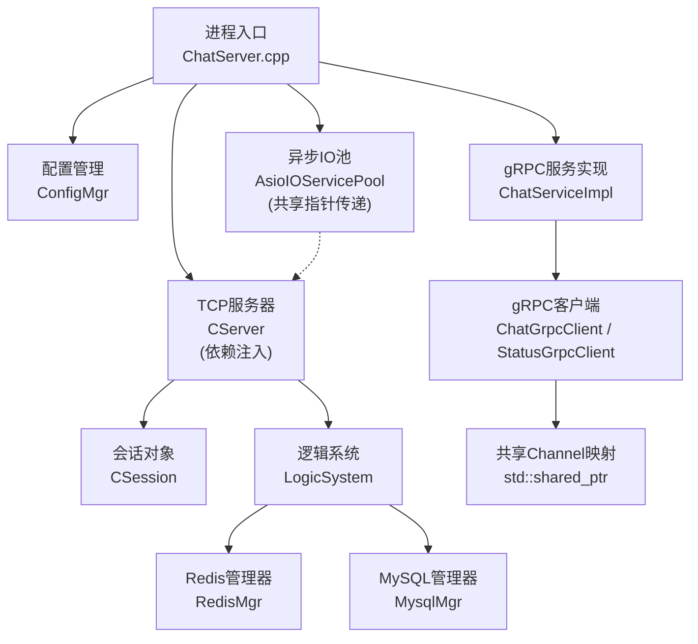
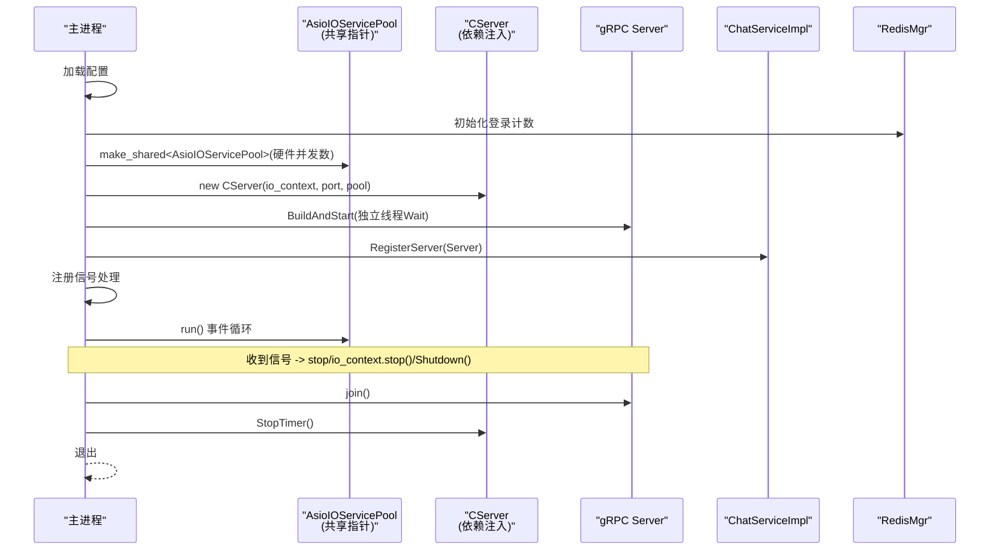
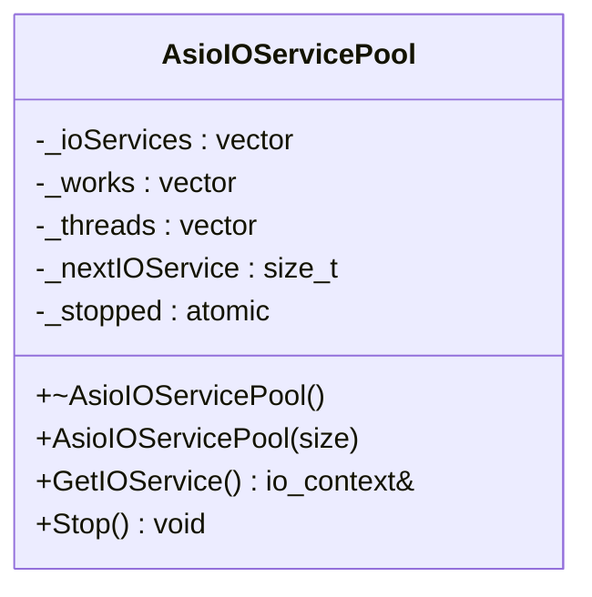
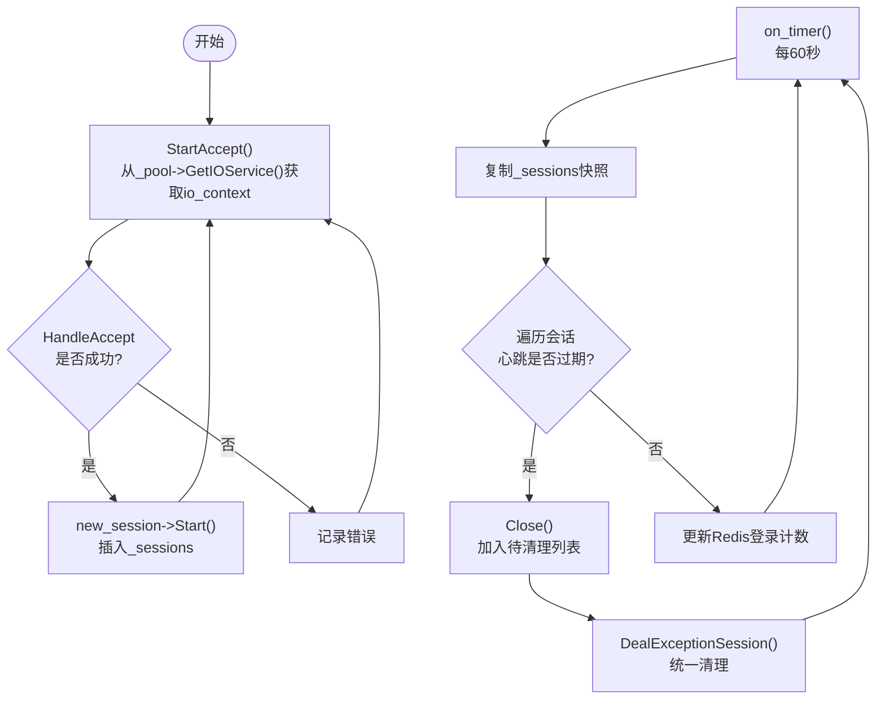
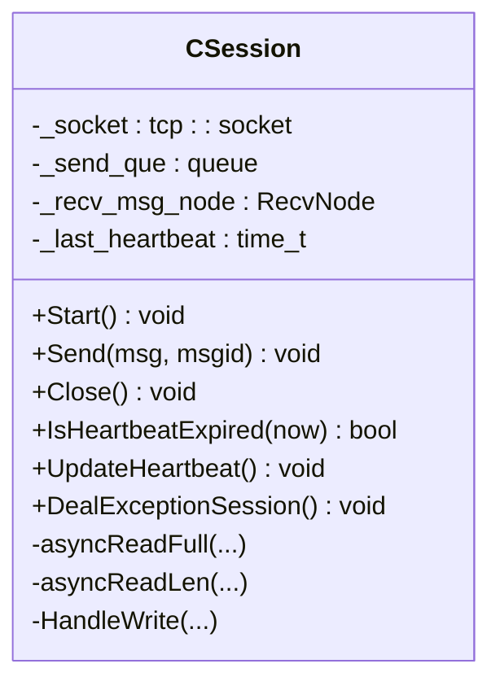
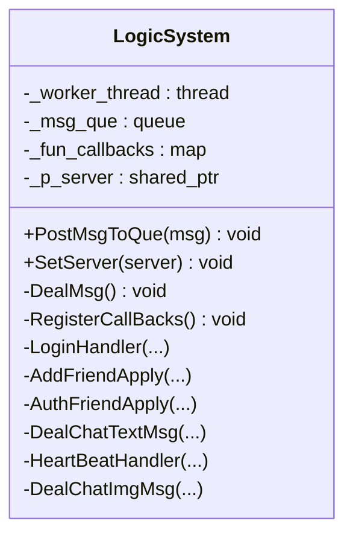
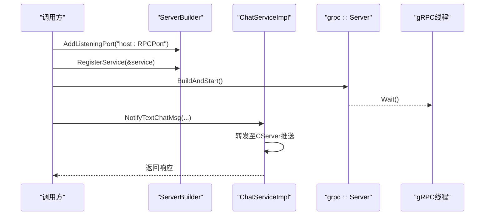
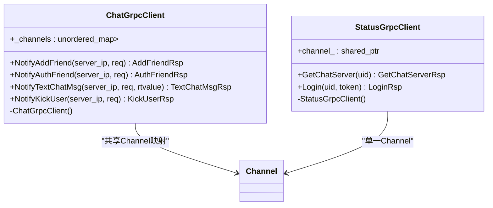
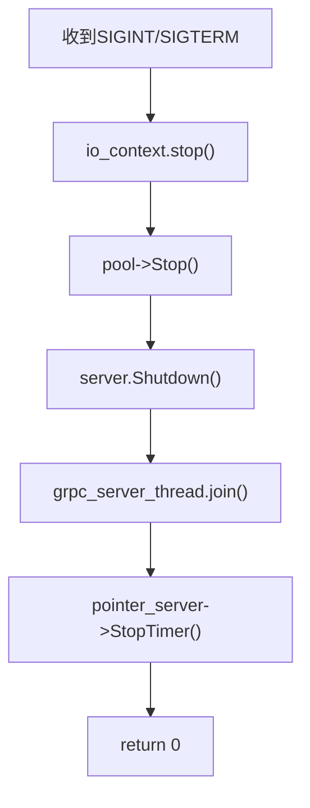
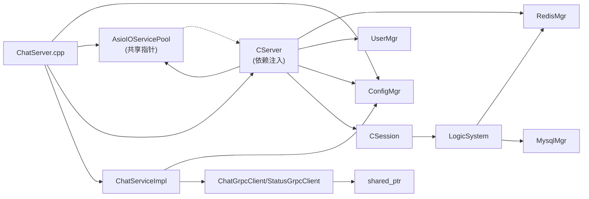

# 核心服务架构

<cite>
**本文引用的文件**   
- [ChatServer.cpp](file://server/ChatServer/src/ChatServer.cpp)
- [CServer.h](file://server/ChatServer/include/CServer.h)
- [CServer.cpp](file://server/ChatServer/src/CServer.cpp)
- [AsioIOServicePool.h](file://server/common/include/AsioIOServicePool.h)
- [AsioIOServicePool.cpp](file://server/common/src/AsioIOServicePool.cpp)
- [ChatServiceImpl.h](file://server/ChatServer/include/ChatServiceImpl.h)
- [ChatGrpcClient.h](file://server/ChatServer/include/ChatGrpcClient.h)
- [ChatGrpcClient.cpp](file://server/ChatServer/src/ChatGrpcClient.cpp)
- [StatusGrpcClient.h](file://server/ChatServer/include/StatusGrpcClient.h)
- [StatusGrpcClient.cpp](file://server/ChatServer/src/StatusGrpcClient.cpp)
- [CSession.h](file://server/ChatServer/include/CSession.h)
- [LogicSystem.h](file://server/ChatServer/include/LogicSystem.h)
- [RedisMgr.h](file://server/ChatServer/include/RedisMgr.h)
- [MysqlMgr.h](file://server/ChatServer/include/MysqlMgr.h)
- [chat.proto](file://proto/chat_service/chat.proto)
- [chatserver1.ini](file://server/ChatServer/config/chatserver1.ini)
</cite>

## 更新摘要
**所做更改**   
- 更新了CServer构造函数设计，现在接受`std::shared_ptr<AsioIOServicePool>`作为参数，移除了对全局状态的依赖
- 增强了AsioIOServicePool的显式生命周期管理说明，从单例模式改为共享指针传递模式
- 完善了依赖注入架构，强调通过构造函数参数进行资源传递的设计模式
- 更新了服务初始化流程，详细说明pool对象的创建和传递过程

## 目录
1. [简介](#简介)
2. [项目结构](#项目结构)
3. [核心组件](#核心组件)
4. [架构总览](#架构总览)
5. [详细组件分析](#详细组件分析)
6. [依赖关系分析](#依赖关系分析)
7. [性能考量](#性能考量)
8. [故障排查指南](#故障排查指南)
9. [结论](#结论)
10. [附录](#附录)

## 简介
本文件面向 ChatServer 核心服务，系统性阐述其启动流程、初始化过程与生命周期管理；深入解析 AsioIOServicePool 的异步 IO 模型（线程池配置、任务调度与资源管理）；详解 CServer 的 TCP 监听、连接管理与事件循环；说明 gRPC 服务的集成方式（服务注册、端口配置与线程隔离）；并覆盖信号处理、优雅关闭、错误处理策略，以及性能监控、日志记录与故障恢复的实现方案。

**重要更新**：CServer构造函数现已重构为接受`std::shared_ptr<AsioIOServicePool>`参数，采用依赖注入模式替代全局状态访问，提升了代码的可测试性和模块化程度。

## 项目结构
ChatServer 采用分层与按功能模块组织的方式：
- 入口与生命周期：main 函数负责配置加载、资源初始化、gRPC 服务与 Asio 事件循环的启动与协调。
- 网络层：CServer 基于 Boost.Asio 实现 TCP 监听与连接管理；CSession 封装单个连接的读写、心跳与异常处理。
- 异步 IO 池：AsioIOServicePool 提供多 io_context 的轮询分发，配合独立线程运行，提升并发吞吐。**已更新** 现通过共享指针在组件间传递，而非全局单例访问。
- 业务逻辑：LogicSystem 作为消息队列与回调中心，解耦网络 I/O 与业务处理。
- 外部依赖：RedisMgr、MysqlMgr 分别封装 Redis 与 MySQL 访问；gRPC 客户端用于跨服务通信。
- 配置：ConfigMgr 读取 INI 配置文件，集中管理各组件参数。

**图表来源**
- [ChatServer.cpp:29-46](file://server/ChatServer/src/ChatServer.cpp#L29-L46)
- [CServer.h:29](file://server/ChatServer/include/CServer.h#L29)
- [AsioIOServicePool.h:10-20](file://server/common/include/AsioIOServicePool.h#L10-L20)

**章节来源**
- [ChatServer.cpp:24-115](file://server/ChatServer/src/ChatServer.cpp#L24-L115)
- [chatserver1.ini:1-30](file://server/ChatServer/config/chatserver1.ini#L1-L30)

## 核心组件
- **AsioIOServicePool**：**已更新** 现采用显式生命周期管理，通过`std::shared_ptr<AsioIOServicePool>`在组件间传递。单例模式已移除，改为由调用方构造和管理。该类实现了多 io_context 并行处理、Work 守卫机制和轮询分配策略等核心功能。
- **CServer**：**已更新** 构造函数现在接受`boost::asio::io_context&`、`short port`和`std::shared_ptr<AsioIOServicePool>`三个参数，通过依赖注入获取异步IO服务池。持有 tcp::acceptor 与定时器，负责接受新连接、维护活跃会话映射、周期性心跳检测与在线人数统计。
- **CSession**：封装 socket 读写、粘包处理、发送队列、心跳时间戳与异常清理。
- **LogicSystem**：单例消息队列，后台工作线程消费消息并路由到具体处理器（登录、好友、聊天、心跳等）。
- **RedisMgr/MysqlMgr**：连接池封装，提供原子操作、健康检查与自动重连能力。
- **gRPC 客户端**：ChatGrpcClient/StatusGrpcClient 使用共享 std::shared_ptr<Channel> 实例与按需 Stub 创建，提供更好的性能和更简单的内存管理。

**章节来源**
- [AsioIOServicePool.h:10-20](file://server/common/include/AsioIOServicePool.h#L10-L20)
- [AsioIOServicePool.cpp:4-18](file://server/common/src/AsioIOServicePool.cpp#L4-L18)
- [CServer.h:29](file://server/ChatServer/include/CServer.h#L29)
- [CServer.cpp:8-14](file://server/ChatServer/src/CServer.cpp#L8-L14)
- [CSession.h:28-76](file://server/ChatServer/include/CSession.h#L28-L76)
- [LogicSystem.h:17-58](file://server/ChatServer/include/LogicSystem.h#L17-58)
- [RedisMgr.h:267-303](file://server/ChatServer/include/RedisMgr.h#L267-L303)
- [MysqlMgr.h:8-39](file://server/ChatServer/include/MysqlMgr.h#L8-L39)
- [ChatGrpcClient.h:33-39](file://server/ChatServer/include/ChatGrpcClient.h#L33-L39)

## 架构总览
ChatServer 以 main 为入口，完成以下关键步骤：
- 加载配置（SelfServer.Name/Host/Port/RPCPort）。
- 初始化 Redis 计数器（登录数置零），设置退出时清理。
- **已更新** 创建 AsioIOServicePool 共享指针，通过`std::make_shared<AsioIOServicePool>(std::thread::hardware_concurrency())`显式构造。
- **已更新** 构造 CServer，传入 io_context、端口号和 pool 共享指针；启动定时器进行心跳检测。
- 构建并启动 gRPC 服务（独立线程 Wait），将 CServer 引用注入到 ChatServiceImpl。
- 注册信号处理（SIGINT/SIGTERM），触发 io_context.stop()、pool.Stop() 与 server.Shutdown()。
- 进入 io_context.run() 事件循环，等待退出信号后依次停止 gRPC、定时器并退出。

**图表来源**
- [ChatServer.cpp:29-46](file://server/ChatServer/src/ChatServer.cpp#L29-L46)
- [CServer.cpp:8-14](file://server/ChatServer/src/CServer.cpp#L8-L14)
- [AsioIOServicePool.cpp:4-18](file://server/common/src/AsioIOServicePool.cpp#L4-L18)
- [ChatServiceImpl.h:48-50](file://server/ChatServer/include/ChatServiceImpl.h#L48-L50)

**章节来源**
- [ChatServer.cpp:24-115](file://server/ChatServer/src/ChatServer.cpp#L24-L115)
- [chatserver1.ini:9-13](file://server/ChatServer/config/chatserver1.ini#L9-L13)

## 详细组件分析

### AsioIOServicePool 异步 IO 模型
**已更新** 该组件已从单例模式重构为显式生命周期管理的共享对象，通过`std::shared_ptr<AsioIOServicePool>`在组件间传递。

- **设计要点**
  - **多 io_context 并行处理**：默认线程数为硬件并发数，每个 io_context 由独立线程驱动，实现真正的多线程并发IO处理。
  - **Work 守卫机制**：确保 run() 不会因无任务提前返回，Stop() 时释放守卫并调用 stop() 使 run() 退出，保证资源正确释放。
  - **轮询分配策略**：GetIOService() 使用 _nextIOService 索引轮询选择 io_context，降低锁竞争，实现负载均衡。
  - **显式生命周期管理**：不再使用全局单例，而是通过构造函数参数传递，提升可测试性和模块化。
- **生命周期管理**
  - **构造阶段**：初始化 io_context、Work 守卫与线程；每个线程执行对应的 io_context.run()。
  - **销毁阶段**：Stop() 遍历所有 io_context 调用 stop()，重置 Work 守卫，join 所有线程确保资源释放。
  - **析构保护**：析构函数自动调用 Stop()，确保资源正确释放。
- **性能优化**
  - GetIOService() O(1) 时间复杂度，无锁或极低锁竞争。
  - 线程数与 CPU 核数匹配，避免上下文切换开销过大。
  - 轮询算法简单高效，适合高并发场景。

**图表来源**
- [AsioIOServicePool.h:21-67](file://server/common/include/AsioIOServicePool.h#L21-L67)
- [AsioIOServicePool.cpp:4-51](file://server/common/src/AsioIOServicePool.cpp#L4-L51)

**章节来源**
- [AsioIOServicePool.h:10-67](file://server/common/include/AsioIOServicePool.h#L10-L67)
- [AsioIOServicePool.cpp:4-51](file://server/common/src/AsioIOServicePool.cpp#L4-L51)

### CServer 服务器核心（TCP 监听、连接管理、事件循环）
**已更新** 构造函数现已重构为接受三个参数：`boost::asio::io_context&`、`short port`和`std::shared_ptr<AsioIOServicePool>`，采用依赖注入模式。

- **职责范围**
  - 持有 tcp::acceptor 与 steady_timer，启动 Accept 循环。
  - 维护 _sessions 映射（session_id -> shared_ptr<CSession>），线程安全访问。
  - 定时任务：每 60s 扫描会话，检测心跳过期，关闭并清理异常连接，更新 Redis 登录计数。
  - **已更新** 通过构造函数接收 AsioIOServicePool 共享指针，用于获取 io_context 进行异步操作。
- **事件处理流程**
  - StartAccept() 从 AsioIOServicePool 获取 io_context，异步接受连接，回调 HandleAccept() 启动会话并注册到 _sessions。
  - on_timer() 复制 _sessions 快照，遍历判断 IsHeartbeatExpired，收集需清理的 session，统一 DealExceptionSession() 处理。
- **性能与安全考虑**
  - 使用互斥锁保护 _sessions；定时器内拷贝快照避免长时间持锁。
  - 心跳过期处理在定时器外进行，减少锁竞争与阻塞风险。
  - **已更新** 依赖注入模式消除了全局状态依赖，提升了代码的可测试性。

**图表来源**
- [CServer.cpp:34-38](file://server/ChatServer/src/CServer.cpp#L34-L38)
- [CServer.cpp:75-118](file://server/ChatServer/src/CServer.cpp#L75-L118)

**章节来源**
- [CServer.h:29](file://server/ChatServer/include/CServer.h#L29)
- [CServer.cpp:8-14](file://server/ChatServer/src/CServer.cpp#L8-L14)
- [CServer.cpp:34-38](file://server/ChatServer/src/CServer.cpp#L34-L38)
- [CServer.cpp:75-118](file://server/ChatServer/src/CServer.cpp#L75-L118)

### CSession 会话与心跳
- **核心功能**
  - 封装 socket 读写、粘包处理（头+体）、发送队列与互斥锁。
  - 心跳时间戳 atomic<time_t>，支持 IsHeartbeatExpired、UpdateHeartbeat。
  - 异常处理：Close() 触发底层错误回调，DealExceptionSession() 清理关联状态。
- **数据流转**
  - 接收：AsyncReadHead -> AsyncReadBody -> 组装 RecvNode -> 投递 LogicSystem。
  - 发送：Send() 入队，异步写回调 HandleWrite 顺序出队发送。

**图表来源**
- [CSession.h:28-76](file://server/ChatServer/include/CSession.h#L28-L76)

**章节来源**
- [CSession.h:28-76](file://server/ChatServer/include/CSession.h#L28-L76)

### LogicSystem 逻辑系统与消息队列
- **设计架构**
  - 单例，内部维护消息队列与回调表，后台工作线程消费消息并分派到具体处理器。
  - 支持登录、搜索、好友申请/认证、文本聊天、心跳、图片消息等处理器。
- **交互机制**
  - CSession 将收到的消息封装为 LogicNode 投递到 LogicSystem。
  - LogicSystem 根据消息类型调用对应处理器，必要时调用 CServer 推送消息给目标会话。

**图表来源**
- [LogicSystem.h:17-58](file://server/ChatServer/include/LogicSystem.h#L17-58)

**章节来源**
- [LogicSystem.h:17-58](file://server/ChatServer/include/LogicSystem.h#L17-58)

### gRPC 服务集成（注册、端口、线程隔离）
- **服务定义**
  - chat.proto 定义了 ChatService 接口（好友申请、认证、文本聊天、踢人、图片通知）。
- **服务实现**
  - ChatServiceImpl 继承 ChatService::Service，实现各 RPC 方法，并通过 RegisterServer(CServer) 注入服务器引用，以便推送消息。
- **启动与线程隔离**
  - main 中构建 grpc::ServerBuilder，添加监听端口（来自配置 SelfServer.RPCPort），注册服务，BuildAndStart() 后在独立线程 Wait()，与 Asio 事件循环隔离。
- **客户端设计**：ChatGrpcClient/StatusGrpcClient 使用共享 std::shared_ptr<Channel> 实例与按需 Stub 创建，替代了复杂的连接池类设计。

**图表来源**
- [ChatServer.cpp:73-87](file://server/ChatServer/src/ChatServer.cpp#L73-L87)
- [ChatServiceImpl.h:29-53](file://server/ChatServer/include/ChatServiceImpl.h#L29-53)
- [chat.proto:6-12](file://proto/chat_service/chat.proto#L6-L12)

**章节来源**
- [ChatServer.cpp:73-87](file://server/ChatServer/src/ChatServer.cpp#L73-L87)
- [ChatServiceImpl.h:29-53](file://server/ChatServer/include/ChatServiceImpl.h#L29-53)
- [chat.proto:6-12](file://proto/chat_service/chat.proto#L6-L12)

### gRPC 客户端架构（共享Channel与按需Stub创建）
- **新架构设计**
  - **共享Channel管理**：ChatGrpcClient维护unordered_map<std::string, std::shared_ptr<Channel>>映射，按节点名存储共享Channel实例。
  - **按需Stub创建**：每次RPC调用时通过ChatService::NewStub(channel_)创建临时Stub，避免连接池管理的复杂性。
  - **自动资源管理**：std::shared_ptr确保Channel的生命周期管理，析构时自动清理资源。
- **实现细节**
  - **构造函数**：从配置文件读取PeerServer配置，为每个对端节点创建共享Channel。
  - **RPC调用**：查找对应Channel，创建Stub，设置超时（3秒），执行调用，自动清理Stub。
  - **错误处理**：统一的错误码设置，失败时返回ErrorCodes::RPCFailed。
- **跨服务一致性**：GateServer、ResourceServer、StatusServer中的gRPC客户端都采用了相同的共享Channel模式。

**图表来源**
- [ChatGrpcClient.h:94-96](file://server/ChatServer/include/ChatGrpcClient.h#L94-L96)
- [StatusGrpcClient.h:52-53](file://server/ChatServer/include/StatusGrpcClient.h#L52-L53)
- [ChatGrpcClient.cpp:23-28](file://server/ChatServer/src/ChatGrpcClient.cpp#L23-L28)
- [StatusGrpcClient.cpp:42-48](file://server/ChatServer/src/StatusGrpcClient.cpp#L42-L48)

**章节来源**
- [ChatGrpcClient.h:33-39](file://server/ChatServer/include/ChatGrpcClient.h#L33-L39)
- [ChatGrpcClient.h:94-96](file://server/ChatServer/include/ChatGrpcClient.h#L94-L96)
- [ChatGrpcClient.cpp:9-28](file://server/ChatServer/src/ChatGrpcClient.cpp#L9-L28)
- [StatusGrpcClient.h:18-24](file://server/ChatServer/include/StatusGrpcClient.h#L18-L24)
- [StatusGrpcClient.h:52-53](file://server/ChatServer/include/StatusGrpcClient.h#L52-L53)
- [StatusGrpcClient.cpp:42-48](file://server/ChatServer/src/StatusGrpcClient.cpp#L42-L48)

### 信号处理与优雅关闭
- **信号注册**：使用 boost::asio::signal_set 监听 SIGINT/SIGTERM。
- **处理流程**：io_context.stop() 停止 Asio 事件循环；pool.Stop() 停止所有 io_context 并 join 线程；server.Shutdown() 优雅关闭 gRPC 服务。
- **退出顺序**：先停止 Asio，再 join gRPC 线程，最后停止定时器并退出。

**图表来源**
- [ChatServer.cpp:93-98](file://server/ChatServer/src/ChatServer.cpp#L93-L98)

**章节来源**
- [ChatServer.cpp:93-98](file://server/ChatServer/src/ChatServer.cpp#L93-L98)

### 错误处理策略
- **网络层**：HandleAccept 失败打印错误；CSession 写回调 HandleWrite 处理错误码；定时器 on_timer 捕获 ec 并记录。
- **资源层**：Redis 连接池健康检查与自动重连；gRPC 客户端连接池支持 Close() 与条件变量唤醒。
- **业务层**：LogicSystem 处理器可捕获异常并返回错误码；CServer 清理异常会话时调用 DealExceptionSession。
- **gRPC客户端错误处理**：统一的错误码设置，超时和连接失败都返回ErrorCodes::RPCFailed，便于上层统一处理。

**章节来源**
- [CServer.cpp:21-32](file://server/ChatServer/src/CServer.cpp#L21-L32)
- [CServer.cpp:75-79](file://server/ChatServer/src/CServer.cpp#L75-L79)
- [RedisMgr.h:137-206](file://server/ChatServer/include/RedisMgr.h#L137-L206)
- [ChatGrpcClient.cpp:51-54](file://server/ChatServer/src/ChatGrpcClient.cpp#L51-L54)
- [StatusGrpcClient.cpp:15-18](file://server/ChatServer/src/StatusGrpcClient.cpp#L15-L18)

## 依赖关系分析
**已更新** 依赖关系已重构，采用依赖注入模式替代全局状态访问。

- **组件耦合**
  - ChatServer.cpp 依赖 ConfigMgr、AsioIOServicePool（通过共享指针）、CServer（通过依赖注入）、RedisMgr、ChatServiceImpl。
  - CServer 依赖 AsioIOServicePool（通过构造函数参数）、UserMgr、RedisMgr、ConfigMgr。
  - LogicSystem 依赖 CSession、CServer、RedisMgr、MysqlMgr。
  - gRPC 客户端依赖各自 Channel 与 Stub 连接池。
- **潜在循环依赖**
  - ChatServiceImpl 持有 CServer 引用，但仅用于推送消息，不反向依赖 CServer 构造，避免循环。
- **外部依赖**
  - Boost.Asio/Beast、gRPC、hiredis、MySQL、nlohmann/json。

**图表来源**
- [ChatServer.cpp:29-46](file://server/ChatServer/src/ChatServer.cpp#L29-L46)
- [CServer.h:29](file://server/ChatServer/include/CServer.h#L29)
- [LogicSystem.h:17-58](file://server/ChatServer/include/LogicSystem.h#L17-58)
- [ChatGrpcClient.h:94-96](file://server/ChatServer/include/ChatGrpcClient.h#L94-L96)

**章节来源**
- [ChatServer.cpp:29-46](file://server/ChatServer/src/ChatServer.cpp#L29-L46)
- [CServer.h:29](file://server/ChatServer/include/CServer.h#L29)
- [LogicSystem.h:17-58](file://server/ChatServer/include/LogicSystem.h#L17-58)

## 性能考量
- **异步 IO 模型优化**
  - 多 io_context 并行处理，轮询分配策略避免热点；Work 守卫机制保证 run() 不退。
  - 每个 io_context 独立线程运行，充分利用多核CPU性能。
  - **已更新** 共享指针传递避免了全局状态访问的开销，提升了缓存局部性。
- **定时器与心跳优化**
  - 60s 周期扫描，快照 _sessions 降低锁竞争；过期会话批量清理减少锁持有时间。
- **连接池管理**
  - Redis/gRPC 连接池复用连接，减少握手开销；健康检查与自动重连提升可用性。
- **内存与序列化优化**
  - 使用 nlohmann/json 进行结构化数据交换，注意大对象序列化成本；建议按需裁剪字段。
- **线程隔离设计**
  - gRPC 服务独立线程，避免阻塞 Asio 事件循环；LogicSystem 单独工作线程处理业务。
  - AsioIOServicePool 的多线程模型有效分散IO负载。
- **gRPC客户端性能优化**：共享Channel模式减少了连接建立开销，按需Stub创建避免了连接池管理的复杂性，std::shared_ptr提供了高效的内存管理。
- **依赖注入优势**：**新增** 通过构造函数参数传递依赖，避免了全局状态访问的性能开销，提升了代码的可测试性和模块化程度。

## 故障排查指南
- **常见问题定位**
  - 连接失败：检查 CServer::HandleAccept 错误输出；确认端口与防火墙。
  - 心跳超时：查看 on_timer 日志；确认客户端心跳频率与阈值。
  - Redis 不可用：观察 RedisConPool 健康检查日志；检查 AUTH 与 PING 结果。
  - gRPC 调用失败：检查 ChatGrpcClient/StatusGrpcClient 连接池状态与错误码。
  - AsioIOServicePool问题：检查线程数量是否与CPU核数匹配，确认轮询分配是否正常。
  - **gRPC客户端问题**：检查共享Channel映射是否正确初始化，确认超时设置是否合理，验证错误码处理逻辑。
  - **依赖注入问题**：**新增** 检查AsioIOServicePool共享指针是否正确传递，确认CServer构造函数参数顺序和类型匹配。
- **调试手段**
  - 启用详细日志（如 cout/cerr）；结合配置文件调整日志级别。
  - 使用 strace/ltrace 或平台工具跟踪系统调用。
  - 监控 AsioIOServicePool 的线程状态和 io_context 使用情况。
  - **gRPC客户端调试**：检查Channel创建日志，监控Stub创建频率，分析超时和连接失败原因。
  - **依赖注入调试**：**新增** 检查智能指针的生命周期管理，确认shared_ptr的引用计数和析构顺序。
- **恢复策略**
  - Redis 自动重连；gRPC 连接池 Close() 后重建；CServer 定时器重启。
  - AsioIOServicePool 的 Stop() 方法确保所有资源正确释放。
  - **gRPC客户端恢复**：共享Channel自动管理，无需手动重建；超时重试机制确保调用可靠性。
  - **依赖注入恢复**：**新增** 重新构造AsioIOServicePool并传递给CServer，确保智能指针正确管理生命周期。

**章节来源**
- [CServer.cpp:21-32](file://server/ChatServer/src/CServer.cpp#L21-L32)
- [CServer.cpp:75-79](file://server/ChatServer/src/CServer.cpp#L75-L79)
- [RedisMgr.h:137-206](file://server/ChatServer/include/RedisMgr.h#L137-L206)
- [ChatGrpcClient.cpp:51-54](file://server/ChatServer/src/ChatGrpcClient.cpp#L51-L54)
- [StatusGrpcClient.cpp:15-18](file://server/ChatServer/src/StatusGrpcClient.cpp#L15-L18)

## 结论
ChatServer 通过 AsioIOServicePool 的多 io_context 模型与 CServer 的事件循环实现了高并发 TCP 服务；LogicSystem 解耦了 I/O 与业务；gRPC 服务独立线程运行，便于扩展与隔离。整体架构清晰、可扩展性强，具备完善的信号处理与优雅关闭机制，适合大规模分布式聊天场景。**重要改进**：CServer构造函数现已重构为接受`std::shared_ptr<AsioIOServicePool>`参数，采用依赖注入模式替代全局状态访问，显著提升了代码的可测试性和模块化程度。AsioIOServicePool 的显式生命周期管理进一步增强了资源的可控性和安全性。

## 附录
- **配置项参考（示例）**
  - SelfServer.Name/Host/Port/RPCPort：服务标识、监听地址、TCP 端口与 gRPC 端口。
  - Redis/Mysql：数据库主机、端口、用户与密码。
  - PeerServer：对端 ChatServer 列表，用于跨服通信。
  - StatusServer：状态服务器配置，用于负载均衡和服务发现。
  - VarifyServer：验证码服务配置，用于邮箱验证等功能。

**章节来源**
- [chatserver1.ini:1-30](file://server/ChatServer/config/chatserver1.ini#L1-L30)