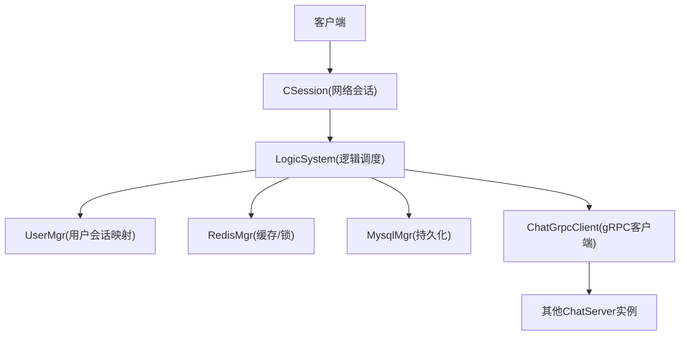
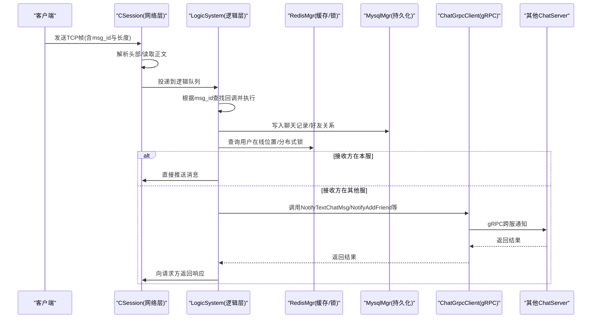
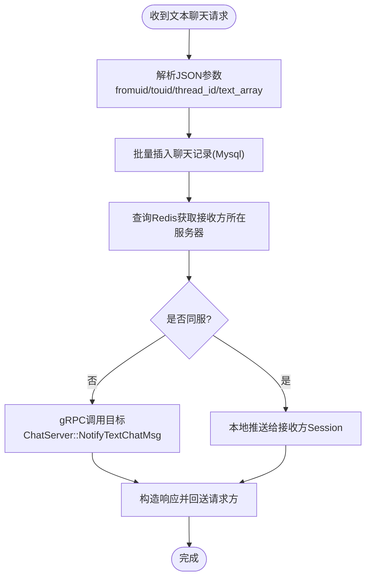
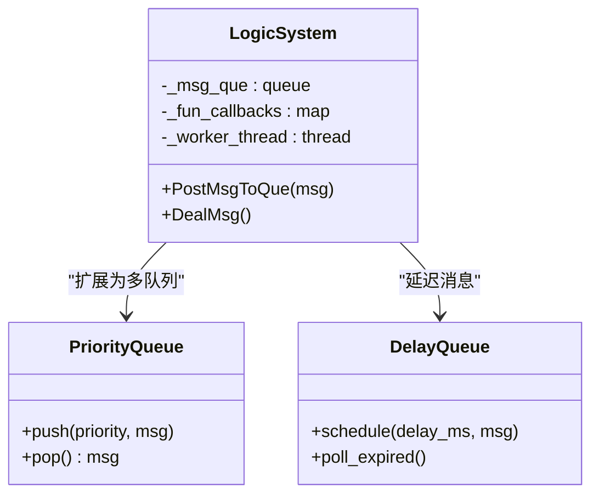
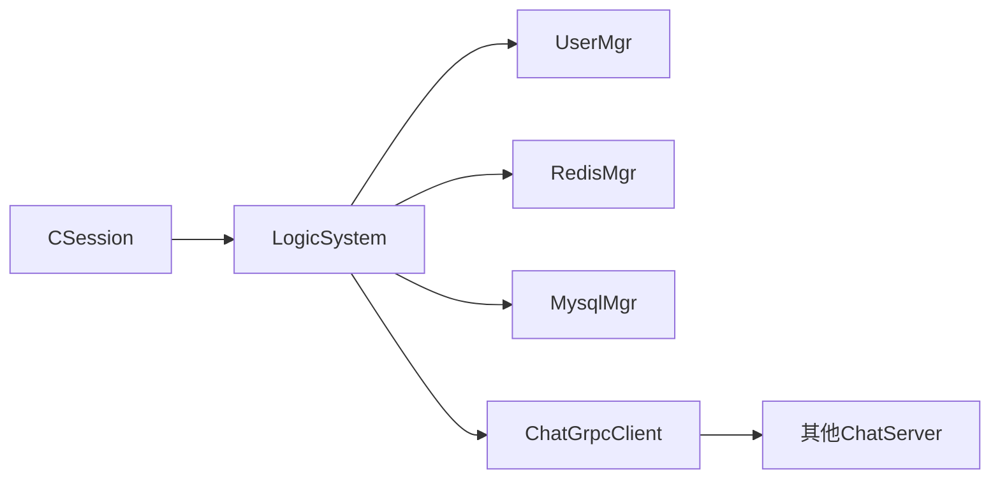
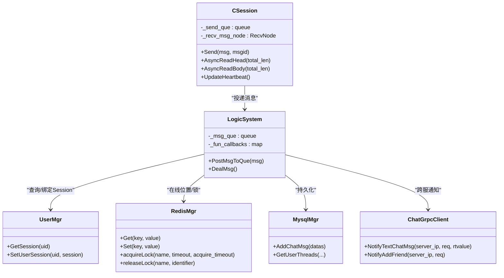
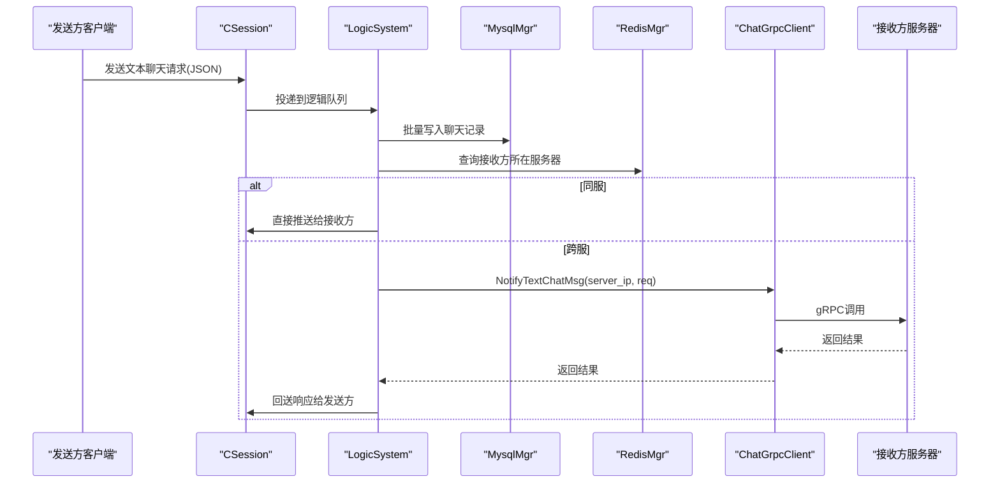

# 消息路由

<cite>
**本文引用的文件**   
- [chat.proto](file://proto/chat_service/chat.proto)
- [const.h](file://server/ChatServer/include/const.h)
- [data.h](file://server/ChatServer/include/data.h)
- [MsgNode.h](file://server/ChatServer/include/MsgNode.h)
- [CSession.h](file://server/ChatServer/include/CSession.h)
- [CSession.cpp](file://server/ChatServer/src/CSession.cpp)
- [LogicSystem.h](file://server/ChatServer/include/LogicSystem.h)
- [LogicSystem.cpp](file://server/ChatServer/src/LogicSystem.cpp)
- [UserMgr.h](file://server/ChatServer/include/UserMgr.h)
- [RedisMgr.h](file://server/ChatServer/include/RedisMgr.h)
- [MysqlDao.h](file://server/ChatServer/include/MysqlDao.h)
- [MysqlMgr.h](file://server/ChatServer/include/MysqlMgr.h)
- [ChatGrpcClient.h](file://server/ChatServer/include/ChatGrpcClient.h)
</cite>

## 目录
1. [简介](#简介)
2. [项目结构](#项目结构)
3. [核心组件](#核心组件)
4. [架构总览](#架构总览)
5. [详细组件分析](#详细组件分析)
6. [依赖关系分析](#依赖关系分析)
7. [性能考量](#性能考量)
8. [故障排查指南](#故障排查指南)
9. [结论](#结论)
10. [附录](#附录)

## 简介
本文件为 ChatServer 消息路由系统的技术文档，围绕以下目标展开：
- 协议设计：基于 Protocol Buffers 的消息定义、类型与序列化格式。
- 路由算法：点对点传输、跨服广播与负载均衡策略。
- 优先级调度：紧急、普通、延迟消息的队列与调度机制。
- 可靠性保证：确认机制、重传策略与去重处理。
- 过滤与转发：黑名单、白名单与内容过滤规则。
- 监控统计与优化：可观测性指标与性能调优建议。

## 项目结构
ChatServer 的消息路由由网络层（会话）、逻辑层（处理器）、存储层（MySQL/Redis）与跨服务通信（gRPC）共同组成。关键文件与职责如下：
- 协议定义：proto/chat_service/chat.proto
- 常量与枚举：include/const.h
- 数据模型：include/data.h
- 网络会话：include/CSession.h, src/CSession.cpp
- 逻辑调度：include/LogicSystem.h, src/LogicSystem.cpp
- 用户会话管理：include/UserMgr.h
- 缓存与分布式锁：include/RedisMgr.h
- 数据库访问：include/MysqlDao.h, include/MysqlMgr.h
- 跨服务通信：include/ChatGrpcClient.h

图表来源
- [CSession.h](file://server/ChatServer/include/CSession.h)
- [CSession.cpp](file://server/ChatServer/src/CSession.cpp)
- [LogicSystem.h](file://server/ChatServer/include/LogicSystem.h)
- [LogicSystem.cpp](file://server/ChatServer/src/LogicSystem.cpp)
- [UserMgr.h](file://server/ChatServer/include/UserMgr.h)
- [RedisMgr.h](file://server/ChatServer/include/RedisMgr.h)
- [MysqlMgr.h](file://server/ChatServer/include/MysqlMgr.h)
- [ChatGrpcClient.h](file://server/ChatServer/include/ChatGrpcClient.h)

章节来源
- [chat.proto:1-105](file://proto/chat_service/chat.proto#L1-L105)
- [const.h:1-104](file://server/ChatServer/include/const.h#L1-L104)
- [data.h:1-65](file://server/ChatServer/include/data.h#L1-L65)
- [CSession.h:1-86](file://server/ChatServer/include/CSession.h#L1-L86)
- [CSession.cpp:1-200](file://server/ChatServer/src/CSession.cpp#L1-L200)
- [LogicSystem.h:1-60](file://server/ChatServer/include/LogicSystem.h#L1-L60)
- [LogicSystem.cpp:1-800](file://server/ChatServer/src/LogicSystem.cpp#L1-L800)
- [UserMgr.h:1-22](file://server/ChatServer/include/UserMgr.h#L1-L22)
- [RedisMgr.h:1-305](file://server/ChatServer/include/RedisMgr.h#L1-L305)
- [MysqlDao.h:1-270](file://server/ChatServer/include/MysqlDao.h#L1-L270)
- [MysqlMgr.h:1-41](file://server/ChatServer/include/MysqlMgr.h#L1-L41)
- [ChatGrpcClient.h:1-116](file://server/ChatServer/include/ChatGrpcClient.h#L1-L116)

## 核心组件
- 协议与消息类型
  - 文本聊天、图片通知、好友申请/认证、踢人等 RPC 接口与消息体定义在 chat.proto。
  - 内部二进制帧头包含消息ID与长度，用于粘包/拆包与快速路由。
- 网络会话层
  - CSession 负责 TCP 读写、头部解析、发送队列与心跳维护。
- 逻辑调度层
  - LogicSystem 维护消息回调表，单线程消费队列，按 msg_id 分发到具体处理器。
- 用户与会话映射
  - UserMgr 维护 uid -> session 的映射，支持在线状态查询与踢人。
- 缓存与分布式锁
  - RedisMgr 提供连接池、键值操作与分布式锁实现。
- 持久化
  - MysqlMgr/MysqlDao 提供连接池、健康检查与常用业务 SQL 封装。
- 跨服务通信
  - ChatGrpcClient 维护 gRPC Stub 连接池，调用远端 ChatService 进行跨服消息投递。

章节来源
- [chat.proto:1-105](file://proto/chat_service/chat.proto#L1-L105)
- [const.h:1-104](file://server/ChatServer/include/const.h#L1-L104)
- [CSession.h:1-86](file://server/ChatServer/include/CSession.h#L1-L86)
- [CSession.cpp:1-200](file://server/ChatServer/src/CSession.cpp#L1-L200)
- [LogicSystem.h:1-60](file://server/ChatServer/include/LogicSystem.h#L1-L60)
- [LogicSystem.cpp:1-800](file://server/ChatServer/src/LogicSystem.cpp#L1-L800)
- [UserMgr.h:1-22](file://server/ChatServer/include/UserMgr.h#L1-L22)
- [RedisMgr.h:1-305](file://server/ChatServer/include/RedisMgr.h#L1-L305)
- [MysqlDao.h:1-270](file://server/ChatServer/include/MysqlDao.h#L1-L270)
- [MysqlMgr.h:1-41](file://server/ChatServer/include/MysqlMgr.h#L1-L41)
- [ChatGrpcClient.h:1-116](file://server/ChatServer/include/ChatGrpcClient.h#L1-L116)

## 架构总览
下图展示了从客户端接入到消息落库与投递的核心流程，以及跨服 gRPC 的协作方式。

图表来源
- [CSession.cpp:1-200](file://server/ChatServer/src/CSession.cpp#L1-L200)
- [LogicSystem.cpp:1-800](file://server/ChatServer/src/LogicSystem.cpp#L1-L800)
- [RedisMgr.h:1-305](file://server/ChatServer/include/RedisMgr.h#L1-L305)
- [MysqlMgr.h:1-41](file://server/ChatServer/include/MysqlMgr.h#L1-L41)
- [ChatGrpcClient.h:1-116](file://server/ChatServer/include/ChatGrpcClient.h#L1-L116)
- [chat.proto:1-105](file://proto/chat_service/chat.proto#L1-L105)

## 详细组件分析

### 协议设计与序列化
- ProtoBuf 接口与消息
  - ChatService 提供好友申请、认证、文本聊天、图片通知、踢人等 RPC。
  - TextChatData/TextChatMsgReq/Rsp 承载文本消息；NotifyChatImgReq/Rsp 承载图片通知。
- 内部二进制帧
  - 头部固定长度，包含消息ID与数据长度字段，便于快速路由与粘包处理。
  - 消息ID定义于 const.h 的 MSG_IDS，覆盖登录、搜索、好友、聊天、心跳、加载线程/消息、图片消息、文件同步等。
- 序列化格式
  - 客户端与服务端之间使用自定义二进制帧；跨服务间通过 gRPC + Protobuf 序列化。

章节来源
- [chat.proto:1-105](file://proto/chat_service/chat.proto#L1-L105)
- [const.h:1-104](file://server/ChatServer/include/const.h#L1-L104)

### 消息路由算法
- 点对点传输
  - 通过 Redis 中 USERIPPREFIX 记录用户所在服务器名称，若同服则直接推送；否则通过 gRPC 转发至目标服务器。
- 群发广播
  - 当前代码未实现群聊广播；可扩展为基于 thread_id 或 group_id 的订阅者集合，结合 Redis 列表/集合进行广播。
- 负载均衡
  - 登录时通过分布式锁避免重复登录；跨服踢人通过 gRPC 通知。未来可在多实例下基于用户哈希或一致性哈希选择目标节点。

图表来源
- [LogicSystem.cpp:472-566](file://server/ChatServer/src/LogicSystem.cpp#L472-L566)
- [RedisMgr.h:1-305](file://server/ChatServer/include/RedisMgr.h#L1-L305)
- [ChatGrpcClient.h:1-116](file://server/ChatServer/include/ChatGrpcClient.h#L1-L116)
- [chat.proto:1-105](file://proto/chat_service/chat.proto#L1-L105)

章节来源
- [LogicSystem.cpp:472-566](file://server/ChatServer/src/LogicSystem.cpp#L472-L566)
- [UserMgr.h:1-22](file://server/ChatServer/include/UserMgr.h#L1-L22)
- [RedisMgr.h:1-305](file://server/ChatServer/include/RedisMgr.h#L1-L305)
- [ChatGrpcClient.h:1-116](file://server/ChatServer/include/ChatGrpcClient.h#L1-L116)

### 消息优先级与调度
- 当前实现
  - LogicSystem 使用单线程队列 + 条件变量唤醒，顺序消费，无优先级区分。
- 建议方案
  - 引入多级队列（紧急/普通/延迟），按优先级出队；延迟消息可通过时间轮或延时队列实现。
  - 对高优先级通道（如系统通知、踢人）设置独立队列与更高权重。

图表来源
- [LogicSystem.h:1-60](file://server/ChatServer/include/LogicSystem.h#L1-L60)
- [LogicSystem.cpp:1-800](file://server/ChatServer/src/LogicSystem.cpp#L1-L800)

章节来源
- [LogicSystem.h:1-60](file://server/ChatServer/include/LogicSystem.h#L1-L60)
- [LogicSystem.cpp:1-800](file://server/ChatServer/src/LogicSystem.cpp#L1-L800)

### 可靠性保证
- 确认机制
  - 文本聊天请求会返回 ID_TEXT_CHAT_MSG_RSP；跨服调用返回 TextChatMsgRsp。
- 重传策略
  - 当前未实现应用层重传；建议在客户端侧对超时未确认的消息进行指数退避重传。
- 去重处理
  - 使用 unique_id 作为消息唯一标识，服务端可基于 Redis Set 或数据库唯一索引去重。
- 幂等性
  - 对于好友申请/认证等写操作，建议在数据库层加唯一约束或在 Redis 中记录已处理标记。

章节来源
- [chat.proto:1-105](file://proto/chat_service/chat.proto#L1-L105)
- [LogicSystem.cpp:472-566](file://server/ChatServer/src/LogicSystem.cpp#L472-L566)
- [const.h:1-104](file://server/ChatServer/include/const.h#L1-L104)

### 过滤与转发规则
- 黑名单/白名单
  - 当前未实现；可在 LogicSystem 处理器前增加过滤器，基于 Redis 中的黑名单/白名单集合判断。
- 内容过滤
  - 建议在入库前对 content 进行敏感词检测与长度校验，超限或违规直接拒绝。
- 转发规则
  - 同服直推，跨服走 gRPC；未来可增加按 thread_id/group_id 的订阅转发。

章节来源
- [LogicSystem.cpp:472-566](file://server/ChatServer/src/LogicSystem.cpp#L472-L566)
- [RedisMgr.h:1-305](file://server/ChatServer/include/RedisMgr.h#L1-L305)

### 监控、统计与性能优化
- 监控指标
  - 建议采集：队列长度、处理耗时、gRPC 调用成功率/延迟、Redis/MySQL 连接池使用率、心跳超时率。
- 日志与追踪
  - 为每条消息生成 trace_id，贯穿网络层、逻辑层、存储层与跨服调用。
- 性能优化
  - 将 LogicSystem 的单队列升级为多队列/分片队列，降低锁竞争。
  - 批量写入 MySQL，减少事务开销。
  - 对热点用户信息采用本地缓存 + 失效策略。
  - 调整发送队列上限 MAX_SENDQUE，防止内存暴涨。

章节来源
- [CSession.cpp:1-200](file://server/ChatServer/src/CSession.cpp#L1-L200)
- [RedisMgr.h:1-305](file://server/ChatServer/include/RedisMgr.h#L1-L305)
- [MysqlDao.h:1-270](file://server/ChatServer/include/MysqlDao.h#L1-L270)

## 依赖关系分析
- 组件耦合
  - CSession 依赖 LogicSystem 进行消息投递；LogicSystem 依赖 UserMgr、RedisMgr、MysqlMgr、ChatGrpcClient。
- 外部依赖
  - Redis：用户在线位置、分布式锁、缓存。
  - MySQL：用户信息、好友关系、聊天记录。
  - gRPC：跨服消息通知。

图表来源
- [CSession.h:1-86](file://server/ChatServer/include/CSession.h#L1-L86)
- [LogicSystem.h:1-60](file://server/ChatServer/include/LogicSystem.h#L1-L60)
- [UserMgr.h:1-22](file://server/ChatServer/include/UserMgr.h#L1-L22)
- [RedisMgr.h:1-305](file://server/ChatServer/include/RedisMgr.h#L1-L305)
- [MysqlMgr.h:1-41](file://server/ChatServer/include/MysqlMgr.h#L1-L41)
- [ChatGrpcClient.h:1-116](file://server/ChatServer/include/ChatGrpcClient.h#L1-L116)

章节来源
- [CSession.h:1-86](file://server/ChatServer/include/CSession.h#L1-L86)
- [LogicSystem.h:1-60](file://server/ChatServer/include/LogicSystem.h#L1-L60)
- [UserMgr.h:1-22](file://server/ChatServer/include/UserMgr.h#L1-L22)
- [RedisMgr.h:1-305](file://server/ChatServer/include/RedisMgr.h#L1-L305)
- [MysqlMgr.h:1-41](file://server/ChatServer/include/MysqlMgr.h#L1-L41)
- [ChatGrpcClient.h:1-116](file://server/ChatServer/include/ChatGrpcClient.h#L1-L116)

## 性能考量
- 网络层
  - 异步读写、发送队列限流、心跳超时清理。
- 逻辑层
  - 单线程队列简单可靠，但存在瓶颈；建议分片或多队列。
- 存储层
  - MySQL/Redis 连接池与保活检查，避免连接泄漏与抖动。
- 跨服
  - gRPC 连接池复用，避免频繁建立连接。

[本节为通用指导，不直接分析具体文件]

## 故障排查指南
- 常见问题定位
  - 消息未达：检查 Redis 中用户在线位置是否正确；查看 gRPC 调用是否成功。
  - 重复消息：核对 unique_id 是否一致；检查去重逻辑是否生效。
  - 登录冲突：分布式锁是否释放；旧 Session 是否被踢下线。
- 调试建议
  - 打印 msg_id 与处理路径；记录 gRPC 请求/响应；观察队列长度与耗时。
  - 关注心跳超时与异常连接清理。

章节来源
- [LogicSystem.cpp:1-800](file://server/ChatServer/src/LogicSystem.cpp#L1-L800)
- [CSession.cpp:1-200](file://server/ChatServer/src/CSession.cpp#L1-L200)
- [RedisMgr.h:1-305](file://server/ChatServer/include/RedisMgr.h#L1-L305)

## 结论
ChatServer 的消息路由以“网络会话 + 逻辑调度 + 缓存/持久化 + gRPC”为核心，实现了可靠的点对点消息投递与跨服通知。当前版本具备基础的路由与确认能力，尚未实现优先级调度、群发广播与完善的过滤机制。后续可在此基础上扩展多队列、延迟队列、内容过滤与监控体系，以提升吞吐与可观测性。

[本节为总结性内容，不直接分析具体文件]

## 附录

### 类图：核心对象关系

图表来源
- [CSession.h:1-86](file://server/ChatServer/include/CSession.h#L1-L86)
- [LogicSystem.h:1-60](file://server/ChatServer/include/LogicSystem.h#L1-L60)
- [UserMgr.h:1-22](file://server/ChatServer/include/UserMgr.h#L1-L22)
- [RedisMgr.h:1-305](file://server/ChatServer/include/RedisMgr.h#L1-L305)
- [MysqlMgr.h:1-41](file://server/ChatServer/include/MysqlMgr.h#L1-L41)
- [ChatGrpcClient.h:1-116](file://server/ChatServer/include/ChatGrpcClient.h#L1-L116)

### 序列图：文本聊天端到端流程

图表来源
- [CSession.cpp:1-200](file://server/ChatServer/src/CSession.cpp#L1-L200)
- [LogicSystem.cpp:472-566](file://server/ChatServer/src/LogicSystem.cpp#L472-L566)
- [RedisMgr.h:1-305](file://server/ChatServer/include/RedisMgr.h#L1-L305)
- [MysqlMgr.h:1-41](file://server/ChatServer/include/MysqlMgr.h#L1-L41)
- [ChatGrpcClient.h:1-116](file://server/ChatServer/include/ChatGrpcClient.h#L1-L116)
- [chat.proto:1-105](file://proto/chat_service/chat.proto#L1-L105)