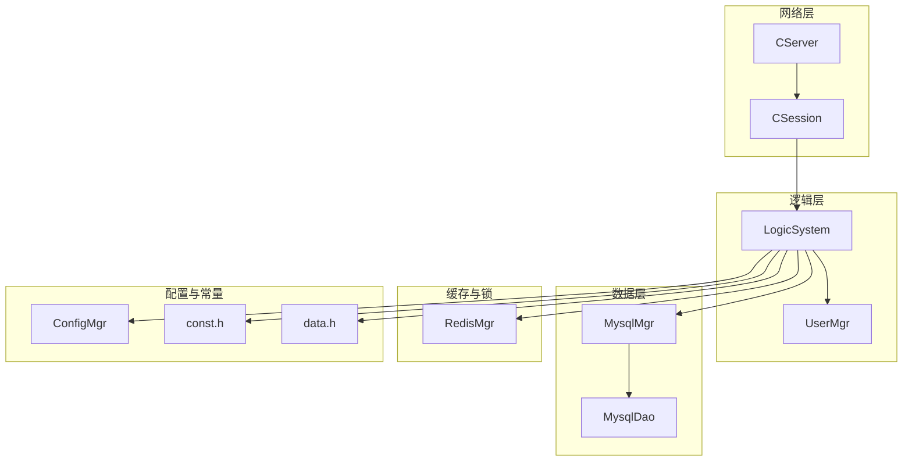
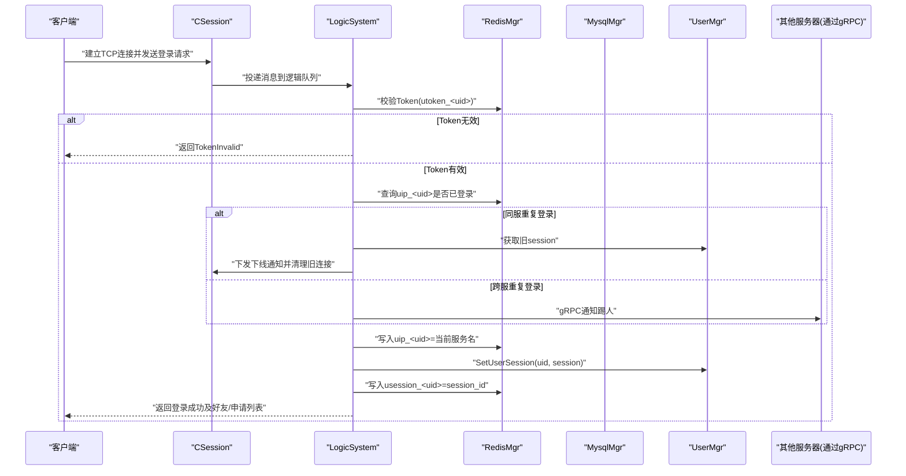
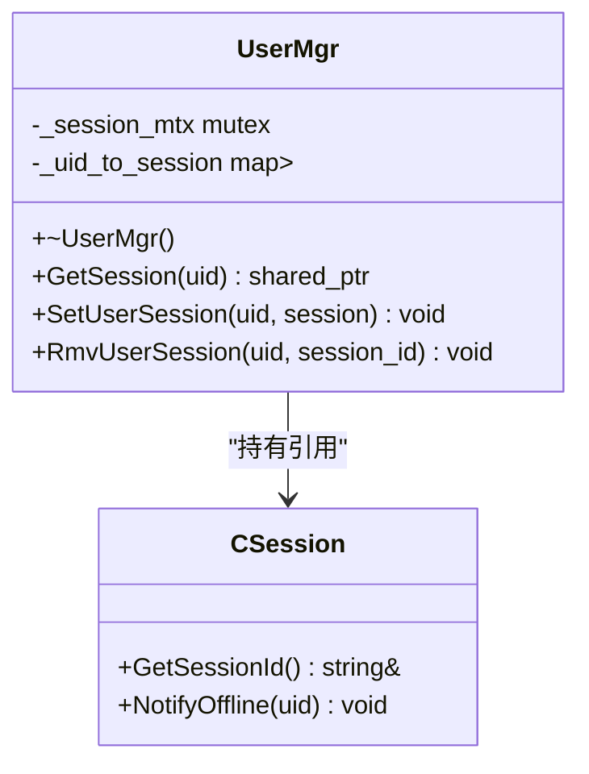
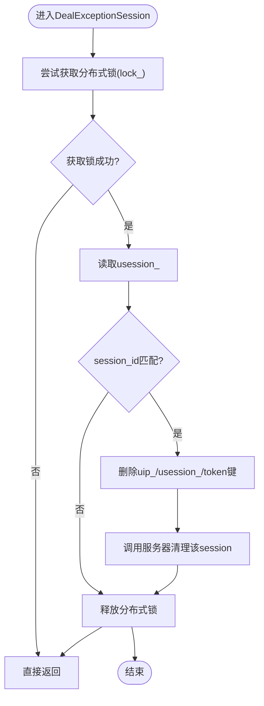
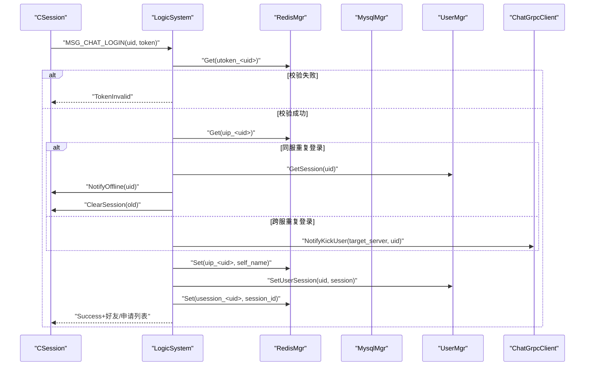
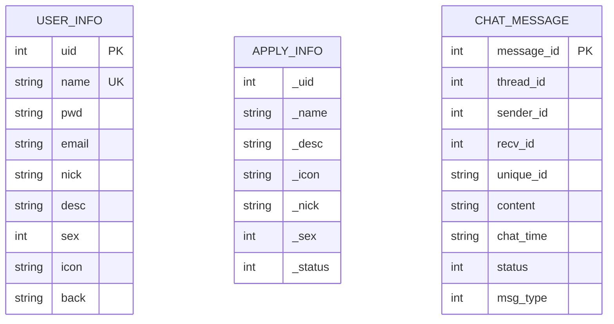
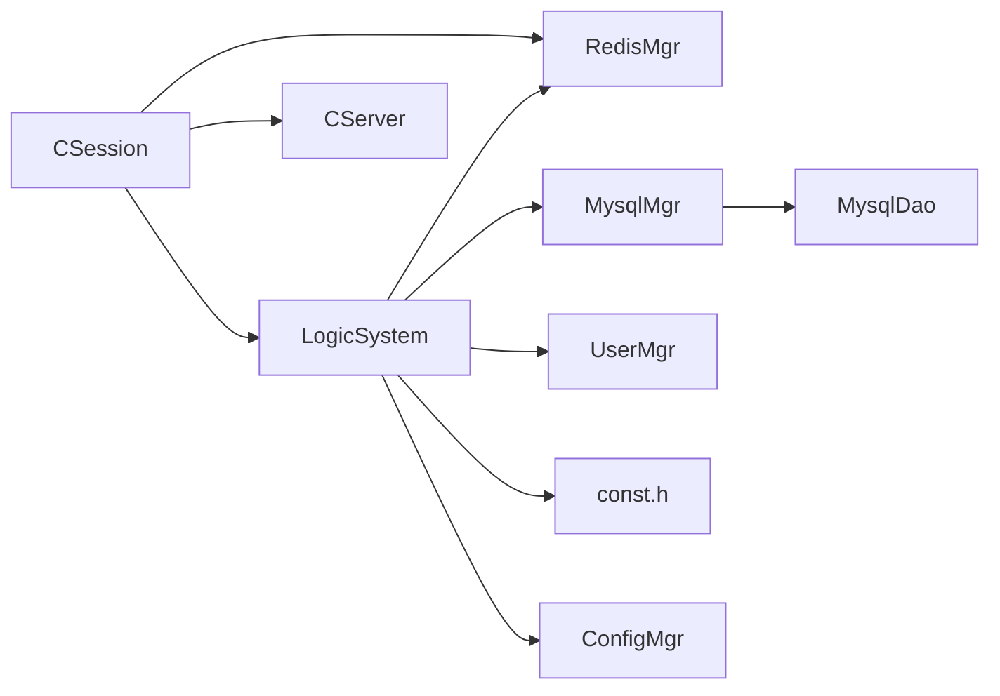

# 用户管理

<cite>
**本文引用的文件**   
- [UserMgr.h](file://server/ChatServer/include/UserMgr.h)
- [UserMgr.cpp](file://server/ChatServer/src/UserMgr.cpp)
- [data.h](file://server/ChatServer/include/data.h)
- [RedisMgr.h](file://server/ChatServer/include/RedisMgr.h)
- [MysqlDao.h](file://server/ChatServer/include/MysqlDao.h)
- [CSession.h](file://server/ChatServer/include/CSession.h)
- [CSession.cpp](file://server/ChatServer/src/CSession.cpp)
- [LogicSystem.h](file://server/ChatServer/include/LogicSystem.h)
- [LogicSystem.cpp](file://server/ChatServer/src/LogicSystem.cpp)
- [const.h](file://server/ChatServer/include/const.h)
- [MysqlMgr.h](file://server/ChatServer/include/MysqlMgr.h)
- [MysqlMgr.cpp](file://server/ChatServer/src/MysqlMgr.cpp)
- [ConfigMgr.h](file://server/ChatServer/include/ConfigMgr.h)
- [CServer.h](file://server/ChatServer/include/CServer.h)
</cite>

## 目录
1. [引言](#引言)
2. [项目结构](#项目结构)
3. [核心组件](#核心组件)
4. [架构总览](#架构总览)
5. [详细组件分析](#详细组件分析)
6. [依赖关系分析](#依赖关系分析)
7. [性能考量](#性能考量)
8. [故障排查指南](#故障排查指南)
9. [结论](#结论)
10. [附录](#附录)

## 引言
本文件面向 ChatServer 的用户管理系统，聚焦 UserMgr 的用户状态管理与会话维护，覆盖用户注册、登录验证与在线会话绑定；详细说明 UserInfo 数据结构设计与字段含义；阐述用户状态同步机制（在线列表、离线消息、状态广播）；记录权限与审计相关设计现状与建议；给出 Redis 缓存策略（键空间、数据同步、失效处理）；并提供用户行为分析与统计报表、安全监控的实现方案建议。

## 项目结构
ChatServer 采用分层与单例模式组织：
- 网络层：CServer、CSession 负责 TCP 连接、读写、心跳与异常处理
- 逻辑层：LogicSystem 作为消息路由与业务处理器
- 用户与会话：UserMgr 维护 uid -> session 的内存映射
- 数据访问：MysqlMgr/MysqlDao 封装 MySQL 操作
- 缓存与分布式锁：RedisMgr 提供连接池、常用命令与分布式锁
- 配置：ConfigMgr 读取 INI 配置
- 常量与协议：const.h 定义错误码、消息类型、Redis Key 前缀等
- 数据模型：data.h 定义 UserInfo、ApplyInfo、ChatMessage 等

图表来源
- [CServer.h:1-39](file://server/ChatServer/include/CServer.h#L1-L39)
- [CSession.h:1-86](file://server/ChatServer/include/CSession.h#L1-L86)
- [LogicSystem.h:1-60](file://server/ChatServer/include/LogicSystem.h#L1-L60)
- [UserMgr.h:1-22](file://server/ChatServer/include/UserMgr.h#L1-L22)
- [MysqlMgr.h:1-41](file://server/ChatServer/include/MysqlMgr.h#L1-L41)
- [MysqlDao.h:1-270](file://server/ChatServer/include/MysqlDao.h#L1-L270)
- [RedisMgr.h:1-305](file://server/ChatServer/include/RedisMgr.h#L1-L305)
- [ConfigMgr.h:1-84](file://server/ChatServer/include/ConfigMgr.h#L1-L84)
- [const.h:1-104](file://server/ChatServer/include/const.h#L1-L104)
- [data.h:1-65](file://server/ChatServer/include/data.h#L1-L65)

章节来源
- [CServer.h:1-39](file://server/ChatServer/include/CServer.h#L1-L39)
- [CSession.h:1-86](file://server/ChatServer/include/CSession.h#L1-L86)
- [LogicSystem.h:1-60](file://server/ChatServer/include/LogicSystem.h#L1-L60)
- [UserMgr.h:1-22](file://server/ChatServer/include/UserMgr.h#L1-L22)
- [MysqlMgr.h:1-41](file://server/ChatServer/include/MysqlMgr.h#L1-L41)
- [MysqlDao.h:1-270](file://server/ChatServer/include/MysqlDao.h#L1-L270)
- [RedisMgr.h:1-305](file://server/ChatServer/include/RedisMgr.h#L1-L305)
- [ConfigMgr.h:1-84](file://server/ChatServer/include/ConfigMgr.h#L1-L84)
- [const.h:1-104](file://server/ChatServer/include/const.h#L1-L104)
- [data.h:1-65](file://server/ChatServer/include/data.h#L1-L65)

## 核心组件
- UserMgr：以单例形式维护 uid 到 CSession 的内存映射，提供设置、获取、移除会话的能力，用于踢人、在线推送等
- CSession：封装 TCP 会话，包含发送队列、心跳时间戳、异常清理流程
- LogicSystem：消息分发中心，注册各 MSG_TYPE 的处理回调，实现登录、好友、聊天等逻辑
- MysqlMgr/MysqlDao：数据库访问抽象与实现，提供用户、好友、聊天消息等 CRUD
- RedisMgr：Redis 连接池、基础命令封装、分布式锁、计数器等
- const.h：统一错误码、消息类型、Redis Key 前缀、锁超时等常量
- data.h：用户信息、申请信息、聊天消息、分页结果等数据结构

章节来源
- [UserMgr.h:1-22](file://server/ChatServer/include/UserMgr.h#L1-L22)
- [UserMgr.cpp:1-50](file://server/ChatServer/src/UserMgr.cpp#L1-L50)
- [CSession.h:1-86](file://server/ChatServer/include/CSession.h#L1-L86)
- [CSession.cpp:1-335](file://server/ChatServer/src/CSession.cpp#L1-L335)
- [LogicSystem.h:1-60](file://server/ChatServer/include/LogicSystem.h#L1-L60)
- [LogicSystem.cpp:1-945](file://server/ChatServer/src/LogicSystem.cpp#L1-L945)
- [MysqlMgr.h:1-41](file://server/ChatServer/include/MysqlMgr.h#L1-L41)
- [MysqlDao.h:1-270](file://server/ChatServer/include/MysqlDao.h#L1-L270)
- [RedisMgr.h:1-305](file://server/ChatServer/include/RedisMgr.h#L1-L305)
- [const.h:1-104](file://server/ChatServer/include/const.h#L1-L104)
- [data.h:1-65](file://server/ChatServer/include/data.h#L1-L65)

## 架构总览
下图展示从客户端连接到登录验证、在线会话绑定与跨服通知的整体流程。

图表来源
- [LogicSystem.cpp:116-252](file://server/ChatServer/src/LogicSystem.cpp#L116-L252)
- [CSession.cpp:250-333](file://server/ChatServer/src/CSession.cpp#L250-L333)
- [UserMgr.cpp:21-44](file://server/ChatServer/src/UserMgr.cpp#L21-L44)
- [RedisMgr.h:267-305](file://server/ChatServer/include/RedisMgr.h#L267-L305)
- [const.h:81-89](file://server/ChatServer/include/const.h#L81-L89)

章节来源
- [LogicSystem.cpp:116-252](file://server/ChatServer/src/LogicSystem.cpp#L116-L252)
- [CSession.cpp:250-333](file://server/ChatServer/src/CSession.cpp#L250-L333)
- [UserMgr.cpp:21-44](file://server/ChatServer/src/UserMgr.cpp#L21-L44)
- [RedisMgr.h:267-305](file://server/ChatServer/include/RedisMgr.h#L267-L305)
- [const.h:81-89](file://server/ChatServer/include/const.h#L81-L89)

## 详细组件分析

### UserMgr：用户会话管理
- 职责
  - 维护 uid -> shared_ptr<CSession> 的内存映射
  - 提供 SetUserSession、GetSession、RmvUserSession 接口
  - RmvUserSession 会比对 session_id，避免误删异地登录的新会话
- 并发控制
  - 使用互斥量保护 _uid_to_session
- 典型用法
  - 登录成功后绑定会话
  - 踢人时查找旧会话并下发下线通知
  - 异常断开时清理会话

图表来源
- [UserMgr.h:1-22](file://server/ChatServer/include/UserMgr.h#L1-L22)
- [UserMgr.cpp:1-50](file://server/ChatServer/src/UserMgr.cpp#L1-L50)
- [CSession.h:1-86](file://server/ChatServer/include/CSession.h#L1-L86)

章节来源
- [UserMgr.h:1-22](file://server/ChatServer/include/UserMgr.h#L1-L22)
- [UserMgr.cpp:1-50](file://server/ChatServer/src/UserMgr.cpp#L1-L50)

### CSession：会话与心跳
- 功能要点
  - 异步读写、粘包处理、发送队列限流
  - 心跳检测与过期判断（默认阈值约20秒）
  - 异常处理：关闭连接、清理会话、释放分布式锁、清理 Redis 中的用户登录态
- 关键方法
  - UpdateHeartbeat、IsHeartbeatExpired
  - DealExceptionSession：在异常路径中清理 uip_/usession_/token 等键

图表来源
- [CSession.cpp:301-333](file://server/ChatServer/src/CSession.cpp#L301-L333)
- [const.h:81-89](file://server/ChatServer/include/const.h#L81-L89)

章节来源
- [CSession.h:1-86](file://server/ChatServer/include/CSession.h#L1-L86)
- [CSession.cpp:1-335](file://server/ChatServer/src/CSession.cpp#L1-L335)

### LogicSystem：登录与状态同步
- 登录流程
  - 校验 token（Redis utoken_<uid>）
  - 检查重复登录（Redis uip_<uid>），同服踢旧连接，跨服 gRPC 通知
  - 绑定 session 到 uid（UserMgr）、写入 usession_<uid>、uip_<uid>
  - 返回用户基础信息与好友/申请列表
- 好友申请与认证
  - 写库后根据目标用户所在服务器选择本地推送或 gRPC 通知
- 文本聊天
  - 落库后按目标用户在线情况选择本地推送或 gRPC 转发

图表来源
- [LogicSystem.cpp:116-252](file://server/ChatServer/src/LogicSystem.cpp#L116-L252)
- [const.h:81-89](file://server/ChatServer/include/const.h#L81-L89)

章节来源
- [LogicSystem.cpp:116-252](file://server/ChatServer/src/LogicSystem.cpp#L116-L252)

### 用户数据结构：UserInfo 与相关类型
- UserInfo
  - 字段：name、pwd、uid、email、nick、desc、sex、icon、back
  - 用途：用户基础信息、登录返回、好友列表展示
- ApplyInfo
  - 字段：_uid、_name、_desc、_icon、_nick、_sex、_status
  - 用途：好友申请信息
- ChatMessage / PageResult / ChatMsgType
  - 用途：聊天消息存储与分页加载

图表来源
- [data.h:1-65](file://server/ChatServer/include/data.h#L1-L65)

章节来源
- [data.h:1-65](file://server/ChatServer/include/data.h#L1-L65)

### Redis 缓存策略与键空间
- 键空间约定（来自 const.h）
  - uip_<uid>：用户登录的服务名
  - utoken_<uid>：用户登录令牌
  - usession_<uid>：用户当前会话ID
  - ubaseinfo_<uid>：用户基础信息缓存
  - nameinfo_<name>：用户名到信息的缓存
  - lock_<uid>：分布式锁键
  - ipcount_、logincount、lockcount：计数键
- 缓存策略
  - 读多写少：优先查 Redis，未命中再回源 MySQL 并回填
  - 一致性：登录态、会话ID、Token 强一致；用户基础信息允许短暂不一致
  - 失效：异常断开、踢人、登出时清理对应键

章节来源
- [const.h:81-89](file://server/ChatServer/include/const.h#L81-L89)
- [LogicSystem.cpp:587-718](file://server/ChatServer/src/LogicSystem.cpp#L587-L718)
- [CSession.cpp:301-333](file://server/ChatServer/src/CSession.cpp#L301-L333)

### 用户权限与审计（现状与建议）
- 现状
  - 代码中未发现显式的角色/权限枚举与鉴权中间件
  - 登录态由 Token 与 uip_/usession_ 控制
- 建议
  - 引入角色与权限模型（如 admin/user/guest），在 LogicSystem 中增加权限校验
  - 对敏感操作（修改密码、删除账号、拉黑/封禁）进行审计日志记录
  - 结合 Redis 计数器与外部日志系统实现操作审计与告警

[本节为通用建议，不直接分析具体文件]

### 用户状态同步机制
- 在线列表
  - 内存：UserMgr._uid_to_session
  - 持久化：Redis uip_<uid> 标记所在服务
- 离线消息
  - 当前实现未提供离线消息队列；建议在 Redis List/Stream 中为离线用户暂存消息，上线后拉取
- 状态广播
  - 本地：LogicSystem 直接通过 UserMgr 获取 session 并 Send
  - 跨服：通过 ChatGrpcClient 转发通知（好友申请、认证、聊天消息等）

章节来源
- [UserMgr.cpp:1-50](file://server/ChatServer/src/UserMgr.cpp#L1-L50)
- [LogicSystem.cpp:277-470](file://server/ChatServer/src/LogicSystem.cpp#L277-L470)

### 用户行为分析与统计报表（实现方案）
- 采集点
  - 登录次数：Redis logincount（可按日期分片）
  - 活跃会话数：遍历 UserMgr 或基于 Redis 计数
  - 消息量：按 thread_id/sender_id/recv_id 维度计数
- 存储与聚合
  - 实时计数：Redis INCR/INCRBY
  - 定时归档：定时任务将计数写入 MySQL/ClickHouse
- 报表
  - DAU/MAU、平均在线时长、消息吞吐、峰值QPS
  - 可视化：Prometheus/Grafana 或自研看板

[本节为通用方案，不直接分析具体文件]

### 安全监控（实现方案）
- 登录安全
  - 限制同一 uid 同时在线数量
  - 验证码/邮箱校验失败计数与封禁
- 风控指标
  - 高频登录失败、异常IP、异常时间段
- 监控告警
  - 基于 Redis 计数器与日志采集，触发告警规则

[本节为通用方案，不直接分析具体文件]

## 依赖关系分析
- 组件耦合
  - LogicSystem 强依赖 RedisMgr、MysqlMgr、UserMgr、ConfigMgr、const.h
  - CSession 依赖 LogicSystem、RedisMgr、CServer
  - UserMgr 仅依赖 CSession（弱耦合）
- 外部依赖
  - Redis：连接池、PING保活、自动重连
  - MySQL：连接池、健康检查、自动重连
  - gRPC：跨服通知（KickUser、AddFriend、AuthFriend、TextChatMsg）

图表来源
- [LogicSystem.h:1-60](file://server/ChatServer/include/LogicSystem.h#L1-L60)
- [CSession.h:1-86](file://server/ChatServer/include/CSession.h#L1-L86)
- [MysqlMgr.h:1-41](file://server/ChatServer/include/MysqlMgr.h#L1-L41)
- [MysqlDao.h:1-270](file://server/ChatServer/include/MysqlDao.h#L1-L270)
- [RedisMgr.h:1-305](file://server/ChatServer/include/RedisMgr.h#L1-L305)
- [const.h:1-104](file://server/ChatServer/include/const.h#L1-L104)
- [ConfigMgr.h:1-84](file://server/ChatServer/include/ConfigMgr.h#L1-L84)

章节来源
- [LogicSystem.h:1-60](file://server/ChatServer/include/LogicSystem.h#L1-L60)
- [CSession.h:1-86](file://server/ChatServer/include/CSession.h#L1-L86)
- [MysqlMgr.h:1-41](file://server/ChatServer/include/MysqlMgr.h#L1-L41)
- [MysqlDao.h:1-270](file://server/ChatServer/include/MysqlDao.h#L1-L270)
- [RedisMgr.h:1-305](file://server/ChatServer/include/RedisMgr.h#L1-L305)
- [const.h:1-104](file://server/ChatServer/include/const.h#L1-L104)
- [ConfigMgr.h:1-84](file://server/ChatServer/include/ConfigMgr.h#L1-L84)

## 性能考量
- 连接池
  - Redis 连接池带 PING 保活与自动重连
  - MySQL 连接池带健康检查与重连
- 序列化与IO
  - JSON 解析开销较大，热点路径可考虑二进制协议
  - 发送队列限流，避免拥塞
- 缓存命中率
  - 用户基础信息缓存显著降低 DB 压力
- 锁竞争
  - 分布式锁粒度为 uid，冲突可控

[本节为通用指导，不直接分析具体文件]

## 故障排查指南
- 登录失败
  - 检查 utoken_<uid> 是否存在且匹配
  - 检查 uip_<uid> 是否指向当前服务
- 重复登录/踢人
  - 确认同服旧 session 是否被正确清理
  - 跨服踢人是否通过 gRPC 成功
- 会话异常断开
  - 查看 DealExceptionSession 是否执行了键清理
  - 检查 Redis 连接池与健康线程
- 消息未送达
  - 目标用户是否在线（uip_<uid>）
  - 本地推送是否成功，跨服是否转发

章节来源
- [LogicSystem.cpp:116-252](file://server/ChatServer/src/LogicSystem.cpp#L116-L252)
- [CSession.cpp:301-333](file://server/ChatServer/src/CSession.cpp#L301-L333)
- [RedisMgr.h:1-305](file://server/ChatServer/include/RedisMgr.h#L1-L305)

## 结论
ChatServer 的用户管理以 UserMgr 为核心，配合 LogicSystem、RedisMgr、MysqlMgr 完成登录验证、会话绑定与状态同步。现有实现覆盖了在线会话管理与跨服通知的基础能力，但在离线消息、权限与审计方面仍需扩展。建议补充离线消息队列、完善权限模型与审计日志，并建立行为分析与监控体系以提升系统可用性与可观测性。

## 附录
- 关键常量与键空间
  - uip_<uid>、utoken_<uid>、usession_<uid>、ubaseinfo_<uid>、nameinfo_<name>、lock_<uid>
- 错误码与消息类型
  - ErrorCodes、MSG_TYPES 详见 const.h

章节来源
- [const.h:1-104](file://server/ChatServer/include/const.h#L1-L104)