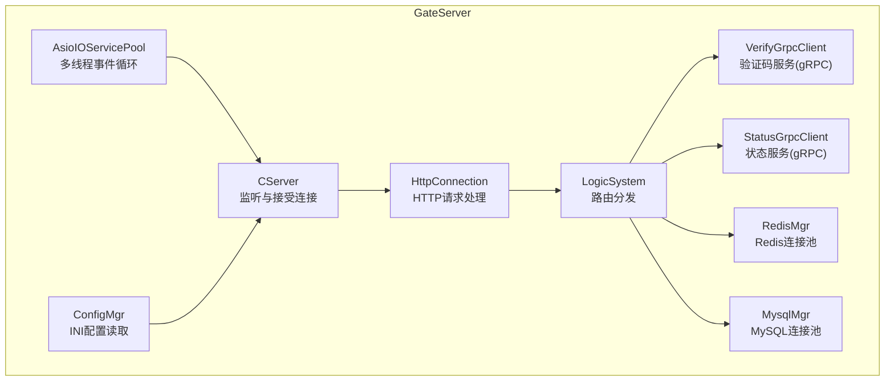
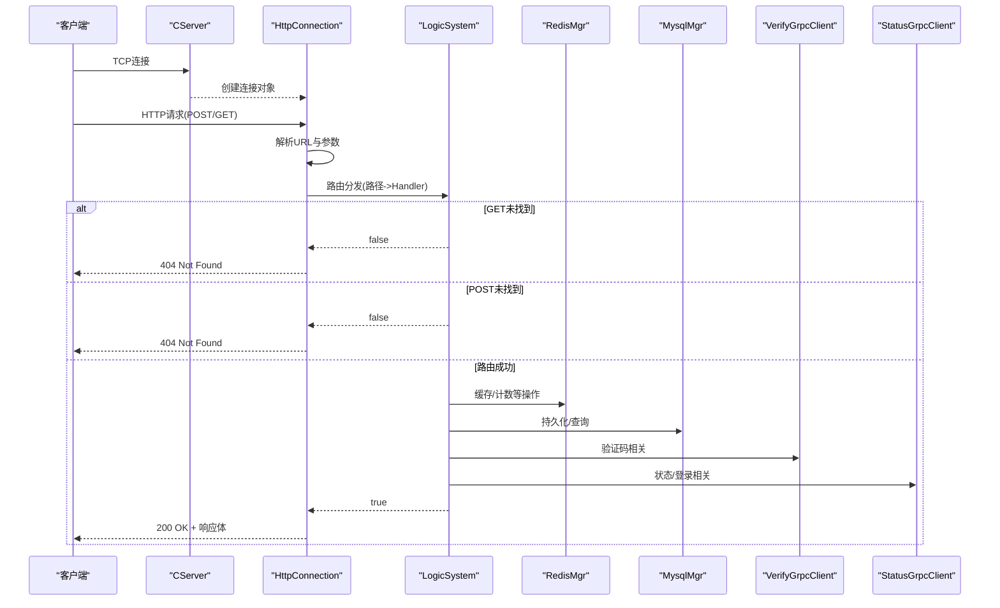
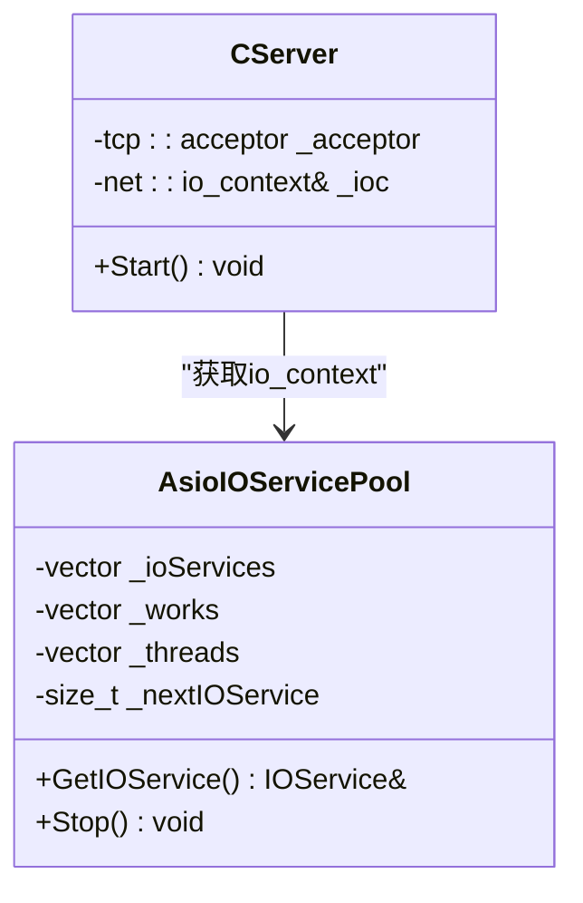
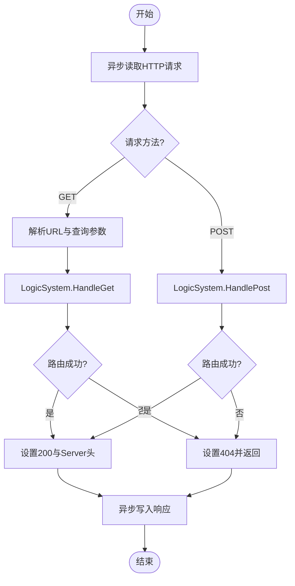
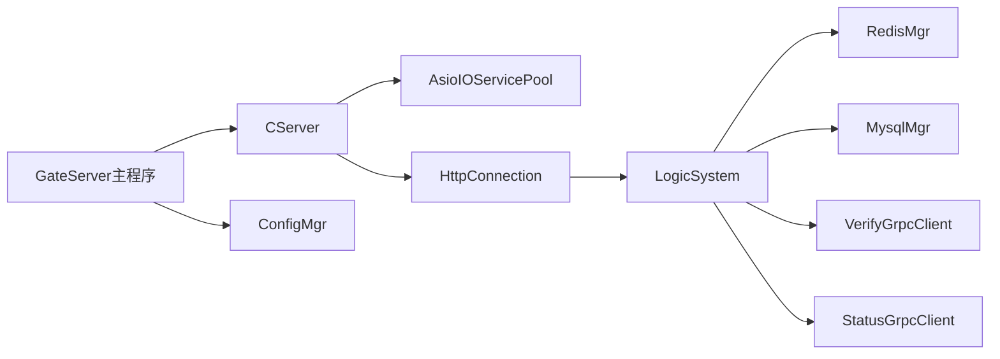

# GateServer HTTP网关服务

<cite>
**本文引用的文件**   
- [GateServer.cpp](file://server/GateServer/src/GateServer.cpp)
- [CServer.h](file://server/GateServer/include/CServer.h)
- [CServer.cpp](file://server/GateServer/src/CServer.cpp)
- [HttpConnection.h](file://server/GateServer/include/HttpConnection.h)
- [HttpConnection.cpp](file://server/GateServer/src/HttpConnection.cpp)
- [AsioIOServicePool.h](file://server/GateServer/include/AsioIOServicePool.h)
- [AsioIOServicePool.cpp](file://server/GateServer/src/AsioIOServicePool.cpp)
- [LogicSystem.h](file://server/GateServer/include/LogicSystem.h)
- [ConfigMgr.h](file://server/GateServer/include/ConfigMgr.h)
- [config.ini](file://server/GateServer/config/config.ini)
- [RedisMgr.h](file://server/GateServer/include/RedisMgr.h)
- [MysqlMgr.h](file://server/GateServer/include/MysqlMgr.h)
- [VerifyGrpcClient.h](file://server/GateServer/include/VerifyGrpcClient.h)
- [StatusGrpcClient.h](file://server/GateServer/include/StatusGrpcClient.h)
</cite>

## 目录
1. [简介](#简介)
2. [项目结构](#项目结构)
3. [核心组件](#核心组件)
4. [架构总览](#架构总览)
5. [详细组件分析](#详细组件分析)
6. [依赖关系分析](#依赖关系分析)
7. [性能与扩展性](#性能与扩展性)
8. [故障排查指南](#故障排查指南)
9. [结论](#结论)
10. [附录：新增API端点示例](#附录新增api端点示例)

## 简介
GateServer 作为统一HTTP入口，负责接收客户端请求、路由分发、参数解析、JSON数据处理，并转发到后端微服务（gRPC）或数据层（MySQL/Redis）。其基于Boost.Asio与Beast实现高性能异步I/O，通过AsioIOServicePool进行事件循环与连接管理。逻辑路由由LogicSystem统一管理，支持GET/POST两种请求类型，并提供统一的错误响应格式。

## 项目结构
GateServer采用分层组织：
- 网络层：CServer监听端口、接受连接；HttpConnection处理单个HTTP连接的读写与超时控制。
- 路由层：LogicSystem维护GET/POST处理器映射，将请求分发给具体业务逻辑。
- 基础设施：AsioIOServicePool提供多线程事件循环；ConfigMgr加载配置；RedisMgr与MysqlMgr分别封装Redis与MySQL访问；VerifyGrpcClient与StatusGrpcClient封装gRPC调用。

**图表来源** 
- [CServer.cpp:10-33](file://server/GateServer/src/CServer.cpp#L10-L33)
- [HttpConnection.cpp:8-30](file://server/GateServer/src/HttpConnection.cpp#L8-L30)
- [LogicSystem.h:9-22](file://server/GateServer/include/LogicSystem.h#L9-L22)
- [AsioIOServicePool.cpp:4-16](file://server/GateServer/src/AsioIOServicePool.cpp#L4-L16)
- [ConfigMgr.h:46-82](file://server/GateServer/include/ConfigMgr.h#L46-L82)
- [RedisMgr.h:267-303](file://server/GateServer/include/RedisMgr.h#L267-L303)
- [MysqlMgr.h:4-18](file://server/GateServer/include/MysqlMgr.h#L4-L18)
- [VerifyGrpcClient.h:80-110](file://server/GateServer/include/VerifyGrpcClient.h#L80-L110)
- [StatusGrpcClient.h:81-94](file://server/GateServer/include/StatusGrpcClient.h#L81-L94)

**章节来源**
- [GateServer.cpp:128-158](file://server/GateServer/src/GateServer.cpp#L128-L158)
- [CServer.h:5-14](file://server/GateServer/include/CServer.h#L5-L14)
- [CServer.cpp:10-33](file://server/GateServer/src/CServer.cpp#L10-L33)
- [HttpConnection.h:4-34](file://server/GateServer/include/HttpConnection.h#L4-L34)
- [HttpConnection.cpp:8-30](file://server/GateServer/src/HttpConnection.cpp#L8-L30)
- [AsioIOServicePool.h:8-27](file://server/GateServer/include/AsioIOServicePool.h#L8-L27)
- [AsioIOServicePool.cpp:4-16](file://server/GateServer/src/AsioIOServicePool.cpp#L4-L16)
- [LogicSystem.h:9-22](file://server/GateServer/include/LogicSystem.h#L9-L22)
- [ConfigMgr.h:46-82](file://server/GateServer/include/ConfigMgr.h#L46-L82)
- [config.ini:1-25](file://server/GateServer/config/config.ini#L1-L25)
- [RedisMgr.h:267-303](file://server/GateServer/include/RedisMgr.h#L267-L303)
- [MysqlMgr.h:4-18](file://server/GateServer/include/MysqlMgr.h#L4-L18)
- [VerifyGrpcClient.h:80-110](file://server/GateServer/include/VerifyGrpcClient.h#L80-L110)
- [StatusGrpcClient.h:81-94](file://server/GateServer/include/StatusGrpcClient.h#L81-L94)

## 核心组件
- CServer：TCP监听器，使用AsioIOServicePool获取io_context，异步accept新连接并创建HttpConnection实例。
- HttpConnection：单连接生命周期管理，包括异步读请求、URL与查询参数解析、POST/GET分支处理、超时定时器、响应写入。
- LogicSystem：单例路由表，维护GET/POST处理器映射，根据路径选择对应Handler执行。
- AsioIOServicePool：多io_context轮询分配，每个io_context运行在独立线程，提升并发处理能力。
- ConfigMgr：INI配置文件读取，提供按Section和Key的便捷访问接口。
- RedisMgr：Redis连接池，包含健康检查、自动重连、常用命令封装。
- MysqlMgr：MySQL操作封装，提供用户注册、密码校验等DAO方法。
- VerifyGrpcClient/StatusGrpcClient：gRPC客户端连接池，封装验证码与状态服务的远程调用。

**章节来源**
- [CServer.cpp:10-33](file://server/GateServer/src/CServer.cpp#L10-L33)
- [HttpConnection.cpp:8-30](file://server/GateServer/src/HttpConnection.cpp#L8-L30)
- [LogicSystem.h:9-22](file://server/GateServer/include/LogicSystem.h#L9-L22)
- [AsioIOServicePool.cpp:4-16](file://server/GateServer/src/AsioIOServicePool.cpp#L4-L16)
- [ConfigMgr.h:46-82](file://server/GateServer/include/ConfigMgr.h#L46-L82)
- [RedisMgr.h:267-303](file://server/GateServer/include/RedisMgr.h#L267-L303)
- [MysqlMgr.h:4-18](file://server/GateServer/include/MysqlMgr.h#L4-L18)
- [VerifyGrpcClient.h:80-110](file://server/GateServer/include/VerifyGrpcClient.h#L80-L110)
- [StatusGrpcClient.h:81-94](file://server/GateServer/include/StatusGrpcClient.h#L81-L94)

## 架构总览
GateServer整体流程如下：
- 启动时初始化MysqlMgr、RedisMgr、ConfigMgr，读取端口配置，创建io_context并启动信号处理。
- CServer监听端口，接受连接后创建HttpConnection，进入异步读请求。
- HttpConnection解析请求方法与URL，调用LogicSystem进行路由分发。
- LogicSystem根据路径调用注册的Handler，Handler中可调用RedisMgr、MysqlMgr、VerifyGrpcClient、StatusGrpcClient完成业务逻辑。
- 最终由HttpConnection设置响应状态码与内容，异步写回客户端。

**图表来源** 
- [CServer.cpp:10-33](file://server/GateServer/src/CServer.cpp#L10-L33)
- [HttpConnection.cpp:132-194](file://server/GateServer/src/HttpConnection.cpp#L132-L194)
- [LogicSystem.h:14-17](file://server/GateServer/include/LogicSystem.h#L14-L17)
- [RedisMgr.h:273-303](file://server/GateServer/include/RedisMgr.h#L273-L303)
- [MysqlMgr.h:10-14](file://server/GateServer/include/MysqlMgr.h#L10-L14)
- [VerifyGrpcClient.h:87-104](file://server/GateServer/include/VerifyGrpcClient.h#L87-L104)
- [StatusGrpcClient.h:88-90](file://server/GateServer/include/StatusGrpcClient.h#L88-L90)

## 详细组件分析

### CServer服务器与AsioIOServicePool
- CServer构造函数绑定端口，Start方法从AsioIOServicePool获取io_context，创建HttpConnection并异步accept。
- AsioIOServicePool内部维护多个io_context与work_guard，为每个io_context启动一个线程运行事件循环，GetIOService以轮询方式返回io_context引用。

**图表来源** 
- [CServer.h:5-14](file://server/GateServer/include/CServer.h#L5-L14)
- [CServer.cpp:10-33](file://server/GateServer/src/CServer.cpp#L10-L33)
- [AsioIOServicePool.h:8-27](file://server/GateServer/include/AsioIOServicePool.h#L8-L27)
- [AsioIOServicePool.cpp:4-16](file://server/GateServer/src/AsioIOServicePool.cpp#L4-L16)

**章节来源**
- [CServer.cpp:10-33](file://server/GateServer/src/CServer.cpp#L10-L33)
- [AsioIOServicePool.cpp:23-29](file://server/GateServer/src/AsioIOServicePool.cpp#L23-L29)

### HttpConnection请求处理逻辑
- Start方法使用http::async_read异步读取请求，成功后进入HandleReq。
- HandleReq根据请求方法分支：GET先调用PreParseGetParam解析URL与查询参数，再调用LogicSystem.HandleGet；POST直接调用LogicSystem.HandlePost。
- 若路由失败返回404，否则设置200与Server头，WriteResponse异步写回响应。
- CheckDeadline设置60秒超时定时器，WriteResponse完成后关闭发送并取消定时器。

**图表来源** 
- [HttpConnection.cpp:8-30](file://server/GateServer/src/HttpConnection.cpp#L8-L30)
- [HttpConnection.cpp:96-130](file://server/GateServer/src/HttpConnection.cpp#L96-L130)
- [HttpConnection.cpp:132-194](file://server/GateServer/src/HttpConnection.cpp#L132-L194)
- [HttpConnection.cpp:196-223](file://server/GateServer/src/HttpConnection.cpp#L196-L223)

**章节来源**
- [HttpConnection.cpp:8-30](file://server/GateServer/src/HttpConnection.cpp#L8-L30)
- [HttpConnection.cpp:96-130](file://server/GateServer/src/HttpConnection.cpp#L96-L130)
- [HttpConnection.cpp:132-194](file://server/GateServer/src/HttpConnection.cpp#L132-L194)
- [HttpConnection.cpp:196-223](file://server/GateServer/src/HttpConnection.cpp#L196-L223)

### 配置管理与日志记录
- ConfigMgr使用Boost.PropertyTree读取INI配置，提供SectionInfo与全局Inst单例，便于获取Port、Host、Port等键值。
- GateServer主函数中读取GateServer.Port，初始化MysqlMgr、RedisMgr，并启动信号处理。
- 日志输出通过标准输出打印关键信息（如连接成功、错误信息等），生产环境建议接入集中式日志系统。

**章节来源**
- [ConfigMgr.h:46-82](file://server/GateServer/include/ConfigMgr.h#L46-L82)
- [config.ini:1-25](file://server/GateServer/config/config.ini#L1-L25)
- [GateServer.cpp:128-158](file://server/GateServer/src/GateServer.cpp#L128-L158)

### 与Redis和MySQL的连接管理
- RedisMgr封装连接池，包含健康检查、自动重连、常用命令（Set/Get/HSet/HDel/Del/LPush/RPop等），并提供分布式锁与计数器方法。
- MysqlMgr封装DAO方法，提供用户注册、邮箱校验、密码更新、密码校验等接口。

**章节来源**
- [RedisMgr.h:267-303](file://server/GateServer/include/RedisMgr.h#L267-L303)
- [MysqlMgr.h:4-18](file://server/GateServer/include/MysqlMgr.h#L4-L18)

### 与其他微服务的gRPC通信
- VerifyGrpcClient封装验证码服务，提供GetVarifyCode方法，内部使用RPConPool管理gRPC Stub连接池。
- StatusGrpcClient封装状态服务，提供GetChatServer与Login方法，内部使用StatusConPool管理连接池。

**章节来源**
- [VerifyGrpcClient.h:80-110](file://server/GateServer/include/VerifyGrpcClient.h#L80-L110)
- [StatusGrpcClient.h:81-94](file://server/GateServer/include/StatusGrpcClient.h#L81-L94)

## 依赖关系分析
GateServer各组件之间的依赖关系如下：
- CServer依赖AsioIOServicePool获取io_context。
- HttpConnection依赖LogicSystem进行路由分发。
- LogicSystem依赖RedisMgr、MysqlMgr、VerifyGrpcClient、StatusGrpcClient完成业务逻辑。
- GateServer主函数依赖ConfigMgr读取配置，并初始化MysqlMgr、RedisMgr。

**图表来源** 
- [GateServer.cpp:128-158](file://server/GateServer/src/GateServer.cpp#L128-L158)
- [CServer.cpp:10-33](file://server/GateServer/src/CServer.cpp#L10-L33)
- [HttpConnection.cpp:132-194](file://server/GateServer/src/HttpConnection.cpp#L132-L194)
- [LogicSystem.h:9-22](file://server/GateServer/include/LogicSystem.h#L9-L22)
- [RedisMgr.h:267-303](file://server/GateServer/include/RedisMgr.h#L267-L303)
- [MysqlMgr.h:4-18](file://server/GateServer/include/MysqlMgr.h#L4-L18)
- [VerifyGrpcClient.h:80-110](file://server/GateServer/include/VerifyGrpcClient.h#L80-L110)
- [StatusGrpcClient.h:81-94](file://server/GateServer/include/StatusGrpcClient.h#L81-L94)

**章节来源**
- [GateServer.cpp:128-158](file://server/GateServer/src/GateServer.cpp#L128-L158)
- [CServer.cpp:10-33](file://server/GateServer/src/CServer.cpp#L10-L33)
- [HttpConnection.cpp:132-194](file://server/GateServer/src/HttpConnection.cpp#L132-L194)
- [LogicSystem.h:9-22](file://server/GateServer/include/LogicSystem.h#L9-L22)

## 性能与扩展性
- 异步I/O：使用Boost.Asio与Beast实现非阻塞I/O，提高吞吐与并发能力。
- 多线程事件循环：AsioIOServicePool为每个io_context分配独立线程，避免单点瓶颈。
- 连接池：Redis与gRPC均采用连接池，减少频繁建立连接的开销。
- 超时控制：HttpConnection内置60秒定时器，防止长时间占用资源。
- 扩展建议：引入监控指标（QPS、延迟、错误率）、结构化日志、限流与熔断机制。

[本节为通用指导，不直接分析具体文件]

## 故障排查指南
- 连接失败：检查Redis与MySQL配置是否正确，确认服务是否启动且端口可达。
- 路由未命中：确认LogicSystem中是否已注册对应路径的Handler。
- gRPC调用失败：检查VerifyGrpcClient与StatusGrpcClient的配置与网络连通性。
- 超时问题：调整HttpConnection中的定时器时间，或优化业务逻辑耗时。
- 内存泄漏：确保所有动态分配的reply对象正确释放，连接池正确归还连接。

**章节来源**
- [GateServer.cpp:128-158](file://server/GateServer/src/GateServer.cpp#L128-L158)
- [RedisMgr.h:267-303](file://server/GateServer/include/RedisMgr.h#L267-L303)
- [VerifyGrpcClient.h:80-110](file://server/GateServer/include/VerifyGrpcClient.h#L80-L110)
- [StatusGrpcClient.h:81-94](file://server/GateServer/include/StatusGrpcClient.h#L81-L94)

## 结论
GateServer通过清晰的层次结构与高效的异步I/O模型，实现了高可用的HTTP网关服务。其模块化设计便于扩展新的API端点与业务逻辑，同时通过连接池与超时控制保障系统稳定性。建议在后续迭代中加入完善的监控与日志体系，进一步提升可观测性与运维效率。

[本节为总结性内容，不直接分析具体文件]

## 附录：新增API端点示例
以下示例展示如何在GateServer中添加新的GET/POST API端点：

1. 在LogicSystem中注册处理器：
   - 使用RegGet或RegPost方法注册路径与对应的Handler函数。
   - Handler函数签名需匹配std::function<void(std::shared_ptr<HttpConnection>)>。

2. 在Handler中实现业务逻辑：
   - 对于GET请求，可从HttpConnection中提取_get_url与_get_params。
   - 对于POST请求，可从_request.target()获取路径，并从请求体中解析JSON数据。
   - 调用RedisMgr、MysqlMgr、VerifyGrpcClient、StatusGrpcClient完成业务操作。
   - 设置_response的状态码与内容，调用WriteResponse返回响应。

3. 错误处理：
   - 若路由未找到，返回404状态码与错误信息。
   - 若业务逻辑失败，返回适当的错误码与提示信息。

4. 测试验证：
   - 使用curl或Postman发送请求，验证响应是否符合预期。
   - 检查日志输出，确认无异常或错误信息。

**章节来源**
- [LogicSystem.h:14-17](file://server/GateServer/include/LogicSystem.h#L14-L17)
- [HttpConnection.cpp:132-194](file://server/GateServer/src/HttpConnection.cpp#L132-L194)
- [RedisMgr.h:273-303](file://server/GateServer/include/RedisMgr.h#L273-L303)
- [MysqlMgr.h:10-14](file://server/GateServer/include/MysqlMgr.h#L10-L14)
- [VerifyGrpcClient.h:87-104](file://server/GateServer/include/VerifyGrpcClient.h#L87-L104)
- [StatusGrpcClient.h:88-90](file://server/GateServer/include/StatusGrpcClient.h#L88-L90)