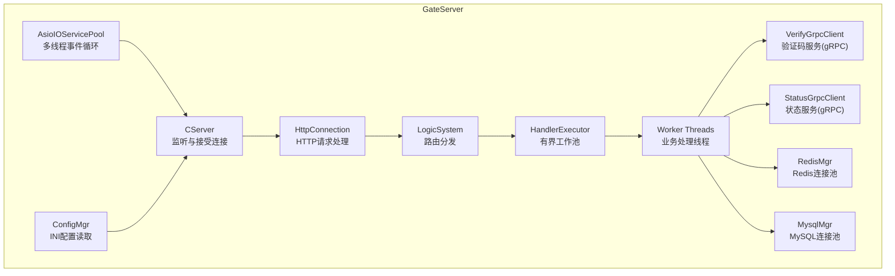
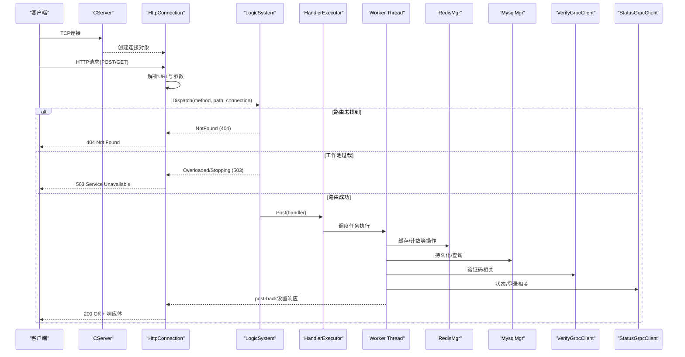
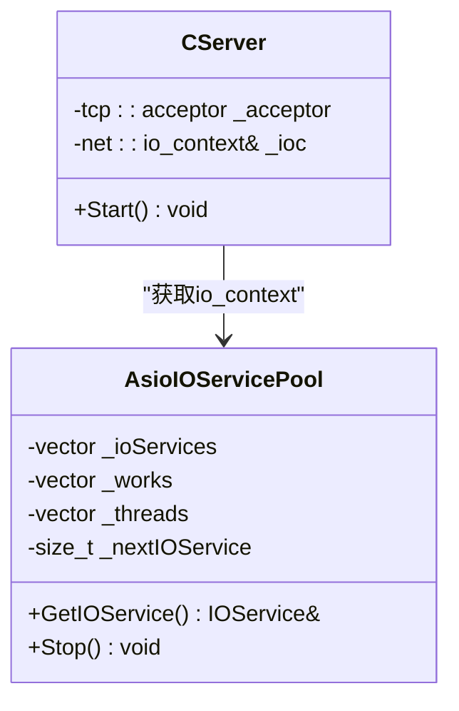
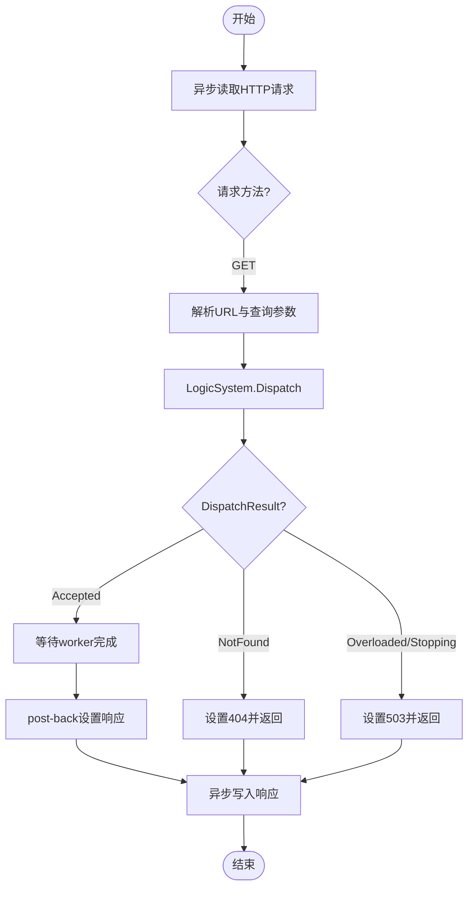
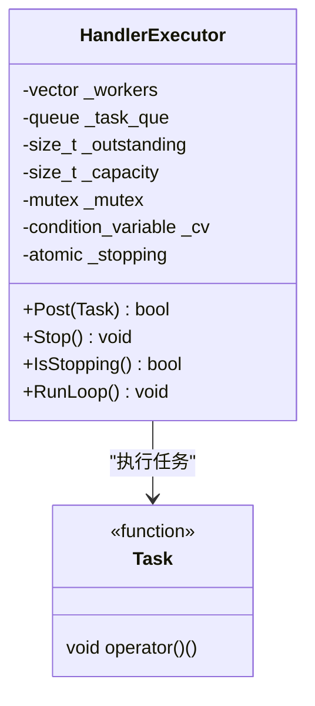
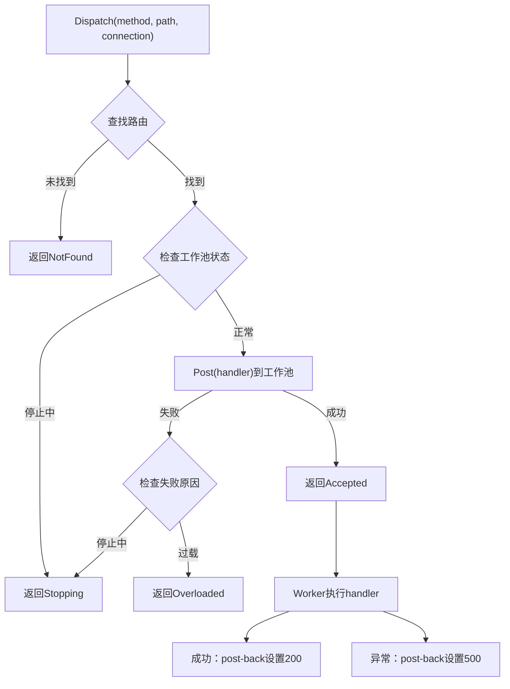
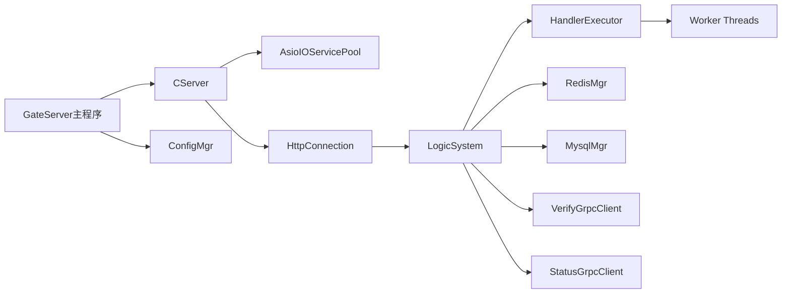

# GateServer HTTP网关服务

<cite>
**本文引用的文件**   
- [GateServer.cpp](file://server/GateServer/src/GateServer.cpp)
- [CServer.h](file://server/GateServer/include/CServer.h)
- [CServer.cpp](file://server/GateServer/src/CServer.cpp)
- [HttpConnection.h](file://server/GateServer/include/HttpConnection.h)
- [HttpConnection.cpp](file://server/GateServer/src/HttpConnection.cpp)
- [AsioIOServicePool.h](file://server/GateServer/include/AsioIOServicePool.h)
- [AsioIOServicePool.cpp](file://server/GateServer/src/AsioIOServicePool.cpp)
- [LogicSystem.h](file://server/GateServer/include/LogicSystem.h)
- [LogicSystem.cpp](file://server/GateServer/src/LogicSystem.cpp)
- [HandlerExecutor.h](file://server/GateServer/include/HandlerExecutor.h)
- [HandlerExecutor.cpp](file://server/GateServer/src/HandlerExecutor.cpp)
- [ConfigMgr.h](file://server/GateServer/include/ConfigMgr.h)
- [config.ini](file://server/GateServer/config/config.ini)
- [RedisMgr.h](file://server/GateServer/include/RedisMgr.h)
- [MysqlMgr.h](file://server/GateServer/include/MysqlMgr.h)
- [VerifyGrpcClient.h](file://server/GateServer/include/VerifyGrpcClient.h)
- [StatusGrpcClient.h](file://server/GateServer/include/StatusGrpcClient.h)
</cite>

## 更新摘要
**所做更改**   
- 新增HandlerExecutor工作池实现，用于HTTP请求处理的有界任务执行器
- 引入新的Dispatch API与DispatchResult枚举，提供精确的请求分发结果控制
- 增强HTTP连接处理机制，实现适当的反压机制和线程安全
- 更新架构设计以支持异步worker池处理和post-back响应机制

## 目录
1. [简介](#简介)
2. [项目结构](#项目结构)
3. [核心组件](#核心组件)
4. [架构总览](#架构总览)
5. [详细组件分析](#详细组件分析)
6. [依赖关系分析](#依赖关系分析)
7. [性能与扩展性](#性能与扩展性)
8. [故障排查指南](#故障排查指南)
9. [结论](#结论)
10. [附录：新增API端点示例](#附录新增api端点示例)

## 简介
GateServer 作为统一HTTP入口，负责接收客户端请求、路由分发、参数解析、JSON数据处理，并转发到后端微服务（gRPC）或数据层（MySQL/Redis）。其基于Boost.Asio与Beast实现高性能异步I/O，通过AsioIOServicePool进行事件循环与连接管理。逻辑路由由LogicSystem统一管理，支持GET/POST两种请求类型，并提供统一的错误响应格式。**最新更新**引入了HandlerExecutor工作池，实现了有界任务队列和反压机制，确保在高并发场景下的系统稳定性。

## 项目结构
GateServer采用分层组织：
- 网络层：CServer监听端口、接受连接；HttpConnection处理单个HTTP连接的读写与超时控制。
- 路由层：LogicSystem维护GET/POST处理器映射，将请求分发给具体业务逻辑。
- **新增**：HandlerExecutor有界工作池，负责任务调度和反压控制。
- 基础设施：AsioIOServicePool提供多线程事件循环；ConfigMgr加载配置；RedisMgr与MysqlMgr分别封装Redis与MySQL访问；VerifyGrpcClient与StatusGrpcClient封装gRPC调用。

**图表来源** 
- [CServer.cpp:10-33](file://server/GateServer/src/CServer.cpp#L10-L33)
- [HttpConnection.cpp:8-30](file://server/GateServer/src/HttpConnection.cpp#L8-L30)
- [LogicSystem.cpp:491-556](file://server/GateServer/src/LogicSystem.cpp#L491-L556)
- [HandlerExecutor.cpp:22-37](file://server/GateServer/src/HandlerExecutor.cpp#L22-L37)
- [AsioIOServicePool.cpp:4-16](file://server/GateServer/src/AsioIOServicePool.cpp#L4-L16)
- [ConfigMgr.h:46-82](file://server/GateServer/include/ConfigMgr.h#L46-L82)
- [RedisMgr.h:267-303](file://server/GateServer/include/RedisMgr.h#L267-L303)
- [MysqlMgr.h:4-18](file://server/GateServer/include/MysqlMgr.h#L4-L18)
- [VerifyGrpcClient.h:80-110](file://server/GateServer/include/VerifyGrpcClient.h#L80-L110)
- [StatusGrpcClient.h:81-94](file://server/GateServer/include/StatusGrpcClient.h#L81-L94)

**章节来源**
- [GateServer.cpp:128-158](file://server/GateServer/src/GateServer.cpp#L128-L158)
- [CServer.h:5-14](file://server/GateServer/include/CServer.h#L5-L14)
- [CServer.cpp:10-33](file://server/GateServer/src/CServer.cpp#L10-L33)
- [HttpConnection.h:4-34](file://server/GateServer/include/HttpConnection.h#L4-L34)
- [HttpConnection.cpp:8-30](file://server/GateServer/src/HttpConnection.cpp#L8-L30)
- [AsioIOServicePool.h:8-27](file://server/GateServer/include/AsioIOServicePool.h#L8-L27)
- [AsioIOServicePool.cpp:4-16](file://server/GateServer/src/AsioIOServicePool.cpp#L4-L16)
- [LogicSystem.h:9-22](file://server/GateServer/include/LogicSystem.h#L9-L22)
- [ConfigMgr.h:46-82](file://server/GateServer/include/ConfigMgr.h#L46-L82)
- [config.ini:1-25](file://server/GateServer/config/config.ini#L1-L25)
- [RedisMgr.h:267-303](file://server/GateServer/include/RedisMgr.h#L267-L303)
- [MysqlMgr.h:4-18](file://server/GateServer/include/MysqlMgr.h#L4-L18)
- [VerifyGrpcClient.h:80-110](file://server/GateServer/include/VerifyGrpcClient.h#L80-L110)
- [StatusGrpcClient.h:81-94](file://server/GateServer/include/StatusGrpcClient.h#L81-L94)

## 核心组件
- CServer：TCP监听器，使用AsioIOServicePool获取io_context，异步accept新连接并创建HttpConnection实例。
- HttpConnection：单连接生命周期管理，包括异步读请求、URL与查询参数解析、POST/GET分支处理、超时定时器、响应写入。**新增**GetExecutor方法用于post-back操作。
- LogicSystem：单例路由表，维护GET/POST处理器映射，根据路径选择对应Handler执行。**新增**Dispatch方法和DispatchResult枚举。
- **新增**：HandlerExecutor：有界任务执行器，持有固定数量的工作线程与FIFO任务队列，实现反压机制。
- AsioIOServicePool：多io_context轮询分配，每个io_context运行在独立线程，提升并发处理能力。
- ConfigMgr：INI配置文件读取，提供按Section和Key的便捷访问接口。
- RedisMgr：Redis连接池，包含健康检查、自动重连、常用命令封装。
- MysqlMgr：MySQL操作封装，提供用户注册、密码校验等DAO方法。
- VerifyGrpcClient/StatusGrpcClient：gRPC客户端连接池，封装验证码与状态服务的远程调用。

**章节来源**
- [CServer.cpp:10-33](file://server/GateServer/src/CServer.cpp#L10-L33)
- [HttpConnection.cpp:8-30](file://server/GateServer/src/HttpConnection.cpp#L8-L30)
- [LogicSystem.h:9-22](file://server/GateServer/include/LogicSystem.h#L9-L22)
- [HandlerExecutor.h:26-79](file://server/GateServer/include/HandlerExecutor.h#L26-L79)
- [AsioIOServicePool.cpp:4-16](file://server/GateServer/src/AsioIOServicePool.cpp#L4-L16)
- [ConfigMgr.h:46-82](file://server/GateServer/include/ConfigMgr.h#L46-L82)
- [RedisMgr.h:267-303](file://server/GateServer/include/RedisMgr.h#L267-L303)
- [MysqlMgr.h:4-18](file://server/GateServer/include/MysqlMgr.h#L4-L18)
- [VerifyGrpcClient.h:80-110](file://server/GateServer/include/VerifyGrpcClient.h#L80-L110)
- [StatusGrpcClient.h:81-94](file://server/GateServer/include/StatusGrpcClient.h#L81-L94)

## 架构总览
GateServer整体流程如下：
- 启动时初始化MysqlMgr、RedisMgr、ConfigMgr，读取端口配置，创建io_context并启动信号处理。
- CServer监听端口，接受连接后创建HttpConnection，进入异步读请求。
- HttpConnection解析请求方法与URL，调用LogicSystem.Dispatch进行路由分发。
- LogicSystem根据路径调用注册的Handler，并将任务投递到HandlerExecutor工作池。
- Worker线程执行业务逻辑，完成后通过boost::asio::post回连接executor设置响应。
- 最终由HttpConnection设置响应状态码与内容，异步写回客户端。

**图表来源** 
- [CServer.cpp:10-33](file://server/GateServer/src/CServer.cpp#L10-L33)
- [HttpConnection.cpp:137-181](file://server/GateServer/src/HttpConnection.cpp#L137-L181)
- [LogicSystem.cpp:491-556](file://server/GateServer/src/LogicSystem.cpp#L491-L556)
- [HandlerExecutor.cpp:22-37](file://server/GateServer/src/HandlerExecutor.cpp#L22-L37)
- [RedisMgr.h:273-303](file://server/GateServer/include/RedisMgr.h#L273-L303)
- [MysqlMgr.h:10-14](file://server/GateServer/include/MysqlMgr.h#L10-L14)
- [VerifyGrpcClient.h:87-104](file://server/GateServer/include/VerifyGrpcClient.h#L87-L104)
- [StatusGrpcClient.h:88-90](file://server/GateServer/include/StatusGrpcClient.h#L88-L90)

## 详细组件分析

### CServer服务器与AsioIOServicePool
- CServer构造函数绑定端口，Start方法从AsioIOServicePool获取io_context，创建HttpConnection并异步accept。
- AsioIOServicePool内部维护多个io_context与work_guard，为每个io_context启动一个线程运行事件循环，GetIOService以轮询方式返回io_context引用。

**图表来源** 
- [CServer.h:5-14](file://server/GateServer/include/CServer.h#L5-L14)
- [CServer.cpp:10-33](file://server/GateServer/src/CServer.cpp#L10-L33)
- [AsioIOServicePool.h:8-27](file://server/GateServer/include/AsioIOServicePool.h#L8-L27)
- [AsioIOServicePool.cpp:4-16](file://server/GateServer/src/AsioIOServicePool.cpp#L4-L16)

**章节来源**
- [CServer.cpp:10-33](file://server/GateServer/src/CServer.cpp#L10-L33)
- [AsioIOServicePool.cpp:23-29](file://server/GateServer/src/AsioIOServicePool.cpp#L23-L29)

### HttpConnection请求处理逻辑
- Start方法使用http::async_read异步读取请求，成功后进入HandleReq。
- HandleReq根据请求方法分支：GET先调用PreParseGetParam解析URL与查询参数，再调用LogicSystem.Dispatch。
- **新增**：Dispatch返回DispatchResult枚举，处理NotFound、Overloaded、Stopping、Accepted四种情况。
- Accepted状态下，handler在worker线程中执行，完成后通过post-back回到连接executor设置响应。
- CheckDeadline设置60秒超时定时器，WriteResponse完成后关闭发送并取消定时器。

**图表来源** 
- [HttpConnection.cpp:8-30](file://server/GateServer/src/HttpConnection.cpp#L8-L30)
- [HttpConnection.cpp:137-181](file://server/GateServer/src/HttpConnection.cpp#L137-L181)
- [HttpConnection.cpp:183-212](file://server/GateServer/src/HttpConnection.cpp#L183-L212)

**章节来源**
- [HttpConnection.cpp:8-30](file://server/GateServer/src/HttpConnection.cpp#L8-L30)
- [HttpConnection.cpp:137-181](file://server/GateServer/src/HttpConnection.cpp#L137-L181)
- [HttpConnection.cpp:183-212](file://server/GateServer/src/HttpConnection.cpp#L183-L212)

### HandlerExecutor工作池实现
- **新增**：HandlerExecutor是有界任务执行器，持有固定数量的工作线程与FIFO任务队列。
- Post方法实现反压机制：当"运行中+排队"任务数达到capacity时拒绝入队。
- Stop方法幂等停止：拒绝新任务、排空既有任务、回收全部线程。
- RunLoop工作线程主循环：阻塞等待任务，执行后减少_outstanding计数。

**图表来源** 
- [HandlerExecutor.h:26-79](file://server/GateServer/include/HandlerExecutor.h#L26-L79)
- [HandlerExecutor.cpp:22-37](file://server/GateServer/src/HandlerExecutor.cpp#L22-L37)
- [HandlerExecutor.cpp:62-96](file://server/GateServer/src/HandlerExecutor.cpp#L62-L96)

**章节来源**
- [HandlerExecutor.h:26-79](file://server/GateServer/include/HandlerExecutor.h#L26-L79)
- [HandlerExecutor.cpp:22-37](file://server/GateServer/src/HandlerExecutor.cpp#L22-L37)
- [HandlerExecutor.cpp:62-96](file://server/GateServer/src/HandlerExecutor.cpp#L62-L96)

### LogicSystem路由分发与Dispatch API
- **新增**：Dispatch方法是唯一请求入口，返回DispatchResult枚举。
- DispatchResult包含四种状态：Accepted（已投递）、NotFound（未找到）、Overloaded（过载）、Stopping（停止中）。
- 路由查找后，将handler投递到HandlerExecutor工作池执行。
- Worker线程执行完成后，通过boost::asio::post回到连接executor设置响应。
- 异常处理：worker中捕获异常，post-back设置500错误响应。

**图表来源** 
- [LogicSystem.cpp:491-556](file://server/GateServer/src/LogicSystem.cpp#L491-L556)
- [LogicSystem.h:21-26](file://server/GateServer/include/LogicSystem.h#L21-L26)

**章节来源**
- [LogicSystem.cpp:491-556](file://server/GateServer/src/LogicSystem.cpp#L491-L556)
- [LogicSystem.h:21-26](file://server/GateServer/include/LogicSystem.h#L21-L26)

### 配置管理与日志记录
- ConfigMgr使用Boost.PropertyTree读取INI配置，提供SectionInfo与全局Inst单例，便于获取Port、Host、Port等键值。
- **新增**：Concurrency配置段支持HandlerWorkers和HandlerQueueCapacity参数，用于配置工作池大小和队列容量。
- GateServer主函数中读取GateServer.Port，初始化MysqlMgr、RedisMgr，并启动信号处理。
- 日志输出通过标准输出打印关键信息（如连接成功、错误信息等），生产环境建议接入集中式日志系统。

**章节来源**
- [ConfigMgr.h:46-82](file://server/GateServer/include/ConfigMgr.h#L46-L82)
- [config.ini:24-26](file://server/GateServer/config/config.ini#L24-L26)
- [GateServer.cpp:128-158](file://server/GateServer/src/GateServer.cpp#L128-L158)

### 与Redis和MySQL的连接管理
- RedisMgr封装连接池，包含健康检查、自动重连、常用命令（Set/Get/HSet/HDel/Del/LPush/RPop等），并提供分布式锁与计数器方法。
- MysqlMgr封装DAO方法，提供用户注册、邮箱校验、密码更新、密码校验等接口。

**章节来源**
- [RedisMgr.h:267-303](file://server/GateServer/include/RedisMgr.h#L267-L303)
- [MysqlMgr.h:4-18](file://server/GateServer/include/MysqlMgr.h#L4-L18)

### 与其他微服务的gRPC通信
- VerifyGrpcClient封装验证码服务，提供GetVarifyCode方法，内部使用RPConPool管理gRPC Stub连接池。
- StatusGrpcClient封装状态服务，提供GetChatServer与Login方法，内部使用StatusConPool管理连接池。

**章节来源**
- [VerifyGrpcClient.h:80-110](file://server/GateServer/include/VerifyGrpcClient.h#L80-L110)
- [StatusGrpcClient.h:81-94](file://server/GateServer/include/StatusGrpcClient.h#L81-L94)

## 依赖关系分析
GateServer各组件之间的依赖关系如下：
- CServer依赖AsioIOServicePool获取io_context。
- HttpConnection依赖LogicSystem进行路由分发。
- LogicSystem依赖HandlerExecutor进行任务调度。
- HandlerExecutor依赖std::thread和std::queue实现工作池。
- LogicSystem依赖RedisMgr、MysqlMgr、VerifyGrpcClient、StatusGrpcClient完成业务逻辑。
- GateServer主函数依赖ConfigMgr读取配置，并初始化MysqlMgr、RedisMgr。

**图表来源** 
- [GateServer.cpp:128-158](file://server/GateServer/src/GateServer.cpp#L128-L158)
- [CServer.cpp:10-33](file://server/GateServer/src/CServer.cpp#L10-L33)
- [HttpConnection.cpp:137-181](file://server/GateServer/src/HttpConnection.cpp#L137-L181)
- [LogicSystem.cpp:491-556](file://server/GateServer/src/LogicSystem.cpp#L491-L556)
- [HandlerExecutor.cpp:22-37](file://server/GateServer/src/HandlerExecutor.cpp#L22-L37)
- [RedisMgr.h:267-303](file://server/GateServer/include/RedisMgr.h#L267-L303)
- [MysqlMgr.h:4-18](file://server/GateServer/include/MysqlMgr.h#L4-L18)
- [VerifyGrpcClient.h:80-110](file://server/GateServer/include/VerifyGrpcClient.h#L80-L110)
- [StatusGrpcClient.h:81-94](file://server/GateServer/include/StatusGrpcClient.h#L81-L94)

**章节来源**
- [GateServer.cpp:128-158](file://server/GateServer/src/GateServer.cpp#L128-L158)
- [CServer.cpp:10-33](file://server/GateServer/src/CServer.cpp#L10-L33)
- [HttpConnection.cpp:137-181](file://server/GateServer/src/HttpConnection.cpp#L137-L181)
- [LogicSystem.cpp:491-556](file://server/GateServer/src/LogicSystem.cpp#L491-L556)

## 性能与扩展性
- 异步I/O：使用Boost.Asio与Beast实现非阻塞I/O，提高吞吐与并发能力。
- 多线程事件循环：AsioIOServicePool为每个io_context分配独立线程，避免单点瓶颈。
- **新增**：HandlerExecutor工作池：固定数量工作线程+有界队列，实现确定性反压。
- 连接池：Redis与gRPC均采用连接池，减少频繁建立连接的开销。
- 超时控制：HttpConnection内置60秒定时器，防止长时间占用资源。
- **新增**：线程安全：worker线程不直接触碰socket/timer，通过post-back保证线程安全。
- 扩展建议：引入监控指标（QPS、延迟、错误率）、结构化日志、限流与熔断机制。

## 故障排查指南
- 连接失败：检查Redis与MySQL配置是否正确，确认服务是否启动且端口可达。
- 路由未命中：确认LogicSystem中是否已注册对应路径的Handler。
- **新增**：工作池过载：检查HandlerExecutor的capacity配置，调整HandlerQueueCapacity参数。
- gRPC调用失败：检查VerifyGrpcClient与StatusGrpcClient的配置与网络连通性。
- 超时问题：调整HttpConnection中的定时器时间，或优化业务逻辑耗时。
- 内存泄漏：确保所有动态分配的reply对象正确释放，连接池正确归还连接。
- **新增**：线程安全问题：确保handler中只修改connection对象，不直接访问socket/timer。

**章节来源**
- [GateServer.cpp:128-158](file://server/GateServer/src/GateServer.cpp#L128-L158)
- [config.ini:24-26](file://server/GateServer/config/config.ini#L24-L26)
- [RedisMgr.h:267-303](file://server/GateServer/include/RedisMgr.h#L267-L303)
- [VerifyGrpcClient.h:80-110](file://server/GateServer/include/VerifyGrpcClient.h#L80-L110)
- [StatusGrpcClient.h:81-94](file://server/GateServer/include/StatusGrpcClient.h#L81-L94)

## 结论
GateServer通过清晰的层次结构与高效的异步I/O模型，实现了高可用的HTTP网关服务。**最新更新**引入的HandlerExecutor工作池和Dispatch API进一步增强了系统的稳定性和可扩展性。有界任务队列和反压机制确保在高并发场景下不会因突发流量导致系统崩溃，而post-back机制保证了线程安全和正确的响应处理。模块化设计便于扩展新的API端点与业务逻辑，同时通过连接池与超时控制保障系统稳定性。建议在后续迭代中加入完善的监控与日志体系，进一步提升可观测性与运维效率。

## 附录：新增API端点示例
以下示例展示如何在GateServer中添加新的GET/POST API端点：

1. 在LogicSystem构造函数中注册处理器：
   - 使用RegGet或RegPost方法注册路径与对应的Handler函数。
   - Handler函数签名需匹配std::function<void(std::shared_ptr<HttpConnection>)>。

2. 在Handler中实现业务逻辑：
   - 对于GET请求，可从HttpConnection中提取_get_url与_get_params。
   - 对于POST请求，可从_request.target()获取路径，并从请求体中解析JSON数据。
   - 调用RedisMgr、MysqlMgr、VerifyGrpcClient、StatusGrpcClient完成业务操作。
   - **重要**：不要直接设置_response状态或调用WriteResponse，这些操作由post-back完成。

3. **新增**：工作池使用注意事项：
   - Handler在worker线程中执行，可以安全地进行同步IO操作。
   - 完成后必须通过boost::asio::post(connection->GetExecutor(), ...)回到连接executor。
   - 在post-back回调中设置_response状态并调用WriteResponse。

4. 错误处理：
   - 若路由未找到，LogicSystem自动返回404。
   - 若工作池过载或停止，LogicSystem自动返回503。
   - 若业务逻辑抛出异常，自动返回500错误。

5. 测试验证：
   - 使用curl或Postman发送请求，验证响应是否符合预期。
   - 检查日志输出，确认无异常或错误信息。

**章节来源**
- [LogicSystem.cpp:64-430](file://server/GateServer/src/LogicSystem.cpp#L64-L430)
- [LogicSystem.h:53-54](file://server/GateServer/include/LogicSystem.h#L53-L54)
- [HttpConnection.cpp:137-181](file://server/GateServer/src/HttpConnection.cpp#L137-L181)
- [HandlerExecutor.h:42-48](file://server/GateServer/include/HandlerExecutor.h#L42-L48)
- [config.ini:24-26](file://server/GateServer/config/config.ini#L24-L26)