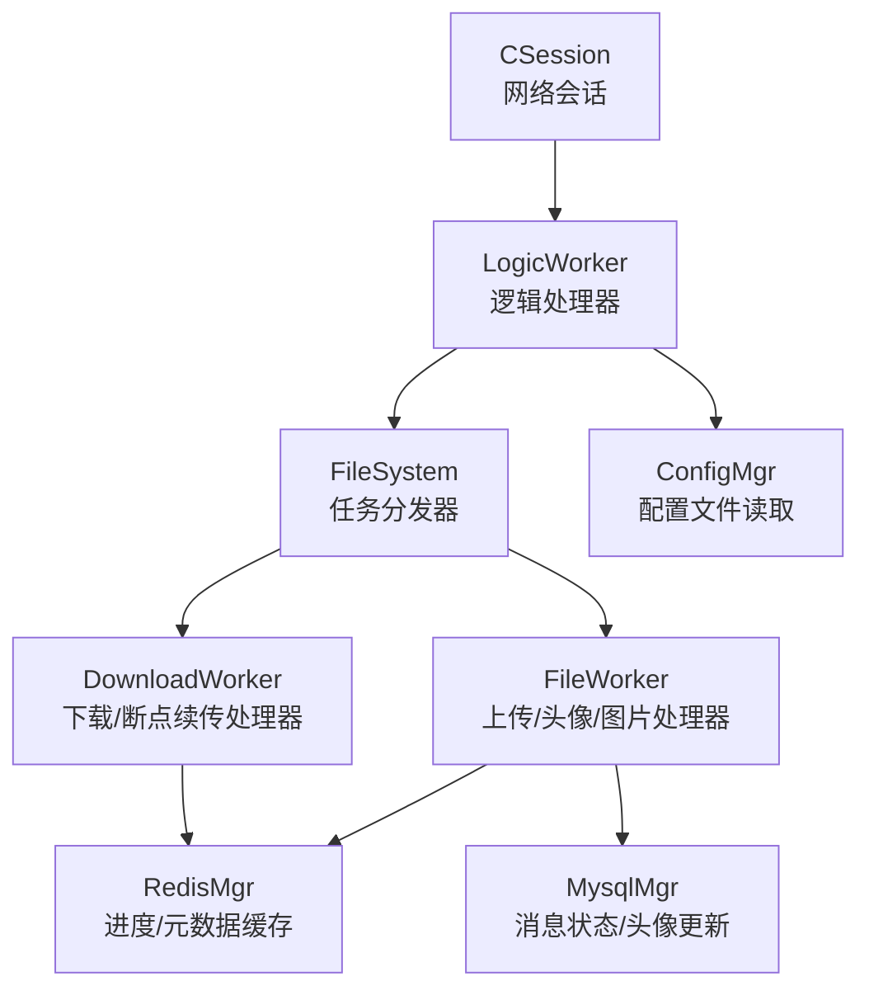
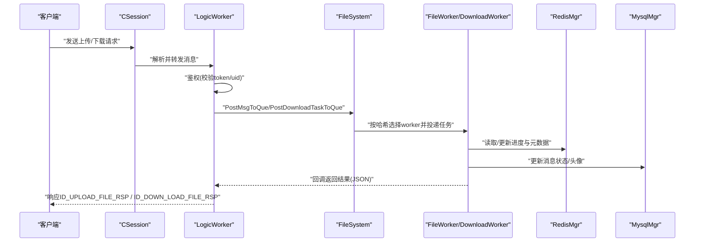
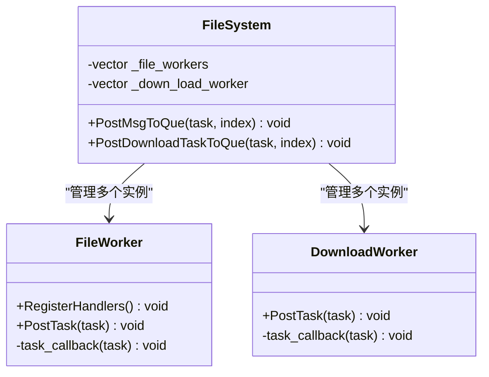
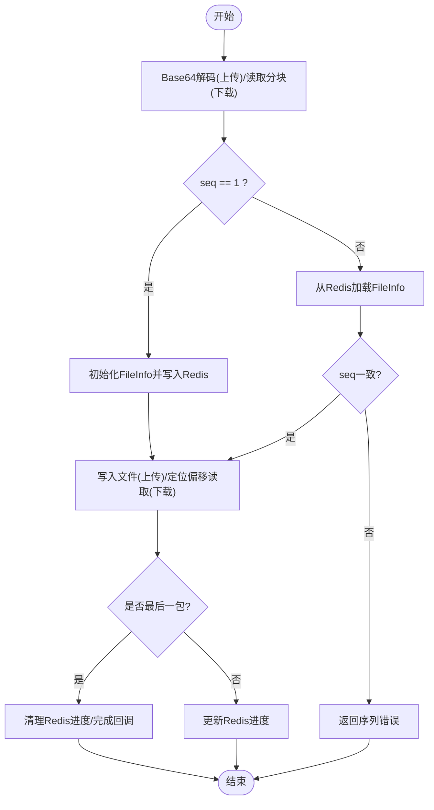
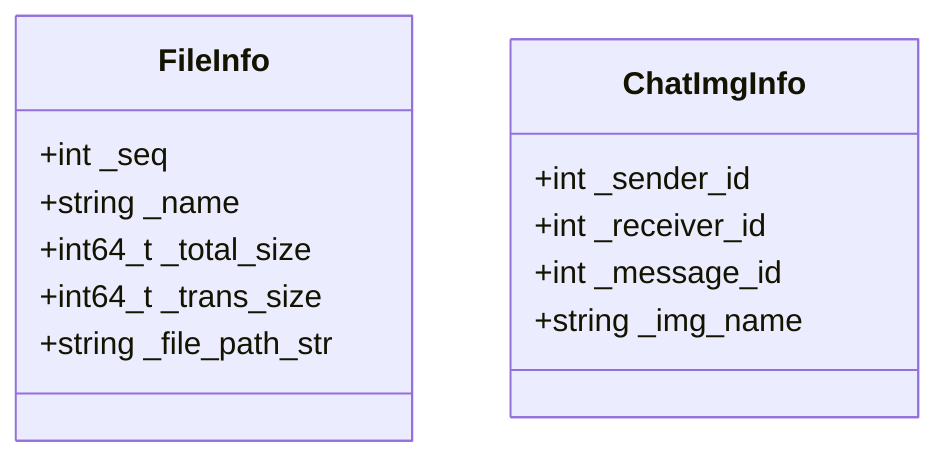
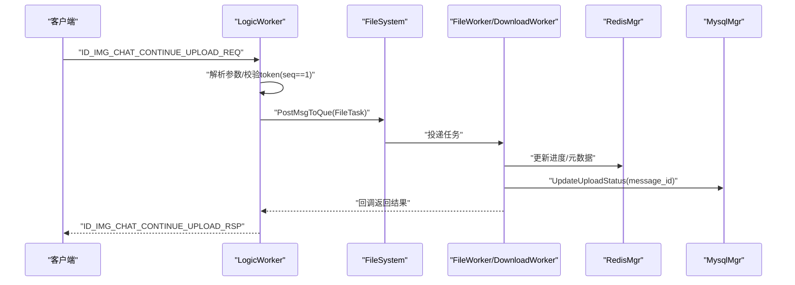
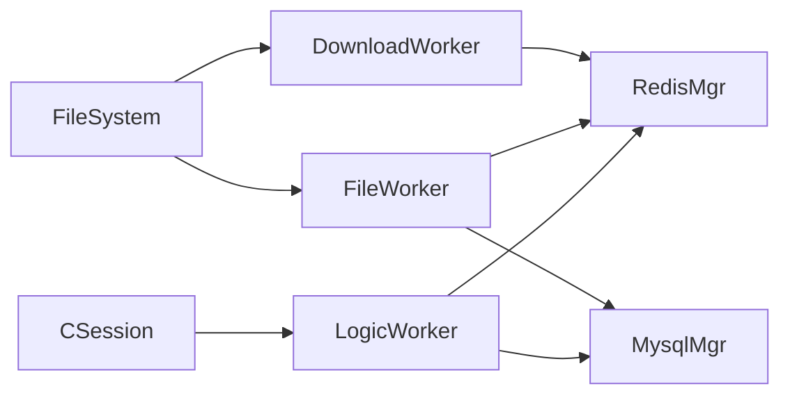

# ResourceServer资源存储服务

<cite>
**本文引用的文件**   
- [FileSystem.h](file://server/ResourceServer/include/FileSystem.h)
- [FileSystem.cpp](file://server/ResourceServer/src/FileSystem.cpp)
- [FileWorker.h](file://server/ResourceServer/include/FileWorker.h)
- [FileWorker.cpp](file://server/ResourceServer/src/FileWorker.cpp)
- [FileInfo.h](file://server/ResourceServer/include/FileInfo.h)
- [LogicSystem.h](file://server/ResourceServer/include/LogicSystem.h)
- [LogicSystem.cpp](file://server/ResourceServer/src/LogicSystem.cpp)
- [LogicWorker.h](file://server/ResourceServer/include/LogicWorker.h)
- [LogicWorker.cpp](file://server/ResourceServer/src/LogicWorker.cpp)
- [CSession.h](file://server/ResourceServer/include/CSession.h)
- [const.h](file://server/ResourceServer/include/const.h)
- [MysqlMgr.h](file://server/ResourceServer/include/MysqlMgr.h)
- [RedisMgr.h](file://server/ResourceServer/include/RedisMgr.h)
- [RedisMgr.cpp](file://server/ResourceServer/src/RedisMgr.cpp)
- [config.ini](file://server/ResourceServer/config/config.ini)
</cite>

## 更新摘要
**所做更改**
- 更新了Redis缓存管理部分，反映SetExp方法已采用新的SET ... EX语法
- 增强了Redis命令一致性说明，确保与其他服务保持统一
- 更新了Redis操作性能优化相关内容

## 目录
1. [简介](#简介)
2. [项目结构](#项目结构)
3. [核心组件](#核心组件)
4. [架构总览](#架构总览)
5. [详细组件分析](#详细组件分析)
6. [依赖关系分析](#依赖关系分析)
7. [性能考量](#性能考量)
8. [故障排查指南](#故障排查指南)
9. [结论](#结论)
10. [附录](#附录)

## 简介
ResourceServer资源存储服务负责聊天系统中的文件上传、下载、断点续传与进度管理。其核心能力包括：
- 基于分块的文件上传与下载，支持断点续传与进度回调
- 异步文件处理机制（FileWorker/DownloadWorker），具备并发控制与错误恢复
- 文件系统抽象层（FileSystem）统一调度工作线程，便于扩展本地存储与云存储后端
- 文件元数据管理（FileInfo）记录哈希、大小、类型、路径等关键信息
- 安全校验（Token鉴权）、状态同步（MySQL）、缓存与进度持久化（Redis）
- 统一的错误码与异常处理策略

## 项目结构
ResourceServer采用分层与职责分离的设计：
- 网络会话层：CSession 封装TCP读写与消息收发
- 逻辑路由层：LogicSystem/LogicWorker 解析请求、鉴权、路由到具体处理器
- 文件处理层：FileSystem 聚合 FileWorker/DownloadWorker，按文件名哈希分发任务
- 存储与缓存层：RedisMgr（连接池、键值操作、下载进度）、MysqlMgr（用户与消息状态）
- 配置与常量：config.ini、const.h（错误码、消息ID、传输参数）

**图示来源** 
- [CSession.h:1-64](file://server/ResourceServer/include/CSession.h#L1-L64)
- [LogicWorker.cpp:1-742](file://server/ResourceServer/src/LogicWorker.cpp#L1-L742)
- [FileSystem.cpp:1-29](file://server/ResourceServer/src/FileSystem.cpp#L1-L29)
- [FileWorker.cpp:1-660](file://server/ResourceServer/src/FileWorker.cpp#L1-L660)
- [RedisMgr.h:1-63](file://server/ResourceServer/include/RedisMgr.h#L1-L63)
- [MysqlMgr.h:1-44](file://server/ResourceServer/include/MysqlMgr.h#L1-L44)

**章节来源**
- [CSession.h:1-64](file://server/ResourceServer/include/CSession.h#L1-L64)
- [LogicWorker.cpp:1-742](file://server/ResourceServer/src/LogicWorker.cpp#L1-L742)
- [FileSystem.cpp:1-29](file://server/ResourceServer/src/FileSystem.cpp#L1-L29)
- [FileWorker.cpp:1-660](file://server/ResourceServer/src/FileWorker.cpp#L1-L660)
- [RedisMgr.h:1-63](file://server/ResourceServer/include/RedisMgr.h#L1-L63)
- [MysqlMgr.h:1-44](file://server/ResourceServer/include/MysqlMgr.h#L1-L44)

## 核心组件
- CSession：封装Boost.Asio的TCP套接字、读写队列、消息头解析与发送
- LogicSystem/LogicWorker：注册消息回调，解析JSON，鉴权与路由，构造任务并投递
- FileSystem：单例，维护多组FileWorker与DownloadWorker，按索引分发任务
- FileWorker/DownloadWorker：独立工作线程，队列+条件变量驱动，处理上传/下载
- FileInfo：文件元数据（序列号、名称、总大小、已传输大小、路径）
- RedisMgr：连接池、键值存取、下载进度与文件信息的序列化存储
- MysqlMgr：用户头像更新、聊天消息状态更新、查询消息详情

**章节来源**
- [CSession.h:1-64](file://server/ResourceServer/include/CSession.h#L1-L64)
- [LogicSystem.h:1-33](file://server/ResourceServer/include/LogicSystem.h#L1-L33)
- [LogicSystem.cpp:1-46](file://server/ResourceServer/src/LogicSystem.cpp#L1-L46)
- [FileSystem.h:1-21](file://server/ResourceServer/include/FileSystem.h#L1-L21)
- [FileSystem.cpp:1-29](file://server/ResourceServer/src/FileSystem.cpp#L1-L29)
- [FileWorker.h:1-91](file://server/ResourceServer/include/FileWorker.h#L1-L91)
- [FileWorker.cpp:1-660](file://server/ResourceServer/src/FileWorker.cpp#L1-L660)
- [FileInfo.h:1-26](file://server/ResourceServer/include/FileInfo.h#L1-L26)
- [RedisMgr.h:1-63](file://server/ResourceServer/include/RedisMgr.h#L1-L63)
- [MysqlMgr.h:1-44](file://server/ResourceServer/include/MysqlMgr.h#L1-L44)

## 架构总览
ResourceServer的请求处理流程如下：
- 客户端通过TCP发送消息，CSession接收并解析头部与数据
- LogicWorker根据消息ID调用对应回调，进行鉴权与参数校验
- 逻辑层将任务投递给FileSystem，按文件名哈希选择FileWorker或DownloadWorker
- FileWorker解码Base64、写入本地文件、更新Redis/MySQL，并通过回调返回结果
- DownloadWorker按序列号从Redis获取进度，定位偏移量读取分块，编码后返回

**图示来源** 
- [CSession.h:1-64](file://server/ResourceServer/include/CSession.h#L1-L64)
- [LogicWorker.cpp:1-742](file://server/ResourceServer/src/LogicWorker.cpp#L1-L742)
- [FileSystem.cpp:1-29](file://server/ResourceServer/src/FileSystem.cpp#L1-L29)
- [FileWorker.cpp:1-660](file://server/ResourceServer/src/FileWorker.cpp#L1-L660)
- [RedisMgr.h:1-63](file://server/ResourceServer/include/RedisMgr.h#L1-L63)
- [MysqlMgr.h:1-44](file://server/ResourceServer/include/MysqlMgr.h#L1-L44)

## 详细组件分析

### 文件系统抽象层 FileSystem
- 职责：统一管理FileWorker与DownloadWorker实例，提供任务投递接口
- 并发模型：初始化固定数量的工作者（FILE_WORKER_COUNT/DOWN_LOAD_WORKER_COUNT），按索引分发
- 扩展性：可替换底层存储实现（当前为本地磁盘，未来可扩展云存储）

**图示来源** 
- [FileSystem.h:1-21](file://server/ResourceServer/include/FileSystem.h#L1-L21)
- [FileSystem.cpp:1-29](file://server/ResourceServer/src/FileSystem.cpp#L1-L29)
- [FileWorker.h:1-91](file://server/ResourceServer/include/FileWorker.h#L1-L91)

**章节来源**
- [FileSystem.h:1-21](file://server/ResourceServer/include/FileSystem.h#L1-L21)
- [FileSystem.cpp:1-29](file://server/ResourceServer/src/FileSystem.cpp#L1-L29)

### 异步文件处理 FileWorker/DownloadWorker
- 工作线程：每个Worker持有独立线程与任务队列，使用互斥锁与条件变量协调
- 上传处理：
  - Base64解码、目录创建、按seq判断首包清空或追加写
  - 头像上传完成后更新用户头像与Redis缓存
  - 聊天图片上传完成后更新数据库状态，若接收者在线则通过gRPC通知ChatServer
- 下载处理：
  - seq=1时计算文件大小并初始化FileInfo存入Redis；后续从Redis恢复进度
  - 校验seq一致性，计算offset读取分块，Base64编码后返回
  - 最后一个包完成后清理Redis中的下载进度

**图示来源** 
- [FileWorker.cpp:1-660](file://server/ResourceServer/src/FileWorker.cpp#L1-L660)
- [RedisMgr.h:1-63](file://server/ResourceServer/include/RedisMgr.h#L1-L63)

**章节来源**
- [FileWorker.h:1-91](file://server/ResourceServer/include/FileWorker.h#L1-L91)
- [FileWorker.cpp:1-660](file://server/ResourceServer/src/FileWorker.cpp#L1-L660)

### 文件元数据管理 FileInfo
- 字段说明：
  - _seq：当前分块序列号
  - _name：文件名
  - _total_size：总大小
  - _trans_size：已传输大小
  - _file_path_str：存储路径
- ChatImgInfo：聊天图片关联信息（发送者、接收者、消息ID、图片名）

**图示来源** 
- [FileInfo.h:1-26](file://server/ResourceServer/include/FileInfo.h#L1-L26)

**章节来源**
- [FileInfo.h:1-26](file://server/ResourceServer/include/FileInfo.h#L1-L26)

### 逻辑路由与鉴权 LogicWorker
- 消息路由：注册各MSG_IDS对应的回调函数，解析JSON参数
- 鉴权机制：对下载与头像上传在seq=1时校验token（Redis中USERTOKENPREFIX）
- 任务分发：按文件名哈希选择FileWorker或DownloadWorker索引，保证同文件顺序处理
- 状态同步：上传完成后更新MySQL状态，必要时通过gRPC通知ChatServer

**图示来源** 
- [LogicWorker.cpp:1-742](file://server/ResourceServer/src/LogicWorker.cpp#L1-L742)
- [FileWorker.cpp:1-660](file://server/ResourceServer/src/FileWorker.cpp#L1-L660)
- [RedisMgr.h:1-63](file://server/ResourceServer/include/RedisMgr.h#L1-L63)
- [MysqlMgr.h:1-44](file://server/ResourceServer/include/MysqlMgr.h#L1-L44)

**章节来源**
- [LogicWorker.cpp:1-742](file://server/ResourceServer/src/LogicWorker.cpp#L1-L742)

### 网络会话 CSession
- 功能：封装Boost.Asio TCP套接字，提供异步读/写、消息队列、会话ID与用户ID管理
- 协议：自定义头部（长度、ID、数据长度）+ JSON数据体

**章节来源**
- [CSession.h:1-64](file://server/ResourceServer/include/CSession.h#L1-L64)

### Redis缓存管理
- **更新** SetExp方法已采用新的`SET ... EX`语法，替代已废弃的SETEX命令
- 原子性操作：使用Redis原子的SET命令配合EX选项设置过期时间，提高性能和可靠性
- 与其他服务保持一致：ChatServer、StatusServer等服务均采用相同的SET ... EX语法
- 主要用途：
  - 文件上传进度缓存（3600秒过期）
  - 文件下载进度缓存（3600秒过期）
  - 用户令牌验证缓存
  - 分布式锁实现

**图示来源** 
- [RedisMgr.cpp:83-113](file://server/ResourceServer/src/RedisMgr.cpp#L83-L113)

**章节来源**
- [RedisMgr.h:1-63](file://server/ResourceServer/include/RedisMgr.h#L1-L63)
- [RedisMgr.cpp:83-113](file://server/ResourceServer/src/RedisMgr.cpp#L83-L113)

### 配置与常量
- config.ini：服务端口、MySQL/Redis连接、输出路径、静态资源路径、ChatServer gRPC地址
- const.h：错误码枚举、消息ID定义、最大分块大小、工作者数量、Redis前缀等

**章节来源**
- [config.ini:1-27](file://server/ResourceServer/config/config.ini#L1-L27)
- [const.h:1-117](file://server/ResourceServer/include/const.h#L1-L117)

## 依赖关系分析
- 模块耦合：
  - LogicWorker依赖RedisMgr/MysqlMgr进行状态与鉴权
  - FileWorker/DownloadWorker依赖RedisMgr进行进度与元数据管理
  - FileSystem作为中间层解耦业务逻辑与具体Worker实现
- 外部依赖：
  - Boost.Asio用于网络IO
  - hiredis用于Redis交互
  - MySQL连接器用于数据库操作
  - nlohmann/json用于JSON解析

**图示来源** 
- [LogicWorker.cpp:1-742](file://server/ResourceServer/src/LogicWorker.cpp#L1-L742)
- [FileWorker.cpp:1-660](file://server/ResourceServer/src/FileWorker.cpp#L1-L660)
- [FileSystem.cpp:1-29](file://server/ResourceServer/src/FileSystem.cpp#L1-L29)
- [CSession.h:1-64](file://server/ResourceServer/include/CSession.h#L1-L64)

**章节来源**
- [LogicWorker.cpp:1-742](file://server/ResourceServer/src/LogicWorker.cpp#L1-L742)
- [FileWorker.cpp:1-660](file://server/ResourceServer/src/FileWorker.cpp#L1-L660)
- [FileSystem.cpp:1-29](file://server/ResourceServer/src/FileSystem.cpp#L1-L29)
- [CSession.h:1-64](file://server/ResourceServer/include/CSession.h#L1-L64)

## 性能考量
- 并发模型：每个Worker独立线程，避免阻塞；任务队列缓冲突发流量
- I/O优化：大文件分块传输（MAX_FILE_LEN=32KB），减少内存占用与网络拥塞
- 缓存策略：Redis存储下载进度与文件元数据，降低重复计算与磁盘I/O
- **Redis优化**：使用原子性的SET ... EX命令替代传统的SETEX命令，提升Redis操作性能
- 负载均衡：按文件名哈希选择Worker，保证同一文件顺序处理，不同文件并行
- 连接池：Redis连接池自动检测与重连，提升稳定性

## 故障排查指南
- 常见错误码：
  - FileNotExists：文件不存在
  - FileWritePermissionFailed：写入权限不足
  - FileReadPermissionFailed：读取权限不足
  - FileSeqInvalid：序列号不一致
  - FileOffsetInvalid：偏移量越界
  - RedisReadErr：Redis读取失败
- 排查步骤：
  - 检查config.ini中MySQL/Redis配置是否正确
  - 确认文件路径是否存在且可写
  - 验证客户端传递的seq与服务器端Redis中的进度一致
  - 查看日志输出（如"无法打开文件"、"文件不存在"等）
  - 对于头像上传，确认token有效且匹配uid
  - **Redis问题排查**：检查SET ... EX命令执行日志，确认Redis版本支持该语法

**章节来源**
- [const.h:1-117](file://server/ResourceServer/include/const.h#L1-L117)
- [FileWorker.cpp:1-660](file://server/ResourceServer/src/FileWorker.cpp#L1-L660)

## 结论
ResourceServer通过清晰的层次划分与异步Worker机制，实现了高效、可靠的文件上传下载与断点续传。结合Redis与MySQL的状态管理，确保了进度一致性与系统健壮性。**最新的Redis操作优化**采用原子性的SET ... EX语法，进一步提升了缓存操作的可靠性和性能，同时保持了与其他服务的一致性。未来可进一步扩展云存储后端与病毒扫描等安全能力。

## 附录
- 文件传输协议要点：
  - 头部：长度、消息ID、数据长度
  - 数据体：JSON格式，包含seq、name、total_size、trans_size、last、data等字段
- 进度回调：
  - 上传/下载完成后通过回调返回JSON结果，包含error、seq、name、total_size、current_size、is_last等
- 异常处理：
  - 所有异常均转换为标准错误码，确保客户端可统一处理
- **Redis命令规范**：
  - 使用SET key value EX seconds语法设置带过期时间的键值对
  - 替代已废弃的SETEX命令，提供更好的性能和兼容性