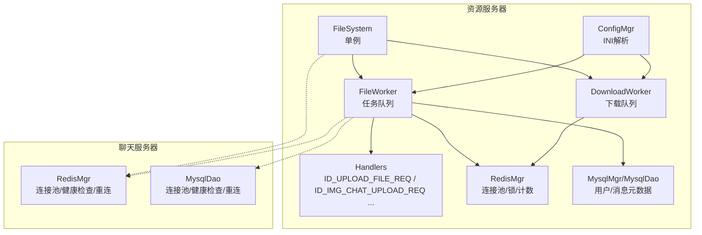
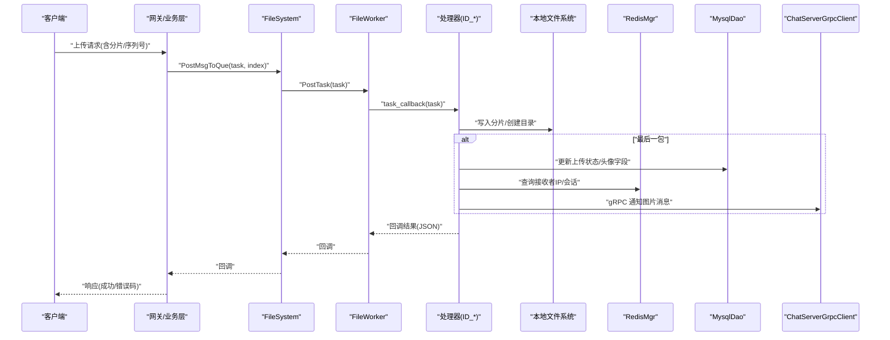
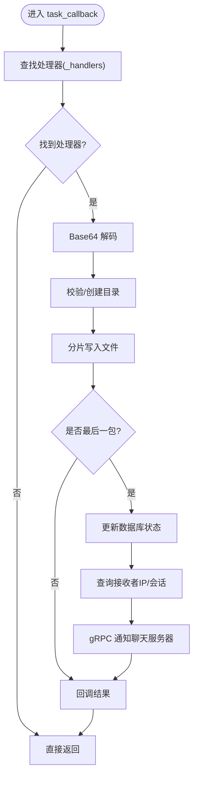
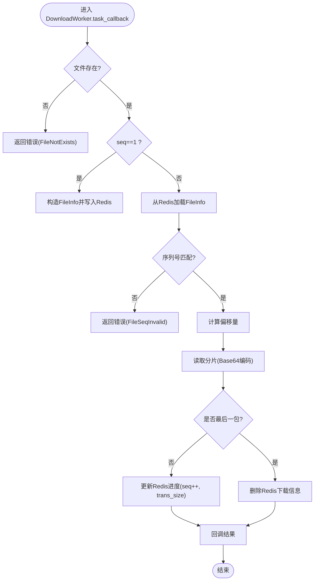
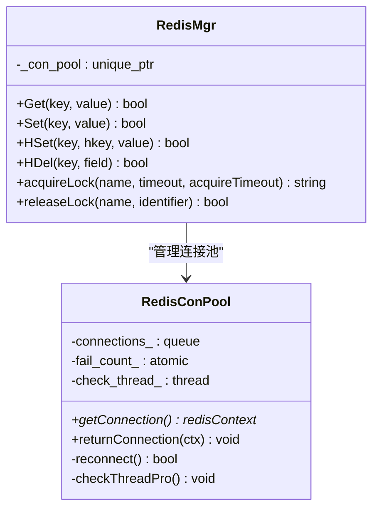
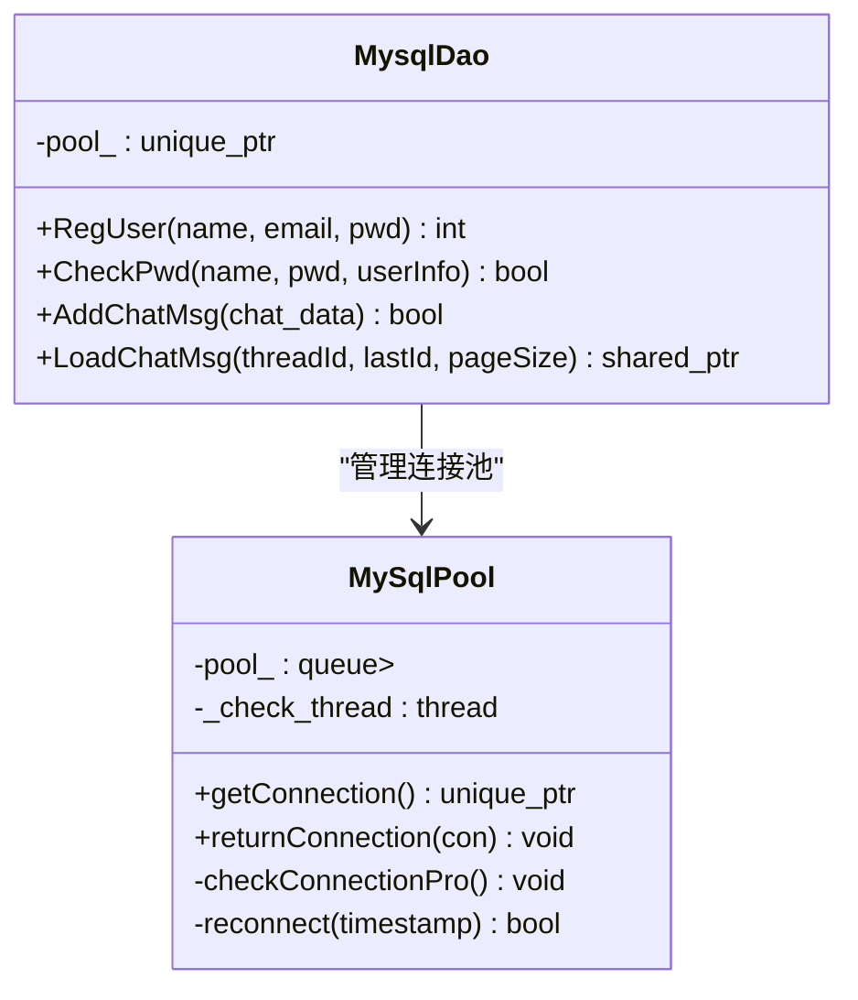
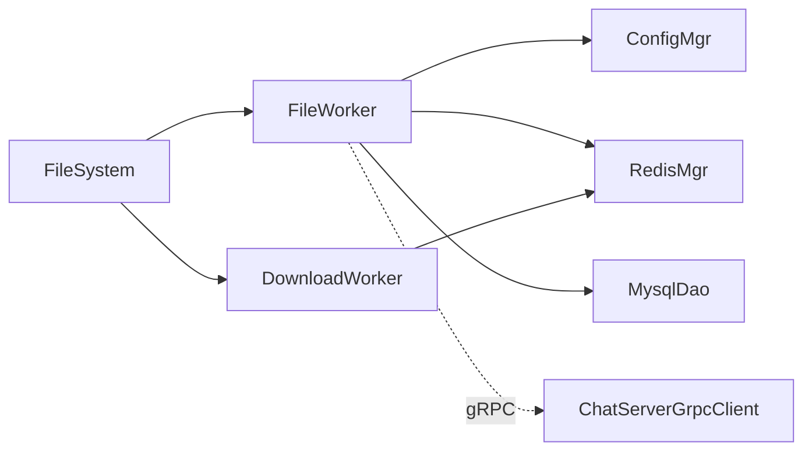

# 存储后端集成

<cite>
**本文引用的文件**   
- [FileSystem.h](file://server/ResourceServer/include/FileSystem.h)
- [FileSystem.cpp](file://server/ResourceServer/src/FileSystem.cpp)
- [FileWorker.h](file://server/ResourceServer/include/FileWorker.h)
- [FileWorker.cpp](file://server/ResourceServer/src/FileWorker.cpp)
- [FileInfo.h](file://server/ResourceServer/include/FileInfo.h)
- [ConfigMgr.h](file://server/ResourceServer/include/ConfigMgr.h)
- [config.ini（资源服务器）](file://server/ResourceServer/config/config.ini)
- [RedisMgr.h](file://server/ChatServer/include/RedisMgr.h)
- [MysqlDao.h](file://server/ChatServer/include/MysqlDao.h)
- [const.h（资源服务器）](file://server/ResourceServer/include/const.h)
- [const.h（聊天服务器）](file://server/ChatServer/include/const.h)
- [chatserver1.ini](file://server/ChatServer/config/chatserver1.ini)
- [config.ini（网关服务器）](file://server/GateServer/config/config.ini)
</cite>

## 目录
1. [简介](#简介)
2. [项目结构](#项目结构)
3. [核心组件](#核心组件)
4. [架构总览](#架构总览)
5. [详细组件分析](#详细组件分析)
6. [依赖关系分析](#依赖关系分析)
7. [性能考量](#性能考量)
8. [故障排查指南](#故障排查指南)
9. [结论](#结论)
10. [附录：配置与扩展指南](#附录：配置与扩展指南)

## 简介
本文件面向“存储后端集成”的落地实现，聚焦于资源服务器的本地文件系统存储、Redis 缓存与 MySQL 持久化的协同工作。文档涵盖：
- 存储后端的插件式架构与扩展机制
- 配置文件结构与参数说明（连接信息、认证凭据、路径与性能调优）
- 健康检查、故障转移与负载均衡策略
- 新增存储后端的步骤示例
- 性能测试与监控建议

当前代码库已实现基于本地文件系统的上传/下载、断点续传、头像与聊天图片处理，并通过 Redis 做状态与进度缓存，MySQL 做用户与消息元数据持久化。

## 项目结构
资源服务器负责文件与图片的上传/下载、分片与续传、状态同步；聊天服务器提供 Redis 连接池与 MySQL 访问封装；配置由 INI 文件驱动。



图表来源
- [FileSystem.h:1-21](file://server/ResourceServer/include/FileSystem.h#L1-L21)
- [FileSystem.cpp:1-29](file://server/ResourceServer/src/FileSystem.cpp#L1-L29)
- [FileWorker.h:1-91](file://server/ResourceServer/include/FileWorker.h#L1-L91)
- [FileWorker.cpp:1-660](file://server/ResourceServer/src/FileWorker.cpp#L1-L660)
- [RedisMgr.h:1-305](file://server/ChatServer/include/RedisMgr.h#L1-L305)
- [MysqlDao.h:1-270](file://server/ChatServer/include/MysqlDao.h#L1-L270)
- [ConfigMgr.h:1-90](file://server/ResourceServer/include/ConfigMgr.h#L1-L90)

章节来源
- [FileSystem.h:1-21](file://server/ResourceServer/include/FileSystem.h#L1-L21)
- [FileSystem.cpp:1-29](file://server/ResourceServer/src/FileSystem.cpp#L1-L29)
- [FileWorker.h:1-91](file://server/ResourceServer/include/FileWorker.h#L1-L91)
- [FileWorker.cpp:1-660](file://server/ResourceServer/src/FileWorker.cpp#L1-L660)
- [RedisMgr.h:1-305](file://server/ChatServer/include/RedisMgr.h#L1-L305)
- [MysqlDao.h:1-270](file://server/ChatServer/include/MysqlDao.h#L1-L270)
- [ConfigMgr.h:1-90](file://server/ResourceServer/include/ConfigMgr.h#L1-L90)

## 核心组件
- FileSystem：单例，维护多实例 FileWorker 与 DownloadWorker，按消息类型哈希分发任务，实现水平扩展与负载均衡。
- FileWorker：异步任务处理器，注册多种消息类型处理器（上传、头像、聊天图片、文件同步、续传），内部使用线程+队列+条件变量执行。
- DownloadWorker：独立下载线程，支持分块读取、Base64 编码返回、断点续传状态在 Redis 中维护。
- ConfigMgr：INI 配置解析器，提供静态输出路径与 bin 路径获取。
- RedisMgr：Redis 连接池，包含健康检查、自动重连、分布式锁、计数器等能力。
- MysqlDao：MySQL 连接池，包含健康检查、自动重连、SQL 操作封装。

章节来源
- [FileSystem.h:1-21](file://server/ResourceServer/include/FileSystem.h#L1-L21)
- [FileSystem.cpp:1-29](file://server/ResourceServer/src/FileSystem.cpp#L1-L29)
- [FileWorker.h:1-91](file://server/ResourceServer/include/FileWorker.h#L1-L91)
- [FileWorker.cpp:1-660](file://server/ResourceServer/src/FileWorker.cpp#L1-L660)
- [ConfigMgr.h:1-90](file://server/ResourceServer/include/ConfigMgr.h#L1-L90)
- [RedisMgr.h:1-305](file://server/ChatServer/include/RedisMgr.h#L1-L305)
- [MysqlDao.h:1-270](file://server/ChatServer/include/MysqlDao.h#L1-L270)

## 架构总览
资源服务器通过 FileSystem 将不同业务类型的文件任务路由到对应的 FileWorker/DownloadWorker，处理器根据消息类型调用具体逻辑：解码 Base64、写入本地磁盘、更新数据库状态、通过 gRPC 通知聊天服务器推送消息。Redis 用于会话、令牌、下载进度等热点数据的缓存与分布式锁。



图表来源
- [FileWorker.cpp:1-660](file://server/ResourceServer/src/FileWorker.cpp#L1-L660)
- [FileSystem.cpp:1-29](file://server/ResourceServer/src/FileSystem.cpp#L1-L29)
- [RedisMgr.h:1-305](file://server/ChatServer/include/RedisMgr.h#L1-L305)
- [MysqlDao.h:1-270](file://server/ChatServer/include/MysqlDao.h#L1-L270)

## 详细组件分析

### 组件一：FileSystem 与工作者池
- 职责：单例管理多个 FileWorker 与 DownloadWorker，按 index 分发任务，实现并发与负载均衡。
- 关键方法：PostMsgToQue、PostDownloadTaskToQue。
- 并发模型：每个 Worker 持有独立线程与任务队列，避免阻塞。

```mermaid
classDiagram
class FileSystem {
+PostMsgToQue(msg, index) void
+PostDownloadTaskToQue(msg, index) void
-_file_workers : vector<FileWorker>
-_down_load_worker : vector<DownloadWorker>
}
class FileWorker {
+RegisterHandlers() void
+PostTask(task) void
-task_callback(task) void
-_handlers : map<MSG_TYPES, handler>
-_work_thread : thread
-_task_que : queue<function()>
}
class DownloadWorker {
+PostTask(task) void
-task_callback(task) void
-_work_thread : thread
-_task_que : queue<DownloadTask>
}
FileSystem --> FileWorker : "管理多个实例"
FileSystem --> DownloadWorker : "管理多个实例"
```

图表来源
- [FileSystem.h:1-21](file://server/ResourceServer/include/FileSystem.h#L1-L21)
- [FileSystem.cpp:1-29](file://server/ResourceServer/src/FileSystem.cpp#L1-L29)
- [FileWorker.h:1-91](file://server/ResourceServer/include/FileWorker.h#L1-L91)

章节来源
- [FileSystem.h:1-21](file://server/ResourceServer/include/FileSystem.h#L1-L21)
- [FileSystem.cpp:1-29](file://server/ResourceServer/src/FileSystem.cpp#L1-L29)
- [FileWorker.h:1-91](file://server/ResourceServer/include/FileWorker.h#L1-L91)

### 组件二：FileWorker 处理器与消息路由
- 处理器注册：通过 _handlers 映射 MSG_TYPES 到具体 lambda 函数。
- 典型流程：Base64 解码 -> 校验/创建目录 -> 分片写入 -> 最后包触发后续动作（更新数据库、查询 Redis、gRPC 通知）。
- 错误处理：统一设置 error 字段并回调上层。



图表来源
- [FileWorker.cpp:1-660](file://server/ResourceServer/src/FileWorker.cpp#L1-L660)
- [const.h（资源服务器）:1-117](file://server/ResourceServer/include/const.h#L1-L117)

章节来源
- [FileWorker.cpp:1-660](file://server/ResourceServer/src/FileWorker.cpp#L1-L660)
- [const.h（资源服务器）:1-117](file://server/ResourceServer/include/const.h#L1-L117)

### 组件三：DownloadWorker 断点续传
- 首次下载：读取文件大小，初始化 FileInfo，写入 Redis 作为进度状态。
- 续传下载：从 Redis 读取历史进度，校验序列号与偏移量，定位读取分片。
- 完成清理：最后一包完成后删除 Redis 中的下载信息。



图表来源
- [FileWorker.cpp:480-660](file://server/ResourceServer/src/FileWorker.cpp#L480-L660)
- [FileInfo.h:1-26](file://server/ResourceServer/include/FileInfo.h#L1-L26)

章节来源
- [FileWorker.cpp:480-660](file://server/ResourceServer/src/FileWorker.cpp#L480-L660)
- [FileInfo.h:1-26](file://server/ResourceServer/include/FileInfo.h#L1-L26)

### 组件四：Redis 连接池与健康检查
- 连接池：初始化时建立固定数量连接，AUTH 认证，后台线程周期性 PING 检测存活。
- 故障恢复：失败计数累加，达到阈值尝试重连，成功后归还连接。
- 接口：Get/Set/LPush/RPush/HSet/HDel/Del/ExistsKey 以及分布式锁 acquire/release。



图表来源
- [RedisMgr.h:1-305](file://server/ChatServer/include/RedisMgr.h#L1-L305)

章节来源
- [RedisMgr.h:1-305](file://server/ChatServer/include/RedisMgr.h#L1-L305)

### 组件五：MySQL 连接池与健康检查
- 连接池：初始化若干连接，设置 schema，后台线程定期 SELECT 1 探测健康。
- 故障恢复：失败连接替换为新连接，保证池大小稳定。
- DAO 接口：用户注册、密码校验、好友申请、聊天消息增删改查等。



图表来源
- [MysqlDao.h:1-270](file://server/ChatServer/include/MysqlDao.h#L1-L270)

章节来源
- [MysqlDao.h:1-270](file://server/ChatServer/include/MysqlDao.h#L1-L270)

### 组件六：配置管理与路径解析
- ConfigMgr 解析 INI 文件，提供 GetValue(section, key)、GetFileOutPath() 等方法。
- 资源服务器 config.ini 定义 SelfServer、Mysql、Redis、Output、Static、PeerServer 等段。

章节来源
- [ConfigMgr.h:1-90](file://server/ResourceServer/include/ConfigMgr.h#L1-L90)
- [config.ini（资源服务器）:1-27](file://server/ResourceServer/config/config.ini#L1-L27)

## 依赖关系分析
- FileSystem 依赖 FileWorker/DownloadWorker，后者依赖 ConfigMgr、RedisMgr、MysqlDao。
- ResourceServer 与 ChatServer 通过 gRPC 通信（如 NotifyChatImgMsg）。
- 常量定义分布在两个 const.h，区分资源服务器与聊天服务器的消息类型、错误码与前缀。



图表来源
- [FileSystem.cpp:1-29](file://server/ResourceServer/src/FileSystem.cpp#L1-L29)
- [FileWorker.cpp:1-660](file://server/ResourceServer/src/FileWorker.cpp#L1-L660)
- [RedisMgr.h:1-305](file://server/ChatServer/include/RedisMgr.h#L1-L305)
- [MysqlDao.h:1-270](file://server/ChatServer/include/MysqlDao.h#L1-L270)

章节来源
- [const.h（资源服务器）:1-117](file://server/ResourceServer/include/const.h#L1-L117)
- [const.h（聊天服务器）:1-104](file://server/ChatServer/include/const.h#L1-L104)

## 性能考量
- 并发模型：FileSystem 维护多实例 Worker，按 index 分发，降低竞争；每个 Worker 独立线程与队列，避免阻塞。
- I/O 优化：分片读写、Base64 编解码仅在必要路径进行；下载时按 MAX_FILE_LEN 分块读取。
- 缓存策略：Redis 保存下载进度、用户会话与令牌，减少数据库压力。
- 连接池：Redis/MySQL 均实现连接池与后台健康检查，提升稳定性与吞吐。
- 可调参数：
  - FILE_WORKER_COUNT、DOWN_LOAD_WORKER_COUNT：控制并发度
  - MAX_FILE_LEN：分片大小
  - Redis/MySQL 连接池大小（由初始化决定）

章节来源
- [const.h（资源服务器）:1-117](file://server/ResourceServer/include/const.h#L1-L117)
- [FileWorker.cpp:1-660](file://server/ResourceServer/src/FileWorker.cpp#L1-L660)
- [RedisMgr.h:1-305](file://server/ChatServer/include/RedisMgr.h#L1-L305)
- [MysqlDao.h:1-270](file://server/ChatServer/include/MysqlDao.h#L1-L270)

## 故障排查指南
- 文件不存在/权限不足：检查 Output/Static 路径与进程权限；确认目录创建成功。
- Redis 连接失败：查看 AUTH 与 PING 日志；确认连接池健康检查线程运行；必要时重启服务重建连接。
- MySQL 连接失败：检查 URL、用户名、密码、schema；观察 SELECT 1 健康探测日志；连接池会自动重连。
- 序列号不匹配/偏移量异常：核对客户端 seq 与服务器端 FileInfo 一致性；确保 Redis 中进度未过期。
- gRPC 通知失败：检查 ChatServer 地址与端口；确认网络连通性与鉴权。

章节来源
- [FileWorker.cpp:1-660](file://server/ResourceServer/src/FileWorker.cpp#L1-L660)
- [RedisMgr.h:1-305](file://server/ChatServer/include/RedisMgr.h#L1-L305)
- [MysqlDao.h:1-270](file://server/ChatServer/include/MysqlDao.h#L1-L270)

## 结论
当前存储后端以本地文件系统为核心，结合 Redis 与 MySQL 形成高可用、可扩展的文件与元数据存储方案。通过 FileSystem 的工作者池与 FileWorker 的消息路由，系统具备良好的并发与扩展性。Redis/MySQL 的连接池与健康检查提升了鲁棒性。未来可在此基础上扩展对象存储与分布式存储后端，保持统一的插件接口与配置方式。

## 附录：配置与扩展指南

### 配置文件结构与参数说明
- 资源服务器 config.ini
  - [SelfServer]：Name、Host、Port
  - [Mysql]：Host、Port、User、Passwd、Schema
  - [Redis]：Host、Port、Passwd
  - [Output]：Path（文件输出目录）
  - [Static]：Path（静态资源目录）
  - [chatserverX]：Name、Host、Port（对端聊天服务器）
- 聊天服务器 chatserver1.ini
  - [GateServer]、[VarifyServer]、[StatusServer]、[SelfServer]、[Mysql]、[Redis]、[PeerServer]、[chatserverX]
- 网关服务器 config.ini
  - [GateServer]、[VarifyServer]、[StatusServer]、[Mysql]、[Redis]、[ResServer]

章节来源
- [config.ini（资源服务器）:1-27](file://server/ResourceServer/config/config.ini#L1-L27)
- [chatserver1.ini:1-30](file://server/ChatServer/config/chatserver1.ini#L1-L30)
- [config.ini（网关服务器）:1-23](file://server/GateServer/config/config.ini#L1-L23)

### 存储后端插件架构与扩展机制
- 插件入口：FileWorker 的 RegisterHandlers 通过 _handlers 映射 MSG_TYPES 到处理器。
- 扩展步骤：
  1) 新增消息类型（在 const.h 中定义）
  2) 在 FileWorker::RegisterHandlers 中注册新处理器
  3) 处理器内实现具体存储逻辑（本地/对象存储/分布式存储）
  4) 如需状态缓存或锁，调用 RedisMgr；如需元数据持久化，调用 MysqlDao
  5) 通过 gRPC 通知聊天服务器（如需要）
- 负载均衡：FileSystem 按 index 分发任务，可通过调整 FILE_WORKER_COUNT 与 DOWN_LOAD_WORKER_COUNT 改变并发度。

章节来源
- [FileWorker.cpp:1-660](file://server/ResourceServer/src/FileWorker.cpp#L1-L660)
- [const.h（资源服务器）:1-117](file://server/ResourceServer/include/const.h#L1-L117)
- [FileSystem.cpp:1-29](file://server/ResourceServer/src/FileSystem.cpp#L1-L29)

### 健康检查、故障转移与负载均衡策略
- 健康检查：Redis/MySQL 连接池后台线程定期 PING/SELECT 1，失败则标记并尝试重连。
- 故障转移：连接池自动替换失效连接，保证服务可用性。
- 负载均衡：FileSystem 的多 Worker 实例按 index 分发，避免热点集中；可按业务类型拆分不同 Worker 集合。

章节来源
- [RedisMgr.h:1-305](file://server/ChatServer/include/RedisMgr.h#L1-L305)
- [MysqlDao.h:1-270](file://server/ChatServer/include/MysqlDao.h#L1-L270)
- [FileSystem.cpp:1-29](file://server/ResourceServer/src/FileSystem.cpp#L1-L29)

### 添加新的存储后端支持（示例）
- 目标：新增对象存储（如 AWS S3、阿里云 OSS）作为文件后端。
- 步骤：
  1) 在 const.h 中新增对应 MSG_TYPES（如 ID_UPLOAD_OSS_REQ）
  2) 在 FileWorker::RegisterHandlers 中注册新处理器
  3) 处理器中实现上传逻辑（分片上传、签名、回调）
  4) 使用 RedisMgr 记录上传进度与临时状态
  5) 使用 MysqlDao 更新元数据（如文件 URL、大小、MD5）
  6) 通过 gRPC 通知聊天服务器（如需要）
- 注意事项：
  - 保持与现有处理器一致的 JSON 回调格式
  - 错误码与状态码统一在 const.h 中定义
  - 合理设置分片大小与重试策略

章节来源
- [FileWorker.cpp:1-660](file://server/ResourceServer/src/FileWorker.cpp#L1-L660)
- [const.h（资源服务器）:1-117](file://server/ResourceServer/include/const.h#L1-L117)

### 性能测试与监控建议
- 压测指标：QPS、延迟分布、CPU/内存占用、磁盘 IOPS、网络带宽
- 工具建议：自定义基准脚本模拟分片上传/下载，统计成功率与耗时
- 监控要点：
  - Redis/MySQL 连接池大小与活跃连接数
  - Worker 队列长度与处理耗时
  - 文件 I/O 错误率与重试次数
  - gRPC 通知成功率与延迟
- 调优方向：
  - 调整 FILE_WORKER_COUNT、DOWN_LOAD_WORKER_COUNT
  - 调整 MAX_FILE_LEN 与分片策略
  - 调整连接池大小与超时参数

章节来源
- [const.h（资源服务器）:1-117](file://server/ResourceServer/include/const.h#L1-L117)
- [RedisMgr.h:1-305](file://server/ChatServer/include/RedisMgr.h#L1-L305)
- [MysqlDao.h:1-270](file://server/ChatServer/include/MysqlDao.h#L1-L270)
- [FileWorker.cpp:1-660](file://server/ResourceServer/src/FileWorker.cpp#L1-L660)