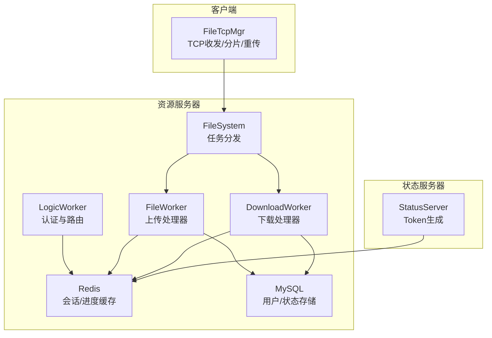
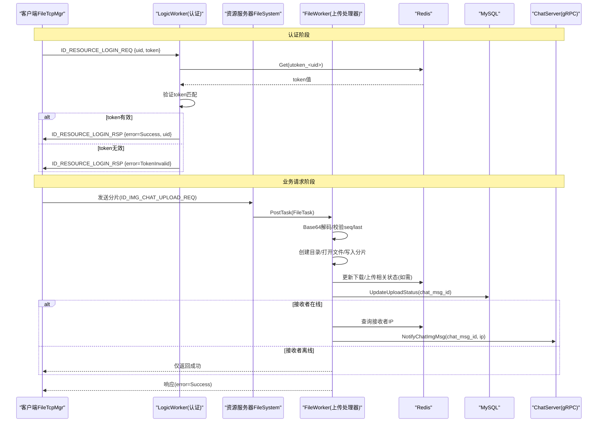
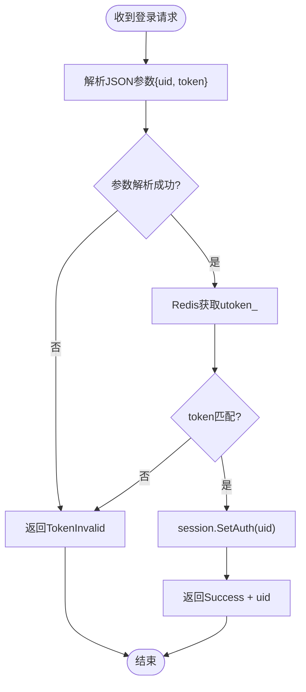
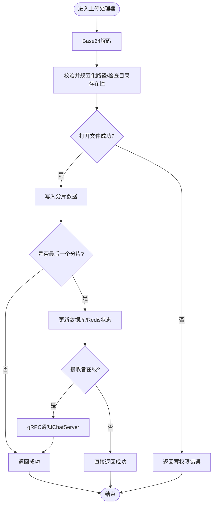
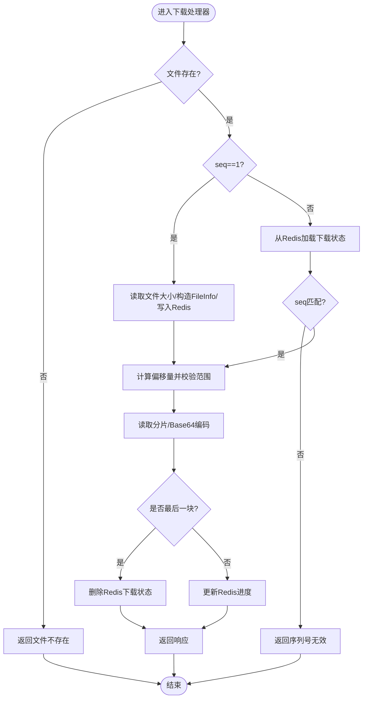
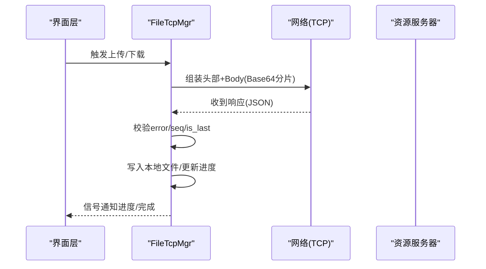
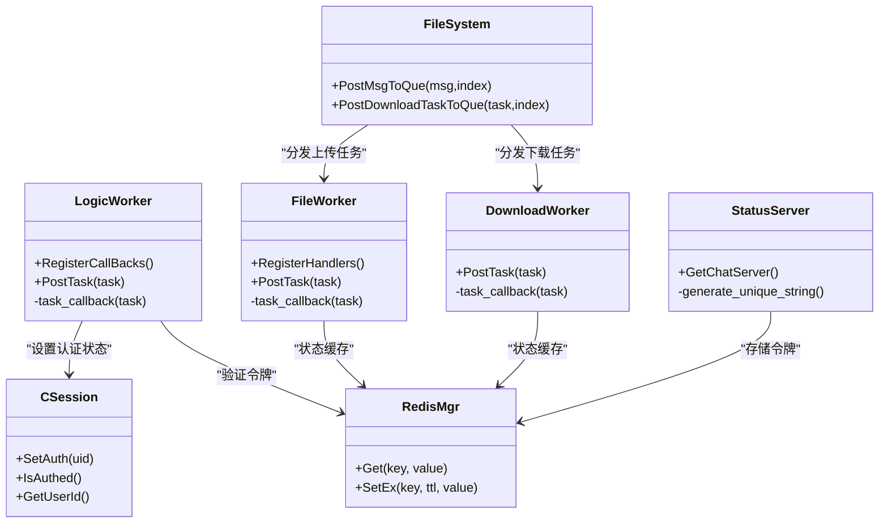

# 安全验证机制

<cite>
**本文引用的文件**   
- [LogicWorker.cpp](file://server/ResourceServer/src/LogicWorker.cpp)
- [CSession.h](file://server/ResourceServer/include/CSession.h)
- [CSession.cpp](file://server/ResourceServer/src/CSession.cpp)
- [const.h](file://server/ResourceServer/include/const.h)
- [StatusServiceImpl.cpp](file://server/StatusServer/src/StatusServiceImpl.cpp)
- [RedisMgr.cpp](file://server/StatusServer/src/RedisMgr.cpp)
- [FileWorker.h](file://server/ResourceServer/include/FileWorker.h)
- [FileWorker.cpp](file://server/ResourceServer/src/FileWorker.cpp)
- [FileSystem.h](file://server/ResourceServer/include/FileSystem.h)
- [FileSystem.cpp](file://server/ResourceServer/src/FileSystem.cpp)
- [data.h](file://server/ResourceServer/include/data.h)
- [UserMgr.h](file://server/ResourceServer/include/UserMgr.h)
- [UserMgr.cpp](file://server/ResourceServer/src/UserMgr.cpp)
- [base64.cpp](file://server/ResourceServer/src/base64.cpp)
- [filetcpmgr.h](file://client/llfcchat/include/filetcpmgr.h)
- [filetcpmgr.cpp](file://client/llfcchat/src/filetcpmgr.cpp)
</cite>

## 更新摘要
**变更内容**   
- 简化了资源服务器的安全验证机制，移除了基于SecurityUtil的复杂验证逻辑
- 改为直接从Redis读取utoken_<uid>键进行token匹配验证
- ResourceServer的LogicWorker.cpp中的认证流程已重写，不再依赖OpenSSL安全原语
- 采用统一的Redis令牌存储机制，所有服务共享相同的认证流程

## 目录
1. [简介](#简介)
2. [项目结构](#项目结构)
3. [核心组件](#核心组件)
4. [架构总览](#架构总览)
5. [详细组件分析](#详细组件分析)
6. [依赖关系分析](#依赖关系分析)
7. [性能考量](#性能考量)
8. [故障排查指南](#故障排查指南)
9. [结论](#结论)
10. [附录](#附录)

## 简介
本文件围绕资源服务器的文件传输与下载流程，梳理并完善"上传前安全检查、权限控制、访问令牌校验、恶意内容检测、SQL注入与XSS防护、安全最佳实践与安全审计"等关键安全能力。当前代码已实现：
- 分片上传与断点续传（客户端与服务端协作）
- Base64编解码与二进制流处理
- Redis状态缓存（下载进度、用户在线信息）
- MySQL持久化（头像更新、聊天图片上传状态）
- 错误码体系与基础权限判断（路径存在性、读写权限、序列号与偏移量校验）

**最新更新**：资源服务器的安全验证机制已简化，移除了基于SecurityUtil的复杂验证逻辑，改为直接从Redis读取utoken_<uid>键进行token匹配验证。ResourceServer的LogicWorker.cpp中的认证流程已重写，不再依赖OpenSSL安全原语。

为达到企业级安全要求，需在现有基础上补充：
- 严格的文件格式与大小限制、MIME类型白名单、病毒扫描与内容检测
- 基于令牌的身份鉴权与最小权限访问控制
- 输入输出编码与防注入/XSS策略
- 可观测性与审计日志、漏洞扫描与渗透测试流程

## 项目结构
资源服务器侧负责文件写入与读取的并发工作线程；客户端侧负责TCP协议封装、分片发送与接收、进度与重传逻辑。常量定义集中管理错误码、消息ID、最大分片长度等。

图表来源
- [FileSystem.h:1-21](file://server/ResourceServer/include/FileSystem.h#L1-L21)
- [FileSystem.cpp:1-29](file://server/ResourceServer/src/FileSystem.cpp#L1-L29)
- [FileWorker.h:1-91](file://server/ResourceServer/include/FileWorker.h#L1-L91)
- [FileWorker.cpp:1-660](file://server/ResourceServer/src/FileWorker.cpp#L1-L660)
- [LogicWorker.cpp:693-731](file://server/ResourceServer/src/LogicWorker.cpp#L693-L731)
- [StatusServiceImpl.cpp:17-42](file://server/StatusServer/src/StatusServiceImpl.cpp#L17-L42)
- [const.h:1-117](file://server/ResourceServer/include/const.h#L1-L117)
- [filetcpmgr.h:1-85](file://client/llfcchat/include/filetcpmgr.h#L1-L85)
- [filetcpmgr.cpp:1-800](file://client/llfcchat/src/filetcpmgr.cpp#L1-L800)

章节来源
- [FileSystem.h:1-21](file://server/ResourceServer/include/FileSystem.h#L1-L21)
- [FileSystem.cpp:1-29](file://server/ResourceServer/src/FileSystem.cpp#L1-L29)
- [FileWorker.h:1-91](file://server/ResourceServer/include/FileWorker.h#L1-L91)
- [FileWorker.cpp:1-660](file://server/ResourceServer/src/FileWorker.cpp#L1-L660)
- [const.h:1-117](file://server/ResourceServer/include/const.h#L1-L117)
- [filetcpmgr.h:1-85](file://client/llfcchat/include/filetcpmgr.h#L1-L85)
- [filetcpmgr.cpp:1-800](file://client/llfcchat/src/filetcpmgr.cpp#L1-L800)

## 核心组件
- **LogicWorker**：新增的统一认证入口，处理资源服务登录请求，从Redis验证utoken_<uid>令牌
- **CSession**：会话管理，维护认证状态和用户ID
- **FileWorker**：注册多种上传处理器（普通文件、头像、聊天图片、文件信息同步、续传），完成Base64解码、目录创建、分片写入、回调通知、数据库状态更新与Redis缓存更新
- **DownloadWorker**：按序列号分块读取文件，维护断点续传状态于Redis，返回Base64编码的分片数据
- **FileSystem**：多实例FileWorker与DownloadWorker的任务队列分发
- **StatusServer**：生成和管理用户登录令牌，存储在Redis中
- const.h：集中定义错误码、消息ID、常量（如MAX_FILE_LEN）
- data.h：用户信息与聊天数据结构
- UserMgr：用户会话映射（内存中uid到CSession）
- base64.cpp：Base64编解码工具
- 客户端FileTcpMgr：TCP粘包处理、请求/响应解析、分片发送与续传、进度上报与UI信号

章节来源
- [LogicWorker.cpp:693-731](file://server/ResourceServer/src/LogicWorker.cpp#L693-L731)
- [CSession.h:26-40](file://server/ResourceServer/include/CSession.h#L26-L40)
- [CSession.cpp:26-40](file://server/ResourceServer/src/CSession.cpp#L26-L40)
- [FileWorker.cpp:46-455](file://server/ResourceServer/src/FileWorker.cpp#L46-L455)
- [FileWorker.cpp:480-660](file://server/ResourceServer/src/FileWorker.cpp#L480-L660)
- [FileSystem.cpp:1-29](file://server/ResourceServer/src/FileSystem.cpp#L1-L29)
- [const.h:5-117](file://server/ResourceServer/include/const.h#L5-L117)
- [data.h:1-60](file://server/ResourceServer/include/data.h#L1-L60)
- [UserMgr.cpp:1-46](file://server/ResourceServer/src/UserMgr.cpp#L1-L46)
- [base64.cpp:68-118](file://server/ResourceServer/src/base64.cpp#L68-L118)
- [filetcpmgr.cpp:175-800](file://client/llfcchat/src/filetcpmgr.cpp#L175-L800)

## 架构总览
下图展示一次聊天图片上传的端到端流程，包含客户端分片发送、服务端解码与落盘、状态更新与通知。

图表来源
- [LogicWorker.cpp:693-731](file://server/ResourceServer/src/LogicWorker.cpp#L693-L731)
- [FileWorker.cpp:195-280](file://server/ResourceServer/src/FileWorker.cpp#L195-L280)
- [StatusServiceImpl.cpp:17-42](file://server/StatusServer/src/StatusServiceImpl.cpp#L17-L42)
- [const.h:72-95](file://server/ResourceServer/include/const.h#L72-L95)
- [filetcpmgr.cpp:521-608](file://client/llfcchat/src/filetcpmgr.cpp#L521-L608)

## 详细组件分析

### 统一认证机制（LogicWorker）
**更新**：认证机制已简化，移除了复杂的SecurityUtil验证逻辑

- **功能要点**
  - 处理ID_RESOURCE_LOGIN_REQ请求，验证{uid, token}参数
  - 直接从Redis读取utoken_<uid>键进行token匹配验证
  - 验证成功后调用session->SetAuth(uid)标记会话已认证
  - 未认证状态下除登录外的所有请求都返回TokenInvalid并关闭连接
  - 不再依赖OpenSSL安全原语，简化了认证流程

- **安全现状与建议**
  - 现状：采用统一的Redis令牌验证，安全性更高且易于维护
  - 建议：增加令牌过期时间检查；记录认证失败的审计日志

图表来源
- [LogicWorker.cpp:693-731](file://server/ResourceServer/src/LogicWorker.cpp#L693-L731)
- [const.h:17](file://server/ResourceServer/include/const.h#L17)

章节来源
- [LogicWorker.cpp:693-731](file://server/ResourceServer/src/LogicWorker.cpp#L693-L731)
- [const.h:17](file://server/ResourceServer/include/const.h#L17)

### 会话管理（CSession）
- **功能要点**
  - 维护认证状态(_authed)和用户ID(_user_uid)
  - SetAuth方法设置认证状态和用户ID
  - IsAuthed方法检查会话是否已认证
  - GetUserId方法获取当前用户ID

- **安全意义**：结合令牌校验确保仅向合法会话推送

章节来源
- [CSession.h:26-40](file://server/ResourceServer/include/CSession.h#L26-L40)
- [CSession.cpp:26-40](file://server/ResourceServer/src/CSession.cpp#L26-L40)

### 令牌生成与管理（StatusServer）
- **功能要点**
  - 使用UUID生成唯一token字符串
  - 将token存储在Redis中，键格式为utoken_<uid>
  - 设置TTL为86400秒（24小时）
  - 每次成功的GetChatServer都会覆盖之前的token

- **安全特性**：自动过期机制防止令牌长期有效

章节来源
- [StatusServiceImpl.cpp:17-42](file://server/StatusServer/src/StatusServiceImpl.cpp#L17-L42)
- [RedisMgr.cpp:82-113](file://server/StatusServer/src/RedisMgr.cpp#L82-L113)

### 上传处理器（FileWorker）
- **功能要点**
  - Base64解码后直接写入目标路径，支持首包trunc与后续包append模式
  - 目录不存在时自动创建
  - 写失败或无法打开文件时返回对应错误码
  - 头像上传完成后更新用户图标并刷新Redis缓存
  - 聊天图片上传完成后更新数据库状态，并通过gRPC通知ChatServer
- **安全现状与建议**
  - 现状：无格式/大小/MIME校验，无病毒扫描，无内容检测，无路径穿越防护
  - 建议：在解码前进行格式与大小校验；引入沙箱或隔离目录；增加病毒扫描与内容检测；对路径做规范化与白名单校验

图表来源
- [FileWorker.cpp:46-109](file://server/ResourceServer/src/FileWorker.cpp#L46-L109)
- [FileWorker.cpp:195-280](file://server/ResourceServer/src/FileWorker.cpp#L195-L280)
- [const.h:5-29](file://server/ResourceServer/include/const.h#L5-L29)

章节来源
- [FileWorker.cpp:46-109](file://server/ResourceServer/src/FileWorker.cpp#L46-L109)
- [FileWorker.cpp:195-280](file://server/ResourceServer/src/FileWorker.cpp#L195-L280)
- [const.h:5-29](file://server/ResourceServer/include/const.h#L5-L29)

### 下载处理器（DownloadWorker）
- **功能要点**
  - 首包获取文件大小并初始化FileInfo存入Redis
  - 续传时从Redis恢复状态，校验seq一致性
  - 计算偏移量并读取固定长度分片，Base64编码返回
  - 最后一片完成后清理Redis中的下载状态
- **安全现状与建议**
  - 现状：有seq与offset校验，但缺少对请求来源的鉴权与路径访问控制
  - 建议：校验token与uid一致性；限制可下载目录；记录审计日志

图表来源
- [FileWorker.cpp:525-660](file://server/ResourceServer/src/FileWorker.cpp#L525-L660)
- [const.h:5-29](file://server/ResourceServer/include/const.h#L5-L29)

章节来源
- [FileWorker.cpp:525-660](file://server/ResourceServer/src/FileWorker.cpp#L525-L660)
- [const.h:5-29](file://server/ResourceServer/include/const.h#L5-L29)

### 客户端文件传输（FileTcpMgr）
- **功能要点**
  - TCP粘包处理：先读头部（消息ID+长度），再读消息体
  - 发送队列与拥塞窗口控制，避免阻塞
  - 上传/下载分片循环，续传逻辑与进度上报
  - 聊天图片上传成功后移动本地临时文件至最终目录
- **安全现状与建议**
  - 现状：未对JSON字段做严格校验，未对文件名/路径做白名单校验
  - 建议：严格校验请求字段与类型；限制可操作目录；对敏感信息进行脱敏输出

图表来源
- [filetcpmgr.cpp:175-241](file://client/llfcchat/src/filetcpmgr.cpp#L175-L241)
- [filetcpmgr.cpp:334-433](file://client/llfcchat/src/filetcpmgr.cpp#L334-L433)
- [filetcpmgr.cpp:695-800](file://client/llfcchat/src/filetcpmgr.cpp#L695-L800)

章节来源
- [filetcpmgr.cpp:175-241](file://client/llfcchat/src/filetcpmgr.cpp#L175-L241)
- [filetcpmgr.cpp:334-433](file://client/llfcchat/src/filetcpmgr.cpp#L334-L433)
- [filetcpmgr.cpp:695-800](file://client/llfcchat/src/filetcpmgr.cpp#L695-L800)

### 常量与错误码（const.h）
- **作用**：统一错误码、消息ID、分片大小、Redis键前缀、锁超时等
- **安全意义**：错误码用于区分权限、路径、序列化、网络等异常，便于审计与定位
- **更新**：USERTOKENPREFIX定义为"utoken_"，用于Redis令牌存储

章节来源
- [const.h:5-117](file://server/ResourceServer/include/const.h#L5-L117)

### 用户会话管理（UserMgr）
- **作用**：内存中维护uid到CSession的映射，用于在线推送
- **安全意义**：结合令牌校验确保仅向合法会话推送

章节来源
- [UserMgr.h:1-22](file://server/ResourceServer/include/UserMgr.h#L1-L22)
- [UserMgr.cpp:1-46](file://server/ResourceServer/src/UserMgr.cpp#L1-L46)

### Base64编解码（base64.cpp）
- **作用**：上传/下载过程中对二进制数据进行Base64编解码
- **安全注意**：需配合长度与格式校验，防止畸形输入导致异常

章节来源
- [base64.cpp:68-118](file://server/ResourceServer/src/base64.cpp#L68-L118)

## 依赖关系分析
- **组件耦合**
  - LogicWorker依赖RedisMgr进行令牌验证
  - FileWorker依赖base64、ConfigMgr、MysqlMgr、RedisMgr、ChatServerGrpcClient
  - DownloadWorker依赖RedisMgr、文件系统IO
  - FileSystem聚合多个FileWorker/DownloadWorker实例
  - 客户端FileTcpMgr依赖UserMgr、QJson/QByteArray等Qt库
- **外部依赖**
  - Redis：会话、进度、用户信息缓存、用户登录令牌
  - MySQL：用户头像、聊天图片上传状态
  - gRPC：跨服务通知（ChatServer）

图表来源
- [LogicWorker.cpp:693-731](file://server/ResourceServer/src/LogicWorker.cpp#L693-L731)
- [CSession.h:26-40](file://server/ResourceServer/include/CSession.h#L26-L40)
- [FileSystem.h:1-21](file://server/ResourceServer/include/FileSystem.h#L1-L21)
- [FileWorker.h:1-91](file://server/ResourceServer/include/FileWorker.h#L1-L91)
- [StatusServiceImpl.cpp:17-42](file://server/StatusServer/src/StatusServiceImpl.cpp#L17-L42)
- [RedisMgr.cpp:82-113](file://server/StatusServer/src/RedisMgr.cpp#L82-L113)

章节来源
- [FileSystem.h:1-21](file://server/ResourceServer/include/FileSystem.h#L1-L21)
- [FileWorker.h:1-91](file://server/ResourceServer/include/FileWorker.h#L1-L91)
- [const.h:5-117](file://server/ResourceServer/include/const.h#L5-L117)
- [UserMgr.h:1-22](file://server/ResourceServer/include/UserMgr.h#L1-L22)

## 性能考量
- **分片大小**：MAX_FILE_LEN=32KB，平衡了网络开销与内存占用
- **并发模型**：多实例FileWorker/DownloadWorker提升吞吐
- **断点续传**：Redis保存进度，降低重复传输成本
- **认证优化**：简化的Redis令牌验证减少了认证开销
- **建议优化**
  - 增加限流与背压，避免突发流量打满磁盘IO
  - 对大文件启用异步校验（哈希/病毒扫描）
  - 合理设置Redis过期时间，避免脏数据堆积
  - 考虑令牌缓存以减少Redis访问频率

## 故障排查指南
- **常见错误码**
  - TokenInvalid/UIdInvalid：令牌或用户ID无效
  - FileNotExists/FileReadPermissionFailed/FileWritePermissionFailed：文件路径/权限问题
  - FileSeqInvalid/FileOffsetInvalid：序列号或偏移量不一致
  - RedisReadErr：Redis读取失败
- **认证问题排查**
  - 检查Redis中utoken_<uid>键是否存在
  - 验证token值是否与请求中的token一致
  - 确认StatusServer是否正确生成和存储令牌
  - 检查令牌TTL是否过期
- **排查步骤**
  - 检查请求头与Body字段完整性（error、seq、name、total_size、current_size、is_last等）
  - 核对Redis中下载状态是否存在且seq一致
  - 确认MySQL状态更新是否成功
  - 查看gRPC通知是否送达ChatServer

章节来源
- [const.h:5-29](file://server/ResourceServer/include/const.h#L5-L29)
- [LogicWorker.cpp:693-731](file://server/ResourceServer/src/LogicWorker.cpp#L693-L731)
- [FileWorker.cpp:525-660](file://server/ResourceServer/src/FileWorker.cpp#L525-L660)
- [filetcpmgr.cpp:334-433](file://client/llfcchat/src/filetcpmgr.cpp#L334-L433)

## 结论
当前系统已具备稳定的分片上传/下载与断点续传能力，安全验证机制已简化为统一的Redis令牌验证，提高了安全性和可维护性。但在上传前安全检查、权限控制、访问令牌校验、恶意内容检测与安全防护方面仍需增强。建议在网关/鉴权层统一接入令牌校验与最小权限控制，在资源服务器内补齐格式/大小/MIME校验、病毒扫描与内容检测，并对所有输入输出进行严格校验与编码，同时建立完善的审计日志与漏洞扫描流程。

**最新改进**：通过移除复杂的SecurityUtil验证逻辑，采用直接的Redis令牌验证，系统的安全性和性能都得到了提升。

## 附录

### 认证流程详解
**更新**：认证流程已简化为Redis令牌验证

1. **令牌生成**（StatusServer）
   - 生成UUID作为token
   - 存储到Redis：utoken_<uid> = token
   - 设置TTL为86400秒

2. **令牌验证**（ResourceServer）
   - 接收{uid, token}参数
   - 从Redis读取utoken_<uid>
   - 比较token是否匹配
   - 验证成功后设置会话认证状态

3. **会话管理**（CSession）
   - SetAuth(uid)标记会话已认证
   - IsAuthed()检查认证状态
   - GetUserId()获取用户ID

### 上传前安全检查清单（建议落地）
- **输入验证**
  - 校验JSON字段类型与必填项（name、seq、total_size、trans_size、last、data等）
  - 限制name长度与字符集，禁止路径穿越字符（../、\等）
  - 限制data长度与Base64合法性
- **文件格式与大小**
  - 白名单允许的文件扩展名与MIME类型（如image/jpeg、image/png等）
  - 单分片与总大小上限（例如单分片≤32KB，总大小≤10MB）
- **病毒扫描与内容检测**
  - 集成杀毒引擎（如ClamAV）对分片或完整文件扫描
  - 图像EXIF/元数据清洗，拒绝脚本嵌入
- **输出编码与XSS防护**
  - 前端渲染图片时使用安全的DOM API，避免innerHTML
  - 后端返回文件名等用户可控字段时进行HTML实体编码
- **SQL注入防护**
  - 所有数据库操作使用参数化查询/ORM
  - 禁用动态拼接SQL，严格校验输入类型
- **安全头与传输安全**
  - 强制HTTPS/TLS，设置HSTS、CSP、X-Content-Type-Options等
  - 限制Cookie属性（Secure、HttpOnly、SameSite）
- **审计与监控**
  - 记录上传/下载请求、错误码、耗时、源IP、UA
  - 告警阈值：异常错误率、超大文件、频繁失败
- **漏洞扫描与渗透测试**
  - 定期执行静态/动态扫描（SAST/DAST）、依赖漏洞扫描
  - 模拟越权访问、路径遍历、注入攻击进行验证

### 安全最佳实践
- **令牌管理**
  - 使用强随机数生成token
  - 设置合理的过期时间
  - 每次登录覆盖旧token
  - 记录令牌使用日志
- **会话安全**
  - 会话状态存储在内存中
  - 认证状态原子操作保证一致性
  - 未认证会话自动关闭连接
- **数据传输安全**
  - Base64编码保护二进制数据
  - JSON格式传输结构化数据
  - 错误信息不泄露敏感细节

[本节为通用最佳实践，不直接分析具体文件]