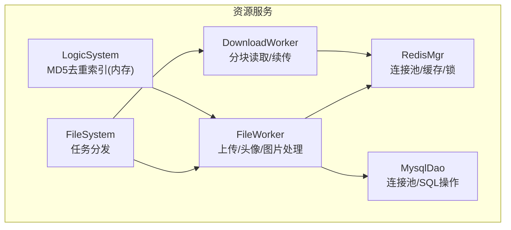
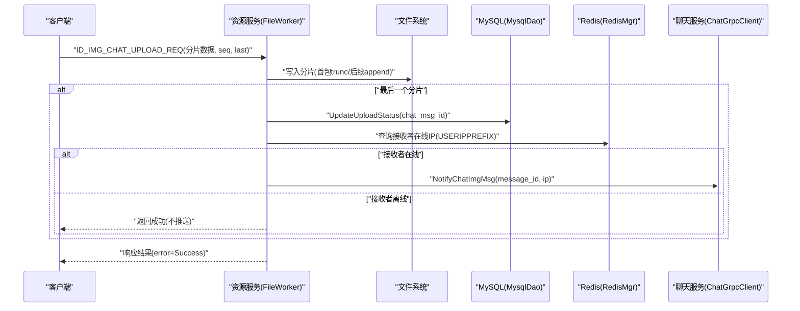
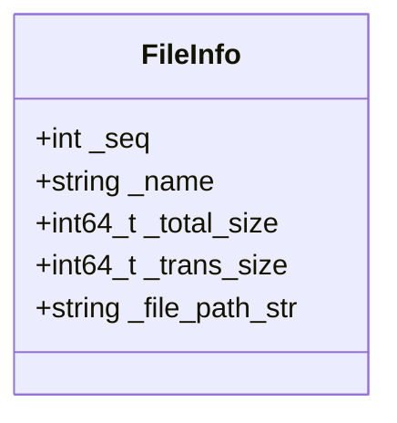
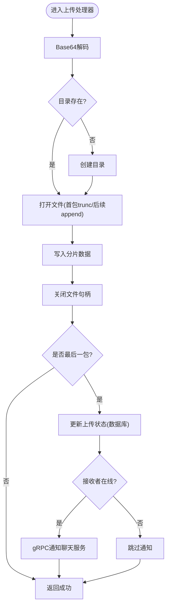
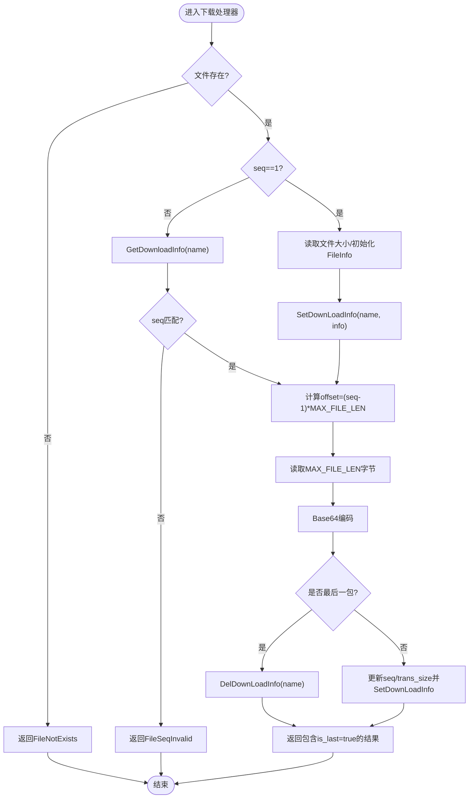
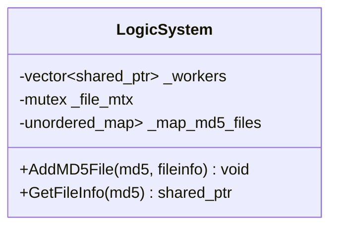
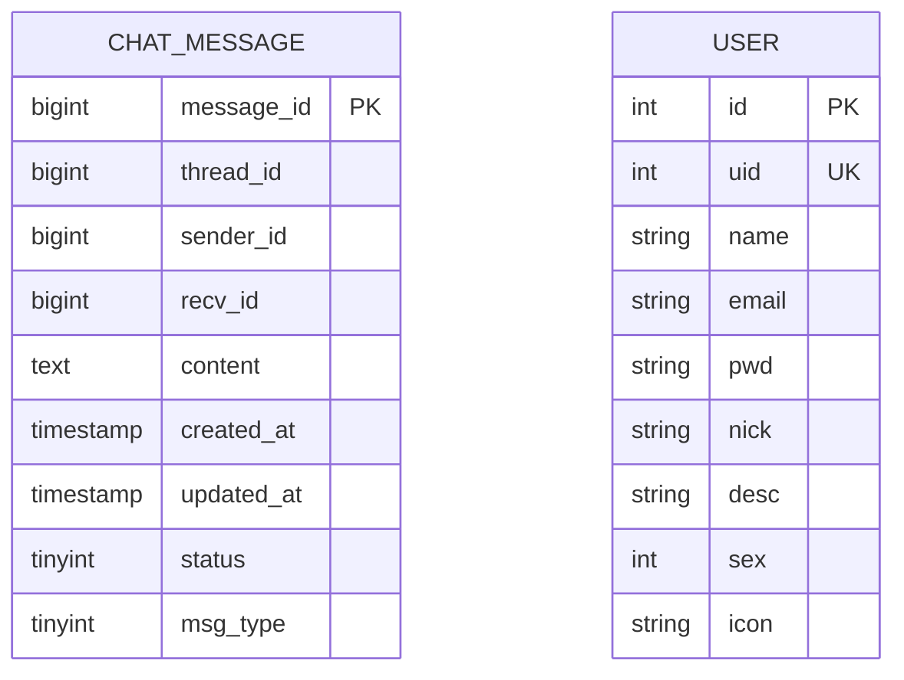
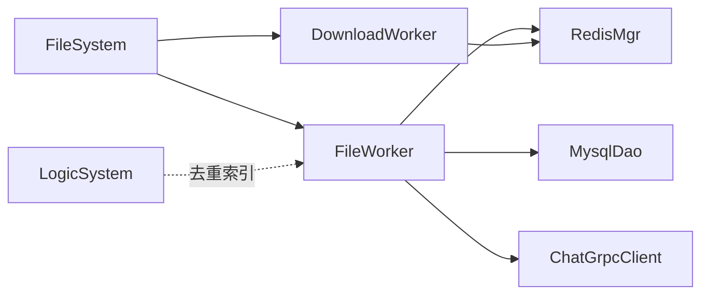

# 文件元数据管理

<cite>
**本文引用的文件**   
- [FileInfo.h](file://server/ResourceServer/include/FileInfo.h)
- [FileSystem.h](file://server/ResourceServer/include/FileSystem.h)
- [FileWorker.h](file://server/ResourceServer/include/FileWorker.h)
- [FileWorker.cpp](file://server/ResourceServer/src/FileWorker.cpp)
- [RedisMgr.h](file://server/ResourceServer/include/RedisMgr.h)
- [MysqlDao.h](file://server/ResourceServer/include/MysqlDao.h)
- [const.h](file://server/ResourceServer/include/const.h)
- [data.h](file://server/ResourceServer/include/data.h)
- [LogicSystem.h](file://server/ResourceServer/include/LogicSystem.h)
- [llfc.sql](file://sql备份/llfc.sql)
</cite>

## 目录
1. [简介](#简介)
2. [项目结构](#项目结构)
3. [核心组件](#核心组件)
4. [架构总览](#架构总览)
5. [详细组件分析](#详细组件分析)
6. [依赖关系分析](#依赖关系分析)
7. [性能考虑](#性能考虑)
8. [故障排查指南](#故障排查指南)
9. [结论](#结论)
10. [附录](#附录)

## 简介
本技术文档围绕资源服务器的文件元数据管理能力展开，重点说明 FileInfo 类如何承载文件的完整元数据（名称、路径、大小、传输进度等），并结合 Redis 与 MySQL 实现持久化与缓存。文档还覆盖：
- 文件完整性校验机制（哈希计算与校验思路）
- 断点续传与下载流程（序列号、偏移量、进度状态）
- 文件去重与重复检测（基于 MD5 的内存索引）
- 分类、标签与搜索索引的扩展建议
- 数据库设计与缓存策略
- 错误码与异常处理

## 项目结构
资源服务器中，文件上传/下载由 FileWorker 与 DownloadWorker 驱动，通过 FileSystem 进行任务分发；元数据在内存（LogicSystem）、缓存（Redis）与数据库（MySQL）之间协同维护。

图表来源
- [FileSystem.h:1-21](file://server/ResourceServer/include/FileSystem.h#L1-L21)
- [FileWorker.h:1-91](file://server/ResourceServer/include/FileWorker.h#L1-L91)
- [FileWorker.cpp:1-660](file://server/ResourceServer/src/FileWorker.cpp#L1-L660)
- [RedisMgr.h:1-313](file://server/ResourceServer/include/RedisMgr.h#L1-L313)
- [MysqlDao.h:1-273](file://server/ResourceServer/include/MysqlDao.h#L1-L273)
- [LogicSystem.h:1-33](file://server/ResourceServer/include/LogicSystem.h#L1-L33)

章节来源
- [FileSystem.h:1-21](file://server/ResourceServer/include/FileSystem.h#L1-L21)
- [FileWorker.h:1-91](file://server/ResourceServer/include/FileWorker.h#L1-L91)
- [FileWorker.cpp:1-660](file://server/ResourceServer/src/FileWorker.cpp#L1-L660)
- [RedisMgr.h:1-313](file://server/ResourceServer/include/RedisMgr.h#L1-L313)
- [MysqlDao.h:1-273](file://server/ResourceServer/include/MysqlDao.h#L1-L273)
- [LogicSystem.h:1-33](file://server/ResourceServer/include/LogicSystem.h#L1-L33)

## 核心组件
- FileInfo：承载文件基础元数据（序号、名称、总大小、已传输大小、存储路径）。
- FileWorker：接收并处理上传相关消息（普通文件、头像、聊天图片、信息同步、续传），负责写入磁盘与回调通知。
- DownloadWorker：按分块读取文件，结合 Redis 中的下载进度实现断点续传。
- RedisMgr：提供 Redis 连接池、键值操作、分布式锁及文件下载进度缓存接口。
- MysqlDao：提供 MySQL 连接池、用户与聊天消息等 SQL 操作。
- LogicSystem：维护 MD5 到 FileInfo 的内存映射，用于快速去重判断。

章节来源
- [FileInfo.h:1-26](file://server/ResourceServer/include/FileInfo.h#L1-L26)
- [FileWorker.h:1-91](file://server/ResourceServer/include/FileWorker.h#L1-L91)
- [FileWorker.cpp:1-660](file://server/ResourceServer/src/FileWorker.cpp#L1-L660)
- [RedisMgr.h:1-313](file://server/ResourceServer/include/RedisMgr.h#L1-L313)
- [MysqlDao.h:1-273](file://server/ResourceServer/include/MysqlDao.h#L1-L273)
- [LogicSystem.h:1-33](file://server/ResourceServer/include/LogicSystem.h#L1-L33)

## 架构总览
下图展示一次“聊天图片上传”的端到端流程：客户端发送分片数据，资源服务解码后落盘，完成后更新数据库状态并通过 gRPC 通知聊天服务推送给接收方。

图表来源
- [FileWorker.cpp:196-280](file://server/ResourceServer/src/FileWorker.cpp#L196-L280)
- [MysqlDao.h:237-273](file://server/ResourceServer/include/MysqlDao.h#L237-L273)
- [RedisMgr.h:269-313](file://server/ResourceServer/include/RedisMgr.h#L269-L313)

章节来源
- [FileWorker.cpp:196-280](file://server/ResourceServer/src/FileWorker.cpp#L196-L280)
- [MysqlDao.h:237-273](file://server/ResourceServer/include/MysqlDao.h#L237-L273)
- [RedisMgr.h:269-313](file://server/ResourceServer/include/RedisMgr.h#L269-L313)

## 详细组件分析

### FileInfo 类与元数据结构
- 字段含义
  - _seq：分片序号（上传/下载均使用）
  - _name：文件名
  - _total_size：文件总大小
  - _trans_size：已传输字节数（下载进度）
  - _file_path_str：本地存储路径
- 用途
  - 作为下载进度载体，在 Redis 中序列化保存
  - 配合分块读写实现断点续传

图表来源
- [FileInfo.h:1-26](file://server/ResourceServer/include/FileInfo.h#L1-L26)

章节来源
- [FileInfo.h:1-26](file://server/ResourceServer/include/FileInfo.h#L1-L26)

### 文件上传处理（FileWorker）
- 支持的消息类型
  - ID_UPLOAD_FILE_REQ：普通文件上传
  - ID_UPLOAD_HEAD_ICON_REQ：头像上传（成功后更新用户图标并写回 Redis 缓存）
  - ID_IMG_CHAT_UPLOAD_REQ / ID_IMG_CHAT_CONTINUE_UPLOAD_REQ：聊天图片上传与续传
  - ID_FILE_INFO_SYNC_REQ：文件信息同步
- 关键逻辑
  - Base64 解码后按 seq 决定首包 trunc 或后续 append
  - 最后分片完成时更新数据库状态，并根据接收者在线情况通过 gRPC 通知
  - 错误码统一通过 result["error"] 返回

图表来源
- [FileWorker.cpp:48-109](file://server/ResourceServer/src/FileWorker.cpp#L48-L109)
- [FileWorker.cpp:112-193](file://server/ResourceServer/src/FileWorker.cpp#L112-L193)
- [FileWorker.cpp:196-280](file://server/ResourceServer/src/FileWorker.cpp#L196-L280)
- [FileWorker.cpp:283-366](file://server/ResourceServer/src/FileWorker.cpp#L283-L366)
- [FileWorker.cpp:369-453](file://server/ResourceServer/src/FileWorker.cpp#L369-L453)

章节来源
- [FileWorker.cpp:48-109](file://server/ResourceServer/src/FileWorker.cpp#L48-L109)
- [FileWorker.cpp:112-193](file://server/ResourceServer/src/FileWorker.cpp#L112-L193)
- [FileWorker.cpp:196-280](file://server/ResourceServer/src/FileWorker.cpp#L196-L280)
- [FileWorker.cpp:283-366](file://server/ResourceServer/src/FileWorker.cpp#L283-L366)
- [FileWorker.cpp:369-453](file://server/ResourceServer/src/FileWorker.cpp#L369-L453)

### 文件下载与断点续传（DownloadWorker）
- 首次下载
  - 读取文件大小，构造 FileInfo 并写入 Redis（SetDownLoadInfo）
- 续传
  - 从 Redis 获取历史进度，校验 seq 一致性
  - 根据 seq 计算偏移量，读取固定长度分块，Base64 编码返回
  - 非末包则更新 Redis 进度；末包删除进度记录

图表来源
- [FileWorker.cpp:525-659](file://server/ResourceServer/src/FileWorker.cpp#L525-L659)
- [RedisMgr.h:303-313](file://server/ResourceServer/include/RedisMgr.h#L303-L313)

章节来源
- [FileWorker.cpp:525-659](file://server/ResourceServer/src/FileWorker.cpp#L525-L659)
- [RedisMgr.h:303-313](file://server/ResourceServer/include/RedisMgr.h#L303-L313)

### 文件去重与重复检测（LogicSystem）
- 内存级去重索引
  - 维护 unordered_map<md5, FileInfo>，提供 AddMD5File/GetFileInfo
- 使用建议
  - 上传前计算 md5，若命中则直接复用已有路径，避免重复落盘
  - 注意进程重启后内存索引丢失，需结合持久层（如 Redis/DB）做二次校验

图表来源
- [LogicSystem.h:18-31](file://server/ResourceServer/include/LogicSystem.h#L18-L31)

章节来源
- [LogicSystem.h:18-31](file://server/ResourceServer/include/LogicSystem.h#L18-L31)

### 元数据的持久化与缓存
- Redis 缓存
  - Set/Get/SetExp/LPush/RPush/HSet/HGet/HDel/Del/ExistsKey
  - 文件下载进度：SetDownLoadInfo/GetDownloadInfo/DelDownLoadInfo
  - 用户基础信息缓存：USER_BASE_INFO_{uid}
  - 用户在线 IP：USERIPPREFIX_{uid}
- MySQL 持久化
  - 连接池管理、健康检查与自动重连
  - 聊天消息表 chat_message（含 msg_type 区分文本/图片/视频/文件）
  - 用户头像更新：UpdateUserIcon
  - 聊天图片上传状态：UpdateUploadStatus

图表来源
- [llfc.sql:24-37](file://sql备份/llfc.sql#L24-L37)
- [llfc.sql:467-481](file://sql备份/llfc.sql#L467-L481)
- [MysqlDao.h:237-273](file://server/ResourceServer/include/MysqlDao.h#L237-L273)

章节来源
- [RedisMgr.h:269-313](file://server/ResourceServer/include/RedisMgr.h#L269-L313)
- [MysqlDao.h:237-273](file://server/ResourceServer/include/MysqlDao.h#L237-L273)
- [llfc.sql:24-37](file://sql备份/llfc.sql#L24-L37)
- [llfc.sql:467-481](file://sql备份/llfc.sql#L467-L481)

### 文件分类、标签与搜索索引（扩展设计）
当前代码未实现专门的分类/标签/全文索引模块，但可基于现有结构扩展：
- 分类：在 chat_message.msg_type 基础上增加更细粒度类型（如 doc/pdf/image/video/archive）
- 标签：新增 user_file_tag 表，关联 user_id 与 message_id，支持多对多标签
- 搜索索引：引入搜索引擎（如 Elasticsearch）或基于 Redis Hash/ZSET 构建倒排索引，按文件名/标签/时间范围检索

[本节为概念性扩展建议，不直接对应具体源码]

## 依赖关系分析
- 组件耦合
  - FileWorker 依赖 RedisMgr（在线状态/下载进度）、MysqlDao（状态更新）、ChatServerGrpcClient（通知）
  - DownloadWorker 依赖 RedisMgr（下载进度）
  - FileSystem 聚合多个 FileWorker/DownloadWorker 实例进行任务分发
  - LogicSystem 提供内存级 MD5 去重能力，供上层调用
- 外部依赖
  - MySQL：连接池、健康检查、自动重连
  - Redis：连接池、PING 保活、分布式锁、KV/Hash/List 操作

图表来源
- [FileSystem.h:1-21](file://server/ResourceServer/include/FileSystem.h#L1-L21)
- [FileWorker.h:1-91](file://server/ResourceServer/include/FileWorker.h#L1-L91)
- [RedisMgr.h:269-313](file://server/ResourceServer/include/RedisMgr.h#L269-L313)
- [MysqlDao.h:237-273](file://server/ResourceServer/include/MysqlDao.h#L237-L273)
- [LogicSystem.h:18-31](file://server/ResourceServer/include/LogicSystem.h#L18-L31)

章节来源
- [FileSystem.h:1-21](file://server/ResourceServer/include/FileSystem.h#L1-L21)
- [FileWorker.h:1-91](file://server/ResourceServer/include/FileWorker.h#L1-L91)
- [RedisMgr.h:269-313](file://server/ResourceServer/include/RedisMgr.h#L269-L313)
- [MysqlDao.h:237-273](file://server/ResourceServer/include/MysqlDao.h#L237-L273)
- [LogicSystem.h:18-31](file://server/ResourceServer/include/LogicSystem.h#L18-L31)

## 性能考虑
- 并发模型
  - FileWorker/DownloadWorker 各自独立线程队列，降低阻塞
  - FileSystem 维护多实例工作器，提升吞吐
- I/O 优化
  - 分块读写（MAX_FILE_LEN）减少内存占用
  - 首包 trunc/后续 append 避免重复写入
- 缓存与连接池
  - Redis/MySQL 连接池与保活机制，降低握手开销与失败率
- 去重
  - 内存 MD5 索引加速重复检测，减少冗余 I/O

[本节为通用性能建议，不直接引用具体源码行]

## 故障排查指南
- 常见错误码
  - FileNotExists：目录不存在或文件不存在
  - FileWritePermissionFailed：写入权限不足
  - FileReadPermissionFailed：读取权限不足
  - FileSeqInvalid：序列号不匹配（续传校验失败）
  - FileOffsetInvalid：偏移量超出文件大小
  - FileReadFailed：读取失败
  - RedisReadErr：Redis 读取失败
- 排查要点
  - 确认目录创建与权限设置
  - 检查 seq 与 total_size 的一致性
  - 验证 Redis 中下载进度是否存在且未过期
  - 观察 MySQL 连接池健康检查日志与重连行为

章节来源
- [const.h:5-29](file://server/ResourceServer/include/const.h#L5-L29)
- [FileWorker.cpp:537-549](file://server/ResourceServer/src/FileWorker.cpp#L537-L549)
- [FileWorker.cpp:574-591](file://server/ResourceServer/src/FileWorker.cpp#L574-L591)
- [MysqlDao.h:26-61](file://server/ResourceServer/include/MysqlDao.h#L26-L61)

## 结论
该资源服务通过 Worker 线程模型、Redis 缓存与 MySQL 持久化，实现了稳定高效的文件上传/下载与断点续传。FileInfo 作为元数据载体贯穿全流程，LogicSystem 提供内存级去重能力。建议在后续版本中完善哈希校验、分类标签与搜索索引，以进一步提升数据一致性与可检索性。

[本节为总结性内容，不直接引用具体源码行]

## 附录

### 文件完整性校验机制（MD5/SHA256）
- 现状
  - 代码中未直接实现 MD5/SHA256 计算与校验
- 建议方案
  - 上传阶段：服务端计算文件 MD5/SHA256，存入 Redis（key: file_hash -> meta）
  - 下载阶段：可选地返回哈希值供客户端校验
  - 去重增强：结合 LogicSystem 的内存索引与 Redis 持久化，实现跨进程/重启的去重

[本节为概念性设计，不直接对应具体源码行]

### 数据库设计要点
- chat_message：存储聊天消息，msg_type 区分文件类型
- user：存储用户信息与头像路径
- 建议扩展
  - file_meta：file_hash、original_name、size、type、path、created_at
  - user_file_tag：user_id、message_id、tag

章节来源
- [llfc.sql:24-37](file://sql备份/llfc.sql#L24-L37)
- [llfc.sql:467-481](file://sql备份/llfc.sql#L467-L481)