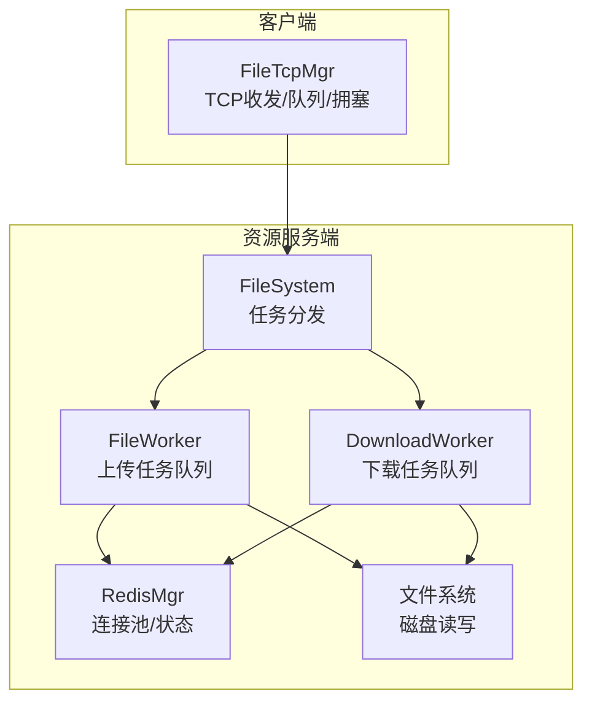
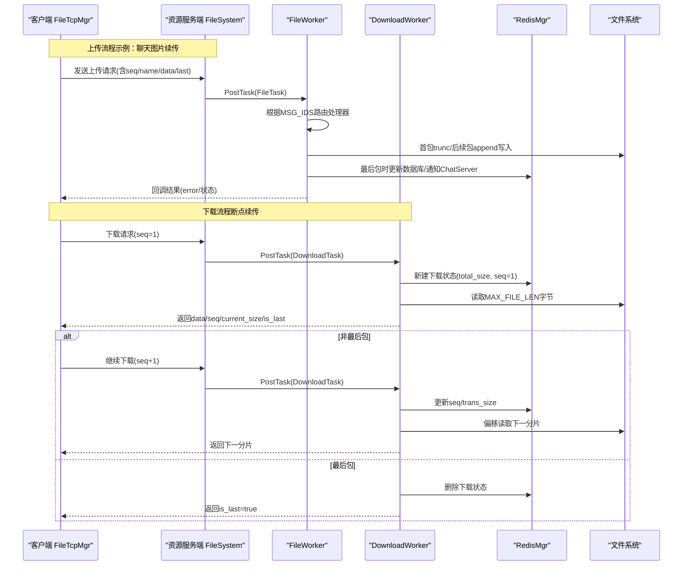
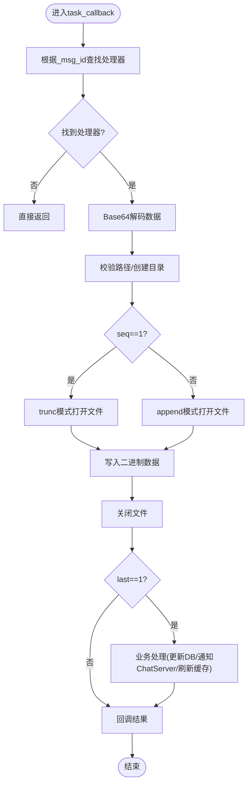
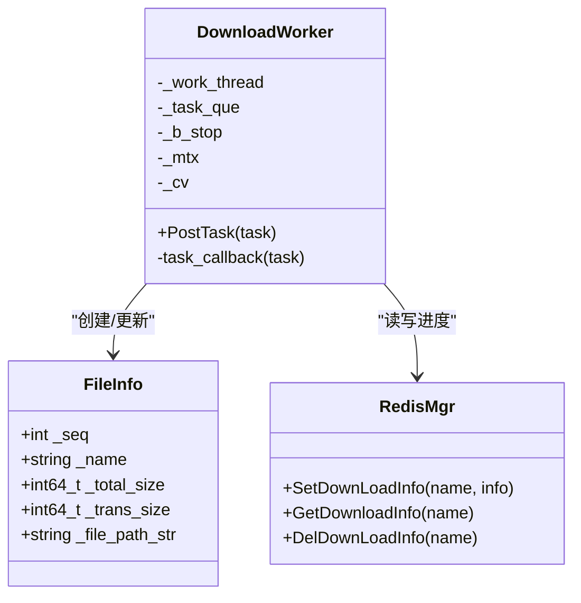
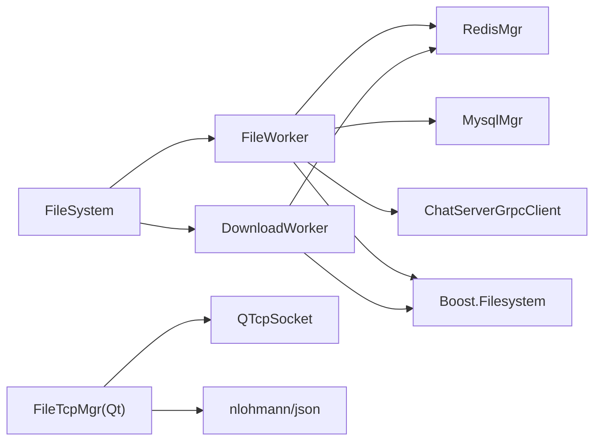

# 文件异步处理引擎

<cite>
**本文引用的文件**   
- [FileWorker.h](file://server/ResourceServer/include/FileWorker.h)
- [FileWorker.cpp](file://server/ResourceServer/src/FileWorker.cpp)
- [FileSystem.h](file://server/ResourceServer/include/FileSystem.h)
- [FileSystem.cpp](file://server/ResourceServer/src/FileSystem.cpp)
- [FileInfo.h](file://server/ResourceServer/include/FileInfo.h)
- [const.h](file://server/ResourceServer/include/const.h)
- [RedisMgr.h](file://server/ResourceServer/include/RedisMgr.h)
- [RedisMgr.cpp](file://server/ResourceServer/src/RedisMgr.cpp)
- [filetcpmgr.h](file://client/llfcchat/include/filetcpmgr.h)
- [filetcpmgr.cpp](file://client/llfcchat/src/filetcpmgr.cpp)
</cite>

## 目录
1. [简介](#简介)
2. [项目结构](#项目结构)
3. [核心组件](#核心组件)
4. [架构总览](#架构总览)
5. [详细组件分析](#详细组件分析)
6. [依赖关系分析](#依赖关系分析)
7. [性能考量](#性能考量)
8. [故障排查指南](#故障排查指南)
9. [结论](#结论)
10. [附录](#附录)

## 简介
本开发文档聚焦于资源服务端的“文件异步处理引擎”，围绕 FileWorker/DownloadWorker 的并发任务队列、线程模型与资源分配，系统阐述断点续传机制（分块状态跟踪、进度计算、中断恢复）、文件传输生命周期（从接收请求到完成存储），以及错误处理策略、重试与异常恢复。同时给出面向大文件与高并发场景的性能优化建议，包括批量处理、内存管理与 I/O 优化。

## 项目结构
资源服务端采用多 Worker 模式：
- FileSystem 作为调度器，维护固定数量的 FileWorker 与 DownloadWorker 实例，按索引分发任务，实现负载均衡与隔离。
- FileWorker 负责上传类任务（普通文件、头像、聊天图片、信息同步、续传图片等），内部通过消息 ID 路由到具体处理器。
- DownloadWorker 负责下载类任务，基于 Redis 中的下载元信息进行分片读取与续传。
- RedisMgr 提供连接池、键值操作与分布式锁能力，用于持久化下载进度与用户在线状态。
- 客户端 FileTcpMgr 负责 TCP 粘包解析、发送队列、拥塞控制与续传逻辑，与服务端协同完成断点续传。

图表来源
- [FileSystem.h:1-21](file://server/ResourceServer/include/FileSystem.h#L1-L21)
- [FileSystem.cpp:1-29](file://server/ResourceServer/src/FileSystem.cpp#L1-L29)
- [FileWorker.h:1-91](file://server/ResourceServer/include/FileWorker.h#L1-L91)
- [FileWorker.cpp:1-660](file://server/ResourceServer/src/FileWorker.cpp#L1-L660)
- [RedisMgr.h:1-313](file://server/ResourceServer/include/RedisMgr.h#L1-L313)
- [filetcpmgr.h:1-85](file://client/llfcchat/include/filetcpmgr.h#L1-L85)

章节来源
- [FileSystem.h:1-21](file://server/ResourceServer/include/FileSystem.h#L1-L21)
- [FileSystem.cpp:1-29](file://server/ResourceServer/src/FileSystem.cpp#L1-L29)
- [FileWorker.h:1-91](file://server/ResourceServer/include/FileWorker.h#L1-L91)
- [FileWorker.cpp:1-660](file://server/ResourceServer/src/FileWorker.cpp#L1-L660)
- [RedisMgr.h:1-313](file://server/ResourceServer/include/RedisMgr.h#L1-L313)
- [filetcpmgr.h:1-85](file://client/llfcchat/include/filetcpmgr.h#L1-L85)

## 核心组件
- FileWorker
  - 单工作线程 + 无锁条件变量等待的任务队列，PostTask 将闭包封装入队并唤醒工作线程。
  - 通过 _handlers 映射 MSG_IDS 到具体处理函数，支持多种上传场景（文件、头像、聊天图片、信息同步、续传图片）。
  - 每个处理器统一流程：Base64 解码 -> 路径校验与目录创建 -> 首包 trunc 或后续包 append -> 写入文件 -> 回调结果。
- DownloadWorker
  - 单工作线程 + 任务队列，按 seq 分片读取文件，使用 Redis 保存/更新下载进度（seq、trans_size、total_size）。
  - 首个包初始化 FileInfo 并写回 Redis；后续包从 Redis 获取进度并校验 seq，定位偏移量读取数据，Base64 编码后返回。
  - 最后一个包完成后清理 Redis 中的下载状态。
- FileSystem
  - 维护 FILE_WORKER_COUNT 个 FileWorker 与 DOWN_LOAD_WORKER_COUNT 个 DownloadWorker，PostMsgToQue/PostDownloadTaskToQue 按 index 分发。
- RedisMgr
  - 连接池管理、PING 保活、自动重连；提供 Set/Get/HSet/HDel/Del/ExistsKey 等操作；提供分布式锁接口。
  - 提供下载进度存取接口：SetDownLoadInfo/GetDownloadInfo/DelDownLoadInfo。
- 客户端 FileTcpMgr
  - 基于 QTcpSocket 的粘包解析、发送队列与 bytesWritten 驱动的分片发送；支持续传上传与下载，维护 seq、trans_size、last 标志。

章节来源
- [FileWorker.h:1-91](file://server/ResourceServer/include/FileWorker.h#L1-L91)
- [FileWorker.cpp:1-660](file://server/ResourceServer/src/FileWorker.cpp#L1-L660)
- [FileSystem.h:1-21](file://server/ResourceServer/include/FileSystem.h#L1-L21)
- [FileSystem.cpp:1-29](file://server/ResourceServer/src/FileSystem.cpp#L1-L29)
- [RedisMgr.h:1-313](file://server/ResourceServer/include/RedisMgr.h#L1-L313)
- [RedisMgr.cpp:1-200](file://server/ResourceServer/src/RedisMgr.cpp#L1-L200)
- [filetcpmgr.h:1-85](file://client/llfcchat/include/filetcpmgr.h#L1-L85)
- [filetcpmgr.cpp:1-200](file://client/llfcchat/src/filetcpmgr.cpp#L1-L200)

## 架构总览
资源服务端以“多 Worker + 任务队列”为核心，结合 Redis 做状态持久化，形成高并发、可恢复的文件处理能力。客户端通过 TCP 协议与服务端交互，遵循统一的头部（ID+长度）与 Base64 载荷格式，配合 seq/last/trans_size 字段实现可靠分片与断点续传。

图表来源
- [FileWorker.cpp:1-660](file://server/ResourceServer/src/FileWorker.cpp#L1-L660)
- [FileSystem.cpp:1-29](file://server/ResourceServer/src/FileSystem.cpp#L1-L29)
- [RedisMgr.cpp:1-200](file://server/ResourceServer/src/RedisMgr.cpp#L1-L200)
- [filetcpmgr.cpp:200-500](file://client/llfcchat/src/filetcpmgr.cpp#L200-L500)

## 详细组件分析

### FileWorker 上传处理器与任务队列
- 任务入队与执行
  - PostTask 将 task_callback 包装为 std::function 入队，并通过 condition_variable 唤醒工作线程。
  - 工作线程循环等待队列非空或停止信号，弹出任务并执行。
- 处理器注册与路由
  - RegisterHandlers 注册多个 MSG_IDS 对应的 lambda 处理器，如 ID_UPLOAD_FILE_REQ、ID_UPLOAD_HEAD_ICON_REQ、ID_IMG_CHAT_UPLOAD_REQ、ID_FILE_INFO_SYNC_REQ、ID_IMG_CHAT_CONTINUE_UPLOAD_REQ。
  - task_callback 根据 _msg_id 查找处理器并调用。
- 通用上传流程
  - Base64 解码 -> 路径检查与目录创建 -> 首包 trunc 打开或后续包 append 打开 -> 写入二进制数据 -> 关闭文件 -> 回调结果。
  - 特殊业务：头像上传成功后更新用户图标并刷新 Redis 缓存；聊天图片/文件信息同步在 last 包时更新数据库状态并通过 gRPC 通知 ChatServer。

图表来源
- [FileWorker.cpp:1-660](file://server/ResourceServer/src/FileWorker.cpp#L1-L660)

章节来源
- [FileWorker.h:1-91](file://server/ResourceServer/include/FileWorker.h#L1-L91)
- [FileWorker.cpp:1-660](file://server/ResourceServer/src/FileWorker.cpp#L1-L660)

### DownloadWorker 断点续传与进度管理
- 首次下载
  - seq=1 时读取文件大小，构造 FileInfo（name、total_size、seq、trans_size、file_path_str），立即写入 Redis 覆盖旧状态。
- 续传下载
  - 从 Redis 获取 FileInfo，校验 seq 是否匹配；计算 offset=(seq-1)*MAX_FILE_LEN，定位读取 MAX_FILE_LEN 字节。
  - Base64 编码后返回 data/seq/current_size/is_total。
  - 若非最后包，更新 Redis 中 seq+1 与 trans_size；若为最后包，删除 Redis 中的下载状态。
- 错误处理
  - 文件不存在、权限不足、Redis 读取失败、序列号不匹配、偏移越界等均设置对应错误码并回调。

图表来源
- [FileInfo.h:1-26](file://server/ResourceServer/include/FileInfo.h#L1-L26)
- [FileWorker.cpp:1-660](file://server/ResourceServer/src/FileWorker.cpp#L1-L660)
- [RedisMgr.h:1-313](file://server/ResourceServer/include/RedisMgr.h#L1-L313)

章节来源
- [FileWorker.cpp:1-660](file://server/ResourceServer/src/FileWorker.cpp#L1-L660)
- [FileInfo.h:1-26](file://server/ResourceServer/include/FileInfo.h#L1-L26)
- [RedisMgr.h:1-313](file://server/ResourceServer/include/RedisMgr.h#L1-L313)

### FileSystem 任务分发与线程池
- 初始化阶段创建固定数量的 FileWorker 与 DownloadWorker。
- PostMsgToQue/PostDownloadTaskToQue 通过 index 选择目标 Worker 并投递任务，实现简单轮询式负载。

章节来源
- [FileSystem.h:1-21](file://server/ResourceServer/include/FileSystem.h#L1-L21)
- [FileSystem.cpp:1-29](file://server/ResourceServer/src/FileSystem.cpp#L1-L29)

### RedisMgr 连接池与下载状态
- 连接池
  - 初始化时创建 N 个 redisContext，后台线程定期 PING 保活，失败则重建连接。
- 下载状态
  - SetDownLoadInfo/GetDownloadInfo/DelDownLoadInfo 用于断点续传的进度持久化。
- 其他能力
  - 分布式锁 acquireLock/releaseLock、计数增减、基础 KV/Hash/List 操作。

章节来源
- [RedisMgr.h:1-313](file://server/ResourceServer/include/RedisMgr.h#L1-L313)
- [RedisMgr.cpp:1-200](file://server/ResourceServer/src/RedisMgr.cpp#L1-L200)

### 客户端 FileTcpMgr 粘包与续传
- 粘包解析
  - 读取头部（消息ID+长度），再按长度读取消息体，循环处理直到缓冲区不足。
- 发送队列与拥塞控制
  - 使用 QQueue 缓冲待发数据，bytesWritten 事件驱动分片发送，避免阻塞。
- 续传逻辑
  - 上传：根据 last_seq 与 trans_size 定位文件偏移，组织 seq、last、data 字段继续发送。
  - 下载：收到 is_last=false 时递增 seq 并继续请求，直至 is_last=true。

章节来源
- [filetcpmgr.h:1-85](file://client/llfcchat/include/filetcpmgr.h#L1-L85)
- [filetcpmgr.cpp:1-200](file://client/llfcchat/src/filetcpmgr.cpp#L1-L200)
- [filetcpmgr.cpp:200-500](file://client/llfcchat/src/filetcpmgr.cpp#L200-L500)

## 依赖关系分析
- 模块耦合
  - FileSystem 依赖 FileWorker/DownloadWorker；两者均依赖 RedisMgr 进行状态持久化。
  - FileWorker 处理器依赖 MysqlMgr/ChatServerGrpcClient 进行业务落库与跨服务通知。
  - 客户端 FileTcpMgr 依赖 Qt 网络栈与 JSON 解析库。
- 外部依赖
  - Redis（hiredis）：连接池、命令执行、保活与重连。
  - Boost.Filesystem：路径与目录操作。
  - nlohmann/json：JSON 序列化/反序列化。
  - gRPC：跨服务通知（ChatServer）。

图表来源
- [FileWorker.cpp:1-660](file://server/ResourceServer/src/FileWorker.cpp#L1-L660)
- [RedisMgr.h:1-313](file://server/ResourceServer/include/RedisMgr.h#L1-L313)
- [filetcpmgr.h:1-85](file://client/llfcchat/include/filetcpmgr.h#L1-L85)

章节来源
- [FileWorker.cpp:1-660](file://server/ResourceServer/src/FileWorker.cpp#L1-L660)
- [RedisMgr.h:1-313](file://server/ResourceServer/include/RedisMgr.h#L1-L313)
- [filetcpmgr.h:1-85](file://client/llfcchat/include/filetcpmgr.h#L1-L85)

## 性能考量
- 并发与线程模型
  - 单 Worker 单线程 + 队列，降低锁竞争；通过 FileSystem 的多实例实现水平扩展。
  - 建议根据 CPU 核数与 I/O 特性调整 FILE_WORKER_COUNT/DOWN_LOAD_WORKER_COUNT。
- 内存管理
  - 分片大小 MAX_FILE_LEN 控制单次内存占用；Base64 编解码会产生额外内存开销，需评估峰值内存。
  - 客户端发送队列与当前块分离，避免重复拷贝。
- I/O 优化
  - 首包 trunc、后续包 append，减少不必要的文件清空与重建。
  - 使用二进制流读写，避免频繁 flush；仅在必要时关闭文件句柄。
- 批量处理
  - 可将多个小文件合并为批次上传，减少握手与元数据开销（需在协议层扩展）。
- Redis 连接池
  - 合理设置池大小，避免连接耗尽；PING 保活周期与重连策略需平衡延迟与稳定性。

[本节为通用指导，不直接分析具体文件]

## 故障排查指南
- 常见错误码
  - FileNotExists、FileWritePermissionFailed、FileReadPermissionFailed、FileSeqInvalid、FileOffsetInvalid、FileReadFailed、RedisReadErr 等。
- 上传失败
  - 检查目录是否存在与权限；确认首包 seq=1 且 last 标志正确；核对 Base64 解码是否成功。
- 下载失败
  - 检查 Redis 中是否存在下载状态；校验 seq 一致性；确认偏移量未超出文件大小。
- 网络问题
  - 客户端检查 QTcpSocket 错误类型（连接拒绝、超时、主机不可达等）；服务端检查 Redis 连接池健康状态。
- 日志定位
  - 关注处理器中的打印输出与错误分支，快速定位失败环节。

章节来源
- [const.h:1-117](file://server/ResourceServer/include/const.h#L1-L117)
- [FileWorker.cpp:1-660](file://server/ResourceServer/src/FileWorker.cpp#L1-L660)
- [filetcpmgr.cpp:1-200](file://client/llfcchat/src/filetcpmgr.cpp#L1-L200)

## 结论
该文件异步处理引擎通过“多 Worker + 任务队列 + Redis 状态持久化”的设计，实现了高并发、可恢复的文件上传与下载能力。断点续传机制基于 seq/trans_size/last 字段与 Redis 进度存储，确保在网络波动或服务重启后仍可无缝恢复。结合合理的线程配置、内存与 I/O 优化策略，可在大文件与高并发场景下保持稳定与高效。

[本节为总结性内容，不直接分析具体文件]

## 附录
- 关键常量
  - MAX_FILE_LEN：分片大小（字节）
  - FILE_WORKER_COUNT/DOWN_LOAD_WORKER_COUNT：Worker 数量
  - MSG_IDS：消息类型枚举
- 典型流程参考
  - 上传：FileWorker 处理器 -> 文件写入 -> 回调
  - 下载：DownloadWorker -> Redis 进度 -> 分片读取 -> 回调
  - 续传：客户端依据 last_seq/trans_size 定位偏移 -> 继续发送/请求

[本节为补充说明，不直接分析具体文件]