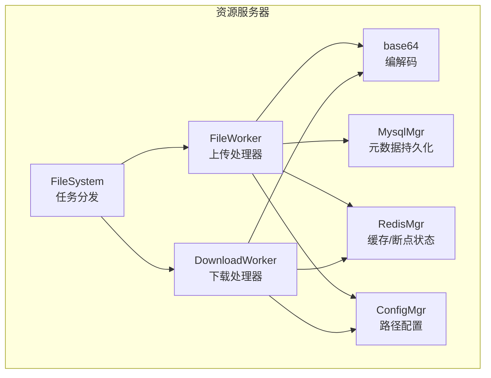
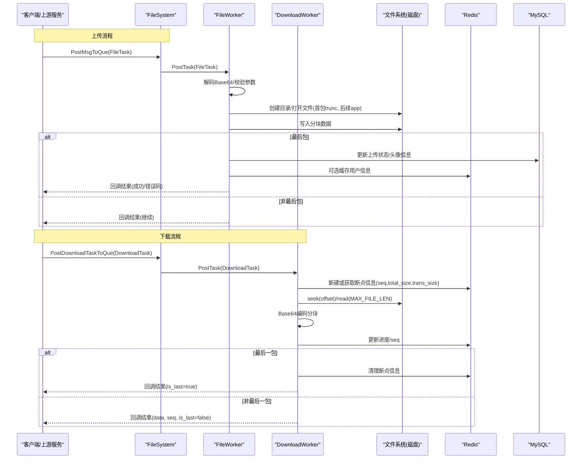
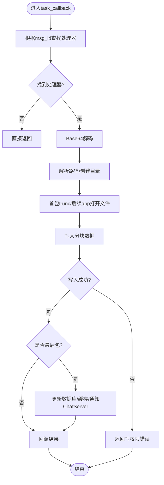
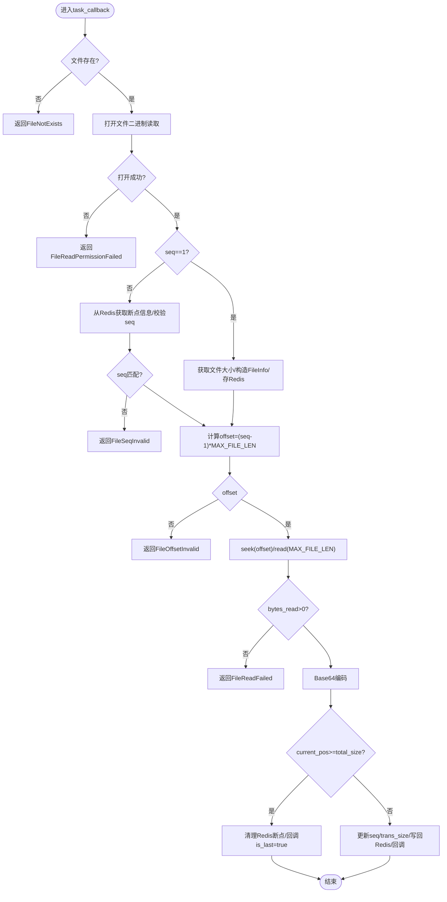
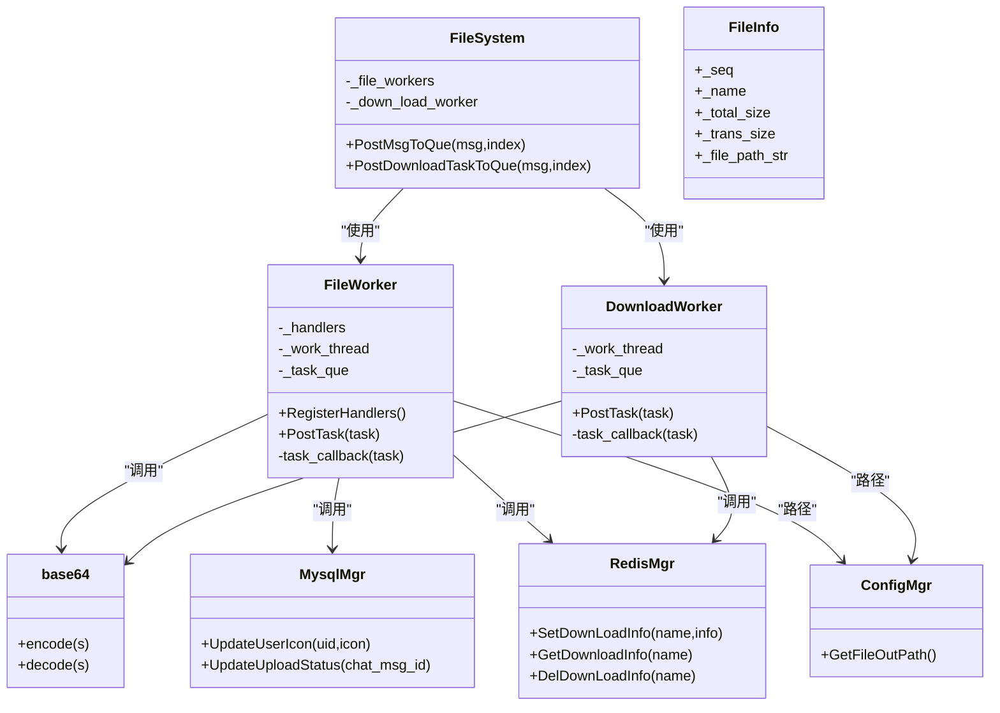

# 文件系统抽象层

<cite>
**本文引用的文件**
- [FileSystem.h](file://server/ResourceServer/include/FileSystem.h)
- [FileSystem.cpp](file://server/ResourceServer/src/FileSystem.cpp)
- [FileWorker.h](file://server/ResourceServer/include/FileWorker.h)
- [FileWorker.cpp](file://server/ResourceServer/src/FileWorker.cpp)
- [FileInfo.h](file://server/ResourceServer/include/FileInfo.h)
- [const.h](file://server/ResourceServer/include/const.h)
- [CSession.h](file://server/ResourceServer/include/CSession.h)
- [MysqlMgr.h](file://server/ResourceServer/include/MysqlMgr.h)
- [RedisMgr.h](file://server/ResourceServer/include/RedisMgr.h)
- [ConfigMgr.h](file://server/ResourceServer/include/ConfigMgr.h)
- [config.ini](file://server/ResourceServer/config/config.ini)
- [base64.h](file://server/ResourceServer/include/base64.h)
</cite>

## 目录
1. [简介](#简介)
2. [项目结构](#项目结构)
3. [核心组件](#核心组件)
4. [架构总览](#架构总览)
5. [详细组件分析](#详细组件分析)
6. [依赖关系分析](#依赖关系分析)
7. [性能考量](#性能考量)
8. [故障排查指南](#故障排查指南)
9. [结论](#结论)
10. [附录：扩展新存储后端与使用示例](#附录扩展新存储后端与使用示例)

## 简介
本技术文档围绕资源服务器的“文件系统抽象层”展开，重点说明 FileSystem 类如何提供统一的文件操作接口，并通过 FileWorker/DownloadWorker 工作线程池实现上传、下载、删除（预留）、查询（元信息）等核心能力。当前实现以本地磁盘为后端，借助 Redis 进行断点续传状态管理，通过 MySQL 更新业务元数据（如头像、聊天图片上传状态），并支持通过 gRPC 通知 ChatServer 完成消息同步。文档同时给出路径管理、权限控制、并发访问控制与错误恢复策略的设计与实践，并提供扩展云存储后端的指导与调用示例。

## 项目结构
资源服务器中文件系统相关代码主要位于 ResourceServer 模块：
- 抽象入口与任务分发：FileSystem
- 上传处理与回调路由：FileWorker
- 下载处理与断点续传：DownloadWorker
- 文件元信息模型：FileInfo
- 常量与错误码：const.h
- 会话与网络层：CSession
- 缓存与分布式锁：RedisMgr
- 数据库访问：MysqlMgr
- 配置管理：ConfigMgr
- Base64 编解码：base64.h
- 配置文件：config.ini

图表来源
- [FileSystem.h:1-21](file://server/ResourceServer/include/FileSystem.h#L1-L21)
- [FileSystem.cpp:1-29](file://server/ResourceServer/src/FileSystem.cpp#L1-L29)
- [FileWorker.h:1-91](file://server/ResourceServer/include/FileWorker.h#L1-L91)
- [FileWorker.cpp:1-660](file://server/ResourceServer/src/FileWorker.cpp#L1-L660)
- [FileInfo.h:1-26](file://server/ResourceServer/include/FileInfo.h#L1-L26)
- [const.h:1-117](file://server/ResourceServer/include/const.h#L1-L117)
- [CSession.h:1-64](file://server/ResourceServer/include/CSession.h#L1-L64)
- [MysqlMgr.h:1-44](file://server/ResourceServer/include/MysqlMgr.h#L1-L44)
- [RedisMgr.h:1-313](file://server/ResourceServer/include/RedisMgr.h#L1-L313)
- [ConfigMgr.h:1-90](file://server/ResourceServer/include/ConfigMgr.h#L1-L90)
- [config.ini:1-27](file://server/ResourceServer/config/config.ini#L1-L27)
- [base64.h:1-36](file://server/ResourceServer/include/base64.h#L1-L36)

章节来源
- [FileSystem.h:1-21](file://server/ResourceServer/include/FileSystem.h#L1-L21)
- [FileSystem.cpp:1-29](file://server/ResourceServer/src/FileSystem.cpp#L1-L29)
- [FileWorker.h:1-91](file://server/ResourceServer/include/FileWorker.h#L1-L91)
- [FileWorker.cpp:1-660](file://server/ResourceServer/src/FileWorker.cpp#L1-L660)
- [FileInfo.h:1-26](file://server/ResourceServer/include/FileInfo.h#L1-L26)
- [const.h:1-117](file://server/ResourceServer/include/const.h#L1-L117)
- [CSession.h:1-64](file://server/ResourceServer/include/CSession.h#L1-L64)
- [MysqlMgr.h:1-44](file://server/ResourceServer/include/MysqlMgr.h#L1-L44)
- [RedisMgr.h:1-313](file://server/ResourceServer/include/RedisMgr.h#L1-L313)
- [ConfigMgr.h:1-90](file://server/ResourceServer/include/ConfigMgr.h#L1-L90)
- [config.ini:1-27](file://server/ResourceServer/config/config.ini#L1-L27)
- [base64.h:1-36](file://server/ResourceServer/include/base64.h#L1-L36)

## 核心组件
- FileSystem：单例，维护上传与下载的 Worker 池，负责将任务投递到对应索引的 Worker 实例，实现水平扩展与负载均衡。
- FileWorker：上传任务处理器，基于消息 ID 注册处理器，支持普通文件、头像、聊天图片及续传场景；包含目录创建、分块写入、权限检查、回调通知、数据库与缓存联动。
- DownloadWorker：下载任务处理器，支持断点续传，基于 Redis 维护序列号与进度，按固定分块大小读取并 Base64 编码返回。
- FileInfo：下载断点续传的元信息模型（名称、总大小、已传输大小、序列号、路径）。
- const.h：错误码、消息 ID、常量（最大分块大小、Worker 数量等）。
- CSession：网络会话封装，用于发送响应与异步读写。
- RedisMgr：连接池、键值操作、分布式锁、下载进度存取。
- MysqlMgr：用户信息与聊天图片上传状态更新。
- ConfigMgr：输出路径与静态资源路径管理。
- base64.h：Base64 编解码工具。

章节来源
- [FileSystem.h:1-21](file://server/ResourceServer/include/FileSystem.h#L1-L21)
- [FileSystem.cpp:1-29](file://server/ResourceServer/src/FileSystem.cpp#L1-L29)
- [FileWorker.h:1-91](file://server/ResourceServer/include/FileWorker.h#L1-L91)
- [FileWorker.cpp:1-660](file://server/ResourceServer/src/FileWorker.cpp#L1-L660)
- [FileInfo.h:1-26](file://server/ResourceServer/include/FileInfo.h#L1-L26)
- [const.h:1-117](file://server/ResourceServer/include/const.h#L1-L117)
- [CSession.h:1-64](file://server/ResourceServer/include/CSession.h#L1-L64)
- [MysqlMgr.h:1-44](file://server/ResourceServer/include/MysqlMgr.h#L1-L44)
- [RedisMgr.h:1-313](file://server/ResourceServer/include/RedisMgr.h#L1-L313)
- [ConfigMgr.h:1-90](file://server/ResourceServer/include/ConfigMgr.h#L1-L90)
- [base64.h:1-36](file://server/ResourceServer/include/base64.h#L1-L36)

## 架构总览
文件系统抽象层采用“统一入口 + 多 Worker 并行处理”的架构。上层通过 FileSystem 的单例接口提交任务，内部根据类型选择 FileWorker 或 DownloadWorker 队列，由独立线程消费任务并执行具体逻辑。上传流程涉及 Base64 解码、目录创建、分块写入、数据库状态更新与 Redis 缓存；下载流程涉及断点续传状态管理、偏移量计算、分块读取与 Base64 编码。

图表来源
- [FileSystem.cpp:1-29](file://server/ResourceServer/src/FileSystem.cpp#L1-L29)
- [FileWorker.cpp:1-660](file://server/ResourceServer/src/FileWorker.cpp#L1-L660)
- [RedisMgr.h:1-313](file://server/ResourceServer/include/RedisMgr.h#L1-L313)
- [MysqlMgr.h:1-44](file://server/ResourceServer/include/MysqlMgr.h#L1-L44)
- [base64.h:1-36](file://server/ResourceServer/include/base64.h#L1-L36)

## 详细组件分析

### FileSystem：统一入口与任务分发
- 职责：维护 FileWorker 与 DownloadWorker 的实例池，按索引分发任务，保证并发隔离与负载均衡。
- 关键方法：
  - PostMsgToQue：将上传任务投递到指定索引的 FileWorker。
  - PostDownloadTaskToQue：将下载任务投递到指定索引的 DownloadWorker。
- 设计要点：
  - 单例模式确保全局唯一入口。
  - 固定数量的 Worker 实例，避免动态创建开销。
  - 通过 index 参数实现简单哈希分片，降低热点竞争。

章节来源
- [FileSystem.h:1-21](file://server/ResourceServer/include/FileSystem.h#L1-L21)
- [FileSystem.cpp:1-29](file://server/ResourceServer/src/FileSystem.cpp#L1-L29)

### FileWorker：上传处理器与回调路由
- 职责：接收 FileTask，依据 MSG_IDS 路由到具体处理器，完成分块写入、权限校验、目录创建、数据库与缓存联动、回调通知。
- 处理器覆盖：
  - 普通文件上传：ID_UPLOAD_FILE_REQ
  - 头像上传：ID_UPLOAD_HEAD_ICON_REQ（完成后更新用户头像并刷新 Redis 缓存）
  - 聊天图片上传：ID_IMG_CHAT_UPLOAD_REQ（完成后更新上传状态，必要时通过 gRPC 通知 ChatServer）
  - 文件信息同步：ID_FILE_INFO_SYNC_REQ
  - 续传聊天图片：ID_IMG_CHAT_CONTINUE_UPLOAD_REQ
- 关键流程：
  - Base64 解码
  - 路径解析与目录创建
  - 首包 trunc 打开，后续 app 追加
  - 写入失败与权限不足的错误码返回
  - 最后包触发业务联动（数据库/缓存/gRPC）
- 并发与队列：
  - 单线程工作循环，条件变量唤醒，互斥保护队列。
  - 任务以函数对象入队，解耦处理器注册与执行。

图表来源
- [FileWorker.cpp:1-660](file://server/ResourceServer/src/FileWorker.cpp#L1-L660)
- [const.h:1-117](file://server/ResourceServer/include/const.h#L1-L117)
- [base64.h:1-36](file://server/ResourceServer/include/base64.h#L1-L36)

章节来源
- [FileWorker.h:1-91](file://server/ResourceServer/include/FileWorker.h#L1-L91)
- [FileWorker.cpp:1-660](file://server/ResourceServer/src/FileWorker.cpp#L1-L660)
- [const.h:1-117](file://server/ResourceServer/include/const.h#L1-L117)

### DownloadWorker：下载处理器与断点续传
- 职责：接收 DownloadTask，基于 Redis 中的断点信息进行分块读取、Base64 编码、进度更新与回调。
- 关键流程：
  - 首次下载：读取文件大小，初始化 FileInfo，存入 Redis。
  - 续传下载：从 Redis 获取断点信息，校验 seq 一致性。
  - 计算偏移量 offset = (seq-1)*MAX_FILE_LEN，定位读取。
  - 读取 MAX_FILE_LEN 字节，Base64 编码后返回。
  - 判断是否最后一包，清理或更新 Redis 中的断点信息。
- 错误处理：
  - 文件不存在、读权限不足、Redis 读取失败、序列号不匹配、偏移量越界、读取失败等均有明确错误码。

图表来源
- [FileWorker.cpp:1-660](file://server/ResourceServer/src/FileWorker.cpp#L1-L660)
- [FileInfo.h:1-26](file://server/ResourceServer/include/FileInfo.h#L1-L26)
- [RedisMgr.h:1-313](file://server/ResourceServer/include/RedisMgr.h#L1-L313)
- [const.h:1-117](file://server/ResourceServer/include/const.h#L1-L117)

章节来源
- [FileWorker.h:1-91](file://server/ResourceServer/include/FileWorker.h#L1-L91)
- [FileWorker.cpp:1-660](file://server/ResourceServer/src/FileWorker.cpp#L1-L660)
- [FileInfo.h:1-26](file://server/ResourceServer/include/FileInfo.h#L1-L26)
- [RedisMgr.h:1-313](file://server/ResourceServer/include/RedisMgr.h#L1-L313)
- [const.h:1-117](file://server/ResourceServer/include/const.h#L1-L117)

### 数据结构与复杂度
- FileTask/DownloadTask：包含会话、消息类型、用户标识、路径、分块序号、数据、回调等字段。构造与析构开销低，适合在队列中传递。
- FileInfo：记录下载断点的核心元信息，内存占用小，序列化至 Redis。
- 时间复杂度：
  - 上传：每包 O(N) 写入（N 为分块大小），整体 O(TotalSize)。
  - 下载：每包 O(N) 读取与编码，整体 O(TotalSize)。
- 空间复杂度：
  - 队列长度受限于系统内存与任务积压情况，峰值取决于并发与分块大小。

章节来源
- [FileWorker.h:1-91](file://server/ResourceServer/include/FileWorker.h#L1-L91)
- [FileInfo.h:1-26](file://server/ResourceServer/include/FileInfo.h#L1-L26)

### 路径管理与权限控制
- 路径管理：
  - 使用 boost::filesystem 解析路径与目录，自动创建缺失目录。
  - 输出路径与静态路径通过 ConfigMgr 管理，便于部署切换。
- 权限控制：
  - 写权限不足时返回 FileWritePermissionFailed。
  - 读权限不足时返回 FileReadPermissionFailed。
  - 建议结合操作系统级 ACL 与进程运行账户最小权限原则。

章节来源
- [FileWorker.cpp:1-660](file://server/ResourceServer/src/FileWorker.cpp#L1-L660)
- [ConfigMgr.h:1-90](file://server/ResourceServer/include/ConfigMgr.h#L1-L90)
- [config.ini:1-27](file://server/ResourceServer/config/config.ini#L1-L27)

### 存储空间监控（建议）
- 当前实现未内置磁盘容量监控，建议在上传前增加可用空间检查，避免写满导致失败。
- 可引入定期任务扫描目录统计大小，结合告警机制。

[本节为通用建议，不直接分析具体文件]

### 并发访问控制与错误恢复
- 并发控制：
  - FileWorker/DownloadWorker 各自单线程队列，保证同一 Worker 内顺序执行，避免竞态。
  - 通过 FileSystem 的多实例池分散请求，降低热点。
- 错误恢复：
  - 上传失败：返回具体错误码，客户端可重试（注意幂等性）。
  - 下载断点：Redis 保存 seq 与 trans_size，异常中断后可续传。
  - Redis 连接：连接池具备健康检查与重连机制。

章节来源
- [FileWorker.cpp:1-660](file://server/ResourceServer/src/FileWorker.cpp#L1-L660)
- [RedisMgr.h:1-313](file://server/ResourceServer/include/RedisMgr.h#L1-L313)
- [const.h:1-117](file://server/ResourceServer/include/const.h#L1-L117)

## 依赖关系分析
- FileSystem 依赖 FileWorker 与 DownloadWorker 实例池。
- FileWorker 依赖 base64、boost::filesystem、MysqlMgr、RedisMgr、gRPC 客户端（通知 ChatServer）。
- DownloadWorker 依赖 base64、boost::filesystem、RedisMgr。
- 配置与路径由 ConfigMgr 提供。
- 错误码与常量集中在 const.h。

图表来源
- [FileSystem.h:1-21](file://server/ResourceServer/include/FileSystem.h#L1-L21)
- [FileWorker.h:1-91](file://server/ResourceServer/include/FileWorker.h#L1-L91)
- [FileInfo.h:1-26](file://server/ResourceServer/include/FileInfo.h#L1-L26)
- [RedisMgr.h:1-313](file://server/ResourceServer/include/RedisMgr.h#L1-L313)
- [MysqlMgr.h:1-44](file://server/ResourceServer/include/MysqlMgr.h#L1-L44)
- [ConfigMgr.h:1-90](file://server/ResourceServer/include/ConfigMgr.h#L1-L90)
- [base64.h:1-36](file://server/ResourceServer/include/base64.h#L1-L36)

章节来源
- [FileSystem.h:1-21](file://server/ResourceServer/include/FileSystem.h#L1-L21)
- [FileWorker.h:1-91](file://server/ResourceServer/include/FileWorker.h#L1-L91)
- [FileInfo.h:1-26](file://server/ResourceServer/include/FileInfo.h#L1-L26)
- [RedisMgr.h:1-313](file://server/ResourceServer/include/RedisMgr.h#L1-L313)
- [MysqlMgr.h:1-44](file://server/ResourceServer/include/MysqlMgr.h#L1-L44)
- [ConfigMgr.h:1-90](file://server/ResourceServer/include/ConfigMgr.h#L1-L90)
- [base64.h:1-36](file://server/ResourceServer/include/base64.h#L1-L36)

## 性能考量
- 分块大小：MAX_FILE_LEN 决定 I/O 吞吐与内存占用平衡，过大影响内存，过小增加往返次数。
- Worker 数量：FILE_WORKER_COUNT/DOWN_LOAD_WORKER_COUNT 应与 CPU 核数与磁盘 I/O 能力匹配。
- Redis 连接池：合理设置池大小与心跳检测周期，避免连接耗尽与频繁重连。
- Base64 编解码：CPU 密集，建议在高并发下评估 CPU 瓶颈。
- 数据库写入：上传最后包的元数据更新应批量或异步化以减少阻塞。

[本节为通用建议，不直接分析具体文件]

## 故障排查指南
- 常见错误码：
  - FileNotExists：文件不存在。
  - FileWritePermissionFailed/ReadPermissionFailed：权限不足。
  - FileSeqInvalid：序列号不匹配。
  - FileOffsetInvalid：偏移量越界。
  - FileReadFailed：读取失败。
  - RedisReadErr：Redis 读取失败。
- 排查步骤：
  - 检查路径是否存在与权限是否正确。
  - 确认 Redis 断点信息是否过期或缺失。
  - 查看日志中错误码与堆栈，定位具体环节。
  - 验证网络与 gRPC 通知链路是否正常。

章节来源
- [const.h:1-117](file://server/ResourceServer/include/const.h#L1-L117)
- [FileWorker.cpp:1-660](file://server/ResourceServer/src/FileWorker.cpp#L1-L660)
- [RedisMgr.h:1-313](file://server/ResourceServer/include/RedisMgr.h#L1-L313)

## 结论
文件系统抽象层通过 FileSystem 统一入口与 FileWorker/DownloadWorker 并行处理，实现了上传与下载的核心能力，并结合 Redis 与 MySQL 完成断点续传与元数据管理。该设计具备良好的可扩展性与容错性，为后续接入云存储后端提供了清晰的扩展点。

[本节为总结，不直接分析具体文件]

## 附录：扩展新存储后端与使用示例

### 扩展新存储后端的方法
- 目标：在不改动上层调用的前提下，将本地磁盘替换为云存储（如 S3、OSS）。
- 步骤：
  - 定义新的 StorageBackend 接口（例如：PutObject、GetObject、DeleteObject、ListObjects、StatObject）。
  - 实现 LocalStorageBackend（封装现有 boost::filesystem 逻辑）与 CloudStorageBackend（封装 SDK 调用）。
  - 在 FileWorker/DownloadWorker 中注入 StorageBackend 实例，替换直接的文件系统调用。
  - 通过配置开关选择后端实现（ConfigMgr 新增 backend_type 字段）。
- 注意事项：
  - 保持错误码映射一致，便于上层统一处理。
  - 断点续传在云存储侧需利用分块上传/下载 API。
  - 安全性：鉴权、签名、加密传输。

[本节为概念性指导，不直接分析具体文件]

### 使用示例（调用抽象接口）
- 上传文件：
  - 构造 FileTask（包含 session、msg_id、uid、path、name、seq、total_size、trans_size、last、file_data、callback 等）。
  - 调用 FileSystem::PostMsgToQue(task, index)。
  - 在 callback 中处理结果（成功/错误码）。
- 下载文件：
  - 构造 DownloadTask（包含 session、uid、name、seq、file_path、callback）。
  - 调用 FileSystem::PostDownloadTaskToQue(task, index)。
  - 在 callback 中处理分块数据与进度，直到 is_last=true。
- 删除文件（预留）：
  - 可在 FileWorker 中新增处理器（如 ID_DELETE_FILE_REQ），调用底层删除接口并返回结果。
- 查询元信息（预留）：
  - 可在 FileWorker 中新增处理器（如 ID_STAT_FILE_REQ），返回文件大小、修改时间等。

章节来源
- [FileWorker.h:1-91](file://server/ResourceServer/include/FileWorker.h#L1-L91)
- [FileWorker.cpp:1-660](file://server/ResourceServer/src/FileWorker.cpp#L1-L660)
- [const.h:1-117](file://server/ResourceServer/include/const.h#L1-L117)