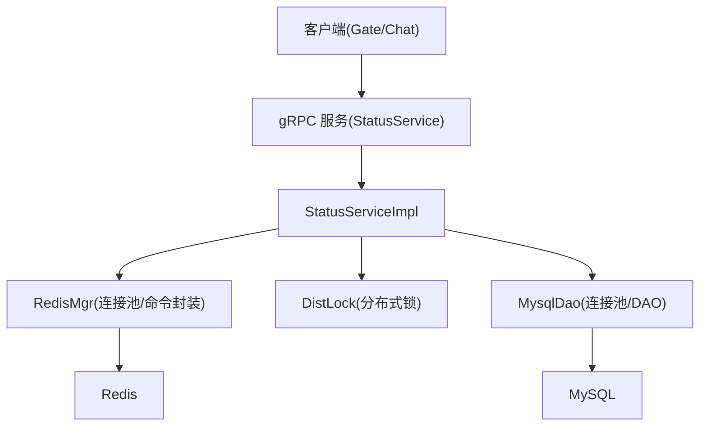
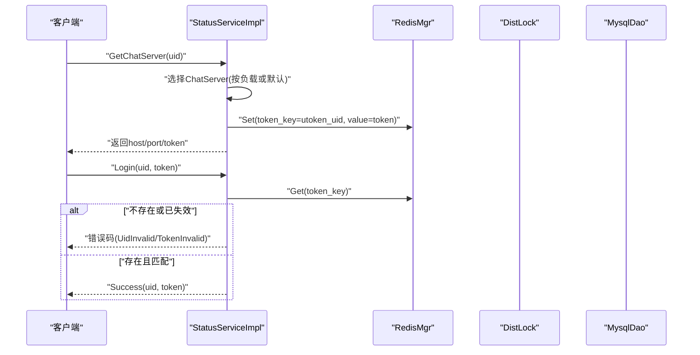
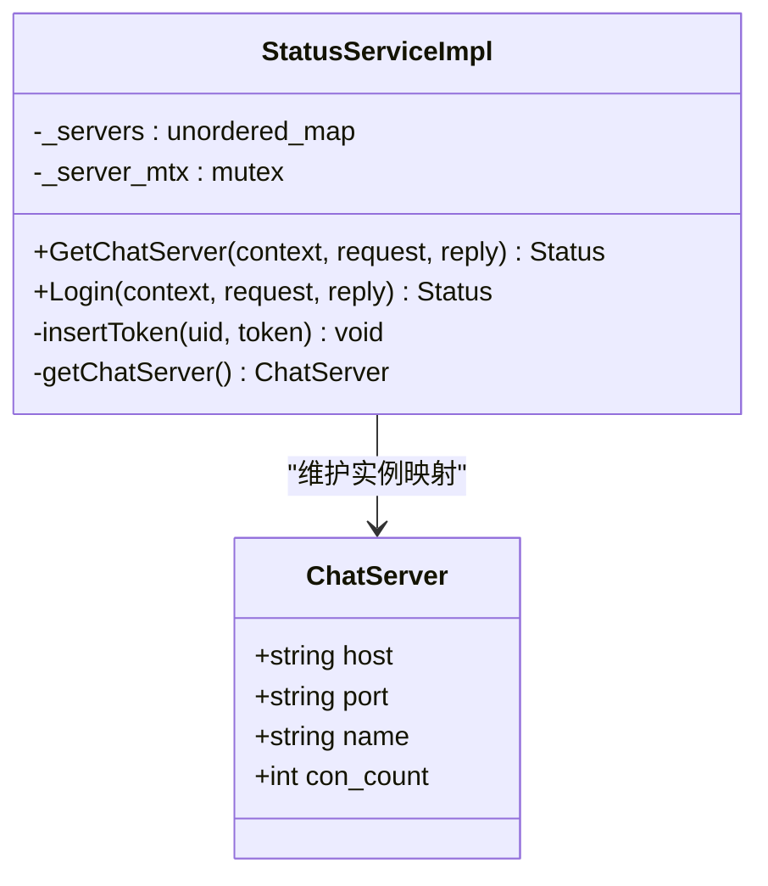
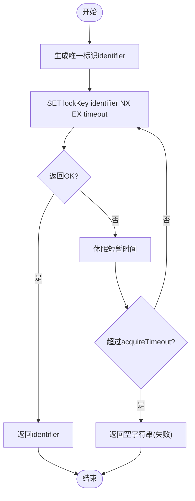
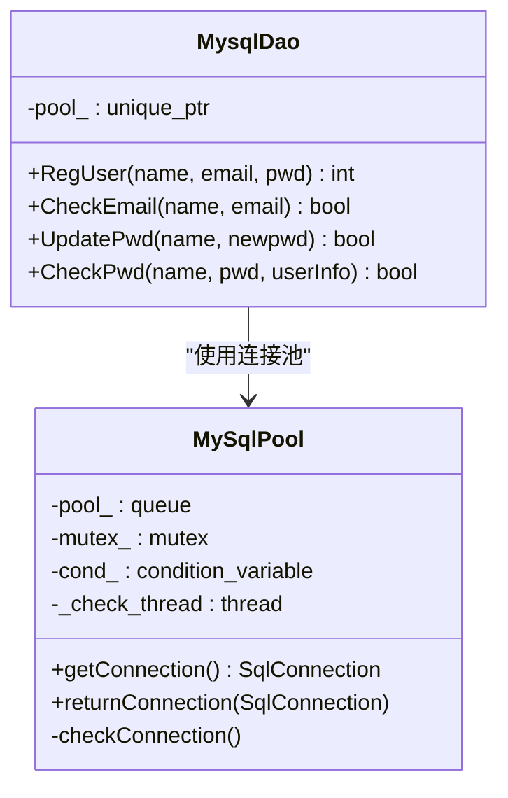
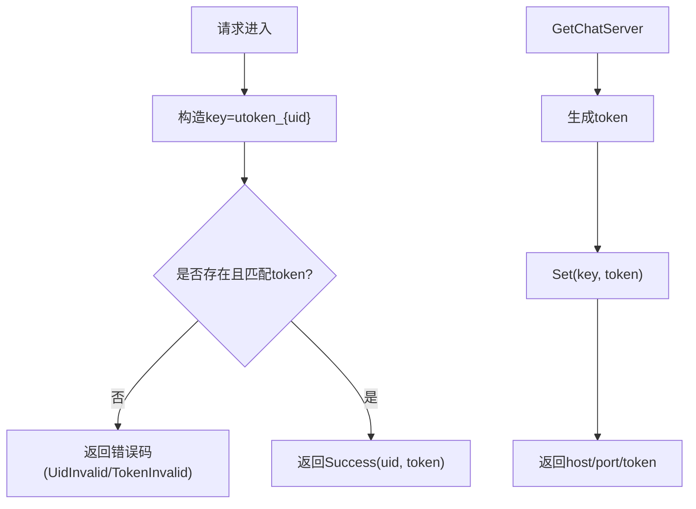
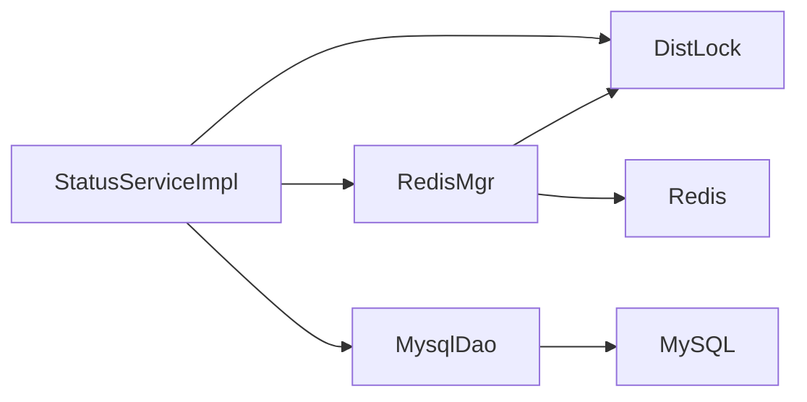

# StatusServer状态管理服务

<cite>
**本文引用的文件**   
- [status.proto](file://proto/status_service/status.proto)
- [StatusServiceImpl.h](file://server/StatusServer/include/StatusServiceImpl.h)
- [StatusServiceImpl.cpp](file://server/StatusServer/src/StatusServiceImpl.cpp)
- [MysqlDao.h](file://server/StatusServer/include/MysqlDao.h)
- [MysqlDao.cpp](file://server/StatusServer/src/MysqlDao.cpp)
- [DistLock.h](file://server/StatusServer/include/DistLock.h)
- [DistLock.cpp](file://server/StatusServer/src/DistLock.cpp)
- [RedisMgr.h](file://server/StatusServer/include/RedisMgr.h)
- [RedisMgr.cpp](file://server/StatusServer/src/RedisMgr.cpp)
- [const.h](file://server/StatusServer/include/const.h)
- [config.ini](file://server/StatusServer/config/config.ini)
- [llfc3.sql](file://sql备份/llfc3.sql)
- [StatusServer.cpp](file://server/StatusServer/src/StatusServer.cpp)
</cite>

## 目录
1. [简介](#简介)
2. [项目结构](#项目结构)
3. [核心组件](#核心组件)
4. [架构总览](#架构总览)
5. [详细组件分析](#详细组件分析)
6. [依赖关系分析](#依赖关系分析)
7. [性能与缓存策略](#性能与缓存策略)
8. [故障恢复与监控告警](#故障恢复与监控告警)
9. [排错指南](#排错指南)
10. [结论](#结论)

## 简介
本文件为 StatusServer 状态管理服务的开发文档。该服务负责用户在线状态、设备信息与会话状态的持久化与一致性保障，提供 gRPC 接口供 GateServer/ChatServer 调用，完成“获取聊天服务器地址并签发Token”和“登录校验”等关键流程。数据层通过 Redis 做高并发读写与分布式锁，MySQL 作为用户基础信息的持久化存储。

## 项目结构
StatusServer 采用分层设计：
- 协议层：gRPC 接口定义（status.proto）
- 服务实现层：StatusServiceImpl 暴露 RPC 方法
- 中间件与基础设施：Redis 连接池与命令封装（RedisMgr）、分布式锁（DistLock）
- 数据访问层：MySQL 连接池与 DAO（MysqlDao）
- 配置与启动：配置文件（config.ini）、主程序入口（StatusServer.cpp）

图表来源
- [StatusServer.cpp:17-52](file://server/StatusServer/src/StatusServer.cpp#L17-L52)
- [StatusServiceImpl.h:36-50](file://server/StatusServer/include/StatusServiceImpl.h#L36-L50)
- [RedisMgr.h:264-298](file://server/StatusServer/include/RedisMgr.h#L264-L298)
- [MysqlDao.h:135-146](file://server/StatusServer/include/MysqlDao.h#L135-L146)

章节来源
- [StatusServer.cpp:17-52](file://server/StatusServer/src/StatusServer.cpp#L17-L52)
- [config.ini:1-23](file://server/StatusServer/config/config.ini#L1-L23)

## 核心组件
- gRPC 接口：GetChatServer、Login
- 状态与令牌管理：基于 Redis 的 Token 存取与校验
- 分布式锁：基于 Redis SET NX EX + Lua 释放
- 数据库访问：MySQL 连接池与用户信息操作（注册、校验、更新密码）
- 配置管理：从 config.ini 加载端口、数据库、Redis、聊天服务器列表

章节来源
- [status.proto:6-31](file://proto/status_service/status.proto#L6-L31)
- [StatusServiceImpl.h:36-50](file://server/StatusServer/include/StatusServiceImpl.h#L36-L50)
- [RedisMgr.h:264-298](file://server/StatusServer/include/RedisMgr.h#L264-L298)
- [MysqlDao.h:135-146](file://server/StatusServer/include/MysqlDao.h#L135-L146)
- [const.h:31-74](file://server/StatusServer/include/const.h#L31-L74)

## 架构总览
StatusServer 对外暴露两个 RPC：
- GetChatServer：根据 uid 返回一个 ChatServer 的地址，并生成唯一 token 绑定到 uid
- Login：校验 uid 与 token 是否匹配，用于后续业务鉴权

内部依赖：
- Redis：存储 Token、计数、分布式锁
- MySQL：用户基础信息（注册、校验、更新密码）
- 配置中心：读取运行参数与后端服务列表

图表来源
- [StatusServiceImpl.cpp:17-27](file://server/StatusServer/src/StatusServiceImpl.cpp#L17-L27)
- [StatusServiceImpl.cpp:94-116](file://server/StatusServer/src/StatusServiceImpl.cpp#L94-L116)
- [RedisMgr.cpp:19-46](file://server/StatusServer/src/RedisMgr.cpp#L19-L46)
- [RedisMgr.cpp:48-79](file://server/StatusServer/src/RedisMgr.cpp#L48-L79)

## 详细组件分析

### gRPC 接口与状态服务实现
- 接口定义：GetChatServerReq/Rsp、LoginReq/Rsp
- 实现要点：
  - GetChatServer：生成唯一 token，写入 Redis（键前缀 USERTOKENPREFIX），返回 ChatServer 地址
  - Login：从 Redis 读取 token 并比对，返回错误码或成功结果
  - 当前负载均衡逻辑为固定选择第一个 ChatServer（预留了基于 Redis 计数的扩展点）

图表来源
- [StatusServiceImpl.h:16-50](file://server/StatusServer/include/StatusServiceImpl.h#L16-L50)
- [StatusServiceImpl.cpp:29-55](file://server/StatusServer/src/StatusServiceImpl.cpp#L29-L55)
- [StatusServiceImpl.cpp:57-92](file://server/StatusServer/src/StatusServiceImpl.cpp#L57-L92)

章节来源
- [status.proto:6-31](file://proto/status_service/status.proto#L6-L31)
- [StatusServiceImpl.cpp:17-27](file://server/StatusServer/src/StatusServiceImpl.cpp#L17-L27)
- [StatusServiceImpl.cpp:94-116](file://server/StatusServer/src/StatusServiceImpl.cpp#L94-L116)

### 分布式锁 DistLock
- 目标：保证状态更新的原子性与一致性
- 机制：
  - 加锁：SET lockKey identifier NX EX lockTimeout
  - 解锁：EVAL Lua脚本判断标识符一致后删除 key
  - 重试：在 acquireTimeout 内循环尝试
- 使用场景：可扩展用于多实例间对同一 uid 的状态写保护

图表来源
- [DistLock.cpp:27-49](file://server/StatusServer/src/DistLock.cpp#L27-L49)
- [DistLock.cpp:52-73](file://server/StatusServer/src/DistLock.cpp#L52-L73)
- [const.h:69-72](file://server/StatusServer/include/const.h#L69-L72)

章节来源
- [DistLock.h:4-16](file://server/StatusServer/include/DistLock.h#L4-L16)
- [DistLock.cpp:27-49](file://server/StatusServer/src/DistLock.cpp#L27-L49)
- [DistLock.cpp:52-73](file://server/StatusServer/src/DistLock.cpp#L52-L73)

### 数据访问层 MysqlDao
- 连接池：MySqlPool 管理连接生命周期、健康检查与自动重建
- DAO 能力：注册用户、校验邮箱、更新密码、校验密码并返回用户信息
- 事务与异常：存储过程 reg_user 使用事务回滚；SQL 异常捕获并记录

图表来源
- [MysqlDao.h:12-126](file://server/StatusServer/include/MysqlDao.h#L12-L126)
- [MysqlDao.h:135-146](file://server/StatusServer/include/MysqlDao.h#L135-L146)
- [MysqlDao.cpp:19-57](file://server/StatusServer/src/MysqlDao.cpp#L19-L57)
- [MysqlDao.cpp:126-169](file://server/StatusServer/src/MysqlDao.cpp#L126-L169)

章节来源
- [MysqlDao.h:12-126](file://server/StatusServer/include/MysqlDao.h#L12-L126)
- [MysqlDao.cpp:19-57](file://server/StatusServer/src/MysqlDao.cpp#L19-L57)
- [MysqlDao.cpp:126-169](file://server/StatusServer/src/MysqlDao.cpp#L126-L169)

### Redis 管理与缓存策略
- 连接池：RedisConPool 维护连接、PING 保活、失败重连
- 命令封装：Get/Set/SetWithExpire/LPush/LPop/HSet/HGet/HDel/Del/ExistsKey
- 令牌缓存：以 utoken_{uid} 为键存储 token，支持过期设置
- 分布式锁：通过 DistLock 封装加锁/解锁

图表来源
- [RedisMgr.cpp:19-46](file://server/StatusServer/src/RedisMgr.cpp#L19-L46)
- [RedisMgr.cpp:48-79](file://server/StatusServer/src/RedisMgr.cpp#L48-L79)
- [RedisMgr.cpp:82-113](file://server/StatusServer/src/RedisMgr.cpp#L82-L113)
- [StatusServiceImpl.cpp:118-125](file://server/StatusServer/src/StatusServiceImpl.cpp#L118-L125)

章节来源
- [RedisMgr.h:264-298](file://server/StatusServer/include/RedisMgr.h#L264-L298)
- [RedisMgr.cpp:19-46](file://server/StatusServer/src/RedisMgr.cpp#L19-L46)
- [RedisMgr.cpp:82-113](file://server/StatusServer/src/RedisMgr.cpp#L82-L113)

### 配置与启动
- 监听地址与端口：从 [StatusServer] 段读取
- 后端 ChatServer 列表：从 [chatservers] 与各 chatserverX 段解析
- 数据库与 Redis 配置：[Mysql]/[Redis] 段

章节来源
- [config.ini:1-23](file://server/StatusServer/config/config.ini#L1-L23)
- [StatusServer.cpp:17-52](file://server/StatusServer/src/StatusServer.cpp#L17-L52)

## 依赖关系分析
- StatusServiceImpl 依赖：
  - RedisMgr：令牌存取、计数、分布式锁
  - DistLock：分布式锁实现
  - MysqlDao：用户基础信息操作（当前未直接用于登录流程）
- RedisMgr 依赖：
  - hiredis：底层网络通信
  - DistLock：加锁/解锁
- MysqlDao 依赖：
  - mysql connector：JDBC 驱动与连接池

图表来源
- [StatusServiceImpl.cpp:1-6](file://server/StatusServer/src/StatusServiceImpl.cpp#L1-L6)
- [RedisMgr.cpp:1-5](file://server/StatusServer/src/RedisMgr.cpp#L1-L5)
- [MysqlDao.cpp:1-3](file://server/StatusServer/src/MysqlDao.cpp#L1-L3)

章节来源
- [StatusServiceImpl.cpp:1-6](file://server/StatusServer/src/StatusServiceImpl.cpp#L1-L6)
- [RedisMgr.cpp:1-5](file://server/StatusServer/src/RedisMgr.cpp#L1-L5)
- [MysqlDao.cpp:1-3](file://server/StatusServer/src/MysqlDao.cpp#L1-L3)

## 性能与缓存策略
- 令牌缓存：
  - 键名：USERTOKENPREFIX + uid
  - 建议设置过期时间（SETEX），避免长期占用内存
  - 读路径：GET 一次即判，O(1)
- 分布式锁：
  - 加锁：SET NX EX，原子性由 Redis 保证
  - 解锁：Lua 脚本确保仅持有者可释放
  - 超时控制：lockTimeout 与 acquireTimeout 防止死锁与长时间等待
- 连接池：
  - Redis：连接池大小与 PING 保活，失败自动重连
  - MySQL：连接池定期检测存活，异常时重建连接
- 查询优化：
  - 当前登录流程不直接查库，减少 DB 压力
  - 若需扩展用户状态表，建议按 uid 建立索引，热点字段考虑冗余缓存

章节来源
- [RedisMgr.cpp:82-113](file://server/StatusServer/src/RedisMgr.cpp#L82-L113)
- [RedisMgr.cpp:111-179](file://server/StatusServer/src/RedisMgr.cpp#L111-L179)
- [MysqlDao.h:43-77](file://server/StatusServer/include/MysqlDao.h#L43-L77)
- [const.h:62-67](file://server/StatusServer/include/const.h#L62-L67)

## 故障恢复与监控告警
- Redis 故障恢复：
  - 连接池线程周期性 PING，失败连接释放并重连
  - 认证失败与网络异常均会记录日志并尝试重建
- MySQL 故障恢复：
  - 连接池后台线程执行 SELECT 1 探测，异常则重建连接
  - DAO 层捕获 SQLException 并记录错误码与 SQLState
- 分布式锁容错：
  - 加锁失败会在 acquireTimeout 内重试
  - 解锁使用 Lua 原子判断，避免误删其他实例的锁
- 监控建议：
  - 统计 Redis 命令成功率、延迟
  - 统计 MySQL 连接池大小、活跃数、异常次数
  - 统计分布式锁获取耗时与失败率

章节来源
- [RedisMgr.cpp:111-179](file://server/StatusServer/src/RedisMgr.cpp#L111-L179)
- [MysqlDao.h:43-77](file://server/StatusServer/include/MysqlDao.h#L43-L77)
- [DistLock.cpp:27-49](file://server/StatusServer/src/DistLock.cpp#L27-L49)

## 排错指南
- 常见问题定位：
  - 登录失败：检查 Redis 中 utoken_{uid} 是否存在且值匹配
  - Token 无效：确认 GetChatServer 是否成功写入 Redis，以及是否设置了过期
  - 分布式锁冲突：检查 lockTimeout 与 acquireTimeout 配置是否合理
  - MySQL 连接异常：检查连接池健康检查日志与异常堆栈
- 排查步骤：
  - 查看 Redis 键是否存在与 TTL
  - 检查 Redis 连接池 PING 结果与重连日志
  - 检查 MySQL 连接池存活探测与重建日志
  - 核对分布式锁 Lua 脚本返回值

章节来源
- [StatusServiceImpl.cpp:94-116](file://server/StatusServer/src/StatusServiceImpl.cpp#L94-L116)
- [RedisMgr.cpp:111-179](file://server/StatusServer/src/RedisMgr.cpp#L111-L179)
- [MysqlDao.cpp:50-57](file://server/StatusServer/src/MysqlDao.cpp#L50-L57)
- [MysqlDao.cpp:87-94](file://server/StatusServer/src/MysqlDao.cpp#L87-L94)
- [MysqlDao.cpp:117-124](file://server/StatusServer/src/MysqlDao.cpp#L117-L124)
- [MysqlDao.cpp:163-169](file://server/StatusServer/src/MysqlDao.cpp#L163-L169)

## 结论
StatusServer 通过 gRPC 暴露简洁的状态管理接口，结合 Redis 的高性能与分布式锁能力，实现了令牌签发与校验、状态一致性保障。MySQL 作为用户基础信息持久化存储，配合连接池与健康检查提升稳定性。建议在后续迭代中完善负载均衡策略、增加更完善的监控指标与错误码体系，并对状态表进行索引与缓存优化，以提升整体吞吐与可用性。