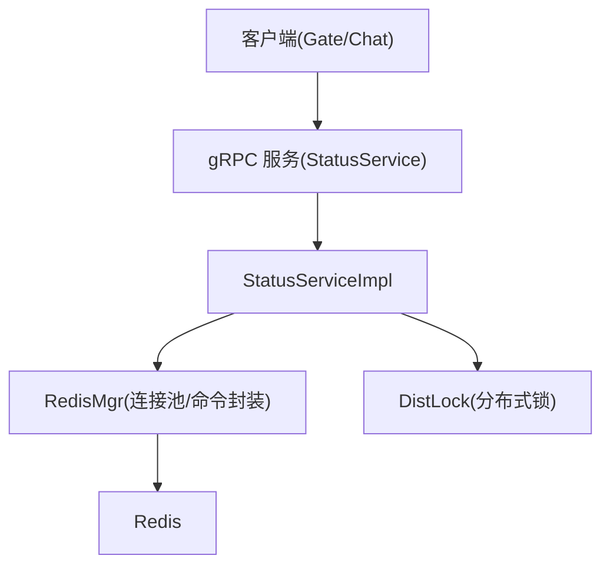
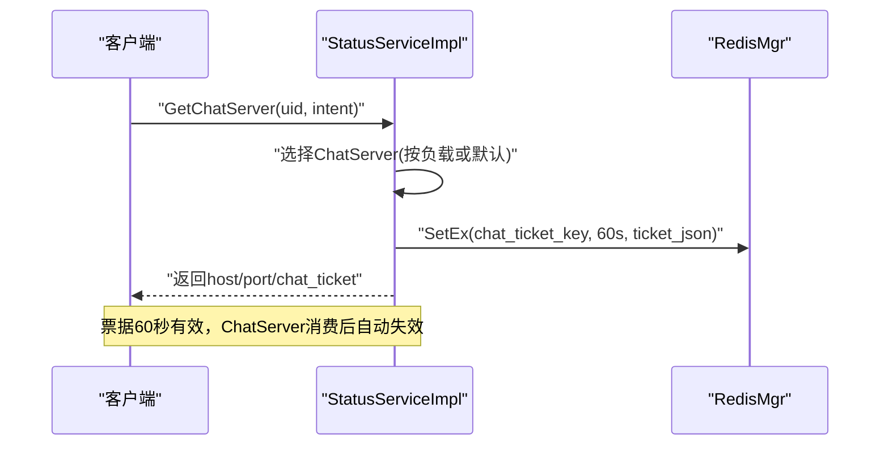
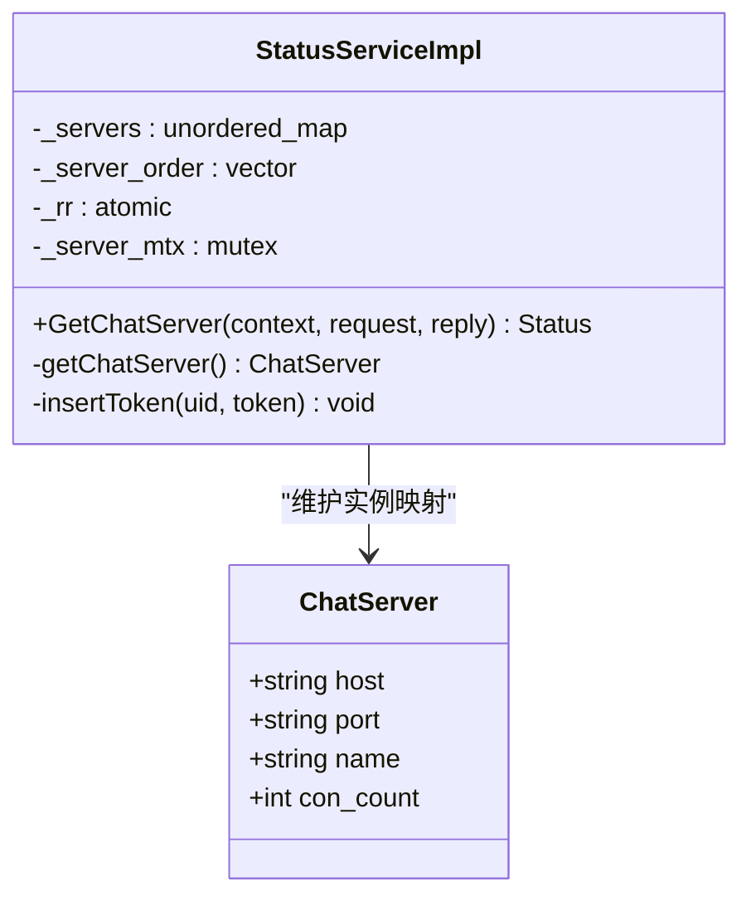
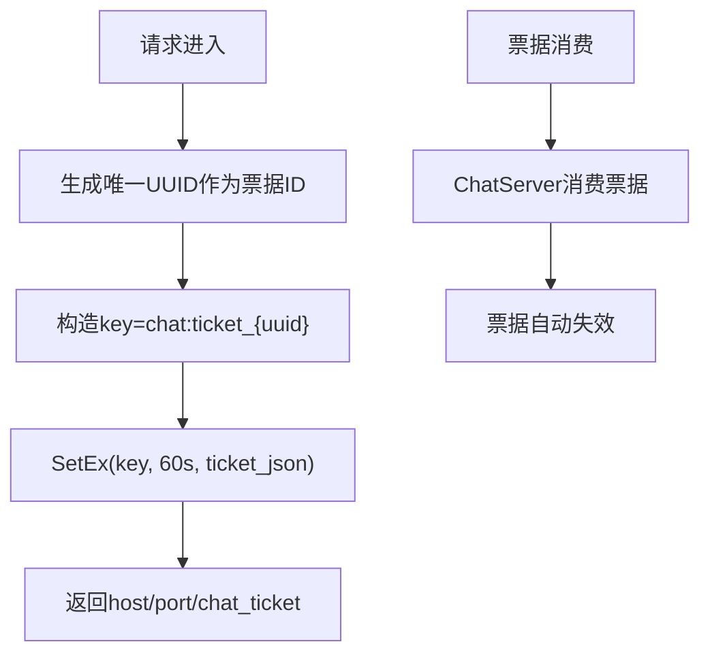
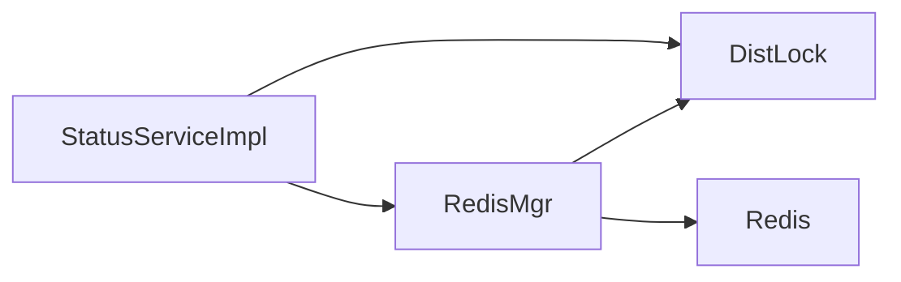

# StatusServer状态管理服务

<cite>
**本文引用的文件**   
- [status.proto](file://proto/status_service/status.proto)
- [StatusServiceImpl.h](file://server/StatusServer/include/StatusServiceImpl.h)
- [StatusServiceImpl.cpp](file://server/StatusServer/src/StatusServiceImpl.cpp)
- [DistLock.h](file://server/StatusServer/include/DistLock.h)
- [RedisMgr.h](file://server/StatusServer/include/RedisMgr.h)
- [const.h](file://server/StatusServer/include/const.h)
- [config.ini](file://server/StatusServer/config/config.ini)
- [StatusServer.cpp](file://server/StatusServer/src/StatusServer.cpp)
</cite>

## 更新摘要
**变更内容**   
- 移除了Login gRPC方法和相关实现
- 删除了MysqlDao和MysqlMgr等MySQL数据库相关文件
- 简化为仅保留GetChatServer功能的单一接口服务
- 移除了用户认证、登录校验等复杂逻辑
- 保留了基于Redis的聊天票据签发机制

## 目录
1. [简介](#简介)
2. [项目结构](#项目结构)
3. [核心组件](#核心组件)
4. [架构总览](#架构总览)
5. [详细组件分析](#详细组件分析)
6. [依赖关系分析](#依赖关系分析)
7. [性能与缓存策略](#性能与缓存策略)
8. [故障恢复与监控告警](#故障恢复与监控告警)
9. [排错指南](#排错指南)
10. [结论](#结论)

## 简介
本文件为 StatusServer 状态管理服务的开发文档。该服务经过简化后，专注于为用户提供获取聊天服务器地址的功能，通过gRPC接口供GateServer调用，完成"获取聊天服务器地址并签发Token"的关键流程。数据层通过 Redis 做高并发读写与分布式锁，不再依赖MySQL数据库。

## 项目结构
StatusServer 采用精简的分层设计：
- 协议层：gRPC 接口定义（status.proto）
- 服务实现层：StatusServiceImpl 暴露 RPC 方法
- 中间件与基础设施：Redis 连接池与命令封装（RedisMgr）、分布式锁（DistLock）
- 配置与启动：配置文件（config.ini）、主程序入口（StatusServer.cpp）

图表来源
- [StatusServer.cpp:17-52](file://server/StatusServer/src/StatusServer.cpp#L17-L52)
- [StatusServiceImpl.h:36-50](file://server/StatusServer/include/StatusServiceImpl.h#L36-L50)
- [RedisMgr.h:264-298](file://server/StatusServer/include/RedisMgr.h#L264-L298)

章节来源
- [StatusServer.cpp:17-52](file://server/StatusServer/src/StatusServer.cpp#L17-L52)
- [config.ini:1-23](file://server/StatusServer/config/config.ini#L1-L23)

## 核心组件
- gRPC 接口：GetChatServer（唯一接口）
- 聊天票据管理：基于 Redis 的一次性票据生成与验证
- 负载均衡：支持最少连接数负载均衡算法
- 分布式锁：基于 Redis SET NX EX + Lua 释放
- 配置管理：从 config.ini 加载端口、Redis、聊天服务器列表

章节来源
- [status.proto:6-31](file://proto/status_service/status.proto#L6-L31)
- [StatusServiceImpl.h:36-50](file://server/StatusServer/include/StatusServiceImpl.h#L36-L50)
- [RedisMgr.h:264-298](file://server/StatusServer/include/RedisMgr.h#L264-L298)
- [const.h:31-74](file://server/StatusServer/include/const.h#L31-L74)

## 架构总览
StatusServer 对外暴露一个核心 RPC：
- GetChatServer：根据 uid 返回一个 ChatServer 的地址，并生成一次性 chat_ticket 绑定到 uid

内部依赖：
- Redis：存储聊天票据、负载信息、分布式锁
- 配置中心：读取运行参数与后端服务列表

图表来源
- [StatusServiceImpl.cpp:36-80](file://server/StatusServer/src/StatusServiceImpl.cpp#L36-L80)
- [RedisMgr.cpp:19-46](file://server/StatusServer/src/RedisMgr.cpp#L19-L46)

## 详细组件分析

### gRPC 接口与状态服务实现
- 接口定义：GetChatServerReq/Rsp
- 实现要点：
  - GetChatServer：生成唯一 chat_ticket，写入 Redis（键前缀 CHAT_TICKET_PREFIX），返回 ChatServer 地址
  - mTLS认证：要求客户端证书SAN包含"llfc-gate"
  - 负载均衡：支持最少连接数选择算法，优先选择负载最低的ChatServer
  - 票据类型：支持INITIAL（首次登录）和RESUME（恢复登录）两种意图

图表来源
- [StatusServiceImpl.h:16-50](file://server/StatusServer/include/StatusServiceImpl.h#L16-L50)
- [StatusServiceImpl.cpp:36-80](file://server/StatusServer/src/StatusServiceImpl.cpp#L36-L80)
- [StatusServiceImpl.cpp:111-169](file://server/StatusServer/src/StatusServiceImpl.cpp#L111-L169)

章节来源
- [status.proto:6-31](file://proto/status_service/status.proto#L6-L31)
- [StatusServiceImpl.cpp:36-80](file://server/StatusServer/src/StatusServiceImpl.cpp#L36-L80)

### 分布式锁 DistLock
- 目标：保证状态更新的原子性与一致性
- 机制：
  - 加锁：SET lockKey identifier NX EX lockTimeout
  - 解锁：EVAL Lua脚本判断标识符一致后删除 key
  - 重试：在 acquireTimeout 内循环尝试
- 使用场景：可扩展用于多实例间对同一 uid 的状态写保护

图表来源
- [DistLock.h:4-16](file://server/StatusServer/include/DistLock.h#L4-L16)
- [const.h:69-72](file://server/StatusServer/include/const.h#L69-L72)

章节来源
- [DistLock.h:4-16](file://server/StatusServer/include/DistLock.h#L4-L16)
- [const.h:69-72](file://server/StatusServer/include/const.h#L69-L72)

### Redis 管理与缓存策略
- 连接池：RedisConPool 维护连接、PING 保活、失败重连
- 命令封装：Get/Set/SetWithExpire/LPush/LPop/HSet/HGet/HDel/Del/ExistsKey
- 聊天票据缓存：以 chat:ticket_{uuid} 为键存储票据JSON，支持60秒过期设置
- 分布式锁：通过 DistLock 封装加锁/解锁

图表来源
- [RedisMgr.cpp:19-46](file://server/StatusServer/src/RedisMgr.cpp#L19-L46)
- [RedisMgr.cpp:48-79](file://server/StatusServer/src/RedisMgr.cpp#L48-L79)
- [RedisMgr.cpp:82-113](file://server/StatusServer/src/RedisMgr.cpp#L82-L113)
- [StatusServiceImpl.cpp:52-79](file://server/StatusServer/src/StatusServiceImpl.cpp#L52-L79)

章节来源
- [RedisMgr.h:264-298](file://server/StatusServer/include/RedisMgr.h#L264-298)
- [RedisMgr.cpp:19-46](file://server/StatusServer/src/RedisMgr.cpp#L19-46)
- [RedisMgr.cpp:82-113](file://server/StatusServer/src/RedisMgr.cpp#L82-113)

### 配置与启动
- 监听地址与端口：从 [StatusServer] 段读取
- 后端 ChatServer 列表：从 [chatservers] 与各 chatserverX 段解析
- Redis 配置：[Redis] 段
- mTLS证书：通过环境变量加载CA证书、服务器证书和私钥

章节来源
- [config.ini:1-23](file://server/StatusServer/config/config.ini#L1-23)
- [StatusServer.cpp:17-52](file://server/StatusServer/src/StatusServer.cpp#L17-52)

## 依赖关系分析
- StatusServiceImpl 依赖：
  - RedisMgr：聊天票据存取、负载查询、分布式锁
  - DistLock：分布式锁实现
- RedisMgr 依赖：
  - hiredis：底层网络通信
  - DistLock：加锁/解锁
- 无MySQL依赖：已完全移除数据库访问层

图表来源
- [StatusServiceImpl.cpp:1-6](file://server/StatusServer/src/StatusServiceImpl.cpp#L1-6)
- [RedisMgr.cpp:1-5](file://server/StatusServer/src/RedisMgr.cpp#L1-5)

章节来源
- [StatusServiceImpl.cpp:1-6](file://server/StatusServer/src/StatusServiceImpl.cpp#L1-6)
- [RedisMgr.cpp:1-5](file://server/StatusServer/src/RedisMgr.cpp#L1-5)

## 性能与缓存策略
- 聊天票据缓存：
  - 键名：CHAT_TICKET_PREFIX + uuid
  - 过期时间：60秒，确保一次性使用
  - 读路径：GET 一次即判，O(1)
- 分布式锁：
  - 加锁：SET NX EX，原子性由 Redis 保证
  - 解锁：Lua 脚本确保仅持有者可释放
  - 超时控制：lockTimeout 与 acquireTimeout 防止死锁与长时间等待
- 连接池：
  - Redis：连接池大小与 PING 保活，失败自动重连
- 负载均衡优化：
  - 基于Redis中chatserver:lease:<name>键值进行最少连接数选择
  - 轮转起点避免配置首项长期占优

章节来源
- [RedisMgr.cpp:82-113](file://server/StatusServer/src/RedisMgr.cpp#L82-113)
- [RedisMgr.cpp:111-179](file://server/StatusServer/src/RedisMgr.cpp#L111-179)
- [const.h:62-67](file://server/StatusServer/include/const.h#L62-67)

## 故障恢复与监控告警
- Redis 故障恢复：
  - 连接池线程周期性 PING，失败连接释放并重连
  - 认证失败与网络异常均会记录日志并尝试重建
- 分布式锁容错：
  - 加锁失败会在 acquireTimeout 内重试
  - 解锁使用 Lua 原子判断，避免误删其他实例的锁
- 监控建议：
  - 统计 Redis 命令成功率、延迟
  - 统计分布式锁获取耗时与失败率
  - 监控聊天票据生成与消费成功率

章节来源
- [RedisMgr.cpp:111-179](file://server/StatusServer/src/RedisMgr.cpp#L111-179)
- [DistLock.h:4-16](file://server/StatusServer/include/DistLock.h#L4-16)

## 排错指南
- 常见问题定位：
  - 票据无效：检查 Redis 中 chat:ticket_{uuid} 是否存在且未过期
  - 服务器不可用：确认 ChatServer 是否上报了负载信息
  - mTLS认证失败：检查客户端证书SAN是否包含"llfc-gate"
  - 分布式锁冲突：检查 lockTimeout 与 acquireTimeout 配置是否合理
- 排查步骤：
  - 查看 Redis 票据键是否存在与TTL
  - 检查 Redis 连接池 PING 结果与重连日志
  - 核对分布式锁 Lua 脚本返回值
  - 验证mTLS证书配置是否正确

章节来源
- [StatusServiceImpl.cpp:36-80](file://server/StatusServer/src/StatusServiceImpl.cpp#L36-80)
- [RedisMgr.cpp:111-179](file://server/StatusServer/src/RedisMgr.cpp#L111-179)

## 结论
StatusServer 经过简化后，专注于提供高效的聊天服务器地址分发功能。通过gRPC暴露简洁的GetChatServer接口，结合Redis的高性能与分布式锁能力，实现了聊天票据签发与校验、负载均衡选择等功能。移除了复杂的用户认证和MySQL依赖，使服务更加轻量和高可用。建议在后续迭代中完善负载均衡策略、增加更完善的监控指标与错误码体系，以提升整体吞吐与可用性。