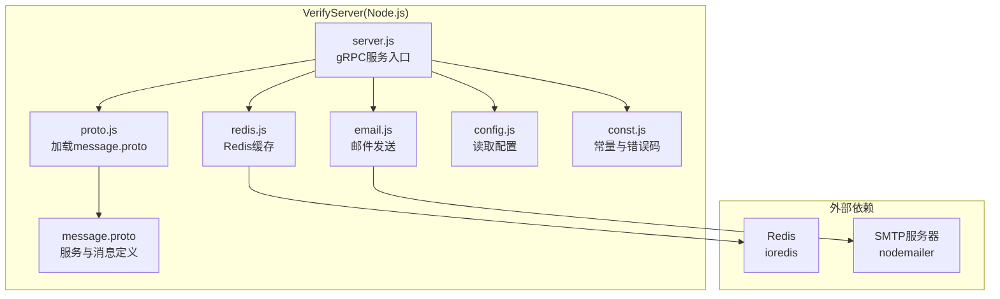
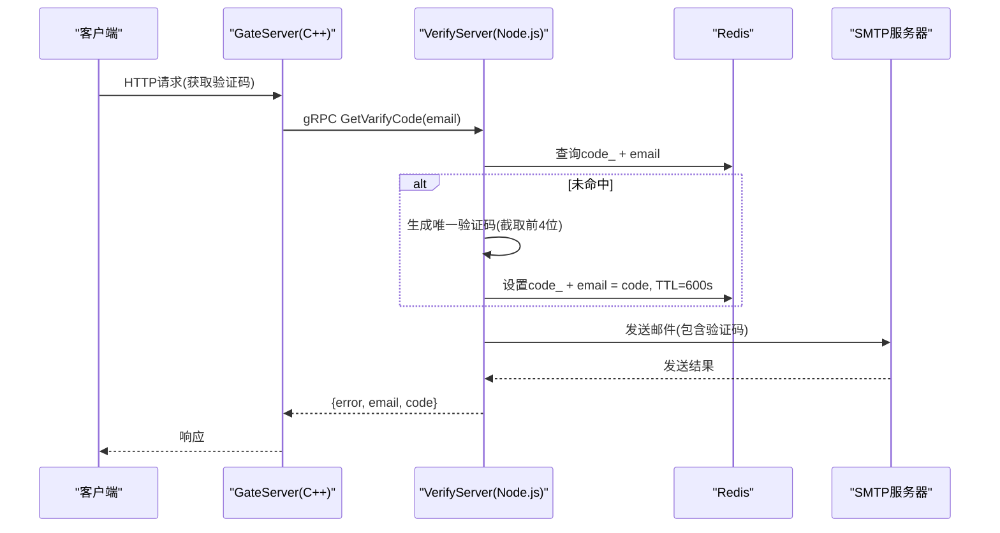
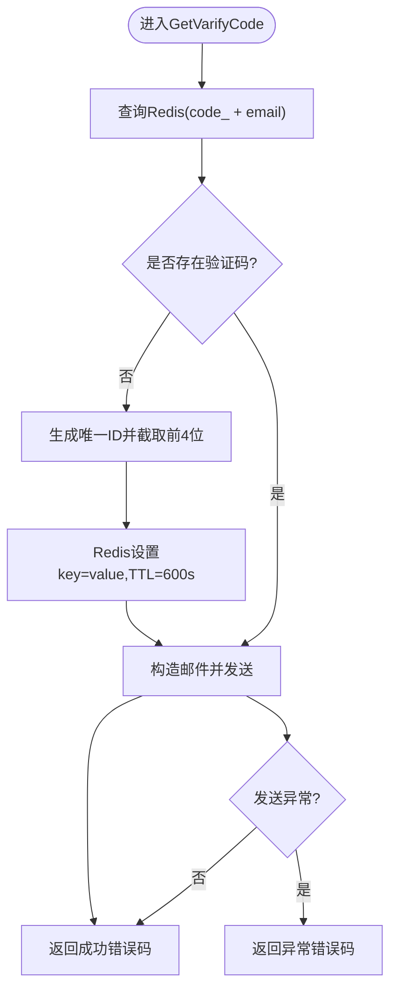
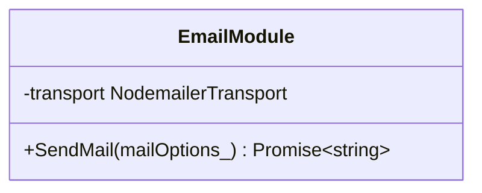
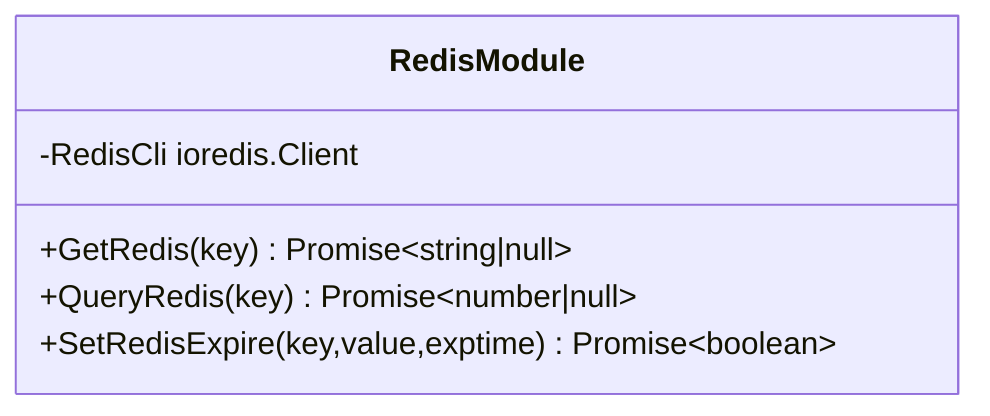
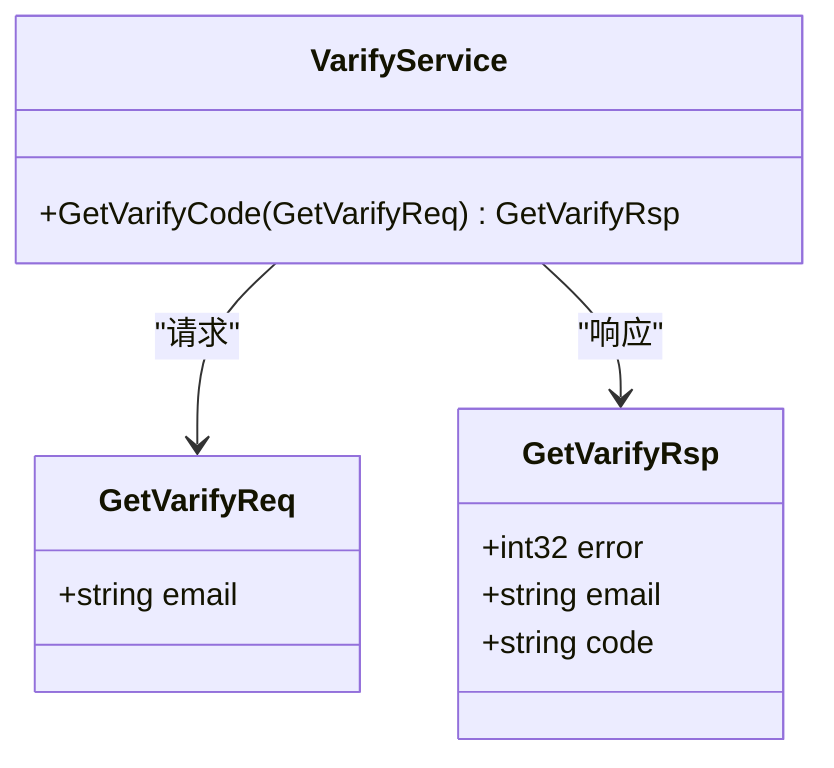
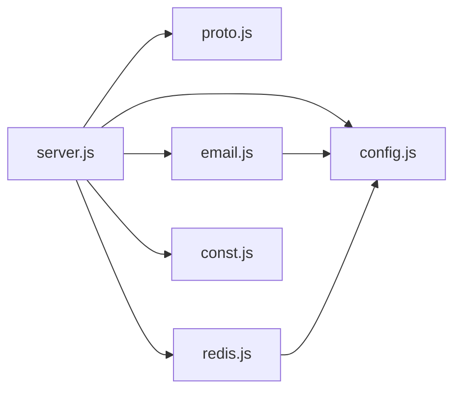

# VerifyServer验证码服务

<cite>
**本文引用的文件**   
- [server.js](file://server/VarifyServer/server.js)
- [email.js](file://server/VarifyServer/email.js)
- [redis.js](file://server/VarifyServer/redis.js)
- [proto.js](file://server/VarifyServer/proto.js)
- [message.proto](file://server/VarifyServer/message.proto)
- [verify.proto](file://proto/verify_service/verify.proto)
- [config.js](file://server/VarifyServer/config.js)
- [config.json](file://server/VarifyServer/config.json)
- [const.js](file://server/VarifyServer/const.js)
- [package.json](file://server/VarifyServer/package.json)
- [day08-邮箱认证服务.md](file://开发文档/day08-邮箱认证服务.md)
- [day10-多服务验证码派发功能调试.md](file://开发文档/day10-多服务验证码派发功能调试.md)
</cite>

## 目录
1. [简介](#简介)
2. [项目结构](#项目结构)
3. [核心组件](#核心组件)
4. [架构总览](#架构总览)
5. [详细组件分析](#详细组件分析)
6. [依赖关系分析](#依赖关系分析)
7. [性能与可扩展性](#性能与可扩展性)
8. [故障排查指南](#故障排查指南)
9. [结论](#结论)
10. [附录：API接口与错误码](#附录api接口与错误码)

## 简介
VerifyServer是基于Node.js实现的验证码服务，提供通过gRPC调用的验证码生成与邮件发送能力。服务使用Redis缓存验证码及其过期时间，结合Nodemailer完成SMTP邮件发送；Protocol Buffers定义确保与C++侧服务（GateServer）的数据兼容。本文档从系统架构、模块实现、数据流、错误处理、监控指标与扩展建议等方面进行全面说明，帮助开发者快速理解与二次开发。

## 项目结构
VerifyServer采用模块化设计，核心文件职责清晰：
- server.js：gRPC服务入口，业务逻辑编排（验证码获取流程）
- email.js：邮件发送封装（基于Nodemailer）
- redis.js：Redis客户端封装（连接、心跳、读写、过期管理）
- proto.js：动态加载并解析message.proto，暴露给gRPC服务使用
- message.proto：服务与消息定义（本地Proto）
- verify.proto：跨语言Proto定义（供C++侧参考）
- config.js / config.json：运行时配置（邮箱、Redis等）
- const.js：常量与错误码
- package.json：依赖与启动脚本

**图表来源** 
- [server.js:1-76](file://server/VarifyServer/server.js#L1-L76)
- [proto.js:1-12](file://server/VarifyServer/proto.js#L1-L12)
- [email.js:1-37](file://server/VarifyServer/email.js#L1-L37)
- [redis.js:1-101](file://server/VarifyServer/redis.js#L1-L101)
- [message.proto:1-44](file://server/VarifyServer/message.proto#L1-L44)

**章节来源**
- [server.js:1-76](file://server/VarifyServer/server.js#L1-L76)
- [package.json:1-19](file://server/VarifyServer/package.json#L1-L19)

## 核心组件
- gRPC服务层：暴露GetVarifyCode RPC，接收邮箱地址，返回错误码与状态
- 邮件模块：基于Nodemailer创建传输通道，封装异步发送方法
- Redis模块：封装get/exists/set+expire操作，维护连接健康与心跳
- 配置与常量：集中化管理邮箱、Redis、MySQL（预留）及错误码
- Proto定义：统一消息格式，保证与C++服务互通

**章节来源**
- [server.js:15-64](file://server/VarifyServer/server.js#L15-L64)
- [email.js:1-37](file://server/VarifyServer/email.js#L1-L37)
- [redis.js:1-101](file://server/VarifyServer/redis.js#L1-L101)
- [config.js:1-15](file://server/VarifyServer/config.js#L1-L15)
- [const.js:1-10](file://server/VarifyServer/const.js#L1-L10)
- [message.proto:1-44](file://server/VarifyServer/message.proto#L1-L44)

## 架构总览
VerifyServer作为独立微服务，被GateServer通过gRPC调用。整体交互包括：
- GateServer发起GetVarifyCode请求
- VerifyServer校验参数、查询或生成验证码、写入Redis、发送邮件
- 返回统一错误码与结果

**图表来源** 
- [server.js:15-64](file://server/VarifyServer/server.js#L15-L64)
- [redis.js:41-98](file://server/VarifyServer/redis.js#L41-L98)
- [email.js:22-35](file://server/VarifyServer/email.js#L22-L35)
- [message.proto:5-17](file://server/VarifyServer/message.proto#L5-L17)

## 详细组件分析

### gRPC服务与验证码流程（server.js）
- 服务注册：加载message.proto定义的VarifyService，绑定GetVarifyCode处理器
- 业务流程：
  - 根据邮箱查询Redis中是否已有验证码
  - 若不存在则生成唯一ID并截取前4位作为验证码，设置TTL为600秒
  - 构造邮件内容并调用email模块发送
  - 返回统一错误码与邮箱地址
- 异常处理：捕获异常并返回通用错误码

**图表来源** 
- [server.js:15-64](file://server/VarifyServer/server.js#L15-L64)
- [const.js:3-7](file://server/VarifyServer/const.js#L3-L7)

**章节来源**
- [server.js:15-64](file://server/VarifyServer/server.js#L15-L64)
- [const.js:1-10](file://server/VarifyServer/const.js#L1-L10)

### 邮件发送模块（email.js）
- 传输通道：使用Nodemailer创建SMTP传输对象，配置host、port、secure与auth
- 发送方法：封装sendMail为Promise，便于异步调用
- 错误处理：失败时输出错误信息并reject，成功时resolve响应

**图表来源** 
- [email.js:1-37](file://server/VarifyServer/email.js#L1-L37)

**章节来源**
- [email.js:1-37](file://server/VarifyServer/email.js#L1-L37)

### Redis缓存模块（redis.js）
- 连接管理：ioredis客户端初始化，监听error与end事件进行重连
- 心跳机制：定时写入heartbeat键记录当前时间戳
- 核心方法：
  - GetRedis(key)：获取值，空值返回null
  - QueryRedis(key)：判断key是否存在
  - SetRedisExpire(key,value,exptime)：设置值并指定过期时间（秒）
- 错误处理：各方法捕获异常并返回安全默认值

**图表来源** 
- [redis.js:1-101](file://server/VarifyServer/redis.js#L1-L101)

**章节来源**
- [redis.js:1-101](file://server/VarifyServer/redis.js#L1-L101)

### Protocol Buffers定义（proto.js与message.proto/verify.proto）
- proto.js：动态加载message.proto，保持字段名大小写、枚举与long类型处理
- message.proto：定义VarifyService与GetVarifyReq/GetVarifyRsp
- verify.proto：跨语言Proto定义，供C++侧参考（字段一致）

**图表来源** 
- [proto.js:1-12](file://server/VarifyServer/proto.js#L1-L12)
- [message.proto:1-44](file://server/VarifyServer/message.proto#L1-44)
- [verify.proto:1-19](file://proto/verify_service/verify.proto#L1-19)

**章节来源**
- [proto.js:1-12](file://server/VarifyServer/proto.js#L1-L12)
- [message.proto:1-44](file://server/VarifyServer/message.proto#L1-44)
- [verify.proto:1-19](file://proto/verify_service/verify.proto#L1-19)

### 配置与常量（config.js、config.json、const.js）
- config.js：读取config.json，导出邮箱、Redis、MySQL（预留）与code_prefix
- config.json：集中存放邮箱授权码、Redis与MySQL连接信息
- const.js：定义错误码（Success、RedisErr、Exception）与code_prefix

**章节来源**
- [config.js:1-15](file://server/VarifyServer/config.js#L1-L15)
- [config.json:1-21](file://server/VarifyServer/config.json#L1-21)
- [const.js:1-10](file://server/VarifyServer/const.js#L1-10)

## 依赖关系分析
- 内部依赖：
  - server.js依赖proto.js、email.js、redis.js、config.js、const.js
  - email.js依赖config.js
  - redis.js依赖config.js
- 外部依赖：
  - @grpc/grpc-js与@grpc/proto-loader用于gRPC服务与Proto加载
  - ioredis用于Redis客户端
  - nodemailer用于SMTP邮件发送
  - uuid用于生成唯一ID

**图表来源** 
- [server.js:1-10](file://server/VarifyServer/server.js#L1-L10)
- [email.js:1-5](file://server/VarifyServer/email.js#L1-L5)
- [redis.js:1-5](file://server/VarifyServer/redis.js#L1-L5)
- [package.json:11-17](file://server/VarifyServer/package.json#L11-L17)

**章节来源**
- [package.json:1-19](file://server/VarifyServer/package.json#L1-L19)

## 性能与可扩展性
- 并发模型：Node.js单线程事件循环，适合IO密集型任务（邮件、Redis）
- 连接池：建议在GateServer侧对gRPC连接进行池化（已在开发文档中实现），减少握手开销
- 缓存策略：Redis存储验证码并设置TTL，避免重复生成与频繁邮件发送
- 限流与防刷：
  - 当前实现按邮箱维度复用验证码（TTL内不重复生成）
  - 建议增加频率限制（如每分钟最多N次），可基于Redis计数器实现
- 监控指标：
  - 邮件发送成功率/失败率
  - Redis命中率与延迟
  - gRPC请求QPS与错误分布
  - 心跳键更新间隔验证服务存活

[本节为通用指导，无需引用具体文件]

## 故障排查指南
- Redis连接问题：
  - 检查config.json中的host/port/passwd是否正确
  - 观察error与end事件日志，确认自动重连是否生效
- 邮件发送失败：
  - 确认SMTP配置（host、port、secure、auth.user/auth.pass）
  - 检查邮箱授权码是否有效
  - 查看email.js的reject分支日志
- gRPC调用异常：
  - 确认端口50051是否开放且未被占用
  - 检查proto定义与服务端实现一致性
- 验证码未收到：
  - 检查Redis中code_ + email是否存在且未过期
  - 确认邮件服务商是否拦截或进入垃圾箱

**章节来源**
- [redis.js:16-28](file://server/VarifyServer/redis.js#L16-L28)
- [email.js:22-35](file://server/VarifyServer/email.js#L22-L35)
- [server.js:55-62](file://server/VarifyServer/server.js#L55-L62)

## 结论
VerifyServer以简洁清晰的模块化设计实现了验证码生成与邮件发送的核心能力，借助Redis实现高效缓存与过期管理，通过gRPC与Proto定义保障与C++服务的互操作性。当前实现已满足基础场景，建议后续增强限流、监控与模板渲染能力，以提升安全性与可观测性。

[本节为总结，无需引用具体文件]

## 附录：API接口与错误码
- gRPC接口：
  - 服务：VarifyService
  - 方法：GetVarifyCode
  - 请求：GetVarifyReq{email:string}
  - 响应：GetVarifyRsp{error:int32, email:string, code:string}
- 错误码：
  - Success：0
  - RedisErr：1
  - Exception：2
- 运行方式：
  - 安装依赖后执行npm run serve启动服务

**章节来源**
- [message.proto:5-17](file://server/VarifyServer/message.proto#L5-L17)
- [verify.proto:5-17](file://proto/verify_service/verify.proto#L5-L17)
- [const.js:3-7](file://server/VarifyServer/const.js#L3-L7)
- [package.json:6-8](file://server/VarifyServer/package.json#L6-L8)