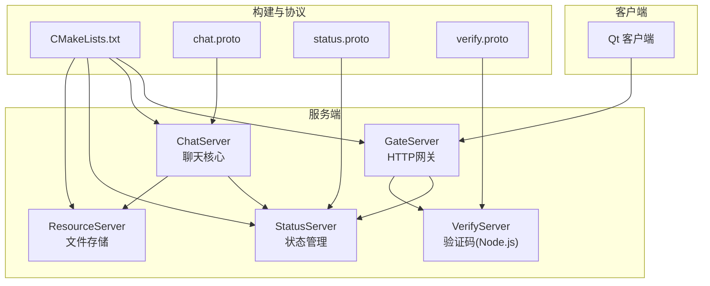
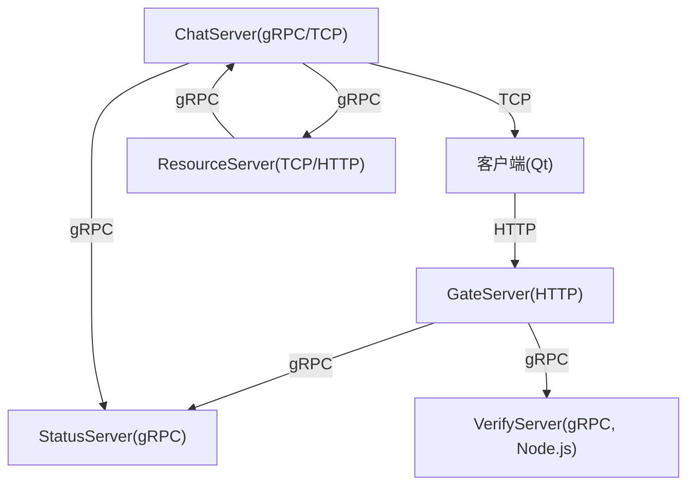
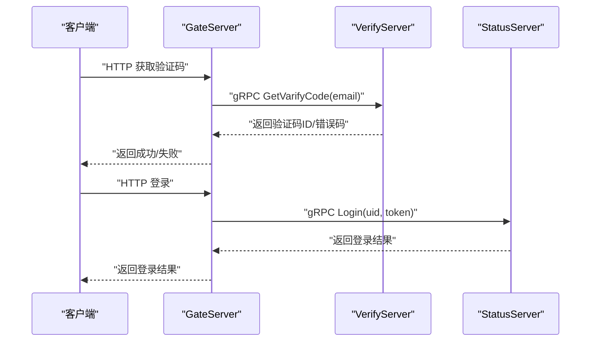
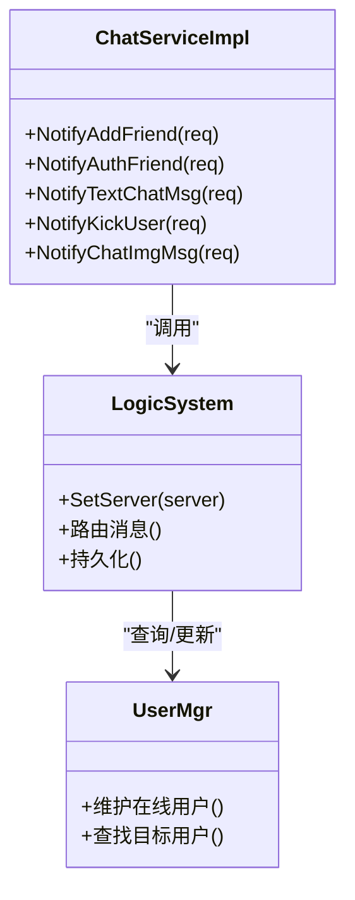
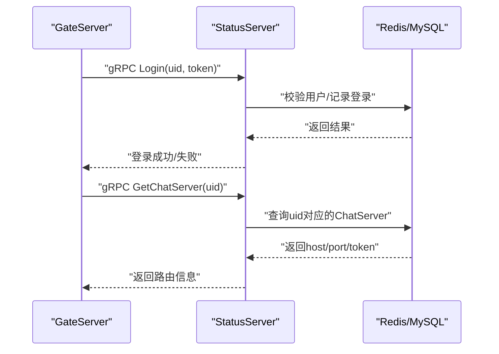
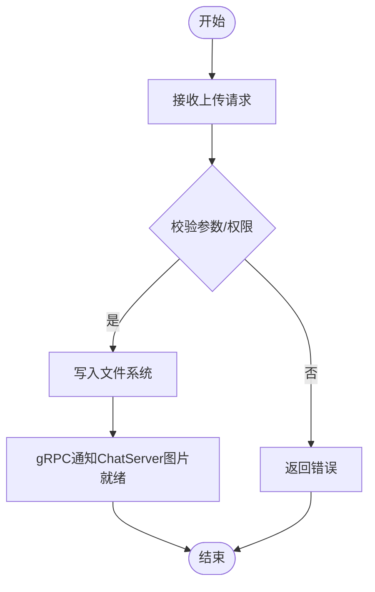
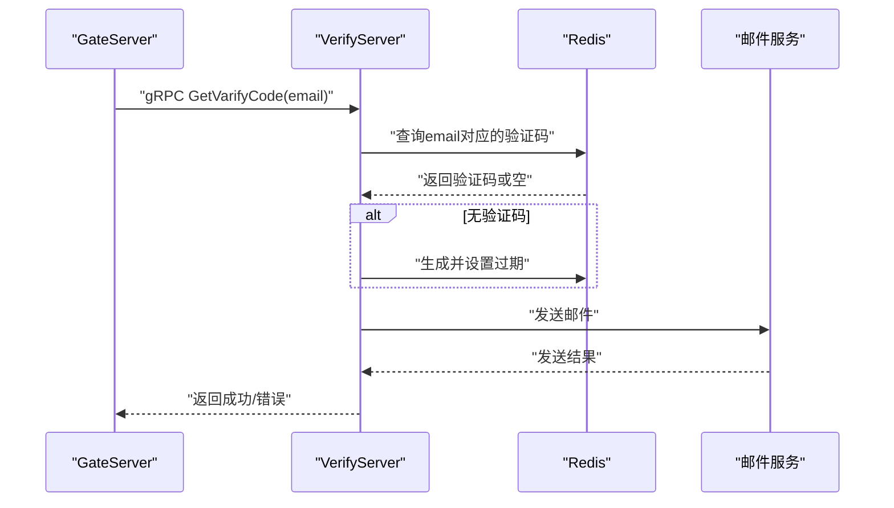
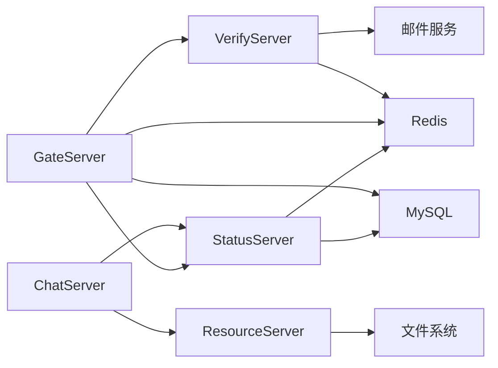
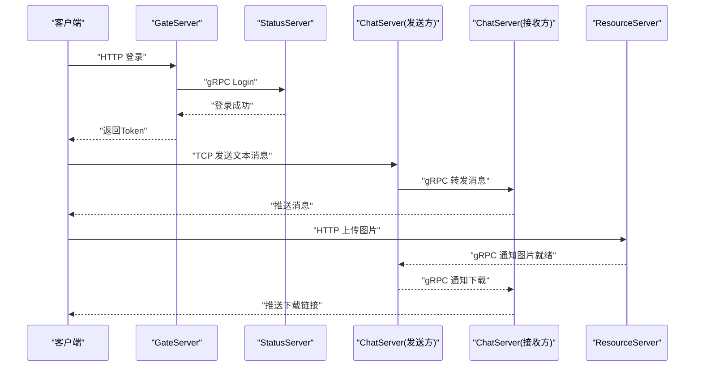

# 微服务架构设计

<cite>
**本文引用的文件**   
- [README.md](file://README.md)
- [CMakeLists.txt](file://CMakeLists.txt)
- [proto/chat_service/chat.proto](file://proto/chat_service/chat.proto)
- [proto/status_service/status.proto](file://proto/status_service/status.proto)
- [proto/verify_service/verify.proto](file://proto/verify_service/verify.proto)
- [server/GateServer/src/GateServer.cpp](file://server/GateServer/src/GateServer.cpp)
- [server/GateServer/config/config.ini](file://server/GateServer/config/config.ini)
- [server/ChatServer/src/ChatServer.cpp](file://server/ChatServer/src/ChatServer.cpp)
- [server/ChatServer/config/chatserver1.ini](file://server/ChatServer/config/chatserver1.ini)
- [server/StatusServer/src/StatusServer.cpp](file://server/StatusServer/src/StatusServer.cpp)
- [server/StatusServer/config/config.ini](file://server/StatusServer/config/config.ini)
- [server/ResourceServer/src/ResourceServer.cpp](file://server/ResourceServer/src/ResourceServer.cpp)
- [server/ResourceServer/config/config.ini](file://server/ResourceServer/config/config.ini)
- [server/VarifyServer/server.js](file://server/VarifyServer/server.js)
- [server/VarifyServer/package.json](file://server/VarifyServer/package.json)
</cite>

## 目录
1. [简介](#简介)
2. [项目结构](#项目结构)
3. [核心组件](#核心组件)
4. [架构总览](#架构总览)
5. [详细组件分析](#详细组件分析)
6. [依赖关系分析](#依赖关系分析)
7. [性能与扩展性](#性能与扩展性)
8. [故障转移与服务发现](#故障转移与服务发现)
9. [数据流与交互模式](#数据流与交互模式)
10. [技术选型与约束](#技术选型与约束)
11. [排错指南](#排错指南)
12. [结论](#结论)

## 简介
本架构文档面向LLFCChat微服务系统，围绕GateServer（HTTP网关）、ChatServer（聊天核心）、StatusServer（用户状态）、ResourceServer（文件存储）与VerifyServer（验证码服务）五大服务展开。文档从整体设计、服务拆分策略、通信机制、负载均衡、服务发现、故障转移、扩展性到性能考量进行系统化阐述，并提供架构图与数据流图，帮助读者快速理解各组件职责与协作方式。

## 项目结构
- 顶层构建由根CMakeLists统一编排，包含server与client两个子工程；gRPC代码生成通过cmake模块集成。
- 协议定义位于proto目录，按服务划分chat_service、status_service、verify_service三个proto文件。
- 服务端实现位于server目录，每个服务独立配置与源码组织，便于独立部署与扩展。
- 客户端为Qt桌面应用，负责HTTP与TCP通信、UI展示与业务交互。

图表来源
- [CMakeLists.txt:1-34](file://CMakeLists.txt#L1-L34)
- [proto/chat_service/chat.proto:1-105](file://proto/chat_service/chat.proto#L1-L105)
- [proto/status_service/status.proto:1-32](file://proto/status_service/status.proto#L1-L32)
- [proto/verify_service/verify.proto:1-19](file://proto/verify_service/verify.proto#L1-L19)

章节来源
- [CMakeLists.txt:1-34](file://CMakeLists.txt#L1-L34)
- [README.md:1-112](file://README.md#L1-L112)

## 核心组件
- GateServer：对外暴露HTTP接口，统一鉴权、路由转发至后端服务（StatusServer、VerifyServer），并协调登录流程与资源访问。
- ChatServer：承载聊天核心逻辑，维护在线会话、消息路由、好友申请与认证、图片消息通知等，通过gRPC提供内部能力。
- StatusServer：集中管理用户登录态、在线用户与ChatServer实例映射，提供GetChatServer与Login能力。
- ResourceServer：处理文件上传、下载与静态资源托管，支持断点续传与进度回调，并通过gRPC与ChatServer交互。
- VerifyServer：基于Node.js的验证码服务，生成一次性验证码并发送邮件，使用Redis缓存验证码。

章节来源
- [server/GateServer/src/GateServer.cpp:128-160](file://server/GateServer/src/GateServer.cpp#L128-L160)
- [server/ChatServer/src/ChatServer.cpp:20-81](file://server/ChatServer/src/ChatServer.cpp#L20-L81)
- [server/StatusServer/src/StatusServer.cpp:17-69](file://server/StatusServer/src/StatusServer.cpp#L17-L69)
- [server/ResourceServer/src/ResourceServer.cpp:15-42](file://server/ResourceServer/src/ResourceServer.cpp#L15-L42)
- [server/VarifyServer/server.js:15-76](file://server/VarifyServer/server.js#L15-L76)

## 架构总览
下图展示了客户端与各服务的交互路径及主要协议：
- 客户端通过HTTP访问GateServer进行注册、登录、验证码获取等。
- GateServer调用StatusServer完成用户状态管理与ChatServer定位。
- ChatServer通过gRPC与StatusServer交互，并在需要时通知ResourceServer或向对端ChatServer推送消息。
- ResourceServer提供文件存取能力，并与ChatServer协同完成图片消息的异步下载通知。
- VerifyServer通过gRPC被GateServer调用，完成验证码生成与邮件发送。

图表来源
- [proto/status_service/status.proto:1-32](file://proto/status_service/status.proto#L1-L32)
- [proto/chat_service/chat.proto:1-105](file://proto/chat_service/chat.proto#L1-L105)
- [proto/verify_service/verify.proto:1-19](file://proto/verify_service/verify.proto#L1-L19)
- [server/GateServer/config/config.ini:1-25](file://server/GateServer/config/config.ini#L1-L25)
- [server/ChatServer/config/chatserver1.ini:1-30](file://server/ChatServer/config/chatserver1.ini#L1-L30)
- [server/StatusServer/config/config.ini:1-23](file://server/StatusServer/config/config.ini#L1-L23)
- [server/ResourceServer/config/config.ini:1-27](file://server/ResourceServer/config/config.ini#L1-L27)

## 详细组件分析

### GateServer（HTTP网关）
- 职责
  - 对外提供HTTP接口，解析请求、鉴权、路由转发。
  - 与StatusServer交互完成用户登录校验与ChatServer地址发现。
  - 与VerifyServer交互获取验证码。
  - 与Redis、MySQL交互进行会话与基础数据操作。
- 关键流程
  - 启动时初始化数据库连接池、Redis连接池，加载配置，监听端口。
  - 接收HTTP请求后，根据路由调用对应后端服务。
- 配置要点
  - HTTP端口、VerifyServer与StatusServer的地址、MySQL与Redis连接信息、ResourceServer的RPC端口等。

图表来源
- [server/GateServer/src/GateServer.cpp:128-160](file://server/GateServer/src/GateServer.cpp#L128-L160)
- [server/VarifyServer/server.js:15-76](file://server/VarifyServer/server.js#L15-L76)
- [server/StatusServer/src/StatusServer.cpp:17-69](file://server/StatusServer/src/StatusServer.cpp#L17-L69)
- [server/GateServer/config/config.ini:1-25](file://server/GateServer/config/config.ini#L1-L25)

章节来源
- [server/GateServer/src/GateServer.cpp:128-160](file://server/GateServer/src/GateServer.cpp#L128-L160)
- [server/GateServer/config/config.ini:1-25](file://server/GateServer/config/config.ini#L1-L25)

### ChatServer（聊天核心）
- 职责
  - 维护用户会话、消息路由、好友申请与认证、图片消息通知。
  - 通过gRPC暴露NotifyAddFriend、NotifyAuthFriend、NotifyTextChatMsg、NotifyKickUser、NotifyChatImgMsg等能力。
  - 与StatusServer交互查询目标用户所在ChatServer，并进行跨服消息转发。
- 关键流程
  - 启动时注册gRPC服务，启动定时器，接入AsioIOServicePool处理并发。
  - 收到消息后持久化、广播给目标用户，必要时触发ResourceServer的图片下载通知。
- 配置要点
  - SelfServer名称、Host、Port、RPCPort，PeerServer列表用于多实例间通信。

图表来源
- [proto/chat_service/chat.proto:1-105](file://proto/chat_service/chat.proto#L1-L105)
- [server/ChatServer/src/ChatServer.cpp:20-81](file://server/ChatServer/src/ChatServer.cpp#L20-L81)
- [server/ChatServer/config/chatserver1.ini:1-30](file://server/ChatServer/config/chatserver1.ini#L1-L30)

章节来源
- [server/ChatServer/src/ChatServer.cpp:20-81](file://server/ChatServer/src/ChatServer.cpp#L20-L81)
- [server/ChatServer/config/chatserver1.ini:1-30](file://server/ChatServer/config/chatserver1.ini#L1-L30)
- [proto/chat_service/chat.proto:1-105](file://proto/chat_service/chat.proto#L1-L105)

### StatusServer（用户状态）
- 职责
  - 维护用户登录态、在线用户与ChatServer实例映射。
  - 提供GetChatServer(uid)返回目标ChatServer地址与token，以及Login校验。
- 关键流程
  - 启动gRPC服务，监听指定端口。
  - 处理登录与路由查询，读写Redis与MySQL以持久化状态。
- 配置要点
  - StatusServer端口、Host，MySQL与Redis连接信息，chatservers列表用于本地注册表。

图表来源
- [proto/status_service/status.proto:1-32](file://proto/status_service/status.proto#L1-L32)
- [server/StatusServer/src/StatusServer.cpp:17-69](file://server/StatusServer/src/StatusServer.cpp#L17-L69)
- [server/StatusServer/config/config.ini:1-23](file://server/StatusServer/config/config.ini#L1-L23)

章节来源
- [server/StatusServer/src/StatusServer.cpp:17-69](file://server/StatusServer/src/StatusServer.cpp#L17-L69)
- [server/StatusServer/config/config.ini:1-23](file://server/StatusServer/config/config.ini#L1-L23)
- [proto/status_service/status.proto:1-32](file://proto/status_service/status.proto#L1-L32)

### ResourceServer（文件存储）
- 职责
  - 提供文件上传、下载、静态资源托管能力。
  - 支持断点续传、分片与进度显示，与ChatServer通过gRPC协作完成图片消息通知。
- 关键流程
  - 启动AsioIOServicePool，监听端口，处理文件IO与网络传输。
  - 与ChatServer交互确认消息元数据，确保一致性。
- 配置要点
  - SelfServer名称、Host、Port，输出目录、静态目录，以及ChatServer的RPC端口列表。

图表来源
- [server/ResourceServer/src/ResourceServer.cpp:15-42](file://server/ResourceServer/src/ResourceServer.cpp#L15-L42)
- [server/ResourceServer/config/config.ini:1-27](file://server/ResourceServer/config/config.ini#L1-L27)
- [proto/chat_service/chat.proto:86-105](file://proto/chat_service/chat.proto#L86-L105)

章节来源
- [server/ResourceServer/src/ResourceServer.cpp:15-42](file://server/ResourceServer/src/ResourceServer.cpp#L15-L42)
- [server/ResourceServer/config/config.ini:1-27](file://server/ResourceServer/config/config.ini#L1-L27)
- [proto/chat_service/chat.proto:86-105](file://proto/chat_service/chat.proto#L86-L105)

### VerifyServer（验证码服务）
- 职责
  - 生成一次性验证码，存入Redis并设置过期时间。
  - 通过邮件发送验证码给用户。
- 关键流程
  - 接收gRPC请求，检查Redis中是否已有验证码，不存在则生成并缓存。
  - 调用邮件模块发送，返回成功或错误码。
- 配置要点
  - gRPC服务绑定端口，Redis连接，邮件服务器配置。

图表来源
- [server/VarifyServer/server.js:15-76](file://server/VarifyServer/server.js#L15-L76)
- [server/VarifyServer/package.json:1-19](file://server/VarifyServer/package.json#L1-L19)
- [proto/verify_service/verify.proto:1-19](file://proto/verify_service/verify.proto#L1-L19)

章节来源
- [server/VarifyServer/server.js:15-76](file://server/VarifyServer/server.js#L15-L76)
- [server/VarifyServer/package.json:1-19](file://server/VarifyServer/package.json#L1-L19)
- [proto/verify_service/verify.proto:1-19](file://proto/verify_service/verify.proto#L1-L19)

## 依赖关系分析
- GateServer依赖StatusServer与VerifyServer，同时通过Redis与MySQL进行会话与基础数据操作。
- ChatServer依赖StatusServer进行路由查询，依赖ResourceServer进行文件相关通知。
- StatusServer依赖Redis与MySQL进行状态持久化。
- ResourceServer依赖文件系统与gRPC与ChatServer交互。
- VerifyServer依赖Redis与邮件服务。

图表来源
- [server/GateServer/config/config.ini:1-25](file://server/GateServer/config/config.ini#L1-L25)
- [server/ChatServer/config/chatserver1.ini:1-30](file://server/ChatServer/config/chatserver1.ini#L1-L30)
- [server/StatusServer/config/config.ini:1-23](file://server/StatusServer/config/config.ini#L1-L23)
- [server/ResourceServer/config/config.ini:1-27](file://server/ResourceServer/config/config.ini#L1-L27)
- [server/VarifyServer/server.js:15-76](file://server/VarifyServer/server.js#L15-L76)

章节来源
- [server/GateServer/config/config.ini:1-25](file://server/GateServer/config/config.ini#L1-L25)
- [server/ChatServer/config/chatserver1.ini:1-30](file://server/ChatServer/config/chatserver1.ini#L1-L30)
- [server/StatusServer/config/config.ini:1-23](file://server/StatusServer/config/config.ini#L1-L23)
- [server/ResourceServer/config/config.ini:1-27](file://server/ResourceServer/config/config.ini#L1-L27)
- [server/VarifyServer/server.js:15-76](file://server/VarifyServer/server.js#L15-L76)

## 性能与扩展性
- 并发模型
  - ChatServer与ResourceServer采用AsioIOServicePool进行高并发I/O处理，避免阻塞。
  - GateServer基于Boost.Asio的事件循环，适合大量短连接HTTP请求。
- 存储优化
  - Redis用于高频读写的会话、验证码与在线状态缓存，降低MySQL压力。
  - 文件存储采用本地磁盘，支持断点续传提升大文件传输效率。
- 扩展性
  - ChatServer可水平扩展多个实例，通过StatusServer进行路由发现。
  - ResourceServer可按容量与地域扩展，配合CDN提升静态资源访问速度。
  - VerifyServer无状态，可通过多实例+共享Redis横向扩展。

[本节为通用指导，不直接分析具体文件]

## 故障转移与服务发现
- 服务发现
  - StatusServer维护ChatServer实例列表与用户映射，客户端通过GateServer间接发现目标ChatServer。
  - 配置文件中的chatservers与PeerServers用于静态注册表，生产环境建议引入动态注册中心。
- 故障转移
  - 当某ChatServer实例不可用时，StatusServer应剔除该实例，客户端重试其他可用实例。
  - ResourceServer与VerifyServer应具备健康检查与自动切换能力。
- 心跳与超时
  - ChatServer与StatusServer之间可引入心跳检测，及时下线异常节点。
  - 所有gRPC调用需设置合理超时与重试策略。

[本节为通用指导，不直接分析具体文件]

## 数据流与交互模式
- 登录流程
  - 客户端向GateServer发起HTTP登录请求，GateServer调用StatusServer校验并记录登录态。
  - 成功后返回Token，客户端后续通过ChatServer的TCP长连接进行实时通信。
- 聊天消息流程
  - 发送方ChatServer持久化消息并通知接收方ChatServer，后者推送至客户端。
  - 若涉及图片，ResourceServer完成上传后通知ChatServer，再由ChatServer下发下载指令。
- 验证码流程
  - GateServer调用VerifyServer生成验证码并发送邮件，结果返回客户端。

图表来源
- [proto/status_service/status.proto:1-32](file://proto/status_service/status.proto#L1-L32)
- [proto/chat_service/chat.proto:1-105](file://proto/chat_service/chat.proto#L1-L105)
- [server/ChatServer/src/ChatServer.cpp:20-81](file://server/ChatServer/src/ChatServer.cpp#L20-L81)
- [server/ResourceServer/src/ResourceServer.cpp:15-42](file://server/ResourceServer/src/ResourceServer.cpp#L15-L42)

## 技术选型与约束
- 语言与框架
  - C++（Boost.Asio、gRPC）用于高性能服务端；Node.js用于验证码服务，便于集成邮件与Redis生态。
  - Qt用于桌面客户端，提供丰富的UI与网络能力。
- 通信协议
  - HTTP用于外部API与文件上传下载；gRPC用于服务间高效通信；TCP用于实时聊天。
- 存储与缓存
  - MySQL用于持久化用户与消息元数据；Redis用于会话、验证码与在线状态缓存。
- 约束
  - 当前服务发现基于配置文件，生产环境建议引入动态注册中心与健康检查。
  - 安全方面需启用TLS与鉴权中间件，防止未授权访问。

[本节为通用指导，不直接分析具体文件]

## 排错指南
- 常见问题
  - Redis连接失败：检查端口、密码与网络连通性。
  - MySQL连接失败：核对主机、端口、用户名与密码。
  - gRPC服务不可达：确认服务已启动且端口正确，防火墙放行。
  - 文件上传失败：检查磁盘空间与权限，确认输出目录存在。
- 日志与调试
  - 各服务在启动与异常路径均输出日志，结合错误码定位问题。
  - 建议在StatusServer与ChatServer增加健康检查接口以便监控。

章节来源
- [server/GateServer/src/GateServer.cpp:128-160](file://server/GateServer/src/GateServer.cpp#L128-L160)
- [server/StatusServer/src/StatusServer.cpp:17-69](file://server/StatusServer/src/StatusServer.cpp#L17-L69)
- [server/ChatServer/src/ChatServer.cpp:20-81](file://server/ChatServer/src/ChatServer.cpp#L20-L81)
- [server/ResourceServer/src/ResourceServer.cpp:15-42](file://server/ResourceServer/src/ResourceServer.cpp#L15-L42)
- [server/VarifyServer/server.js:15-76](file://server/VarifyServer/server.js#L15-L76)

## 结论
LLFCChat微服务架构通过清晰的服务边界与协议定义，实现了高内聚、低耦合的系统设计。GateServer作为统一入口简化了客户端复杂度；ChatServer专注聊天核心逻辑；StatusServer集中管理状态与路由；ResourceServer提供可靠文件能力；VerifyServer解耦验证码与邮件发送。借助Redis与MySQL的缓存与持久化，系统在性能与扩展性上具备良好基础。未来可引入动态服务发现、健康检查与TLS安全增强，进一步提升稳定性与安全性。