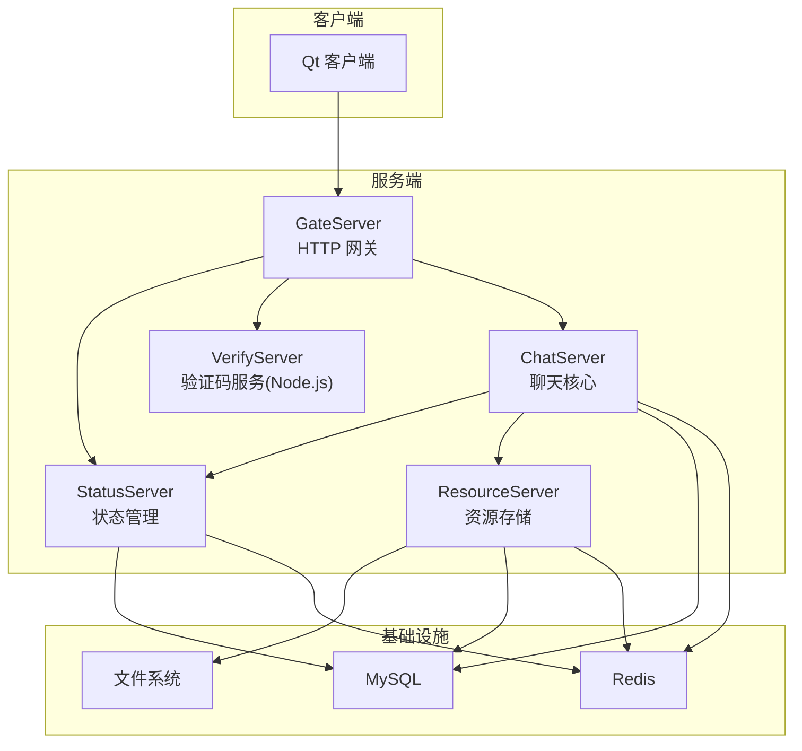
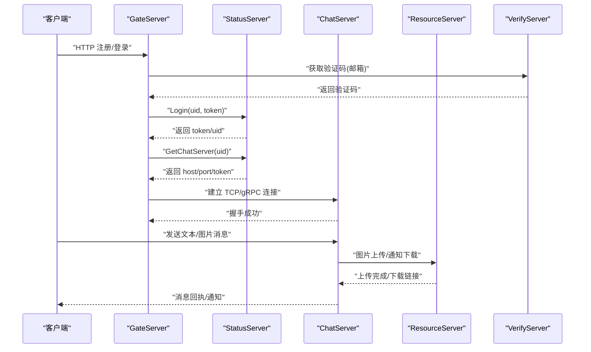
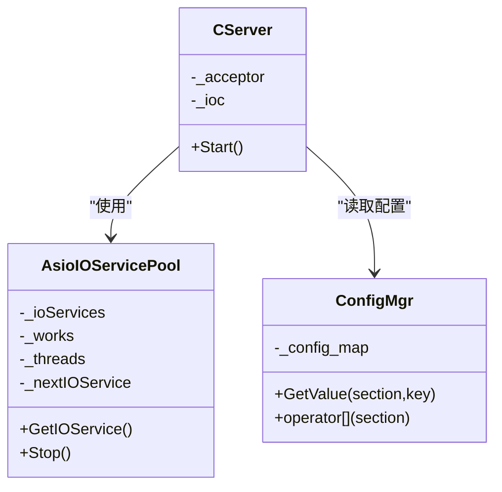
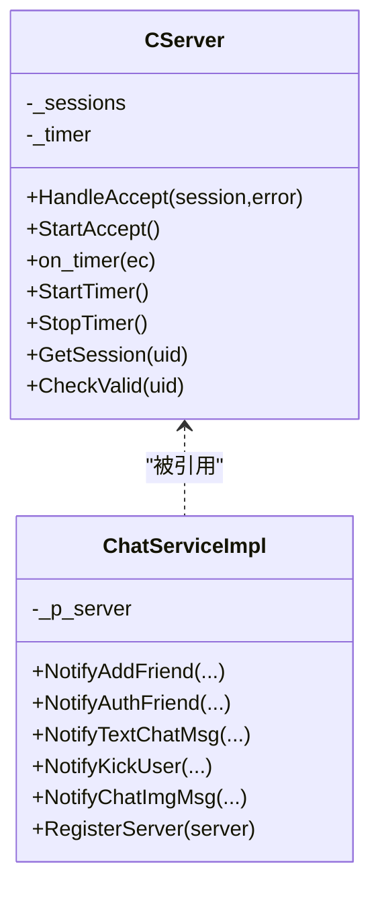
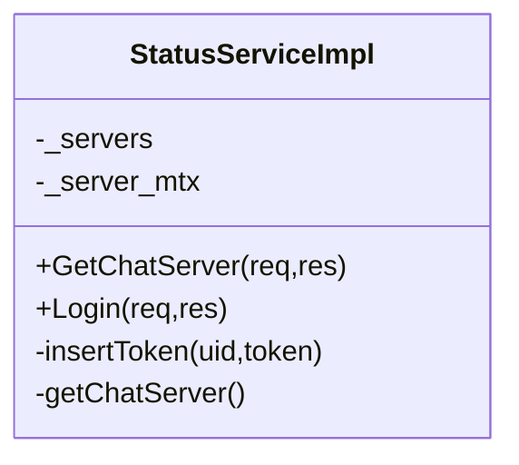
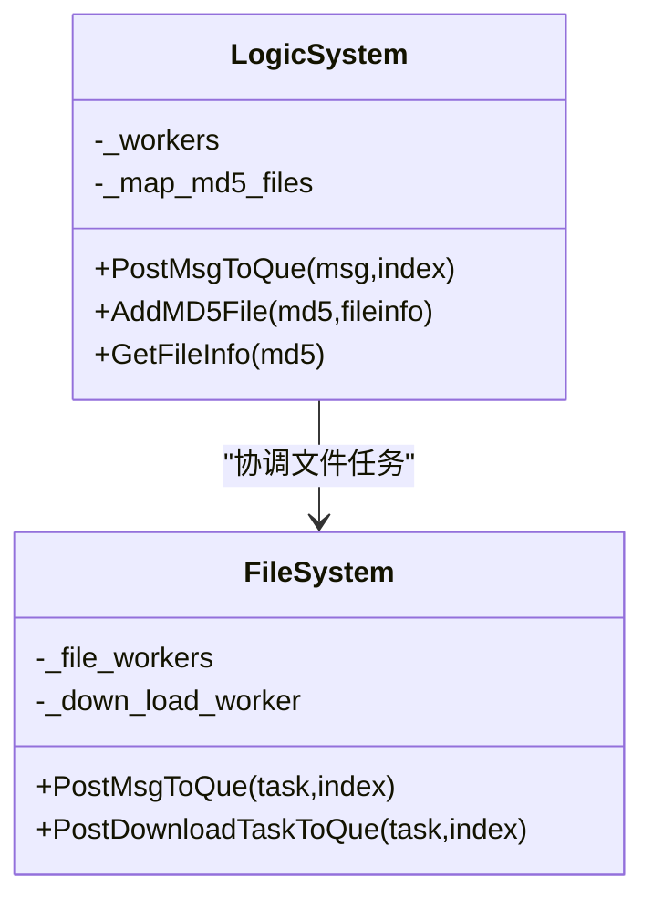
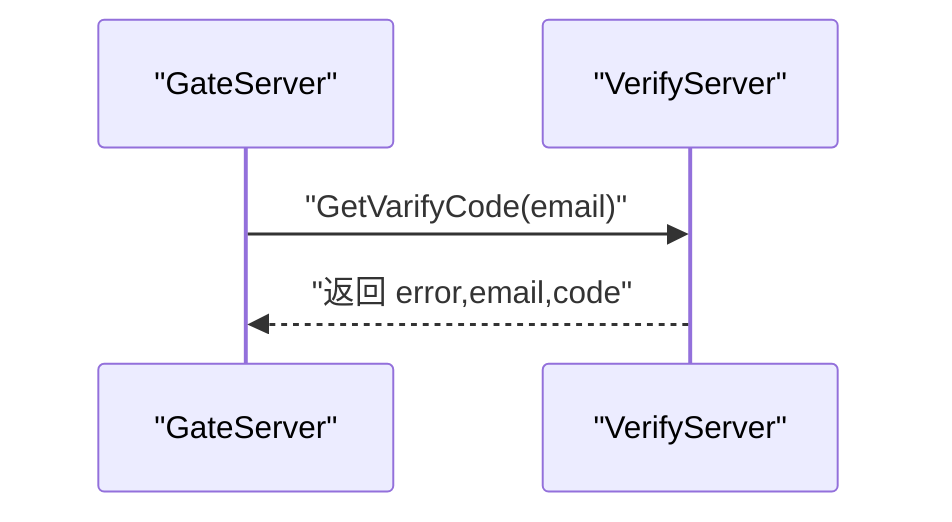
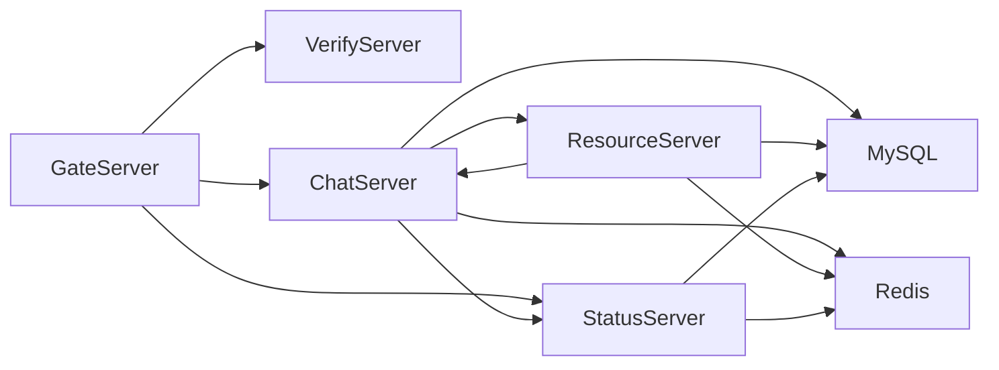
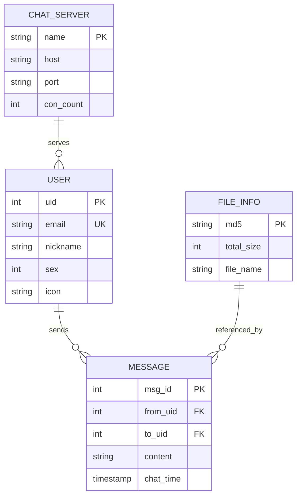

# 服务端开发

<cite>
**本文引用的文件**   
- [README.md](file://README.md)
- [CMakeLists.txt](file://CMakeLists.txt)
- [proto/chat_service/chat.proto](file://proto/chat_service/chat.proto)
- [proto/status_service/status.proto](file://proto/status_service/status.proto)
- [proto/verify_service/verify.proto](file://proto/verify_service/verify.proto)
- [server/GateServer/include/CServer.h](file://server/GateServer/include/CServer.h)
- [server/GateServer/include/AsioIOServicePool.h](file://server/GateServer/include/AsioIOServicePool.h)
- [server/GateServer/include/ConfigMgr.h](file://server/GateServer/include/ConfigMgr.h)
- [server/ChatServer/include/CServer.h](file://server/ChatServer/include/CServer.h)
- [server/ChatServer/include/ConfigMgr.h](file://server/ChatServer/include/ConfigMgr.h)
- [server/ChatServer/include/Singleton.h](file://server/ChatServer/include/Singleton.h)
- [server/ChatServer/include/ChatServiceImpl.h](file://server/ChatServer/include/ChatServiceImpl.h)
- [server/StatusServer/include/StatusServiceImpl.h](file://server/StatusServer/include/StatusServiceImpl.h)
- [server/ResourceServer/include/LogicSystem.h](file://server/ResourceServer/include/LogicSystem.h)
- [server/ResourceServer/include/FileSystem.h](file://server/ResourceServer/include/FileSystem.h)
</cite>

## 目录
1. [简介](#简介)
2. [项目结构](#项目结构)
3. [核心组件](#核心组件)
4. [架构总览](#架构总览)
5. [详细组件分析](#详细组件分析)
6. [依赖关系分析](#依赖关系分析)
7. [性能与并发](#性能与并发)
8. [故障排查指南](#故障排查指南)
9. [结论](#结论)
10. [附录](#附录)

## 简介
本开发文档面向 LLFCChat 微服务后端，系统性阐述微服务架构、服务间通信（gRPC）、数据库与缓存设计、异步 IO 池、单例模式与配置管理、消息协议与序列化、服务配置与部署策略、扩展点设计、并发控制、错误处理与性能优化。读者可据此快速理解 GateServer（HTTP 网关）、ChatServer（聊天核心）、StatusServer（状态管理）、ResourceServer（资源存储）和 VerifyServer（验证码服务）的职责边界与协作方式，并掌握关键实现要点与最佳实践。

## 项目结构
- 顶层 CMake 工程统一构建 server 与 client 子模块，要求使用 Ninja Multi-Config 生成器，禁止源码内构建，并通过 vcpkg 管理依赖。
- 服务端包含五个微服务：GateServer、ChatServer、StatusServer、ResourceServer、VerifyServer（Node.js）。
- gRPC 接口定义位于 proto 目录，按服务划分 chat_service、status_service、verify_service。
- 各服务内部普遍采用 AsioIOServicePool 异步 IO 池、Singleton 单例、ConfigMgr 配置管理器、MysqlMgr/RedisMgr 数据访问层等通用能力。

**图表来源** 
- [CMakeLists.txt:1-34](file://CMakeLists.txt#L1-L34)
- [proto/chat_service/chat.proto:1-105](file://proto/chat_service/chat.proto#L1-L105)
- [proto/status_service/status.proto:1-32](file://proto/status_service/status.proto#L1-L32)
- [proto/verify_service/verify.proto:1-19](file://proto/verify_service/verify.proto#L1-L19)

**章节来源**
- [CMakeLists.txt:1-34](file://CMakeLists.txt#L1-L34)
- [README.md:1-112](file://README.md#L1-L112)

## 核心组件
- AsioIOServicePool：基于 boost::asio 的 io_context 池，线程安全地轮询分配，避免单点阻塞，提升并发吞吐。
- Singleton：线程安全的共享指针单例模板，配合 call_once 保证全局唯一实例。
- ConfigMgr：基于 Boost.PropertyTree 的 INI 配置解析与访问封装，提供 section/key 两级访问。
- gRPC 服务实现：ChatServiceImpl、StatusServiceImpl 分别暴露聊天与状态管理能力；VerifyService 由 Node.js 实现。
- 业务子系统：
  - GateServer：HTTP 入口，鉴权、路由、转发到后端服务。
  - ChatServer：TCP/gRPC 双栈，会话管理、消息路由、好友关系、踢人、图片通知。
  - StatusServer：用户登录态、Token 管理、ChatServer 路由发现。
  - ResourceServer：文件上传/下载、断点续传、MD5 校验、任务队列化。

**章节来源**
- [server/GateServer/include/AsioIOServicePool.h:1-28](file://server/GateServer/include/AsioIOServicePool.h#L1-L28)
- [server/ChatServer/include/Singleton.h:1-33](file://server/ChatServer/include/Singleton.h#L1-L33)
- [server/ChatServer/include/ConfigMgr.h:1-84](file://server/ChatServer/include/ConfigMgr.h#L1-L84)
- [server/GateServer/include/ConfigMgr.h:1-84](file://server/GateServer/include/ConfigMgr.h#L1-L84)
- [server/ChatServer/include/ChatServiceImpl.h:1-55](file://server/ChatServer/include/ChatServiceImpl.h#L1-L55)
- [server/StatusServer/include/StatusServiceImpl.h:1-52](file://server/StatusServer/include/StatusServiceImpl.h#L1-L52)

## 架构总览
LLFCChat 采用“网关 + 领域服务”的微服务架构：
- GateServer 作为 HTTP 网关，负责外部请求接入、鉴权、参数校验与路由分发。
- StatusServer 维护用户在线状态、Token 与 ChatServer 路由信息，提供 GetChatServer/Login 能力。
- ChatServer 提供聊天核心能力，包括好友申请/认证、文本消息推送、踢人、图片消息通知等。
- ResourceServer 提供文件上传/下载、断点续传、分片与进度上报，通过 gRPC 与 ChatServer 协作。
- VerifyServer（Node.js）提供邮箱验证码生成与发送，供 GateServer 调用。

**图表来源** 
- [proto/status_service/status.proto:1-32](file://proto/status_service/status.proto#L1-L32)
- [proto/chat_service/chat.proto:1-105](file://proto/chat_service/chat.proto#L1-L105)
- [proto/verify_service/verify.proto:1-19](file://proto/verify_service/verify.proto#L1-L19)

## 详细组件分析

### GateServer（HTTP 网关）
- 职责：对外暴露 HTTP API，进行鉴权、限流、参数校验；根据 StatusServer 返回的 ChatServer 地址转发或建立长连接；调用 VerifyServer 完成验证码流程。
- 网络模型：基于 Boost.Asio 的 acceptor 监听端口，结合 AsioIOServicePool 分配 io_context，提高并发处理能力。
- 配置管理：通过 ConfigMgr 读取 INI 配置文件，支持多段 key-value 访问。
- 关键类：
  - CServer：TCP/HTTP 监听与接受连接的服务器抽象。
  - AsioIOServicePool：多线程 io_context 池，轮询分配。
  - ConfigMgr：INI 配置加载与访问。

**图表来源** 
- [server/GateServer/include/CServer.h:1-16](file://server/GateServer/include/CServer.h#L1-L16)
- [server/GateServer/include/AsioIOServicePool.h:1-28](file://server/GateServer/include/AsioIOServicePool.h#L1-L28)
- [server/GateServer/include/ConfigMgr.h:1-84](file://server/GateServer/include/ConfigMgr.h#L1-L84)

**章节来源**
- [server/GateServer/include/CServer.h:1-16](file://server/GateServer/include/CServer.h#L1-L16)
- [server/GateServer/include/AsioIOServicePool.h:1-28](file://server/GateServer/include/AsioIOServicePool.h#L1-L28)
- [server/GateServer/include/ConfigMgr.h:1-84](file://server/GateServer/include/ConfigMgr.h#L1-L84)

### ChatServer（聊天核心）
- 职责：维护用户会话（CSession），处理好友申请/认证、文本消息推送、踢人、图片消息通知；与 StatusServer/ResourceServer 交互。
- 网络模型：TCP 长连接 + gRPC 服务暴露；心跳检测、会话清理、定时器管理。
- 关键类：
  - CServer：会话管理与定时任务（心跳、超时清理）。
  - ChatServiceImpl：gRPC 服务实现，接收来自其他服务的 RPC 调用。
  - ConfigMgr/Singleton：配置与单例管理。

**图表来源** 
- [server/ChatServer/include/CServer.h:1-33](file://server/ChatServer/include/CServer.h#L1-L33)
- [server/ChatServer/include/ChatServiceImpl.h:1-55](file://server/ChatServer/include/ChatServiceImpl.h#L1-L55)

**章节来源**
- [server/ChatServer/include/CServer.h:1-33](file://server/ChatServer/include/CServer.h#L1-L33)
- [server/ChatServer/include/ChatServiceImpl.h:1-55](file://server/ChatServer/include/ChatServiceImpl.h#L1-L55)

### StatusServer（状态管理）
- 职责：维护 ChatServer 实例列表与负载信息，提供 GetChatServer(uid) 路由查询；管理 Login 登录态与 Token。
- 关键类：
  - StatusServiceImpl：gRPC 服务实现，内部维护 _servers 表与互斥锁，确保并发安全。

**图表来源** 
- [server/StatusServer/include/StatusServiceImpl.h:1-52](file://server/StatusServer/include/StatusServiceImpl.h#L1-L52)

**章节来源**
- [server/StatusServer/include/StatusServiceImpl.h:1-52](file://server/StatusServer/include/StatusServiceImpl.h#L1-L52)

### ResourceServer（资源存储）
- 职责：文件上传/下载、断点续传、MD5 校验、任务队列化；通过 gRPC 与 ChatServer 协作通知图片下载。
- 关键类：
  - LogicSystem：逻辑任务队列与 MD5 文件索引，Worker 线程池处理。
  - FileSystem：文件 I/O 与下载任务队列，FileWorker/DownloadWorker 并行处理。

**图表来源** 
- [server/ResourceServer/include/LogicSystem.h:1-33](file://server/ResourceServer/include/LogicSystem.h#L1-L33)
- [server/ResourceServer/include/FileSystem.h:1-21](file://server/ResourceServer/include/FileSystem.h#L1-L21)

**章节来源**
- [server/ResourceServer/include/LogicSystem.h:1-33](file://server/ResourceServer/include/LogicSystem.h#L1-L33)
- [server/ResourceServer/include/FileSystem.h:1-21](file://server/ResourceServer/include/FileSystem.h#L1-L21)

### VerifyServer（验证码服务，Node.js）
- 职责：生成并发送邮箱验证码，供 GateServer 调用。
- 接口：GetVarifyCode(email) -> code。

**图表来源** 
- [proto/verify_service/verify.proto:1-19](file://proto/verify_service/verify.proto#L1-L19)

**章节来源**
- [proto/verify_service/verify.proto:1-19](file://proto/verify_service/verify.proto#L1-L19)

## 依赖关系分析
- 服务间依赖：
  - GateServer 依赖 StatusServer（路由/登录）、VerifyServer（验证码）、ChatServer（会话）。
  - ChatServer 依赖 StatusServer（路由/登录）、ResourceServer（图片通知）。
  - ResourceServer 依赖 ChatServer（回调通知）。
- 数据依赖：
  - MySQL：持久化用户、消息、文件元数据。
  - Redis：缓存 Token、在线状态、分布式锁、热点数据。
- 构建依赖：
  - CMake 统一构建，vcpkg 管理第三方库，gRPC 代码生成在 cmake/GrpcCodegen.cmake 中集成。

**图表来源** 
- [proto/chat_service/chat.proto:1-105](file://proto/chat_service/chat.proto#L1-L105)
- [proto/status_service/status.proto:1-32](file://proto/status_service/status.proto#L1-L32)
- [proto/verify_service/verify.proto:1-19](file://proto/verify_service/verify.proto#L1-L19)

**章节来源**
- [CMakeLists.txt:1-34](file://CMakeLists.txt#L1-L34)

## 性能与并发
- AsioIOServicePool：
  - 通过多个 io_context 与线程轮询分配，降低锁竞争，提升高并发下的网络吞吐。
  - 建议根据 CPU 核数设置线程数，避免过度创建线程导致上下文切换开销。
- 会话与定时器：
  - ChatServer 使用 steady_timer 进行心跳检测与超时清理，需合理设置超时阈值，避免误杀活跃连接。
- 任务队列与 Worker：
  - ResourceServer 的 LogicSystem/FileSystem 将 I/O 与计算任务入队，由独立 Worker 线程处理，避免阻塞网络线程。
- 配置与单例：
  - ConfigMgr 启动时加载配置，避免重复解析；Singleton 使用 call_once 保证线程安全初始化。
- 错误处理：
  - gRPC 调用应设置超时与重试策略；网络异常需记录日志并回退到降级路径（如本地缓存）。
- 数据库与缓存：
  - 热点数据优先走 Redis，减少 MySQL 压力；写操作注意事务与一致性。

[本节为通用指导，不直接分析具体文件]

## 故障排查指南
- 常见问题定位：
  - 连接失败：检查 GateServer/ChatServer 端口与防火墙；确认 StatusServer 返回的 host/port 正确。
  - 登录失败：核对 Token 生成与校验逻辑；检查 Redis 中 Token 是否过期或被覆盖。
  - 消息未送达：查看 ChatServer 会话表是否存在目标 uid 的 session；检查心跳与超时清理策略。
  - 文件上传失败：确认 ResourceServer 的 MD5 校验与分片续传逻辑；检查文件系统权限与磁盘空间。
- 调试建议：
  - 增加关键路径日志（请求入口、RPC 调用、DB 操作、Worker 任务）。
  - 使用性能剖析工具（perf/Visual Studio Profiler）定位热点函数。
  - 对 gRPC 启用健康检查与链路追踪，便于跨服务问题定位。

[本节为通用指导，不直接分析具体文件]

## 结论
LLFCChat 微服务后端以清晰的职责划分与标准化的 gRPC 接口实现了可扩展、高性能的聊天系统。通过 AsioIOServicePool、Singleton、ConfigMgr 等基础组件，提升了系统的并发能力与可维护性。建议在后续迭代中完善监控告警、弹性伸缩与灰度发布机制，进一步提升稳定性与可用性。

[本节为总结，不直接分析具体文件]

## 附录

### gRPC 接口与消息协议
- ChatService：
  - NotifyAddFriend/AddFriendReq/Rsp：好友申请通知。
  - NotifyAuthFriend/AuthFriendReq/Rsp：好友认证消息。
  - NotifyTextChatMsg/TextChatMsgReq/Rsp：文本消息推送。
  - NotifyKickUser/KickUserReq/Rsp：踢人通知。
  - NotifyChatImgMsg/NotifyChatImgReq/Rsp：图片消息通知。
- StatusService：
  - GetChatServer/GetChatServerReq/Rsp：根据 uid 获取 ChatServer 地址与 token。
  - Login/LoginReq/Rsp：用户登录与 token 管理。
- VerifyService：
  - GetVarifyCode/GetVarifyReq/Rsp：邮箱验证码生成。

**图表来源** 
- [proto/chat_service/chat.proto:1-105](file://proto/chat_service/chat.proto#L1-L105)
- [proto/status_service/status.proto:1-32](file://proto/status_service/status.proto#L1-L32)
- [proto/verify_service/verify.proto:1-19](file://proto/verify_service/verify.proto#L1-L19)

**章节来源**
- [proto/chat_service/chat.proto:1-105](file://proto/chat_service/chat.proto#L1-L105)
- [proto/status_service/status.proto:1-32](file://proto/status_service/status.proto#L1-L32)
- [proto/verify_service/verify.proto:1-19](file://proto/verify_service/verify.proto#L1-L19)

### 配置管理示例
- INI 配置段与键值：
  - [server]：服务名称、端口、线程数。
  - [database]：MySQL 连接串、最大连接数。
  - [cache]：Redis 地址、密码、超时时间。
  - [grpc]：gRPC 监听端口、TLS 证书路径。
- 访问方式：
  - ConfigMgr::Inst()["section"]["key"] 或 GetValue("section","key")。

[本节为通用指导，不直接分析具体文件]

### 部署策略与扩展点
- 部署策略：
  - 容器化部署（Docker/Kubernetes），每个服务独立镜像，水平扩展 ChatServer/ResourceServer。
  - 配置中心化管理（Nacos/Consul），动态更新配置。
- 扩展点：
  - 新增 gRPC 服务：在 proto 中定义接口，生成代码后实现 Service。
  - 新增 Worker：在 LogicSystem/FileSystem 中扩展任务类型与处理逻辑。
  - 插件化鉴权：在 GateServer 中插入中间件链，支持多种认证方式。

[本节为通用指导，不直接分析具体文件]