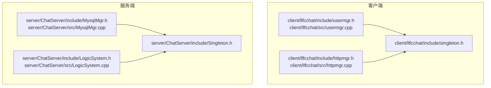
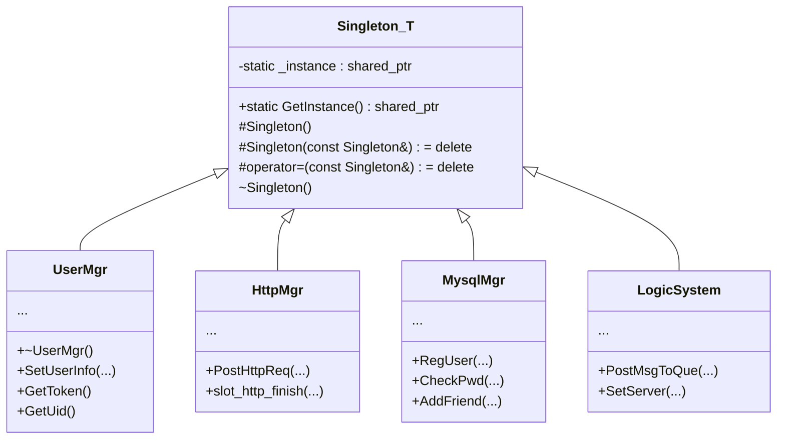
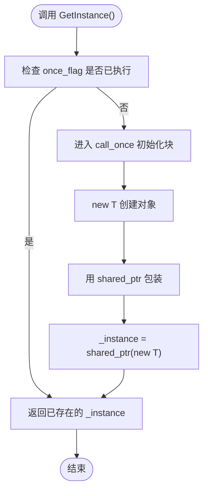
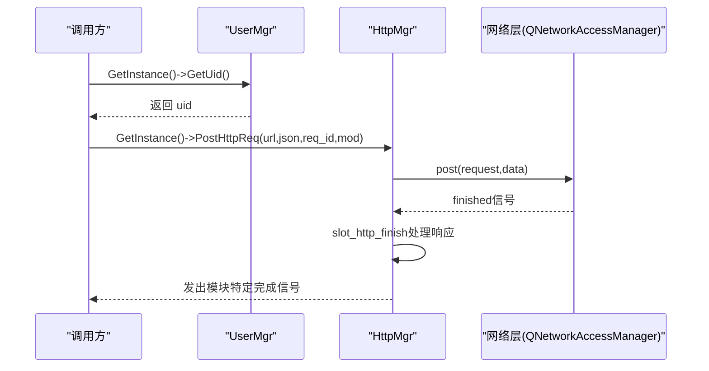
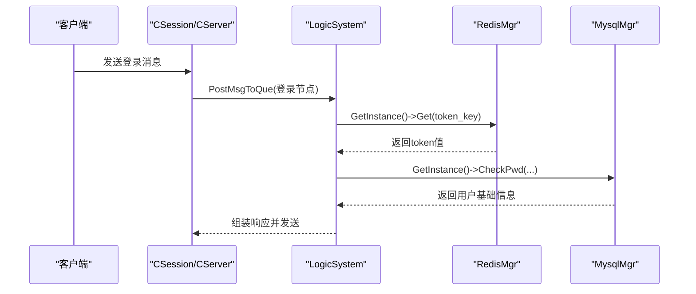
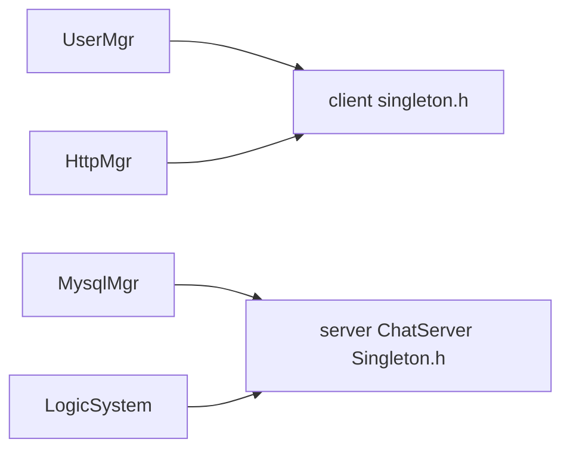

# 单例模式实现

<cite>
**本文引用的文件**
- [client/llfcchat/include/singleton.h](file://client/llfcchat/include/singleton.h)
- [server/ChatServer/include/Singleton.h](file://server/ChatServer/include/Singleton.h)
- [server/GateServer/include/Singleton.h](file://server/GateServer/include/Singleton.h)
- [server/ResourceServer/include/Singleton.h](file://server/ResourceServer/include/Singleton.h)
- [server/StatusServer/include/Singleton.h](file://server/StatusServer/include/Singleton.h)
- [client/llfcchat/include/usermgr.h](file://client/llfcchat/include/usermgr.h)
- [client/llfcchat/src/usermgr.cpp](file://client/llfcchat/src/usermgr.cpp)
- [client/llfcchat/include/httpmgr.h](file://client/llfcchat/include/httpmgr.h)
- [client/llfcchat/src/httpmgr.cpp](file://client/llfcchat/src/httpmgr.cpp)
- [server/ChatServer/include/MysqlMgr.h](file://server/ChatServer/include/MysqlMgr.h)
- [server/ChatServer/src/MysqlMgr.cpp](file://server/ChatServer/src/MysqlMgr.cpp)
- [server/ChatServer/include/LogicSystem.h](file://server/ChatServer/include/LogicSystem.h)
- [server/ChatServer/src/LogicSystem.cpp](file://server/ChatServer/src/LogicSystem.cpp)
</cite>

## 目录
1. [简介](#简介)
2. [项目结构](#项目结构)
3. [核心组件](#核心组件)
4. [架构总览](#架构总览)
5. [详细组件分析](#详细组件分析)
6. [依赖关系分析](#依赖关系分析)
7. [性能考虑](#性能考虑)
8. [故障排查指南](#故障排查指南)
9. [结论](#结论)
10. [附录：使用示例与最佳实践](#附录使用示例与最佳实践)

## 简介
本文件围绕 LLFCChat 项目的单例模式实现进行系统化文档说明，重点解释模板类 Singleton 的设计原理与线程安全的懒加载机制、std::call_once 的使用方式、shared_ptr 智能指针管理策略，以及构造函数保护、拷贝构造和赋值操作符的禁用策略。同时给出 GetInstance() 方法的实现细节（静态 once_flag 与内存管理），并提供在客户端与服务端各服务中继承和使用单例的具体示例、最佳实践、性能考量与常见陷阱解决方案。

## 项目结构
LLFCChat 在客户端与服务端各自包含独立的 Singleton 模板头文件，并在多个管理器/系统类中以“继承 + friend”的方式复用该模板，形成统一的单例获取入口。

图表来源
- [client/llfcchat/include/singleton.h:1-46](file://client/llfcchat/include/singleton.h#L1-L46)
- [client/llfcchat/include/usermgr.h:12-13](file://client/llfcchat/include/usermgr.h#L12-L13)
- [client/llfcchat/include/httpmgr.h:11-12](file://client/llfcchat/include/httpmgr.h#L11-L12)
- [server/ChatServer/include/Singleton.h:1-33](file://server/ChatServer/include/Singleton.h#L1-L33)
- [server/ChatServer/include/MysqlMgr.h:8-10](file://server/ChatServer/include/MysqlMgr.h#L8-L10)
- [server/ChatServer/include/LogicSystem.h:17-19](file://server/ChatServer/include/LogicSystem.h#L17-L19)

章节来源
- [client/llfcchat/include/singleton.h:1-46](file://client/llfcchat/include/singleton.h#L1-L46)
- [server/ChatServer/include/Singleton.h:1-33](file://server/ChatServer/include/Singleton.h#L1-L33)

## 核心组件
- 模板类 Singleton<T>
  - 提供线程安全的懒加载实例获取接口 GetInstance()
  - 使用 static std::once_flag 与 std::call_once 保证仅初始化一次
  - 通过 static std::shared_ptr<T> _instance 管理对象生命周期
  - 将构造函数设为 protected，并删除拷贝构造与赋值操作符，防止外部构造与复制
- 典型使用者
  - 客户端：UserMgr、HttpMgr 等
  - 服务端：MysqlMgr、LogicSystem 等

章节来源
- [client/llfcchat/include/singleton.h:18-44](file://client/llfcchat/include/singleton.h#L18-L44)
- [server/ChatServer/include/Singleton.h:6-32](file://server/ChatServer/include/Singleton.h#L6-L32)

## 架构总览
下图展示单例模板与具体服务类的继承关系及调用路径，体现“统一入口、全局唯一、智能指针托管”的整体设计。

图表来源
- [client/llfcchat/include/singleton.h:18-44](file://client/llfcchat/include/singleton.h#L18-L44)
- [client/llfcchat/include/usermgr.h:12-13](file://client/llfcchat/include/usermgr.h#L12-L13)
- [client/llfcchat/include/httpmgr.h:11-12](file://client/llfcchat/include/httpmgr.h#L11-L12)
- [server/ChatServer/include/MysqlMgr.h:8-10](file://server/ChatServer/include/MysqlMgr.h#L8-L10)
- [server/ChatServer/include/LogicSystem.h:17-19](file://server/ChatServer/include/LogicSystem.h#L17-L19)

## 详细组件分析

### 模板类 Singleton<T> 设计与实现要点
- 线程安全的懒加载
  - 使用 static std::once_flag s_flag 与 std::call_once 确保初始化代码块仅执行一次
  - 首次调用时通过 new T 创建对象并由 shared_ptr 接管，后续调用直接返回已存在实例
- 内存管理
  - 使用 static std::shared_ptr<T> _instance 作为唯一持有者，析构由引用计数归零自动释放
  - 避免裸指针与手动 delete，降低资源泄漏风险
- 访问控制
  - 构造函数 protected，禁止外部直接构造
  - 删除拷贝构造与赋值操作符，防止意外复制或赋值导致多实例或悬挂指针
- 调试辅助
  - PrintAddress() 输出当前实例地址，便于定位问题

图表来源
- [client/llfcchat/include/singleton.h:27-34](file://client/llfcchat/include/singleton.h#L27-L34)
- [server/ChatServer/include/Singleton.h:15-22](file://server/ChatServer/include/Singleton.h#L15-L22)

章节来源
- [client/llfcchat/include/singleton.h:18-44](file://client/llfcchat/include/singleton.h#L18-L44)
- [server/ChatServer/include/Singleton.h:6-32](file://server/ChatServer/include/Singleton.h#L6-L32)

### 客户端单例使用示例：UserMgr 与 HttpMgr
- UserMgr
  - 继承自 QObject 与 Singleton<UserMgr>，并通过 friend class Singleton<UserMgr> 允许模板访问私有构造
  - 内部维护用户信息、好友列表、聊天会话等状态，方法内使用互斥锁保证线程安全
- HttpMgr
  - 继承自 QObject 与 Singleton<HttpMgr>，封装 HTTP 请求发送与响应回调
  - 使用 shared_from_this() 捕获自身以在异步回调中安全访问

图表来源
- [client/llfcchat/include/usermgr.h:12-13](file://client/llfcchat/include/usermgr.h#L12-L13)
- [client/llfcchat/include/httpmgr.h:11-12](file://client/llfcchat/include/httpmgr.h#L11-L12)
- [client/llfcchat/src/httpmgr.cpp:17-37](file://client/llfcchat/src/httpmgr.cpp#L17-L37)

章节来源
- [client/llfcchat/include/usermgr.h:12-13](file://client/llfcchat/include/usermgr.h#L12-L13)
- [client/llfcchat/src/usermgr.cpp:170-173](file://client/llfcchat/src/usermgr.cpp#L170-L173)
- [client/llfcchat/include/httpmgr.h:11-12](file://client/llfcchat/include/httpmgr.h#L11-L12)
- [client/llfcchat/src/httpmgr.cpp:17-37](file://client/llfcchat/src/httpmgr.cpp#L17-L37)

### 服务端单例使用示例：MysqlMgr 与 LogicSystem
- MysqlMgr
  - 继承 Singleton<MysqlMgr>，对外暴露数据库相关接口（注册、校验、好友申请、聊天消息等）
  - 内部通过 MysqlDao 封装具体数据访问逻辑
- LogicSystem
  - 继承 Singleton<LogicSystem>，负责消息路由与业务处理
  - 通过 PostMsgToQue 入队，DealMsg 消费队列；在登录流程中调用 RedisMgr::GetInstance() 验证 token

图表来源
- [server/ChatServer/include/LogicSystem.h:17-19](file://server/ChatServer/include/LogicSystem.h#L17-L19)
- [server/ChatServer/src/LogicSystem.cpp:134](file://server/ChatServer/src/LogicSystem.cpp#L134)
- [server/ChatServer/include/MysqlMgr.h:8-10](file://server/ChatServer/include/MysqlMgr.h#L8-L10)

章节来源
- [server/ChatServer/include/MysqlMgr.h:8-10](file://server/ChatServer/include/MysqlMgr.h#L8-L10)
- [server/ChatServer/src/MysqlMgr.cpp:21-22](file://server/ChatServer/src/MysqlMgr.cpp#L21-L22)
- [server/ChatServer/include/LogicSystem.h:17-19](file://server/ChatServer/include/LogicSystem.h#L17-L19)
- [server/ChatServer/src/LogicSystem.cpp:134](file://server/ChatServer/src/LogicSystem.cpp#L134)

## 依赖关系分析
- 模板依赖
  - 所有单例使用者均依赖对应平台的 Singleton 模板头文件
- 运行时依赖
  - 客户端依赖 Qt 框架（QObject、QNetworkAccessManager 等）
  - 服务端依赖 gRPC、MySQL、Redis 等基础设施
- 耦合度
  - 通过单例模板解耦实例化过程，服务间通过 GetInstance() 获取共享状态，降低显式传递依赖

图表来源
- [client/llfcchat/include/singleton.h:1-46](file://client/llfcchat/include/singleton.h#L1-L46)
- [server/ChatServer/include/Singleton.h:1-33](file://server/ChatServer/include/Singleton.h#L1-L33)

章节来源
- [client/llfcchat/include/singleton.h:1-46](file://client/llfcchat/include/singleton.h#L1-L46)
- [server/ChatServer/include/Singleton.h:1-33](file://server/ChatServer/include/Singleton.h#L1-L33)

## 性能考虑
- 初始化开销
  - 首次 GetInstance() 会触发 new T 与 shared_ptr 构造，属于一次性成本
  - 后续调用仅读取静态变量，几乎无额外开销
- 并发性能
  - std::call_once 在首次后不再产生同步开销，适合高频调用场景
- 内存占用
  - 单例对象常驻进程内存，需关注其生命周期与资源清理
- 建议
  - 对大型对象可考虑按需初始化或延迟加载
  - 避免在单例中持有大量临时大对象，必要时使用缓存与淘汰策略

[本节为通用指导，不直接分析具体文件]

## 故障排查指南
- 常见问题
  - 重复构造：若未正确删除拷贝构造/赋值操作符，可能导致多实例
  - 线程竞争：未在 GetInstance() 外自行加锁，但模板内部已通过 call_once 保证
  - 资源泄漏：未使用 shared_ptr 而手动管理内存，易造成悬垂指针或重复释放
- 排查步骤
  - 确认使用者类已将 Singleton<T> 声明为友元，以便访问私有构造
  - 检查 GetInstance() 调用路径，确保仅在需要时获取
  - 打印实例地址（PrintAddress）判断是否为同一实例
  - 审查析构顺序，避免在程序退出时出现交叉析构

章节来源
- [client/llfcchat/include/singleton.h:21-23](file://client/llfcchat/include/singleton.h#L21-L23)
- [client/llfcchat/include/singleton.h:35-40](file://client/llfcchat/include/singleton.h#L35-L40)
- [server/ChatServer/include/Singleton.h:9-11](file://server/ChatServer/include/Singleton.h#L9-L11)
- [server/ChatServer/include/Singleton.h:23-28](file://server/ChatServer/include/Singleton.h#L23-L28)

## 结论
LLFCChat 的单例模式实现基于模板类 Singleton<T>，通过 std::call_once 与 shared_ptr 实现了线程安全、懒加载且资源安全的单例获取与管理。客户端与服务端广泛采用该模式统一管理关键服务（如用户管理、HTTP 管理、数据库管理、逻辑系统等）。遵循本文的最佳实践与注意事项，可有效避免常见陷阱，提升系统的稳定性与可维护性。

[本节为总结性内容，不直接分析具体文件]

## 附录：使用示例与最佳实践

### 如何在服务中继承并使用单例
- 客户端
  - UserMgr：继承 QObject 与 Singleton<UserMgr>，并在类内声明 friend class Singleton<UserMgr>，私有构造由模板访问
  - HttpMgr：继承 QObject 与 Singleton<HttpMgr>，在异步回调中使用 shared_from_this() 安全访问自身
- 服务端
  - MysqlMgr：继承 Singleton<MysqlMgr>，对外暴露数据库接口
  - LogicSystem：继承 Singleton<LogicSystem>，在业务处理中通过 GetInstance() 获取其他单例（如 RedisMgr）

章节来源
- [client/llfcchat/include/usermgr.h:12-13](file://client/llfcchat/include/usermgr.h#L12-L13)
- [client/llfcchat/include/httpmgr.h:11-12](file://client/llfcchat/include/httpmgr.h#L11-L12)
- [server/ChatServer/include/MysqlMgr.h:8-10](file://server/ChatServer/include/MysqlMgr.h#L8-L10)
- [server/ChatServer/include/LogicSystem.h:17-19](file://server/ChatServer/include/LogicSystem.h#L17-L19)

### 最佳实践
- 始终将拷贝构造与赋值操作符删除，避免意外复制
- 将构造函数设为 protected，并通过 friend 授权模板访问
- 使用 shared_ptr 管理生命周期，避免手动 delete
- 在多线程环境中依赖 std::call_once，不要自行加锁
- 谨慎在单例中持有大对象或频繁变更的数据，必要时引入缓存与锁

[本节为通用指导，不直接分析具体文件]

### 常见陷阱与解决方案
- 陷阱：在 Qt 对象模型下错误地复制单例对象
  - 解决：删除拷贝构造/赋值，使用指针或引用访问
- 陷阱：在析构阶段访问已销毁的单例
  - 解决：避免在析构链中依赖其他单例，或使用 RAII 与有序初始化
- 陷阱：跨模块循环依赖导致初始化顺序不确定
  - 解决：通过接口抽象与依赖注入减少强耦合，必要时延迟初始化

[本节为通用指导，不直接分析具体文件]