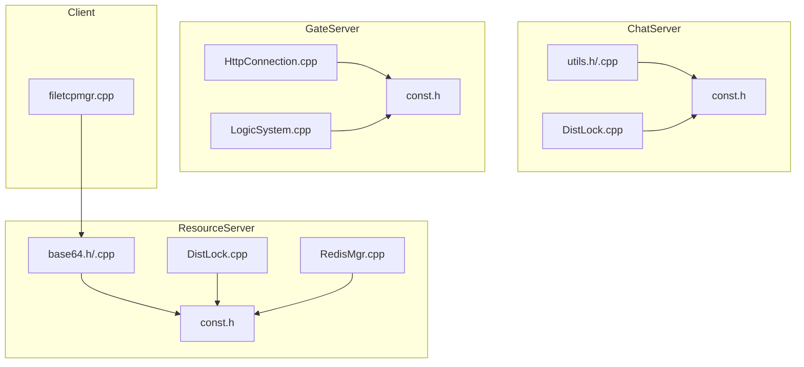
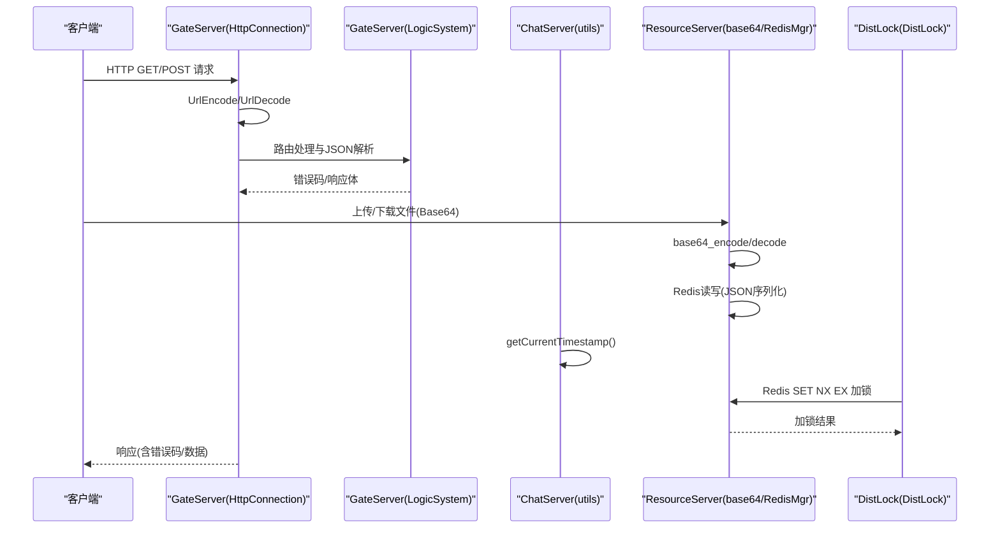
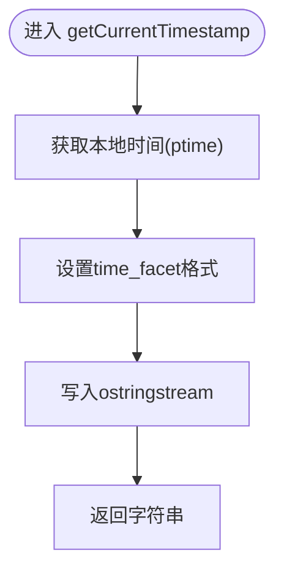
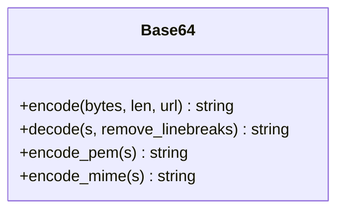
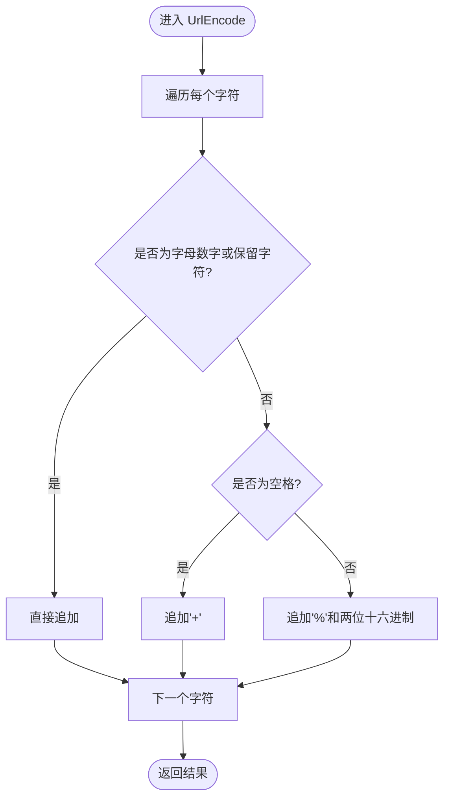
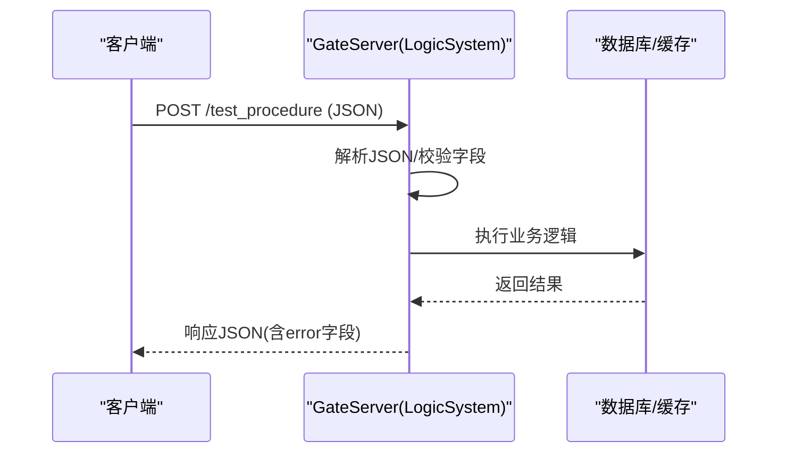
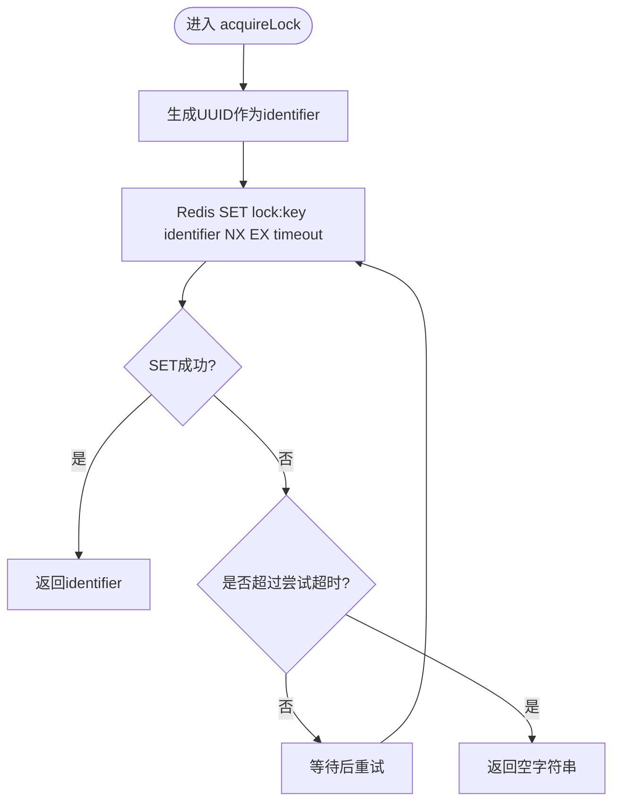
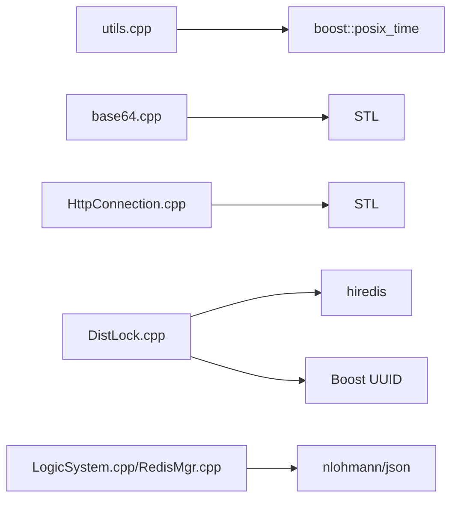

# 工具函数库

<cite>
**本文引用的文件**   
- [utils.h](file://server/ChatServer/include/utils.h)
- [utils.cpp](file://server/ChatServer/src/utils.cpp)
- [base64.h](file://server/ResourceServer/include/base64.h)
- [base64.cpp](file://server/ResourceServer/src/base64.cpp)
- [HttpConnection.cpp](file://server/GateServer/src/HttpConnection.cpp)
- [const.h（ChatServer）](file://server/ChatServer/include/const.h)
- [const.h（GateServer）](file://server/GateServer/include/const.h)
- [const.h（StatusServer）](file://server/StatusServer/include/const.h)
- [DistLock.cpp（ChatServer）](file://server/ChatServer/src/DistLock.cpp)
- [RedisMgr.cpp（ResourceServer）](file://server/ResourceServer/src/RedisMgr.cpp)
- [LogicSystem.cpp（GateServer）](file://server/GateServer/src/LogicSystem.cpp)
- [filetcpmgr.cpp（客户端）](file://client/llfcchat/src/filetcpmgr.cpp)
</cite>

## 目录
1. [简介](#简介)
2. [项目结构](#项目结构)
3. [核心组件](#核心组件)
4. [架构总览](#架构总览)
5. [详细组件分析](#详细组件分析)
6. [依赖关系分析](#依赖关系分析)
7. [性能考量](#性能考量)
8. [故障排查指南](#故障排查指南)
9. [结论](#结论)
10. [附录](#附录)

## 简介
本文件为 LLFCChat 项目的工具函数库提供系统化文档，聚焦于服务器端与客户端中广泛使用的实用能力：时间戳格式化、Base64 编解码、URL 编码/解码、JSON 数据处理、分布式锁与 UUID 生成等。文档按“功能—参数—返回值—示例—注意事项”的结构组织，并给出流程图与时序图帮助理解调用链与数据流。同时总结错误码定义、异常处理机制与性能优化建议，便于在业务场景中快速复用与扩展。

## 项目结构
本项目将通用工具能力分散在各服务模块中，主要涉及以下位置：
- 时间工具：server/ChatServer 的 utils.h/.cpp
- Base64 编解码：server/ResourceServer 的 base64.h/.cpp
- URL 编解码：server/GateServer 的 HttpConnection.cpp
- 错误码与常量：各服务的 const.h
- 分布式锁与 UUID：各服务的 DistLock.cpp
- JSON 解析与序列化：GateServer/LogicSystem.cpp、ResourceServer/RedisMgr.cpp
- 客户端 Base64 使用：client/llfcchat 的 filetcpmgr.cpp

图表来源
- [utils.h:1-7](file://server/ChatServer/include/utils.h#L1-L7)
- [utils.cpp:1-15](file://server/ChatServer/src/utils.cpp#L1-L15)
- [base64.h:1-36](file://server/ResourceServer/include/base64.h#L1-L36)
- [base64.cpp:1-197](file://server/ResourceServer/src/base64.cpp#L1-L197)
- [HttpConnection.cpp:49-104](file://server/GateServer/src/HttpConnection.cpp#L49-L104)
- [const.h（ChatServer）:1-104](file://server/ChatServer/include/const.h#L1-L104)
- [const.h（GateServer）:1-65](file://server/GateServer/include/const.h#L1-L65)
- [const.h（StatusServer）:1-75](file://server/StatusServer/include/const.h#L1-L75)
- [DistLock.cpp（ChatServer）:1-37](file://server/ChatServer/src/DistLock.cpp#L1-L37)
- [RedisMgr.cpp（ResourceServer）:537-562](file://server/ResourceServer/src/RedisMgr.cpp#L537-L562)
- [LogicSystem.cpp（GateServer）:37-74](file://server/GateServer/src/LogicSystem.cpp#L37-L74)
- [filetcpmgr.cpp（客户端）:362-404](file://client/llfcchat/src/filetcpmgr.cpp#L362-L404)

章节来源
- [utils.h:1-7](file://server/ChatServer/include/utils.h#L1-L7)
- [utils.cpp:1-15](file://server/ChatServer/src/utils.cpp#L1-L15)
- [base64.h:1-36](file://server/ResourceServer/include/base64.h#L1-L36)
- [base64.cpp:1-197](file://server/ResourceServer/src/base64.cpp#L1-L197)
- [HttpConnection.cpp:49-104](file://server/GateServer/src/HttpConnection.cpp#L49-L104)
- [const.h（ChatServer）:1-104](file://server/ChatServer/include/const.h#L1-L104)
- [const.h（GateServer）:1-65](file://server/GateServer/include/const.h#L1-L65)
- [const.h（StatusServer）:1-75](file://server/StatusServer/include/const.h#L1-L75)
- [DistLock.cpp（ChatServer）:1-37](file://server/ChatServer/src/DistLock.cpp#L1-L37)
- [RedisMgr.cpp（ResourceServer）:537-562](file://server/ResourceServer/src/RedisMgr.cpp#L537-L562)
- [LogicSystem.cpp（GateServer）:37-74](file://server/GateServer/src/LogicSystem.cpp#L37-L74)
- [filetcpmgr.cpp（客户端）:362-404](file://client/llfcchat/src/filetcpmgr.cpp#L362-L404)

## 核心组件
本节对工具库的关键能力进行概览说明，包括：
- 时间格式化：获取当前本地时间字符串（精确到秒）
- Base64 编解码：支持标准与 URL 安全字符集、PEM/MIME 换行格式
- URL 编码/解码：HTTP 查询串与路径中的特殊字符转义与还原
- JSON 处理：解析与序列化、字段校验与错误码返回
- 分布式锁与 UUID：基于 Redis 的 SET NX EX 加锁与 Boost UUID 生成
- 错误码体系：统一的 ErrorCodes 枚举与 Defer RAII 清理

章节来源
- [utils.h:1-7](file://server/ChatServer/include/utils.h#L1-L7)
- [utils.cpp:1-15](file://server/ChatServer/src/utils.cpp#L1-L15)
- [base64.h:1-36](file://server/ResourceServer/include/base64.h#L1-L36)
- [base64.cpp:1-197](file://server/ResourceServer/src/base64.cpp#L1-L197)
- [HttpConnection.cpp:49-104](file://server/GateServer/src/HttpConnection.cpp#L49-L104)
- [const.h（ChatServer）:1-104](file://server/ChatServer/include/const.h#L1-L104)
- [const.h（GateServer）:1-65](file://server/GateServer/include/const.h#L1-L65)
- [const.h（StatusServer）:1-75](file://server/StatusServer/include/const.h#L1-L75)
- [DistLock.cpp（ChatServer）:1-37](file://server/ChatServer/src/DistLock.cpp#L1-L37)
- [RedisMgr.cpp（ResourceServer）:537-562](file://server/ResourceServer/src/RedisMgr.cpp#L537-L562)
- [LogicSystem.cpp（GateServer）:37-74](file://server/GateServer/src/LogicSystem.cpp#L37-L74)
- [filetcpmgr.cpp（客户端）:362-404](file://client/llfcchat/src/filetcpmgr.cpp#L362-L404)

## 架构总览
下图展示工具函数在各模块间的调用关系与数据流向，重点体现时间戳、Base64、URL 编解码、JSON 处理与分布式锁的使用场景。

图表来源
- [HttpConnection.cpp:49-104](file://server/GateServer/src/HttpConnection.cpp#L49-L104)
- [LogicSystem.cpp:37-74](file://server/GateServer/src/LogicSystem.cpp#L37-L74)
- [utils.cpp:1-15](file://server/ChatServer/src/utils.cpp#L1-L15)
- [base64.cpp:1-197](file://server/ResourceServer/src/base64.cpp#L1-L197)
- [RedisMgr.cpp:537-562](file://server/ResourceServer/src/RedisMgr.cpp#L537-L562)
- [DistLock.cpp（ChatServer）:1-37](file://server/ChatServer/src/DistLock.cpp#L1-L37)

## 详细组件分析

### 时间工具：getCurrentTimestamp
- 功能：获取当前本地时间字符串，精度到秒，格式为“YYYY-MM-DD HH:MM:SS”。
- 输入：无
- 输出：std::string 时间字符串
- 实现要点：
  - 使用 boost::posix_time 获取本地时间
  - 通过 time_facet 指定输出格式
  - 使用静态 locale 避免重复构造开销
- 使用示例：
  - 日志记录、消息时间戳、审计追踪
- 注意事项：
  - 线程安全：locale 与 ostringstream 局部变量保证并发安全
  - 性能：静态 locale 减少初始化成本

图表来源
- [utils.cpp:1-15](file://server/ChatServer/src/utils.cpp#L1-L15)

章节来源
- [utils.h:1-7](file://server/ChatServer/include/utils.h#L1-L7)
- [utils.cpp:1-15](file://server/ChatServer/src/utils.cpp#L1-L15)

### Base64 编解码：base64_encode / base64_decode
- 功能：提供标准与 URL 安全字符集的 Base64 编解码，支持 PEM/MIME 换行格式。
- 输入：
  - 编码：原始字节或字符串、是否 URL 安全模式
  - 解码：Base64 字符串、是否去除换行符
- 输出：std::string 编码/解码结果
- 实现要点：
  - 预分配缓冲区提升性能
  - 支持两种字符集（标准与 URL 安全）
  - 解码时可选移除换行（适用于 MIME/PEM）
- 使用示例：
  - 文件传输分片数据编码
  - 图片资源传输
- 注意事项：
  - URL 安全模式下填充字符不同
  - 解码失败抛出异常，需上层捕获

图表来源
- [base64.h:1-36](file://server/ResourceServer/include/base64.h#L1-L36)
- [base64.cpp:1-197](file://server/ResourceServer/src/base64.cpp#L1-L197)

章节来源
- [base64.h:1-36](file://server/ResourceServer/include/base64.h#L1-L36)
- [base64.cpp:1-197](file://server/ResourceServer/src/base64.cpp#L1-L197)
- [filetcpmgr.cpp（客户端）:362-404](file://client/llfcchat/src/filetcpmgr.cpp#L362-L404)

### URL 编解码：UrlEncode / UrlDecode
- 功能：对 HTTP 请求中的特殊字符进行百分号编码与解码。
- 输入：待编码/解码的字符串
- 输出：编码/解码后的字符串
- 实现要点：
  - 字母数字与保留字符直接透传
  - 空格转为“+”，其他字符转为“%XX”
  - 解码时“+”还原为空格，“%XX”还原为字符
- 使用示例：
  - GET 查询参数拼接与解析
  - Cookie、Header 值处理
- 注意事项：
  - 解码时需确保“%”后存在两位十六进制字符

图表来源
- [HttpConnection.cpp:49-104](file://server/GateServer/src/HttpConnection.cpp#L49-L104)

章节来源
- [HttpConnection.cpp:49-104](file://server/GateServer/src/HttpConnection.cpp#L49-L104)

### JSON 数据处理：解析与序列化
- 功能：解析请求体 JSON、提取字段、构建响应 JSON。
- 输入：JSON 字符串、字段名
- 输出：解析后的对象/字段值、序列化后的字符串
- 实现要点：
  - 使用 nlohmann/json 进行解析与序列化
  - 解析失败返回统一错误码
  - 字段缺失或类型不匹配时进行容错处理
- 使用示例：
  - HTTP 接口参数校验
  - 文件上传元信息解析
- 注意事项：
  - 大对象序列化注意内存占用
  - 字段校验应在入口处完成

图表来源
- [LogicSystem.cpp:37-74](file://server/GateServer/src/LogicSystem.cpp#L37-L74)
- [RedisMgr.cpp:537-562](file://server/ResourceServer/src/RedisMgr.cpp#L537-L562)

章节来源
- [LogicSystem.cpp:37-74](file://server/GateServer/src/LogicSystem.cpp#L37-L74)
- [RedisMgr.cpp:537-562](file://server/ResourceServer/src/RedisMgr.cpp#L537-L562)

### 分布式锁与 UUID：acquireLock / generateUUID
- 功能：基于 Redis 的分布式锁与全局唯一标识生成。
- 输入：
  - 加锁：锁名称、持有超时、尝试超时
- 输出：锁标识符（UUID 字符串）
- 实现要点：
  - 使用 Redis SET key value NX EX timeout 原子加锁
  - 循环重试直到成功或超时
  - UUID 使用 Boost 随机生成器
- 使用示例：
  - 文件上传互斥
  - 用户会话单点登录控制
- 注意事项：
  - 锁释放需在 finally 块中执行
  - 超时时间需根据业务调整

图表来源
- [DistLock.cpp（ChatServer）:1-37](file://server/ChatServer/src/DistLock.cpp#L1-L37)

章节来源
- [DistLock.cpp（ChatServer）:1-37](file://server/ChatServer/src/DistLock.cpp#L1-L37)

### 错误码与异常处理：ErrorCodes 与 Defer
- 功能：统一错误码定义与资源清理机制。
- 内容：
  - ErrorCodes 枚举：Success、Error_Json、RPCFailed、TokenInvalid 等
  - Defer 类：RAII 风格的延迟执行清理
- 使用示例：
  - JSON 解析失败返回 Error_Json
  - 网络请求失败返回 RPCFailed
  - 使用 Defer 确保 Redis 连接释放
- 注意事项：
  - 错误码应按模块划分，避免冲突
  - Defer 应包裹关键资源操作

章节来源
- [const.h（ChatServer）:1-104](file://server/ChatServer/include/const.h#L1-L104)
- [const.h（GateServer）:1-65](file://server/GateServer/include/const.h#L1-L65)
- [const.h（StatusServer）:1-75](file://server/StatusServer/include/const.h#L1-L75)

## 依赖关系分析
工具函数之间的依赖关系如下：
- utils.cpp 依赖 boost::posix_time
- base64.cpp 依赖 STL 字符串与算法
- HttpConnection.cpp 依赖 STL 字符处理函数
- DistLock.cpp 依赖 Redis 客户端与 Boost UUID
- JSON 处理依赖 nlohmann/json

图表来源
- [utils.cpp:1-15](file://server/ChatServer/src/utils.cpp#L1-L15)
- [base64.cpp:1-197](file://server/ResourceServer/src/base64.cpp#L1-L197)
- [HttpConnection.cpp:49-104](file://server/GateServer/src/HttpConnection.cpp#L49-L104)
- [DistLock.cpp（ChatServer）:1-37](file://server/ChatServer/src/DistLock.cpp#L1-L37)
- [LogicSystem.cpp:37-74](file://server/GateServer/src/LogicSystem.cpp#L37-L74)
- [RedisMgr.cpp:537-562](file://server/ResourceServer/src/RedisMgr.cpp#L537-L562)

章节来源
- [utils.cpp:1-15](file://server/ChatServer/src/utils.cpp#L1-L15)
- [base64.cpp:1-197](file://server/ResourceServer/src/base64.cpp#L1-L197)
- [HttpConnection.cpp:49-104](file://server/GateServer/src/HttpConnection.cpp#L49-L104)
- [DistLock.cpp（ChatServer）:1-37](file://server/ChatServer/src/DistLock.cpp#L1-L37)
- [LogicSystem.cpp:37-74](file://server/GateServer/src/LogicSystem.cpp#L37-L74)
- [RedisMgr.cpp:537-562](file://server/ResourceServer/src/RedisMgr.cpp#L537-L562)

## 性能考量
- 时间格式化：使用静态 locale 避免重复构造，减少 CPU 开销
- Base64 编解码：预分配缓冲区，避免多次内存重分配
- URL 编解码：单次遍历，避免不必要的字符串拷贝
- JSON 处理：大对象序列化时使用 move 语义，减少拷贝
- 分布式锁：合理设置超时时间，避免长时间阻塞
- 网络 I/O：使用异步模型，提高吞吐量

## 故障排查指南
- JSON 解析失败：检查请求体格式与字段类型
- Base64 解码异常：确认输入字符串是否包含非法字符
- URL 解码错误：验证“%”后是否存在两位十六进制字符
- 分布式锁超时：检查 Redis 连接状态与网络延迟
- 错误码定位：根据 ErrorCodes 枚举快速定位问题模块

章节来源
- [LogicSystem.cpp:37-74](file://server/GateServer/src/LogicSystem.cpp#L37-L74)
- [base64.cpp:1-197](file://server/ResourceServer/src/base64.cpp#L1-L197)
- [HttpConnection.cpp:49-104](file://server/GateServer/src/HttpConnection.cpp#L49-L104)
- [DistLock.cpp（ChatServer）:1-37](file://server/ChatServer/src/DistLock.cpp#L1-L37)
- [const.h（ChatServer）:1-104](file://server/ChatServer/include/const.h#L1-L104)

## 结论
LLFCChat 的工具函数库提供了稳定高效的通用能力，涵盖时间处理、数据编解码、网络工具、JSON 处理与分布式锁等核心场景。通过统一的错误码与 RAII 清理机制，提升了代码的可维护性与健壮性。在实际业务中，建议遵循本文档的最佳实践，结合具体场景进行优化与扩展。

## 附录
- 单元测试建议：
  - 时间格式化：验证格式正确性与线程安全性
  - Base64：覆盖标准与 URL 安全模式、边界条件
  - URL 编解码：测试特殊字符与空字符串
  - JSON 处理：验证字段缺失与类型转换
  - 分布式锁：模拟并发竞争与超时场景
- 调试技巧：
  - 启用详细日志记录关键步骤
  - 使用断言验证中间结果
  - 监控 Redis 命令执行耗时
  - 使用性能分析工具定位瓶颈