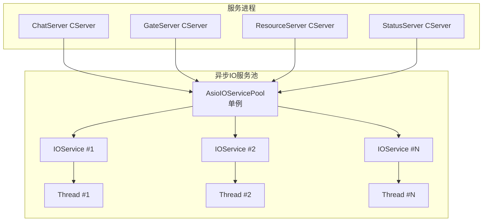
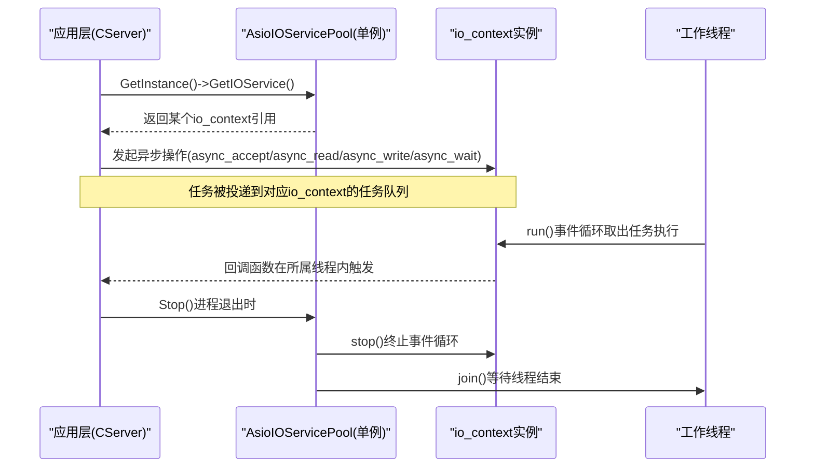
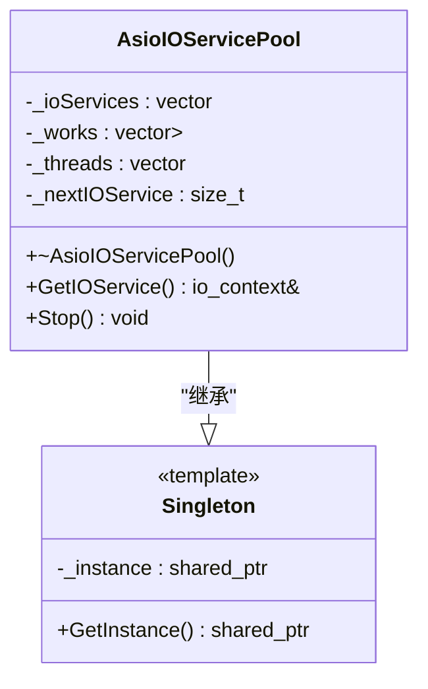
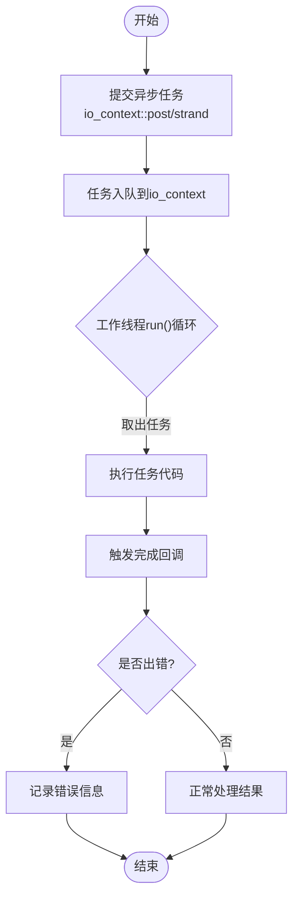
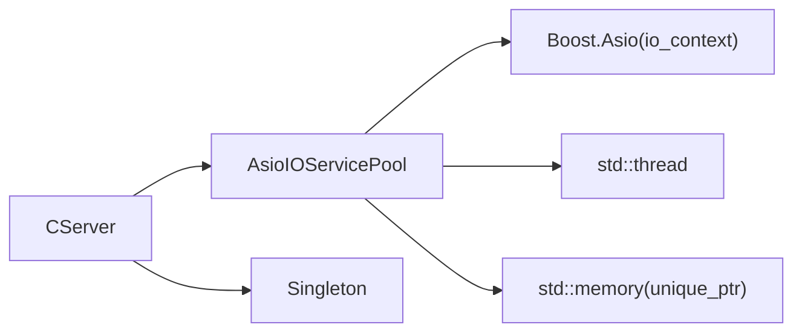

# 异步IO服务池

<cite>
**本文引用的文件**   
- [AsioIOServicePool.h（ChatServer）](file://server/ChatServer/include/AsioIOServicePool.h)
- [AsioIOServicePool.cpp（ChatServer）](file://server/ChatServer/src/AsioIOServicePool.cpp)
- [CServer.cpp（ChatServer）](file://server/ChatServer/src/CServer.cpp)
- [AsioIOServicePool.h（GateServer）](file://server/GateServer/include/AsioIOServicePool.h)
- [AsioIOServicePool.cpp（GateServer）](file://server/GateServer/src/AsioIOServicePool.cpp)
- [CServer.cpp（GateServer）](file://server/GateServer/src/CServer.cpp)
- [AsioIOServicePool.h（ResourceServer）](file://server/ResourceServer/include/AsioIOServicePool.h)
- [AsioIOServicePool.cpp（ResourceServer）](file://server/ResourceServer/src/AsioIOServicePool.cpp)
- [CServer.cpp（ResourceServer）](file://server/ResourceServer/src/CServer.cpp)
- [AsioIOServicePool.h（StatusServer）](file://server/StatusServer/include/AsioIOServicePool.h)
- [AsioIOServicePool.cpp（StatusServer）](file://server/StatusServer/src/AsioIOServicePool.cpp)
- [Singleton.h](file://server/ChatServer/include/Singleton.h)
</cite>

## 目录
1. [简介](#简介)
2. [项目结构](#项目结构)
3. [核心组件](#核心组件)
4. [架构总览](#架构总览)
5. [详细组件分析](#详细组件分析)
6. [依赖关系分析](#依赖关系分析)
7. [性能考量与调优](#性能考量与调优)
8. [故障排查指南](#故障排查指南)
9. [结论](#结论)
10. [附录：使用示例与最佳实践](#附录使用示例与最佳实践)

## 简介
本文件围绕LLFCChat项目中各服务的“异步IO服务池”进行系统化文档化，聚焦以下目标：
- 解释AsioIOServicePool的设计目标：基于Boost.Asio的多线程异步IO模型与任务调度机制。
- 描述IOService实例管理策略：线程池大小配置、工作负载分配（轮询）。
- 记录任务的提交、执行与完成回调机制：通过io_context::post/strand等模式组织异步任务。
- 说明与Boost.Asio的集成方式：io_context生命周期、work_guard保活、stop/join退出流程。
- 提供性能调优参数与监控指标建议：线程数、队列长度、错误率、CPU利用率等。
- 给出具体使用示例：如何从服务中获取io_context并安全提交异步任务、处理回调。
- 阐述内存管理、资源清理与异常安全的实现细节。

## 项目结构
在LLFCChat的多个服务端（ChatServer、GateServer、ResourceServer、StatusServer）中，均包含独立的AsioIOServicePool实现，并通过单例模式全局访问。典型结构如下：
- 头文件定义类接口与类型别名（如IOService、Work、WorkPtr），声明GetIOService()与Stop()。
- 源文件实现构造、析构、GetIOService()轮询选择、Stop()停止与线程join。
- 各服务CServer在启动时通过AsioIOServicePool::GetInstance()->GetIOService()获取io_context，用于accept或HTTP连接处理。

图表来源 
- [AsioIOServicePool.h（ChatServer）](file://server/ChatServer/include/AsioIOServicePool.h)
- [AsioIOServicePool.cpp（ChatServer）](file://server/ChatServer/src/AsioIOServicePool.cpp)
- [CServer.cpp（ChatServer）](file://server/ChatServer/src/CServer.cpp)
- [CServer.cpp（GateServer）](file://server/GateServer/src/CServer.cpp)
- [CServer.cpp（ResourceServer）](file://server/ResourceServer/src/CServer.cpp)

章节来源
- [AsioIOServicePool.h（ChatServer）](file://server/ChatServer/include/AsioIOServicePool.h)
- [AsioIOServicePool.cpp（ChatServer）](file://server/ChatServer/src/AsioIOServicePool.cpp)
- [CServer.cpp（ChatServer）](file://server/ChatServer/src/CServer.cpp)
- [CServer.cpp（GateServer）](file://server/GateServer/src/CServer.cpp)
- [CServer.cpp（ResourceServer）](file://server/ResourceServer/src/CServer.cpp)

## 核心组件
- AsioIOServicePool：封装一组boost::asio::io_context实例，每个io_context绑定一个工作线程；对外暴露GetIOService()以轮询返回io_context引用，以及Stop()统一停止所有上下文并等待线程退出。
- Singleton<T>：模板单例基类，提供线程安全的GetInstance()与静态实例管理。
- 各服务CServer：在服务启动阶段调用AsioIOServicePool::GetInstance()->GetIOService()获取io_context，用于创建acceptor或HTTP连接对象，并发起异步操作。

关键职责划分：
- AsioIOServicePool负责：
  - 初始化多个io_context与对应的work_guard，确保run()不会立即返回。
  - 为每个io_context启动独立线程运行run()事件循环。
  - 提供轮询式GetIOService()，将新连接/任务均匀分配到不同io_context。
  - Stop()调用stop()终止事件循环，释放work_guard，并join线程保证优雅退出。
- CServer负责：
  - 从单例获取io_context，创建会话/连接对象。
  - 使用io_context发起异步accept/read/write/timer等操作。
  - 在回调中处理业务逻辑与错误码。

章节来源
- [AsioIOServicePool.h（ChatServer）](file://server/ChatServer/include/AsioIOServicePool.h)
- [AsioIOServicePool.cpp（ChatServer）](file://server/ChatServer/src/AsioIOServicePool.cpp)
- [Singleton.h](file://server/ChatServer/include/Singleton.h)
- [CServer.cpp（ChatServer）](file://server/ChatServer/src/CServer.cpp)
- [CServer.cpp（GateServer）](file://server/GateServer/src/CServer.cpp)
- [CServer.cpp（ResourceServer）](file://server/ResourceServer/src/CServer.cpp)

## 架构总览
下图展示了服务进程如何通过单例访问异步IO服务池，并将异步任务分发到不同的io_context线程上执行。

图表来源 
- [AsioIOServicePool.cpp（ChatServer）](file://server/ChatServer/src/AsioIOServicePool.cpp)
- [CServer.cpp（ChatServer）](file://server/ChatServer/src/CServer.cpp)
- [CServer.cpp（GateServer）](file://server/GateServer/src/CServer.cpp)
- [CServer.cpp（ResourceServer）](file://server/ResourceServer/src/CServer.cpp)

## 详细组件分析

### AsioIOServicePool类设计
- 成员变量：
  - _ioServices：存储多个io_context实例。
  - _works：存储对应的work_guard，防止run()在没有任务时退出。
  - _threads：每个io_context对应的工作线程。
  - _nextIOService：轮询索引，实现负载均衡。
- 构造函数：
  - 初始化_ioServices、_works，并为每个io_context创建work_guard。
  - 为每个io_context启动一个线程执行run()。
- GetIOService()：
  - 按顺序返回下一个io_context引用，超过上限后回绕，实现简单轮询。
- Stop()：
  - 对每个io_context调用stop()，然后释放work_guard，最后join所有线程。
- 析构函数：
  - 部分实现直接打印日志，部分实现先调用Stop()再打印日志，确保资源释放。

图表来源 
- [AsioIOServicePool.h（ChatServer）](file://server/ChatServer/include/AsioIOServicePool.h)
- [AsioIOServicePool.cpp（ChatServer）](file://server/ChatServer/src/AsioIOServicePool.cpp)
- [Singleton.h](file://server/ChatServer/include/Singleton.h)

章节来源
- [AsioIOServicePool.h（ChatServer）](file://server/ChatServer/include/AsioIOServicePool.h)
- [AsioIOServicePool.cpp（ChatServer）](file://server/ChatServer/src/AsioIOServicePool.cpp)
- [AsioIOServicePool.h（GateServer）](file://server/GateServer/include/AsioIOServicePool.h)
- [AsioIOServicePool.cpp（GateServer）](file://server/GateServer/src/AsioIOServicePool.cpp)
- [AsioIOServicePool.h（ResourceServer）](file://server/ResourceServer/include/AsioIOServicePool.h)
- [AsioIOServicePool.cpp（ResourceServer）](file://server/ResourceServer/src/AsioIOServicePool.cpp)
- [AsioIOServicePool.h（StatusServer）](file://server/StatusServer/include/AsioIOServicePool.h)
- [AsioIOServicePool.cpp（StatusServer）](file://server/StatusServer/src/AsioIOServicePool.cpp)
- [Singleton.h](file://server/ChatServer/include/Singleton.h)

### 任务提交与执行流程
- 任务提交：
  - 通过io_context::post或strand包装的异步API提交任务。
  - 任务会被放入对应io_context的事件队列，由该io_context的工作线程执行。
- 执行与回调：
  - 工作线程调用run()循环取出任务执行。
  - 回调函数在所属io_context的线程内触发，保证同一io_context上的任务串行性（若使用strand）。
- 完成与清理：
  - 任务完成后，回调中处理结果与错误码。
  - 进程退出时调用Stop()，stop()使run()退出，work_guard释放，线程join。

图表来源 
- [AsioIOServicePool.cpp（ChatServer）](file://server/ChatServer/src/AsioIOServicePool.cpp)
- [CServer.cpp（ChatServer）](file://server/ChatServer/src/CServer.cpp)
- [CServer.cpp（GateServer）](file://server/GateServer/src/CServer.cpp)
- [CServer.cpp（ResourceServer）](file://server/ResourceServer/src/CServer.cpp)

章节来源
- [AsioIOServicePool.cpp（ChatServer）](file://server/ChatServer/src/AsioIOServicePool.cpp)
- [CServer.cpp（ChatServer）](file://server/ChatServer/src/CServer.cpp)
- [CServer.cpp（GateServer）](file://server/GateServer/src/CServer.cpp)
- [CServer.cpp（ResourceServer）](file://server/ResourceServer/src/CServer.cpp)

### 与Boost.Asio的集成要点
- io_context生命周期：
  - 构造时创建多个io_context，并为每个创建work_guard，确保run()不会因无任务而退出。
  - 析构或Stop()时调用stop()终止事件循环，释放work_guard，并join线程。
- 异步操作封装：
  - 各服务CServer通过GetIOService()获取io_context，调用accept/read/write/timer等异步API。
  - 回调中处理error_code，区分成功与失败路径。
- 错误处理：
  - 在回调中检查error_code，必要时关闭连接或重试。
  - 定时器回调中记录错误信息并继续设置下一次定时。

章节来源
- [AsioIOServicePool.cpp（ChatServer）](file://server/ChatServer/src/AsioIOServicePool.cpp)
- [CServer.cpp（ChatServer）](file://server/ChatServer/src/CServer.cpp)
- [CServer.cpp（GateServer）](file://server/GateServer/src/CServer.cpp)
- [CServer.cpp（ResourceServer）](file://server/ResourceServer/src/CServer.cpp)

## 依赖关系分析
- 组件耦合：
  - CServer依赖AsioIOServicePool获取io_context，低耦合、高内聚。
  - AsioIOServicePool依赖Boost.Asio的io_context、thread、memory等标准库组件。
- 外部依赖：
  - Boost.Asio：提供io_context、work_guard、异步API。
  - std::thread：工作线程管理。
  - std::mutex（在Singleton中）：保证单例初始化的线程安全。
- 潜在循环依赖：
  - 当前实现无循环依赖，CServer仅调用AsioIOServicePool接口，不反向依赖。

图表来源 
- [AsioIOServicePool.h（ChatServer）](file://server/ChatServer/include/AsioIOServicePool.h)
- [AsioIOServicePool.cpp（ChatServer）](file://server/ChatServer/src/AsioIOServicePool.cpp)
- [CServer.cpp（ChatServer）](file://server/ChatServer/src/CServer.cpp)
- [Singleton.h](file://server/ChatServer/include/Singleton.h)

章节来源
- [AsioIOServicePool.h（ChatServer）](file://server/ChatServer/include/AsioIOServicePool.h)
- [AsioIOServicePool.cpp（ChatServer）](file://server/ChatServer/src/AsioIOServicePool.cpp)
- [CServer.cpp（ChatServer）](file://server/ChatServer/src/CServer.cpp)
- [Singleton.h](file://server/ChatServer/include/Singleton.h)

## 性能考量与调优
- 线程池大小：
  - ChatServer/ResourceServer默认使用硬件并发度作为线程数。
  - GateServer/StatusServer默认固定为2（可调整）。
  - 建议根据CPU核心数与IO密集型特性进行调整，避免过多线程导致上下文切换开销。
- 任务调度：
  - 采用轮询分配io_context，简单有效，适合均匀负载。
  - 对于热点连接或特定业务，可使用strand保证局部串行性，减少锁竞争。
- 监控指标：
  - 每io_context的任务队列长度（可通过自定义统计）。
  - 回调执行耗时分布（P50/P95/P99）。
  - 错误率（网络错误、超时、异常抛出比例）。
  - CPU利用率与线程活跃度。
- 优化建议：
  - 合理拆分io_context分组，将读多写少与写多读少分离。
  - 使用strand包裹共享状态访问，降低锁粒度。
  - 避免在回调中进行阻塞操作，必要时提交到专用计算线程池。

[本节为通用指导，不直接分析具体文件]

## 故障排查指南
- 常见问题：
  - 程序退出卡住：检查Stop()是否正确调用，work_guard是否释放，线程是否join。
  - 回调未触发：确认io_context未被提前stop，任务是否提交到正确的io_context。
  - 死锁风险：避免在回调中持有全局锁过久，或使用跨io_context的同步操作。
- 调试技巧：
  - 在回调中打印error_code与消息，定位网络错误。
  - 使用日志记录任务提交与回调执行时间，识别慢路径。
  - 通过工具监控线程栈与CPU占用，定位热点。

章节来源
- [AsioIOServicePool.cpp（ChatServer）](file://server/ChatServer/src/AsioIOServicePool.cpp)
- [CServer.cpp（ChatServer）](file://server/ChatServer/src/CServer.cpp)
- [CServer.cpp（GateServer）](file://server/GateServer/src/CServer.cpp)
- [CServer.cpp（ResourceServer）](file://server/ResourceServer/src/CServer.cpp)

## 结论
AsioIOServicePool通过封装多个io_context与工作线程，提供了简洁高效的异步IO服务池。其轮询分配策略与work_guard保活机制确保了任务执行的稳定性与可扩展性。各服务通过单例模式统一接入，降低了耦合度。结合合理的线程数配置、strand使用与监控指标，可在高并发场景下获得良好性能。

[本节为总结，不直接分析具体文件]

## 附录：使用示例与最佳实践
- 获取io_context并提交异步任务：
  - 从AsioIOServicePool单例获取io_context引用。
  - 使用该io_context发起异步accept/read/write/timer等操作。
  - 在回调中处理业务逻辑与错误码。
- 资源清理与异常安全：
  - 进程退出时调用Stop()，确保所有io_context停止与线程join。
  - 使用智能指针管理动态对象，避免内存泄漏。
  - 在回调中捕获异常，记录错误并恢复稳定状态。
- 最佳实践：
  - 避免在回调中进行阻塞操作。
  - 使用strand保护共享状态，减少锁竞争。
  - 合理设置超时与重试策略，提升鲁棒性。

章节来源
- [CServer.cpp（ChatServer）](file://server/ChatServer/src/CServer.cpp)
- [CServer.cpp（GateServer）](file://server/GateServer/src/CServer.cpp)
- [CServer.cpp（ResourceServer）](file://server/ResourceServer/src/CServer.cpp)
- [AsioIOServicePool.cpp（ChatServer）](file://server/ChatServer/src/AsioIOServicePool.cpp)