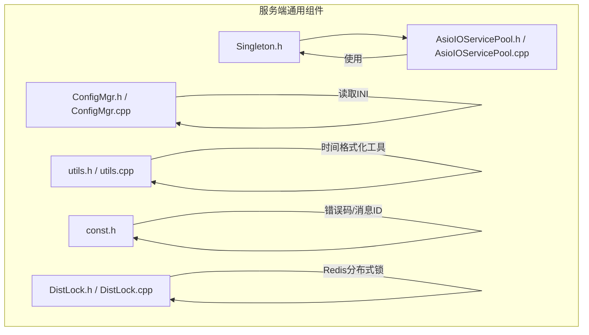
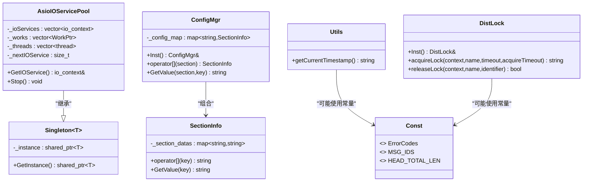
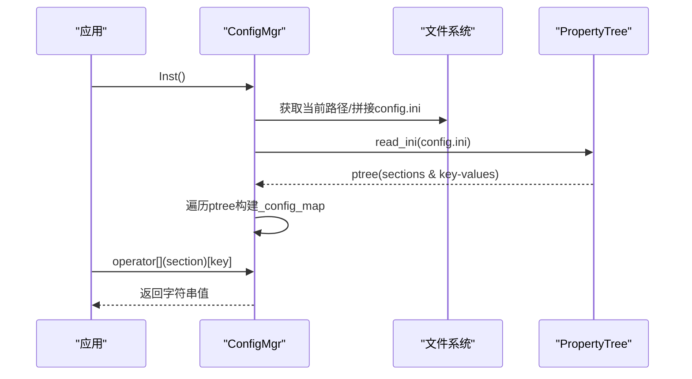
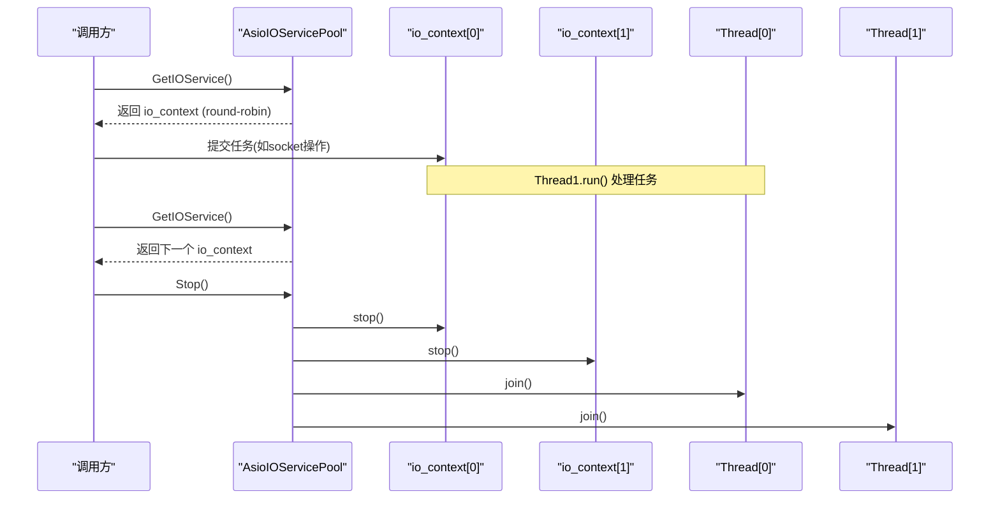
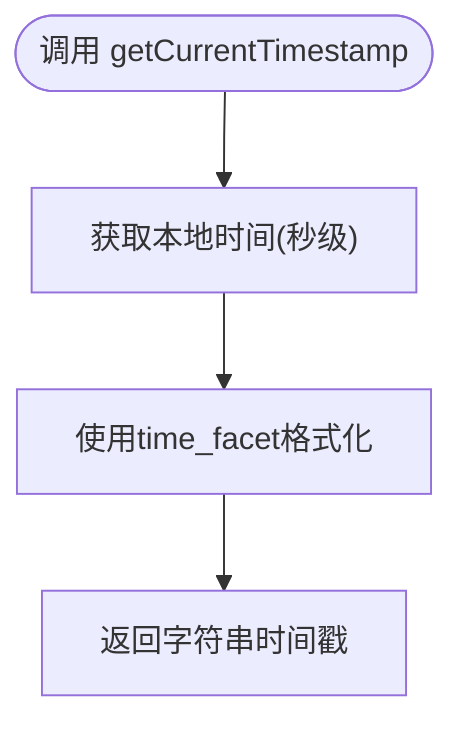
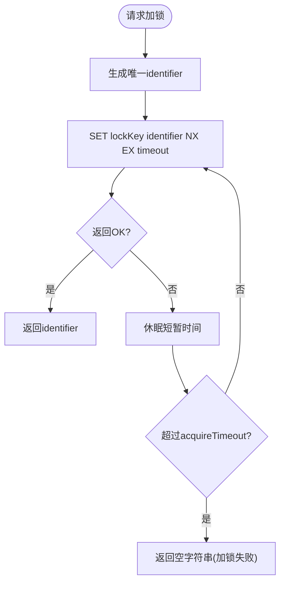
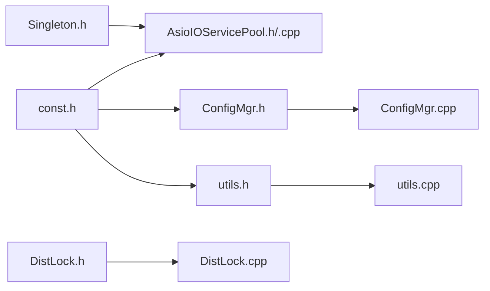

# 通用组件和工具

<cite>
**本文引用的文件**   
- [server/ChatServer/include/Singleton.h](file://server/ChatServer/include/Singleton.h)
- [server/ChatServer/include/ConfigMgr.h](file://server/ChatServer/include/ConfigMgr.h)
- [server/ChatServer/src/ConfigMgr.cpp](file://server/ChatServer/src/ConfigMgr.cpp)
- [server/ChatServer/include/AsioIOServicePool.h](file://server/ChatServer/include/AsioIOServicePool.h)
- [server/ChatServer/src/AsioIOServicePool.cpp](file://server/ChatServer/src/AsioIOServicePool.cpp)
- [server/ChatServer/include/utils.h](file://server/ChatServer/include/utils.h)
- [server/ChatServer/src/utils.cpp](file://server/ChatServer/src/utils.cpp)
- [server/ChatServer/include/const.h](file://server/ChatServer/include/const.h)
- [server/ChatServer/include/DistLock.h](file://server/ChatServer/include/DistLock.h)
- [server/ChatServer/src/DistLock.cpp](file://server/ChatServer/src/DistLock.cpp)
</cite>

## 目录
1. [简介](#简介)
2. [项目结构](#项目结构)
3. [核心组件](#核心组件)
4. [架构总览](#架构总览)
5. [详细组件分析](#详细组件分析)
6. [依赖关系分析](#依赖关系分析)
7. [性能考虑](#性能考虑)
8. [故障排查指南](#故障排查指南)
9. [结论](#结论)
10. [附录](#附录)

## 简介
本文件面向LLFCChat服务端通用组件与工具库，聚焦以下能力：
- 单例模式 Singleton 的实现与线程安全保证
- 配置管理 ConfigMgr 的设计与使用（INI解析、访问接口）
- AsioIOServicePool 异步IO池（线程池管理、任务调度、资源分配）
- utils 工具函数（时间戳格式化等）
- 错误码与消息ID定义（const.h）
- 分布式锁 DistLock（Redis实现，作为扩展工具）

说明范围限定于已提供的服务端通用头文件与实现文件，不包含业务逻辑细节。

## 项目结构
本节概述与服务端通用组件相关的目录与文件组织方式：
- server/ChatServer/include：通用组件与工具的头文件（Singleton、ConfigMgr、AsioIOServicePool、utils、const、DistLock）
- server/ChatServer/src：对应实现文件（ConfigMgr、AsioIOServicePool、utils、DistLock）

图表来源
- [server/ChatServer/include/Singleton.h:1-33](file://server/ChatServer/include/Singleton.h#L1-L33)
- [server/ChatServer/include/ConfigMgr.h:1-84](file://server/ChatServer/include/ConfigMgr.h#L1-L84)
- [server/ChatServer/src/ConfigMgr.cpp:1-50](file://server/ChatServer/src/ConfigMgr.cpp#L1-L50)
- [server/ChatServer/include/AsioIOServicePool.h:1-28](file://server/ChatServer/include/AsioIOServicePool.h#L1-L28)
- [server/ChatServer/src/AsioIOServicePool.cpp:1-43](file://server/ChatServer/src/AsioIOServicePool.cpp#L1-L43)
- [server/ChatServer/include/utils.h:1-7](file://server/ChatServer/include/utils.h#L1-L7)
- [server/ChatServer/src/utils.cpp:1-15](file://server/ChatServer/src/utils.cpp#L1-L15)
- [server/ChatServer/include/const.h:1-104](file://server/ChatServer/include/const.h#L1-L104)
- [server/ChatServer/include/DistLock.h:1-18](file://server/ChatServer/include/DistLock.h#L1-L18)
- [server/ChatServer/src/DistLock.cpp:1-73](file://server/ChatServer/src/DistLock.cpp#L1-L73)

章节来源
- [server/ChatServer/include/Singleton.h:1-33](file://server/ChatServer/include/Singleton.h#L1-L33)
- [server/ChatServer/include/ConfigMgr.h:1-84](file://server/ChatServer/include/ConfigMgr.h#L1-L84)
- [server/ChatServer/src/ConfigMgr.cpp:1-50](file://server/ChatServer/src/ConfigMgr.cpp#L1-L50)
- [server/ChatServer/include/AsioIOServicePool.h:1-28](file://server/ChatServer/include/AsioIOServicePool.h#L1-L28)
- [server/ChatServer/src/AsioIOServicePool.cpp:1-43](file://server/ChatServer/src/AsioIOServicePool.cpp#L1-L43)
- [server/ChatServer/include/utils.h:1-7](file://server/ChatServer/include/utils.h#L1-L7)
- [server/ChatServer/src/utils.cpp:1-15](file://server/ChatServer/src/utils.cpp#L1-L15)
- [server/ChatServer/include/const.h:1-104](file://server/ChatServer/include/const.h#L1-L104)
- [server/ChatServer/include/DistLock.h:1-18](file://server/ChatServer/include/DistLock.h#L1-L18)
- [server/ChatServer/src/DistLock.cpp:1-73](file://server/ChatServer/src/DistLock.cpp#L1-L73)

## 核心组件
- Singleton：模板化单例，基于 std::call_once 确保线程安全的唯一实例构造；提供 GetInstance() 获取 shared_ptr<T> 实例。
- ConfigMgr：INI配置文件管理器，封装 SectionInfo，支持按 section/key 取值；内部维护 map<string, SectionInfo> 存储配置。
- AsioIOServicePool：基于 boost::asio 的 IO 服务池，采用 round-robin 选择 io_context，每个 io_context 绑定一个 work_guard 并由独立线程运行 run()。
- utils：提供时间戳格式化等基础工具函数。
- const：集中定义错误码、消息ID、常量宏等。
- DistLock：基于 Redis 的分布式锁实现，包含加锁与解锁流程。

章节来源
- [server/ChatServer/include/Singleton.h:1-33](file://server/ChatServer/include/Singleton.h#L1-L33)
- [server/ChatServer/include/ConfigMgr.h:1-84](file://server/ChatServer/include/ConfigMgr.h#L1-L84)
- [server/ChatServer/src/ConfigMgr.cpp:1-50](file://server/ChatServer/src/ConfigMgr.cpp#L1-L50)
- [server/ChatServer/include/AsioIOServicePool.h:1-28](file://server/ChatServer/include/AsioIOServicePool.h#L1-L28)
- [server/ChatServer/src/AsioIOServicePool.cpp:1-43](file://server/ChatServer/src/AsioIOServicePool.cpp#L1-L43)
- [server/ChatServer/include/utils.h:1-7](file://server/ChatServer/include/utils.h#L1-L7)
- [server/ChatServer/src/utils.cpp:1-15](file://server/ChatServer/src/utils.cpp#L1-L15)
- [server/ChatServer/include/const.h:1-104](file://server/ChatServer/include/const.h#L1-L104)
- [server/ChatServer/include/DistLock.h:1-18](file://server/ChatServer/include/DistLock.h#L1-L18)
- [server/ChatServer/src/DistLock.cpp:1-73](file://server/ChatServer/src/DistLock.cpp#L1-L73)

## 架构总览
下图展示通用组件之间的依赖与交互关系：
- AsioIOServicePool 继承自 Singleton，通过单例获取 IO 服务池实例
- ConfigMgr 提供配置数据访问，供其他模块初始化或运行时读取
- utils 提供时间戳等工具，被日志、调试、网络层等广泛使用
- const 为全局错误码与消息ID定义，被各模块引用
- DistLock 作为分布式锁工具，供需要跨进程互斥的场景使用

图表来源
- [server/ChatServer/include/Singleton.h:1-33](file://server/ChatServer/include/Singleton.h#L1-L33)
- [server/ChatServer/include/AsioIOServicePool.h:1-28](file://server/ChatServer/include/AsioIOServicePool.h#L1-L28)
- [server/ChatServer/include/ConfigMgr.h:1-84](file://server/ChatServer/include/ConfigMgr.h#L1-L84)
- [server/ChatServer/include/utils.h:1-7](file://server/ChatServer/include/utils.h#L1-L7)
- [server/ChatServer/include/const.h:1-104](file://server/ChatServer/include/const.h#L1-L104)
- [server/ChatServer/include/DistLock.h:1-18](file://server/ChatServer/include/DistLock.h#L1-L18)

## 详细组件分析

### 单例模式 Singleton
- 设计要点
  - 模板类，适用于任意类型 T
  - 私有构造函数与拷贝构造/赋值删除，防止外部构造与复制
  - 静态成员 _instance 保存 shared_ptr<T> 实例
  - GetInstance() 使用 std::call_once 与 once_flag 保证首次调用时仅构造一次，线程安全
- 使用建议
  - 所有需要全局唯一资源的组件可继承该模板，避免重复实例化
  - 注意析构顺序与生命周期管理，必要时在应用退出前显式释放依赖资源

图表来源
- [server/ChatServer/include/Singleton.h:1-33](file://server/ChatServer/include/Singleton.h#L1-L33)

章节来源
- [server/ChatServer/include/Singleton.h:1-33](file://server/ChatServer/include/Singleton.h#L1-L33)

### 配置管理 ConfigMgr
- 设计要点
  - 使用 Boost.PropertyTree 解析 INI 文件
  - 以 SectionInfo 封装每个 section 的 key-value 映射
  - 提供 operator[] 与 GetValue 两种访问方式
  - 当前实现从工作目录加载 config.ini，未实现热重载与环境变量覆盖
- 使用建议
  - 启动阶段加载配置，后续按需读取
  - 如需热重载，可在外部触发重新解析并替换内部 map
  - 环境变量支持可通过在解析后覆盖同名键值实现

图表来源
- [server/ChatServer/src/ConfigMgr.cpp:1-50](file://server/ChatServer/src/ConfigMgr.cpp#L1-L50)
- [server/ChatServer/include/ConfigMgr.h:1-84](file://server/ChatServer/include/ConfigMgr.h#L1-L84)

章节来源
- [server/ChatServer/include/ConfigMgr.h:1-84](file://server/ChatServer/include/ConfigMgr.h#L1-L84)
- [server/ChatServer/src/ConfigMgr.cpp:1-50](file://server/ChatServer/src/ConfigMgr.cpp#L1-L50)

### 异步IO池 AsioIOServicePool
- 设计要点
  - 继承 Singleton，保证全局唯一 IO 服务池
  - 内部维护多个 boost::asio::io_context，每个绑定一个 Work（work_guard），防止 run() 提前退出
  - 为每个 io_context 启动一个线程执行 run()
  - GetIOService() 采用轮询策略返回下一个 io_context
  - Stop() 依次 stop 所有 io_context，释放 work_guard，并 join 所有线程
- 使用建议
  - 合理设置线程数（默认硬件并发度），避免过多上下文切换
  - 将网络事件、定时器等任务提交到 GetIOService() 返回的 io_context
  - 应用退出时调用 Stop() 确保优雅关闭

图表来源
- [server/ChatServer/include/AsioIOServicePool.h:1-28](file://server/ChatServer/include/AsioIOServicePool.h#L1-L28)
- [server/ChatServer/src/AsioIOServicePool.cpp:1-43](file://server/ChatServer/src/AsioIOServicePool.cpp#L1-L43)

章节来源
- [server/ChatServer/include/AsioIOServicePool.h:1-28](file://server/ChatServer/include/AsioIOServicePool.h#L1-L28)
- [server/ChatServer/src/AsioIOServicePool.cpp:1-43](file://server/ChatServer/src/AsioIOServicePool.cpp#L1-L43)

### 工具函数 utils
- 功能
  - getCurrentTimestamp()：使用 Boost.Posix_Time 生成“年-月-日 时:分:秒”格式的本地时间字符串
- 使用建议
  - 用于日志记录、调试输出、文件名后缀等场景
  - 若需更高精度，可扩展为毫秒级时间戳

图表来源
- [server/ChatServer/src/utils.cpp:1-15](file://server/ChatServer/src/utils.cpp#L1-L15)
- [server/ChatServer/include/utils.h:1-7](file://server/ChatServer/include/utils.h#L1-L7)

章节来源
- [server/ChatServer/include/utils.h:1-7](file://server/ChatServer/include/utils.h#L1-L7)
- [server/ChatServer/src/utils.cpp:1-15](file://server/ChatServer/src/utils.cpp#L1-L15)

### 错误码与消息ID const
- 内容
  - ErrorCodes：统一错误码（JSON解析、RPC失败、验证码过期/错误、用户存在、密码错误、Token无效等）
  - MSG_IDS：消息ID枚举（登录、搜索、好友申请、认证、文本/图片聊天、心跳、文件同步等）
  - 常量宏：头部长度、队列大小、Redis键前缀、分布式锁超时等
- 使用建议
  - 所有模块统一引用，避免硬编码魔法数字
  - 新增错误码或消息ID时保持命名一致性与区间划分

章节来源
- [server/ChatServer/include/const.h:1-104](file://server/ChatServer/include/const.h#L1-L104)

### 分布式锁 DistLock（扩展工具）
- 功能
  - acquireLock：基于 Redis SET NX EX 原子命令尝试加锁，带重试与超时控制
  - releaseLock：使用 Lua 脚本判断标识符匹配后删除锁键，保证原子性
- 使用建议
  - 加锁时传入合理的 lockTimeout 与 acquireTimeout
  - 解锁时必须使用同一 identifier，避免误删他人锁
  - 结合 Redis 连接池与异常处理提升稳定性

图表来源
- [server/ChatServer/src/DistLock.cpp:1-73](file://server/ChatServer/src/DistLock.cpp#L1-L73)
- [server/ChatServer/include/DistLock.h:1-18](file://server/ChatServer/include/DistLock.h#L1-L18)

章节来源
- [server/ChatServer/include/DistLock.h:1-18](file://server/ChatServer/include/DistLock.h#L1-L18)
- [server/ChatServer/src/DistLock.cpp:1-73](file://server/ChatServer/src/DistLock.cpp#L1-L73)

## 依赖关系分析
- AsioIOServicePool 依赖 Singleton 模板基类，确保单例访问
- ConfigMgr 依赖 Boost.PropertyTree 与 Boost.Filesystem 进行INI解析与路径处理
- utils 依赖 Boost.Posix_Time 进行时间格式化
- const 被多处引用，作为统一的错误码与消息ID来源
- DistLock 依赖 hiredis 与 Boost.UUID 完成Redis操作与唯一标识生成

图表来源
- [server/ChatServer/include/Singleton.h:1-33](file://server/ChatServer/include/Singleton.h#L1-L33)
- [server/ChatServer/include/AsioIOServicePool.h:1-28](file://server/ChatServer/include/AsioIOServicePool.h#L1-L28)
- [server/ChatServer/src/AsioIOServicePool.cpp:1-43](file://server/ChatServer/src/AsioIOServicePool.cpp#L1-L43)
- [server/ChatServer/include/ConfigMgr.h:1-84](file://server/ChatServer/include/ConfigMgr.h#L1-L84)
- [server/ChatServer/src/ConfigMgr.cpp:1-50](file://server/ChatServer/src/ConfigMgr.cpp#L1-L50)
- [server/ChatServer/include/utils.h:1-7](file://server/ChatServer/include/utils.h#L1-L7)
- [server/ChatServer/src/utils.cpp:1-15](file://server/ChatServer/src/utils.cpp#L1-L15)
- [server/ChatServer/include/const.h:1-104](file://server/ChatServer/include/const.h#L1-L104)
- [server/ChatServer/include/DistLock.h:1-18](file://server/ChatServer/include/DistLock.h#L1-L18)
- [server/ChatServer/src/DistLock.cpp:1-73](file://server/ChatServer/src/DistLock.cpp#L1-L73)

章节来源
- [server/ChatServer/include/Singleton.h:1-33](file://server/ChatServer/include/Singleton.h#L1-L33)
- [server/ChatServer/include/AsioIOServicePool.h:1-28](file://server/ChatServer/include/AsioIOServicePool.h#L1-L28)
- [server/ChatServer/src/AsioIOServicePool.cpp:1-43](file://server/ChatServer/src/AsioIOServicePool.cpp#L1-L43)
- [server/ChatServer/include/ConfigMgr.h:1-84](file://server/ChatServer/include/ConfigMgr.h#L1-L84)
- [server/ChatServer/src/ConfigMgr.cpp:1-50](file://server/ChatServer/src/ConfigMgr.cpp#L1-L50)
- [server/ChatServer/include/utils.h:1-7](file://server/ChatServer/include/utils.h#L1-L7)
- [server/ChatServer/src/utils.cpp:1-15](file://server/ChatServer/src/utils.cpp#L1-L15)
- [server/ChatServer/include/const.h:1-104](file://server/ChatServer/include/const.h#L1-L104)
- [server/ChatServer/include/DistLock.h:1-18](file://server/ChatServer/include/DistLock.h#L1-L18)
- [server/ChatServer/src/DistLock.cpp:1-73](file://server/ChatServer/src/DistLock.cpp#L1-L73)

## 性能考虑
- Singleton
  - call_once 仅在首次调用时开销较大，后续调用几乎无额外成本
  - 注意对象析构顺序，避免在静态析构中访问尚未销毁的全局资源
- ConfigMgr
  - INI解析发生在构造期，频繁重读会带来IO与CPU开销
  - 建议缓存解析结果，仅在需要时更新；如需热重载，应使用读写锁保护并发访问
- AsioIOServicePool
  - 线程数应与CPU核心数匹配，避免过多上下文切换
  - 任务应尽量轻量且非阻塞，长时间阻塞会拖慢单个 io_context
  - Stop() 应在应用退出时调用，确保所有线程正常退出
- utils
  - 时间格式化涉及 locale 与 time_facet，建议在静态初始化中完成以避免重复开销
- DistLock
  - 加锁重试间隔不宜过短，避免忙等导致CPU飙升
  - 解锁Lua脚本保证原子性，但需确保identifier正确传递

[本节为通用指导，不直接分析具体文件]

## 故障排查指南
- 配置加载失败
  - 检查工作目录下是否存在 config.ini，路径拼接是否正确
  - 确认INI文件格式符合[section]与key=value规范
- IO池未退出或卡死
  - 确认所有任务均能正常结束，避免死循环或阻塞
  - 调用 Stop() 后检查线程是否成功 join
- 分布式锁冲突
  - 确认identifier一致性，避免误删他人锁
  - 调整 acquireTimeout 与 lockTimeout，观察重试行为
- 时间戳格式异常
  - 检查locale设置与time_facet格式串是否符合预期

章节来源
- [server/ChatServer/src/ConfigMgr.cpp:1-50](file://server/ChatServer/src/ConfigMgr.cpp#L1-L50)
- [server/ChatServer/src/AsioIOServicePool.cpp:1-43](file://server/ChatServer/src/AsioIOServicePool.cpp#L1-L43)
- [server/ChatServer/src/DistLock.cpp:1-73](file://server/ChatServer/src/DistLock.cpp#L1-L73)
- [server/ChatServer/src/utils.cpp:1-15](file://server/ChatServer/src/utils.cpp#L1-L15)

## 结论
本组件集围绕单例、配置、异步IO、工具与错误码展开，形成服务端通用的基础设施层。通过 Singleton 保障全局唯一性，ConfigMgr 简化配置访问，AsioIOServicePool 提供高性能并发IO能力，utils 与 const 提供基础工具与统一常量。DistLock 作为扩展工具满足分布式互斥需求。遵循本文的使用建议与最佳实践，可有效提升系统的稳定性与可维护性。

[本节为总结，不直接分析具体文件]

## 附录
- 使用示例（概念性）
  - 单例：通过 Singleton<T>::GetInstance() 获取共享实例
  - 配置：ConfigMgr::Inst()[section][key] 或 ConfigMgr::Inst().GetValue(section, key)
  - IO池：AsioIOServicePool::GetInstance()->GetIOService() 获取 io_context 并提交任务
  - 工具：utils::getCurrentTimestamp() 获取时间戳
  - 错误码：直接使用 const.h 中的枚举与宏
  - 分布式锁：DistLock::Inst().acquireLock(...) 与 releaseLock(...)

[本节为概念性说明，不直接分析具体文件]