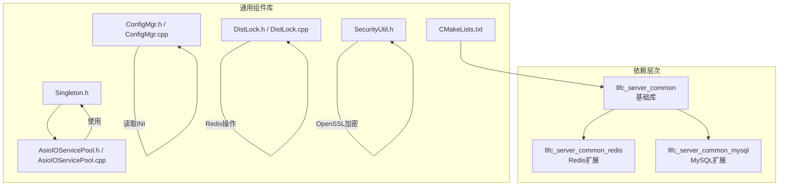
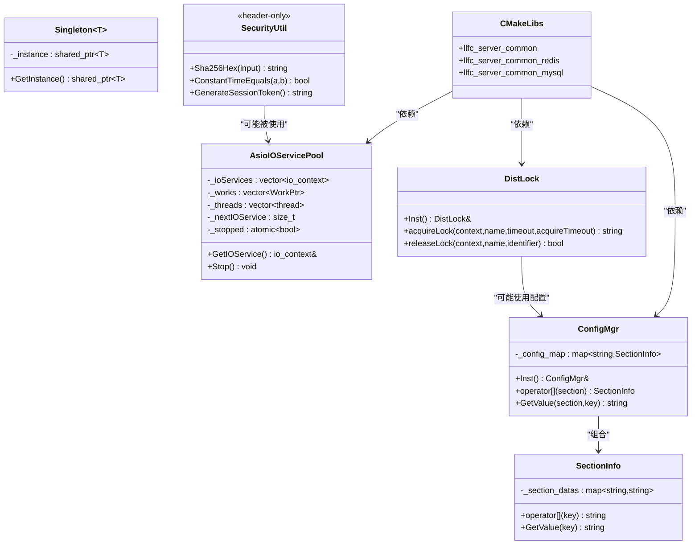
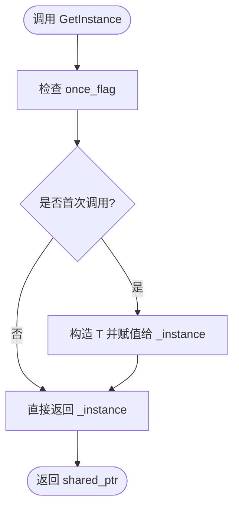
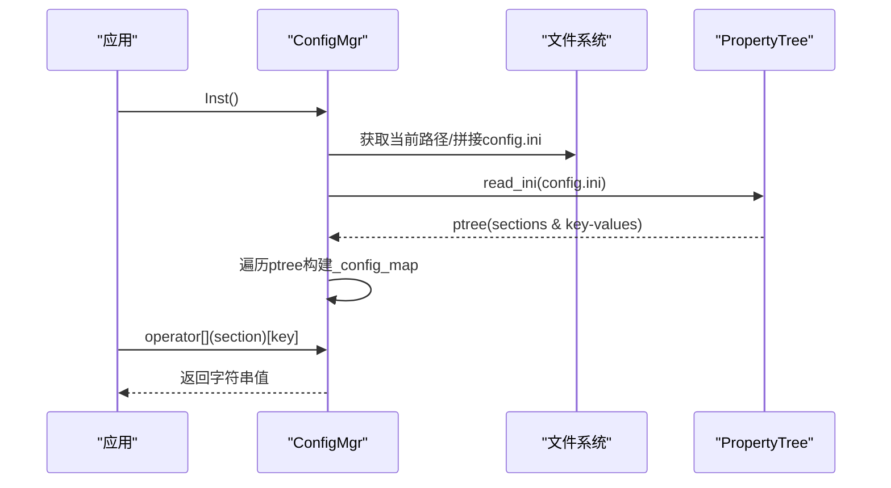
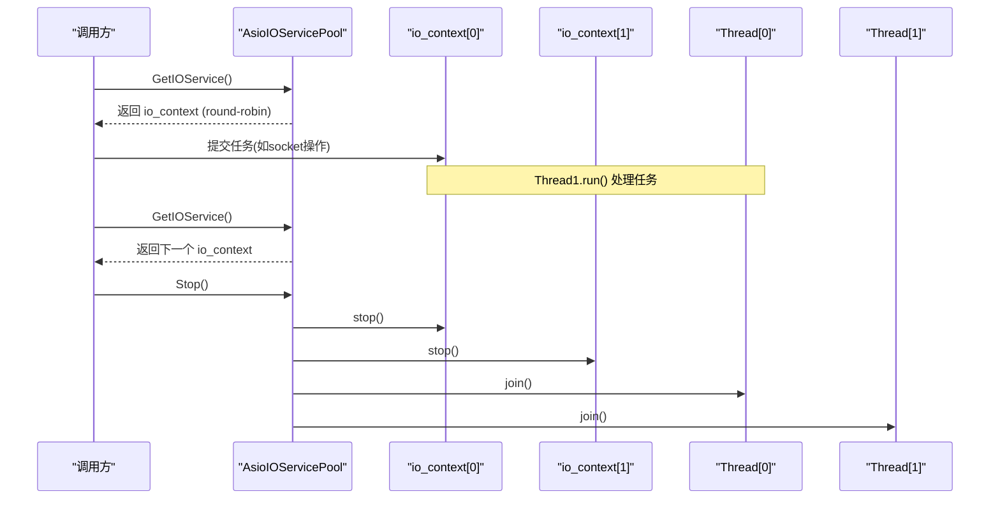
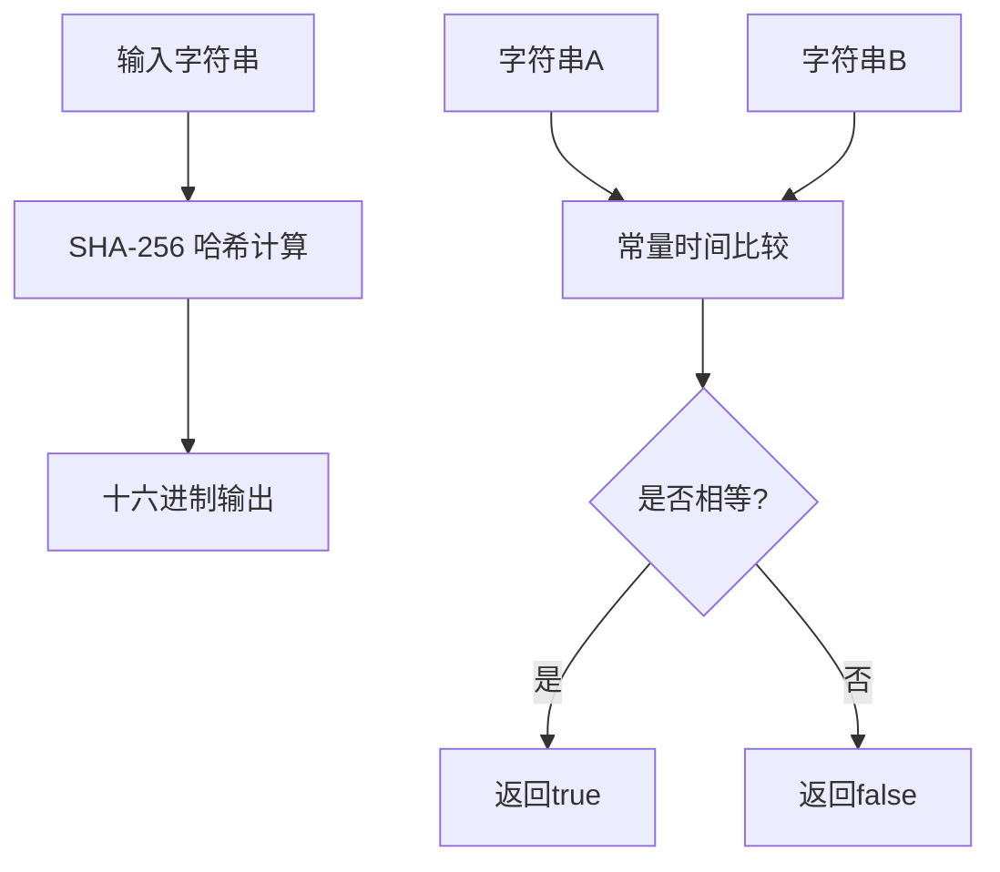
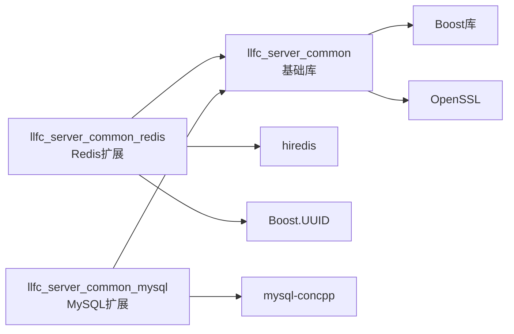
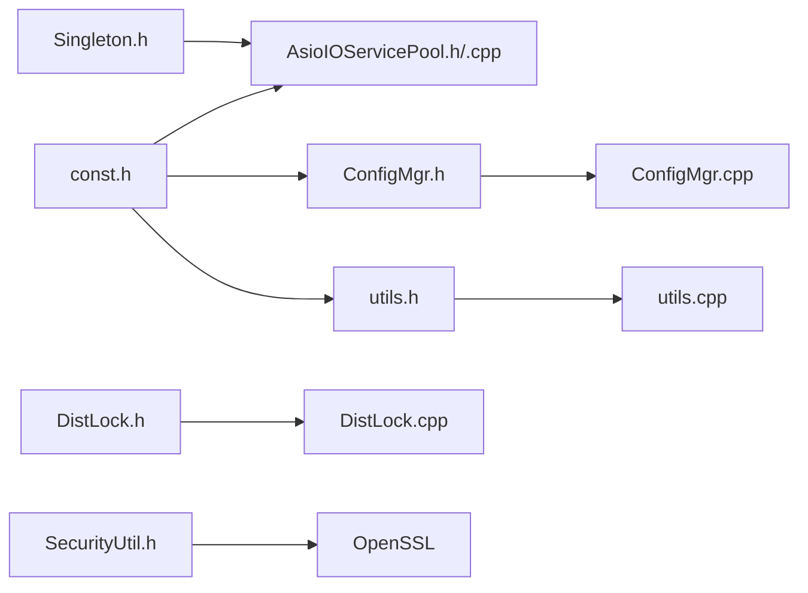

# 通用组件和工具

<cite>
**本文引用的文件**   
- [server/common/include/Singleton.h](file://server/common/include/Singleton.h)
- [server/common/include/ConfigMgr.h](file://server/common/include/ConfigMgr.h)
- [server/common/src/ConfigMgr.cpp](file://server/common/src/ConfigMgr.cpp)
- [server/common/include/AsioIOServicePool.h](file://server/common/include/AsioIOServicePool.h)
- [server/common/src/AsioIOServicePool.cpp](file://server/common/src/AsioIOServicePool.cpp)
- [server/common/include/DistLock.h](file://server/common/include/DistLock.h)
- [server/common/src/DistLock.cpp](file://server/common/src/DistLock.cpp)
- [server/common/include/SecurityUtil.h](file://server/common/include/SecurityUtil.h)
- [server/common/CMakeLists.txt](file://server/common/CMakeLists.txt)
</cite>

## 更新摘要
**变更内容**   
- 将通用组件从各服务目录迁移到 server/common/ 作为统一的CMake静态库
- 新增三层依赖目标：llfc_server_common、llfc_server_common_redis、llfc_server_common_mysql
- 重构 AsioIOServicePool 为显式生命周期管理，不再使用单例模式
- 新增 SecurityUtil 安全工具库，提供加密解密功能
- 统一项目结构和构建配置

## 目录
1. [简介](#简介)
2. [项目结构](#项目结构)
3. [核心组件](#核心组件)
4. [架构总览](#架构总览)
5. [详细组件分析](#详细组件分析)
6. [依赖关系分析](#依赖关系分析)
7. [性能考虑](#性能考虑)
8. [故障排查指南](#故障排查指南)
9. [结论](#结论)
10. [附录](#附录)

## 简介
本文件面向LLFCChat服务端通用组件与工具库，聚焦以下能力：
- 单例模式 Singleton 的实现与线程安全保证
- 配置管理 ConfigMgr 的设计与使用（INI解析、访问接口）
- AsioIOServicePool 异步IO池（线程池管理、任务调度、资源分配）
- 分布式锁 DistLock（Redis实现，作为扩展工具）
- 安全工具 SecurityUtil（加密解密、哈希计算、会话令牌生成）
- 统一的CMake静态库构建系统，支持多层依赖

说明范围限定于已提供的服务端通用头文件与实现文件，不包含业务逻辑细节。

## 项目结构
本节概述与服务端通用组件相关的目录与文件组织方式：
- server/common/include：通用组件与工具的头文件（Singleton、ConfigMgr、AsioIOServicePool、DistLock、SecurityUtil等）
- server/common/src：对应实现文件（ConfigMgr、AsioIOServicePool、DistLock、LogicWorker、MySqlPool、RedisConPool）
- server/common/CMakeLists.txt：统一的构建配置，定义三层静态库目标

**图表来源**
- [server/common/include/Singleton.h:1-33](file://server/common/include/Singleton.h#L1-L33)
- [server/common/include/ConfigMgr.h:1-81](file://server/common/include/ConfigMgr.h#L1-L81)
- [server/common/include/AsioIOServicePool.h:1-68](file://server/common/include/AsioIOServicePool.h#L1-L68)
- [server/common/include/DistLock.h:1-17](file://server/common/include/DistLock.h#L1-L17)
- [server/common/include/SecurityUtil.h:1-99](file://server/common/include/SecurityUtil.h#L1-L99)
- [server/common/CMakeLists.txt:1-88](file://server/common/CMakeLists.txt#L1-L88)

**章节来源**
- [server/common/include/Singleton.h:1-33](file://server/common/include/Singleton.h#L1-L33)
- [server/common/include/ConfigMgr.h:1-81](file://server/common/include/ConfigMgr.h#L1-L81)
- [server/common/src/ConfigMgr.cpp:1-51](file://server/common/src/ConfigMgr.cpp#L1-L51)
- [server/common/include/AsioIOServicePool.h:1-68](file://server/common/include/AsioIOServicePool.h#L1-L68)
- [server/common/src/AsioIOServicePool.cpp:1-51](file://server/common/src/AsioIOServicePool.cpp#L1-L51)
- [server/common/include/DistLock.h:1-17](file://server/common/include/DistLock.h#L1-L17)
- [server/common/src/DistLock.cpp:1-73](file://server/common/src/DistLock.cpp#L1-L73)
- [server/common/include/SecurityUtil.h:1-99](file://server/common/include/SecurityUtil.h#L1-L99)
- [server/common/CMakeLists.txt:1-88](file://server/common/CMakeLists.txt#L1-L88)

## 核心组件
- **Singleton**：模板化单例，基于 std::call_once 确保线程安全的唯一实例构造；提供 GetInstance() 获取 shared_ptr<T> 实例。
- **ConfigMgr**：INI配置文件管理器，封装 SectionInfo，支持按 section/key 取值；内部维护 map<string, SectionInfo> 存储配置。
- **AsioIOServicePool**：基于 boost::asio 的 IO 服务池，采用显式生命周期管理，每个 io_context 绑定一个 work_guard 并由独立线程运行 run()。
- **DistLock**：基于 Redis 的分布式锁实现，包含加锁与解锁流程，使用 Lua 脚本保证原子性。
- **SecurityUtil**：头文件形式的加密工具库，提供 SHA-256 哈希、常量时间比较、会话令牌生成功能。

**章节来源**
- [server/common/include/Singleton.h:1-33](file://server/common/include/Singleton.h#L1-L33)
- [server/common/include/ConfigMgr.h:1-81](file://server/common/include/ConfigMgr.h#L1-L81)
- [server/common/src/ConfigMgr.cpp:1-51](file://server/common/src/ConfigMgr.cpp#L1-L51)
- [server/common/include/AsioIOServicePool.h:1-68](file://server/common/include/AsioIOServicePool.h#L1-L68)
- [server/common/src/AsioIOServicePool.cpp:1-51](file://server/common/src/AsioIOServicePool.cpp#L1-L51)
- [server/common/include/DistLock.h:1-17](file://server/common/include/DistLock.h#L1-L17)
- [server/common/src/DistLock.cpp:1-73](file://server/common/src/DistLock.cpp#L1-L73)
- [server/common/include/SecurityUtil.h:1-99](file://server/common/include/SecurityUtil.h#L1-L99)

## 架构总览
下图展示通用组件之间的依赖与交互关系：
- AsioIOServicePool 采用显式生命周期管理，不再继承 Singleton
- ConfigMgr 提供配置数据访问，供其他模块初始化或运行时读取
- DistLock 作为分布式锁工具，供需要跨进程互斥的场景使用
- SecurityUtil 作为头文件库，被多个服务直接包含使用
- CMake 构建系统定义三层依赖关系

**图表来源**
- [server/common/include/Singleton.h:1-33](file://server/common/include/Singleton.h#L1-L33)
- [server/common/include/AsioIOServicePool.h:1-68](file://server/common/include/AsioIOServicePool.h#L1-L68)
- [server/common/include/ConfigMgr.h:1-81](file://server/common/include/ConfigMgr.h#L1-L81)
- [server/common/include/DistLock.h:1-17](file://server/common/include/DistLock.h#L1-L17)
- [server/common/include/SecurityUtil.h:1-99](file://server/common/include/SecurityUtil.h#L1-L99)
- [server/common/CMakeLists.txt:44-87](file://server/common/CMakeLists.txt#L44-L87)

## 详细组件分析

### 单例模式 Singleton
- 设计要点
  - 模板类，适用于任意类型 T
  - 私有构造函数与拷贝构造/赋值删除，防止外部构造与复制
  - 静态成员 _instance 保存 shared_ptr<T> 实例
  - GetInstance() 使用 std::call_once 与 once_flag 保证首次调用时仅构造一次，线程安全
- 使用建议
  - 所有需要全局唯一资源的组件可继承该模板，避免重复实例化
  - 注意析构顺序与生命周期管理，必要时在应用退出前显式释放依赖资源

**图表来源**
- [server/common/include/Singleton.h:15-22](file://server/common/include/Singleton.h#L15-L22)

**章节来源**
- [server/common/include/Singleton.h:1-33](file://server/common/include/Singleton.h#L1-L33)

### 配置管理 ConfigMgr
- 设计要点
  - 使用 Boost.PropertyTree 解析 INI 文件
  - 以 SectionInfo 封装每个 section 的 key-value 映射
  - 提供 operator[] 与 GetValue 两种访问方式
  - 当前实现从工作目录加载 config.ini，未实现热重载与环境变量覆盖
- 使用建议
  - 启动阶段加载配置，后续按需读取
  - 如需热重载，可在外部触发重新解析并替换内部 map
  - 环境变量支持可通过在解析后覆盖同名键值实现

**图表来源**
- [server/common/src/ConfigMgr.cpp:2-30](file://server/common/src/ConfigMgr.cpp#L2-L30)
- [server/common/include/ConfigMgr.h:44-75](file://server/common/include/ConfigMgr.h#L44-L75)

**章节来源**
- [server/common/include/ConfigMgr.h:1-81](file://server/common/include/ConfigMgr.h#L1-L81)
- [server/common/src/ConfigMgr.cpp:1-51](file://server/common/src/ConfigMgr.cpp#L1-L51)

### 异步IO池 AsioIOServicePool
- 设计要点
  - 采用显式生命周期管理，不再继承 Singleton
  - 内部维护多个 boost::asio::io_context，每个绑定一个 Work（work_guard），防止 run() 提前退出
  - 为每个 io_context 启动一个线程执行 run()
  - GetIOService() 采用轮询策略返回下一个 io_context
  - Stop() 依次 stop 所有 io_context，释放 work_guard，并 join 所有线程
  - 使用原子标志保证 Stop() 幂等执行
- 使用建议
  - 合理设置线程数（默认硬件并发度），避免过多上下文切换
  - 将网络事件、定时器等任务提交到 GetIOService() 返回的 io_context
  - 应用退出时调用 Stop() 确保优雅关闭

**图表来源**
- [server/common/include/AsioIOServicePool.h:35-54](file://server/common/include/AsioIOServicePool.h#L35-L54)
- [server/common/src/AsioIOServicePool.cpp:4-50](file://server/common/src/AsioIOServicePool.cpp#L4-L50)

**章节来源**
- [server/common/include/AsioIOServicePool.h:1-68](file://server/common/include/AsioIOServicePool.h#L1-L68)
- [server/common/src/AsioIOServicePool.cpp:1-51](file://server/common/src/AsioIOServicePool.cpp#L1-L51)

### 分布式锁 DistLock
- 功能
  - acquireLock：基于 Redis SET NX EX 原子命令尝试加锁，带重试与超时控制
  - releaseLock：使用 Lua 脚本判断标识符匹配后删除锁键，保证原子性
- 使用建议
  - 加锁时传入合理的 lockTimeout 与 acquireTimeout
  - 解锁时必须使用同一 identifier，避免误删他人锁
  - 结合 Redis 连接池与异常处理提升稳定性

**图表来源**
- [server/common/src/DistLock.cpp:26-48](file://server/common/src/DistLock.cpp#L26-L48)
- [server/common/include/DistLock.h:9-13](file://server/common/include/DistLock.h#L9-L13)

**章节来源**
- [server/common/include/DistLock.h:1-17](file://server/common/include/DistLock.h#L1-L17)
- [server/common/src/DistLock.cpp:1-73](file://server/common/src/DistLock.cpp#L1-L73)

### 安全工具 SecurityUtil
- 功能
  - Sha256Hex：计算输入字符串的 SHA-256 哈希值，返回十六进制字符串
  - ConstantTimeEquals：常量时间字符串比较，防止时序攻击
  - GenerateSessionToken：生成 128 位随机会话令牌
- 特点
  - 头文件形式实现，无需编译链接
  - 使用 OpenSSL EVP API 进行加密操作
  - 支持 OpenSSL 1.1.0 及以上版本

**图表来源**
- [server/common/include/SecurityUtil.h:23-61](file://server/common/include/SecurityUtil.h#L23-L61)
- [server/common/include/SecurityUtil.h:66-79](file://server/common/include/SecurityUtil.h#L66-L79)
- [server/common/include/SecurityUtil.h:83-96](file://server/common/include/SecurityUtil.h#L83-L96)

**章节来源**
- [server/common/include/SecurityUtil.h:1-99](file://server/common/include/SecurityUtil.h#L1-L99)

### CMake 构建系统
- 三层依赖目标
  - llfc_server_common：基础库，包含 ConfigMgr、AsioIOServicePool、LogicWorker
  - llfc_server_common_redis：Redis 扩展，包含 RedisConPool、DistLock
  - llfc_server_common_mysql：MySQL 扩展，包含 MySqlPool
- 依赖管理
  - 基础库依赖 Boost、OpenSSL
  - Redis 扩展额外依赖 hiredis 和 Boost.UUID
  - MySQL 扩展额外依赖 mysql-concpp

**图表来源**
- [server/common/CMakeLists.txt:44-87](file://server/common/CMakeLists.txt#L44-L87)

**章节来源**
- [server/common/CMakeLists.txt:1-88](file://server/common/CMakeLists.txt#L1-L88)

## 依赖关系分析
- AsioIOServicePool 采用显式生命周期管理，不再依赖 Singleton 模板基类
- ConfigMgr 依赖 Boost.PropertyTree 与 Boost.Filesystem 进行INI解析与路径处理
- DistLock 依赖 hiredis 与 Boost.UUID 完成Redis操作与唯一标识生成
- SecurityUtil 依赖 OpenSSL 进行加密操作
- CMake 构建系统定义清晰的三层依赖关系

**图表来源**
- [server/common/include/Singleton.h:1-33](file://server/common/include/Singleton.h#L1-L33)
- [server/common/include/AsioIOServicePool.h:1-68](file://server/common/include/AsioIOServicePool.h#L1-L68)
- [server/common/src/AsioIOServicePool.cpp:1-51](file://server/common/src/AsioIOServicePool.cpp#L1-L51)
- [server/common/include/ConfigMgr.h:1-81](file://server/common/include/ConfigMgr.h#L1-L81)
- [server/common/src/ConfigMgr.cpp:1-51](file://server/common/src/ConfigMgr.cpp#L1-L51)
- [server/common/include/DistLock.h:1-17](file://server/common/include/DistLock.h#L1-L17)
- [server/common/src/DistLock.cpp:1-73](file://server/common/src/DistLock.cpp#L1-L73)
- [server/common/include/SecurityUtil.h:1-99](file://server/common/include/SecurityUtil.h#L1-L99)

**章节来源**
- [server/common/include/Singleton.h:1-33](file://server/common/include/Singleton.h#L1-L33)
- [server/common/include/AsioIOServicePool.h:1-68](file://server/common/include/AsioIOServicePool.h#L1-L68)
- [server/common/src/AsioIOServicePool.cpp:1-51](file://server/common/src/AsioIOServicePool.cpp#L1-L51)
- [server/common/include/ConfigMgr.h:1-81](file://server/common/include/ConfigMgr.h#L1-L81)
- [server/common/src/ConfigMgr.cpp:1-51](file://server/common/src/ConfigMgr.cpp#L1-L51)
- [server/common/include/DistLock.h:1-17](file://server/common/include/DistLock.h#L1-L17)
- [server/common/src/DistLock.cpp:1-73](file://server/common/src/DistLock.cpp#L1-L73)
- [server/common/include/SecurityUtil.h:1-99](file://server/common/include/SecurityUtil.h#L1-L99)

## 性能考虑
- **Singleton**
  - call_once 仅在首次调用时开销较大，后续调用几乎无额外成本
  - 注意对象析构顺序，避免在静态析构中访问尚未销毁的全局资源
- **ConfigMgr**
  - INI解析发生在构造期，频繁重读会带来IO与CPU开销
  - 建议缓存解析结果，仅在需要时更新；如需热重载，应使用读写锁保护并发访问
- **AsioIOServicePool**
  - 线程数应与CPU核心数匹配，避免过多上下文切换
  - 任务应尽量轻量且非阻塞，长时间阻塞会拖慢单个 io_context
  - Stop() 应在应用退出时调用，确保所有线程正常退出
  - 原子停止标志避免重复停止操作的开销
- **DistLock**
  - 加锁重试间隔不宜过短，避免忙等导致CPU飙升
  - 解锁Lua脚本保证原子性，但需确保identifier正确传递
- **SecurityUtil**
  - 头文件库无编译开销，但每次包含都会增加编译时间
  - OpenSSL 操作涉及系统调用，应避免频繁调用

## 故障排查指南
- **配置加载失败**
  - 检查工作目录下是否存在 config.ini，路径拼接是否正确
  - 确认INI文件格式符合[section]与key=value规范
- **IO池未退出或卡死**
  - 确认所有任务均能正常结束，避免死循环或阻塞
  - 调用 Stop() 后检查线程是否成功 join
  - 检查原子停止标志是否正确设置
- **分布式锁冲突**
  - 确认identifier一致性，避免误删他人锁
  - 调整 acquireTimeout 与 lockTimeout，观察重试行为
- **加密解密问题**
  - 检查 OpenSSL 版本兼容性
  - 验证输入输出格式是否符合预期

**章节来源**
- [server/common/src/ConfigMgr.cpp:1-51](file://server/common/src/ConfigMgr.cpp#L1-L51)
- [server/common/src/AsioIOServicePool.cpp:1-51](file://server/common/src/AsioIOServicePool.cpp#L1-L51)
- [server/common/src/DistLock.cpp:1-73](file://server/common/src/DistLock.cpp#L1-L73)
- [server/common/include/SecurityUtil.h:1-99](file://server/common/include/SecurityUtil.h#L1-L99)

## 结论
本组件集围绕单例、配置、异步IO、分布式锁与安全工具展开，形成服务端通用的基础设施层。通过统一的 CMake 静态库构建系统，实现了清晰的依赖管理和模块化设计。AsioIOServicePool 的显式生命周期管理提升了资源控制的精确性，SecurityUtil 提供了必要的加密功能。遵循本文的使用建议与最佳实践，可有效提升系统的稳定性与可维护性。

## 附录
- **使用示例（概念性）**
  - 单例：通过 Singleton<T>::GetInstance() 获取共享实例
  - 配置：ConfigMgr::Inst()[section][key] 或 ConfigMgr::Inst().GetValue(section, key)
  - IO池：AsioIOServicePool pool(size); pool.GetIOService() 获取 io_context 并提交任务
  - 分布式锁：DistLock::Inst().acquireLock(...) 与 releaseLock(...)
  - 安全工具：security::Sha256Hex()、security::ConstantTimeEquals()、security::GenerateSessionToken()
- **CMake 集成**
  - 基础库：target_link_libraries(your_target PRIVATE llfc_server_common)
  - Redis扩展：target_link_libraries(your_target PRIVATE llfc_server_common_redis)
  - MySQL扩展：target_link_libraries(your_target PRIVATE llfc_server_common_mysql)