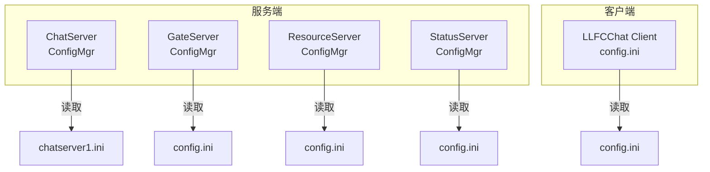
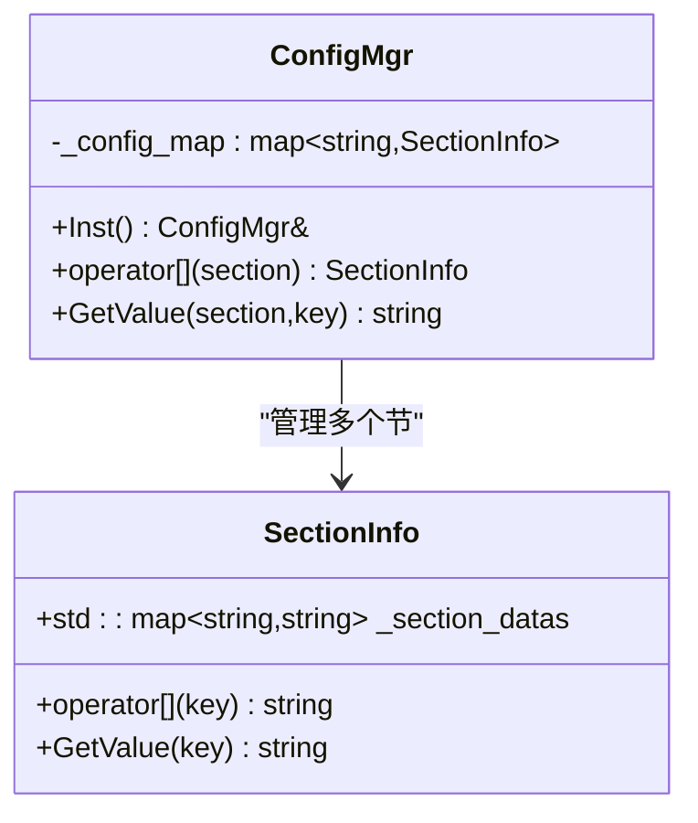
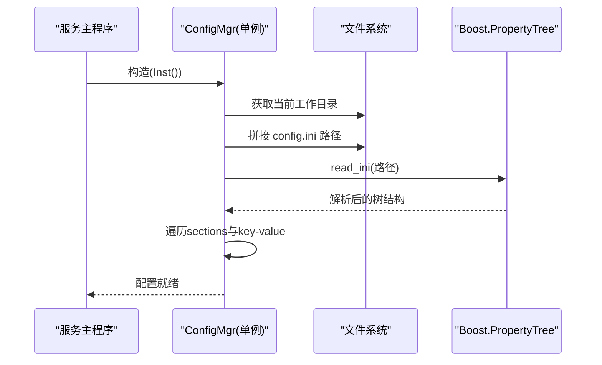
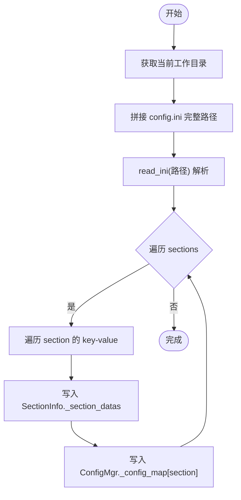
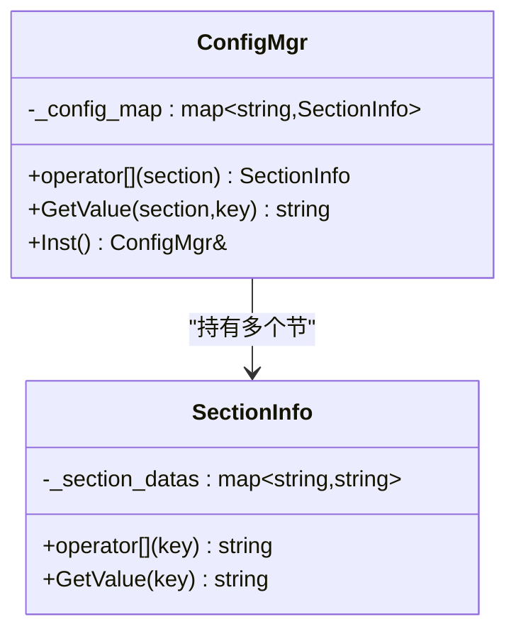
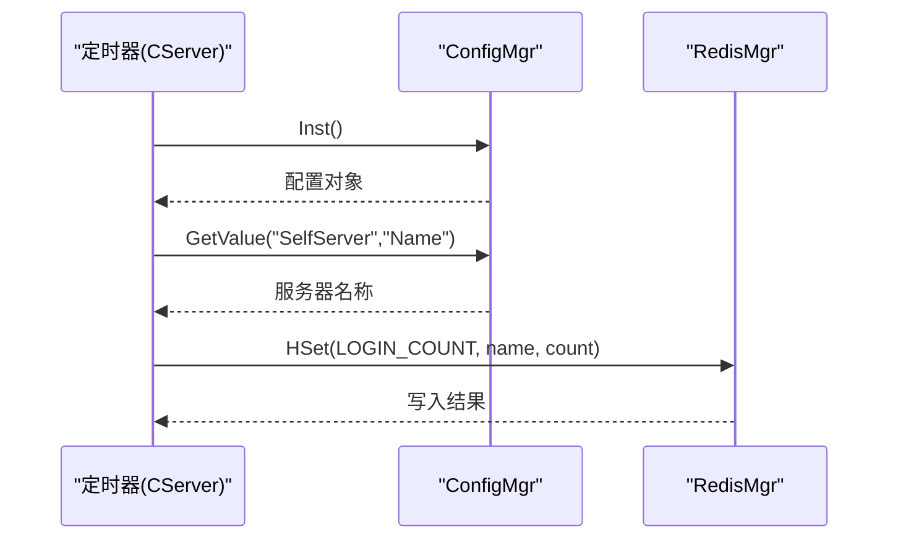
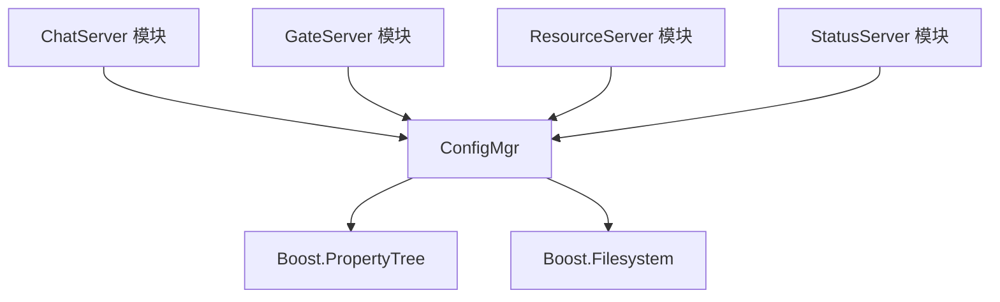

# 配置管理器

<cite>
**本文引用的文件**   
- [ChatServer/ConfigMgr.h](file://server/ChatServer/include/ConfigMgr.h)
- [ChatServer/ConfigMgr.cpp](file://server/ChatServer/src/ConfigMgr.cpp)
- [GateServer/ConfigMgr.h](file://server/GateServer/include/ConfigMgr.h)
- [GateServer/ConfigMgr.cpp](file://server/GateServer/src/ConfigMgr.cpp)
- [ResourceServer/ConfigMgr.h](file://server/ResourceServer/include/ConfigMgr.h)
- [ResourceServer/ConfigMgr.cpp](file://server/ResourceServer/src/ConfigMgr.cpp)
- [StatusServer/ConfigMgr.h](file://server/StatusServer/include/ConfigMgr.h)
- [StatusServer/ConfigMgr.cpp](file://server/StatusServer/src/ConfigMgr.cpp)
- [ChatServer/CServer.cpp](file://server/ChatServer/src/CServer.cpp)
- [ChatServer/LogicSystem.cpp](file://server/ChatServer/src/LogicSystem.cpp)
- [ChatServer/MysqlDao.cpp](file://server/ChatServer/src/MysqlDao.cpp)
- [ChatServer/RedisMgr.cpp](file://server/ChatServer/src/RedisMgr.cpp)
- [GateServer/GateServer.cpp](file://server/GateServer/src/GateServer.cpp)
- [GateServer/LogicSystem.cpp](file://server/GateServer/src/LogicSystem.cpp)
- [GateServer/MysqlDao.cpp](file://server/GateServer/src/MysqlDao.cpp)
- [GateServer/RedisMgr.cpp](file://server/GateServer/src/RedisMgr.cpp)
- [ResourceServer/ChatServerGrpcClient.cpp](file://server/ResourceServer/src/ChatServerGrpcClient.cpp)
- [ResourceServer/LogicWorker.cpp](file://server/ResourceServer/src/LogicWorker.cpp)
- [client/config.ini](file://client/llfcchat/config/config.ini)
- [GateServer/config.ini](file://server/GateServer/config/config.ini)
- [ChatServer/chatserver1.ini](file://server/ChatServer/config/chatserver1.ini)
</cite>

## 更新摘要
**所做更改**   
- 更新了核心组件分析部分，详细说明了新增的Doxygen注释
- 增强了SectionInfo结构体的文档说明，包括完整的API文档
- 完善了ConfigMgr类的架构描述，突出单例模式和线程安全特性
- 补充了INI文件解析流程的详细技术说明
- 优化了架构图示，更准确地反映代码结构

## 目录
1. [简介](#简介)
2. [项目结构](#项目结构)
3. [核心组件](#核心组件)
4. [架构总览](#架构总览)
5. [详细组件分析](#详细组件分析)
6. [依赖关系分析](#依赖关系分析)
7. [性能考量](#性能考量)
8. [故障排查指南](#故障排查指南)
9. [结论](#结论)
10. [附录](#附录)

## 简介
本文件为 LLFCChat 项目的配置管理器（ConfigMgr）提供系统化文档，覆盖设计架构、INI 解析实现、键值存储与管理、读取与默认值处理、多环境配置支持、更新通知机制、错误处理与日志记录，以及在各服务中的集成用法与最佳实践。该配置管理器基于 Boost.PropertyTree 解析 INI 配置文件，采用单例模式暴露全局访问点，并在各服务端模块中广泛使用。**最新更新**：ConfigMgr类已添加详细的Doxygen注释，涵盖INI文件解析和基于分段的配置获取功能，提供了完整的API文档和使用说明。

## 项目结构
- 服务端各子项目均包含独立的 ConfigMgr 头文件与实现文件，遵循统一接口风格：
  - ChatServer: include/ConfigMgr.h, src/ConfigMgr.cpp
  - GateServer: include/ConfigMgr.h, src/ConfigMgr.cpp
  - ResourceServer: include/ConfigMgr.h, src/ConfigMgr.cpp
  - StatusServer: include/ConfigMgr.h, src/ConfigMgr.cpp
- 配置文件按服务或实例放置于各自 config 目录下，例如：
  - client/llfcchat/config/config.ini
  - server/GateServer/config/config.ini
  - server/ChatServer/config/chatserver1.ini

**图表来源**
- [ChatServer/ConfigMgr.h](file://server/ChatServer/include/ConfigMgr.h)
- [GateServer/ConfigMgr.h](file://server/GateServer/include/ConfigMgr.h)
- [ResourceServer/ConfigMgr.h](file://server/ResourceServer/include/ConfigMgr.h)
- [StatusServer/ConfigMgr.h](file://server/StatusServer/include/ConfigMgr.h)
- [client/config.ini](file://client/llfcchat/config/config.ini)
- [GateServer/config.ini](file://server/GateServer/config/config.ini)
- [ChatServer/chatserver1.ini](file://server/ChatServer/config/chatserver1.ini)

**章节来源**
- [ChatServer/ConfigMgr.h](file://server/ChatServer/include/ConfigMgr.h)
- [GateServer/ConfigMgr.h](file://server/GateServer/include/ConfigMgr.h)
- [ResourceServer/ConfigMgr.h](file://server/ResourceServer/include/ConfigMgr.h)
- [StatusServer/ConfigMgr.h](file://server/StatusServer/include/ConfigMgr.h)
- [client/config.ini](file://client/llfcchat/config/config.ini)
- [GateServer/config.ini](file://server/GateServer/config/config.ini)
- [ChatServer/chatserver1.ini](file://server/ChatServer/config/chatserver1.ini)

## 核心组件
- **SectionInfo**：表示一个 INI 节（section），内部维护 std::map<std::string, std::string> 的键值对，并提供 operator[] 与 GetValue 方法用于安全取值。**新增Doxygen注释**详细说明了每个方法的用途、参数和返回值。
- **ConfigMgr**：单例类，负责：
  - 构造函数中定位并读取当前工作目录下的 INI 文件；
  - 使用 Boost.PropertyTree 解析 INI 内容，构建 _config_map（section -> SectionInfo）；
  - 提供 Inst() 获取单例引用，采用Meyers' Singleton模式确保线程安全；
  - 提供 GetValue(section, key) 便捷读取接口；
  - 部分服务扩展了路径初始化与输出路径查询（如 ResourceServer）。

**图表来源**
- [ChatServer/ConfigMgr.h](file://server/ChatServer/include/ConfigMgr.h)
- [GateServer/ConfigMgr.h](file://server/GateServer/include/ConfigMgr.h)
- [ResourceServer/ConfigMgr.h](file://server/ResourceServer/include/ConfigMgr.h)
- [StatusServer/ConfigMgr.h](file://server/StatusServer/include/ConfigMgr.h)

**章节来源**
- [ChatServer/ConfigMgr.h](file://server/ChatServer/include/ConfigMgr.h)
- [GateServer/ConfigMgr.h](file://server/GateServer/include/ConfigMgr.h)
- [ResourceServer/ConfigMgr.h](file://server/ResourceServer/include/ConfigMgr.h)
- [StatusServer/ConfigMgr.h](file://server/StatusServer/include/ConfigMgr.h)

## 架构总览
- **启动阶段**：各服务进程启动时构造 ConfigMgr 单例，自动加载当前工作目录下的 INI 配置文件，解析所有 section 与 key-value 对，存入内存映射表。
- **运行阶段**：业务逻辑通过 ConfigMgr::Inst().GetValue("Section","Key") 或 ConfigMgr::Inst()["Section"]["Key"] 方式读取配置。
- **资源路径**：ResourceServer 在构造后调用 InitPath() 根据配置生成静态资源与二进制输出路径，并检查/创建目录。

**图表来源**
- [ChatServer/ConfigMgr.cpp](file://server/ChatServer/src/ConfigMgr.cpp)
- [GateServer/ConfigMgr.cpp](file://server/GateServer/src/ConfigMgr.cpp)
- [ResourceServer/ConfigMgr.cpp](file://server/ResourceServer/src/ConfigMgr.cpp)
- [StatusServer/ConfigMgr.cpp](file://server/StatusServer/src/ConfigMgr.cpp)

**章节来源**
- [ChatServer/ConfigMgr.cpp](file://server/ChatServer/src/ConfigMgr.cpp)
- [GateServer/ConfigMgr.cpp](file://server/GateServer/src/ConfigMgr.cpp)
- [ResourceServer/ConfigMgr.cpp](file://server/ResourceServer/src/ConfigMgr.cpp)
- [StatusServer/ConfigMgr.cpp](file://server/StatusServer/src/ConfigMgr.cpp)

## 详细组件分析

### INI 文件格式与解析流程
- **文件位置**：各服务从当前工作目录读取名为 config.ini 的文件（ChatServer/GateServer/StatusServer 示例如此；ResourceServer 也遵循相同策略）。
- **解析库**：Boost.PropertyTree.read_ini 将 INI 转换为 ptree，随后逐节遍历，提取每个 key 的字符串值。
- **数据结构**：每个 section 对应一个 SectionInfo，其内部 map 保存键值对；ConfigMgr 以 map<section, SectionInfo> 形式集中管理。

**图表来源**
- [ChatServer/ConfigMgr.cpp](file://server/ChatServer/src/ConfigMgr.cpp)
- [GateServer/ConfigMgr.cpp](file://server/GateServer/src/ConfigMgr.cpp)
- [ResourceServer/ConfigMgr.cpp](file://server/ResourceServer/src/ConfigMgr.cpp)
- [StatusServer/ConfigMgr.cpp](file://server/StatusServer/src/ConfigMgr.cpp)

**章节来源**
- [ChatServer/ConfigMgr.cpp](file://server/ChatServer/src/ConfigMgr.cpp)
- [GateServer/ConfigMgr.cpp](file://server/GateServer/src/ConfigMgr.cpp)
- [ResourceServer/ConfigMgr.cpp](file://server/ResourceServer/src/ConfigMgr.cpp)
- [StatusServer/ConfigMgr.cpp](file://server/StatusServer/src/ConfigMgr.cpp)

### 键值对的存储与管理机制
- **SectionInfo**：
  - 内部成员 _section_datas 为 std::map<string,string>，保证键有序且查找复杂度 O(log n)。
  - operator[] 与 GetValue 在未找到键时返回空字符串，避免异常。
  - **新增Doxygen注释**详细说明了拷贝构造函数、析构函数和赋值运算符的行为。
- **ConfigMgr**：
  - 成员 _config_map 为 std::map<string, SectionInfo>，存储所有节。
  - operator 返回对应 SectionInfo，若不存在则返回空对象。
  - GetValue(section, key) 先校验 section 存在，再委托 SectionInfo.GetValue(key)。
  - **单例模式**：采用Meyers' Singleton实现，确保线程安全的懒加载。

**图表来源**
- [ChatServer/ConfigMgr.h](file://server/ChatServer/include/ConfigMgr.h)
- [GateServer/ConfigMgr.h](file://server/GateServer/include/ConfigMgr.h)
- [ResourceServer/ConfigMgr.h](file://server/ResourceServer/include/ConfigMgr.h)
- [StatusServer/ConfigMgr.h](file://server/StatusServer/include/ConfigMgr.h)

**章节来源**
- [ChatServer/ConfigMgr.h](file://server/ChatServer/include/ConfigMgr.h)
- [GateServer/ConfigMgr.h](file://server/GateServer/include/ConfigMgr.h)
- [ResourceServer/ConfigMgr.h](file://server/ResourceServer/include/ConfigMgr.h)
- [StatusServer/ConfigMgr.h](file://server/StatusServer/include/ConfigMgr.h)

### 配置项读取、验证与默认值处理
- **读取**：
  - 直接读取：ConfigMgr::Inst().GetValue("Section","Key")
  - 间接读取：ConfigMgr::Inst()["Section"]["Key"]
- **验证**：
  - 未找到 section 或 key 时返回空字符串，调用方需自行判断是否为有效值。
  - 建议在业务层进行类型转换与范围校验（例如端口号、主机名等）。
- **默认值**：
  - 当前实现未内置默认值机制；可在调用处提供 fallback 逻辑，如：value.empty() ? default_value : value。

**章节来源**
- [ChatServer/ConfigMgr.cpp](file://server/ChatServer/src/ConfigMgr.cpp)
- [GateServer/ConfigMgr.cpp](file://server/GateServer/src/ConfigMgr.cpp)
- [ResourceServer/ConfigMgr.cpp](file://server/ResourceServer/src/ConfigMgr.cpp)
- [StatusServer/ConfigMgr.cpp](file://server/StatusServer/src/ConfigMgr.cpp)

### 多环境配置支持（开发、测试、生产）
- **现状**：
  - 各服务从当前工作目录读取固定文件名（通常为 config.ini），因此可通过部署时的不同工作目录或不同配置文件实现环境隔离。
  - ChatServer 提供了 chatserver1.ini、chatserver2.ini 等多实例配置文件，便于区分节点。
- **建议方案**：
  - 环境变量注入：在进程启动前设置环境变量（如 ENV=dev/test/prod），由 ConfigMgr 构造函数根据环境变量选择配置文件路径。
  - 命令行参数：增加 --config 参数，优先使用传入路径，否则回退到默认路径。
  - 分层配置：基础配置与环境特定配置分离，运行时合并（当前未实现）。

**章节来源**
- [ChatServer/chatserver1.ini](file://server/ChatServer/config/chatserver1.ini)
- [GateServer/config.ini](file://server/GateServer/config/config.ini)
- [client/config.ini](file://client/llfcchat/config/config.ini)

### 配置更新通知机制与热重载
- **现状**：
  - 当前实现仅在构造时加载一次配置，无文件监听与热重载能力。
- **建议方案**：
  - 引入文件监控（如 boost::asio::posix::signal 或平台相关 API）检测配置文件变更。
  - 变更触发后，异步重建配置快照，并通过观察者/回调通知订阅者。
  - 对于关键配置（如数据库连接、RPC 地址），应在切换时优雅重启相关子系统。

### 错误处理与日志记录
- **错误处理**：
  - 未找到 section/key 时返回空字符串，不会抛出异常。
  - 文件读取失败（如路径不存在）可能导致 read_ini 抛异常，需在调用处捕获并给出明确错误信息。
- **日志记录**：
  - 构造函数中打印"Config path"与解析结果，便于调试。
  - 建议接入统一日志框架，记录加载成功/失败、缺失键、路径创建失败等信息。

**章节来源**
- [ChatServer/ConfigMgr.cpp](file://server/ChatServer/src/ConfigMgr.cpp)
- [GateServer/ConfigMgr.cpp](file://server/GateServer/src/ConfigMgr.cpp)
- [ResourceServer/ConfigMgr.cpp](file://server/ResourceServer/src/ConfigMgr.cpp)
- [StatusServer/ConfigMgr.cpp](file://server/StatusServer/src/ConfigMgr.cpp)

### 各服务中的集成用法与最佳实践
- **ChatServer**：
  - 在定时器回调中读取 SelfServer.Name，统计会话数并写入 Redis。
  - 在 MysqlDao、RedisMgr、LogicSystem 等处通过 ConfigMgr::Inst() 获取配置。
- **GateServer**：
  - 在 GateServer.cpp、LogicSystem.cpp、MysqlDao.cpp、RedisMgr.cpp 中广泛使用 ConfigMgr。
- **ResourceServer**：
  - 通过 GetFileOutPath() 获取静态资源输出路径，供文件下载与存储使用。
  - LogicWorker 多次调用 GetFileOutPath() 进行文件操作。
- **StatusServer**：
  - 与其他服务一致，通过 Inst() 获取配置。

**图表来源**
- [ChatServer/CServer.cpp](file://server/ChatServer/src/CServer.cpp)
- [ChatServer/ConfigMgr.cpp](file://server/ChatServer/src/ConfigMgr.cpp)
- [ChatServer/RedisMgr.cpp](file://server/ChatServer/src/RedisMgr.cpp)

**章节来源**
- [ChatServer/CServer.cpp](file://server/ChatServer/src/CServer.cpp)
- [ChatServer/LogicSystem.cpp](file://server/ChatServer/src/LogicSystem.cpp)
- [ChatServer/MysqlDao.cpp](file://server/ChatServer/src/MysqlDao.cpp)
- [ChatServer/RedisMgr.cpp](file://server/ChatServer/src/RedisMgr.cpp)
- [GateServer/GateServer.cpp](file://server/GateServer/src/GateServer.cpp)
- [GateServer/LogicSystem.cpp](file://server/GateServer/src/LogicSystem.cpp)
- [GateServer/MysqlDao.cpp](file://server/GateServer/src/MysqlDao.cpp)
- [GateServer/RedisMgr.cpp](file://server/GateServer/src/RedisMgr.cpp)
- [ResourceServer/ChatServerGrpcClient.cpp](file://server/ResourceServer/src/ChatServerGrpcClient.cpp)
- [ResourceServer/LogicWorker.cpp](file://server/ResourceServer/src/LogicWorker.cpp)

## 依赖关系分析
- **外部依赖**：
  - Boost.PropertyTree：INI 解析
  - Boost.Filesystem：路径操作与目录创建
- **内部依赖**：
  - 各服务模块通过 ConfigMgr::Inst() 获取配置，形成松耦合依赖。
  - ResourceServer 额外依赖路径初始化与输出路径查询。

**图表来源**
- [ChatServer/ConfigMgr.h](file://server/ChatServer/include/ConfigMgr.h)
- [GateServer/ConfigMgr.h](file://server/GateServer/include/ConfigMgr.h)
- [ResourceServer/ConfigMgr.h](file://server/ResourceServer/include/ConfigMgr.h)
- [StatusServer/ConfigMgr.h](file://server/StatusServer/include/ConfigMgr.h)

**章节来源**
- [ChatServer/ConfigMgr.h](file://server/ChatServer/include/ConfigMgr.h)
- [GateServer/ConfigMgr.h](file://server/GateServer/include/ConfigMgr.h)
- [ResourceServer/ConfigMgr.h](file://server/ResourceServer/include/ConfigMgr.h)
- [StatusServer/ConfigMgr.h](file://server/StatusServer/include/ConfigMgr.h)

## 性能考量
- **时间复杂度**：
  - 读取单个键值：O(log n)（map 查找）
  - 初始化解析：O(N log N)，N 为键值总数
- **空间复杂度**：
  - 与配置规模线性相关，内存占用较小
- **优化建议**：
  - 热点配置可缓存为局部变量或线程本地存储，减少重复查找
  - 大配置场景考虑分片加载与按需解析

## 故障排查指南
- **常见问题**：
  - 配置文件路径不正确：确认当前工作目录与配置文件位置一致
  - 缺少必要键值：检查 section 与 key 是否拼写正确
  - 权限问题：无法创建目录或读取文件时检查权限
- **诊断步骤**：
  - 查看启动日志中的"Config path"与解析输出
  - 在业务层打印读取到的值，确认是否为空
  - 对关键配置添加默认值与校验逻辑

**章节来源**
- [ChatServer/ConfigMgr.cpp](file://server/ChatServer/src/ConfigMgr.cpp)
- [GateServer/ConfigMgr.cpp](file://server/GateServer/src/ConfigMgr.cpp)
- [ResourceServer/ConfigMgr.cpp](file://server/ResourceServer/src/ConfigMgr.cpp)
- [StatusServer/ConfigMgr.cpp](file://server/StatusServer/src/ConfigMgr.cpp)

## 结论
ConfigMgr 以简洁清晰的架构实现了 INI 配置的解析与内存化管理，满足 LLFCChat 各服务的配置需求。**最新更新**：通过添加详细的Doxygen注释，显著提升了代码的可读性和可维护性，为开发者提供了完整的API文档和使用指导。当前版本具备稳定的读取能力与基础的错误处理，但尚未实现环境变量支持、热重载与默认值机制。建议后续增强这些能力以提升灵活性与可运维性。

## 附录

### 配置文件结构规范与示例
- **基本结构**：
  - 使用 [Section] 定义节，节内以 Key=Value 形式定义配置项
  - 键名大小写敏感，值均为字符串
- **示例（GateServer）**：
  - [GateServer]: Port
  - [VarifyServer]: Host, Port
  - [StatusServer]: Host, Port
  - [Mysql]: Host, Port, User, Passwd, Schema
  - [Redis]: Host, Port, Passwd
  - [ResServer]: Name, Host, Port, RPCPort
- **示例（ChatServer 多实例）**：
  - [GateServer], [VarifyServer], [StatusServer], [SelfServer], [Mysql], [Redis], [PeerServer], [chatserver2]
- **示例（客户端）**：
  - [GateServer]: host, port

**章节来源**
- [GateServer/config.ini](file://server/GateServer/config/config.ini)
- [ChatServer/chatserver1.ini](file://server/ChatServer/config/chatserver1.ini)
- [client/config.ini](file://client/llfcchat/config/config.ini)

### Doxygen注释规范说明
**新增内容**：ConfigMgr类已添加完整的Doxygen注释，遵循以下规范：
- **类级注释**：详细说明类的职责、设计模式和主要功能
- **方法注释**：包含@brief、@param、@return等标准标签
- **成员变量注释**：说明数据结构的用途和存储格式
- **代码示例**：提供典型的使用场景和调用方式

**章节来源**
- [ChatServer/ConfigMgr.h](file://server/ChatServer/include/ConfigMgr.h)