# ChatServer聊天核心服务

<cite>
**本文引用的文件**   
- [CServer.h](file://server/ChatServer/include/CServer.h)
- [CServer.cpp](file://server/ChatServer/src/CServer.cpp)
- [CSession.h](file://server/ChatServer/include/CSession.h)
- [AsioIOServicePool.h](file://server/ChatServer/include/AsioIOServicePool.h)
- [UserMgr.h](file://server/ChatServer/include/UserMgr.h)
- [LogicSystem.h](file://server/ChatServer/include/LogicSystem.h)
- [LogicSystem.cpp](file://server/ChatServer/src/LogicSystem.cpp)
- [MsgNode.h](file://server/ChatServer/include/MsgNode.h)
- [DistLock.h](file://server/ChatServer/include/DistLock.h)
- [StatusGrpcClient.h](file://server/ChatServer/include/StatusGrpcClient.h)
- [ChatGrpcClient.h](file://server/ChatServer/include/ChatGrpcClient.h)
- [const.h](file://server/ChatServer/include/const.h)
- [data.h](file://server/ChatServer/include/data.h)
- [chat.proto](file://proto/chat_service/chat.proto)
- [status.proto](file://proto/status_service/status.proto)
</cite>

## 目录
1. [简介](#简介)
2. [项目结构](#项目结构)
3. [核心组件](#核心组件)
4. [架构总览](#架构总览)
5. [详细组件分析](#详细组件分析)
6. [依赖关系分析](#依赖关系分析)
7. [性能考量](#性能考量)
8. [故障排查指南](#故障排查指南)
9. [结论](#结论)
10. [附录](#附录)

## 简介
本技术文档围绕 ChatServer 聊天核心服务，系统性阐述其架构与实现要点：TCP连接管理、消息路由、会话管理、用户状态维护、消息处理流程、实时通信协议与广播机制、分布式锁与并发控制、心跳检测与断线重连、以及与 StatusServer/ResourceServer 的状态同步与文件传输协调。文档面向不同技术背景的读者，提供从高层概览到代码级细节的渐进式说明，并辅以可视化图示帮助理解。

## 项目结构
ChatServer 采用分层与模块化设计，核心模块包括：
- I/O层：基于 Boost.Asio 的 TCP 服务器与异步读写、多 io_context 池化调度
- 会话层：CSession 封装单个客户端连接的生命周期、收发缓冲、心跳与异常处理
- 逻辑层：LogicSystem 单例，负责消息队列、回调分发、业务处理（登录、好友、聊天、图片等）
- 数据与状态：UserMgr 维护 uid->session 映射；Redis/Mysql 通过管理器访问
- 分布式能力：DistLock 基于 Redis 的分布式锁；StatusGrpcClient/ChatGrpcClient 通过 gRPC 与其他服务交互
- 协议定义：Proto 文件定义跨服务消息契约

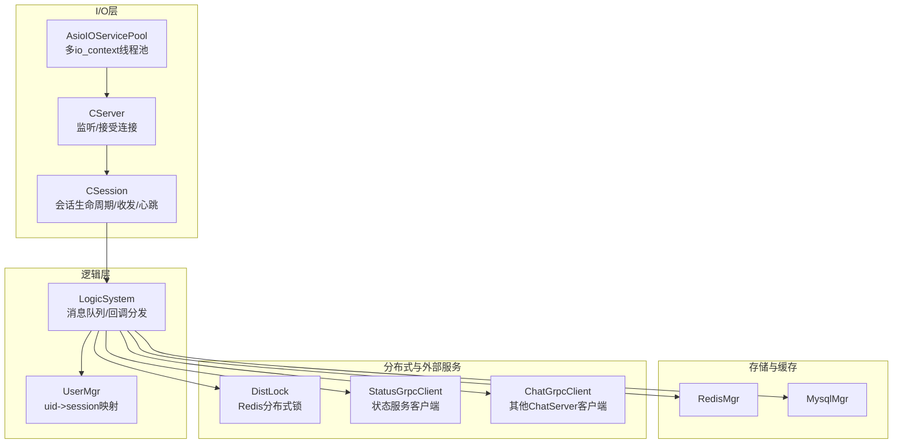

图表来源
- [AsioIOServicePool.h:1-28](file://server/ChatServer/include/AsioIOServicePool.h#L1-L28)
- [CServer.h:1-39](file://server/ChatServer/include/CServer.h#L1-L39)
- [CSession.h:1-86](file://server/ChatServer/include/CSession.h#L1-L86)
- [LogicSystem.h:1-60](file://server/ChatServer/include/LogicSystem.h#L1-L60)
- [UserMgr.h:1-22](file://server/ChatServer/include/UserMgr.h#L1-L22)
- [DistLock.h:1-18](file://server/ChatServer/include/DistLock.h#L1-L18)
- [StatusGrpcClient.h:1-99](file://server/ChatServer/include/StatusGrpcClient.h#L1-L99)
- [ChatGrpcClient.h:1-116](file://server/ChatServer/include/ChatGrpcClient.h#L1-L116)

章节来源
- [CServer.h:1-39](file://server/ChatServer/include/CServer.h#L1-L39)
- [AsioIOServicePool.h:1-28](file://server/ChatServer/include/AsioIOServicePool.h#L1-L28)

## 核心组件
- AsioIOServicePool：按硬件并发度创建多个 io_context，轮询分配，提升吞吐与隔离性
- CServer：监听端口、接受连接、维护活跃 session 集合、定时器心跳扫描与清理
- CSession：封装 socket、发送队列、接收缓冲、心跳时间戳、异常处理与关闭
- LogicSystem：单例，维护消息队列与工作线程，注册各消息类型的回调处理器
- UserMgr：维护 uid 到 session 的映射，支持设置、移除与查询
- DistLock：基于 Redis 的分布式锁获取与释放
- StatusGrpcClient/ChatGrpcClient：gRPC 连接池与客户端封装，用于跨服务调用

章节来源
- [AsioIOServicePool.h:1-28](file://server/ChatServer/include/AsioIOServicePool.h#L1-L28)
- [CServer.h:1-39](file://server/ChatServer/include/CServer.h#L1-L39)
- [CSession.h:1-86](file://server/ChatServer/include/CSession.h#L1-L86)
- [LogicSystem.h:1-60](file://server/ChatServer/include/LogicSystem.h#L1-L60)
- [UserMgr.h:1-22](file://server/ChatServer/include/UserMgr.h#L1-L22)
- [DistLock.h:1-18](file://server/ChatServer/include/DistLock.h#L1-L18)
- [StatusGrpcClient.h:1-99](file://server/ChatServer/include/StatusGrpcClient.h#L1-L99)
- [ChatGrpcClient.h:1-116](file://server/ChatServer/include/ChatGrpcClient.h#L1-L116)

## 架构总览
ChatServer 以 Asio 事件驱动为核心，结合单例模式与队列解耦，形成高并发、可扩展的聊天服务。关键流程如下：
- 连接建立：CServer 接受连接，创建 CSession，加入活跃会话表
- 消息解析：CSession 读取头部与体，组装 RecvNode，投递至 LogicSystem 队列
- 逻辑处理：LogicSystem 工作线程取出节点，根据 msg_type 分发给对应回调
- 状态同步：通过 StatusGrpcClient 与 StatusServer 交互完成登录校验与路由
- 跨服通知：通过 ChatGrpcClient 向目标 ChatServer 推送消息（如好友申请、文本消息）
- 资源协调：图片/文件上传走 ResourceServer，ChatServer 仅做信令通知与进度协调

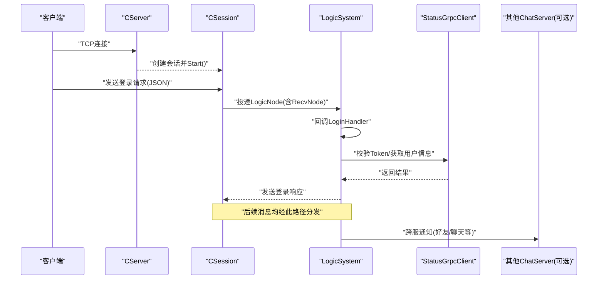

图表来源
- [CServer.cpp:21-38](file://server/ChatServer/src/CServer.cpp#L21-L38)
- [CSession.h:38-51](file://server/ChatServer/include/CSession.h#L38-L51)
- [LogicSystem.cpp:83-114](file://server/ChatServer/src/LogicSystem.cpp#L83-L114)
- [StatusGrpcClient.h:82-99](file://server/ChatServer/include/StatusGrpcClient.h#L82-L99)
- [ChatGrpcClient.h:96-112](file://server/ChatServer/include/ChatGrpcClient.h#L96-L112)

## 详细组件分析

### TCP连接管理与会话生命周期
- CServer 使用 acceptor 异步接受连接，为每个连接创建 CSession，并放入 _sessions 映射
- CSession 维护发送队列与互斥锁，保证写安全；持有上次心跳时间戳，供定时任务检查过期
- 定时器每秒扫描一次，关闭过期会话并触发异常处理流程，同时统计在线数写入 Redis

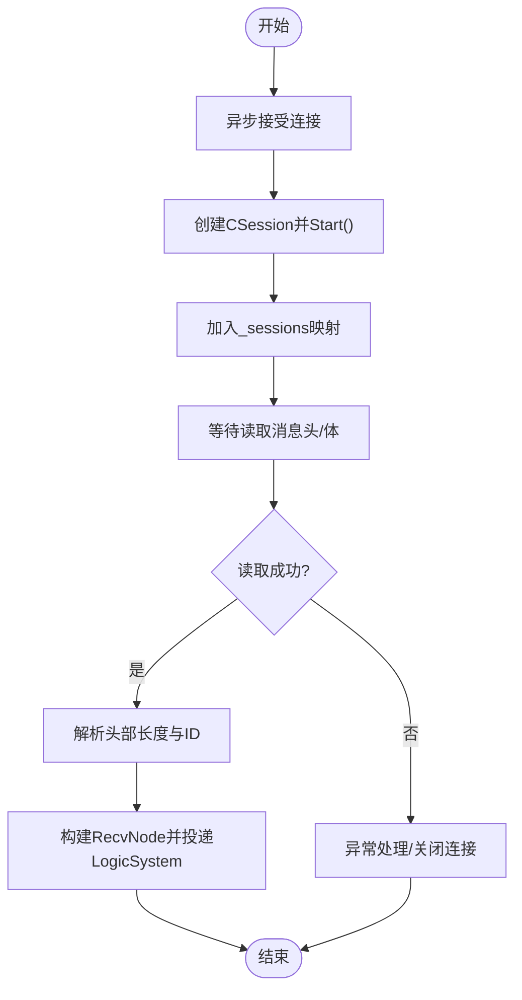

图表来源
- [CServer.cpp:21-38](file://server/ChatServer/src/CServer.cpp#L21-L38)
- [CSession.h:53-76](file://server/ChatServer/include/CSession.h#L53-L76)
- [CServer.cpp:75-118](file://server/ChatServer/src/CServer.cpp#L75-L118)

章节来源
- [CServer.cpp:21-38](file://server/ChatServer/src/CServer.cpp#L21-L38)
- [CServer.cpp:75-118](file://server/ChatServer/src/CServer.cpp#L75-L118)
- [CSession.h:53-76](file://server/ChatServer/include/CSession.h#L53-L76)

### 消息路由与处理流程
- LogicSystem 维护一个无锁入队、有锁出队的消息队列，配合条件变量唤醒工作线程
- 注册各消息类型对应的回调函数，DealMsg 循环取出节点并调用相应处理器
- 典型处理器包括登录、搜索、好友申请/认证、文本/图片聊天、心跳、加载聊天线程与消息等

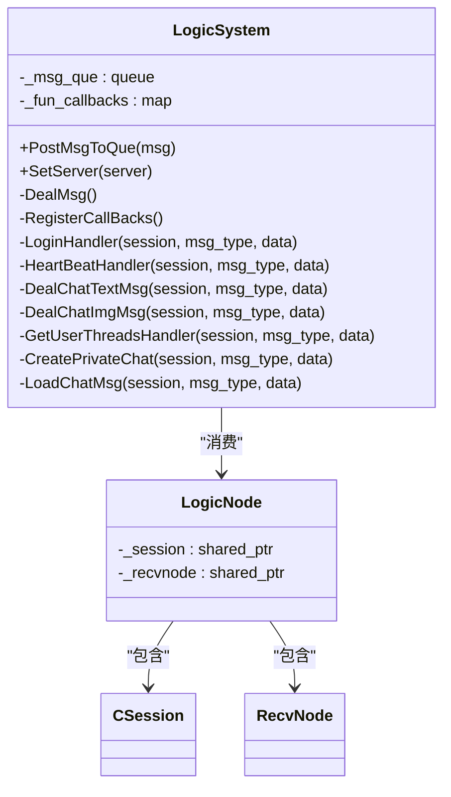

图表来源
- [LogicSystem.h:17-58](file://server/ChatServer/include/LogicSystem.h#L17-L58)
- [CSession.h:78-86](file://server/ChatServer/include/CSession.h#L78-L86)
- [MsgNode.h:32-48](file://server/ChatServer/include/MsgNode.h#L32-L48)

章节来源
- [LogicSystem.cpp:16-81](file://server/ChatServer/src/LogicSystem.cpp#L16-L81)
- [LogicSystem.cpp:83-114](file://server/ChatServer/src/LogicSystem.cpp#L83-L114)
- [LogicSystem.h:17-58](file://server/ChatServer/include/LogicSystem.h#L17-L58)

### 用户管理器与会话映射
- UserMgr 单例维护 uid -> session 的哈希表，提供设置、移除与查询接口
- 在登录成功后将 session 绑定 uid，断线时移除映射，确保路由准确性

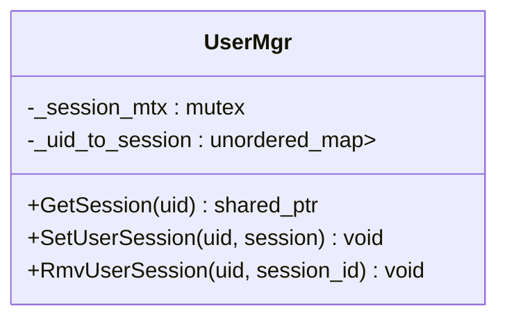

图表来源
- [UserMgr.h:8-20](file://server/ChatServer/include/UserMgr.h#L8-L20)

章节来源
- [UserMgr.h:8-20](file://server/ChatServer/include/UserMgr.h#L8-L20)

### 分布式锁与并发控制
- DistLock 提供 acquireLock 与 releaseLock，基于 Redis 原子操作实现
- 在登录等关键路径加锁，避免竞态条件，保证数据一致性
- 配置项定义锁超时与重试时间，防止死锁与长时间阻塞

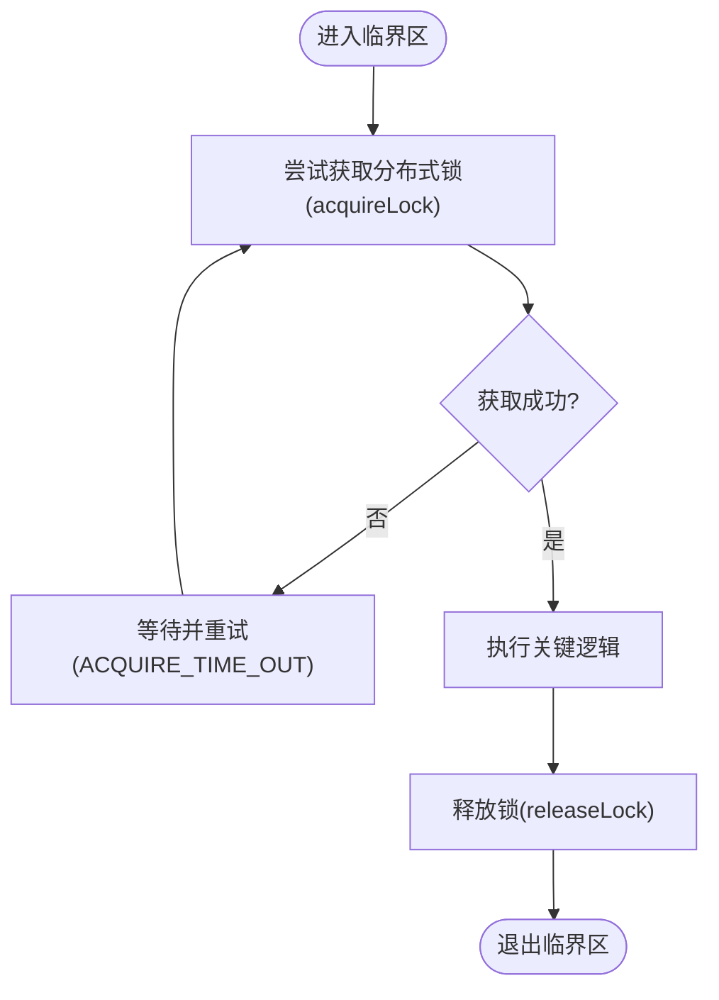

图表来源
- [DistLock.h:4-16](file://server/ChatServer/include/DistLock.h#L4-L16)
- [const.h:87-94](file://server/ChatServer/include/const.h#L87-L94)

章节来源
- [DistLock.h:4-16](file://server/ChatServer/include/DistLock.h#L4-L16)
- [const.h:87-94](file://server/ChatServer/include/const.h#L87-L94)

### 与StatusServer的状态同步
- StatusGrpcClient 维护连接池，提供 GetChatServer 与 Login 方法
- ChatServer 通过该客户端与 StatusServer 交互，完成用户路由与登录校验

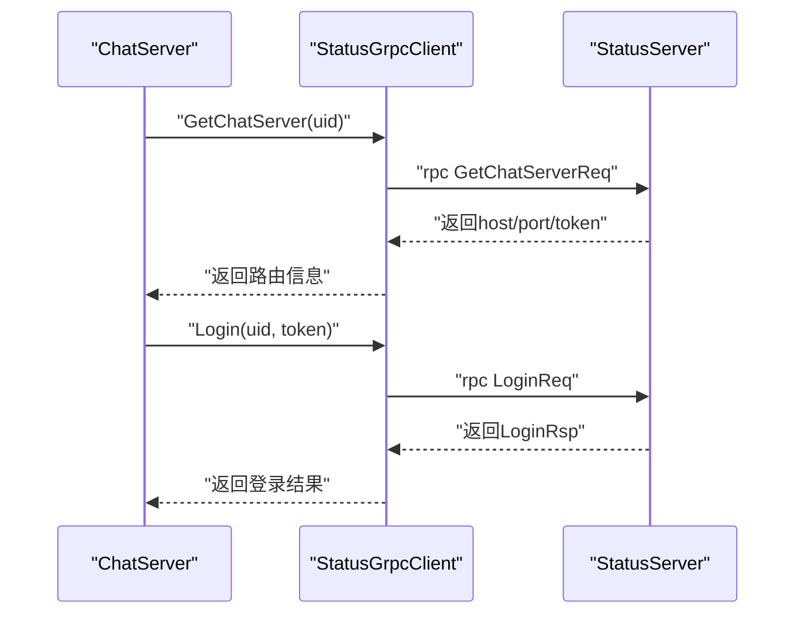

图表来源
- [StatusGrpcClient.h:82-99](file://server/ChatServer/include/StatusGrpcClient.h#L82-L99)
- [status.proto:6-31](file://proto/status_service/status.proto#L6-L31)

章节来源
- [StatusGrpcClient.h:82-99](file://server/ChatServer/include/StatusGrpcClient.h#L82-L99)
- [status.proto:6-31](file://proto/status_service/status.proto#L6-L31)

### 与ResourceServer的文件传输协调
- 图片/文件上传由 ResourceServer 负责持久化，ChatServer 仅负责信令通知
- ChatGrpcClient 提供 NotifyChatImgMsg 等接口，通知对端 ChatServer 进行下载或展示

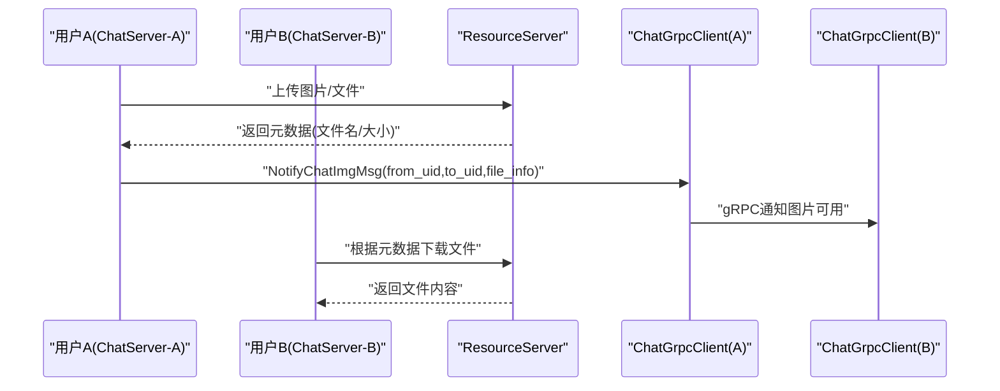

图表来源
- [ChatGrpcClient.h:96-112](file://server/ChatServer/include/ChatGrpcClient.h#L96-L112)
- [chat.proto:86-104](file://proto/chat_service/chat.proto#L86-L104)

章节来源
- [ChatGrpcClient.h:96-112](file://server/ChatServer/include/ChatGrpcClient.h#L96-L112)
- [chat.proto:86-104](file://proto/chat_service/chat.proto#L86-L104)

### 心跳检测、断线重连与故障恢复
- CSession 记录最后心跳时间，CServer 定时器周期性检查是否过期，超过阈值则 Close()
- Close() 会触发异常处理流程，清理会话映射、释放资源，必要时通知相关方
- 客户端侧应实现断线重连策略，服务端通过定时器与异常回调保障稳定性

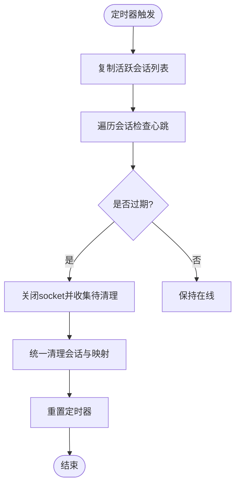

图表来源
- [CServer.cpp:75-118](file://server/ChatServer/src/CServer.cpp#L75-L118)
- [CSession.h:46-51](file://server/ChatServer/include/CSession.h#L46-L51)

章节来源
- [CServer.cpp:75-118](file://server/ChatServer/src/CServer.cpp#L75-L118)
- [CSession.h:46-51](file://server/ChatServer/include/CSession.h#L46-L51)

### 消息协议定义
- 内部消息类型定义于 const.h，涵盖登录、搜索、好友、聊天、心跳、图片、文件同步等
- 跨服务协议定义于 proto 文件，ChatService 与 StatusService 分别描述 RPC 方法与数据结构

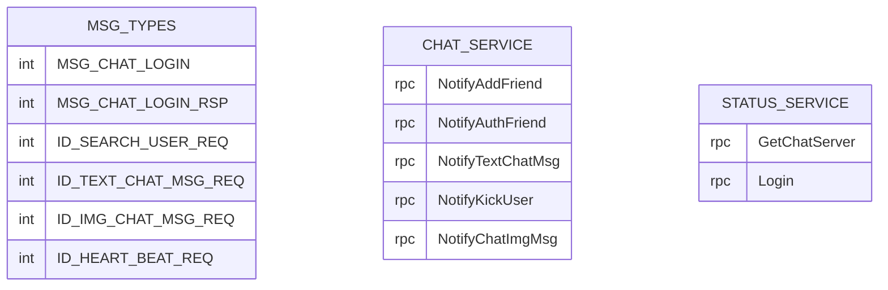

图表来源
- [const.h:49-79](file://server/ChatServer/include/const.h#L49-L79)
- [chat.proto:6-12](file://proto/chat_service/chat.proto#L6-L12)
- [status.proto:6-9](file://proto/status_service/status.proto#L6-L9)

章节来源
- [const.h:49-79](file://server/ChatServer/include/const.h#L49-L79)
- [chat.proto:6-12](file://proto/chat_service/chat.proto#L6-L12)
- [status.proto:6-9](file://proto/status_service/status.proto#L6-L9)

## 依赖关系分析
- CServer 依赖 AsioIOServicePool 获取 io_context，依赖 UserMgr 维护会话映射，依赖 RedisMgr 统计在线数
- CSession 依赖 MsgNode 进行粘包处理，依赖 LogicSystem 投递消息，依赖 ConfigMgr 获取配置
- LogicSystem 依赖 StatusGrpcClient/ChatGrpcClient 进行跨服务调用，依赖 MysqlMgr/RedisMgr 存取数据
- DistLock 依赖 hiredis 与 Redis 实现分布式锁

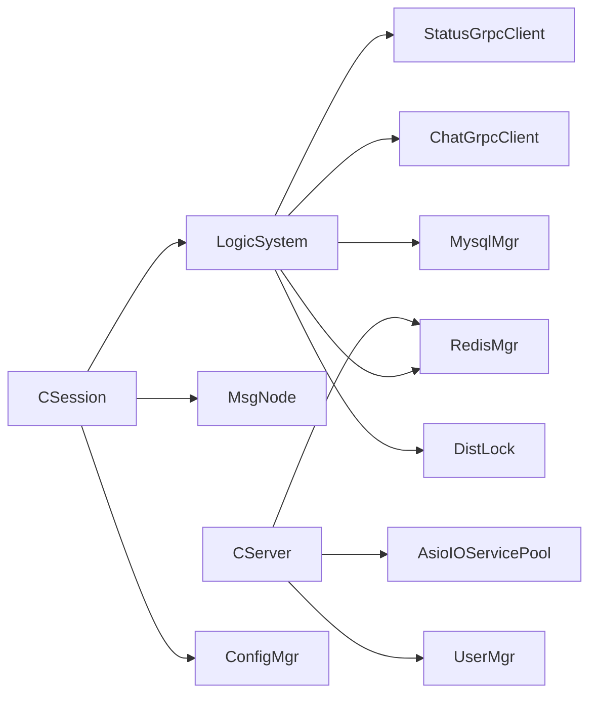

图表来源
- [CServer.cpp:1-13](file://server/ChatServer/src/CServer.cpp#L1-L13)
- [CSession.h:1-27](file://server/ChatServer/include/CSession.h#L1-L27)
- [LogicSystem.cpp:1-13](file://server/ChatServer/src/LogicSystem.cpp#L1-L13)
- [DistLock.h:1-18](file://server/ChatServer/include/DistLock.h#L1-L18)

章节来源
- [CServer.cpp:1-13](file://server/ChatServer/src/CServer.cpp#L1-L13)
- [CSession.h:1-27](file://server/ChatServer/include/CSession.h#L1-L27)
- [LogicSystem.cpp:1-13](file://server/ChatServer/src/LogicSystem.cpp#L1-L13)

## 性能考量
- I/O 模型：多 io_context 并行处理连接，降低竞争，提高吞吐
- 内存与缓冲：固定大小的接收缓冲与发送队列，限制最大长度，避免内存膨胀
- 队列与线程：LogicSystem 单工作线程串行处理消息，简化并发复杂度；可根据负载扩展为多工作线程
- 锁粒度：UserMgr 使用互斥保护映射；CSession 发送队列独立锁，减少锁竞争
- 网络优化：gRPC 连接池复用通道，减少握手开销；心跳与超时控制降低僵尸连接占用

[本节为通用指导，不直接分析具体文件]

## 故障排查指南
- 连接异常：检查 CServer::HandleAccept 错误码与日志，确认端口与防火墙
- 心跳超时：查看 CServer::on_timer 的过期判断与 Close() 行为，确认客户端心跳频率
- 登录失败：核对 StatusGrpcClient::Login 返回值与 Redis Token 键值一致性
- 消息丢失：检查 LogicSystem 队列是否积压，回调是否注册正确，是否存在未处理的 msg_type
- 分布式锁：确认 DistLock 获取/释放成对出现，避免死锁；观察 Redis 锁键是否残留

章节来源
- [CServer.cpp:21-38](file://server/ChatServer/src/CServer.cpp#L21-L38)
- [CServer.cpp:75-118](file://server/ChatServer/src/CServer.cpp#L75-L118)
- [LogicSystem.cpp:83-114](file://server/ChatServer/src/LogicSystem.cpp#L83-L114)
- [StatusGrpcClient.h:82-99](file://server/ChatServer/include/StatusGrpcClient.h#L82-L99)
- [DistLock.h:4-16](file://server/ChatServer/include/DistLock.h#L4-L16)

## 结论
ChatServer 通过 Asio 事件驱动、单例逻辑系统与队列解耦，实现了高并发、可扩展的聊天核心服务。结合分布式锁、gRPC 跨服务通信与 Redis/Mysql 数据持久化，系统具备稳定的状态同步与一致性的保障。心跳与异常处理机制提升了鲁棒性，Proto 协议定义了清晰的边界。未来可在 LogicSystem 引入多工作线程、优化消息序列化与压缩、增强监控与可观测性，进一步提升性能与可维护性。

[本节为总结，不直接分析具体文件]

## 附录
- 数据模型：UserInfo、ApplyInfo、ChatThreadInfo、ChatMessage、PageResult 等结构定义见 data.h
- 常量与错误码：ErrorCodes、MSG_TYPES、KeyPrefixes 等见 const.h
- Proto 契约：chat.proto 与 status.proto 定义跨服务接口与消息格式

章节来源
- [data.h:1-65](file://server/ChatServer/include/data.h#L1-L65)
- [const.h:1-104](file://server/ChatServer/include/const.h#L1-L104)
- [chat.proto:1-105](file://proto/chat_service/chat.proto#L1-L105)
- [status.proto:1-32](file://proto/status_service/status.proto#L1-L32)