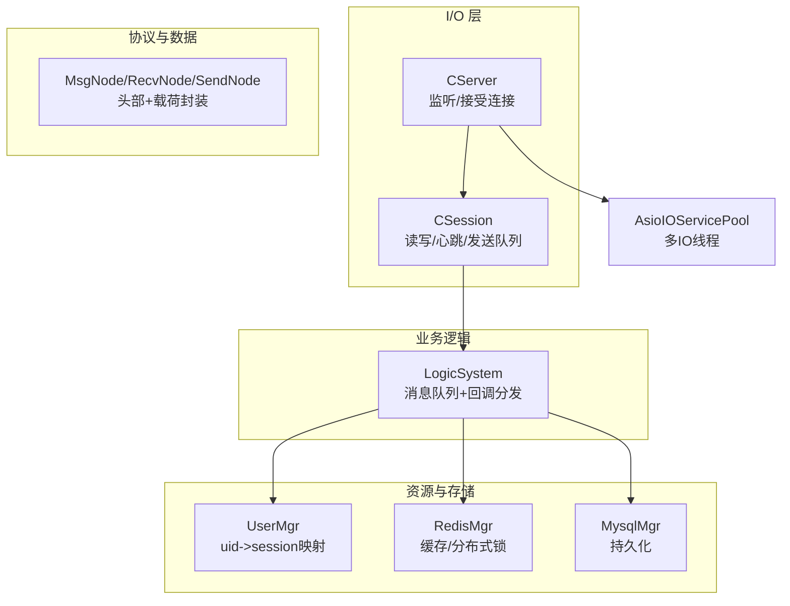
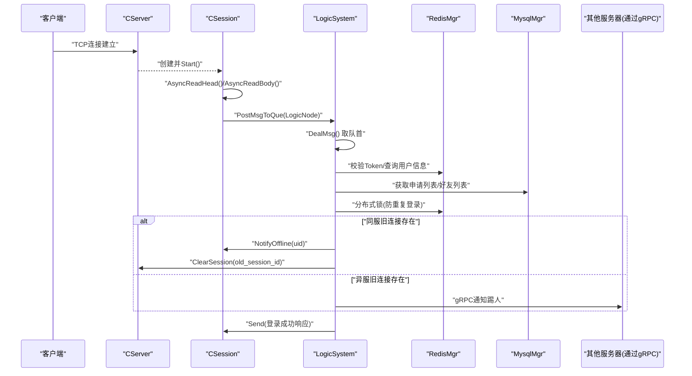
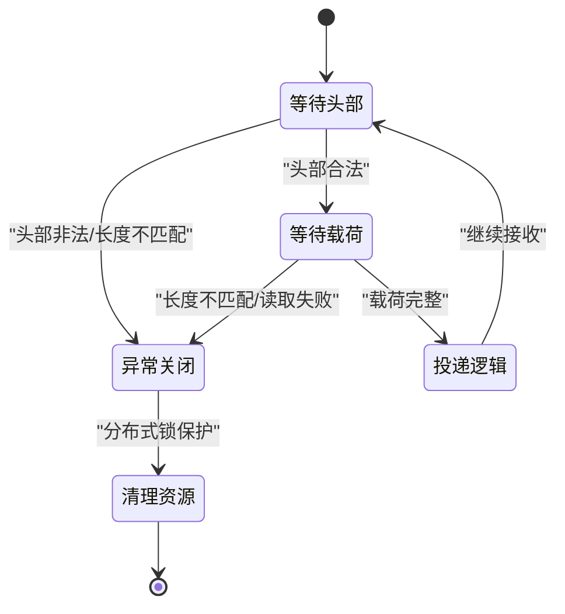
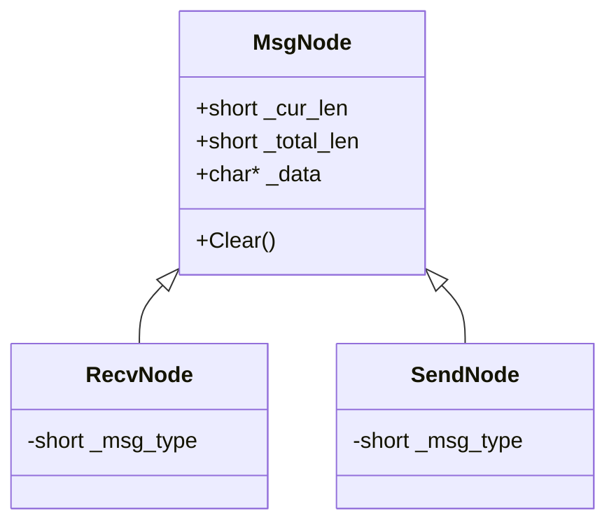
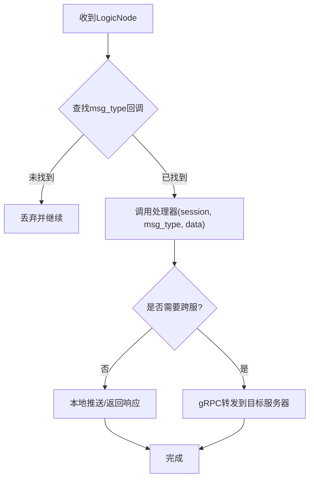
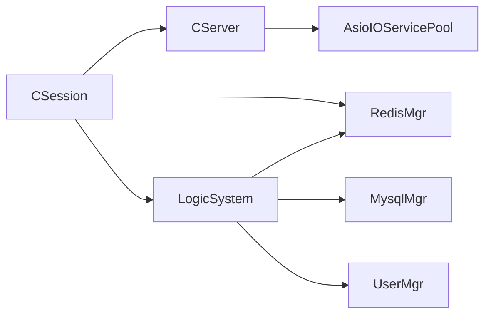

# 会话管理机制

<cite>
**本文引用的文件**   
- [CSession.h](file://server/ChatServer/include/CSession.h)
- [CSession.cpp](file://server/ChatServer/src/CSession.cpp)
- [MsgNode.h](file://server/ChatServer/include/MsgNode.h)
- [MsgNode.cpp](file://server/ChatServer/src/MsgNode.cpp)
- [CServer.h](file://server/ChatServer/include/CServer.h)
- [CServer.cpp](file://server/ChatServer/src/CServer.cpp)
- [LogicSystem.h](file://server/ChatServer/include/LogicSystem.h)
- [LogicSystem.cpp](file://server/ChatServer/src/LogicSystem.cpp)
- [const.h](file://server/ChatServer/include/const.h)
- [data.h](file://server/ChatServer/include/data.h)
- [UserMgr.h](file://server/ChatServer/include/UserMgr.h)
- [UserMgr.cpp](file://server/ChatServer/src/UserMgr.cpp)
- [RedisMgr.h](file://server/ChatServer/include/RedisMgr.h)
- [MysqlMgr.h](file://server/ChatServer/include/MysqlMgr.h)
- [AsioIOServicePool.h](file://server/ChatServer/include/AsioIOServicePool.h)
</cite>

## 目录
1. [引言](#引言)
2. [项目结构](#项目结构)
3. [核心组件](#核心组件)
4. [架构总览](#架构总览)
5. [详细组件分析](#详细组件分析)
6. [依赖关系分析](#依赖关系分析)
7. [性能考量](#性能考量)
8. [故障排查指南](#故障排查指南)
9. [结论](#结论)
10. [附录](#附录)

## 引言
本文件面向 ChatServer 的会话管理系统，围绕 CSession 的生命周期、消息收发与协议编解码、逻辑处理队列、状态机与超时清理、分布式锁与会话持久化、跨服务通知与踢人机制等进行系统化说明。文档同时给出可视化图示（类图、时序图、流程图），帮助读者快速理解从连接建立到认证、消息转发、心跳检测、异常恢复的全链路流程。

## 项目结构
ChatServer 采用分层与职责分离的设计：
- I/O 层：基于 Boost.Asio 的异步 TCP 服务器与连接会话管理（CServer、CSession）
- 协议与数据层：消息节点封装与网络字节序编解码（MsgNode）
- 业务逻辑层：消息路由与处理器注册（LogicSystem）
- 资源与存储层：用户会话映射（UserMgr）、Redis 缓存与分布式锁（RedisMgr）、MySQL 数据访问（MysqlMgr）
- IO 线程池：多核并行调度（AsioIOServicePool）

图表来源
- [CServer.h:1-39](file://server/ChatServer/include/CServer.h#L1-L39)
- [CSession.h:1-86](file://server/ChatServer/include/CSession.h#L1-L86)
- [MsgNode.h:1-48](file://server/ChatServer/include/MsgNode.h#L1-L48)
- [LogicSystem.h:1-60](file://server/ChatServer/include/LogicSystem.h#L1-L60)
- [UserMgr.h:1-22](file://server/ChatServer/include/UserMgr.h#L1-L22)
- [RedisMgr.h:1-305](file://server/ChatServer/include/RedisMgr.h#L1-L305)
- [MysqlMgr.h:1-41](file://server/ChatServer/include/MysqlMgr.h#L1-L41)
- [AsioIOServicePool.h:1-28](file://server/ChatServer/include/AsioIOServicePool.h#L1-L28)

章节来源
- [CServer.cpp:1-133](file://server/ChatServer/src/CServer.cpp#L1-L133)
- [CSession.cpp:1-335](file://server/ChatServer/src/CSession.cpp#L1-L335)
- [MsgNode.cpp:1-18](file://server/ChatServer/src/MsgNode.cpp#L1-L18)
- [LogicSystem.cpp:1-800](file://server/ChatServer/src/LogicSystem.cpp#L1-L800)

## 核心组件
- CSession：封装单个 TCP 连接的读写、心跳、发送队列、异常清理；维护 session_id、用户 uid、最后心跳时间等。
- MsgNode/RecvNode/SendNode：统一的消息节点抽象，支持头部（类型+长度）与载荷组装，自动进行网络字节序转换。
- LogicSystem：单例消息总线，持有工作线程与条件变量，按 msg_type 分发给对应处理器。
- CServer：TCP 监听、Accept、会话集合管理、定时器扫描过期会话。
- UserMgr：uid 到 CSession 的内存映射，用于在线推送与踢人。
- RedisMgr：连接池、键值操作、分布式锁实现。
- MysqlMgr：用户、好友、聊天消息等持久化接口。
- AsioIOServicePool：多 io_context 轮询分配，提升并发吞吐。

章节来源
- [CSession.h:1-86](file://server/ChatServer/include/CSession.h#L1-L86)
- [MsgNode.h:1-48](file://server/ChatServer/include/MsgNode.h#L1-L48)
- [LogicSystem.h:1-60](file://server/ChatServer/include/LogicSystem.h#L1-L60)
- [CServer.h:1-39](file://server/ChatServer/include/CServer.h#L1-L39)
- [UserMgr.h:1-22](file://server/ChatServer/include/UserMgr.h#L1-L22)
- [RedisMgr.h:1-305](file://server/ChatServer/include/RedisMgr.h#L1-L305)
- [MysqlMgr.h:1-41](file://server/ChatServer/include/MysqlMgr.h#L1-L41)
- [AsioIOServicePool.h:1-28](file://server/ChatServer/include/AsioIOServicePool.h#L1-L28)

## 架构总览
下图展示一次“登录”请求从客户端到服务器的完整调用链，包括认证、会话绑定、跨服踢人与响应返回。

图表来源
- [CServer.cpp:21-38](file://server/ChatServer/src/CServer.cpp#L21-L38)
- [CSession.cpp:39-41](file://server/ChatServer/src/CSession.cpp#L39-L41)
- [CSession.cpp:130-191](file://server/ChatServer/src/CSession.cpp#L130-L191)
- [LogicSystem.cpp:116-252](file://server/ChatServer/src/LogicSystem.cpp#L116-L252)
- [RedisMgr.h:267-305](file://server/ChatServer/include/RedisMgr.h#L267-L305)
- [MysqlMgr.h:1-41](file://server/ChatServer/include/MysqlMgr.h#L1-L41)

## 详细组件分析

### CSession 会话生命周期与状态机
- 连接建立：CServer::HandleAccept 创建 CSession 并调用 Start()，进入读取头部流程。
- 头部解析：AsyncReadHead 解析固定长度的头部（msg_type、msg_len），校验合法性后构造 RecvNode。
- 载荷读取：AsyncReadBody 循环读取指定长度，拷贝至 _recv_msg_node，更新心跳时间，投递到 LogicSystem。
- 发送队列：Send 将 SendNode 入队，若队列为空则立即发起 async_write；HandleWrite 完成后出队并继续发送。
- 心跳与超时：IsHeartbeatExpired 判断是否超过阈值（默认20秒），CServer 定时器周期性扫描并关闭过期会话。
- 异常处理：任何读/写错误都会触发 Close + DealExceptionSession，使用分布式锁保证同一用户只清理一次，并清理 Redis 中的会话、IP、Token 等信息。

图表来源
- [CSession.cpp:39-41](file://server/ChatServer/src/CSession.cpp#L39-L41)
- [CSession.cpp:130-191](file://server/ChatServer/src/CSession.cpp#L130-L191)
- [CSession.cpp:87-128](file://server/ChatServer/src/CSession.cpp#L87-L128)
- [CSession.cpp:193-217](file://server/ChatServer/src/CSession.cpp#L193-L217)
- [CSession.cpp:285-333](file://server/ChatServer/src/CSession.cpp#L285-L333)
- [CServer.cpp:75-118](file://server/ChatServer/src/CServer.cpp#L75-L118)

章节来源
- [CSession.h:28-76](file://server/ChatServer/include/CSession.h#L28-L76)
- [CSession.cpp:1-335](file://server/ChatServer/src/CSession.cpp#L1-L335)
- [CServer.cpp:75-118](file://server/ChatServer/src/CServer.cpp#L75-L118)

### MsgNode 消息节点设计
- MsgNode：统一基类，管理动态分配的 _data 缓冲区、_total_len 与 _cur_len，提供 Clear 重置。
- RecvNode：继承自 MsgNode，记录 _msg_type，用于接收侧解析。
- SendNode：继承自 MsgNode，在构造时写入头部（网络字节序）与载荷，便于直接发送。

图表来源
- [MsgNode.h:9-48](file://server/ChatServer/include/MsgNode.h#L9-L48)
- [MsgNode.cpp:1-18](file://server/ChatServer/src/MsgNode.cpp#L1-L18)

章节来源
- [MsgNode.h:1-48](file://server/ChatServer/include/MsgNode.h#L1-L48)
- [MsgNode.cpp:1-18](file://server/ChatServer/src/MsgNode.cpp#L1-L18)

### LogicSystem 消息路由与处理器
- 注册回调：RegisterCallBacks 将 msg_type 映射到具体处理器函数（登录、搜索、好友申请、文本/图片聊天、心跳等）。
- 工作线程：DealMsg 阻塞等待条件变量，取出 LogicNode 执行对应处理器，避免 I/O 阻塞主线程。
- 典型流程：以文本聊天为例，解析 JSON，批量插入数据库，构造响应，根据目标 uid 所在服务器选择本地推送或 gRPC 转发。

图表来源
- [LogicSystem.cpp:83-114](file://server/ChatServer/src/LogicSystem.cpp#L83-L114)
- [LogicSystem.cpp:43-81](file://server/ChatServer/src/LogicSystem.cpp#L43-L81)
- [LogicSystem.cpp:472-566](file://server/ChatServer/src/LogicSystem.cpp#L472-L566)

章节来源
- [LogicSystem.h:17-58](file://server/ChatServer/include/LogicSystem.h#L17-L58)
- [LogicSystem.cpp:1-800](file://server/ChatServer/src/LogicSystem.cpp#L1-L800)

### CServer 会话管理与定时清理
- Accept：从 AsioIOServicePool 获取 io_context，创建 CSession 并启动读取。
- 会话表：维护 session_id -> CSession 的映射，提供 GetSession、CheckValid、ClearSession。
- 定时器：每60秒遍历会话副本，检查心跳是否过期，收集过期会话并调用 DealExceptionSession。

章节来源
- [CServer.h:10-37](file://server/ChatServer/include/CServer.h#L10-L37)
- [CServer.cpp:21-53](file://server/ChatServer/src/CServer.cpp#L21-L53)
- [CServer.cpp:75-118](file://server/ChatServer/src/CServer.cpp#L75-L118)

### UserMgr 用户会话映射
- 维护 uid -> shared_ptr<CSession> 的哈希表，提供设置、删除、查询接口。
- 删除时校验 session_id 一致性，防止误删异地登录的会话。

章节来源
- [UserMgr.h:8-21](file://server/ChatServer/include/UserMgr.h#L8-L21)
- [UserMgr.cpp:10-44](file://server/ChatServer/src/UserMgr.cpp#L10-L44)

### RedisMgr 缓存与分布式锁
- 连接池：初始化若干 redisContext，后台线程定期 PING 保活，失败自动重连。
- 常用操作：Get/Set/LPush/RPush/HSet/HDel/Del/ExistsKey 等。
- 分布式锁：acquireLock/releaseLock 基于 Redis 原子命令实现，配合 Defer 确保释放。

章节来源
- [RedisMgr.h:9-265](file://server/ChatServer/include/RedisMgr.h#L9-L265)
- [RedisMgr.h:267-305](file://server/ChatServer/include/RedisMgr.h#L267-L305)

### AsioIOServicePool 多IO线程
- 构造时创建硬件并发数数量的 io_context 与工作线程，GetIOService 轮询返回。
- Stop 停止所有线程，析构时清理资源。

章节来源
- [AsioIOServicePool.h:8-28](file://server/ChatServer/include/AsioIOServicePool.h#L8-L28)

## 依赖关系分析
- CSession 依赖：CServer（会话有效性检查与清理）、LogicSystem（消息投递）、RedisMgr（分布式锁）、MysqlMgr（部分场景下由 LogicSystem 调用）。
- LogicSystem 依赖：RedisMgr（缓存/锁）、MysqlMgr（持久化）、UserMgr（在线推送）、gRPC 客户端（跨服通知）。
- CServer 依赖：AsioIOServicePool（多IO线程）、UserMgr（会话清理联动）。

图表来源
- [CSession.cpp:1-335](file://server/ChatServer/src/CSession.cpp#L1-L335)
- [LogicSystem.cpp:1-800](file://server/ChatServer/src/LogicSystem.cpp#L1-L800)
- [CServer.cpp:1-133](file://server/ChatServer/src/CServer.cpp#L1-L133)

章节来源
- [CSession.cpp:1-335](file://server/ChatServer/src/CSession.cpp#L1-L335)
- [LogicSystem.cpp:1-800](file://server/ChatServer/src/LogicSystem.cpp#L1-L800)
- [CServer.cpp:1-133](file://server/ChatServer/src/CServer.cpp#L1-L133)

## 性能考量
- 发送队列限流：MAX_SENDQUE 限制队列长度，避免内存暴涨；HandleWrite 串行出队，减少竞争。
- 异步 I/O：全部读写基于 boost::asio 异步接口，避免阻塞；asyncReadFull 递归读取直到满足长度。
- 心跳与超时：20秒阈值与60秒定时器平衡实时性与开销；过期会话批量清理，降低锁竞争。
- 分布式锁粒度：以 uid 为锁键，避免全局锁；Defer 模式确保释放。
- Redis 连接池：后台保活与自动重连，降低连接抖动对业务的影响。
- 多IO线程：AsioIOServicePool 提高并发处理能力，适合高吞吐场景。

[本节为通用指导，无需特定文件引用]

## 故障排查指南
- 连接异常：查看 AsyncReadHead/AsyncReadBody 的错误码与日志，确认是否长度不匹配或网络错误。
- 发送阻塞：检查 _send_que 大小是否达到 MAX_SENDQUE，必要时调整上限或优化上游生产速率。
- 心跳超时：确认客户端是否按时发送心跳；服务端定时器是否正常触发；Redis 连接是否可用。
- 登录冲突：检查分布式锁是否成功获取；Redis 中 USERIPPREFIX 与 USERTOKENPREFIX 是否正确更新。
- 跨服通知失败：核对 gRPC 客户端配置与目标服务器名称；确认 KickUser/NotifyTextChatMsg 等 RPC 调用结果。
- 资源泄漏：关注 MsgNode 析构日志；确保异常路径均调用 Close 与 DealExceptionSession。

章节来源
- [CSession.cpp:130-191](file://server/ChatServer/src/CSession.cpp#L130-L191)
- [CSession.cpp:87-128](file://server/ChatServer/src/CSession.cpp#L87-L128)
- [CSession.cpp:193-217](file://server/ChatServer/src/CSession.cpp#L193-L217)
- [CSession.cpp:285-333](file://server/ChatServer/src/CSession.cpp#L285-L333)
- [LogicSystem.cpp:116-252](file://server/ChatServer/src/LogicSystem.cpp#L116-L252)

## 结论
ChatServer 的会话管理以 CSession 为核心，结合 MsgNode 的协议封装、LogicSystem 的消息路由、CServer 的会话与定时器管理，以及 Redis/Mysql 的缓存与持久化能力，形成高内聚、低耦合的架构。通过异步 I/O、发送队列、心跳检测与分布式锁，系统在稳定性与性能之间取得良好平衡。建议在生产环境持续监控队列长度、心跳超时率、Redis 连接健康度与 gRPC 调用成功率，并结合业务负载调优参数。

[本节为总结性内容，无需特定文件引用]

## 附录

### 关键常量与枚举
- 错误码：ErrorCodes（JSON/RPC/验证码/用户/密码/Token 等）
- 消息类型：MSG_TYPES（登录、搜索、好友、聊天、心跳、加载线程/消息、图片/文件同步等）
- 键前缀：USERIPPREFIX、USERTOKENPREFIX、USER_BASE_INFO、LOGIN_COUNT、NAME_INFO、LOCK_PREFIX、USER_SESSION_PREFIX
- 锁参数：LOCK_TIME_OUT、ACQUIRE_TIME_OUT
- 消息状态：MsgStatus（未读、发送失败、已读、未上传）
- 消息类型：ChatMsgType（TEXT/PIC/VIDEO/FILE）

章节来源
- [const.h:5-104](file://server/ChatServer/include/const.h#L5-L104)
- [data.h:1-65](file://server/ChatServer/include/data.h#L1-L65)