# 聊天逻辑系统

<cite>
**本文引用的文件**   
- [LogicSystem.h](file://server/ChatServer/include/LogicSystem.h)
- [LogicSystem.cpp](file://server/ChatServer/src/LogicSystem.cpp)
- [LogicWorker.h](file://server/ChatServer/include/LogicWorker.h)
- [LogicWorker.cpp](file://server/ChatServer/src/LogicWorker.cpp)
- [UserMgr.h](file://server/ChatServer/include/UserMgr.h)
- [UserMgr.cpp](file://server/ChatServer/src/UserMgr.cpp)
- [CSession.h](file://server/ChatServer/include/CSession.h)
- [CSession.cpp](file://server/ChatServer/src/CSession.cpp)
- [CServer.h](file://server/ChatServer/include/CServer.h)
- [MsgNode.h](file://server/ChatServer/include/MsgNode.h)
- [data.h](file://server/ChatServer/include/data.h)
- [const.h](file://server/ChatServer/include/const.h)
- [MysqlMgr.h](file://server/ChatServer/include/MysqlMgr.h)
- [RedisMgr.h](file://server/ChatServer/include/RedisMgr.h)
- [ChatGrpcClient.h](file://server/ChatServer/include/ChatGrpcClient.h)
- [ConfigMgr.h](file://server/ChatServer/include/ConfigMgr.h)
- [chat.proto](file://proto/chat_service/chat.proto)
- [utils.h](file://server/ChatServer/include/utils.h)
- [chatserver1.ini](file://server/ChatServer/config/chatserver1.ini)
- [chatserver2.ini](file://server/ChatServer/config/chatserver2.ini)
</cite>

## 更新摘要
**所做更改**   
- 实现了跨服务消息交付的分片优化，使用发送者用户ID关联的专用分片，消除了之前的3秒阻塞问题
- 改进了事务感知处理和统一信封格式，确保消息处理的顺序性和一致性
- 增强了离线消息拉取功能的健壮性，新增超大消息检测和错误处理机制
- 优化了投递确认机制，提供更可靠的消息送达保证

## 目录
1. [引言](#引言)
2. [项目结构](#项目结构)
3. [核心组件](#核心组件)
4. [架构总览](#架构总览)
5. [详细组件分析](#详细组件分析)
6. [依赖关系分析](#依赖关系分析)
7. [性能考量](#性能考量)
8. [故障排查指南](#故障排查指南)
9. [结论](#结论)
10. [附录](#附录)

## 引言
本文件面向 ChatServer 的"逻辑系统"模块，系统性梳理其业务处理流程与实现细节。重点覆盖：
- **多worker架构**：LogicSystem重构为基于LogicWorker的分片处理架构，支持并发处理优化
- **跨服务消息交付分片优化**：使用发送者用户ID关联的专用delivery workers分片，消除3秒阻塞问题
- 消息路由与分发（基于用户ID哈希的分片路由，保证同一用户请求的顺序性）
- **应用层投递确认机制**：实现消息送达确认、状态同步和可靠性保障
- **离线消息拉取功能**：支持断线重连后的消息补发和增量同步
- 好友关系验证、申请与认证流程
- 群组管理与私聊线程管理（加载线程、创建私聊、历史消息分页）
- 权限控制与登录校验（Token校验、分布式锁、踢人机制）
- UserMgr 用户管理器（会话绑定、在线列表、跨进程会话定位）
- 消息分发算法、广播策略与点对点通信（本地直发与跨服gRPC转发）
- 业务规则验证、消息过滤和内容安全（输入校验、错误码、状态机）
- 事务处理、数据一致性与并发控制（MySQL写入、Redis缓存一致性、分布式锁）
- 扩展点与插件化方案（回调注册表、协议扩展、服务间接口）

## 项目结构
ChatServer 采用分层+单例模式组织，现已升级为多worker架构：
- I/O层：CServer/CSession 负责TCP连接、粘包处理、异步读写、心跳检测
- **逻辑层**：LogicSystem维护多个LogicWorker实例，按用户ID分片处理消息；LogicWorker提供独立的FIFO队列和线程执行环境
- 数据层：MysqlMgr/RedisMgr 提供持久化与缓存能力
- 跨服通信：ChatGrpcClient 封装gRPC客户端池与通知方法
- 协议定义：chat.proto 定义跨服务消息契约

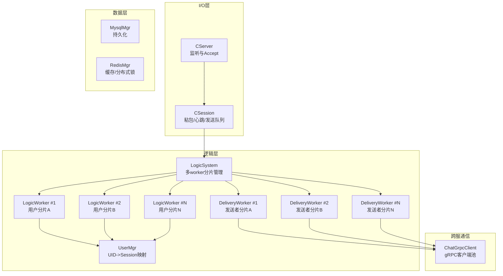

图表来源
- [CServer.h:1-39](file://server/ChatServer/include/CServer.h#L1-L39)
- [CSession.h:1-230](file://server/ChatServer/include/CSession.h#L1-L230)
- [LogicSystem.h:33-229](file://server/ChatServer/include/LogicSystem.h#L33-L229)
- [LogicWorker.h:20-61](file://server/ChatServer/include/LogicWorker.h#L20-L61)
- [UserMgr.h:1-55](file://server/ChatServer/include/UserMgr.h#L1-L55)
- [MysqlMgr.h:1-41](file://server/ChatServer/include/MysqlMgr.h#L1-L41)
- [RedisMgr.h:1-305](file://server/ChatServer/include/RedisMgr.h#L1-L305)
- [ChatGrpcClient.h:1-116](file://server/ChatServer/include/ChatGrpcClient.h#L1-L116)

章节来源
- [CServer.h:1-39](file://server/ChatServer/include/CServer.h#L1-L39)
- [CSession.h:1-230](file://server/ChatServer/include/CSession.h#L1-L230)
- [LogicSystem.h:33-229](file://server/ChatServer/include/LogicSystem.h#L33-L229)
- [LogicWorker.h:20-61](file://server/ChatServer/include/LogicWorker.h#L20-L61)
- [UserMgr.h:1-55](file://server/ChatServer/include/UserMgr.h#L1-L55)

## 核心组件
- **LogicSystem**：单例，维护多个LogicWorker实例组成的worker池；通过用户ID哈希进行分片路由；启动时根据配置文件初始化LogicWorkers和DeliveryWorkers数量。
- **LogicWorker**：独立的任务执行器，持有单个工作线程和FIFO任务队列；保证同一worker内任务的串行执行顺序。
- **UserMgr**：单例，维护uid到CSession的映射，提供设置/获取/删除会话的能力，保证并发安全。
- **CSession**：封装TCP会话，负责头部解析、粘包处理、发送队列、心跳更新与异常清理；支持路由用户ID绑定。
- **MysqlMgr/RedisMgr**：单例，分别封装数据库与缓存操作，包含连接池、健康检查、分布式锁等。
- **ChatGrpcClient**：单例，封装gRPC客户端连接池，提供跨服通知接口（好友申请、认证通过、文本消息、踢人、图片通知）。

章节来源
- [LogicSystem.cpp:37-51](file://server/ChatServer/src/LogicSystem.cpp#L37-L51)
- [LogicWorker.cpp:3-41](file://server/ChatServer/src/LogicWorker.cpp#L3-L41)
- [UserMgr.cpp:1-50](file://server/ChatServer/src/UserMgr.cpp#L1-L50)
- [CSession.cpp:150-185](file://server/ChatServer/src/CSession.cpp#L150-185)
- [RedisMgr.h:1-305](file://server/ChatServer/include/RedisMgr.h#L1-L305)
- [ChatGrpcClient.h:1-116](file://server/ChatServer/include/ChatGrpcClient.h#L1-L116)

## 架构总览
整体数据流已升级为多worker架构，并实现了跨服务消息交付的分片优化：
- 客户端通过TCP连接至CServer，CSession完成协议解析后计算用户ID哈希值作为路由键。
- LogicSystem根据路由键选择对应的LogicWorker分片，将消息投递到该worker的FIFO队列。
- LogicWorker的工作线程从队列取出任务并执行，保证同一用户的请求在同一个worker中串行处理。
- **跨服务消息优化**：对于会阻塞的gRPC调用，使用PostDelivery方法将任务投递到sender_uid固定的delivery workers分片，避免3秒deadline阻塞logic分片。
- 业务逻辑可能访问Redis（缓存/锁）、MySQL（持久化），并通过ChatGrpcClient向其他ChatServer实例或资源/状态服务发起通知。
- 结果通过CSession异步写回客户端。

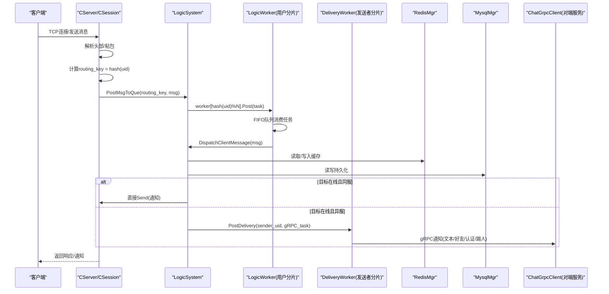

图表来源
- [CSession.cpp:159-185](file://server/ChatServer/src/CSession.cpp#L159-L185)
- [LogicSystem.cpp:61-68](file://server/ChatServer/src/LogicSystem.cpp#L61-L68)
- [LogicWorker.cpp:15-25](file://server/ChatServer/src/LogicWorker.cpp#L15-L25)
- [ChatGrpcClient.h:104-108](file://server/ChatServer/include/ChatGrpcClient.h#L104-L108)

## 详细组件分析

### 多worker架构设计（LogicSystem + LogicWorker）
- **Worker分片**：LogicSystem维护两个worker池：_logic_workers（处理客户端消息和用户相关任务）和_delivery_workers（处理阻塞的跨服gRPC调用）。
- **路由策略**：使用std::hash<int>{}(uid) % N计算worker索引，确保同一用户的所有请求进入同一个worker，保证顺序性。
- **配置驱动**：通过ConfigMgr读取[Concurrency]节下的LogicWorkers和DeliveryWorkers配置，默认值为4。
- **优雅停机**：Stop()方法确保所有worker排空队列后再退出，支持幂等调用。

**更新** 跨服务消息交付的分片优化：
- **专用delivery分片**：PostDelivery方法使用sender_uid作为路由键，将跨服gRPC调用固定到特定的delivery worker分片。
- **避免阻塞**：通过将阻塞的gRPC调用从logic workers分离到专门的delivery workers，消除了之前可能出现的3秒deadline阻塞问题。
- **顺序保证**：同一sender_uid的多次跨服调用在delivery worker上保持顺序，避免消息乱序。

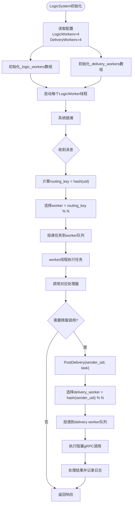

图表来源
- [LogicSystem.cpp:37-51](file://server/ChatServer/src/LogicSystem.cpp#L37-L51)
- [LogicSystem.cpp:61-84](file://server/ChatServer/src/LogicSystem.cpp#L61-L84)
- [LogicSystem.cpp:100-106](file://server/ChatServer/src/LogicSystem.cpp#L100-L106)
- [chatserver1.ini:30-32](file://server/ChatServer/config/chatserver1.ini#L30-L32)

章节来源
- [LogicSystem.h:33-229](file://server/ChatServer/include/LogicSystem.h#L33-L229)
- [LogicSystem.cpp:37-102](file://server/ChatServer/src/LogicSystem.cpp#L37-L102)
- [LogicWorker.h:20-61](file://server/ChatServer/include/LogicWorker.h#L20-L61)
- [LogicWorker.cpp:3-64](file://server/ChatServer/src/LogicWorker.cpp#L3-L64)

### 跨服务消息交付分片优化（PostDelivery）
**新增功能** 实现了基于发送者用户ID的专用分片优化：

- **分片策略**：PostDelivery方法使用std::hash<int>{}(sender_uid) % N计算delivery worker索引，确保同一发送者的跨服调用固定到同一个delivery worker。
- **阻塞隔离**：将可能阻塞的gRPC调用从logic workers分离到专门的delivery workers，避免影响正常的客户端消息处理。
- **顺序保证**：同一sender_uid的多次跨服调用在delivery worker上保持FIFO顺序，防止消息乱序。
- **优雅降级**：当delivery workers拒绝投递时（如服务停机），记录日志但不影响主流程，pending消息由receiver后续pull兜底。

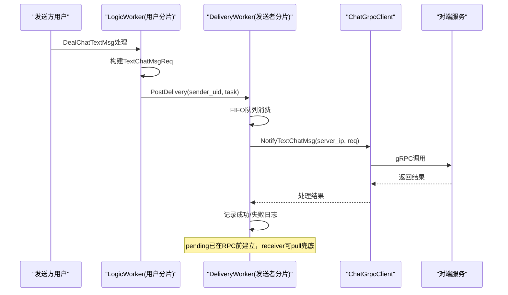

图表来源
- [LogicSystem.cpp:100-106](file://server/ChatServer/src/LogicSystem.cpp#L100-L106)
- [LogicSystem.cpp:693-730](file://server/ChatServer/src/LogicSystem.cpp#L693-L730)

章节来源
- [LogicSystem.h:63-72](file://server/ChatServer/include/LogicSystem.h#L63-L72)
- [LogicSystem.cpp:100-106](file://server/ChatServer/src/LogicSystem.cpp#L100-L106)
- [LogicSystem.cpp:693-730](file://server/ChatServer/src/LogicSystem.cpp#L693-L730)

### 消息路由与分发（LogicSystem）
- **回调注册**：在构造时通过RegisterCallBacks将msg_type与业务处理器绑定。
- **分片投递**：PostMsgToQue接收routing_key参数，通过worker[hash(routing_key)%size]选择目标worker。
- **处理器示例**：LoginHandler、SearchInfo、AddFriendApply、AuthFriendApply、DealChatTextMsg、HeartBeatHandler、GetUserThreadsHandler、CreatePrivateChat、LoadChatMsg、DealChatImgMsg。
- **错误处理**：未找到回调则丢弃并打印日志；使用Defer统一构造响应并发送。

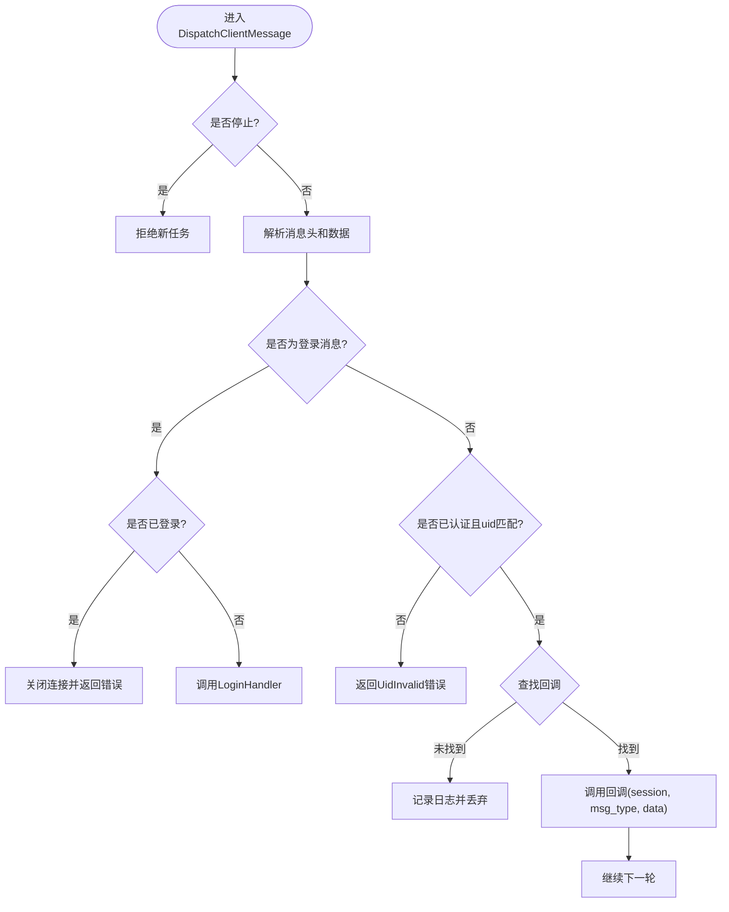

图表来源
- [LogicSystem.cpp:104-143](file://server/ChatServer/src/LogicSystem.cpp#L104-L143)
- [LogicSystem.cpp:145-176](file://server/ChatServer/src/LogicSystem.cpp#L145-L176)

章节来源
- [LogicSystem.h:33-229](file://server/ChatServer/include/LogicSystem.h#L33-L229)
- [LogicSystem.cpp:104-176](file://server/ChatServer/src/LogicSystem.cpp#L104-L176)

### 生产者-消费者模式实现（LogicWorker）
LogicWorker实现了经典的生产者-消费者模式：
- **生产者**：IO线程（CSession）或其他业务线程通过Post()方法投递任务
- **消费者**：独立的工作线程（_work_thread）负责从队列中取出任务并执行
- **同步机制**：使用互斥锁（_mutex）保护队列访问，条件变量（_cv）实现线程间通信
- **优雅关闭**：通过_stopping标志位确保服务关闭时能正确处理剩余任务

章节来源
- [LogicWorker.h:20-61](file://server/ChatServer/include/LogicWorker.h#L20-L61)
- [LogicWorker.cpp:15-64](file://server/ChatServer/src/LogicWorker.cpp#L15-L64)

### 用户管理器（UserMgr）
- **数据结构**：unordered_map<int, shared_ptr<CSession>> uid_to_session，互斥保护。
- **关键方法**：
  - SetUserSession：绑定uid与session
  - GetSession：查询uid对应的session
  - RmvUserSession：按session_id精确移除，避免误删异地登录的会话
- **并发安全**：所有操作均加锁，确保多线程安全。

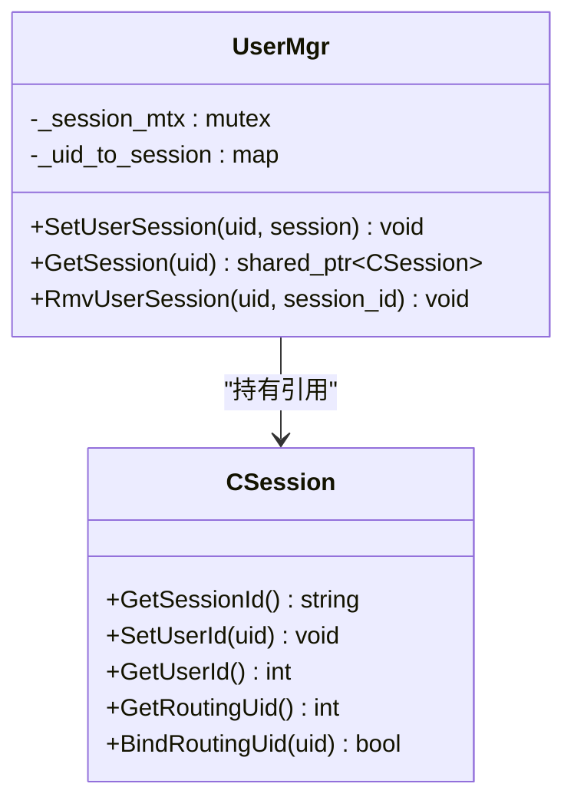

图表来源
- [UserMgr.h:1-55](file://server/ChatServer/include/UserMgr.h#L1-L55)
- [UserMgr.cpp:1-50](file://server/ChatServer/src/UserMgr.cpp#L1-L50)
- [CSession.h:80-88](file://server/ChatServer/include/CSession.h#L80-88)

章节来源
- [UserMgr.h:1-55](file://server/ChatServer/include/UserMgr.h#L1-L55)
- [UserMgr.cpp:1-50](file://server/ChatServer/src/UserMgr.cpp#L1-L50)

### 会话与网络I/O（CSession/CServer）
- **CSession职责**：
  - 异步读头/体，处理粘包与长度校验
  - 发送队列限流（MAX_SENDQUE），顺序写出
  - 心跳更新与过期检测
  - 异常连接清理（Close、ClearSession）
  - **路由用户ID绑定**：BindRoutingUid确保连接与用户ID的绑定关系
- **CServer职责**：
  - Accept新连接，维护活跃会话集合
  - 定时器任务（心跳/超时清理）
  - 会话有效性校验

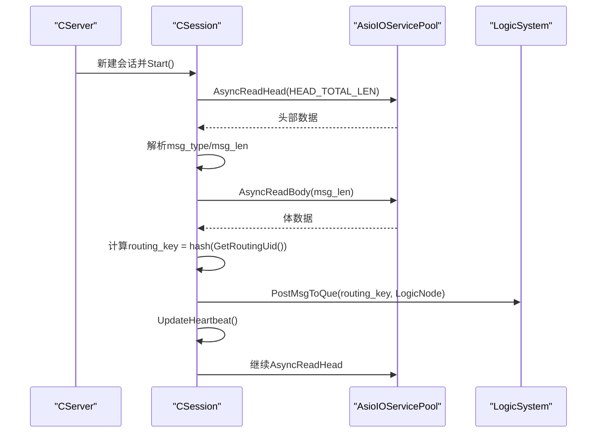

图表来源
- [CSession.cpp:196-257](file://server/ChatServer/src/CSession.cpp#L196-257)
- [CSession.cpp:150-185](file://server/ChatServer/src/CSession.cpp#L150-185)
- [CServer.h:1-39](file://server/ChatServer/include/CServer.h#L1-39)

章节来源
- [CSession.h:1-230](file://server/ChatServer/include/CSession.h#L1-L230)
- [CSession.cpp:150-349](file://server/ChatServer/src/CSession.cpp#L150-349)
- [CServer.h:1-39](file://server/ChatServer/include/CServer.h#L1-39)

### 登录与权限控制（LoginHandler）
- **Token校验**：从Redis中按utoken_{uid}读取token并与请求对比。
- **基础信息加载**：ubaseinfo_{uid}优先查缓存，否则回源MySQL并回填缓存。
- **分布式锁**：lock_{uid}防止重复登录竞态。
- **踢人逻辑**：若同uid已登录，判断是否同服；同服直接NotifyOffline并清理旧会话；异服通过gRPC通知对端踢人。
- **会话绑定**：SetUserId、USERIPPREFIX记录服务器名、USER_SESSION_PREFIX记录session_id。
- **路由绑定**：BindRoutingUid确保连接与用户ID的绑定关系，用于后续的消息路由。

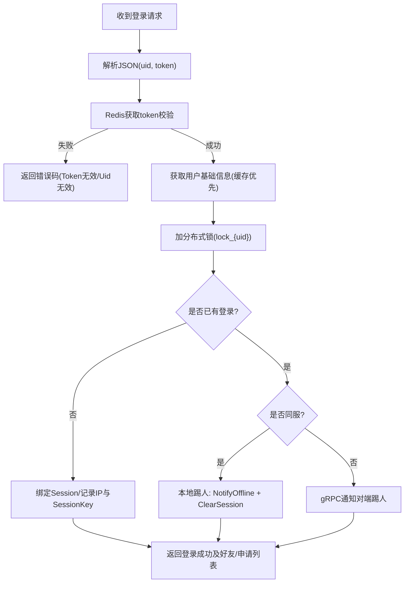

图表来源
- [LogicSystem.cpp:178-252](file://server/ChatServer/src/LogicSystem.cpp#L178-252)
- [const.h:81-94](file://server/ChatServer/include/const.h#L81-94)

章节来源
- [LogicSystem.cpp:178-252](file://server/ChatServer/src/LogicSystem.cpp#L178-252)
- [const.h:1-104](file://server/ChatServer/include/const.h#L1-104)

### 好友关系与认证（AddFriendApply/AuthFriendApply）
- **申请流程**：
  - 写入MySQL申请记录
  - 查询目标用户所在服务器（USERIPPREFIX）
  - 同服：直接通过UserMgr获取session并推送通知
  - 异服：构造AddFriendReq并通过ChatGrpcClient.NotifyAddFriend转发
- **认证流程**：
  - 更新好友关系（AddFriend），同时拉取历史聊天记录（AddFriendMsg）
  - 同服：直接推送认证通过通知与历史消息
  - 异服：构造AuthFriendReq并通过gRPC转发

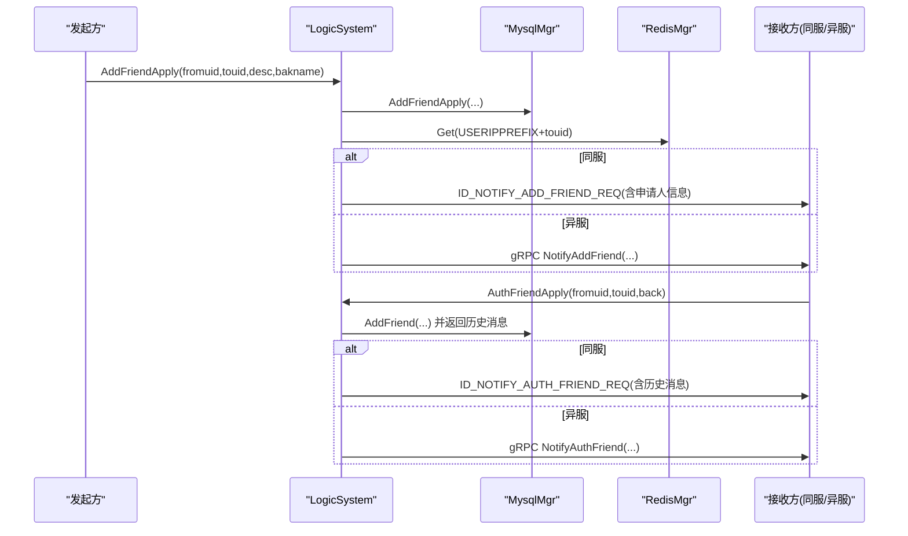

图表来源
- [LogicSystem.cpp:277-352](file://server/ChatServer/src/LogicSystem.cpp#L277-352)
- [LogicSystem.cpp:354-470](file://server/ChatServer/src/LogicSystem.cpp#L354-470)
- [chat.proto:14-51](file://proto/chat_service/chat.proto#L14-51)

章节来源
- [LogicSystem.cpp:277-470](file://server/ChatServer/src/LogicSystem.cpp#L277-470)
- [chat.proto:14-51](file://proto/chat_service/chat.proto#L14-51)

### 文本消息处理（DealChatTextMsg）
- **解析fromuid/touid/text_array**，生成ChatMessage列表，批量插入MySQL。
- **构造响应**（包含message_id、unique_id、content、status、chat_time）。
- **目标在线判定**：
  - 同服：直接通过UserMgr获取session并推送ID_NOTIFY_TEXT_CHAT_MSG_REQ
  - 异服：**使用PostDelivery分片优化**，构造TextChatMsgReq并通过gRPC转发，同时携带响应数据

**更新** 跨服务消息处理的分片优化：
- **分片投递**：异服消息通过PostDelivery(sender_uid, task)投递到sender_uid固定的delivery worker分片。
- **避免阻塞**：gRPC调用在独立的delivery worker上执行，不会阻塞logic worker。
- **顺序保证**：同一sender_uid的多次跨服调用保持顺序，防止消息乱序。
- **容错处理**：gRPC失败时记录日志，pending消息已由receiver pull兜底。

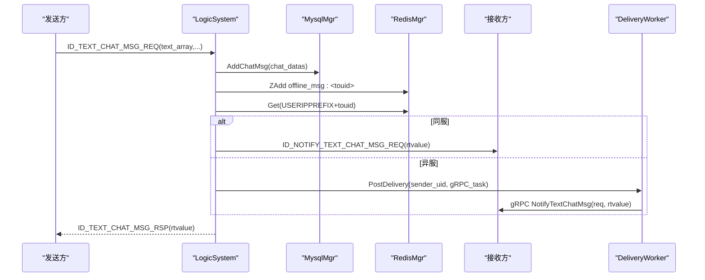

图表来源
- [LogicSystem.cpp:472-566](file://server/ChatServer/src/LogicSystem.cpp#L472-566)
- [LogicSystem.cpp:693-730](file://server/ChatServer/src/LogicSystem.cpp#L693-L730)
- [chat.proto:53-74](file://proto/chat_service/chat.proto#L53-74)

章节来源
- [LogicSystem.cpp:472-566](file://server/ChatServer/src/LogicSystem.cpp#L472-566)
- [chat.proto:53-74](file://proto/chat_service/chat.proto#L53-74)

### 心跳处理（HeartBeatHandler）
- **简单回显ID_HEARTBEAT_RSP**，用于客户端保活检测。
- **CSession内部维护_last_heartbeat原子时间戳**，支持IsHeartbeatExpired与UpdateHeartbeat。

章节来源
- [LogicSystem.cpp:568-575](file://server/ChatServer/src/LogicSystem.cpp#L568-575)
- [CSession.h:46-49](file://server/ChatServer/include/CSession.h#L46-49)

### 聊天线程与消息加载（GetUserThreadsHandler/CreatePrivateChat/LoadChatMsg）
- **GetUserThreadsHandler**：分页加载用户的聊天线程（私聊/群聊），返回thread_id、类型、参与者等信息。
- **CreatePrivateChat**：创建私聊线程并返回thread_id。
- **LoadChatMsg**：按thread_id与lastId分页加载历史消息，返回PageResult（messages、load_more、next_cursor）。

章节来源
- [LogicSystem.cpp:775-800](file://server/ChatServer/src/LogicSystem.cpp#L775-800)
- [data.h:32-58](file://server/ChatServer/include/data.h#L32-58)
- [MysqlMgr.h:24-35](file://server/ChatServer/include/MysqlMgr.h#L24-35)

### 图片消息处理（DealChatImgMsg）
- **解析图片消息参数**，生成NotifyChatImgReq并通过gRPC通知接收方（或同服直接推送）。
- **结合资源服务进行断点续传与进度显示**（参考项目文档）。

章节来源
- [chat.proto:86-104](file://proto/chat_service/chat.proto#L86-104)
- [LogicSystem.cpp:896-943](file://server/ChatServer/src/LogicSystem.cpp#L896-943)

### 用户搜索功能（SearchInfo）
- **智能搜索**：支持按uid或用户名搜索，通过isPureDigit函数判断搜索类型。
- **缓存优先**：优先从Redis缓存获取用户信息，不存在时回源MySQL并回填缓存。
- **统一响应格式**：无论哪种搜索方式都返回相同的UserInfo结构。

章节来源
- [LogicSystem.cpp:254-275](file://server/ChatServer/src/LogicSystem.cpp#L254-275)
- [LogicSystem.cpp:577-585](file://server/ChatServer/src/LogicSystem.cpp#L577-585)

### 应用层投递确认机制（DealDeliveryAck）
实现了完整的应用层消息投递确认机制，确保消息可靠送达：

- **消息格式**：请求格式为`{"uid":<receiver>,"message_ids":[...]}`，响应格式为`{"error":0,"message_ids":[...]}`
- **严格验证**：
  - JSON对象格式验证
  - uid必须为正整数且等于当前连接的已认证用户ID（防越权）
  - message_ids必须为非空数组，每项为正整数
  - 使用std::set去重并升序排序
- **数据库验证**：通过GetMessagesByIds验证消息所有权，确保只确认属于当前接收者的消息
- **状态更新**：成功后调用MarkMessagesDelivered更新delivery_status为Acked
- **Redis清理**：从offline_msg:<uid>有序集合中删除已确认的消息ID
- **幂等处理**：重复ACK请求仍能正常返回成功

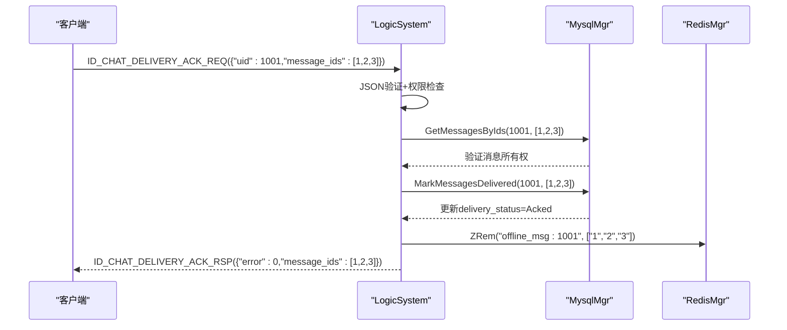

图表来源
- [LogicSystem.cpp:1133-1215](file://server/ChatServer/src/LogicSystem.cpp#L1133-1215)
- [const.h:105-108](file://server/ChatServer/include/const.h#L105-108)

章节来源
- [LogicSystem.cpp:1133-1215](file://server/ChatServer/src/LogicSystem.cpp#L1133-1215)
- [const.h:105-108](file://server/ChatServer/include/const.h#L105-108)

### 离线消息拉取功能（PullOfflineMsg）
实现了基于游标的离线消息拉取机制，支持断线重连后的消息补发：

- **消息格式**：请求格式为`{"uid":<receiver>,"after_message_id":<id>,"limit":<n>}`，响应格式为`{"error":0,"messages":[...],"next_message_id":<id>,"has_more":<bool>}`
- **配置驱动**：通过ReadDeliveryInt读取Delivery配置节的参数：
  - OfflinePullBatch：默认100条/次
  - PullMaxBytes：默认30000字节限制
  - OfflineTtlSeconds：默认604800秒（7天）过期时间
- **双重数据源**：
  - Redis有序集合：ZRangeByScore(cursor, limit+1)获取候选ID
  - MySQL数据库：GetPendingMessages(uid, cursor, limit)获取待投递消息
- **智能合并**：并集Redis和MySQL结果，按message_id去重升序
- **数据一致性**：缺失Redis ID的DB pending消息自动回填到Redis
- **字节限制**：以dump()后UTF-8字节数为准，超过PullMaxBytes上限前停止
- **游标推进**：始终至少包含第一条消息以确保cursor推进

**更新** 修复了严重的消息大小验证bug，新增了严格的超大消息处理策略：

- **超大消息跟踪**：新增oversized_message_id和oversized_bytes变量，用于记录导致超限的消息ID和字节数
- **严格的第一条消息处理**：当第一条消息就超过PullMaxBytes时，不再推进游标，而是返回显式的RPCFailed错误
- **增强的日志记录**：在生产环境中记录详细的超大消息信息，包括uid、message_id、实际字节数和配置限制
- **健壮的字节限制检查**：使用tentative response机制，在添加每条消息前先测量完整响应大小
- **防止网络截断**：确保响应不会被CSession::Send的short长度字段截断，避免客户端卡死

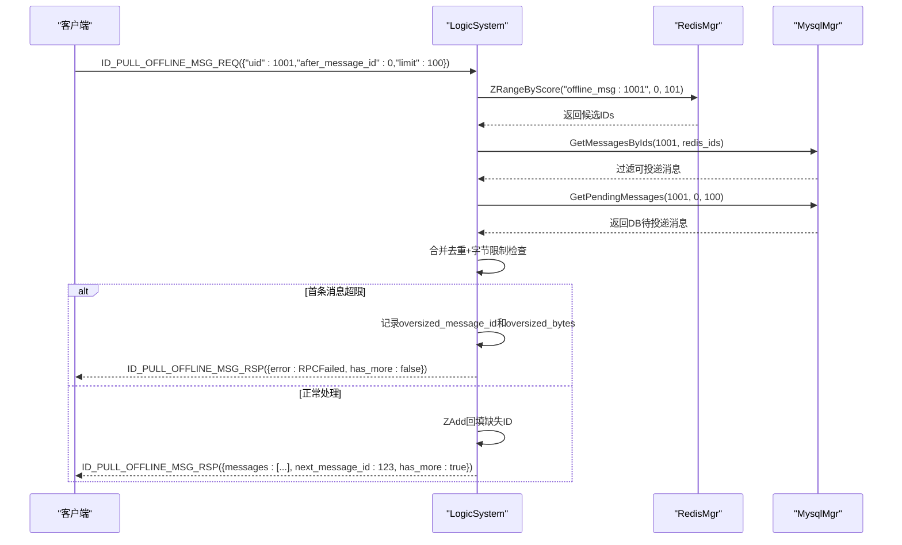

图表来源
- [LogicSystem.cpp:1217-1418](file://server/ChatServer/src/LogicSystem.cpp#L1217-1418)
- [const.h:107-109](file://server/ChatServer/include/const.h#L107-109)

章节来源
- [LogicSystem.cpp:1217-1418](file://server/ChatServer/src/LogicSystem.cpp#L1217-1418)
- [const.h:107-109](file://server/ChatServer/include/const.h#L107-109)

### 消息信封构建（BuildMessageEnvelope）
标准化了消息信封的构建过程，确保一致的序列化格式：

- **字段完整性**：包含message_id、unique_id、thread_id、fromuid、touid、msg_type、content、content_size、chat_time、status等所有必要字段
- **精度保证**：content_size统一转换为十进制字符串，避免Qt JSON number对64位文件大小丢精度
- **类型转换**：确保所有数值类型正确转换，字符串类型保持原始格式
- **复用性**：被PullOfflineMsg和其他需要消息序列化的地方统一调用

章节来源
- [LogicSystem.cpp:1117-1131](file://server/ChatServer/src/LogicSystem.cpp#L1117-1131)
- [LogicSystem.h:240-244](file://server/ChatServer/include/LogicSystem.h#L240-244)

### 配置管理（ReadDeliveryInt）
提供了统一的配置读取接口，支持Delivery配置节的参数管理：

- **配置路径**：从[Delivery]配置节读取参数
- **类型验证**：严格验证配置值为正整数
- **默认回退**：配置缺失或非法时使用fallback默认值
- **异常处理**：捕获所有异常，确保配置读取不影响主流程

章节来源
- [LogicSystem.cpp:40-56](file://server/ChatServer/src/LogicSystem.cpp#L40-56)

## 依赖关系分析
- **LogicSystem依赖**：
  - CSession：发送响应、获取session
  - MysqlMgr：用户信息、好友关系、聊天消息、线程管理
  - RedisMgr：缓存、分布式锁、在线位置
  - ChatGrpcClient：跨服通知
  - **LogicWorker**：任务执行和队列管理
- **UserMgr依赖**：CSession（会话对象）
- **CSession依赖**：CServer（会话生命周期管理）、LogicSystem（消息投递）

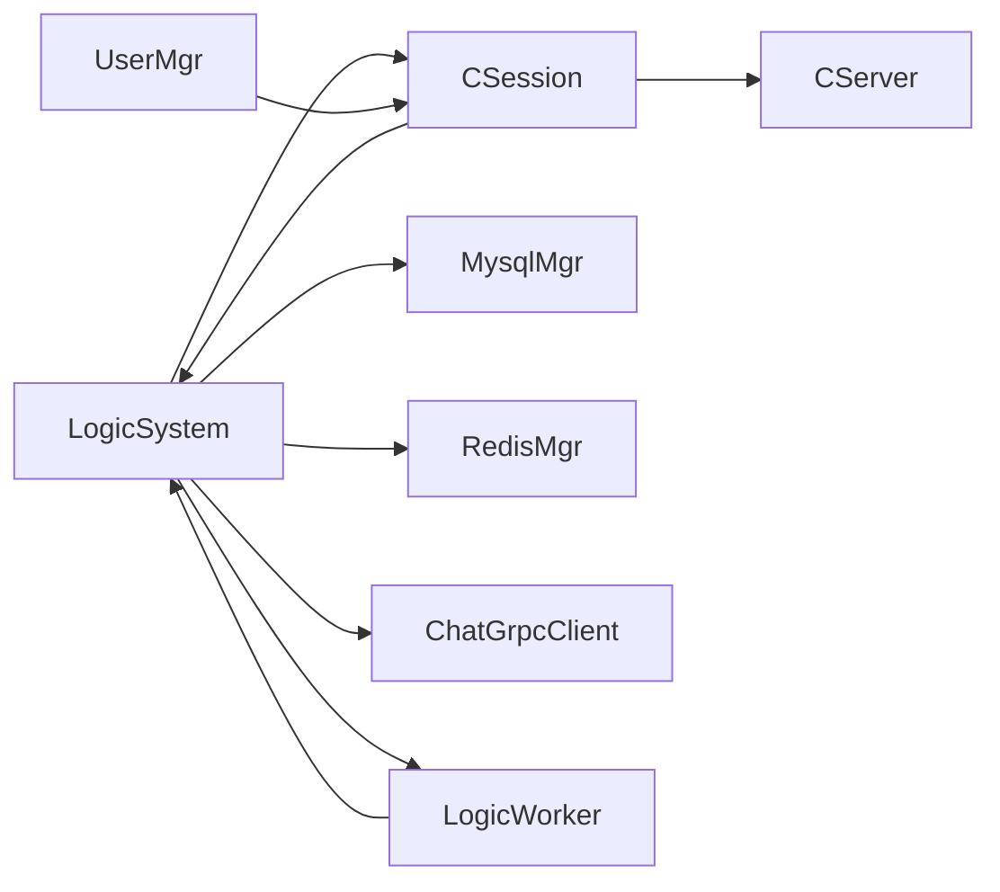

图表来源
- [LogicSystem.cpp:1-102](file://server/ChatServer/src/LogicSystem.cpp#L1-102)
- [LogicWorker.cpp:1-64](file://server/ChatServer/src/LogicWorker.cpp#L1-L64)
- [UserMgr.cpp:1-50](file://server/ChatServer/src/UserMgr.cpp#L1-L50)
- [CSession.cpp:150-349](file://server/ChatServer/src/CSession.cpp#L150-349)

章节来源
- [LogicSystem.h:33-229](file://server/ChatServer/include/LogicSystem.h#L33-L229)
- [LogicWorker.h:20-61](file://server/ChatServer/include/LogicWorker.h#L20-L61)
- [UserMgr.h:1-55](file://server/ChatServer/include/UserMgr.h#L1-L55)
- [CSession.h:1-230](file://server/ChatServer/include/CSession.h#L1-L230)

## 性能考量
- **异步I/O**：Boost.Asio非阻塞读写，减少线程阻塞
- **发送队列**：CSession内维护发送队列，限制最大长度，避免内存暴涨
- **缓存优先**：Redis缓存用户基础信息与在线位置，降低MySQL压力
- **连接池**：Redis与gRPC均采用连接池，提升吞吐
- **分布式锁**：Redis实现细粒度锁，避免重复登录与竞态
- **批处理**：聊天消息批量插入，减少DB往返
- **多worker并发**：LogicWorker池支持并发处理，不同用户的请求并行执行
- **线程分离**：IO线程与业务线程分离，提高并发处理能力
- **配置可调**：LogicWorkers和DeliveryWorkers数量可通过配置文件动态调整
- **消息确认优化**：DELIVERY ACK机制减少重复投递和网络开销
- **离线消息优化**：Redis有序集合提供高效的游标分页查询
- **字节限制**：PullOfflineMsg的字节限制避免单次响应过大
- **超大消息防护**：新增的oversized消息检测和错误处理机制，防止网络传输问题
- **跨服分片优化**：PostDelivery分片机制避免3秒阻塞，提升跨服调用性能

## 故障排查指南
- **登录失败**：
  - 检查Redis中utoken_{uid}是否存在且匹配
  - 确认ubaseinfo_{uid}可正常读取或回源MySQL
  - 查看分布式锁lock_{uid}是否被占用
- **消息未送达**：
  - 检查USERIPPREFIX_{touid}是否指向正确服务器
  - 同服：UserMgr.GetSession(touid)是否返回有效session
  - 异服：ChatGrpcClient是否能连通对端服务
- **心跳超时**：
  - 检查CSession.IsHeartbeatExpired逻辑与服务端清理策略
- **发送队列满**：
  - 关注MAX_SENDQUE阈值与客户端发送频率
- **队列积压**：
  - 检查工作线程是否正常消费消息
  - 检查业务处理逻辑是否有长时间阻塞
- **worker相关问题**：
  - 检查LogicWorkers和DeliveryWorkers配置是否正确
  - 确认worker线程是否正常启动和运行
  - 监控各worker的负载分布是否均衡
- **投递确认问题**：
  - 检查ID_CHAT_DELIVERY_ACK_REQ消息格式是否正确
  - 验证uid权限检查和message_ids格式
  - 确认数据库MarkMessagesDelivered操作成功
  - 检查Redis offline_msg集合清理是否正常
- **离线消息拉取问题**：
  - 检查PullOfflineMsg请求参数合法性
  - 验证Redis ZRangeByScore查询结果
  - 确认MySQL GetPendingMessages返回正确的待投递消息
  - 检查字节限制配置PullMaxBytes是否合理
  - **新增**：监控超大消息日志，关注oversized_message_id和oversized_bytes记录
  - **新增**：当出现RPCFailed错误时，检查是否存在单条消息超过PullMaxBytes的情况
- **跨服调用问题**：
  - **新增**：检查PostDelivery分片是否正确工作
  - **新增**：监控delivery workers的负载情况
  - **新增**：确认sender_uid分片的一致性，避免消息乱序

章节来源
- [LogicSystem.cpp:178-252](file://server/ChatServer/src/LogicSystem.cpp#L178-252)
- [CSession.cpp:196-349](file://server/ChatServer/src/CSession.cpp#L196-349)
- [const.h:1-104](file://server/ChatServer/include/const.h#L1-104)
- [chatserver1.ini:30-32](file://server/ChatServer/config/chatserver1.ini#L30-L32)

## 结论
ChatServer的逻辑系统以LogicSystem为核心，现已升级为多worker架构，通过LogicWorker实现用户分片处理和并发优化；UserMgr提供高效的会话映射；CSession保障稳定的网络I/O；Redis与MySQL协同提供高性能缓存与持久化；gRPC支撑跨服通信与一致性。整体设计清晰、可扩展性强，适合大规模聊天场景。

**更新** 新增的跨服务消息交付分片优化显著提升了系统的性能和可靠性。通过PostDelivery方法将阻塞的gRPC调用从logic workers分离到专门的delivery workers分片，消除了之前可能出现的3秒阻塞问题，同时保证了同一发送者的跨服调用顺序性。应用层投递确认机制和离线消息拉取功能进一步增强了系统的可靠性。**最新的PullOfflineMsg函数修复**通过严格的超大消息检测和错误处理机制，避免了网络传输问题和客户端卡死风险。这些改进使系统具备了更强的容错能力和更好的用户体验。

## 附录
- **协议扩展建议**：在chat.proto中新增消息类型，并在LogicSystem::RegisterCallBacks中注册回调
- **自定义逻辑集成**：通过新增处理器函数并映射到msg_type，保持与现有架构一致
- **监控与日志**：建议在关键路径增加结构化日志，便于问题定位
- **性能优化**：考虑引入消息优先级队列，支持重要消息优先处理
- **容错机制**：增强错误重试和降级策略，提高系统健壮性
- **配置优化**：根据实际负载调整LogicWorkers和DeliveryWorkers的数量，平衡性能和资源消耗
- **投递确认配置**：建议监控Delivery ACK的成功率和延迟，优化网络传输效率
- **离线消息配置**：根据业务需求调整OfflinePullBatch、PullMaxBytes和OfflineTtlSeconds参数
- **超大消息监控**：建立针对oversized_message_id和oversized_bytes的监控告警机制
- **跨服分片监控**：监控delivery workers的负载情况和sender_uid分片的一致性